# Cilium Service Mesh アーキテクチャ

> **対応バージョン**: Cilium 1.16+, Kubernetes 1.28+
> **最終更新**: February 22, 2026

## 概要

Cilium Service Mesh のアーキテクチャは、従来のサイドカー型 Service Mesh とは根本的に異なります。eBPF を活用してカーネルレベルで L3/L4 トラフィックを処理し、ノードごとに単一の共有 Envoy proxy を通じて L7 機能を提供します。この章では、Cilium Service Mesh の主要なアーキテクチャコンポーネントと動作を詳しく説明します。

## 全体アーキテクチャ

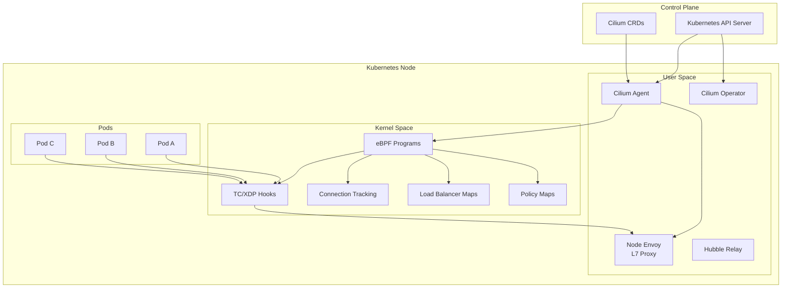

## eBPF Datapath

### eBPF とは？

eBPF（extended Berkeley Packet Filter）は、Linux カーネル内でサンドボックス化されたプログラムを実行できる技術です。カーネルを変更せずに、ネットワーキング、セキュリティ、オブザーバビリティの機能を実装できます。

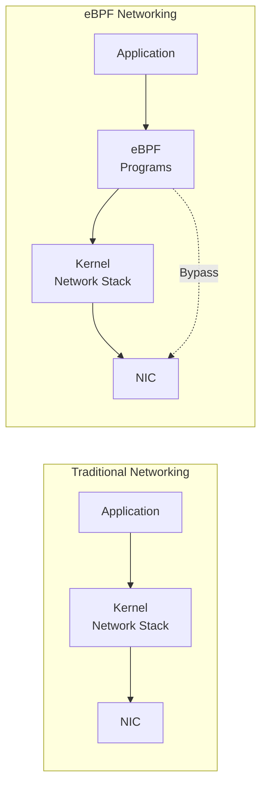

### eBPF Hook Point

Cilium は複数の eBPF Hook Point を利用します。

| Hook Point | 場所 | 目的 |
|------------|----------|---------|
| **XDP (eXpress Data Path)** | NIC Driver | 超高速パケット処理、DDoS 保護 |
| **TC (Traffic Control)** | Network Stack Entry | パケットフィルタリング、リダイレクト |
| **Socket Operations** | Socket Level | Socket 接続の高速化 |
| **cgroup** | Process Group | リソース制御、ポリシー適用 |

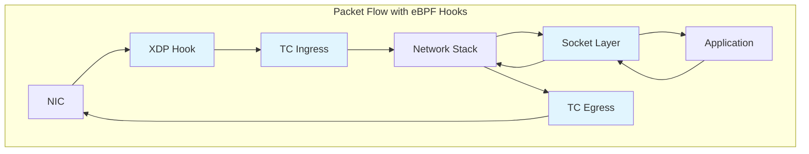

### L3/L4 処理

eBPF における L3/L4 処理は次のように動作します。

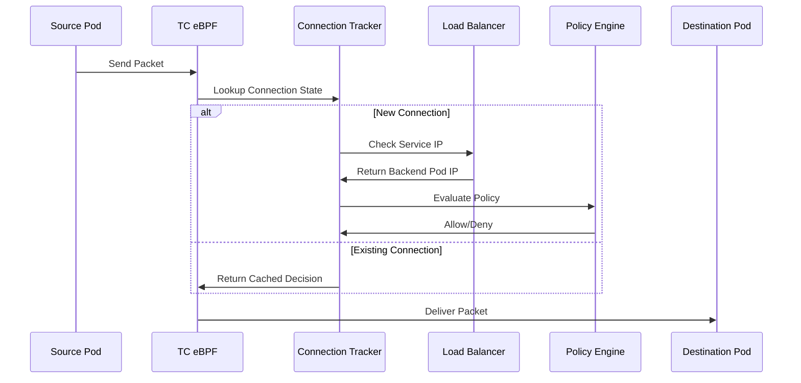

#### eBPF Map 構造

```c
// Connection Tracking Map
struct ct_entry {
    __u32 src_ip;
    __u32 dst_ip;
    __u16 src_port;
    __u16 dst_port;
    __u8  protocol;
    __u64 lifetime;
    __u32 rx_packets;
    __u32 tx_packets;
};

// Service Map
struct lb_service {
    __u32 service_ip;
    __u16 service_port;
    __u32 backend_count;
    __u32 backend_slot;
};

// Policy Map
struct policy_entry {
    __u32 identity;
    __u16 port;
    __u8  protocol;
    __u8  action;  // ALLOW, DENY, AUDIT
};
```

### kube-proxy の置き換え

Cilium の eBPF ベース Load Balancer は、kube-proxy を完全に置き換えられます。

```yaml
# Enable kube-proxy replacement during Cilium installation
kubeProxyReplacement: true

# Load balancer algorithm configuration
loadBalancer:
  algorithm: maglev  # or random
  mode: dsr          # Direct Server Return
```

**kube-proxy と Cilium eBPF の比較:**

| 機能 | kube-proxy (iptables) | Cilium eBPF |
|---------|----------------------|-------------|
| ルールの複雑さ | O(n) - Service 数に比例 | O(1) - hash map ルックアップ |
| Connection Tracking | conntrack module | eBPF CT Map |
| DSR サポート | 制限あり | 完全サポート |
| Session Affinity | iptables ベース | Maglev hashing |
| パフォーマンス | 中 | 高 |

## ノードごとの Envoy Proxy

### Sidecar と Node Proxy

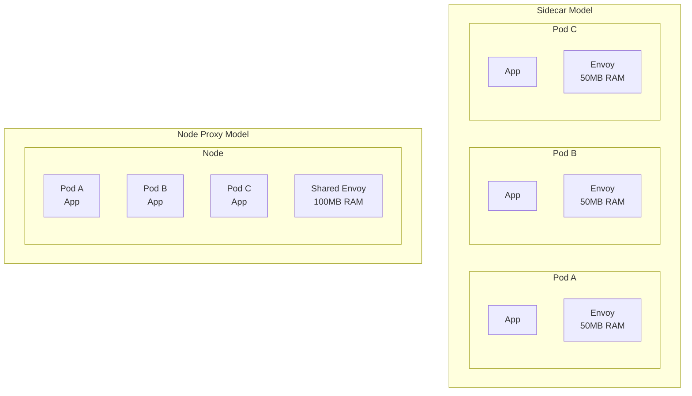

### Envoy のデプロイ方法

Cilium は DaemonSet として、ノードごとに 1 つの Envoy proxy をデプロイします。

```bash
# Check Envoy DaemonSet
kubectl get daemonset -n kube-system cilium-envoy

# Expected output
NAME           DESIRED   CURRENT   READY   UP-TO-DATE   AVAILABLE
cilium-envoy   3         3         3       3            3
```

### L7 処理フロー

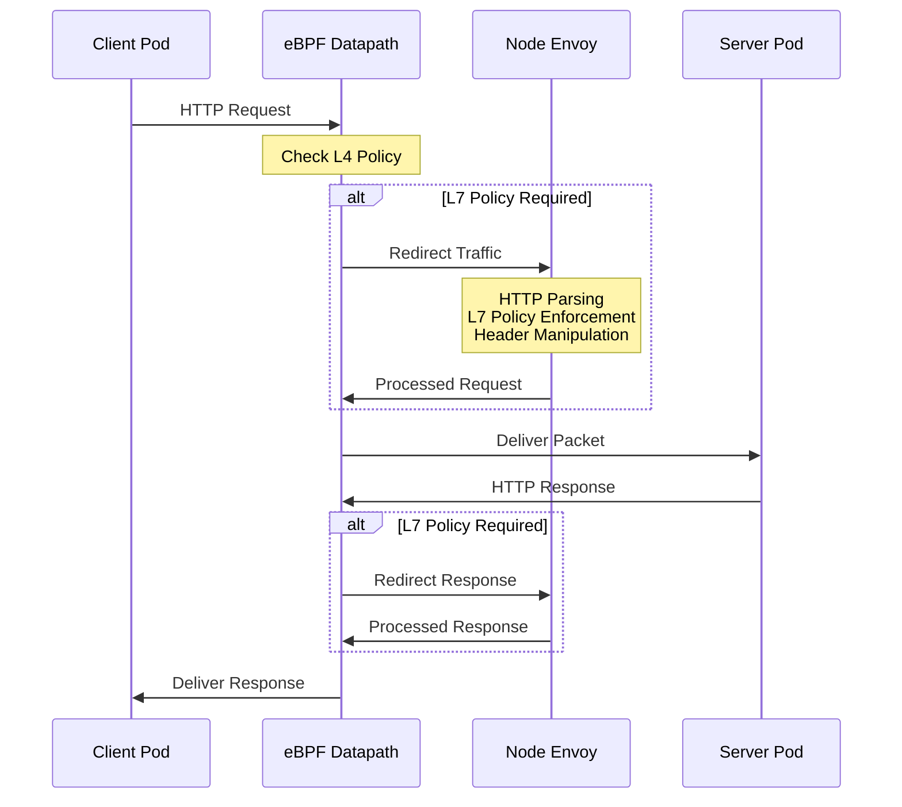

### Envoy リソース設定

```yaml
# values.yaml
envoy:
  enabled: true
  resources:
    limits:
      cpu: 2000m
      memory: 2Gi
    requests:
      cpu: 100m
      memory: 256Mi

  # Envoy concurrent connection settings
  maxConnectionsPerHost: 1000
  connectTimeout: 5s

  # Proxy protocol settings
  proxy:
    protocol:
      http2:
        enabled: true
      tls:
        enabled: true
```

## CRD モデル

### Cilium CRD 構造

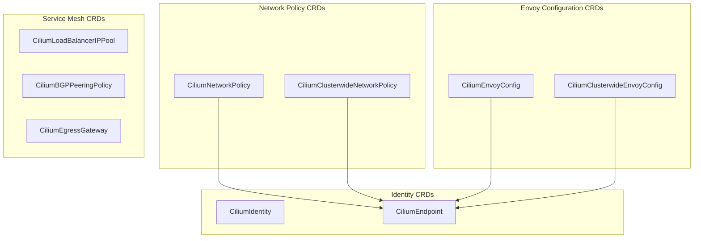

### CiliumEnvoyConfig

CiliumEnvoyConfig は Namespace スコープの Envoy 設定を定義します。

```yaml
apiVersion: cilium.io/v2
kind: CiliumEnvoyConfig
metadata:
  name: http-filter
  namespace: default
spec:
  # Services this configuration applies to
  services:
  - name: my-service
    namespace: default

  # Envoy resource definitions
  resources:
  - "@type": type.googleapis.com/envoy.config.listener.v3.Listener
    name: my-service-listener
    filter_chains:
    - filters:
      - name: envoy.filters.network.http_connection_manager
        typed_config:
          "@type": type.googleapis.com/envoy.extensions.filters.network.http_connection_manager.v3.HttpConnectionManager
          stat_prefix: my-service
          route_config:
            name: local_route
            virtual_hosts:
            - name: my-service
              domains: ["*"]
              routes:
              - match:
                  prefix: "/"
                route:
                  cluster: default/my-service
          http_filters:
          - name: envoy.filters.http.router
            typed_config:
              "@type": type.googleapis.com/envoy.extensions.filters.http.router.v3.Router
```

### CiliumClusterwideEnvoyConfig

クラスター全体の Envoy 設定:

```yaml
apiVersion: cilium.io/v2
kind: CiliumClusterwideEnvoyConfig
metadata:
  name: global-ratelimit
spec:
  # Apply to all services cluster-wide
  services:
  - name: "*"
    namespace: "*"

  resources:
  - "@type": type.googleapis.com/envoy.config.listener.v3.Listener
    name: global-listener
    filter_chains:
    - filters:
      - name: envoy.filters.network.http_connection_manager
        typed_config:
          "@type": type.googleapis.com/envoy.extensions.filters.network.http_connection_manager.v3.HttpConnectionManager
          stat_prefix: global
          http_filters:
          - name: envoy.filters.http.local_ratelimit
            typed_config:
              "@type": type.googleapis.com/envoy.extensions.filters.http.local_ratelimit.v3.LocalRateLimit
              stat_prefix: http_local_rate_limiter
              token_bucket:
                max_tokens: 1000
                tokens_per_fill: 100
                fill_interval: 1s
          - name: envoy.filters.http.router
            typed_config:
              "@type": type.googleapis.com/envoy.extensions.filters.http.router.v3.Router
```

### CiliumNetworkPolicy (L7)

L7 ルールを含む Network Policy:

```yaml
apiVersion: cilium.io/v2
kind: CiliumNetworkPolicy
metadata:
  name: l7-policy
  namespace: default
spec:
  endpointSelector:
    matchLabels:
      app: backend

  ingress:
  - fromEndpoints:
    - matchLabels:
        app: frontend
    toPorts:
    - ports:
      - port: "8080"
        protocol: TCP
      rules:
        http:
        - method: GET
          path: "/api/v1/.*"
          headers:
          - name: "X-Request-ID"
            value: ".*"
        - method: POST
          path: "/api/v1/users"
        - method: DELETE
          path: "/api/v1/users/[0-9]+"

  egress:
  - toEndpoints:
    - matchLabels:
        app: database
    toPorts:
    - ports:
      - port: "5432"
        protocol: TCP
```

## Cilium Agent と Service Mesh

### Cilium Agent の役割

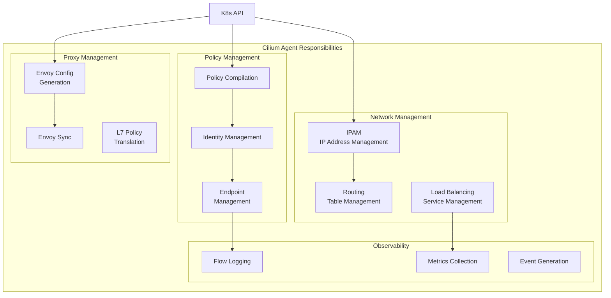

### Agent 設定

```yaml
# ConfigMap: cilium-config
apiVersion: v1
kind: ConfigMap
metadata:
  name: cilium-config
  namespace: kube-system
data:
  # Agent basic settings
  debug: "false"
  enable-ipv4: "true"
  enable-ipv6: "false"

  # Service mesh settings
  enable-l7-proxy: "true"
  enable-envoy-config: "true"

  # kube-proxy replacement
  kube-proxy-replacement: "true"

  # Observability
  enable-hubble: "true"
  hubble-listen-address: ":4244"
  hubble-metrics-server: ":9965"

  # Encryption
  enable-wireguard: "true"
  enable-ipsec: "false"
```

## Service Identity と SPIFFE

### Cilium Identity

Cilium は各 workload に一意の Identity を割り当てます。

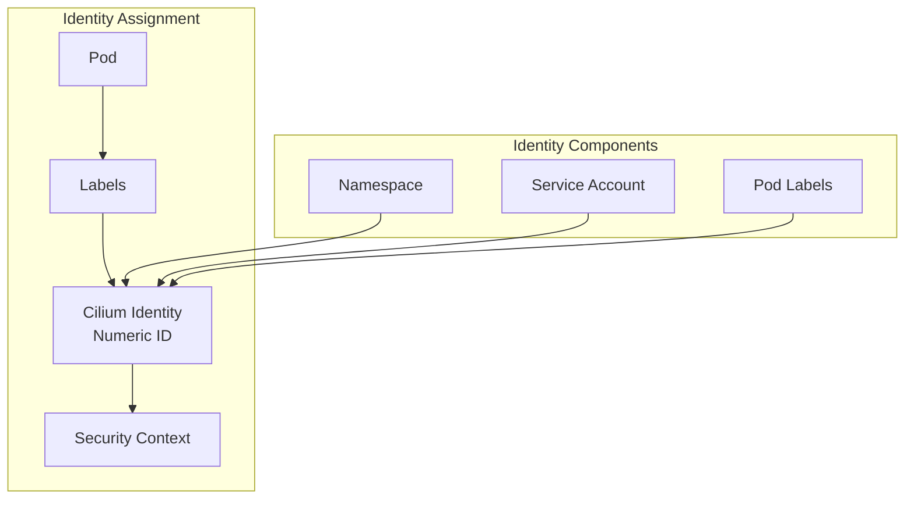

### Identity ベースの Policy

```yaml
# Check Pod's Identity
apiVersion: cilium.io/v2
kind: CiliumIdentity
metadata:
  name: "12345"
  labels:
    app: frontend
    k8s:io.kubernetes.pod.namespace: default
spec:
  security-labels:
    k8s:app: frontend
    k8s:io.kubernetes.pod.namespace: default
```

```bash
# List identities
cilium identity list

# Expected output
ID      LABELS
1       reserved:host
2       reserved:world
3       reserved:health
12345   k8s:app=frontend,k8s:io.kubernetes.pod.namespace=default
12346   k8s:app=backend,k8s:io.kubernetes.pod.namespace=default
```

### SPIFFE 統合

SPIFFE（Secure Production Identity Framework for Everyone）による workload Identity:

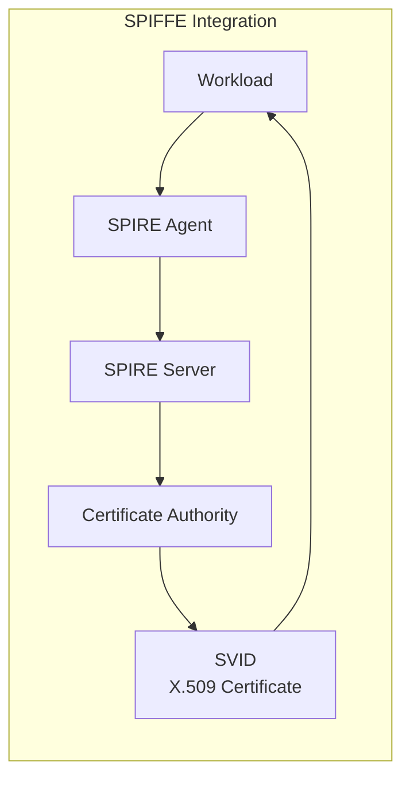

```yaml
# SPIRE integration configuration
authentication:
  mutual:
    spire:
      enabled: true
      install:
        enabled: true
        server:
          dataStorage:
            size: 1Gi
        agent:
          socketPath: /run/spire/sockets/agent.sock
```

SPIFFE ID 形式:
```
spiffe://cluster.local/ns/<namespace>/sa/<service-account>
```

## パケットフロー分析

### Pod 間通信（同一 Node）

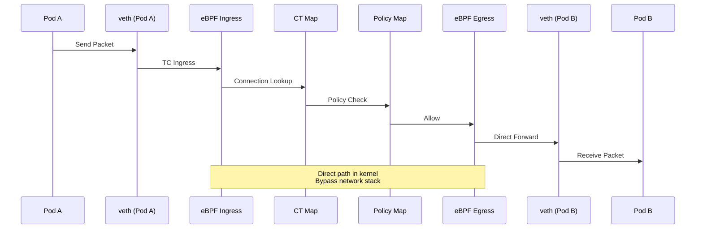

### Pod 間通信（異なる Node）

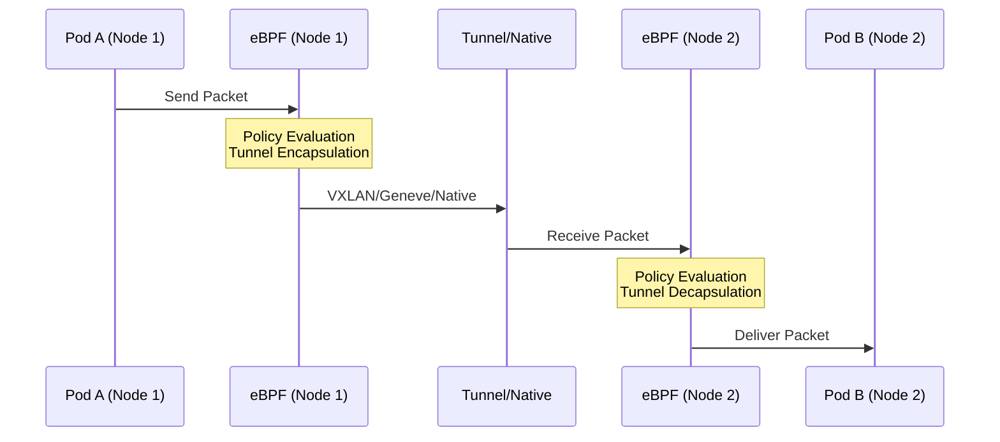

### L7 処理が必要な場合

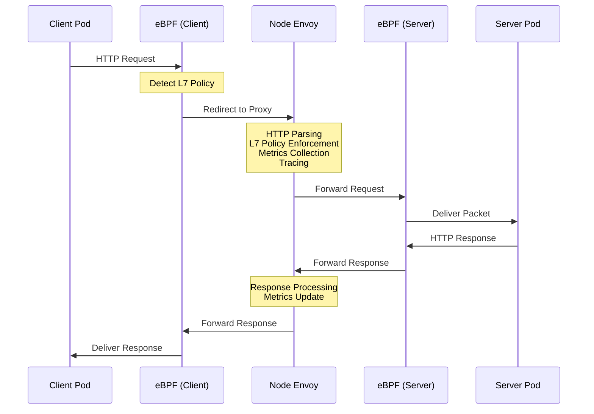

## Istio Sidecar アーキテクチャとの比較

### アーキテクチャ比較表

| 観点 | Cilium Service Mesh | Istio Sidecar |
|--------|---------------------|---------------|
| **Proxy の配置** | Node ごとに 1 つ | Pod ごとに 1 つ |
| **Proxy の種類** | eBPF + Envoy | Envoy のみ |
| **L4 処理** | Kernel（eBPF） | User space（Envoy） |
| **L7 処理** | User space（Envoy） | User space（Envoy） |
| **メモリ使用量** | ~100MB/node | ~50MB/Pod |
| **CPU 使用量** | 低 | 中～高 |
| **レイテンシー** | 0.1-0.5ms | 1-3ms |
| **設定モデル** | CiliumEnvoyConfig | VirtualService/DestinationRule |
| **mTLS 実装** | eBPF/WireGuard | Envoy |
| **Injection** | 不要 | Sidecar injection が必要 |

### レイテンシー分析

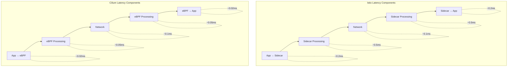

### リソース効率分析

100 Pod のクラスターの場合:

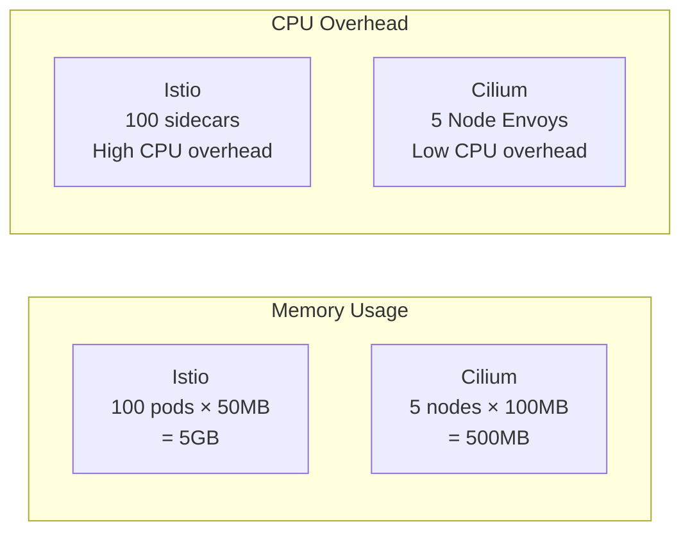

## スケーラビリティに関する考慮事項

### eBPF Map サイズ

```yaml
# Cilium ConfigMap settings
bpf-map-dynamic-size-ratio: "0.0025"
bpf-ct-global-tcp-max: "524288"
bpf-ct-global-any-max: "262144"
bpf-nat-global-max: "524288"
bpf-policy-map-max: "16384"
```

### 大規模クラスター設定

```yaml
# Large cluster (1000+ nodes) configuration
apiVersion: v1
kind: ConfigMap
metadata:
  name: cilium-config
  namespace: kube-system
data:
  # Identity-related settings
  cluster-id: "1"
  cluster-name: "production"

  # Connection tracking optimization
  bpf-ct-global-tcp-max: "1048576"
  bpf-ct-global-any-max: "524288"

  # NAT table size
  bpf-nat-global-max: "1048576"

  # Policy map size
  bpf-policy-map-max: "65536"

  # Performance optimization
  sockops-enable: "true"
  bpf-lb-sock: "true"

  # Hubble settings
  hubble-disable: "false"
  hubble-socket-path: "/var/run/cilium/hubble.sock"
```

### Node Envoy のスケーリング

```yaml
# Envoy resource scaling
envoy:
  resources:
    limits:
      cpu: 4000m
      memory: 4Gi
    requests:
      cpu: 500m
      memory: 512Mi

  # Envoy worker threads
  concurrency: 4

  # Connection limits
  perConnectionBufferLimitBytes: 32768

  # Cluster settings
  cluster:
    connectTimeout: 5s
    circuitBreakers:
      maxConnections: 10000
      maxPendingRequests: 10000
      maxRequests: 10000
```

## 次のステップ

- [Traffic Management](./02-traffic-management.md): L7 routing と traffic control を設定する
- [Security](./03-security.md): mTLS と L7 network policy を設定する
- [Observability](./04-observability.md): Hubble で Service Mesh を監視する

## 参照資料

- [Cilium Architecture Documentation](https://docs.cilium.io/en/stable/concepts/overview/)
- [eBPF Documentation](https://ebpf.io/what-is-ebpf/)
- [Envoy Proxy Architecture](https://www.envoyproxy.io/docs/envoy/latest/intro/arch_overview/arch_overview)
- [SPIFFE Specification](https://spiffe.io/docs/latest/spiffe-about/overview/)
