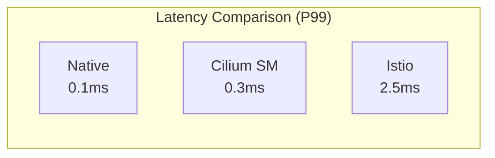
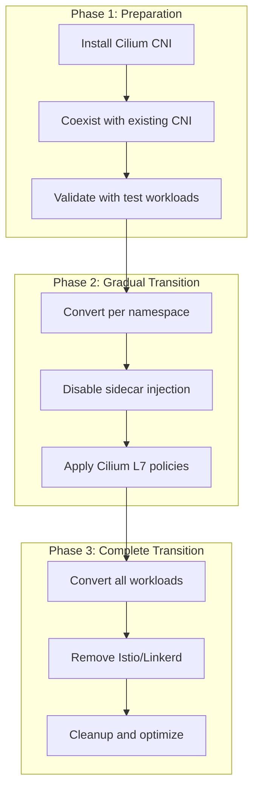
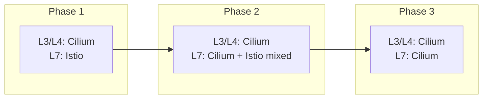

# Cilium Service Mesh のベストプラクティス

> **サポート対象バージョン**: Cilium 1.16+, Kubernetes 1.28+
> **最終更新**: February 22, 2026

## 概要

この章では、本番環境で Cilium Service Mesh を運用するためのベストプラクティスを説明します。デプロイメントのチェックリスト、リソースサイジング、パフォーマンスチューニング、sidecar mesh からの移行、アップグレード戦略、トラブルシューティングガイドを取り上げます。

## 本番デプロイメントのチェックリスト

### 必須項目

```markdown
## Infrastructure Preparation
- [ ] Kubernetes version 1.28+ confirmed
- [ ] Linux kernel 5.10+ (for eBPF features)
- [ ] Minimum 4 CPU, 8GB RAM per node
- [ ] Cilium installed as CNI
- [ ] kube-proxy disabled (optional but recommended)

## Cilium Configuration
- [ ] Cilium version 1.16+ installed
- [ ] Envoy proxy enabled
- [ ] Hubble observability enabled
- [ ] Metrics collection configured

## Security
- [ ] WireGuard or IPsec encryption enabled
- [ ] mTLS configured (SPIRE integration)
- [ ] Default deny network policies applied
- [ ] RBAC configuration verified

## Observability
- [ ] Prometheus metrics collection configured
- [ ] Grafana dashboards set up
- [ ] AlertManager alerting rules configured
- [ ] Log aggregation configured (optional)

## High Availability
- [ ] Cilium Operator replicas 2+ configured
- [ ] Hubble Relay replicas 2+ configured
- [ ] External etcd cluster (for large environments)
- [ ] PodDisruptionBudget configured
```

### 推奨される Helm values.yaml

```yaml
# production-values.yaml
# Cilium Agent settings
agent:
  resources:
    limits:
      cpu: 2000m
      memory: 2Gi
    requests:
      cpu: 500m
      memory: 512Mi

# Operator settings
operator:
  replicas: 2
  resources:
    limits:
      cpu: 1000m
      memory: 1Gi
    requests:
      cpu: 100m
      memory: 128Mi

# Envoy proxy settings
envoy:
  enabled: true
  resources:
    limits:
      cpu: 2000m
      memory: 2Gi
    requests:
      cpu: 200m
      memory: 256Mi

# Hubble settings
hubble:
  enabled: true
  relay:
    enabled: true
    replicas: 2
    resources:
      limits:
        cpu: 1000m
        memory: 1Gi
      requests:
        cpu: 100m
        memory: 128Mi
  ui:
    enabled: true
    replicas: 2
  metrics:
    enabled:
    - dns
    - drop
    - tcp
    - flow
    - http
    serviceMonitor:
      enabled: true

# kube-proxy replacement
kubeProxyReplacement: true

# Load balancer settings
loadBalancer:
  algorithm: maglev
  mode: snat

# Encryption
encryption:
  enabled: true
  type: wireguard
  nodeEncryption: true

# Mutual authentication
authentication:
  mutual:
    spire:
      enabled: true

# eBPF settings
bpf:
  masquerade: true
  clockProbe: false
  preallocateMaps: true
  tproxy: true

# IPAM
ipam:
  mode: cluster-pool
  operator:
    clusterPoolIPv4PodCIDRList:
    - "10.0.0.0/8"
    clusterPoolIPv4MaskSize: 24

# Resource limits
resources:
  limits:
    cpu: 4000m
    memory: 4Gi
  requests:
    cpu: 100m
    memory: 512Mi
```

## サイジングガイドライン

### Cluster サイズ別の推奨事項

| 規模 | Nodes | Pods | Cilium Agent | Envoy | Hubble Relay |
|------|-------|------|--------------|-------|--------------|
| 小規模 | 1-10 | <500 | 500m/512Mi | 200m/256Mi | 100m/128Mi |
| 中規模 | 10-50 | 500-2000 | 1000m/1Gi | 500m/512Mi | 200m/256Mi |
| 大規模 | 50-200 | 2000-10000 | 2000m/2Gi | 1000m/1Gi | 500m/512Mi |
| 超大規模 | 200+ | 10000+ | 4000m/4Gi | 2000m/2Gi | 1000m/1Gi |

### Cilium Agent のリソース計算

```yaml
# Memory calculation based on Pods per node
# Base: 512Mi + (Pod count * 1Mi)

# Example: 100 Pods/node
resources:
  requests:
    memory: "612Mi"  # 512 + 100
  limits:
    memory: "1224Mi" # 2x requests

# Example: 250 Pods/node
resources:
  requests:
    memory: "762Mi"  # 512 + 250
  limits:
    memory: "1524Mi"
```

### Envoy のリソース計算

```yaml
# Resources based on L7 traffic volume
# Base: 256Mi + (connections per second * 0.1Mi)

# Example: 1000 connections/sec
envoy:
  resources:
    requests:
      cpu: 500m
      memory: "356Mi"  # 256 + 100
    limits:
      cpu: 2000m
      memory: "712Mi"

# Example: 10000 connections/sec
envoy:
  resources:
    requests:
      cpu: 2000m
      memory: "1256Mi"
    limits:
      cpu: 4000m
      memory: "2512Mi"
```

### eBPF Map のサイジング

```yaml
# eBPF map settings for large clusters
bpf:
  # Connection tracking maps
  ctGlobalTcpMax: 524288  # default
  ctGlobalAnyMax: 262144  # default

  # Large cluster
  ctGlobalTcpMax: 2097152  # 2M connections
  ctGlobalAnyMax: 1048576  # 1M connections

  # NAT map
  natGlobalMax: 524288  # default
  natGlobalMax: 2097152  # large scale

  # Policy map
  policyMapMax: 16384   # default
  policyMapMax: 65536   # large scale
```

## パフォーマンスチューニング

### eBPF の最適化

```yaml
# values.yaml - performance optimization
bpf:
  # Map pre-allocation (memory efficiency)
  preallocateMaps: true

  # Socket LB (improved performance)
  lbBypassFIBLookup: true
  socketLB:
    enabled: true
    hostNamespaceOnly: true

# Kernel parameter optimization
extraConfig:
  bpf-map-dynamic-size-ratio: "0.0025"
  enable-bpf-clock-probe: "false"
```

### ネットワークスタックの最適化

```bash
# Node-level kernel parameters
sysctl -w net.core.somaxconn=65535
sysctl -w net.ipv4.tcp_max_syn_backlog=65535
sysctl -w net.core.netdev_max_backlog=65535
sysctl -w net.ipv4.tcp_fin_timeout=30
sysctl -w net.ipv4.tcp_tw_reuse=1

# Enable eBPF JIT
sysctl -w net.core.bpf_jit_enable=1
```

### Envoy のパフォーマンスチューニング

```yaml
apiVersion: cilium.io/v2
kind: CiliumEnvoyConfig
metadata:
  name: performance-tuning
spec:
  resources:
  - "@type": type.googleapis.com/envoy.config.bootstrap.v3.Bootstrap
    overload_manager:
      refresh_interval: 0.25s
      resource_monitors:
      - name: "envoy.resource_monitors.fixed_heap"
        typed_config:
          "@type": type.googleapis.com/envoy.extensions.resource_monitors.fixed_heap.v3.FixedHeapConfig
          max_heap_size_bytes: 2147483648  # 2GB

  - "@type": type.googleapis.com/envoy.config.cluster.v3.Cluster
    name: optimized-cluster
    connect_timeout: 1s

    # Connection pool optimization
    http2_protocol_options:
      max_concurrent_streams: 1000
      initial_stream_window_size: 1048576
      initial_connection_window_size: 16777216

    # Circuit breaker
    circuit_breakers:
      thresholds:
      - priority: DEFAULT
        max_connections: 100000
        max_pending_requests: 100000
        max_requests: 100000
```

### ベンチマーク結果



## Sidecar Mesh からの移行

### 移行戦略



### Istio からの移行

#### ステップ 1: Cilium のインストール（Istio と共存）

```yaml
# values.yaml - coexist with Istio
tunnel: vxlan  # or mode compatible with existing CNI
kubeProxyReplacement: false  # disable initially
envoy:
  enabled: true
hubble:
  enabled: true
```

#### ステップ 2: Namespace 単位での変換

```bash
# Disable Istio sidecar in test namespace
kubectl label namespace test-ns istio-injection=disabled

# Convert Istio policies to Cilium policies
# VirtualService -> CiliumEnvoyConfig
# AuthorizationPolicy -> CiliumNetworkPolicy
```

#### ステップ 3: Policy 変換の例

**Istio VirtualService:**
```yaml
apiVersion: networking.istio.io/v1beta1
kind: VirtualService
metadata:
  name: reviews-route
spec:
  hosts:
  - reviews
  http:
  - match:
    - headers:
        end-user:
          exact: jason
    route:
    - destination:
        host: reviews
        subset: v2
  - route:
    - destination:
        host: reviews
        subset: v1
```

**Cilium での同等設定:**
```yaml
apiVersion: cilium.io/v2
kind: CiliumEnvoyConfig
metadata:
  name: reviews-route
spec:
  services:
  - name: reviews
    namespace: default
  backendServices:
  - name: reviews-v1
    namespace: default
  - name: reviews-v2
    namespace: default
  resources:
  - "@type": type.googleapis.com/envoy.config.listener.v3.Listener
    name: reviews-listener
    filter_chains:
    - filters:
      - name: envoy.filters.network.http_connection_manager
        typed_config:
          "@type": type.googleapis.com/envoy.extensions.filters.network.http_connection_manager.v3.HttpConnectionManager
          route_config:
            virtual_hosts:
            - name: reviews
              domains: ["*"]
              routes:
              - match:
                  prefix: "/"
                  headers:
                  - name: "end-user"
                    exact_match: "jason"
                route:
                  cluster: default/reviews-v2
              - match:
                  prefix: "/"
                route:
                  cluster: default/reviews-v1
```

**Istio AuthorizationPolicy:**
```yaml
apiVersion: security.istio.io/v1beta1
kind: AuthorizationPolicy
metadata:
  name: httpbin
spec:
  selector:
    matchLabels:
      app: httpbin
  rules:
  - from:
    - source:
        principals: ["cluster.local/ns/default/sa/sleep"]
    to:
    - operation:
        methods: ["GET"]
        paths: ["/info*"]
```

**Cilium での同等設定:**
```yaml
apiVersion: cilium.io/v2
kind: CiliumNetworkPolicy
metadata:
  name: httpbin
spec:
  endpointSelector:
    matchLabels:
      app: httpbin
  ingress:
  - fromEndpoints:
    - matchLabels:
        k8s:io.kubernetes.pod.namespace: default
        k8s:io.cilium.k8s.policy.serviceaccount: sleep
    toPorts:
    - ports:
      - port: "80"
        protocol: TCP
      rules:
        http:
        - method: GET
          path: "/info.*"
```

### ロールバック計画

```yaml
# Rollback ConfigMap
apiVersion: v1
kind: ConfigMap
metadata:
  name: migration-rollback
data:
  rollback.sh: |
    #!/bin/bash
    # 1. Disable Cilium L7 policies
    kubectl delete ciliumnetworkpolicy --all -n $NAMESPACE

    # 2. Re-enable Istio sidecar
    kubectl label namespace $NAMESPACE istio-injection=enabled

    # 3. Restart Pods
    kubectl rollout restart deployment -n $NAMESPACE
```

## 段階的な導入

### L3/L4 のみを使用する（Istio L7 を維持）

```yaml
# Use Cilium as L3/L4 CNI only
# Keep Istio as L7 service mesh

# values.yaml
envoy:
  enabled: false  # Disable Cilium L7

# Use Cilium for network policies
# Keep Istio for L7 routing
```

### 段階的な L7 移行



## モニタリングとアラートの設定

### コアメトリクス

```yaml
# PrometheusRule
apiVersion: monitoring.coreos.com/v1
kind: PrometheusRule
metadata:
  name: cilium-service-mesh
spec:
  groups:
  - name: cilium.critical
    rules:
    # Cilium Agent status
    - alert: CiliumAgentDown
      expr: up{job="cilium-agent"} == 0
      for: 5m
      labels:
        severity: critical

    # Envoy proxy status
    - alert: CiliumEnvoyDown
      expr: cilium_proxy_redirects == 0
      for: 5m
      labels:
        severity: critical

    # High packet drops
    - alert: HighPacketDropRate
      expr: rate(cilium_drop_count_total[5m]) > 1000
      for: 5m
      labels:
        severity: warning

  - name: cilium.performance
    rules:
    # High conntrack usage
    - alert: HighConntrackUsage
      expr: cilium_datapath_conntrack_active / cilium_datapath_conntrack_max > 0.8
      for: 10m
      labels:
        severity: warning

    # BPF map pressure
    - alert: HighBPFMapPressure
      expr: cilium_bpf_map_pressure > 0.8
      for: 10m
      labels:
        severity: warning
```

### ダッシュボード設定

```json
{
  "dashboard": {
    "title": "Cilium Service Mesh Production",
    "panels": [
      {
        "title": "Agent Health",
        "type": "stat",
        "targets": [{"expr": "sum(cilium_agent_up)"}]
      },
      {
        "title": "Request Rate",
        "type": "graph",
        "targets": [{"expr": "sum(rate(hubble_http_requests_total[5m])) by (destination)"}]
      },
      {
        "title": "Error Rate",
        "type": "graph",
        "targets": [{"expr": "sum(rate(hubble_http_responses_total{status=~\"5..\"}[5m])) / sum(rate(hubble_http_responses_total[5m])) * 100"}]
      },
      {
        "title": "P99 Latency",
        "type": "graph",
        "targets": [{"expr": "histogram_quantile(0.99, sum(rate(hubble_http_request_duration_seconds_bucket[5m])) by (le))"}]
      }
    ]
  }
}
```

## アップグレード戦略

### ローリングアップグレード

```bash
# 1. Check new version
helm repo update
helm search repo cilium/cilium --versions

# 2. Review upgrade plan
helm diff upgrade cilium cilium/cilium \
  --namespace kube-system \
  --version 1.17.0 \
  -f values.yaml

# 3. Execute rolling upgrade
helm upgrade cilium cilium/cilium \
  --namespace kube-system \
  --version 1.17.0 \
  -f values.yaml \
  --wait

# 4. Verify status
cilium status
cilium connectivity test
```

### Canary アップグレード

```yaml
# Node label-based canary upgrade
# Apply new version to subset of nodes only

# Step 1: Label canary nodes
kubectl label nodes node-canary-1 cilium-upgrade=canary

# Step 2: Deploy new version to canary nodes
# (using separate DaemonSet)
```

### アップグレードのロールバック

```bash
# Rollback to previous version
helm rollback cilium <REVISION> --namespace kube-system

# Or downgrade to specific version
helm upgrade cilium cilium/cilium \
  --namespace kube-system \
  --version 1.15.0 \
  -f values.yaml
```

## トラブルシューティングガイド

### よくある問題

#### 1. Pod ネットワーク接続の失敗

```bash
# Diagnostic commands
cilium status
cilium connectivity test

# Check endpoint status
cilium endpoint list

# Check policies
cilium policy get

# Check BPF maps
cilium bpf ct list global
```

#### 2. L7 Policy が適用されない

```bash
# Check Envoy status
kubectl exec -n kube-system ds/cilium -- cilium status | grep Envoy

# Check proxy redirects
cilium service list

# Check Envoy configuration
kubectl exec -n kube-system ds/cilium -- \
  cilium envoy config dump
```

#### 3. レイテンシが高い

```bash
# Connection tracking status
cilium bpf ct list global | wc -l

# BPF map utilization
cilium metrics list | grep bpf_map

# Envoy stats
kubectl exec -n kube-system ds/cilium -- \
  curl localhost:9901/stats
```

### デバッグモード

```yaml
# Enable debug logging
debug:
  enabled: true
  verbose:
    flow: true
    kvstore: true
    envoy: true
    policy: true
```

### ログ収集

```bash
# Cilium logs
kubectl logs -n kube-system -l k8s-app=cilium -c cilium-agent

# Envoy logs
kubectl logs -n kube-system -l k8s-app=cilium -c cilium-envoy

# Collect full bundle
cilium-bugtool
```

## EKS 固有の推奨事項

### VPC CNI の統合

```yaml
# Cilium ENI mode on EKS
eni:
  enabled: true

ipam:
  mode: eni

egressMasqueradeInterfaces: eth0
routingMode: native

# AWS Security Groups integration
enableAWSSecurityGroups: true
```

### Node Group の設定

```yaml
# EKS managed node groups
# AMI: Amazon Linux 2 (AL2)
# Kernel: 5.10+

# Recommended instance types
# - m6i.xlarge (production)
# - c6i.xlarge (compute-intensive)
# - r6i.xlarge (memory-intensive)
```

### IAM の設定

```yaml
# IAM policy for Cilium Operator
{
  "Version": "2012-10-17",
  "Statement": [
    {
      "Effect": "Allow",
      "Action": [
        "ec2:CreateNetworkInterface",
        "ec2:DeleteNetworkInterface",
        "ec2:DescribeNetworkInterfaces",
        "ec2:DescribeSubnets",
        "ec2:DescribeSecurityGroups",
        "ec2:DescribeVpcs",
        "ec2:ModifyNetworkInterfaceAttribute",
        "ec2:AssignPrivateIpAddresses",
        "ec2:UnassignPrivateIpAddresses"
      ],
      "Resource": "*"
    }
  ]
}
```

## まとめ

### 主な推奨事項

1. **リソースサイジング**: Cluster サイズに応じて Agent と Envoy のリソースを設定する
2. **セキュリティ**: WireGuard 暗号化と mTLS を有効にする
3. **可観測性**: Hubble と Prometheus のメトリクス収集は不可欠である
4. **段階的な導入**: 既存の mesh から段階的に移行する
5. **モニタリング**: コアメトリクスのアラートを設定する

### 追加リソース

- [Cilium 公式ドキュメント](https://docs.cilium.io/)
- [Cilium Slack コミュニティ](https://cilium.herokuapp.com/)
- [Cilium GitHub](https://github.com/cilium/cilium)
- [eBPF 学習リソース](https://ebpf.io/)

## 参考資料

- [Cilium 本番環境ガイド](https://docs.cilium.io/en/stable/operations/performance/)
- [Cilium トラブルシューティング](https://docs.cilium.io/en/stable/operations/troubleshooting/)
- [Cilium アップグレードガイド](https://docs.cilium.io/en/stable/operations/upgrade/)
- [Istio から Cilium への移行](https://docs.cilium.io/en/stable/network/servicemesh/istio-migration/)
