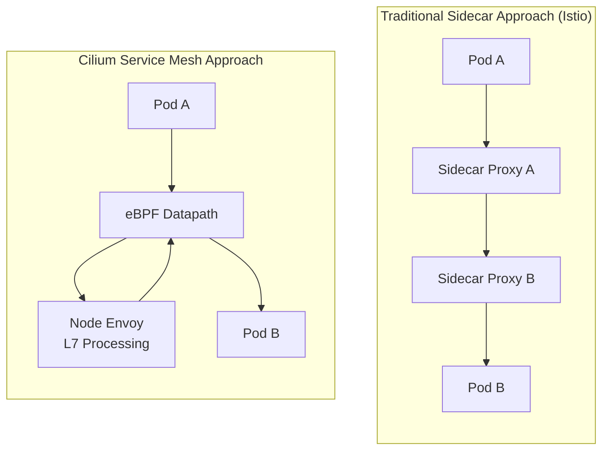
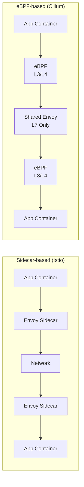
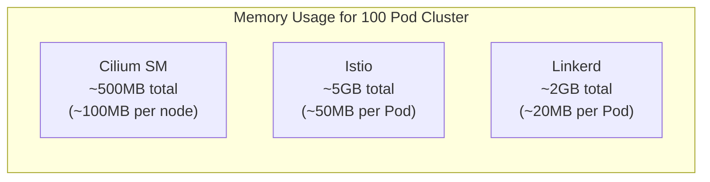

# Cilium Service Mesh の概要

> **サポート対象バージョン**: Cilium 1.16+, Kubernetes 1.28+
> **最終更新**: February 22, 2026

## はじめに

Cilium Service Mesh は、eBPF ベースで Sidecar を使用しない Service Mesh ソリューションです。従来の Sidecar Proxy アプローチとは異なり、Cilium Service Mesh は Linux kernel の eBPF テクノロジーを活用してネットワークトラフィックを処理し、Node ごとに共有される単一の Envoy Proxy を使用して L7 機能を提供します。

### 主な価値提案

Cilium Service Mesh の中核的な価値は、**統合されたネットワーキングおよび Service Mesh プラットフォーム**です。

1. **リソース効率**: Sidecar Proxy のオーバーヘッドなしで Service Mesh 機能を提供
2. **低レイテンシー**: eBPF による kernel レベルのパケット処理
3. **シンプルな運用**: CNI と Service Mesh を単一コンポーネントに統合
4. **段階的な導入**: 既存の Cilium CNI ユーザーは Service Mesh へ容易に拡張可能
5. **強力なセキュリティ**: SPIFFE ベースの Identity と透過的な mTLS をサポート

## Sidecar と Sidecarless アーキテクチャ



### アーキテクチャ比較図



## Service Mesh の比較

| 機能 | Cilium Service Mesh | Istio | Linkerd |
|---------|---------------------|-------|---------|
| **アーキテクチャ** | eBPF + Node Envoy | Sidecar Envoy | Sidecar linkerd2-proxy |
| **Proxy** | Node ごとに 1 つ（L7 のみ） | Pod ごとに 1 つ | Pod ごとに 1 つ |
| **メモリオーバーヘッド** | 低い（~50-100MB/node） | 高い（~50MB/Pod） | 中程度（~20MB/Pod） |
| **CPU オーバーヘッド** | 非常に低い | 高い | 中程度 |
| **レイテンシー** | ~0.1-0.5ms | ~1-3ms | ~0.5-1ms |
| **L4 処理** | eBPF（kernel） | Envoy（userspace） | linkerd2-proxy |
| **L7 処理** | Envoy | Envoy | linkerd2-proxy |
| **mTLS** | 透過的（eBPF/WireGuard） | Sidecar Envoy | linkerd2-proxy |
| **CNI 統合** | Native | 別途 CNI が必要 | 別途 CNI が必要 |
| **インストールの複雑さ** | 低い | 高い | 中程度 |
| **Gateway API** | 完全対応 | 完全対応 | 部分対応 |
| **Network Policy** | CiliumNetworkPolicy（L3-L7） | AuthorizationPolicy | Server（L4） |
| **可観測性** | Hubble（Native） | Kiali、Jaeger | Linkerd Viz |

### リソース使用量の比較



## Cilium Service Mesh を選択するタイミング

### 適したユースケース

1. **すでに Cilium CNI を使用している場合**
   - 既存の Cilium への投資を活用
   - 追加コンポーネントなしで Service Mesh 機能を有効化
   - 統合された運用とモニタリング

2. **リソース効率が重要な場合**
   - 大規模 Cluster で Sidecar のオーバーヘッドを排除
   - Node リソースの最適化が必要
   - コスト削減が重要

3. **低レイテンシーが不可欠な場合**
   - 高性能な Workload
   - リアルタイムアプリケーション
   - 金融・取引システム

4. **シンプルな運用を求める場合**
   - CNI + Service Mesh 用の単一コンポーネント
   - Sidecar Injection 管理が不要
   - Upgrade とトラブルシューティングを簡素化

### 適さないユースケース

1. **既存の Istio への大規模な投資がある場合**
   - 複雑な Istio Policy をすでに実装済み
   - Istio 固有の機能に依存

2. **広範な Envoy Extension が必要な場合**
   - Sidecar ごとのカスタム Filter
   - Pod ごとの詳細な Proxy 設定

3. **複雑な Multi-cluster Mesh**
   - Istio の成熟した Multi-cluster 機能が必要

## 前提条件

### Cilium CNI のインストールを確認

Cilium Service Mesh を使用するには、最初に Cilium CNI をインストールする必要があります。

```bash
# Check Cilium status
cilium status

# Expected output
    /¯¯\
 /¯¯\__/¯¯\    Cilium:             OK
 \__/¯¯\__/    Operator:           OK
 /¯¯\__/¯¯\    Envoy DaemonSet:    OK
 \__/¯¯\__/    Hubble Relay:       OK
    \__/       ClusterMesh:        disabled

# Check Cilium version
cilium version
```

### EKS への Cilium のインストール

```bash
# Add Helm repository
helm repo add cilium https://helm.cilium.io/
helm repo update

# Install Cilium on EKS (with service mesh features)
helm install cilium cilium/cilium --version 1.16.0 \
  --namespace kube-system \
  --set eni.enabled=true \
  --set ipam.mode=eni \
  --set egressMasqueradeInterfaces=eth0 \
  --set routingMode=native \
  --set kubeProxyReplacement=true \
  --set loadBalancer.algorithm=maglev \
  --set envoy.enabled=true \
  --set hubble.enabled=true \
  --set hubble.relay.enabled=true \
  --set hubble.ui.enabled=true
```

### 必要なコンポーネント

| コンポーネント | 役割 | 必須 |
|-----------|------|----------|
| Cilium Agent | eBPF プログラム管理、Policy の適用 | 必須 |
| Cilium Operator | CRD 管理、IPAM | 必須 |
| Envoy (cilium-envoy) | L7 Proxy 処理 | Service Mesh では必須 |
| Hubble | 可観測性 | 推奨 |
| Hubble Relay | UI/CLI 接続 | 推奨 |
| Hubble UI | 可視化 | 任意 |

## Service Mesh 機能の有効化

### 基本的な有効化

```yaml
# values.yaml
envoy:
  enabled: true

# Default configuration for L7 proxy policy enforcement
proxy:
  enabled: true
```

### 完全な Service Mesh 設定

```yaml
# values.yaml - Full service mesh features
envoy:
  enabled: true
  resources:
    limits:
      cpu: 2000m
      memory: 2Gi
    requests:
      cpu: 100m
      memory: 256Mi

# Hubble observability
hubble:
  enabled: true
  relay:
    enabled: true
  ui:
    enabled: true
  metrics:
    enabled:
      - dns
      - drop
      - tcp
      - flow
      - icmp
      - http

# Mutual authentication (mTLS)
authentication:
  mutual:
    spire:
      enabled: true
      install:
        enabled: true

# Ingress Controller
ingressController:
  enabled: true
  loadbalancerMode: shared

# Gateway API
gatewayAPI:
  enabled: true
```

## ドキュメント構成

このセクションは以下のように構成されています。

| ドキュメント | 説明 |
|----------|-------------|
| [アーキテクチャ](./01-architecture.md) | eBPF Datapath、Node Envoy、CRD モデル |
| [トラフィック管理](./02-traffic-management.md) | L7 Routing、Load Balancing、Traffic Splitting |
| [セキュリティ](./03-security.md) | mTLS、Network Policy、暗号化 |
| [可観測性](./04-observability.md) | Hubble、Metrics、Service Map |
| [Ingress と Gateway](./05-ingress-gateway.md) | Ingress Controller、Gateway API |
| [ベストプラクティス](./06-best-practices.md) | Production Deployment、Migration、Tuning |

## クイックスタート

### 1. Service Mesh 機能を確認

```bash
# Check Envoy DaemonSet
kubectl get daemonset -n kube-system cilium-envoy

# Check Cilium service mesh status
cilium status | grep -E "Envoy|Hubble"
```

### 2. サンプルアプリケーションをデプロイ

```yaml
# bookinfo.yaml
apiVersion: v1
kind: Namespace
metadata:
  name: bookinfo
---
apiVersion: apps/v1
kind: Deployment
metadata:
  name: productpage
  namespace: bookinfo
spec:
  replicas: 1
  selector:
    matchLabels:
      app: productpage
  template:
    metadata:
      labels:
        app: productpage
    spec:
      containers:
      - name: productpage
        image: docker.io/istio/examples-bookinfo-productpage-v1:1.18.0
        ports:
        - containerPort: 9080
---
apiVersion: v1
kind: Service
metadata:
  name: productpage
  namespace: bookinfo
spec:
  selector:
    app: productpage
  ports:
  - port: 9080
    targetPort: 9080
```

### 3. L7 Policy を適用

```yaml
# l7-policy.yaml
apiVersion: cilium.io/v2
kind: CiliumNetworkPolicy
metadata:
  name: productpage-l7
  namespace: bookinfo
spec:
  endpointSelector:
    matchLabels:
      app: productpage
  ingress:
  - fromEndpoints:
    - matchLabels:
        app: frontend
    toPorts:
    - ports:
      - port: "9080"
        protocol: TCP
      rules:
        http:
        - method: GET
          path: "/productpage"
        - method: GET
          path: "/health"
```

### 4. トラフィックを観察

```bash
# Observe L7 traffic with Hubble CLI
hubble observe --namespace bookinfo -f

# Filter HTTP requests
hubble observe --namespace bookinfo --protocol http

# Check inter-service flows
hubble observe --namespace bookinfo --to-service productpage
```

## 次のステップ

1. **[Architecture](./01-architecture.md)**: Cilium Service Mesh の内部動作を理解します。
2. **[Traffic Management](./02-traffic-management.md)**: L7 Routing と Traffic Control を設定します。
3. **[Security](./03-security.md)**: mTLS と L7 Network Policy を設定します。

## 参考資料

- [Cilium 公式ドキュメント](https://docs.cilium.io/)
- [Cilium Service Mesh ガイド](https://docs.cilium.io/en/stable/network/servicemesh/)
- [eBPF 入門](https://ebpf.io/)
- [Gateway API ドキュメント](https://gateway-api.sigs.k8s.io/)
