# 基本概念

このドキュメントでは、Istio の中核となる概念とアーキテクチャを説明します。Istio を効果的に使用するには、これらの基本概念を理解することが重要です。

## 目次

1. [背景と歴史](02-basic-concepts.md#background-and-history)
2. [Istio を選ぶ理由](02-basic-concepts.md#why-istio)
3. [Istio アーキテクチャ](02-basic-concepts.md#istio-architecture)
4. [デプロイメントモード: Sidecar と Ambient](02-basic-concepts.md#deployment-modes-sidecar-vs-ambient)
5. [コアリソース](02-basic-concepts.md#core-resources)
6. [トラフィック管理の概念](02-basic-concepts.md#traffic-management-concepts)
7. [セキュリティの概念](02-basic-concepts.md#security-concepts)
8. [可観測性の概念](02-basic-concepts.md#observability-concepts)
9. [Namespace と Service Mesh](02-basic-concepts.md#namespaces-and-service-mesh)
10. [次のステップ](02-basic-concepts.md#next-steps)

## 背景と歴史

### Service Mesh の誕生

#### Microservices の課題

2010 年代初頭、企業はモノリシックアプリケーションを Microservices に分割し始めました。

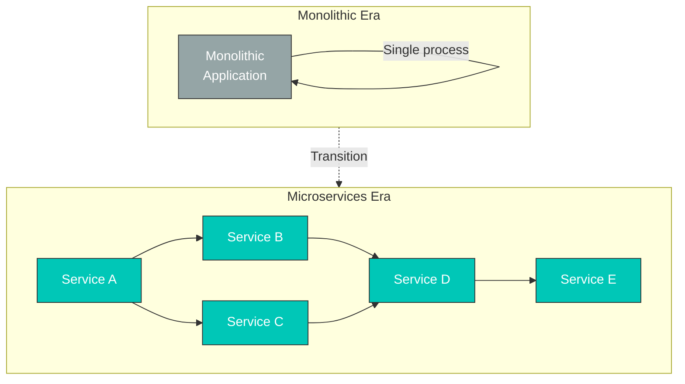

**新たな問題**:

| 問題                            | 説明                                         | 影響                           |
| ------------------------------- | -------------------------------------------- | ------------------------------ |
| **サービス間通信**              | ネットワーク呼び出しの増加                   | レイテンシー、障害伝播         |
| **可観測性**                    | 分散トレーシングが必要                       | デバッグの困難さ               |
| **セキュリティ**                | サービス間の認証・暗号化                     | mTLS 実装の複雑さ              |
| **トラフィック制御**            | Canary デプロイ、A/B テスト                  | アプリケーションコードの変更   |
| **障害処理**                    | Circuit Breaker、Retry                       | サービスごとの実装             |

#### 初期の解決策: ライブラリ

**問題点**:

* 言語ごとにライブラリを開発する必要がある（Java 用の Hystrix、Go 用の別ライブラリなど）
* アプリケーションコードとの密結合
* 更新時にはすべてのサービスを再デプロイする必要がある
* 複雑なバージョン管理

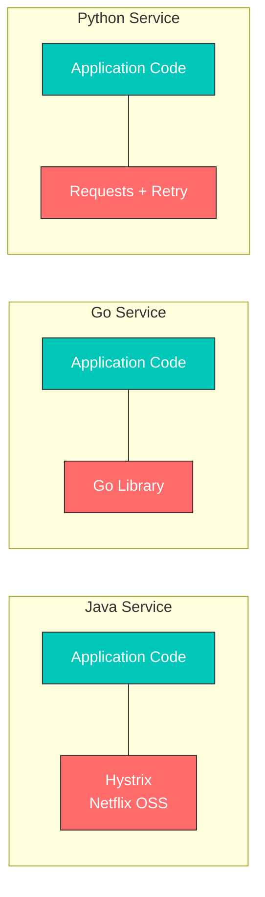

**Service Mesh の考え方**: ネットワークロジックをアプリケーションからインフラストラクチャ層へ移動する

### Envoy Proxy の誕生

#### Lyft の課題

**2015 年の Lyft** は、次の問題を抱えていました。

* 200 以上の Microservices を運用
* 多様な言語とフレームワーク（Python、Go、Java など）
* 既存の Proxy（HAProxy、NGINX）では不十分
  * 動的な設定変更が困難
  * 可観測性が不足
  * 高度なルーティング機能が限定的

#### Matt Klein と Envoy

**Matt Klein**（Lyft のエンジニア）は、2016 年に Envoy をオープンソース化しました。

**Envoy が解決した問題**:

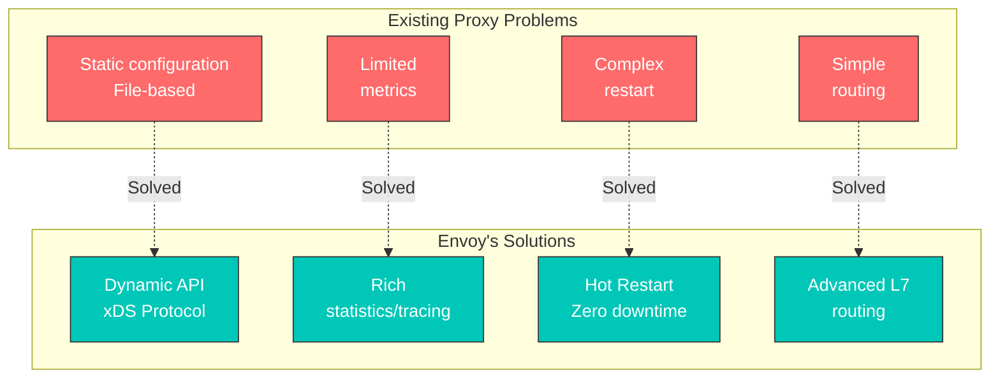

**Envoy の主な機能**:

1. **プロセス外アーキテクチャ**: アプリケーションとは別プロセス
2. **xDS API**: 動的な設定更新
3. **L7 Proxy**: HTTP/2、gRPC、WebSocket をサポート
4. **可観測性**: 詳細なメトリクス、トレーシング、ログ
5. **パフォーマンス**: C++ で記述され、高性能

#### CNCF への採用

**タイムライン**:

* **2016 年 9 月**: Envoy をオープンソース化
* **2017 年 9 月**: CNCF プロジェクト（Incubating）として採用
* **2018 年 11 月**: CNCF Graduated プロジェクトに昇格

### Istio の誕生と歴史

#### Google、IBM、Lyft の協業

**2017 年 5 月**、Google、IBM、Lyft は協力して Istio を発表しました。

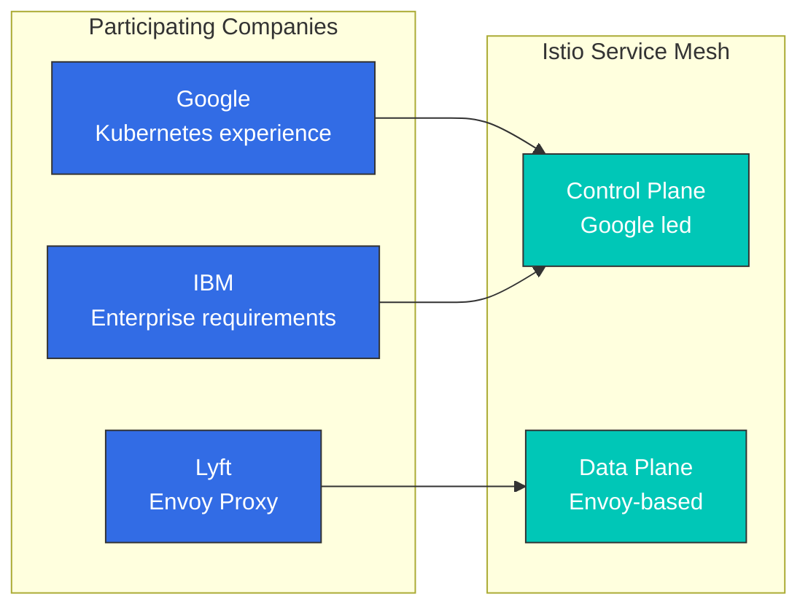

**各社の貢献**:

| 企業       | 主な貢献             | 理由                           |
| ---------- | -------------------- | ------------------------------ |
| **Google** | Control Plane の設計 | Borg、Kubernetes の経験        |
| **IBM**    | Enterprise 機能      | Enterprise 顧客の要件          |
| **Lyft**   | Envoy Proxy          | 本番環境で実証済みの Proxy     |

#### Istio のバージョン履歴

**主なマイルストーン**:

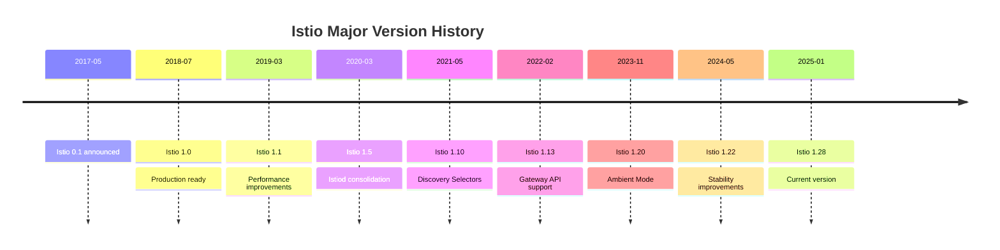

**バージョン 1.5（2020 年 3 月）- 重要な転換点**:

以前のアーキテクチャ（Istio 1.4 以前）:

```
Separated into individual components:
- Mixer (policy/telemetry)
- Pilot (traffic management)
- Citadel (certificate management)
- Galley (configuration validation)
```

新しいアーキテクチャ（Istio 1.5 以降、現在の 1.28）:

```
Istiod (consolidated into single binary)
├── Pilot functionality (Service Discovery, Traffic Management)
├── Citadel functionality (Certificate Authority, Identity)
└── Galley functionality (Configuration Validation)

Mixer completely removed (functionality moved to Envoy)
```

**変更の理由**:

* 複雑性の削減（4 コンポーネント → 1）
* パフォーマンスの向上（Mixer の削除によりレイテンシーを 50% 削減）
* 運用の簡素化（単一プロセスの管理）
* リソース効率（メモリ、CPU 使用量の削減）

## Istio を選ぶ理由

Kubernetes はコンテナオーケストレーションを提供しますが、Microservices 間の複雑な通信管理には制限があります。Istio は、これらの問題を解決するための Service Mesh ソリューションです。

### Microservices の課題

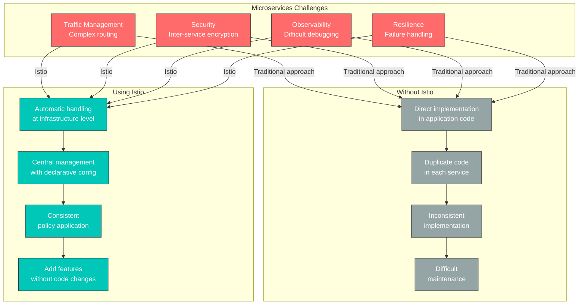

### Istio が提供する中核的な価値

#### 1. トラフィック管理

**問題**: 新しいバージョンをデプロイする際に、トラフィックを安全に移行したい。

**Istio のソリューション**:

```yaml
# Canary deployment without code changes
apiVersion: networking.istio.io/v1
kind: VirtualService
metadata:
  name: reviews
spec:
  hosts:
  - reviews
  http:
  - route:
    - destination:
        host: reviews
        subset: v1
      weight: 90  # Existing version 90%
    - destination:
        host: reviews
        subset: v2
      weight: 10  # New version 10%
```

**利点**:

* アプリケーションコードの変更が不要
* トラフィック分割をリアルタイムで調整可能
* 自動ロールバックが可能
* A/B テスト、Blue/Green デプロイをサポート

#### 2. セキュリティ

**問題**: サービス間通信を暗号化および認証したい。

**Istio のソリューション**:

```yaml
# Automatic mTLS enablement
apiVersion: security.istio.io/v1
kind: PeerAuthentication
metadata:
  name: default
  namespace: istio-system
spec:
  mtls:
    mode: STRICT  # Automatic encryption for all inter-service communication
```

**利点**:

* 証明書の自動発行と更新
* Service Identity の自動検証
* きめ細かな権限制御
* Zero Trust ネットワークの実装

#### 3. 可観測性

**問題**: 数十の Microservices にまたがるリクエストフローの追跡が困難。

**Istio のソリューション**:

* メトリクスの自動生成（Latency、Traffic、Errors、Saturation）
* 分散トレーシング
* Service トポロジーの可視化

**利点**:

* ボトルネックの自動特定
* エラーの根本原因を迅速に特定
* Service ステータスのリアルタイム監視

#### 4. レジリエンス

**問題**: 1 つの Service の障害がシステム全体に伝播する。

**Istio のソリューション**:

```yaml
# Automatic Circuit Breaker configuration
apiVersion: networking.istio.io/v1
kind: DestinationRule
metadata:
  name: reviews
spec:
  host: reviews
  trafficPolicy:
    outlierDetection:
      consecutiveErrors: 5
      interval: 30s
      baseEjectionTime: 30s
```

**利点**:

* 障害の分離（Circuit Breaker）
* 自動 Retry と Timeout
* 異常なインスタンスの自動除外
* トラフィック制限（Rate Limiting）

### Istio を使用するタイミング

**✅ Istio が適している場合:**

1. **Microservices アーキテクチャ**
   * 10 個以上の Service
   * Service 間の複雑な依存関係
   * 頻繁なデプロイ
2. **高度なトラフィック管理が必要**
   * Canary デプロイ、A/B テスト
   * きめ細かなルーティング制御
   * Traffic Mirroring
3. **強力なセキュリティ要件**
   * サービス間暗号化が必須
   * きめ細かなアクセス制御
   * 規制遵守
4. **可観測性とデバッグ**
   * 複雑なサービス間問題の追跡
   * パフォーマンスボトルネックの特定
   * SLO/SLA の監視

**❌ Istio が過剰となる可能性がある場合:**

1. **シンプルなアプリケーション**
   * 少数の Service（5 未満）
   * シンプルな要件
   * Kubernetes Ingress で十分
2. **リソース制約**
   * 小規模な Cluster
   * リソースオーバーヘッドを許容できない
   * Sidecar のメモリコストが負担
3. **運用能力の不足**
   * 学習時間が不足
   * 専任の Platform Team がいない
   * よりシンプルなソリューションを優先

### 代替手段との比較

#### Kubernetes Ingress と Istio

| 機能              | Kubernetes Ingress | Istio                             |
| ----------------- | ------------------ | --------------------------------- |
| **対象範囲**      | 外部 → Cluster     | 外部 + 内部のサービス間通信       |
| **ルーティング**  | 基本（Path、Host） | 高度（Header、Cookie など）       |
| **mTLS**          | 手動設定           | 自動                              |
| **可観測性**      | 限定的             | 豊富                              |
| **複雑性**        | 低                 | 高                                |
| **ユースケース**  | シンプルなアプリ   | Microservices                     |

#### AWS VPC Lattice と Istio

詳細な比較については、[AWS 統合](04-aws-integration.md#istio-vs-other-solutions-comparison)ドキュメントを参照してください。

**概要**:

* **VPC Lattice**: AWS マネージド、シンプル、VPC/Account をまたぐ通信
* **Istio**: オープンソース、強力な機能、Kubernetes 専用、きめ細かな制御

#### Linkerd と Istio

| 特性               | Istio     | Linkerd            |
| ------------------ | --------- | ------------------ |
| **複雑性**         | 高        | 低                 |
| **機能**           | 非常に豊富 | コア機能のみ       |
| **リソース**       | 高        | 低                 |
| **学習曲線**       | 急        | 緩やか             |
| **コミュニティ**   | 大        | 小                 |

**選択ガイド**:

* 高度な機能と柔軟性が必要 → **Istio**
* シンプルで軽量な Mesh が必要 → **Linkerd**

## デプロイメントモード: Sidecar と Ambient

Istio は、**Sidecar Mode** と **Ambient Mode** の 2 つのデプロイメントモードをサポートします。

### Sidecar Mode（デフォルト）

各アプリケーション Pod に Envoy Proxy を Sidecar コンテナとして注入します。

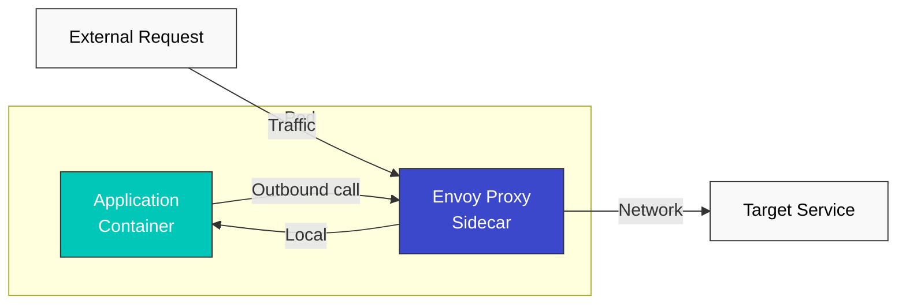

**利点:**

* 成熟しており安定している
* すべての Istio 機能をサポート
* Pod ごとのきめ細かな制御

**欠点:**

* リソースオーバーヘッド（Pod ごとに Envoy）
* 起動時間の増加（Init Container）
* 複雑な権限設定（iptables）

### Ambient Mode（新しいアプローチ）

Sidecar を使用せず、Node レベルでトラフィックを処理します。

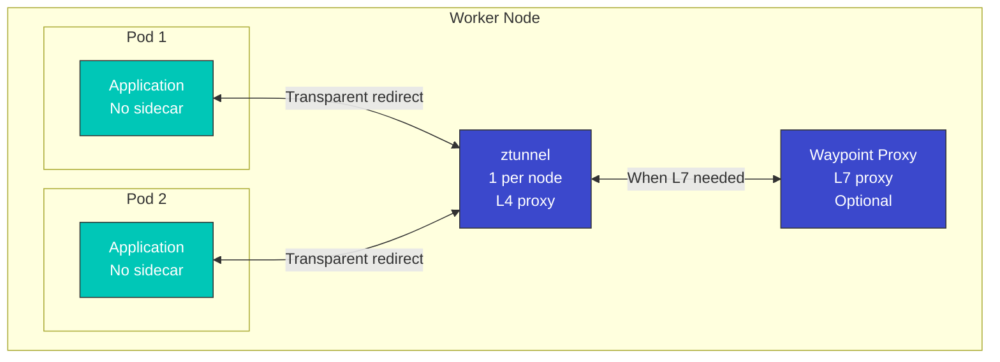

**利点:**

* 低いリソース使用量（Node ごとに 1 つ）
* Pod の高速な起動
* シンプルな運用
* L7 機能を段階的に適用可能

**欠点:**

* 比較的新しい技術（成熟度が低い）
* 一部の高度な機能に制限がある
* Pod ごとのきめ細かな制御が難しい

### 比較表

| 特性                       | Sidecar Mode                | Ambient Mode                   |
| -------------------------- | --------------------------- | ------------------------------ |
| **リソース使用量**         | 高（Pod ごと）              | 低（Node ごと）                |
| **起動時間**               | 遅い（Init Container）      | 速い                           |
| **運用の複雑性**           | 高                          | 低                             |
| **L4 機能**                | サポート済み                | サポート済み                   |
| **L7 機能**                | 完全サポート                | 任意（Waypoint）               |
| **成熟度**                 | 高                          | 中                             |
| **移行**                   | -                           | 既存の Sidecar から移行可能    |
| **推奨用途**               | 高度な L7 機能が必要        | リソース効率を優先             |

### 選択ガイド

**Sidecar Mode を選択する場合:**

* すべての Istio 機能を活用する必要がある
* Pod ごとのきめ細かなポリシー制御が必要
* 本番環境で実証済みの安定性が必要

**Ambient Mode を選択する場合:**

* リソース効率が重要
* シンプルな L4 機能のみが必要
* L7 機能を段階的に追加する予定

**詳細**については、[Advanced: Ambient Mode](advanced/01-ambient-mode.md)ドキュメントを参照してください。

## Istio アーキテクチャ

Istio は、**Control Plane** と **Data Plane** の 2 つの主要コンポーネントで構成されます。

| コンポーネント                | 説明                                                                                               |
| ---------------------------- | -------------------------------------------------------------------------------------------------- |
| **Control Plane (istiod)**   | Service Discovery、設定配布、証明書管理を担う中央制御システム                                      |
| **Data Plane (Envoy Proxy)** | 各 Pod に Sidecar としてデプロイされ、実際のトラフィック（ルーティング、mTLS、メトリクス）を処理   |

**詳細なアーキテクチャ構造、内部動作原理、トラフィックインターセプトの仕組み**については、[アーキテクチャドキュメント](03-architecture.md)を参照してください。

## コアリソース

Istio は、設定を管理するために Kubernetes Custom Resource Definitions（CRD）を使用します。

### 1. VirtualService

VirtualService は、リクエストを Service にルーティングする方法を定義します。

```yaml
apiVersion: networking.istio.io/v1
kind: VirtualService
metadata:
  name: reviews-route
spec:
  hosts:
  - reviews  # Target service
  http:
  - match:
    - headers:
        end-user:
          exact: jason
    route:
    - destination:
        host: reviews
        subset: v2  # Route specific user to v2
  - route:
    - destination:
        host: reviews
        subset: v1  # Route to v1 by default
```

**主な機能**:

* Path ベースのルーティング（Path、Header、Query Parameter）
* トラフィック分割（Canary、A/B テスト）
* Retry、Timeout、Fault Injection
* URL Rewrite、Header 操作

### 2. DestinationRule

DestinationRule は、Service の Subset（バージョン）を定義し、トラフィックポリシーを適用します。

```yaml
apiVersion: networking.istio.io/v1
kind: DestinationRule
metadata:
  name: reviews-destination
spec:
  host: reviews
  trafficPolicy:
    loadBalancer:
      simple: LEAST_REQUEST  # Load balancing algorithm
    connectionPool:
      tcp:
        maxConnections: 100
      http:
        http1MaxPendingRequests: 50
        maxRequestsPerConnection: 2
    outlierDetection:
      consecutiveErrors: 5
      interval: 30s
      baseEjectionTime: 30s
  subsets:
  - name: v1
    labels:
      version: v1
  - name: v2
    labels:
      version: v2
  - name: v3
    labels:
      version: v3
```

**主な機能**:

* Service バージョン（Subset）の定義
* Load Balancing アルゴリズム
* Connection Pool の設定
* Circuit Breaker（Outlier Detection）
* TLS 設定

### 3. Gateway

Gateway は、Mesh に流入する外部トラフィックを管理します。

```yaml
apiVersion: networking.istio.io/v1
kind: Gateway
metadata:
  name: bookinfo-gateway
spec:
  selector:
    istio: ingressgateway  # Select Ingress Gateway pod
  servers:
  - port:
      number: 80
      name: http
      protocol: HTTP
    hosts:
    - "bookinfo.example.com"
  - port:
      number: 443
      name: https
      protocol: HTTPS
    tls:
      mode: SIMPLE
      credentialName: bookinfo-credential  # TLS certificate
    hosts:
    - "bookinfo.example.com"
```

**主な機能**:

* 外部トラフィックのエントリポイントを定義
* Host、Port、Protocol の設定
* TLS 終端
* SNI ルーティング

### 4. ServiceEntry

ServiceEntry により、Mesh 外部の Service を内部 Service と同様に使用できます。

```yaml
apiVersion: networking.istio.io/v1
kind: ServiceEntry
metadata:
  name: external-api
spec:
  hosts:
  - api.external.com
  ports:
  - number: 443
    name: https
    protocol: HTTPS
  location: MESH_EXTERNAL
  resolution: DNS
```

**主な機能**:

* 外部 Service の登録
* 外部 Service のトラフィック制御
* Egress トラフィック管理

### 5. PeerAuthentication

PeerAuthentication は、Service 間の認証ポリシーを定義します。

```yaml
apiVersion: security.istio.io/v1
kind: PeerAuthentication
metadata:
  name: default
  namespace: default
spec:
  mtls:
    mode: STRICT  # STRICT, PERMISSIVE, DISABLE
```

### 6. AuthorizationPolicy

AuthorizationPolicy は、Service へのアクセス権限を定義します。

```yaml
apiVersion: security.istio.io/v1
kind: AuthorizationPolicy
metadata:
  name: allow-ratings
  namespace: default
spec:
  selector:
    matchLabels:
      app: ratings
  action: ALLOW
  rules:
  - from:
    - source:
        principals: ["cluster.local/ns/default/sa/reviews"]
    to:
    - operation:
        methods: ["GET"]
```

## トラフィック管理の概念

### トラフィックルーティングフロー

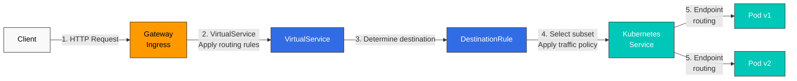

### トラフィック分割（Canary デプロイ）

```yaml
apiVersion: networking.istio.io/v1
kind: VirtualService
metadata:
  name: reviews-canary
spec:
  hosts:
  - reviews
  http:
  - route:
    - destination:
        host: reviews
        subset: v1
      weight: 90  # 90% of traffic
    - destination:
        host: reviews
        subset: v2
      weight: 10  # 10% of traffic (canary)
```

### Circuit Breaker

```yaml
apiVersion: networking.istio.io/v1
kind: DestinationRule
metadata:
  name: reviews-circuit-breaker
spec:
  host: reviews
  trafficPolicy:
    connectionPool:
      tcp:
        maxConnections: 100
      http:
        http1MaxPendingRequests: 10
        maxRequestsPerConnection: 2
    outlierDetection:
      consecutiveErrors: 5
      interval: 30s
      baseEjectionTime: 30s
      maxEjectionPercent: 50
```

## セキュリティの概念

### mTLS（相互 TLS）

Istio は、Service 間通信を自動的に暗号化します。

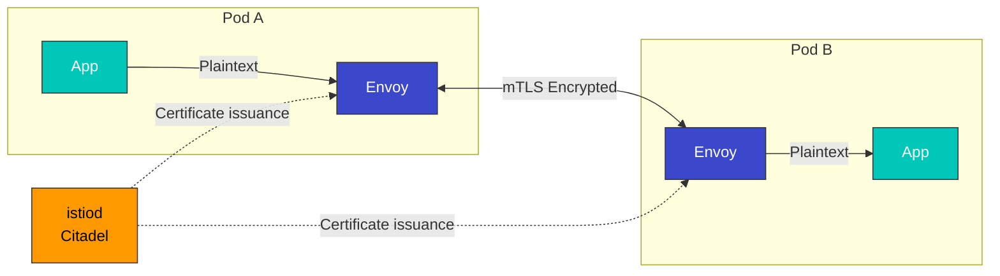

**mTLS モード**:

* **STRICT**: mTLS のみ許可
* **PERMISSIVE**: mTLS と平文の両方を許可（移行用）
* **DISABLE**: mTLS を無効化

### 認証と認可

```yaml
# JWT Authentication
apiVersion: security.istio.io/v1
kind: RequestAuthentication
metadata:
  name: jwt-auth
spec:
  jwtRules:
  - issuer: "https://accounts.google.com"
    jwksUri: "https://www.googleapis.com/oauth2/v3/certs"
---
# Authorization Policy
apiVersion: security.istio.io/v1
kind: AuthorizationPolicy
metadata:
  name: require-jwt
spec:
  action: DENY
  rules:
  - from:
    - source:
        notRequestPrincipals: ["*"]
```

## 可観測性の概念

Istio は、メトリクス、ログ、トレースを自動的に生成します。

### 自動生成されるメトリクス

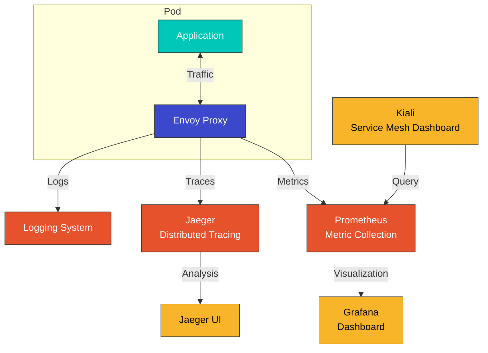

### 主なメトリクス

| メトリクス                            | 説明                 |
| ------------------------------------- | -------------------- |
| `istio_requests_total`                | 総リクエスト数       |
| `istio_request_duration_milliseconds` | リクエストレイテンシー |
| `istio_request_bytes`                 | リクエストサイズ     |
| `istio_response_bytes`                | レスポンスサイズ     |
| `istio_tcp_connections_opened_total`  | TCP 接続数           |

### 分散トレーシング

```yaml
# Enable tracing in Envoy
apiVersion: install.istio.io/v1alpha1
kind: IstioOperator
spec:
  meshConfig:
    enableTracing: true
    defaultConfig:
      tracing:
        sampling: 100.0  # 100% sampling
        zipkin:
          address: jaeger-collector.istio-system:9411
```

## Namespace と Service Mesh

### Namespace の分離

```yaml
# Per-namespace mTLS policy
apiVersion: security.istio.io/v1
kind: PeerAuthentication
metadata:
  name: default
  namespace: production
spec:
  mtls:
    mode: STRICT
---
# Per-namespace authorization policy
apiVersion: security.istio.io/v1
kind: AuthorizationPolicy
metadata:
  name: deny-all
  namespace: production
spec:
  action: DENY
  rules:
  - {}
```

### Service Mesh のスコープ

```bash
# Include only specific namespaces in the mesh
kubectl label namespace default istio-injection=enabled
kubectl label namespace staging istio-injection=enabled

# Exclude specific namespace
kubectl label namespace kube-system istio-injection=disabled
```

### マルチテナンシー

```yaml
# Restrict mesh scope with Sidecar resource
apiVersion: networking.istio.io/v1
kind: Sidecar
metadata:
  name: default
  namespace: production
spec:
  egress:
  - hosts:
    - "production/*"  # Only production namespace accessible
    - "istio-system/*"
```

## VM Workload の登録

Istio では、Kubernetes Pod だけでなく **Virtual Machine（VM）Workload** も Service Mesh に登録できます。これにより、レガシーアプリケーションや Cluster 外部の Service でも、Istio のトラフィック管理、セキュリティ、可観測性機能を利用できます。

### VM Workload が必要な理由

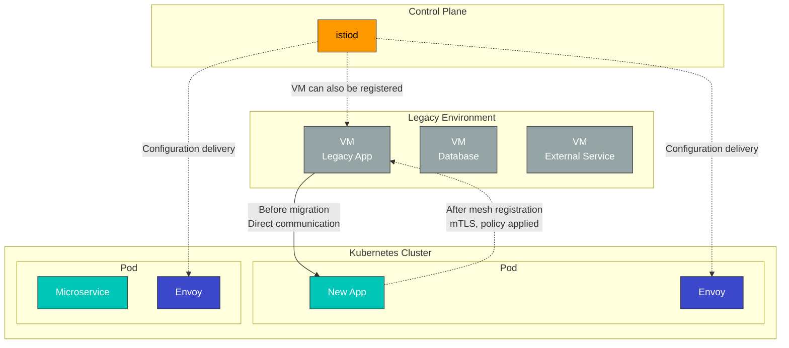

**ユースケース**:

* レガシーアプリケーションの段階的な移行
* Database Server を Mesh に含める
* Cluster 外部の Service の統合
* ハイブリッドクラウド環境の構成

### VM 登録アーキテクチャ

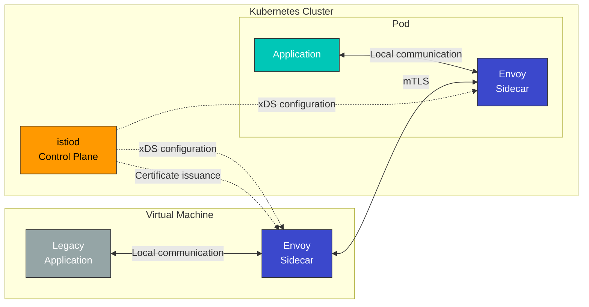

### WorkloadEntry リソース

VM Workload は、**WorkloadEntry** リソースで登録します。

```yaml
apiVersion: networking.istio.io/v1
kind: WorkloadEntry
metadata:
  name: legacy-database
  namespace: default
spec:
  address: 192.168.1.100  # VM IP address
  labels:
    app: mysql
    version: v5.7
  serviceAccount: database-sa
  ports:
    mysql: 3306
```

**WorkloadEntry の主要フィールド**:

* `address`: VM IP アドレス
* `labels`: Service Selector と一致
* `serviceAccount`: mTLS 認証用の Service Account
* `ports`: 公開する Port の定義

### ServiceEntry との統合

WorkloadEntry は ServiceEntry とともに使用し、VM Service を Mesh に登録します。

```yaml
# Define service with ServiceEntry
apiVersion: networking.istio.io/v1
kind: ServiceEntry
metadata:
  name: legacy-database
spec:
  hosts:
  - database.legacy.com
  ports:
  - number: 3306
    name: mysql
    protocol: TCP
  location: MESH_INTERNAL  # Register as internal mesh service
  resolution: STATIC
  workloadSelector:
    labels:
      app: mysql
---
# Register VM instance with WorkloadEntry
apiVersion: networking.istio.io/v1
kind: WorkloadEntry
metadata:
  name: mysql-vm-1
  namespace: default
spec:
  address: 192.168.1.100
  labels:
    app: mysql
    version: v5.7
  serviceAccount: mysql-sa
```

### VM 登録と Multi-Cluster の比較

| 機能                       | VM Workload 登録          | Multi-Cluster                  | Kubernetes Pod      |
| -------------------------- | ------------------------- | ------------------------------ | ------------------- |
| **Workload の場所**        | Cluster 外部の VM         | 別の Kubernetes Cluster        | Cluster 内部        |
| **Envoy のインストール**   | 手動インストール          | 自動（Sidecar）                | 自動（Sidecar）     |
| **登録方法**               | WorkloadEntry             | ServiceEntry + EndpointSlice   | Service + Pod       |
| **mTLS**                   | サポート済み              | サポート済み                   | サポート済み        |
| **Service Discovery**      | 手動（IP 指定）           | 自動                           | 自動                |
| **ユースケース**           | レガシーアプリ、DB        | Multi-cloud、災害復旧          | Cloud-native アプリ |
| **運用の複雑性**           | 高                        | 中                             | 低                  |

### VM 登録の利点

#### 1. 段階的な移行

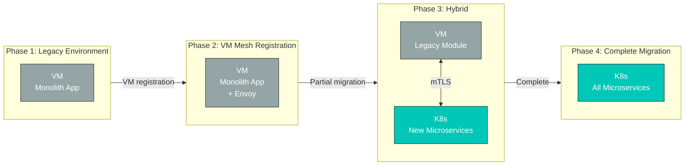

**利点**:

* 既存の VM アプリケーションを変更せずに Mesh へ統合
* Kubernetes へ段階的に移行
* 移行中も一貫したセキュリティと可観測性を維持

#### 2. 統一されたセキュリティポリシー

```yaml
# mTLS policy applied to both VMs and pods
apiVersion: security.istio.io/v1
kind: PeerAuthentication
metadata:
  name: default
  namespace: default
spec:
  mtls:
    mode: STRICT  # Enforce mTLS for both VMs and pods
---
# VM database access control
apiVersion: security.istio.io/v1
kind: AuthorizationPolicy
metadata:
  name: database-access
  namespace: default
spec:
  selector:
    matchLabels:
      app: mysql  # WorkloadEntry label
  action: ALLOW
  rules:
  - from:
    - source:
        principals: ["cluster.local/ns/default/sa/app-sa"]
    to:
    - operation:
        methods: ["*"]
```

#### 3. 一貫した可観測性

VM Workload は、Kubernetes Pod と同じメトリクス、ログ、分散トレーシングを提供します。

```promql
# Unified metric query for VMs and pods
sum(rate(istio_requests_total{destination_workload="mysql-vm-1"}[5m]))

# Error rate from VM
sum(rate(istio_requests_total{destination_workload="mysql-vm-1",response_code="500"}[5m]))
/
sum(rate(istio_requests_total{destination_workload="mysql-vm-1"}[5m]))
```

### VM 登録の制限事項

1. **Envoy の手動インストール**: VM に Envoy Proxy を手動でインストールして設定する必要がある
2. **ネットワーク接続性**: VM と Kubernetes Cluster 間のネットワーク接続が必要
3. **証明書管理**: Service Account 証明書を VM にデプロイする必要がある
4. **運用負荷**: VM 上の Envoy のバージョン管理と更新が必要
5. **Auto-scaling の制限**: Kubernetes HPA のような Auto-scaling はない

### 実践的な使用例

#### シナリオ: レガシー Database の統合

```yaml
# 1. Define database service with ServiceEntry
apiVersion: networking.istio.io/v1
kind: ServiceEntry
metadata:
  name: legacy-postgres
  namespace: production
spec:
  hosts:
  - postgres.production.svc.cluster.local
  addresses:
  - 240.240.1.10  # Virtual IP
  ports:
  - number: 5432
    name: postgresql
    protocol: TCP
  location: MESH_INTERNAL
  resolution: STATIC
  workloadSelector:
    labels:
      app: postgres
      tier: database
---
# 2. Register VM instance with WorkloadEntry
apiVersion: networking.istio.io/v1
kind: WorkloadEntry
metadata:
  name: postgres-vm-1
  namespace: production
spec:
  address: 10.0.1.100  # Actual VM IP
  labels:
    app: postgres
    tier: database
    version: v13
  serviceAccount: postgres-sa
  ports:
    postgresql: 5432
---
# 3. Access control policy
apiVersion: security.istio.io/v1
kind: AuthorizationPolicy
metadata:
  name: postgres-access-control
  namespace: production
spec:
  selector:
    matchLabels:
      app: postgres
  action: ALLOW
  rules:
  - from:
    - source:
        namespaces: ["production"]
        principals: ["cluster.local/ns/production/sa/api-service"]
    to:
    - operation:
        ports: ["5432"]
```

**結果**:

* Kubernetes Pod は `postgres.production.svc.cluster.local` 経由で Database にアクセス
* VM と Pod 間の mTLS 暗号化を自動化
* アクセス制御ポリシーを適用
* メトリクスと分散トレーシングを自動収集

### Workload 登録の比較まとめ

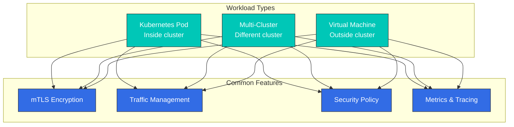

Istio の柔軟な Workload 登録機能により、次を実現できます。

* **Kubernetes Pod**: Cloud-native アプリケーション
* **Multi-Cluster**: Multi-cloud、リージョン分散、災害復旧
* **Virtual Machine**: レガシーアプリ、Database、ハイブリッド環境

すべての Workload は、一貫したセキュリティ、トラフィック管理、可観測性機能を利用できます。

## 次のステップ

これで Istio の基本概念を理解できました。次のドキュメントを通じて、実際の使用方法を学びましょう。

### コア機能

1. [**トラフィック管理**](traffic-management/)
   * Gateway と VirtualService の使用方法
   * DestinationRule と Subset の定義
   * ServiceEntry と WorkloadEntry（VM 登録）
   * 高度なルーティングパターン（Canary、A/B テスト）
   * Traffic Mirroring と Shadowing
2. [**セキュリティ**](security/)
   * mTLS 設定と PeerAuthentication
   * 認証（RequestAuthentication、JWT）
   * 認可（AuthorizationPolicy）
   * セキュリティポリシー管理
   * 外部認証の統合
3. [**可観測性**](/broken/pages/HT0uW6gT7EfVN0LF8wU5)
   * メトリクス収集（Prometheus）
   * 分散トレーシング（Jaeger、Zipkin）
   * ログ設定
   * Kiali Service Mesh の可視化
   * Grafana Dashboard
4. [**レジリエンス**](resilience/)
   * Circuit Breaker パターン
   * Retry と Timeout の設定
   * Rate Limiting
   * Outlier Detection
   * Fault Injection テスト

### 高度なトピック

5. [**高度なトピック**](advanced/)
   * Ambient Mode（Sidecar なしの Mesh）
   * Multi-Cluster の設定
   * EnvoyFilter のカスタマイズ
   * DNS Proxy と Caching
   * VM Workload の詳細設定
   * WASM Plugin の開発

## 参考資料

* [Istio 公式ドキュメント - 概念](https://istio.io/latest/docs/concepts/)
* [Istio 公式ドキュメント - トラフィック管理](https://istio.io/latest/docs/concepts/traffic-management/)
* [Istio 公式ドキュメント - セキュリティ](https://istio.io/latest/docs/concepts/security/)
* [Istio 公式ドキュメント - 可観測性](https://istio.io/latest/docs/concepts/observability/)
* [Envoy Proxy 公式ドキュメント](https://www.envoyproxy.io/docs/envoy/latest/)
