# アーキテクチャ

> **対応バージョン**: Istio 1.28+ **API バージョン**: `networking.istio.io/v1`, `security.istio.io/v1` **最終更新**: February 19, 2026

このドキュメントでは、Istio の内部アーキテクチャとネットワーキングの仕組みを詳しく説明します。

**背景と歴史**については、[基本概念](02-basic-concepts.md#background-and-history)のドキュメントを参照してください。

**重要な変更点（Istio 1.5+）**:

* Pilot、Citadel、Galley は**もはや個別のコンポーネントではありません**
* これらは Istiod（`pilot-discovery`）という**単一バイナリ**に統合されました
* Pilot/Citadel/Galley という用語は、**機能を表す歴史的な名称**を指します

## 目次

1. [Istio アーキテクチャ概要](03-architecture.md#istio-architecture-overview)
2. [Control Plane: Istiod](03-architecture.md#control-plane-istiod)
3. [Data Plane: Envoy Proxy](03-architecture.md#data-plane-envoy-proxy)
4. [Sidecar インジェクションの仕組み](03-architecture.md#sidecar-injection-mechanism)
5. [iptables とトラフィックのインターセプト](03-architecture.md#iptables-and-traffic-interception)
6. [DNS 処理の仕組み](03-architecture.md#dns-processing-mechanism)
7. [xDS API 通信](03-architecture.md#xds-api-communication)
8. [Sidecar リソースによる最適化](03-architecture.md#optimization-with-sidecar-resource)

## Istio アーキテクチャ概要

### 全体構造

### Control Plane と Data Plane

| カテゴリ        | Control Plane (Istiod)                        | Data Plane (Envoy)        |
| --------------- | --------------------------------------------- | ------------------------- |
| **役割**        | ポリシー管理、設定配布                        | 実際のトラフィック処理    |
| **配置場所**    | 個別の Pod（通常 1～3 個）                    | すべてのアプリケーション Pod |
| **言語**        | Go                                            | C++                       |
| **負荷**        | 低                                            | 高（すべてのトラフィック）|
| **スケーラビリティ** | 水平スケーリング（HA）                    | 自動（Pod ごとに 1 個）   |

## Control Plane: Istiod

### Istiod の内部構造

**重要**: Istio 1.5 以降、Pilot、Citadel、Galley は**個別のコンポーネントではなく、Istiod の内部機能**です。

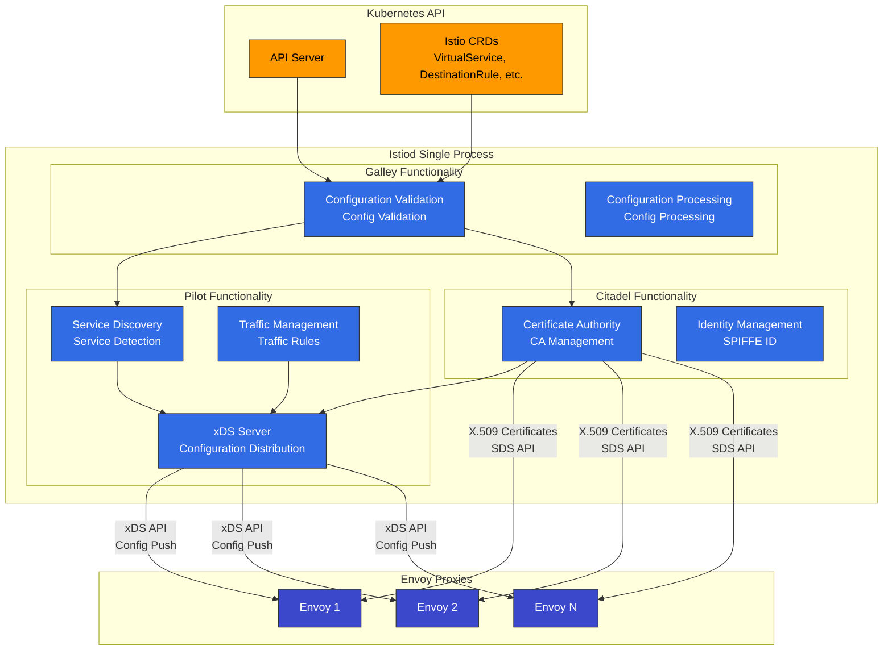

### Istiod の主な機能

**注記**: 以下の機能は、Istio 1.28 では Istiod 内に統合されています。歴史的な名称（Pilot、Citadel、Galley）は機能を説明するために使用されています。

#### 1. Service Discovery（Pilot 機能）

```yaml
# Kubernetes Service detection
apiVersion: v1
kind: Service
metadata:
  name: reviews
spec:
  selector:
    app: reviews
  ports:
  - port: 9080
```

Istiod は以下を追跡します:

* Kubernetes Service
* Endpoint（Pod IP）
* Pod の状態変更
* 外部 Service（ServiceEntry）

#### 2. Traffic Management（Pilot 機能）

Istio CRD を Envoy 設定に変換します:

```yaml
# VirtualService (user-defined)
apiVersion: networking.istio.io/v1
kind: VirtualService
metadata:
  name: reviews
spec:
  hosts:
  - reviews
  http:
  - route:
    - destination:
        host: reviews
        subset: v1
      weight: 90
    - destination:
        host: reviews
        subset: v2
      weight: 10
```

↓ Istiod が Envoy 設定に変換 ↓

```json
{
  "route_config": {
    "weighted_clusters": {
      "clusters": [
        {"name": "outbound|9080|v1|reviews", "weight": 90},
        {"name": "outbound|9080|v2|reviews", "weight": 10}
      ]
    }
  }
}
```

#### 3. 証明書管理（Citadel 機能）

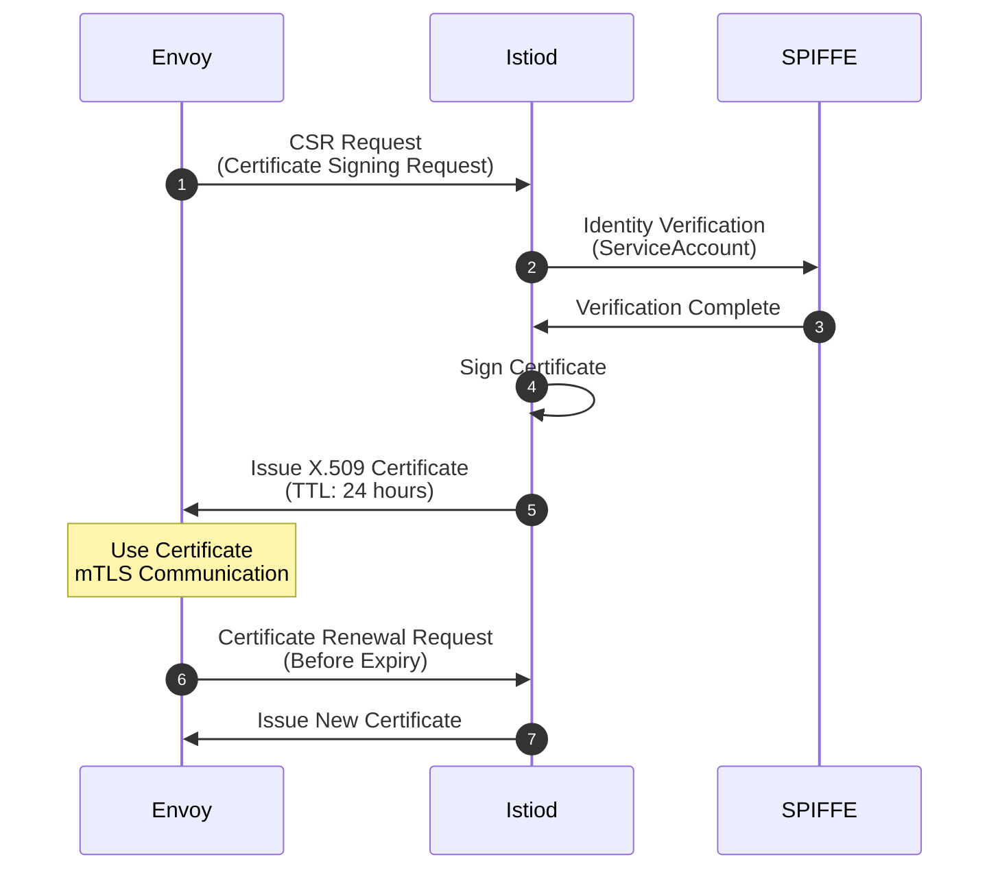

**SPIFFE ID 形式**:

```
spiffe://cluster.local/ns/default/sa/reviews
```

#### 4. 設定検証（Galley 機能）

```yaml
# Invalid configuration
apiVersion: networking.istio.io/v1
kind: VirtualService
metadata:
  name: invalid
spec:
  hosts:
  - reviews
  http:
  - route:
    - destination:
        host: non-existent-service  # ❌ Non-existent service
```

Istiod は適用前に検証します:

```bash
$ kubectl apply -f invalid-vs.yaml
Error from server: admission webhook "validation.istio.io" denied the request:
configuration is invalid: host "non-existent-service" not found
```

### Istiod のプロセス構造

**Istio 1.28 での実際の実装**:

```bash
# Processes inside Istiod pod
$ kubectl exec -n istio-system deploy/istiod -- ps aux
USER       PID  COMMAND
istio-p+     1  /usr/local/bin/pilot-discovery discovery

# Single binary 'pilot-discovery' performs all functions
```

**要点**:

* Istiod は `pilot-discovery` という**単一の Go バイナリ**として実行されます
* Pilot、Citadel、Galley は**コードレベルのパッケージ/モジュール**として存在しますが、個別のプロセスではありません
* すべての機能は、単一プロセス内で goroutine として実行されます

**Istiod が提供する主なポート**:

| ポート      | プロトコル | 用途                     | 機能                      |
| --------- | -------- | ------------------------ | ------------------------- |
| **15010** | gRPC     | xDS（レガシー）            | 後方互換性                |
| **15012** | gRPC     | TLS 経由の xDS           | 主な xDS API エンドポイント |
| **15014** | HTTP     | Control Plane のモニタリング | メトリクスとヘルスチェック |
| **15017** | HTTPS    | Webhook                  | Sidecar インジェクション  |
| **8080**  | HTTP     | デバッグ                  | デバッグインターフェイス  |

### Istiod の Deployment

**高可用性構成**:

```yaml
apiVersion: apps/v1
kind: Deployment
metadata:
  name: istiod
  namespace: istio-system
spec:
  replicas: 3  # 3 replicas for HA
  selector:
    matchLabels:
      app: istiod
  template:
    metadata:
      labels:
        app: istiod
    spec:
      containers:
      - name: discovery
        image: istio/pilot:1.28.0
        resources:
          requests:
            cpu: 500m
            memory: 2Gi
```

**一般的なリソース使用量**:

* CPU: 0.5～2 コア
* メモリ: 2～4 GB
* 数千の Service と Pod を処理可能

## Data Plane: Envoy Proxy

### Envoy アーキテクチャ

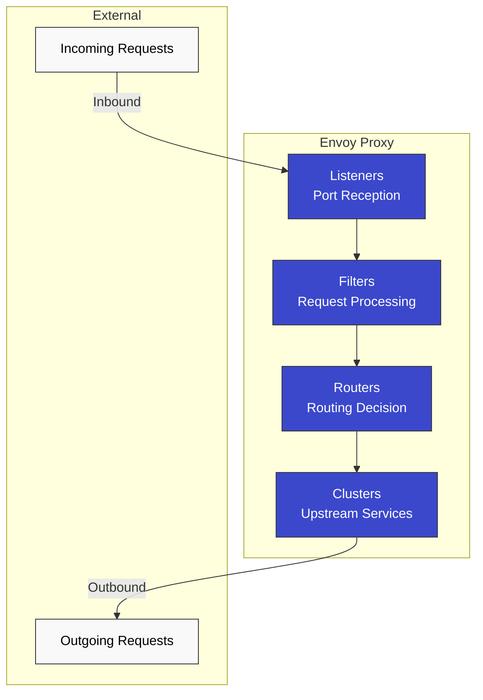

### Envoy の主なコンポーネント

#### 1. Listener

**ポートで接続を受信します**:

```json
{
  "name": "0.0.0.0_15001",
  "address": {
    "socket_address": {
      "address": "0.0.0.0",
      "port_value": 15001
    }
  },
  "filter_chains": [...]
}
```

**デフォルトの Istio Listener**:

* `0.0.0.0:15001`: すべての outbound TCP トラフィック
* `0.0.0.0:15006`: すべての inbound TCP トラフィック
* `0.0.0.0:15021`: ヘルスチェック
* `0.0.0.0:15090`: Prometheus メトリクス

#### 2. Filter

**リクエスト/レスポンスを処理するプラグイン**:

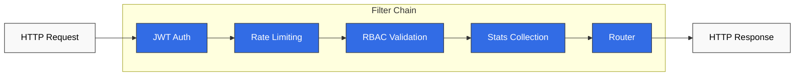

#### 3. Cluster

**upstream Service の論理グループ**:

```json
{
  "name": "outbound|9080|v1|reviews.default.svc.cluster.local",
  "type": "EDS",
  "eds_cluster_config": {
    "service_name": "outbound|9080|v1|reviews.default.svc.cluster.local"
  },
  "circuit_breakers": {...},
  "outlier_detection": {...}
}
```

#### 4. Endpoint

**実際の Pod IP リスト**:

```json
{
  "cluster_name": "outbound|9080|v1|reviews",
  "endpoints": [
    {
      "lb_endpoints": [
        {"endpoint": {"address": {"socket_address": {"address": "10.244.1.5", "port_value": 9080}}}},
        {"endpoint": {"address": {"socket_address": {"address": "10.244.2.8", "port_value": 9080}}}}
      ]
    }
  ]
}
```

### Envoy のパフォーマンス

**ベンチマーク**（一般的な環境）:

* スループット: コアあたり 10,000+ RPS
* 追加レイテンシ: < 1ms（P99）
* メモリ: 50～100 MB（デフォルト設定）
* CPU: 0.1～0.5 コア（一般的な負荷）

## Sidecar インジェクションの仕組み

### インジェクションのプロセス

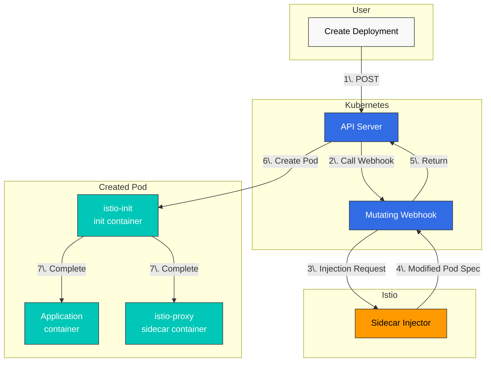

### インジェクション前と後の比較

**元の Deployment**:

```yaml
apiVersion: apps/v1
kind: Deployment
metadata:
  name: reviews
spec:
  template:
    spec:
      containers:
      - name: reviews
        image: reviews:v1
        ports:
        - containerPort: 9080
```

**インジェクション後**:

```yaml
apiVersion: v1
kind: Pod
metadata:
  annotations:
    sidecar.istio.io/status: '{"initContainers":["istio-init"],"containers":["istio-proxy"]}'
spec:
  initContainers:
  - name: istio-init
    image: istio/proxyv2:1.28.0
    command: ['istio-iptables', ...]
    securityContext:
      capabilities:
        add: [NET_ADMIN, NET_RAW]
  containers:
  - name: reviews
    image: reviews:v1
    ports:
    - containerPort: 9080
  - name: istio-proxy
    image: istio/proxyv2:1.28.0
    args: ['proxy', 'sidecar', ...]
```

### Sidecar インジェクションの有効化

#### 自動インジェクション（推奨）

**Namespace レベル**:

```bash
# Add label to namespace
kubectl label namespace default istio-injection=enabled

# All pods deployed to this namespace will automatically have sidecar injected
kubectl apply -f deployment.yaml
```

**Pod レベル**（Annotation）:

```yaml
apiVersion: v1
kind: Pod
metadata:
  annotations:
    sidecar.istio.io/inject: "true"  # Enable injection per pod
spec:
  containers:
  - name: app
    image: myapp:v1
```

#### 手動インジェクション

`istioctl kube-inject` コマンドを使用して、YAML ファイルに直接 Sidecar をインジェクションします。

```bash
# Inject sidecar into YAML file and deploy
istioctl kube-inject -f deployment.yaml | kubectl apply -f -

# Or save to file
istioctl kube-inject -f deployment.yaml -o deployment-injected.yaml
kubectl apply -f deployment-injected.yaml
```

**手動インジェクションのシナリオ**:

* 自動インジェクションを使用できない環境
* CI/CD パイプラインで明示的な制御が必要な場合
* デバッグのためにインジェクション済み YAML を確認したい場合

## iptables とトラフィックのインターセプト

### istio-init Container

**役割**: Pod のネットワークトラフィックを Envoy Proxy にリダイレクトする iptables ルールを設定します

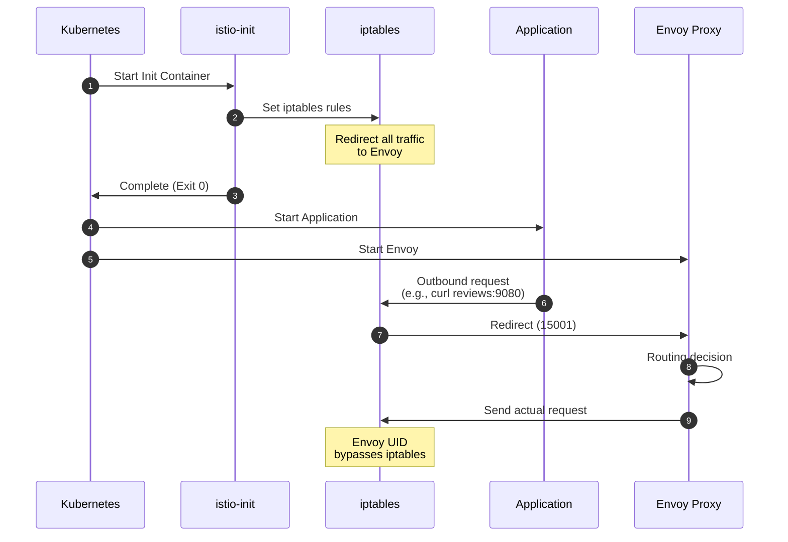

### iptables ルールの詳細

**istio-init によって実行されるコマンド**:

```bash
#!/bin/bash
# istio-iptables script (simplified)

# 1. OUTPUT chain: Application outbound traffic
iptables -t nat -A OUTPUT -p tcp \
  -m owner ! --uid-owner 1337 \  # Exclude Envoy UID
  -j REDIRECT --to-port 15001     # Envoy outbound port

# 2. PREROUTING chain: Inbound traffic to pod
iptables -t nat -A PREROUTING -p tcp \
  -j REDIRECT --to-port 15006     # Envoy inbound port

# 3. Exclusion rules
# - localhost traffic
iptables -t nat -I OUTPUT -d 127.0.0.1/32 -j RETURN

# - Istiod communication (15012)
iptables -t nat -I OUTPUT -p tcp --dport 15012 -j RETURN

# - DNS (53)
iptables -t nat -I OUTPUT -p udp --dport 53 -j RETURN
```

### トラフィックフロー（iptables 適用後）

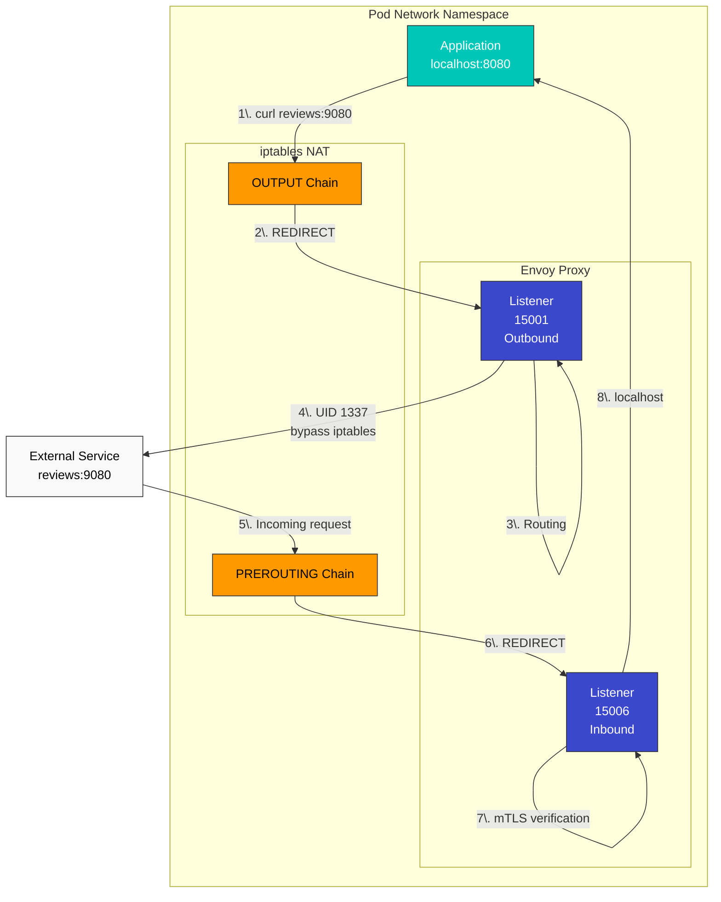

### iptables ルールの確認

**Pod 内から確認**:

```bash
# Enter pod
kubectl exec -it <pod-name> -c istio-proxy -- /bin/bash

# Check iptables rules
iptables -t nat -L -n -v

# OUTPUT chain
Chain OUTPUT (policy ACCEPT)
target     prot opt source     destination
ISTIO_OUTPUT  tcp  --  0.0.0.0/0  0.0.0.0/0

# ISTIO_OUTPUT detail
Chain ISTIO_OUTPUT (1 references)
RETURN     all  --  0.0.0.0/0  127.0.0.1           # Exclude localhost
RETURN     all  --  0.0.0.0/0  0.0.0.0/0           owner UID match 1337  # Exclude Envoy
REDIRECT   tcp  --  0.0.0.0/0  0.0.0.0/0           redir ports 15001  # Redirect rest

# PREROUTING chain
Chain PREROUTING (policy ACCEPT)
ISTIO_INBOUND  tcp  --  0.0.0.0/0  0.0.0.0/0

# ISTIO_INBOUND detail
Chain ISTIO_INBOUND (1 references)
REDIRECT   tcp  --  0.0.0.0/0  0.0.0.0/0           redir ports 15006
```

### iptables と eBPF（CNI Plugin）

Istio は 2 つのトラフィックインターセプト方式をサポートしています:

| 方式         | 利点                 | 欠点                    | 使用シナリオ                   |
| -------------- | -------------------- | ----------------------- | ------------------------------ |
| **iptables**   | シンプル、汎用的     | Init Container が必要   | デフォルトセットアップ         |
| **eBPF (CNI)** | Init 不要、高速      | 最新のカーネルが必要    | 高パフォーマンス、Ambient Mode |

## DNS 処理の仕組み

### Kubernetes DNS の基本動作

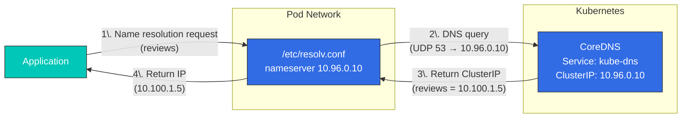

**/etc/resolv.conf**（Pod 内）:

```bash
nameserver 10.96.0.10  # kube-dns ClusterIP
search default.svc.cluster.local svc.cluster.local cluster.local
options ndots:5
```

### Envoy の DNS 処理

**Istio では、Envoy が DNS を処理します**:

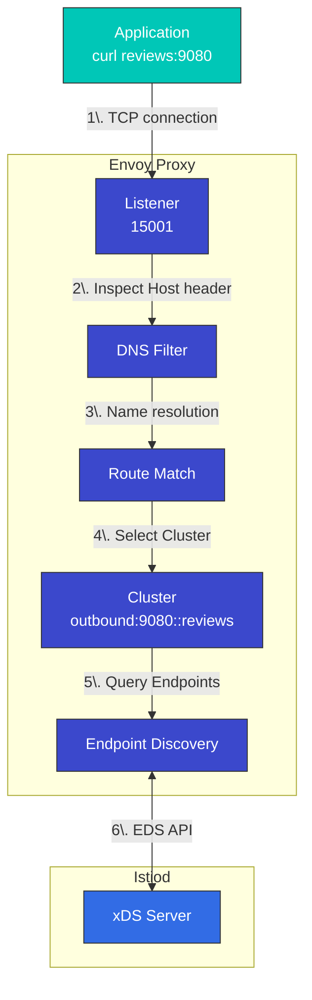

**利点**:

* CoreDNS 呼び出しが不要（パフォーマンス向上）
* 動的な Endpoint 更新
* 高度なルーティング（バージョン、重み付けなど）

### DNS Proxy（任意）

**DNS Proxy 機能は Istio 1.8+ で追加されました**:

```yaml
apiVersion: install.istio.io/v1alpha1
kind: IstioOperator
spec:
  meshConfig:
    defaultConfig:
      proxyMetadata:
        ISTIO_META_DNS_CAPTURE: "true"  # Enable DNS Proxy
```

**動作**:

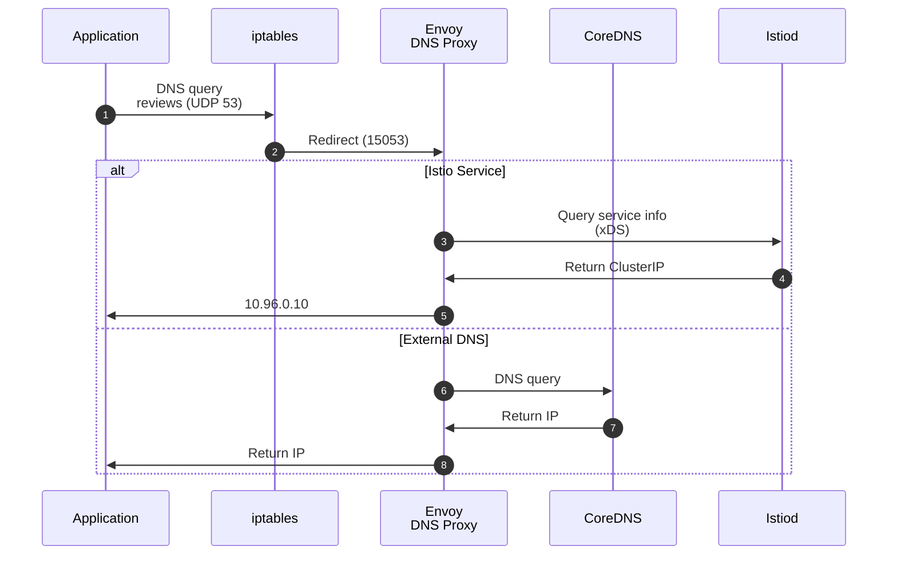

**DNS Proxy の iptables ルール**:

```bash
# Redirect UDP port 53 to Envoy DNS Proxy
iptables -t nat -A OUTPUT -p udp --dport 53 \
  -m owner ! --uid-owner 1337 \
  -j REDIRECT --to-port 15053
```

## xDS API 通信

### xDS プロトコルの概要

**xDS**: Discovery Service の略であり、Envoy の動的設定プロトコルです。

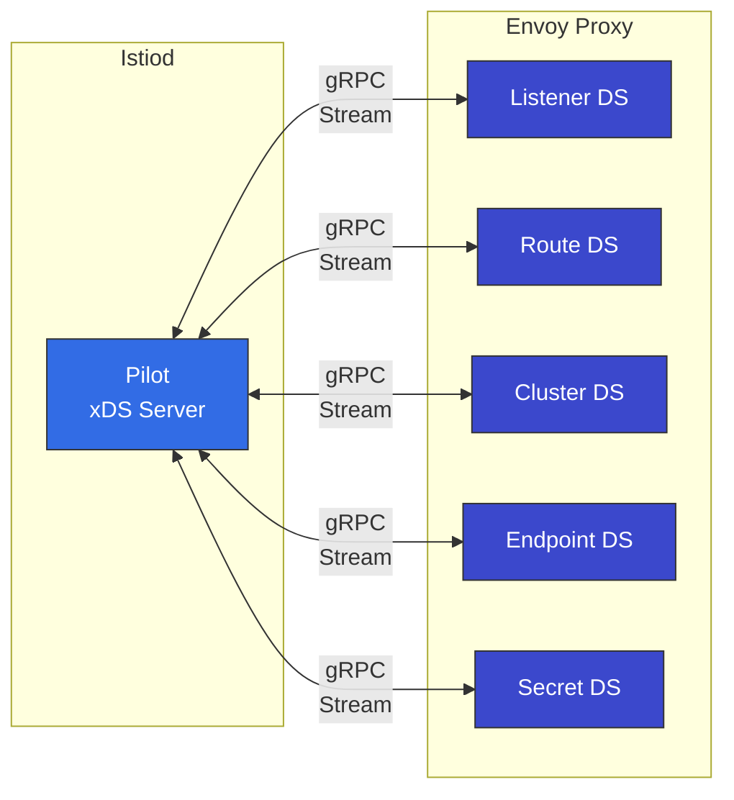

### xDS API の種類

| API     | 名前               | 役割                       | 例                |
| ------- | ------------------ | -------------------------- | ----------------- |
| **LDS** | Listener Discovery | ポート設定を受信           | 15001, 15006      |
| **RDS** | Route Discovery    | HTTP ルーティングルール    | VirtualService    |
| **CDS** | Cluster Discovery  | upstream Service           | DestinationRule   |
| **EDS** | Endpoint Discovery | Pod IP リスト              | Service Endpoint  |
| **SDS** | Secret Discovery   | TLS 証明書                 | mTLS 証明書       |

### xDS 通信フロー

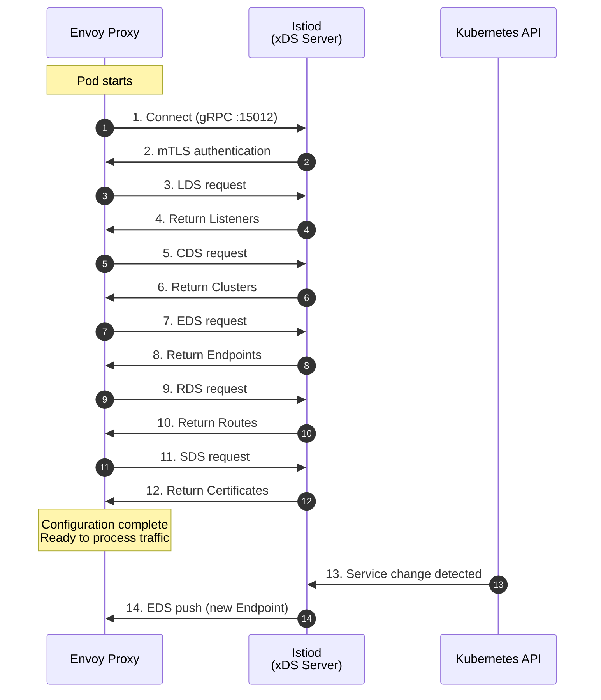

### xDS 通信の検証

**Envoy Admin API で確認**:

```bash
# From inside pod
kubectl exec -it <pod-name> -c istio-proxy -- curl localhost:15000/config_dump

# LDS (Listeners)
kubectl exec -it <pod-name> -c istio-proxy -- \
  curl -s localhost:15000/config_dump | jq '.configs[0].dynamic_listeners'

# CDS (Clusters)
kubectl exec -it <pod-name> -c istio-proxy -- \
  curl -s localhost:15000/config_dump | jq '.configs[1].dynamic_active_clusters'

# EDS (Endpoints)
kubectl exec -it <pod-name> -c istio-proxy -- \
  curl -s localhost:15000/clusters | grep -A 5 "reviews"

# RDS (Routes)
kubectl exec -it <pod-name> -c istio-proxy -- \
  curl -s localhost:15000/config_dump | jq '.configs[2].dynamic_route_configs'
```

**istioctl で確認**:

```bash
# Listener configuration
istioctl proxy-config listeners <pod-name> -n default

# Cluster configuration
istioctl proxy-config clusters <pod-name> -n default

# Endpoint configuration
istioctl proxy-config endpoints <pod-name> -n default

# Route configuration
istioctl proxy-config routes <pod-name> -n default
```

## Sidecar リソースによる最適化

### 問題: すべての Service 情報を受信する

デフォルトでは、各 Envoy は**メッシュ全体のすべての Service に関する情報**を受信します:

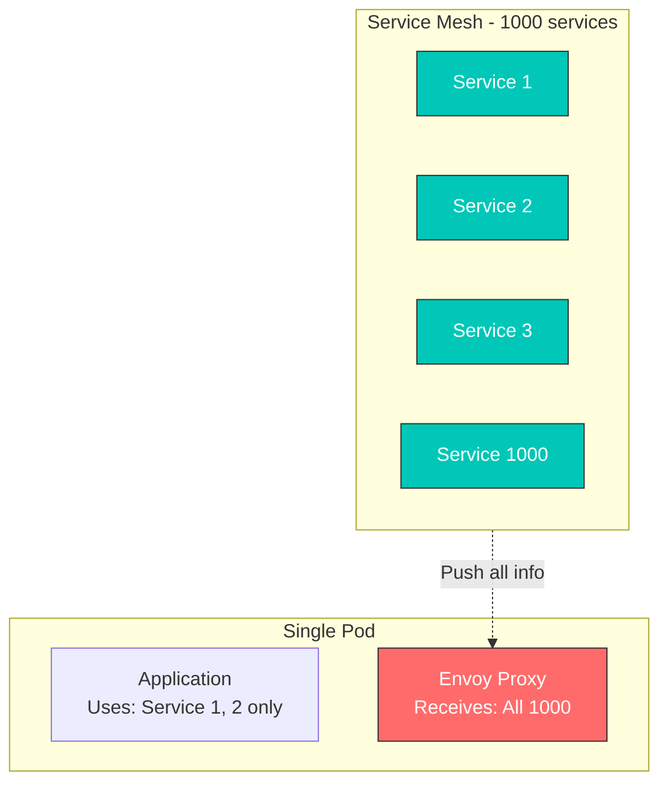

**問題点**:

* メモリ使用量の増加
* CPU 使用量の増加（設定処理）
* ネットワーク帯域幅の浪費
* Istiod の負荷増加

### 解決策: Sidecar リソース

**Sidecar リソース**を使用して、必要な Service だけを受信するように制限します:

```yaml
apiVersion: networking.istio.io/v1
kind: Sidecar
metadata:
  name: default
  namespace: default
spec:
  egress:
  - hosts:
    - "./*"  # All services in same namespace
    - "istio-system/*"  # All services in istio-system
    - "production/reviews"  # Only reviews in production namespace
```

### Sidecar リソースの例

#### 1. Namespace の分離

```yaml
apiVersion: networking.istio.io/v1
kind: Sidecar
metadata:
  name: default
  namespace: team-a
spec:
  egress:
  - hosts:
    - "team-a/*"  # Own namespace only
    - "istio-system/*"  # System services
    - "shared/*"  # Shared services
```

#### 2. 特定の Service のみにアクセス

```yaml
apiVersion: networking.istio.io/v1
kind: Sidecar
metadata:
  name: frontend
  namespace: default
spec:
  workloadSelector:
    labels:
      app: frontend
  egress:
  - hosts:
    - "default/reviews"
    - "default/ratings"
    - "default/details"
  - port:
      number: 443
      protocol: HTTPS
    hosts:
    - "external/*"
```

#### 3. 外部 Service のみにアクセス

```yaml
apiVersion: networking.istio.io/v1
kind: Sidecar
metadata:
  name: external-only
  namespace: default
spec:
  workloadSelector:
    labels:
      app: batch-job
  egress:
  - hosts:
    - "./*"  # Same namespace
  outboundTrafficPolicy:
    mode: REGISTRY_ONLY  # Only those registered in ServiceEntry
```

### Sidecar リソースの効果

**前（Sidecar なし）**:

* 1000 Service → 1000 Cluster 設定
* Envoy メモリ: \~500 MB
* 設定プッシュ時間: 5～10 秒

**後（Sidecar 適用後）**:

* 10 Service → 10 Cluster 設定
* Envoy メモリ: \~80 MB
* 設定プッシュ時間: < 1 秒

### DNS と Sidecar の統合

```yaml
apiVersion: networking.istio.io/v1
kind: Sidecar
metadata:
  name: dns-optimized
  namespace: default
spec:
  egress:
  - hosts:
    - "default/reviews"
    - "default/ratings"
  # Envoy only handles DNS for reviews, ratings
  # Rest forwarded to CoreDNS
```

**結果**:

* Envoy は `reviews`、`ratings` のみを名前解決します
* `google.com` などの外部ドメインは CoreDNS に転送されます
* メモリと CPU を節約できます

## 参考資料

### 公式ドキュメント

* [Istio Architecture](https://istio.io/latest/docs/ops/deployment/architecture/)
* [Envoy Proxy](https://www.envoyproxy.io/docs/envoy/latest/intro/intro)
* [xDS Protocol](https://www.envoyproxy.io/docs/envoy/latest/api-docs/xds_protocol)
* [SPIFFE](https://spiffe.io/)

### 歴史と背景

* [Envoy Origin Story - Matt Klein](https://blog.envoyproxy.io/the-universal-data-plane-api-d15cec7a)
* [Istio Announcement - Google Cloud Blog](https://cloud.google.com/blog/products/gcp/istio-service-mesh-for-microservices)
* [Service Mesh History](https://www.nginx.com/blog/what-is-a-service-mesh/)

### 発展的な学習

* [Envoy Architecture Overview](https://www.envoyproxy.io/docs/envoy/latest/intro/arch_overview/arch_overview)
* [Istio Performance and Scalability](https://istio.io/latest/docs/ops/deployment/performance-and-scalability/)
* [iptables Tutorial](https://www.frozentux.net/iptables-tutorial/iptables-tutorial.html)
