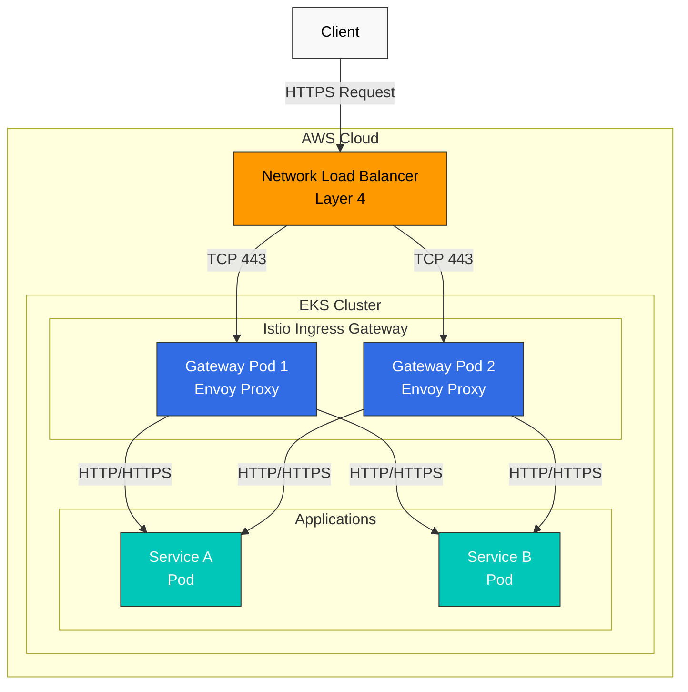
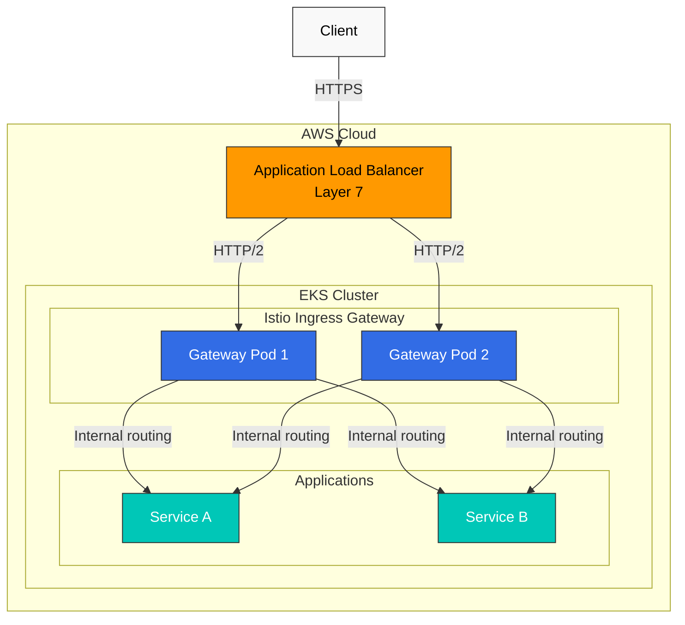
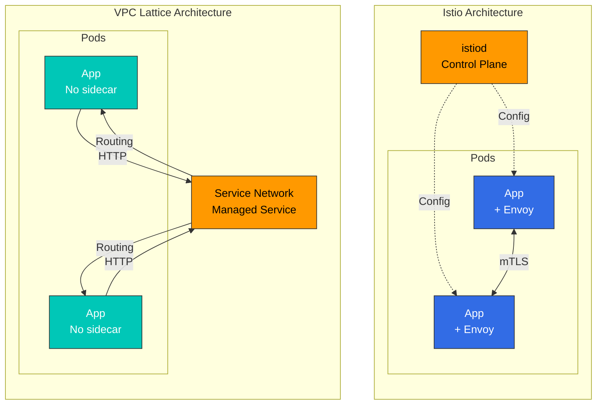
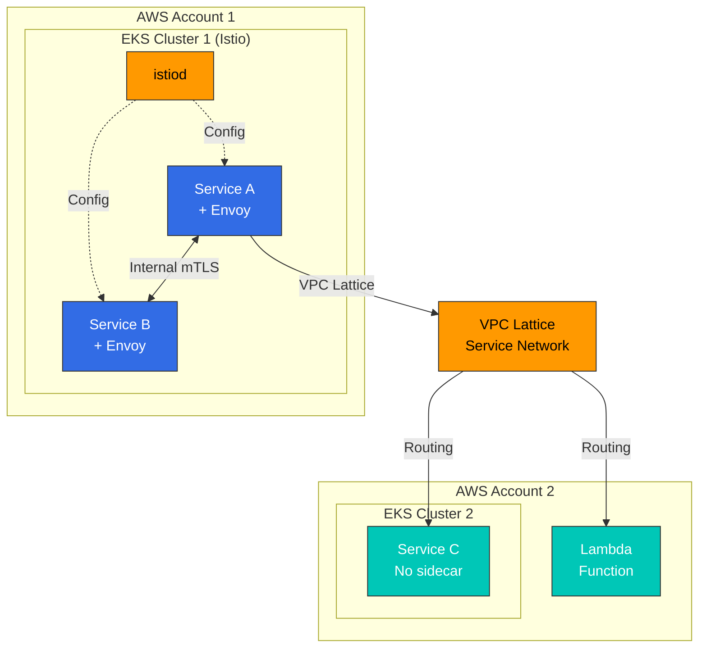

# AWS 統合

このドキュメントでは、Amazon EKS 環境で Istio を AWS サービスと統合する方法を説明します。

## 目次

1. [AWS Load Balancer 統合](04-aws-integration.md#aws-load-balancer-integration)
2. [Istio と他のソリューションの比較](04-aws-integration.md#istio-vs-other-solutions-comparison)
3. [EKS 固有の最適化](04-aws-integration.md#eks-specific-optimization)
4. [ベストプラクティス](04-aws-integration.md#best-practices)

## AWS Load Balancer 統合

Istio Ingress Gateway は AWS Load Balancer と統合し、外部トラフィックを処理できます。

### Network Load Balancer (NLB) 統合

NLB は Layer 4（TCP/UDP）のロードバランサーであり、高性能かつ低レイテンシーが求められる場合に適しています。

#### NLB アーキテクチャ



#### NLB 設定

**1. AWS Load Balancer Controller をインストールする**

```bash
# Create IAM policy
curl -o iam_policy.json https://raw.githubusercontent.com/kubernetes-sigs/aws-load-balancer-controller/main/docs/install/iam_policy.json

aws iam create-policy \
    --policy-name AWSLoadBalancerControllerIAMPolicy \
    --policy-document file://iam_policy.json

# IRSA setup
eksctl create iamserviceaccount \
  --cluster=my-cluster \
  --namespace=kube-system \
  --name=aws-load-balancer-controller \
  --attach-policy-arn=arn:aws:iam::<AWS_ACCOUNT_ID>:policy/AWSLoadBalancerControllerIAMPolicy \
  --override-existing-serviceaccounts \
  --approve

# Install controller with Helm
helm repo add eks https://aws.github.io/eks-charts
helm repo update

helm install aws-load-balancer-controller eks/aws-load-balancer-controller \
  -n kube-system \
  --set clusterName=my-cluster \
  --set serviceAccount.create=false \
  --set serviceAccount.name=aws-load-balancer-controller
```

**2. NLB を使用した Istio Ingress Gateway の設定**

```yaml
# istio-ingress-nlb.yaml
apiVersion: v1
kind: Service
metadata:
  name: istio-ingressgateway
  namespace: istio-system
  annotations:
    # NLB configuration
    service.beta.kubernetes.io/aws-load-balancer-type: "external"
    service.beta.kubernetes.io/aws-load-balancer-nlb-target-type: "ip"
    service.beta.kubernetes.io/aws-load-balancer-scheme: "internet-facing"

    # TLS configuration
    service.beta.kubernetes.io/aws-load-balancer-ssl-cert: "arn:aws:acm:region:account:certificate/cert-id"
    service.beta.kubernetes.io/aws-load-balancer-ssl-ports: "443"
    service.beta.kubernetes.io/aws-load-balancer-backend-protocol: "tcp"

    # Health check configuration
    service.beta.kubernetes.io/aws-load-balancer-healthcheck-protocol: "http"
    service.beta.kubernetes.io/aws-load-balancer-healthcheck-port: "15021"
    service.beta.kubernetes.io/aws-load-balancer-healthcheck-path: "/healthz/ready"

    # Additional configuration
    service.beta.kubernetes.io/aws-load-balancer-cross-zone-load-balancing-enabled: "true"
    service.beta.kubernetes.io/aws-load-balancer-proxy-protocol: "*"
spec:
  type: LoadBalancer
  selector:
    app: istio-ingressgateway
    istio: ingressgateway
  ports:
  - name: status-port
    port: 15021
    protocol: TCP
    targetPort: 15021
  - name: http2
    port: 80
    protocol: TCP
    targetPort: 8080
  - name: https
    port: 443
    protocol: TCP
    targetPort: 8443
```

**3. Gateway リソースの設定**

```yaml
apiVersion: networking.istio.io/v1
kind: Gateway
metadata:
  name: my-gateway
  namespace: istio-system
spec:
  selector:
    istio: ingressgateway
  servers:
  - port:
      number: 443
      name: https
      protocol: HTTPS
    tls:
      mode: SIMPLE
      credentialName: my-tls-secret
    hosts:
    - "myapp.example.com"
  - port:
      number: 80
      name: http
      protocol: HTTP
    hosts:
    - "myapp.example.com"
    tls:
      httpsRedirect: true
```

#### NLB の利点

* **高性能**: 1 秒あたり数百万件のリクエストを処理
* **低レイテンシー**: Layer 4 で動作し、高速に応答
* **静的 IP**: Elastic IP の割り当てが可能
* **プロトコルサポート**: TCP、UDP、TLS
* **コスト効率**: ALB より低コスト

#### NLB のユースケース

* WebSocket、gRPC、その他の長時間接続
* 1 秒あたり数百万件のリクエストの処理
* 静的 IP が必要な場合
* TLS 終端を Istio で行う場合

### Application Load Balancer (ALB) 統合

ALB は Layer 7（HTTP/HTTPS）のロードバランサーであり、高度なルーティング機能が必要な場合に適しています。

#### ALB アーキテクチャ



#### ALB 設定

**1. Ingress リソースで ALB を作成する**

```yaml
# istio-ingress-alb.yaml
apiVersion: networking.k8s.io/v1
kind: Ingress
metadata:
  name: istio-ingress
  namespace: istio-system
  annotations:
    # ALB configuration
    alb.ingress.kubernetes.io/scheme: internet-facing
    alb.ingress.kubernetes.io/target-type: ip
    alb.ingress.kubernetes.io/listen-ports: '[{"HTTP": 80}, {"HTTPS": 443}]'
    alb.ingress.kubernetes.io/ssl-redirect: '443'

    # ACM certificate
    alb.ingress.kubernetes.io/certificate-arn: arn:aws:acm:region:account:certificate/cert-id

    # Health check
    alb.ingress.kubernetes.io/healthcheck-protocol: HTTP
    alb.ingress.kubernetes.io/healthcheck-port: '15021'
    alb.ingress.kubernetes.io/healthcheck-path: /healthz/ready
    alb.ingress.kubernetes.io/healthcheck-interval-seconds: '15'
    alb.ingress.kubernetes.io/healthcheck-timeout-seconds: '5'
    alb.ingress.kubernetes.io/success-codes: '200'
    alb.ingress.kubernetes.io/healthy-threshold-count: '2'
    alb.ingress.kubernetes.io/unhealthy-threshold-count: '2'

    # Additional configuration
    alb.ingress.kubernetes.io/load-balancer-attributes: idle_timeout.timeout_seconds=60
    alb.ingress.kubernetes.io/target-group-attributes: deregistration_delay.timeout_seconds=30
spec:
  ingressClassName: alb
  rules:
  - host: "myapp.example.com"
    http:
      paths:
      - path: /
        pathType: Prefix
        backend:
          service:
            name: istio-ingressgateway
            port:
              number: 80
```

**2. パスベースのルーティング**

```yaml
apiVersion: networking.k8s.io/v1
kind: Ingress
metadata:
  name: istio-ingress-path-based
  namespace: istio-system
  annotations:
    alb.ingress.kubernetes.io/scheme: internet-facing
    alb.ingress.kubernetes.io/target-type: ip
spec:
  ingressClassName: alb
  rules:
  - host: "api.example.com"
    http:
      paths:
      - path: /v1
        pathType: Prefix
        backend:
          service:
            name: istio-ingressgateway
            port:
              number: 80
  - host: "admin.example.com"
    http:
      paths:
      - path: /
        pathType: Prefix
        backend:
          service:
            name: istio-ingressgateway
            port:
              number: 80
```

#### ALB の利点

* **高度なルーティング**: パス、Header、Query String ベースのルーティング
* **WAF 統合**: AWS WAF によるセキュリティ強化
* **認証統合**: Cognito、OIDC との統合
* **ACM 統合**: 証明書の自動管理
* **コンテナ向けに最適化**: ECS、EKS 向けに最適化

#### ALB のユースケース

* HTTP/HTTPS のみのトラフィック
* パスベースのルーティングが必要な場合
* WAF セキュリティが必要な場合
* 単一のロードバランサーで複数ドメインを処理する場合

### NLB と ALB の比較

| プロパティ            | NLB                                    | ALB                                      |
| ------------------- | -------------------------------------- | ---------------------------------------- |
| **OSI レイヤー**       | Layer 4（TCP/UDP）                      | Layer 7（HTTP/HTTPS）                     |
| **性能**     | 1 秒あたり数百万リクエスト        | 1 秒あたり数万リクエスト |
| **レイテンシー**         | 非常に低い                               | 低い                                      |
| **静的 IP**       | サポート（Elastic IP）                 | 非サポート                            |
| **TLS 終端** | TCP としてパススルー（Istio で処理） | ALB で処理可能                    |
| **ルーティング**         | IP/Port ベース                          | Path、Host、Header ベース                 |
| **WAF 統合** | 利用不可                          | 利用可能                                |
| **コスト**            | 低い                                  | 比較的高い                        |
| **WebSocket**       | ネイティブサポート                         | サポート                                |
| **gRPC**            | ネイティブサポート                         | HTTP/2 が必要                          |
| **推奨用途** | 高性能、WebSocket、gRPC      | HTTP ルーティング、WAF、認証        |

## Istio と他のソリューションの比較

### Istio と VPC Lattice

VPC Lattice は AWS のマネージドアプリケーションネットワーキングサービスです。

#### アーキテクチャの比較



#### 機能比較

| プロパティ               | Istio                                | VPC Lattice                 |
| ---------------------- | ------------------------------------ | --------------------------- |
| **管理**         | 自己管理                         | AWS 管理（フルマネージド） |
| **Sidecar**            | 必須（Sidecar または Ambient）        | 不要                |
| **リソースオーバーヘッド**  | 高い（Pod ごとに Envoy）                 | 低い（Sidecar なし）            |
| **複雑性**         | 高い                                 | 低い                         |
| **学習曲線**     | 急                                | 緩やか                      |
| **トラフィック管理** | 非常に高度（きめ細かな制御） | 基本（十分な機能） |
| **mTLS**               | 自動、きめ細かな制御      | サポート                   |
| **可観測性**      | 豊富なメトリクス、トレース                 | 基本メトリクス               |
| **Fault Injection**    | サポート                            | 非サポート               |
| **Circuit Breaker**    | きめ細かな制御                 | 基本機能         |
| **Rate Limiting**      | ローカル + グローバル                       | 基本機能         |
| **Multi-cluster**      | 強力なサポート                       | クロス VPC 接続      |
| **クロスアカウント**      | 複雑                              | シンプル（ネイティブサポート）     |
| **コスト**               | コンピューティングコスト（EC2）                   | サービス利用コスト          |
| **ベンダーロックイン**     | なし（オープンソース）                   | AWS ロックイン                 |
| **Kubernetes 専用**    | はい                                  | いいえ（EC2、Lambda など）      |

#### Istio を選択する場合

**Istio が適しているケース:**

1. **きめ細かなトラフィック制御が必要**
   * Canary deployment、A/B テスト、Traffic Mirroring
   * 複雑なルーティングルール（Header、Cookie ベースなど）
   * Chaos Engineering 向けの Fault Injection
2. **強力なセキュリティ要件**
   * サービス間の自動 mTLS 暗号化
   * きめ細かな認可ポリシー
   * JWT 検証、RBAC
3. **高度な可観測性が必要**
   * 詳細なメトリクス（Latency P50/P95/P99）
   * 分散トレーシング（Jaeger、Zipkin）
   * サービストポロジーの可視化（Kiali）
4. **Multi-cluster Mesh**
   * 複数の EKS クラスター間の通信
   * クラスター間フェイルオーバー
   * グローバルロードバランシング
5. **ベンダー独立性**
   * 他のクラウドまたはオンプレミスへ移行できる可能性
   * Kubernetes 標準の利用

**例: Istio の高度なトラフィック管理**

```yaml
apiVersion: networking.istio.io/v1
kind: VirtualService
metadata:
  name: reviews
spec:
  hosts:
  - reviews
  http:
  # Header-based routing
  - match:
    - headers:
        user-agent:
          regex: ".*Mobile.*"
    route:
    - destination:
        host: reviews
        subset: mobile-v2
  # Canary deployment (10%)
  - match:
    - headers:
        x-canary:
          exact: "true"
    route:
    - destination:
        host: reviews
        subset: v3
      weight: 10
    - destination:
        host: reviews
        subset: v2
      weight: 90
  # Traffic Mirroring
  - route:
    - destination:
        host: reviews
        subset: v2
    mirror:
      host: reviews
      subset: v3
    mirrorPercentage:
      value: 100
```

#### VPC Lattice を選択する場合

**VPC Lattice が適しているケース:**

1. **シンプルなサービス接続**
   * 基本的なロードバランシングとルーティングのみが必要
   * 迅速な実装が重要
2. **低い運用オーバーヘッド**
   * AWS マネージドサービスを優先する
   * Sidecar 管理の負担がない
3. **クロス VPC/アカウント通信**
   * 複数の AWS アカウントをまたぐサービスの接続
   * VPC ピアリングなしの通信
4. **混在環境**
   * EKS + EC2 + Lambda の混在環境
   * Kubernetes 以外も含む多様なコンピューティングタイプの利用
5. **コスト最適化**
   * Sidecar のリソースコスト削減
   * 小規模サービス

#### Istio と VPC Lattice の併用

この 2 つのソリューションは相互排他的ではなく、併用できます。



**ユースケース:**

* **クラスター内**: きめ細かなトラフィック管理とセキュリティには Istio
* **クロスクラスター/クロスアカウント**: シンプルな接続には VPC Lattice
* **混在環境**: Istio クラスターと Lambda/EC2 の接続には VPC Lattice を使用

### Istio と Cilium（eBPF ベース）

Cilium は eBPF を使用する Kubernetes のネットワーキングおよびセキュリティソリューションです。

#### アーキテクチャの比較

| プロパティ             | Istio                             | Cilium                         |
| -------------------- | --------------------------------- | ------------------------------ |
| **テクノロジースタック** | Envoy Proxy（Sidecar）             | eBPF（カーネルレベル）            |
| **主な目的**  | Service Mesh                      | CNI + Service Mesh             |
| **ネットワーキング**       | Kubernetes CNI の上で動作 | CNI 自体を提供            |
| **性能**      | 良好                              | 優れている（カーネルレベル）       |
| **リソース使用量**   | 高い（Sidecar）                    | 低い（カーネルレベル）             |
| **L7 機能**      | 非常に強力                     | 基本                          |
| **可観測性**    | 豊富                              | Hubble（基本）                 |
| **学習曲線**   | 急                             | 急                          |
| **成熟度**         | 高い                              | 中程度（Service Mesh 機能） |

#### 機能比較

| 機能                | Istio                           | Cilium                              |
| ---------------------- | ------------------------------- | ----------------------------------- |
| **Network Policy**     | Kubernetes + Istio              | Kubernetes + Cilium（より強力） |
| **L7 Load Balancing**  | 非常にきめ細かい               | 基本                               |
| **mTLS**               | 自動、きめ細かな制御 | サポート                           |
| **トラフィック管理** | 非常に高度                   | 基本                               |
| **可観測性**      | Prometheus、Jaeger、Kiali       | Hubble                              |
| **性能**        | 良好                            | 優れている                           |
| **Multi-cluster**      | 強力                          | Cluster Mesh                        |

#### 選択ガイド

**Istio を選択する場合:**

* L7 トラフィック管理が中核要件である
* 強力な Service Mesh 機能が必要
* 豊富な可観測性とデバッグツールが必要

**Cilium を選択する場合:**

* CNI の置き換えを検討している
* ネットワークセキュリティが主な関心事である
* パフォーマンス最適化が重要である
* eBPF テクノロジーを活用したい

**併用する場合:**

* Cilium を CNI、Istio を Service Mesh として使用できる
* ただし、機能の重複と複雑性の増加を考慮する

## EKS 固有の最適化

### IAM Roles for Service Accounts (IRSA) 統合

Istio ワークロードが AWS サービスへ安全にアクセスできるよう、IRSA を設定します。

#### IRSA 設定

```bash
# 1. Create OIDC provider
eksctl utils associate-iam-oidc-provider \
    --cluster my-cluster \
    --approve

# 2. Create IAM policy
cat <<EOF > app-policy.json
{
    "Version": "2012-10-17",
    "Statement": [
        {
            "Effect": "Allow",
            "Action": [
                "s3:GetObject",
                "s3:ListBucket"
            ],
            "Resource": [
                "arn:aws:s3:::my-bucket",
                "arn:aws:s3:::my-bucket/*"
            ]
        }
    ]
}
EOF

aws iam create-policy \
    --policy-name MyAppS3Policy \
    --policy-document file://app-policy.json

# 3. Link IAM Role to Service Account
eksctl create iamserviceaccount \
    --cluster my-cluster \
    --namespace default \
    --name my-app-sa \
    --attach-policy-arn arn:aws:iam::<ACCOUNT_ID>:policy/MyAppS3Policy \
    --approve
```

#### Istio と IRSA の使用

```yaml
apiVersion: v1
kind: ServiceAccount
metadata:
  name: my-app-sa
  namespace: default
  annotations:
    eks.amazonaws.com/role-arn: arn:aws:iam::<ACCOUNT_ID>:role/my-app-role
---
apiVersion: apps/v1
kind: Deployment
metadata:
  name: my-app
  namespace: default
spec:
  selector:
    matchLabels:
      app: my-app
  template:
    metadata:
      labels:
        app: my-app
    spec:
      serviceAccountName: my-app-sa  # Using IRSA
      containers:
      - name: app
        image: my-app:latest
        env:
        - name: AWS_REGION
          value: us-west-2
```

### AWS Certificate Manager (ACM) 統合

Istio Gateway で ACM 証明書を使用する方法を説明します。

#### NLB での TLS 終端

```yaml
apiVersion: v1
kind: Service
metadata:
  name: istio-ingressgateway
  namespace: istio-system
  annotations:
    service.beta.kubernetes.io/aws-load-balancer-type: "external"
    service.beta.kubernetes.io/aws-load-balancer-nlb-target-type: "ip"
    service.beta.kubernetes.io/aws-load-balancer-ssl-cert: "arn:aws:acm:region:account:certificate/cert-id"
    service.beta.kubernetes.io/aws-load-balancer-ssl-ports: "443"
    service.beta.kubernetes.io/aws-load-balancer-backend-protocol: "tcp"
spec:
  type: LoadBalancer
  selector:
    istio: ingressgateway
  ports:
  - name: https
    port: 443
    targetPort: 8443
```

#### Istio での TLS 終端（ACM Private CA）

```bash
# 1. Issue certificate from ACM Private CA
aws acm-pca issue-certificate \
    --certificate-authority-arn arn:aws:acm-pca:region:account:certificate-authority/ca-id \
    --csr file://csr.pem \
    --signing-algorithm "SHA256WITHRSA" \
    --validity Value=365,Type="DAYS"

# 2. Create Kubernetes Secret
kubectl create secret tls my-tls-secret \
    --cert=certificate.pem \
    --key=private-key.pem \
    -n istio-system

# 3. Use in Gateway
```

```yaml
apiVersion: networking.istio.io/v1
kind: Gateway
metadata:
  name: my-gateway
  namespace: istio-system
spec:
  selector:
    istio: ingressgateway
  servers:
  - port:
      number: 443
      name: https
      protocol: HTTPS
    tls:
      mode: SIMPLE
      credentialName: my-tls-secret  # ACM certificate
    hosts:
    - "myapp.example.com"
```

### CloudWatch Container Insights 統合

Istio メトリクスを CloudWatch に送信して、統合モニタリングを実装します。

#### CloudWatch Agent 設定

```bash
# 1. Attach IAM policy
eksctl create iamserviceaccount \
    --cluster my-cluster \
    --namespace amazon-cloudwatch \
    --name cloudwatch-agent \
    --attach-policy-arn arn:aws:iam::aws:policy/CloudWatchAgentServerPolicy \
    --approve

# 2. Install CloudWatch Agent
kubectl apply -f https://raw.githubusercontent.com/aws-samples/amazon-cloudwatch-container-insights/latest/k8s-deployment-manifest-templates/deployment-mode/daemonset/container-insights-monitoring/cloudwatch-namespace.yaml

kubectl apply -f https://raw.githubusercontent.com/aws-samples/amazon-cloudwatch-container-insights/latest/k8s-deployment-manifest-templates/deployment-mode/daemonset/container-insights-monitoring/cwagent/cwagent-serviceaccount.yaml
```

#### Prometheus メトリクススクレイピング

```yaml
# prometheus-config.yaml
apiVersion: v1
kind: ConfigMap
metadata:
  name: prometheus-config
  namespace: amazon-cloudwatch
data:
  prometheus.yaml: |
    global:
      scrape_interval: 1m
      scrape_timeout: 10s

    scrape_configs:
    # Istio Control Plane metrics
    - job_name: 'istiod'
      kubernetes_sd_configs:
      - role: endpoints
        namespaces:
          names:
          - istio-system
      relabel_configs:
      - source_labels: [__meta_kubernetes_service_name, __meta_kubernetes_endpoint_port_name]
        action: keep
        regex: istiod;http-monitoring

    # Envoy sidecar metrics
    - job_name: 'envoy-stats'
      metrics_path: /stats/prometheus
      kubernetes_sd_configs:
      - role: pod
      relabel_configs:
      - source_labels: [__meta_kubernetes_pod_container_port_name]
        action: keep
        regex: '.*-envoy-prom'
      - source_labels: [__address__, __meta_kubernetes_pod_annotation_prometheus_io_port]
        action: replace
        regex: ([^:]+)(?::\d+)?;(\d+)
        replacement: $1:15090
        target_label: __address__
```

#### CloudWatch Logs Insights クエリ

```sql
-- Istio error log analysis
fields @timestamp, @message
| filter @logStream like /istio-proxy/
| filter @message like /error/
| sort @timestamp desc
| limit 100

-- Request latency analysis
fields @timestamp, request_duration_ms
| filter @logStream like /istio-proxy/
| stats avg(request_duration_ms), max(request_duration_ms), pct(request_duration_ms, 95) by bin(5m)
```

### EKS 最適化設定

#### 1. Pod リソースの最適化

```yaml
# Envoy sidecar resource optimization
apiVersion: install.istio.io/v1alpha1
kind: IstioOperator
spec:
  meshConfig:
    defaultConfig:
      proxyMetadata:
        # EKS optimization
        ISTIO_META_DNS_CAPTURE: "true"
        ISTIO_META_DNS_AUTO_ALLOCATE: "true"
  values:
    global:
      proxy:
        resources:
          requests:
            cpu: 100m
            memory: 128Mi
          limits:
            cpu: 2000m
            memory: 1024Mi
        # Connection pool settings
        concurrency: 2
```

#### 2. Cluster Autoscaler の考慮事項

```yaml
# Istio Gateway Autoscaling
apiVersion: autoscaling/v2
kind: HorizontalPodAutoscaler
metadata:
  name: istio-ingressgateway
  namespace: istio-system
spec:
  scaleTargetRef:
    apiVersion: apps/v1
    kind: Deployment
    name: istio-ingressgateway
  minReplicas: 2
  maxReplicas: 10
  metrics:
  - type: Resource
    resource:
      name: cpu
      target:
        type: Utilization
        averageUtilization: 80
  - type: Resource
    resource:
      name: memory
      target:
        type: Utilization
        averageUtilization: 80
```

#### 3. Pod Disruption Budget

```yaml
apiVersion: policy/v1
kind: PodDisruptionBudget
metadata:
  name: istio-ingressgateway
  namespace: istio-system
spec:
  minAvailable: 1
  selector:
    matchLabels:
      app: istio-ingressgateway
```

## ベストプラクティス

### 1. Load Balancer 選択ガイド

**NLB を使用する場合:**

* gRPC、WebSocket、その他の長時間接続
* 1 秒あたり数百万件のリクエストの処理
* 静的 IP が必要
* Istio で TLS 終端を行う

**ALB を使用する場合:**

* HTTP/HTTPS のみ
* パスベースのルーティング
* WAF セキュリティが必要
* Cognito 認証統合

### 2. TLS 終端の場所

**Load Balancer で終端する場合（推奨）:**

* ACM 証明書の自動更新
* 容易な管理
* Istio 負荷の削減

**Istio で終端する場合:**

* エンドツーエンド暗号化が必要
* きめ細かな TLS ポリシー制御
* mTLS の使用

### 3. コスト最適化

* **Spot Instances**: Istio Gateway ワークロードに使用
* **Graviton Instances**: ARM ベースのインスタンスでコストを削減
* **Resource Limits**: 適切な Sidecar リソース制限を設定
* **Ambient Mode**: Sidecar のオーバーヘッドを排除するために検討

### 4. セキュリティ

* **IRSA**: IAM ロールで AWS サービスにアクセス
* **Security Groups**: 最小権限の原則
* **mTLS**: サービス間の暗号化を有効化
* **Network Policy**: Cilium または Calico とともに使用

### 5. モニタリング

* **CloudWatch**: 統合されたログとメトリクス
* **X-Ray**: 分散トレーシング
* **Prometheus + Grafana**: 詳細なメトリクス
* **Kiali**: Service Mesh の可視化

## 次のステップ

AWS 統合が完了したら、次のドキュメントを参照してください。

1. [**Traffic Management**](traffic-management/README.md): 高度なトラフィック管理機能
2. [**Security**](security/README.md): mTLS と認証/認可
3. [**Observability**](observability/README.md): メトリクス、ログ、トレースの収集

## 参照

* [AWS Load Balancer Controller](https://kubernetes-sigs.github.io/aws-load-balancer-controller/)
* [EKS ベストプラクティス - ネットワーキング](https://aws.github.io/aws-eks-best-practices/networking/)
* [VPC Lattice ドキュメント](https://docs.aws.amazon.com/vpc-lattice/)
* [Cilium ドキュメント](https://docs.cilium.io/)
* [AWS Container Insights](https://docs.aws.amazon.com/AmazonCloudWatch/latest/monitoring/ContainerInsights.html)
