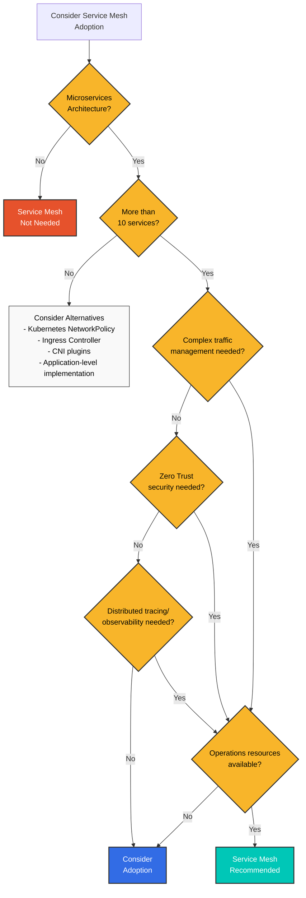
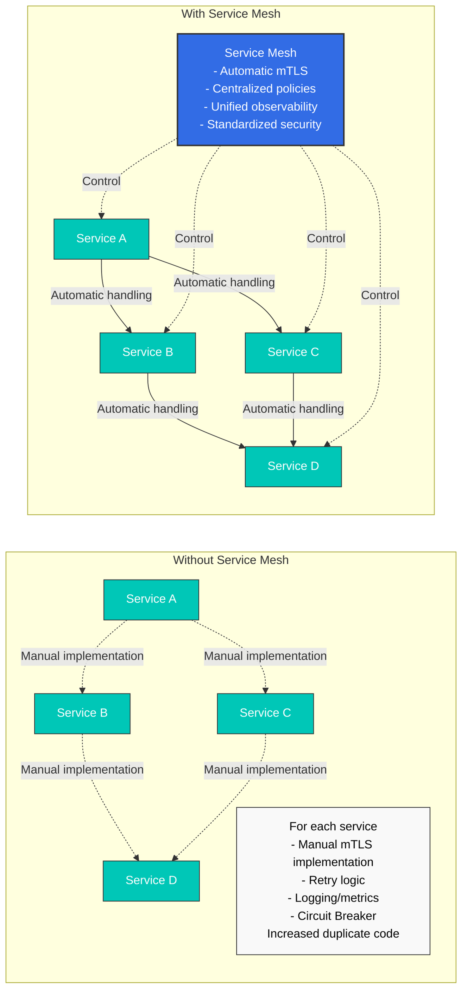
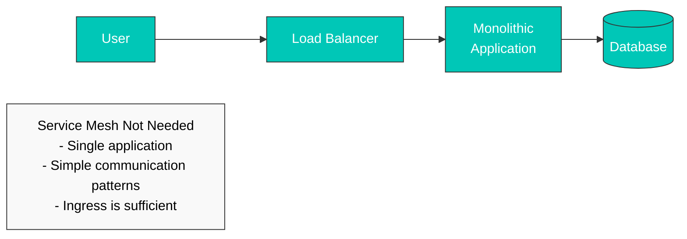
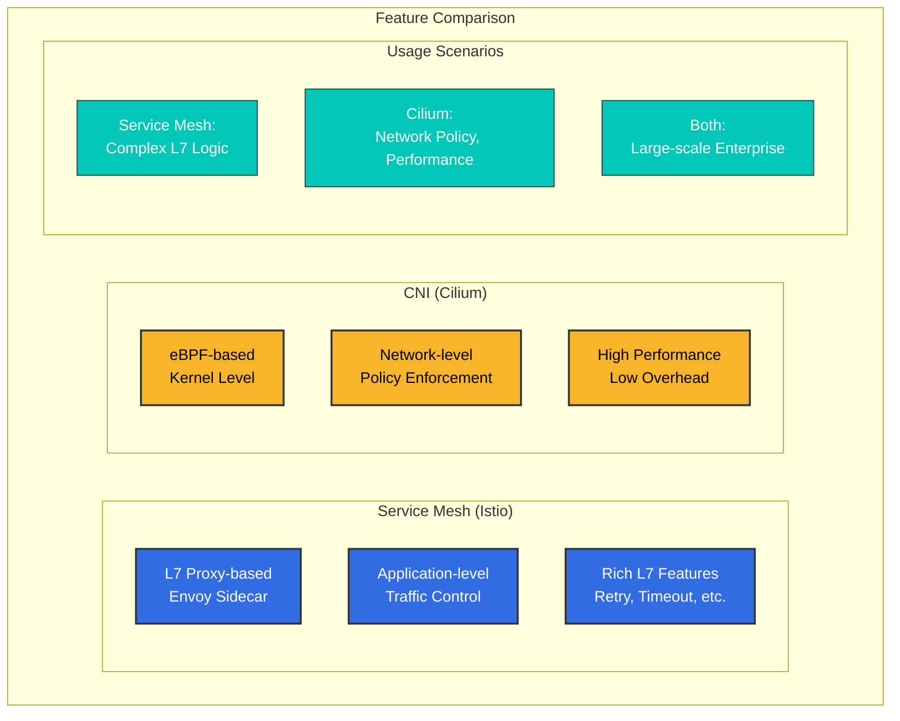
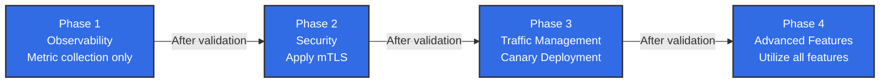
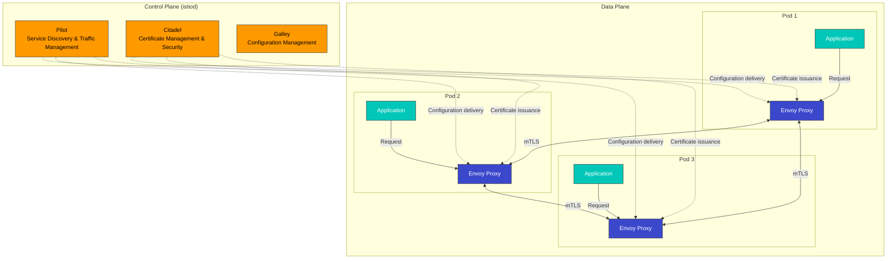

# Istio

> **最終更新**: August 24, 2026

Amazon EKS で Istio Service Mesh を活用するための実践ガイドです。

### 2026年8月アップデート: Istio 1.31 が RC に移行

2026年8月19日、1.31.0-beta.2 に続いて同日中に最初のリリース候補版である [1.31.0-rc.0](https://github.com/istio/istio/releases) がリリースされ、次のマイナーバージョン 1.31 はリリース候補段階に移行しました。RC は GA 直前の最終検証のためのプレリリースであり、公式リリースが近いことを示すシグナルです。本番環境では引き続き GA リリースを使用してください。

### 2026年8月アップデート: Istio 1.31 が Beta に移行

次のマイナーバージョンである Istio 1.31 のリリースプロセスが進行中です。2026年8月11日に 1.31.0-alpha.2 が公開され、8月13日に 1.31.0-beta.0、8月14日に 1.31.0-beta.1 が続きました。Alpha/Beta ビルドは早期検証のためのプレリリースであり、本番利用向けではありません。GA リリース前に新機能をテストしたい場合にのみ使用してください。詳細は [Istio releases page](https://github.com/istio/istio/releases) を参照してください。

### 2026年7月アップデート: Istio 1.30.3 / 1.29.6 パッチリリース

2026年7月16日、Istio 1.30.3 および 1.29.6 のパッチリリースが公開されました。1.30.3 の主な変更点は次のとおりです。

- workload/service のアドレス変更による XDS push の対象を影響を受ける waypoint のみに絞ることで、ambient mode における istiod のスケーラビリティを改善
- 再起動されるまで istiod が更新済みのリモートクラスター Secret（例: credential/token rotation 中）を取得しない問題を修正
- pilot node untaint controller の taint 名を、`PILOT_NODE_UNTAINT_CONTROLLERS_TAINT_NAME` 環境変数でカスタマイズ可能に変更

詳細は [official announcement](https://istio.io/latest/news/releases/1.30.x/announcing-1.30.3/) を参照してください。

## 目次

1. [Service Mesh は本当に必要か？](#do-you-really-need-a-service-mesh)
2. [インストールと初期セットアップ](01-installation.md)
3. [基本概念](02-basic-concepts.md)
4. [アーキテクチャ](03-architecture.md)
5. [AWS 統合](04-aws-integration.md)
6. [用語集](glossary.md)
7. [Traffic Management](traffic-management/README.md)
8. [セキュリティ](security/README.md)
9. [Observability](observability/README.md)
10. [Resilience](resilience/README.md)
11. [高度な機能](advanced/README.md)
12. [トラブルシューティング](troubleshooting/common-errors.md)
13. [ベストプラクティス](best-practices.md)
14. [代替手段の比較](comparison/README.md)

## Istio とは？

Istio は、マイクロサービスを接続、保護、制御、監視するためのオープンソース Service Mesh プラットフォームです。複雑なマイクロサービスアーキテクチャにおけるサービス間通信を管理し、トラフィック制御、セキュリティ、可観測性を提供します。

### Service Mesh の概念

<div align="center"></div>

Service Mesh は、マイクロサービス間の通信を管理するインフラストラクチャレイヤーです。Istio は各サービスに Sidecar Proxy（Envoy）を併置して、すべてのネットワークトラフィックをインターセプトおよび制御します。これにより、アプリケーションコードを変更せずに次の機能を提供します。

* **Traffic Routing**: インテリジェントルーティング、ロードバランシング、Canary デプロイメント
* **セキュリティ**: 自動 mTLS、認証、認可
* **Observability**: メトリクス、ログ、分散トレーシング
* **Resilience**: Circuit Breaking、Retry、Timeout

### 実践的な使用例

<p align="center"><br><em>Application without Istio</em></p>

<p align="center"><br><em>Application with Istio - Envoy Proxy deployed as Sidecar to each service</em></p>

Istio を適用すると、Envoy Proxy が Sidecar コンテナとして各マイクロサービスに自動的にデプロイされ、すべてのネットワークトラフィックを透過的にインターセプトおよび制御します。

## Service Mesh は本当に必要か？

Service Mesh は強力なツールですが、すべての状況に適しているわけではありません。導入前に慎重な検討が必要です。

### 判断フロー



### Service Mesh が必要な場合 ✅

#### 1. 複雑なマイクロサービス環境



**推奨基準**:

* ✅ マイクロサービスが 10 個以上
* ✅ サービス間通信（East-West トラフィック）が頻繁
* ✅ 複数のプログラミング言語を使用（Polyglot）
* ✅ 複数のチームがサービスを独立して開発

#### 2. Zero Trust セキュリティ要件

**Service Mesh が提供するもの**:

* サービス間の自動 mTLS 暗号化
* SPIFFE ベースの Identity 管理
* きめ細かな認証/認可ポリシー
* 暗号化通信の保証

**代替手段では実現が難しいこと**:

* 各サービスにおけるセキュリティロジック実装の重複
* 手動証明書管理の複雑さ
* 一貫性のないセキュリティポリシー

#### 3. 高度な Traffic Management

```yaml
# Canary Deployment (Traffic Distribution)
apiVersion: networking.istio.io/v1
kind: VirtualService
metadata:
  name: reviews
spec:
  hosts:
  - reviews
  http:
  - route:
    - destination:
        host: reviews
        subset: v1
      weight: 90
    - destination:
        host: reviews
        subset: v2
      weight: 10  # Only 10% to new version
```

**必要となる場合**:

* Canary デプロイメント、A/B テスト
* Header/path ベースのルーティング
* Traffic Mirroring（Shadow Testing）
* Fault Injection（Chaos Engineering）
* Circuit Breaking、Retry、Timeout

#### 4. 統合された Observability

**Service Mesh の利点**:

* アプリケーションコードを変更せずにメトリクスを自動収集
* 分散トレーシングを自動実装
* 統一されたログ形式
* サービストポロジーの可視化（Kiali）

### Service Mesh が不要な場合 ❌

#### 1. シンプルなアーキテクチャ



**代わりに使用するもの**:

* Kubernetes Ingress Controller（NGINX、Traefik）
* シンプルなロードバランサー
* アプリケーションレベルの実装

#### 2. 少数のマイクロサービス（<10）

**オーバーヘッドのほうが大きい**:

* Service Mesh の運用複雑性 > 得られる利点
* 5～10 個のサービスは手動で管理可能
* NetworkPolicy で十分なセキュリティを提供

**代替手段**:

```yaml
# Kubernetes NetworkPolicy is sufficient
apiVersion: networking.k8s.io/v1
kind: NetworkPolicy
metadata:
  name: allow-frontend-to-backend
spec:
  podSelector:
    matchLabels:
      app: backend
  ingress:
  - from:
    - podSelector:
        matchLabels:
          app: frontend
```

#### 3. 運用リソースの不足

**Service Mesh の運用要件**:

* Istio/Envoy の専門知識
* Control Plane の監視と管理
* Upgrade とパッチ管理
* トラブルシューティング能力（デバッグの複雑性増加）

**必要なチーム準備**:

* Service Mesh の専門家が少なくとも 1～2 名
* 継続的な学習とアップデートの追跡
* 十分なテスト環境

#### 4. パフォーマンスが極めて重要な場合

**Service Mesh のオーバーヘッド**:

* レイテンシー: +1～3ms（P50）、+5～10ms（P99）
* CPU: Pod あたり +10～20%
* メモリ: Pod あたり +50～100MB（Sidecar mode）

**検討すべき代替手段**:

* Ambient Mode（リソース使用量を 90% 削減）
* CNI ベースのソリューション（Cilium）
* アプリケーションレベルの最適化

### 代替ソリューションの比較

| 機能                    | Service Mesh                                 | CNI (Cilium)    | Ingress Controller | アプリレベル                |
| -------------------------- | -------------------------------------------- | --------------- | ------------------ | ------------------------ |
| **L7 Traffic Management**  | ✅ 完全対応                               | ⚠️ 限定的      | ⚠️ Ingress のみ    | ✅ 可能               |
| **mTLS 自動化**        | ✅ 完全対応                               | ✅ 可能      | ❌ 非対応    | ❌ 手動実装  |
| **分散トレーシング**    | ✅ 自動                                  | ❌ 非対応 | ❌ 非対応    | ⚠️ 手動実装 |
| **L3/L4 ポリシー**         | ✅ 対応                                  | ✅ 完全対応  | ❌ 非対応    | ❌ 非対応          |
| **運用の複雑性** | 🔴 高                                      | 🟡 中       | 🟢 低             | 🟡 中                |
| **リソースオーバーヘッド**      | <p>🔴 高（Sidecar）<br>🟢 低（Ambient）</p> | 🟢 低          | 🟢 低             | 🟢 なし                  |
| **適切な規模**         | 10+ サービス                                 | すべての規模      | 小規模        | 小規模              |

### CNI ベースのソリューション（Cilium）

Cilium は、eBPF に基づき **ネットワークレベル** で多くの機能を提供します。



**Cilium がより適している場合**:

* L3/L4 ネットワークポリシーが主な目的
* 高パフォーマンスが中核要件
* Service Mesh の運用負荷を回避したい
* シンプルな mTLS と Observability のみが必要

**参考**: [Cilium Documentation](../../networking/cilium/README.md)

### 判断チェックリスト

導入前に次の質問に答えてください。

**アーキテクチャ**:

* [ ] マイクロサービスが 10 個以上ありますか？
* [ ] サービス間通信は複雑ですか？
* [ ] 複数のプログラミング言語を使用していますか？

**セキュリティ**:

* [ ] Zero Trust セキュリティモデルが必要ですか？
* [ ] サービス間の mTLS 暗号化は必須ですか？
* [ ] きめ細かなアクセス制御が必要ですか？

**Traffic Management**:

* [ ] Canary デプロイメント、A/B テストが必要ですか？
* [ ] 高度なルーティングルールが必要ですか？
* [ ] 多くのサービスで Circuit Breaking、Retry が必要ですか？

**Observability**:

* [ ] 分散トレーシングは必須ですか？
* [ ] 統一されたメトリクス収集が必要ですか？
* [ ] サービストポロジーの可視化が必要ですか？

**運用**:

* [ ] Service Mesh の専門家がいますか？
* [ ] 運用の複雑性に対応できますか？
* [ ] リソースオーバーヘッドを受け入れられますか？

**結果**:

* ✅ 10 個以上にチェック: Service Mesh を強く推奨
* 🟡 5～9 個にチェック: 慎重な評価が必要。小さく始める（Ambient Mode を推奨）
* ❌ 4 個以下にチェック: 代替ソリューション（CNI、Ingress、アプリレベル）を検討

### 段階的な導入戦略

Service Mesh が必要と判断した場合は、段階的に導入してください。



**推奨順序**:

1. **パイロットプロジェクト**（1～2 namespaces）
2. **Observability を優先**（メトリクス、ログ、トレース）
3. **セキュリティを適用**（mTLS PERMISSIVE → STRICT）
4. **Traffic Management**（VirtualService、DestinationRule）
5. **全社展開**

### 主な機能

1.  **Traffic Management**

    <div align="center"></div>

    * インテリジェントルーティングとロードバランシング
    * A/B テスト、Canary デプロイメント、Blue/Green デプロイメント
    * Circuit Breaking、Retry、Timeout の制御
    * Traffic Mirroring と Fault Injection
2.  **セキュリティ**

    <div align="center"></div>

    * サービス間の自動 mTLS 暗号化
    * 強力な認証と認可
    * きめ細かなアクセス制御ポリシー
    * ネットワーク分離とセキュリティポリシー
3.  **Observability**

    <div align="center"></div>

    * メトリクス、ログ、トレースの自動生成
    * Prometheus、Grafana、Jaeger、Kiali 統合
    * サービストポロジーの可視化
    * リアルタイムトラフィック監視
4. **Resilience**
   * Circuit Breaker パターン
   * Rate Limiting
   * Outlier Detection
   * Zone Aware Routing

### Istio アーキテクチャ

<div align="center"></div>

Istio は Control Plane と Data Plane で構成されます。



**Control Plane（istiod）**:

* **Pilot**: Service Discovery、トラフィックルーティングルールの管理
* **Citadel**: 証明書の生成と管理、mTLS の有効化
* **Galley**: 設定の検証とデプロイ

**Data Plane**:

* **Envoy Proxy**: 各 Pod に Sidecar としてデプロイされ、すべてのネットワークトラフィックをインターセプトおよび制御

### Amazon EKS で Istio を使用する利点

1. **容易なマイクロサービス管理**
   * アプリケーションコードを変更しない Traffic Management
   * 宣言的な設定による一貫したポリシー適用
   * Kubernetes Native API を使用
2. **セキュリティの強化**
   * サービス間の自動暗号化
   * AWS IAM と統合された認証
   * きめ細かな権限制御
3. **Observability の向上**
   * Amazon CloudWatch との統合
   * AWS X-Ray による分散トレーシング
   * 詳細なメトリクスとログ
4. **AWS サービスとの統合**
   * Application Load Balancer（ALB）との統合
   * AWS Certificate Manager（ACM）との統合
   * Amazon EBS CSI Driver と互換

### はじめに

<div align="center"></div>

Istio を初めて使用する場合は、次の順序でドキュメントを読んでください。

1. [**インストールと初期セットアップ**](01-installation.md): EKS クラスターに Istio をインストール
2. [**基本概念**](02-basic-concepts.md): Istio のコアコンセプトを理解
3. [**Traffic Management**](traffic-management/README.md): Gateway、VirtualService、DestinationRule を学習
4. [**セキュリティ**](security/README.md): mTLS、認証、認可を設定
5. [**Observability**](observability/README.md): メトリクス、ログ、トレースを収集
6. [**ベストプラクティス**](best-practices.md): 本番環境向けの推奨事項

### ハンズオン例

各セクションには動作する YAML の例が含まれています。すべての例はクリックしてコピーできるように構成されています。

```yaml
# Example VirtualService
apiVersion: networking.istio.io/v1
kind: VirtualService
metadata:
  name: reviews
spec:
  hosts:
  - reviews
  http:
  - route:
    - destination:
        host: reviews
        subset: v1
```

### 参考資料

* [Istio Official Documentation](https://istio.io/latest/docs/)
* [Istio GitHub](https://github.com/istio/istio)
* [AWS EKS Workshop - Istio](https://www.eksworkshop.com/intermediate/330_servicemesh_using_istio/)
* [Istio Community](https://discuss.istio.io/)

### クイズ

この章で学んだ内容を確認するために、次のクイズに挑戦してください。

* [Traffic Management クイズ](../../quizzes/service-mesh/istio/traffic-management.md)
* [セキュリティクイズ](../../quizzes/service-mesh/istio/security.md)
* [Observability クイズ](../../quizzes/service-mesh/istio/observability.md)
* [Resilience クイズ](../../quizzes/service-mesh/istio/resilience.md)
* [高度な機能クイズ](../../quizzes/service-mesh/istio/advanced.md)
