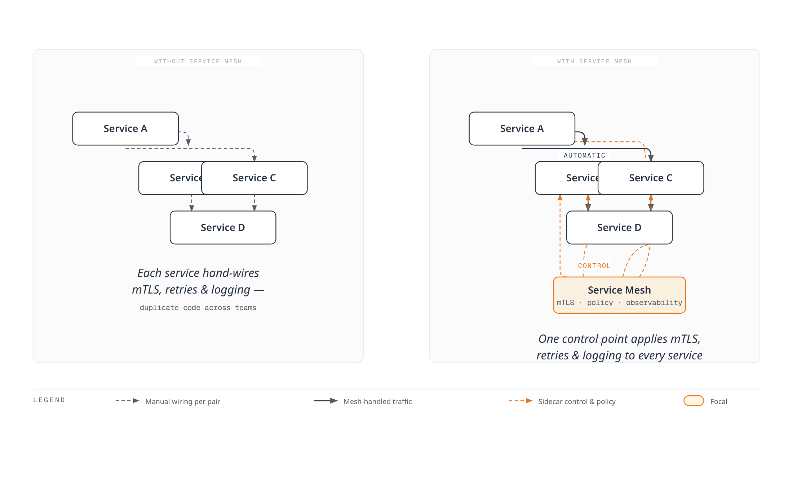
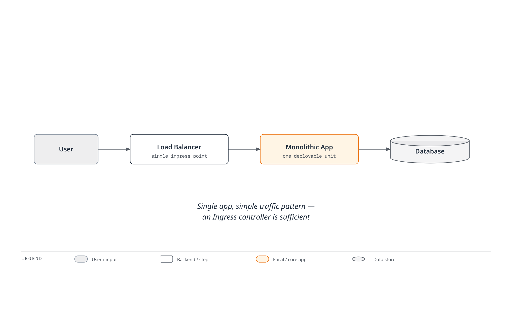

# Istio

> **最終更新**: August 31, 2026

Amazon EKS で Istio Service Mesh を活用するための実践ガイド。

### 2026年8月更新: Istio 1.30.4 / 1.29.7 セキュリティパッチリリース

2026年8月27日に、Istio 1.30.4 および 1.29.7 のパッチリリースが公開されました。これらのリリースには **セキュリティ修正（[ISTIO-SECURITY-2026-006](https://istio.io/latest/news/security/istio-security-2026-006/)）が含まれるため、速やかなアップグレードを推奨します**:

- **13件の Envoy CVE を修正**: HTTP/2 trailer 処理における heap use-after-free（CVE-2026-73513）、`ignore_path_parameters_in_path_matching` 経由の RBAC バイパス（CVE-2026-73553）、破棄された重複 Host header による HTTP/2 memory exhaustion（CVE-2026-73550）を含む
- **1件の Istio CVE を修正**: CA reference を解決できない場合に、sidecar proxy 上の `BackendTLSPolicy` が plaintext へ fail-open する問題（GHSA-qm8v-g4f9-qhjx）
- credential rotation 後に remote cluster の network gateway/endpoints が消失する可能性がある multicluster のバグなど、多数の安定性修正も含まれます

一方、次期バージョン 1.31 の release candidate は8月25日から27日にかけて rc.2 から rc.4 まで進み、公式リリースが近づいています。詳細は[1.30.4 の公式発表](https://istio.io/latest/news/releases/1.30.x/announcing-1.30.4/)を参照してください。

### 2026年8月更新: Istio 1.31 が RC に移行

2026年8月19日、1.31.0-beta.2 に続いて同日に最初の release candidate である [1.31.0-rc.0](https://github.com/istio/istio/releases) が公開され、次期 minor version の 1.31 は release-candidate 段階へ移行しました。RC は GA 直前の最終検証のための pre-release であり、公式リリースが近いことを示します。本番環境では引き続き GA リリースを使用してください。

### 2026年8月更新: Istio 1.31 が Beta に移行

次期 minor version である Istio 1.31 のリリースプロセスが進行中です。1.31.0-alpha.2 は2026年8月11日に公開され、続いて1.31.0-beta.0 が8月13日、1.31.0-beta.1 が8月14日に公開されました。Alpha/beta build は早期検証向けの pre-release であり、本番用途向けではありません。GA リリース前に新機能をテストしたい場合にのみ使用してください。詳細は [Istio releases page](https://github.com/istio/istio/releases) を参照してください。

### 2026年7月更新: Istio 1.30.3 / 1.29.6 パッチリリース

2026年7月16日に、Istio 1.30.3 および 1.29.6 のパッチリリースが公開されました。1.30.3 の主な内容:

- workload/service address の変更による XDS push を影響を受ける waypoint のみに限定し、ambient mode における istiod の scalability を改善
- istiod が更新済みの remote cluster secret（例: credential/token rotation 中）を再起動するまで取得しないバグを修正
- pilot node untaint controller の taint name を、`PILOT_NODE_UNTAINT_CONTROLLERS_TAINT_NAME` environment variable でカスタマイズ可能に

詳細は[公式発表](https://istio.io/latest/news/releases/1.30.x/announcing-1.30.3/)を参照してください。

## 目次

1. [Service Mesh は本当に必要ですか？](#do-you-really-need-a-service-mesh)
2. [インストールと初期セットアップ](01-installation.md)
3. [基本概念](02-basic-concepts.md)
4. [アーキテクチャ](03-architecture.md)
5. [AWS 統合](04-aws-integration.md)
6. [用語集](glossary.md)
7. [Traffic Management](traffic-management/README.md)
8. [セキュリティ](security/README.md)
9. [可観測性](observability/README.md)
10. [レジリエンス](resilience/README.md)
11. [高度な機能](advanced/README.md)
12. [トラブルシューティング](troubleshooting/common-errors.md)
13. [ベストプラクティス](best-practices.md)
14. [代替手段の比較](comparison/README.md)

## Istio とは？

Istio は、microservice の接続、保護、制御、監視を行うオープンソースの Service Mesh プラットフォームです。複雑な microservice architecture における Service 間の通信を管理し、traffic control、security、observability を提供します。

### Service Mesh の概念

<div align="center"></div>

Service Mesh は、microservice 間の通信を管理する infrastructure layer です。Istio は各 Service の隣に Sidecar Proxy（Envoy）をデプロイし、すべての network traffic を intercept および制御します。これにより、application code を変更することなく、次の機能を提供します:

* **Traffic Routing**: インテリジェントな routing、load balancing、Canary deployment
* **Security**: 自動 mTLS、authentication、authorization
* **Observability**: metrics、logs、distributed tracing
* **Resilience**: Circuit Breaking、Retry、Timeout

### 実践的な使用例

<p align="center"><br><em>Istio を使用しない Application</em></p>

<p align="center"><br><em>Istio を使用する Application - 各 Service に Sidecar としてデプロイされた Envoy Proxy</em></p>

Istio を適用すると、各 microservice に Envoy Proxy が sidecar container として自動的にデプロイされ、すべての network traffic を透過的に intercept および制御します。

## Service Mesh は本当に必要ですか？

Service Mesh は強力なツールですが、すべての状況に適しているわけではありません。導入前に慎重な検討が必要です。

### 判断フロー


### Service Mesh が必要な場合 ✅

#### 1. 複雑な Microservices 環境



**推奨基準**:

* ✅ 10個以上の microservice
* ✅ 頻繁な Service 間通信（East-West traffic）
* ✅ 複数の programming language を使用（Polyglot）
* ✅ 複数の team が Service を独立して開発

#### 2. Zero Trust Security 要件

**Service Mesh が提供する機能**:

* Service 間の自動 mTLS encryption
* SPIFFE ベースの Identity management
* きめ細かな authentication/authorization policy
* 暗号化通信の保証

**代替手段なしでは実現が困難な事項**:

* 各 Service における security logic 実装の重複
* 手動 certificate management の複雑さ
* 一貫性のない security policy

#### 3. 高度な Traffic Management

```yaml
# Canary Deployment (Traffic Distribution)
apiVersion: networking.istio.io/v1
kind: VirtualService
metadata:
  name: reviews
spec:
  hosts:
  - reviews
  http:
  - route:
    - destination:
        host: reviews
        subset: v1
      weight: 90
    - destination:
        host: reviews
        subset: v2
      weight: 10  # Only 10% to new version
```

**必要となる場合**:

* Canary deployment、A/B testing
* Header/path ベースの routing
* Traffic Mirroring（Shadow Testing）
* Fault Injection（Chaos Engineering）
* Circuit Breaking、Retry、Timeout

#### 4. 統合された Observability

**Service Mesh の利点**:

* application code を変更せずに metrics を自動収集
* Distributed Tracing の自動実装
* 統一された logging format
* Service topology の可視化（Kiali）

### Service Mesh が不要な場合 ❌

#### 1. シンプルな Architecture



**代わりに使用するもの**:

* Kubernetes Ingress Controller（NGINX、Traefik）
* シンプルな load balancer
* Application level の実装

#### 2. 少数の Microservices（10未満）

**Overhead の方が大きい**:

* Service Mesh の operational complexity > 得られる benefits
* 5～10個の Service は手動で管理可能
* NetworkPolicy で十分な security を提供

**代替手段**:

```yaml
# Kubernetes NetworkPolicy is sufficient
apiVersion: networking.k8s.io/v1
kind: NetworkPolicy
metadata:
  name: allow-frontend-to-backend
spec:
  podSelector:
    matchLabels:
      app: backend
  ingress:
  - from:
    - podSelector:
        matchLabels:
          app: frontend
```

#### 3. 運用リソースが不足している場合

**Service Mesh の運用要件**:

* Istio/Envoy の専門知識
* Control Plane の monitoring と management
* Upgrade と patch の管理
* Troubleshooting 能力（debugging complexity の増加）

**必要な team の準備**:

* 少なくとも1～2名の Service Mesh expert
* 継続的な学習と update の追跡
* 十分な test environment

#### 4. Performance が極めて重要な場合

**Service Mesh の Overhead**:

* Latency: +1-3ms（P50）、+5-10ms（P99）
* CPU: Pod あたり +10-20%
* Memory: Pod あたり +50-100MB（Sidecar mode）

**検討する代替手段**:

* Ambient Mode（resource usage を90%削減）
* CNI ベースの solution（Cilium）
* Application level の optimization

### 代替 Solution の比較

| 機能                    | Service Mesh                                 | CNI（Cilium）    | Ingress Controller | App-level                |
| -------------------------- | -------------------------------------------- | --------------- | ------------------ | ------------------------ |
| **L7 Traffic Management**  | ✅ 完全対応                               | ⚠️ 制限あり      | ⚠️ Ingress のみ    | ✅ 可能               |
| **mTLS Automation**        | ✅ 完全対応                               | ✅ 可能      | ❌ 未対応    | ❌ 手動実装  |
| **Distributed Tracing**    | ✅ 自動                                  | ❌ 未対応 | ❌ 未対応    | ⚠️ 手動実装 |
| **L3/L4 Policies**         | ✅ 対応                                  | ✅ 完全対応  | ❌ 未対応    | ❌ 未対応          |
| **Operational Complexity** | 🔴 高                                      | 🟡 中       | 🟢 低             | 🟡 中                |
| **Resource Overhead**      | <p>🔴 高（Sidecar）<br>🟢 低（Ambient）</p> | 🟢 低          | 🟢 低             | 🟢 なし                  |
| **適した規模**         | 10+ Service                                 | すべての規模      | 小規模        | 小規模              |

### CNI ベースの Solution（Cilium）

Cilium は eBPF に基づき、**network level** で多くの機能を提供します:


**Cilium の方が適している場合**:

* L3/L4 network policy が主な目的
* high performance が中核要件
* Service Mesh の operational burden を回避したい
* シンプルな mTLS と observability のみが必要

**参照**: [Cilium Documentation](../../networking/cilium/README.md)

### 判断チェックリスト

導入前に以下の質問に回答してください:

**Architecture**:

* [ ] 10個以上の microservice がありますか？
* [ ] Service 間通信は複雑ですか？
* [ ] 複数の programming language を使用していますか？

**Security**:

* [ ] Zero Trust security model が必要ですか？
* [ ] Service 間の mTLS encryption は必須ですか？
* [ ] きめ細かな access control が必要ですか？

**Traffic Management**:

* [ ] Canary deployment、A/B testing が必要ですか？
* [ ] 高度な routing rule が必要ですか？
* [ ] 多くの Service に Circuit Breaking、Retry が必要ですか？

**Observability**:

* [ ] distributed tracing は必須ですか？
* [ ] 統一された metric collection が必要ですか？
* [ ] Service topology の可視化が必要ですか？

**Operations**:

* [ ] Service Mesh expert がいますか？
* [ ] operational complexity に対応できますか？
* [ ] resource overhead を許容できますか？

**結果**:

* ✅ 10項目以上チェック: Service Mesh を強く推奨
* 🟡 5～9項目チェック: 慎重な評価が必要。小規模から開始してください（Ambient Mode を推奨）
* ❌ 4項目以下チェック: 代替 solution（CNI、Ingress、App-level）を検討

### 段階的な導入戦略

Service Mesh が必要と判断した場合は、段階的に導入してください:


**推奨順序**:

1. **Pilot Project**（1～2 namespace）
2. **Observability First**（metrics、logs、traces）
3. **Security の適用**（mTLS PERMISSIVE → STRICT）
4. **Traffic Management**（VirtualService、DestinationRule）
5. **全社展開**

### 主な機能

1.  **Traffic Management**

    <div align="center"></div>

    * インテリジェントな routing と load balancing
    * A/B testing、Canary deployment、Blue/Green deployment
    * Circuit Breaking、Retry、Timeout の制御
    * Traffic Mirroring と Fault Injection
2.  **Security**

    <div align="center"></div>

    * Service 間の自動 mTLS encryption
    * 強力な authentication と authorization
    * きめ細かな access control policy
    * Network isolation と security policy
3.  **Observability**

    <div align="center"></div>

    * metrics、logs、trace の自動生成
    * Prometheus、Grafana、Jaeger、Kiali との統合
    * Service topology の可視化
    * リアルタイム traffic monitoring
4. **Resilience**
   * Circuit Breaker pattern
   * Rate Limiting
   * Outlier Detection
   * Zone Aware Routing

### Istio Architecture

<div align="center"></div>

Istio は Control Plane と Data Plane で構成されます:


**Control Plane（istiod）**:

* **Pilot**: Service discovery、traffic routing rule の管理
* **Citadel**: certificate の生成と管理、mTLS の有効化
* **Galley**: configuration の validation と deployment

**Data Plane**:

* **Envoy Proxy**: 各 Pod に sidecar としてデプロイされ、すべての network traffic を intercept および制御

### Amazon EKS で Istio を使用する利点

1. **容易な Microservices 管理**
   * application code を変更しない traffic management
   * declarative configuration による一貫した policy 適用
   * Kubernetes Native API を使用
2. **Security の強化**
   * Service 間の自動 encryption
   * AWS IAM と統合された authentication
   * きめ細かな permission control
3. **Observability の向上**
   * Amazon CloudWatch との統合
   * AWS X-Ray による distributed tracing
   * 詳細な metrics と logs
4. **AWS Services との統合**
   * Application Load Balancer（ALB）との統合
   * AWS Certificate Manager（ACM）との統合
   * Amazon EBS CSI Driver と互換

### はじめに

<div align="center"></div>

Istio を初めて使用する場合は、以下の順序で document を読んでください:

1. [**インストールと初期セットアップ**](01-installation.md): EKS cluster に Istio をインストール
2. [**基本概念**](02-basic-concepts.md): Istio の core concept を理解
3. [**Traffic Management**](traffic-management/README.md): Gateway、VirtualService、DestinationRule を学習
4. [**Security**](security/README.md): mTLS、authentication、authorization を設定
5. [**Observability**](observability/README.md): metrics、logs、traces を収集
6. [**ベストプラクティス**](best-practices.md): 本番環境向けの推奨事項

### ハンズオン例

各 section には動作する YAML example が含まれています。すべての example は click-to-copy 形式になっています:

```yaml
# Example VirtualService
apiVersion: networking.istio.io/v1
kind: VirtualService
metadata:
  name: reviews
spec:
  hosts:
  - reviews
  http:
  - route:
    - destination:
        host: reviews
        subset: v1
```

### 参照資料

* [Istio 公式 Documentation](https://istio.io/latest/docs/)
* [Istio GitHub](https://github.com/istio/istio)
* [AWS EKS Workshop - Istio](https://www.eksworkshop.com/intermediate/330_servicemesh_using_istio/)
* [Istio Community](https://discuss.istio.io/)

### クイズ

この章で学んだ内容を確認するには、以下のクイズに挑戦してください:

* [Traffic Management クイズ](../../quizzes/service-mesh/istio/traffic-management.md)
* [Security クイズ](../../quizzes/service-mesh/istio/security.md)
* [Observability クイズ](../../quizzes/service-mesh/istio/observability.md)
* [Resilience クイズ](../../quizzes/service-mesh/istio/resilience.md)
* [高度な機能クイズ](../../quizzes/service-mesh/istio/advanced.md)
