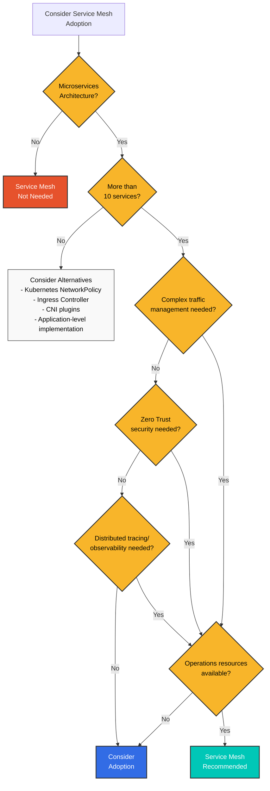
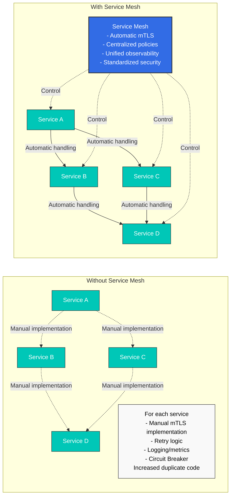
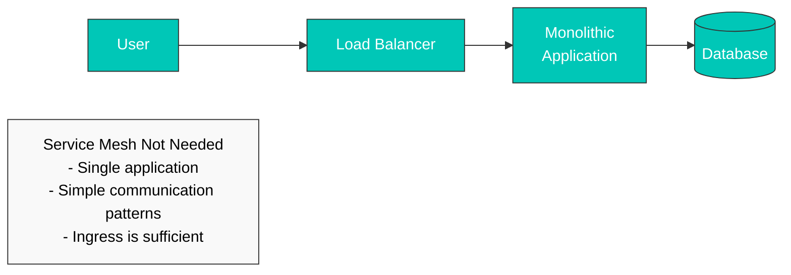
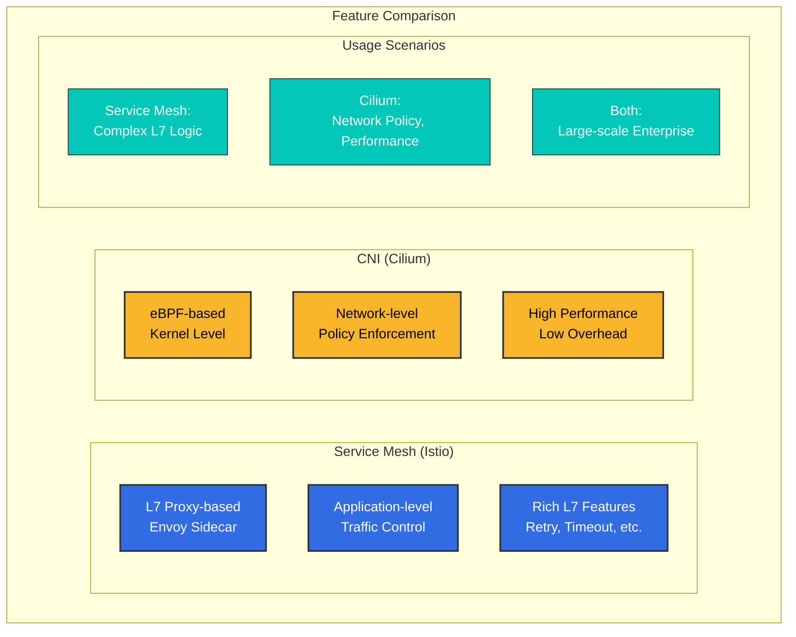
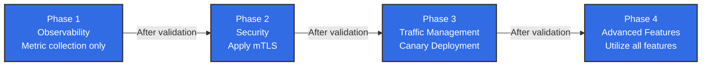
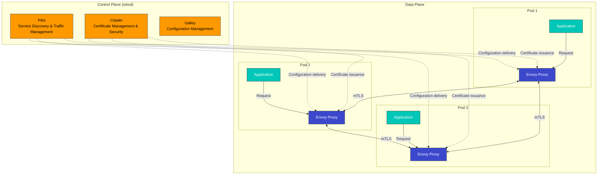

# Istio

> **最終更新**: August 17, 2026

Amazon EKS で Istio Service Mesh を活用するための実践ガイドです。

### 2026年8月アップデート: Istio 1.31 がベータ版に移行

次のマイナーバージョンである Istio 1.31 のリリースプロセスが進行中です。2026年8月11日に 1.31.0-alpha.2 が公開され、続いて8月13日に 1.31.0-beta.0、8月14日に 1.31.0-beta.1 が公開されました。alpha/beta ビルドは早期検証用のプレリリースであり、本番利用向けではありません。GA リリースに先立って新機能をテストしたい場合にのみ使用してください。詳細は [Istio リリースページ](https://github.com/istio/istio/releases) を参照してください。

### 2026年7月アップデート: Istio 1.30.3 / 1.29.6 パッチリリース

2026年7月16日に、Istio 1.30.3 および 1.29.6 のパッチリリースが公開されました。1.30.3 の主な変更点は次のとおりです。

- ambient mode において、workload/service アドレスの変更による XDS push を影響を受ける waypoint のみに限定し、istiod のスケーラビリティを向上
- 再起動するまで istiod が更新済みの remote cluster secret（例: credential/token rotation 中）を取得しないバグを修正
- pilot node untaint controller の taint 名を、`PILOT_NODE_UNTAINT_CONTROLLERS_TAINT_NAME` 環境変数でカスタマイズ可能に変更

詳細は [公式発表](https://istio.io/latest/news/releases/1.30.x/announcing-1.30.3/) を参照してください。

## 目次

1. [Service Mesh は本当に必要ですか？](./#do-you-really-need-a-service-mesh)
2. [インストールと初期セットアップ](01-installation.md)
3. [基本概念](02-basic-concepts.md)
4. [アーキテクチャ](03-architecture.md)
5. [AWS 統合](04-aws-integration.md)
6. [用語集](glossary.md)
7. [トラフィック管理](traffic-management/)
8. [セキュリティ](security/)
9. [オブザーバビリティ](observability/)
10. [レジリエンス](resilience/)
11. [高度なトピック](advanced/)
12. [トラブルシューティング](troubleshooting/common-errors.md)
13. [ベストプラクティス](best-practices.md)
14. [代替案との比較](comparison/)

## Istio とは？

Istio は、microservice の接続、保護、制御、可観測性を実現するオープンソースの Service Mesh プラットフォームです。複雑な microservice アーキテクチャにおける Service 間通信を管理し、トラフィック制御、セキュリティ、オブザーバビリティを提供します。

### Service Mesh の概念

<div align="center"></div>

Service Mesh は、microservice 間の通信を管理するインフラストラクチャレイヤーです。Istio は各 Service とともに Sidecar Proxy（Envoy）をデプロイし、すべてのネットワークトラフィックをインターセプトして制御します。これにより、アプリケーションコードを変更せずに次の機能を提供します。

* **トラフィックルーティング**: インテリジェントルーティング、ロードバランシング、Canary deployment
* **セキュリティ**: 自動 mTLS、認証、認可
* **オブザーバビリティ**: metrics、logs、distributed tracing
* **レジリエンス**: Circuit Breaking、Retry、Timeout

### 実践的な利用例

<p align="center"><br><em>Istio なしのアプリケーション</em></p>

<p align="center"><br><em>Istio を使用するアプリケーション - 各 Service に Sidecar としてデプロイされた Envoy Proxy</em></p>

Istio を適用すると、Envoy Proxy が各 microservice に sidecar container として自動的にデプロイされ、すべてのネットワークトラフィックを透過的にインターセプトして制御します。

## Service Mesh は本当に必要ですか？

Service Mesh は強力なツールですが、すべての状況に適しているわけではありません。導入前に慎重な検討が必要です。

### 判断フロー



### Service Mesh が必要な場合 ✅

#### 1. 複雑な Microservices 環境



**推奨基準**:

* ✅ 10 個以上の microservice
* ✅ Service 間通信（East-West traffic）が頻繁に発生する
* ✅ 複数のプログラミング言語（Polyglot）を使用している
* ✅ 複数のチームが Service を独立して開発している

#### 2. Zero Trust セキュリティ要件

**Service Mesh が提供する機能**:

* Service 間の自動 mTLS 暗号化
* SPIFFE ベースの Identity 管理
* きめ細かな認証/認可ポリシー
* 暗号化通信の保証

**代替案では実現が難しいこと**:

* 各 Service でセキュリティロジックを重複実装する必要がある
* 手動の certificate 管理が複雑になる
* セキュリティポリシーに一貫性がなくなる

#### 3. 高度なトラフィック管理

```yaml
# Canary Deployment (Traffic Distribution)
apiVersion: networking.istio.io/v1
kind: VirtualService
metadata:
  name: reviews
spec:
  hosts:
  - reviews
  http:
  - route:
    - destination:
        host: reviews
        subset: v1
      weight: 90
    - destination:
        host: reviews
        subset: v2
      weight: 10  # Only 10% to new version
```

**必要となる場合**:

* Canary deployment、A/B testing
* Header/path ベースのルーティング
* Traffic Mirroring（Shadow Testing）
* Fault Injection（Chaos Engineering）
* Circuit Breaking、Retry、Timeout

#### 4. 統合されたオブザーバビリティ

**Service Mesh の利点**:

* アプリケーションコードを変更せずに metrics を自動収集
* Distributed Tracing を自動実装
* 統一された logging 形式
* Service topology の可視化（Kiali）

### Service Mesh が不要な場合 ❌

#### 1. シンプルなアーキテクチャ



**代わりに使用するもの**:

* Kubernetes Ingress Controller（NGINX、Traefik）
* シンプルな load balancer
* アプリケーションレベルの実装

#### 2. Microservices が少ない場合（10未満）

**オーバーヘッドがより大きい場合**:

* Service Mesh の運用の複雑さ > 得られる利点
* 5～10 個の Service は手動で管理できる
* NetworkPolicy で十分なセキュリティを提供できる

**代替案**:

```yaml
# Kubernetes NetworkPolicy is sufficient
apiVersion: networking.k8s.io/v1
kind: NetworkPolicy
metadata:
  name: allow-frontend-to-backend
spec:
  podSelector:
    matchLabels:
      app: backend
  ingress:
  - from:
    - podSelector:
        matchLabels:
          app: frontend
```

#### 3. 運用リソースが不足している場合

**Service Mesh の運用要件**:

* Istio/Envoy の専門知識
* Control Plane の監視と管理
* Upgrade と patch 管理
* トラブルシューティング能力（debugging の複雑さが増加）

**必要なチームの準備**:

* 少なくとも 1～2 名の Service Mesh 専門家
* 継続的な学習とアップデートの追跡
* 十分なテスト環境

#### 4. パフォーマンスが極めて重要な場合

**Service Mesh のオーバーヘッド**:

* Latency: +1-3ms（P50）、+5-10ms（P99）
* CPU: Pod ごとに +10-20%
* Memory: Pod ごとに +50-100MB（Sidecar mode）

**代替案を検討**:

* Ambient Mode（リソース使用量を 90% 削減）
* CNI ベースのソリューション（Cilium）
* アプリケーションレベルの最適化

### 代替ソリューションの比較

| 機能                    | Service Mesh                                 | CNI（Cilium）    | Ingress Controller | アプリケーションレベル                |
| -------------------------- | -------------------------------------------- | --------------- | ------------------ | ------------------------ |
| **L7 トラフィック管理**  | ✅ 完全対応                               | ⚠️ 限定的      | ⚠️ Ingress のみ    | ✅ 可能               |
| **mTLS 自動化**        | ✅ 完全対応                               | ✅ 可能      | ❌ 非対応    | ❌ 手動実装  |
| **Distributed Tracing**    | ✅ 自動                                  | ❌ 非対応 | ❌ 非対応    | ⚠️ 手動実装 |
| **L3/L4 ポリシー**         | ✅ 対応                                  | ✅ 完全対応  | ❌ 非対応    | ❌ 非対応          |
| **運用の複雑さ** | 🔴 高                                      | 🟡 中       | 🟢 低             | 🟡 中                |
| **リソースオーバーヘッド**      | <p>🔴 高（Sidecar）<br>🟢 低（Ambient）</p> | 🟢 低          | 🟢 低             | 🟢 なし                  |
| **適した規模**         | 10+ services                                 | すべての規模      | 小規模        | 小規模              |

### CNI ベースのソリューション（Cilium）

Cilium は eBPF をベースとして、**network level** で多くの機能を提供します。



**Cilium がより適している場合**:

* L3/L4 network policy が主な目的である
* 高パフォーマンスが中核要件である
* Service Mesh の運用負担を回避したい
* シンプルな mTLS とオブザーバビリティのみが必要である

**参照**: [Cilium ドキュメント](../../networking/cilium/)

### 判断チェックリスト

導入前に次の質問に回答してください。

**アーキテクチャ**:

* [ ] 10 個以上の microservice がありますか？
* [ ] Service 間通信は複雑ですか？
* [ ] 複数のプログラミング言語を使用していますか？

**セキュリティ**:

* [ ] Zero Trust セキュリティモデルが必要ですか？
* [ ] Service 間の mTLS 暗号化は必須ですか？
* [ ] きめ細かなアクセス制御が必要ですか？

**トラフィック管理**:

* [ ] Canary deployment、A/B testing は必要ですか？
* [ ] 高度なルーティングルールが必要ですか？
* [ ] 多くの Service で Circuit Breaking、Retry が必要ですか？

**オブザーバビリティ**:

* [ ] distributed tracing は必須ですか？
* [ ] 統合された metric 収集が必要ですか？
* [ ] Service topology の可視化が必要ですか？

**運用**:

* [ ] Service Mesh の専門家がいますか？
* [ ] 運用の複雑さに対応できますか？
* [ ] リソースオーバーヘッドを受け入れられますか？

**結果**:

* ✅ 10 個以上にチェック: Service Mesh を強く推奨
* 🟡 5～9 個にチェック: 慎重な評価が必要。小規模から開始（Ambient Mode を推奨）
* ❌ 4 個以下にチェック: 代替ソリューション（CNI、Ingress、アプリケーションレベル）を検討

### 段階的な導入戦略

Service Mesh が必要だと判断した場合は、段階的に導入してください。



**推奨順序**:

1. **パイロットプロジェクト**（1～2 namespaces）
2. **オブザーバビリティを優先**（metrics、logs、traces）
3. **セキュリティを適用**（mTLS PERMISSIVE → STRICT）
4. **トラフィック管理**（VirtualService、DestinationRule）
5. **全社への展開**

### 主な機能

1.  **トラフィック管理**

    <div align="center"></div>

    * インテリジェントルーティングとロードバランシング
    * A/B testing、Canary deployment、Blue/Green deployment
    * Circuit Breaking、Retry、Timeout の制御
    * Traffic Mirroring と Fault Injection
2.  **セキュリティ**

    <div align="center"></div>

    * Service 間の自動 mTLS 暗号化
    * 強力な認証と認可
    * きめ細かなアクセス制御ポリシー
    * ネットワーク分離とセキュリティポリシー
3.  **オブザーバビリティ**

    <div align="center"></div>

    * metrics、logs、trace の自動生成
    * Prometheus、Grafana、Jaeger、Kiali 統合
    * Service topology の可視化
    * リアルタイムのトラフィック監視
4. **レジリエンス**
   * Circuit Breaker パターン
   * Rate Limiting
   * Outlier Detection
   * Zone Aware Routing

### Istio アーキテクチャ

<div align="center"></div>

Istio は Control Plane と Data Plane で構成されます。



**Control Plane（istiod）**:

* **Pilot**: Service discovery、トラフィックルーティングルールの管理
* **Citadel**: certificate の生成と管理、mTLS の有効化
* **Galley**: 設定の検証とデプロイ

**Data Plane**:

* **Envoy Proxy**: 各 Pod に sidecar としてデプロイされ、すべてのネットワークトラフィックをインターセプトして制御

### Amazon EKS で Istio を使用する利点

1. **容易な Microservices 管理**
   * アプリケーションコードを変更せずにトラフィックを管理
   * 宣言的な設定で一貫したポリシーを適用
   * Kubernetes Native API を使用
2. **強化されたセキュリティ**
   * Service 間の自動暗号化
   * AWS IAM と統合された認証
   * きめ細かな権限制御
3. **向上したオブザーバビリティ**
   * Amazon CloudWatch との統合
   * AWS X-Ray による distributed tracing
   * 詳細な metrics と logs
4. **AWS Services との統合**
   * Application Load Balancer（ALB）統合
   * AWS Certificate Manager（ACM）統合
   * Amazon EBS CSI Driver と互換

### はじめに

<div align="center"></div>

Istio を初めて使用する場合は、次の順序でドキュメントを読んでください。

1. [**インストールと初期セットアップ**](01-installation.md): EKS cluster に Istio をインストール
2. [**基本概念**](02-basic-concepts.md): Istio の中核概念を理解
3. [**トラフィック管理**](traffic-management/): Gateway、VirtualService、DestinationRule を学ぶ
4. [**セキュリティ**](security/): mTLS、認証、認可を設定
5. [**オブザーバビリティ**](observability/): metrics、logs、traces を収集
6. [**ベストプラクティス**](best-practices.md): 本番環境向けの推奨事項

### ハンズオン例

各セクションには、動作する YAML の例が含まれています。すべての例はクリックしてコピーできる形式です。

```yaml
# Example VirtualService
apiVersion: networking.istio.io/v1
kind: VirtualService
metadata:
  name: reviews
spec:
  hosts:
  - reviews
  http:
  - route:
    - destination:
        host: reviews
        subset: v1
```

### 参考資料

* [Istio 公式ドキュメント](https://istio.io/latest/docs/)
* [Istio GitHub](https://github.com/istio/istio)
* [AWS EKS Workshop - Istio](https://www.eksworkshop.com/intermediate/330_servicemesh_using_istio/)
* [Istio コミュニティ](https://discuss.istio.io/)

### クイズ

この章で学んだ内容をテストするには、次のクイズに挑戦してください。

* [トラフィック管理クイズ](../../quizzes/service-mesh/istio/traffic-management.md)
* [セキュリティクイズ](../../quizzes/service-mesh/istio/security.md)
* [オブザーバビリティクイズ](../../quizzes/service-mesh/istio/observability.md)
* [レジリエンスクイズ](../../quizzes/service-mesh/istio/resilience.md)
* [高度なトピッククイズ](../../quizzes/service-mesh/istio/advanced.md)
