# Ambient Mode

Ambient Mode は、Istio 1.28 で導入された革新的なデータプレーンアーキテクチャです。従来の Sidecar アプローチにおける複雑さとリソースオーバーヘッドを削減しながら、Service Mesh の中核機能を提供します。

## 目次

1. [概要](#overview)
2. [Sidecar Mode と Ambient Mode](#sidecar-mode-vs-ambient-mode)
3. [アーキテクチャ](#architecture)
4. [インストールと設定](#installation-and-configuration)
5. [移行](#migration)
6. [パフォーマンス比較](#performance-comparison)
7. [ユースケース](#use-cases)
8. [トラブルシューティング](#troubleshooting)

## 概要

<p align="center">
  
</p>

Ambient Mode は、アプリケーション Pod に Sidecar Proxy を注入せずに Service Mesh 機能を提供する新しいアプローチです。上の図に示すように、Ambient Mode は**レイヤー型アーキテクチャ**で構成されます。

1. **セキュアオーバーレイ層（L4）**: ztunnel による mTLS と基本テレメトリー
2. **L7 処理層**: Waypoint Proxy による高度なトラフィック管理

### Ambient Mode が必要な理由

従来の Sidecar モデルの制約:
- **高いリソースオーバーヘッド**: 各 Pod に Envoy Proxy（50～100MB のメモリ）が必要
- **運用の複雑さ**: Pod の再起動、バージョン管理、ローリングアップデートが複雑
- **初期レイテンシー**: Sidecar の初期化により Pod の起動時間が増加
- **過剰な機能**: ほとんどのワークロードは L7 機能を使用しない

Ambient Mode の解決策:
- ノードごとに 1 つの Proxy: リソース使用量を 90% 以上削減
- Pod の再起動が不要: ダウンタイムゼロで Service Mesh を導入
- 段階的な導入: 必要に応じて L4 から L7 へ拡張
- 透過的な統合: アプリケーションコードの変更不要

### コアコンセプト

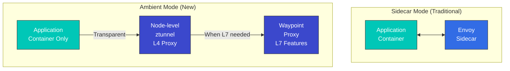

### Ambient Mode の利点

1. **低いリソース使用量**: Pod ごとではなくノードごとに Proxy を配置
2. **シンプルなデプロイ**: Pod の再起動が不要
3. **透過的な導入**: アプリケーションの変更不要
4. **柔軟な L7 機能**: 必要な場合にのみ Waypoint を使用

## Sidecar Mode と Ambient Mode

### アーキテクチャ比較

#### Sidecar Mode

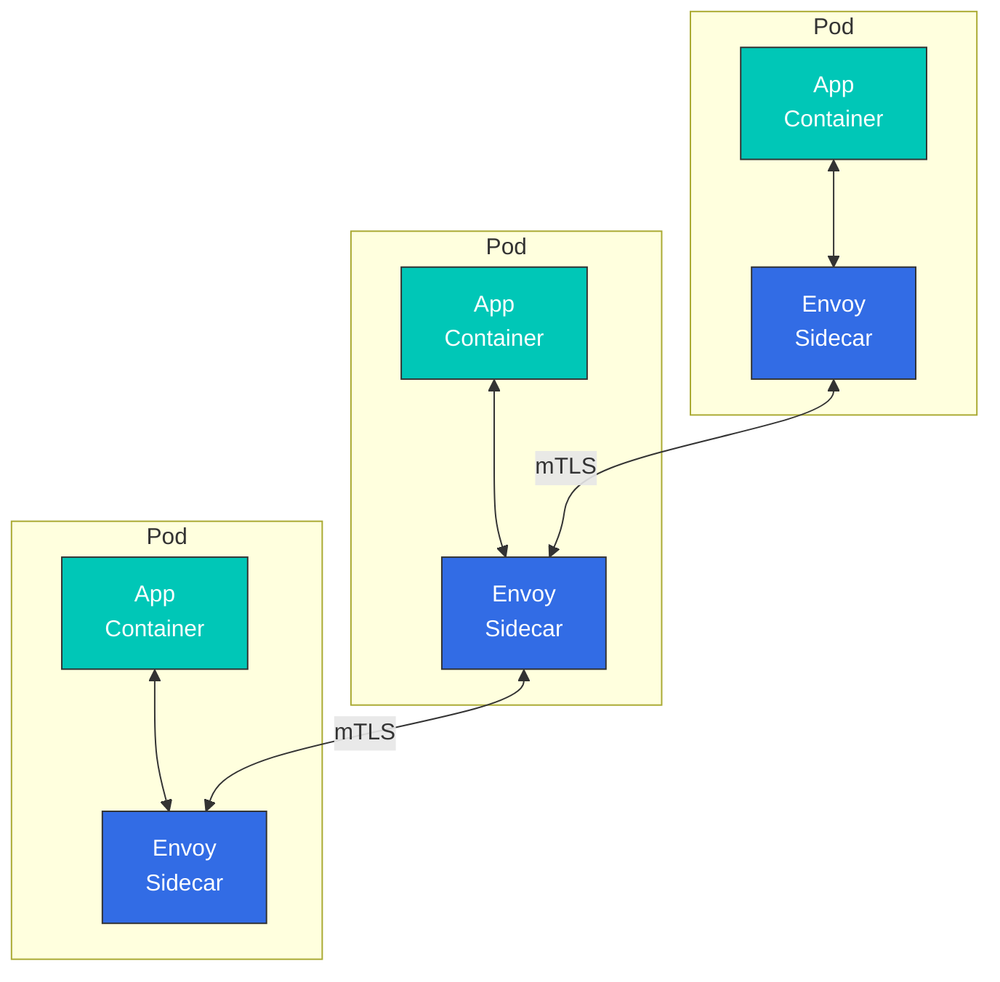

**特徴**:
- 各 Pod に Envoy Proxy を注入
- すべての L4/L7 機能をサポート
- 高いリソース使用量
- Pod の再起動が必要

#### Ambient Mode

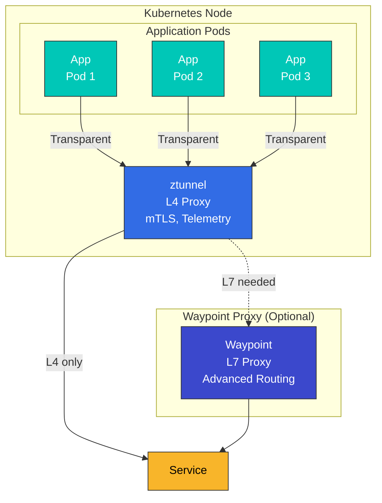

**特徴**:
- ノードごとに 1 つの ztunnel
- L4 機能をデフォルトで提供
- L7 機能には Waypoint が必要
- Pod の再起動が不要

### 詳細比較表

| 項目 | Sidecar Mode | Ambient Mode |
|------|-------------|--------------|
| **デプロイ方法** | Pod への Sidecar 注入 | ノードレベルの ztunnel + オプションの Waypoint |
| **リソース使用量** | 高い（Pod ごとに約 50～100MB） | 低い（ノードごとに約 50MB） |
| **Pod の再起動** | 必要 | 不要 |
| **初期レイテンシー** | あり（Sidecar の初期化） | 最小限 |
| **L4 機能** | サポート | サポート |
| **L7 機能** | 完全にサポート | Waypoint が必要 |
| **mTLS** | 自動 | 自動 |
| **テレメトリー** | 詳細 | 基本（L4）、詳細（Waypoint 使用時の L7） |
| **Circuit Breaker** | サポート | Waypoint が必要 |
| **Retry/Timeout** | サポート | Waypoint が必要 |
| **Header 操作** | サポート | Waypoint が必要 |
| **パフォーマンスオーバーヘッド** | 中程度（約 5～10%） | 低い（約 1～3%） |
| **運用の複雑さ** | 高い | 低い |
| **本番環境への対応度** | 成熟 | ベータ（Istio 1.28+） |

### リソース使用量の比較

```yaml
# Sidecar Mode
# 100 pods x 50MB = 5GB memory
# 100 pods x 0.1 CPU = 10 vCPU

# Ambient Mode
# 10 nodes x 50MB = 500MB memory (ztunnel)
# + Waypoint (when needed): 200MB memory
# Total: ~700MB memory
```

## アーキテクチャ

<p align="center">
  
</p>

Ambient Mode のデータプレーンは、**ztunnel** と **Waypoint Proxy** という 2 つのコアコンポーネントで構成されます。

### ztunnel（Zero Trust Tunnel）

<p align="center">
  
</p>

ztunnel は Ambient Mode のコアコンポーネントであり、**ノードレベルで稼働する軽量な L4 Proxy** です。各 Kubernetes ノードに DaemonSet としてデプロイされ、そのノード上のすべての Pod トラフィックを透過的に処理します。

#### ztunnel の仕組み

1. **トラフィックキャプチャ**: CNI Plugin と eBPF により Pod のネットワークトラフィックを透過的にインターセプト
2. **mTLS の適用**: SPIFFE ベースの Identity を使用して mTLS 暗号化を自動的に適用
3. **負荷分散**: Endpoint 間で L4 負荷分散を実行
4. **テレメトリー収集**: 接続メトリクスとログを収集
5. **転送**: トラフィックを宛先の ztunnel または Waypoint に転送

**ztunnel のテクノロジースタック**:
- **言語**: Rust（高パフォーマンス、低メモリ使用量）
- **プロトコル**: HBONE（HTTP-Based Overlay Network Environment）
- **Identity**: SPIFFE/SPIRE 標準に準拠
- **CNI**: Istio CNI Plugin と緊密に統合

#### ztunnel の役割

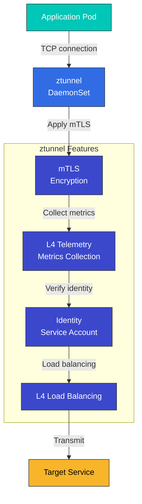

**ztunnel の特徴**:
- Rust で実装（パフォーマンス最適化）
- DaemonSet としてデプロイ
- CNI Plugin と統合
- eBPF ベースのトラフィックリダイレクト

#### ztunnel のデプロイ

```yaml
apiVersion: apps/v1
kind: DaemonSet
metadata:
  name: ztunnel
  namespace: istio-system
spec:
  selector:
    matchLabels:
      app: ztunnel
  template:
    metadata:
      labels:
        app: ztunnel
    spec:
      hostNetwork: true
      containers:
      - name: istio-proxy
        image: istio/ztunnel:1.28.0
        securityContext:
          privileged: true
          capabilities:
            add:
            - NET_ADMIN
            - SYS_ADMIN
        resources:
          requests:
            cpu: 100m
            memory: 50Mi
          limits:
            cpu: 200m
            memory: 100Mi
```

### Waypoint Proxy

<p align="center">
  
</p>

Waypoint は、**L7 機能が必要な場合に使用するオプションの Proxy** です。上の図に示すように、Waypoint は Service の前に配置され、高度なトラフィック管理機能を提供します。

#### Waypoint の主な特徴

1. **選択的なデプロイ**: すべての Service ではなく、L7 機能が必要な Service にのみ使用
2. **共有 Proxy**: 複数のワークロードが 1 つの Waypoint を共有（Namespace または ServiceAccount ごと）
3. **Envoy ベース**: 従来の Sidecar と同じ Envoy Proxy を使用し、すべての Istio L7 機能をサポート
4. **オンデマンド**: 実行時に動的に追加・削除可能

#### Waypoint のデプロイ単位

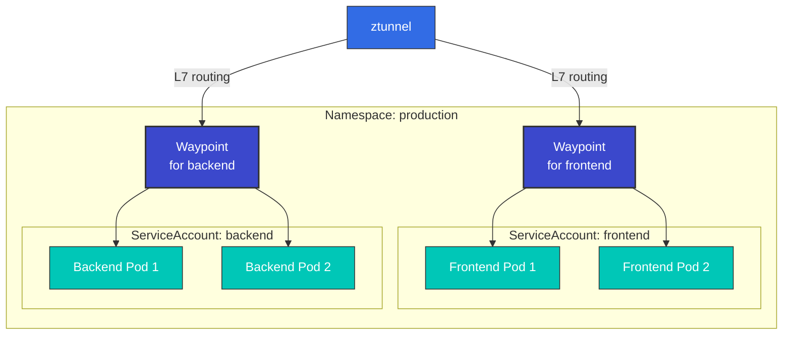

**デプロイオプション**:
- **ServiceAccount ベース**: 特定の SA を持つ Pod のみが対応する Waypoint を使用
- **Namespace ベース**: Namespace 全体のすべての Pod が 1 つの Waypoint を使用
- **ワークロードベース**: 特定のワークロード（Deployment、StatefulSet など）にのみ適用

#### Waypoint の役割

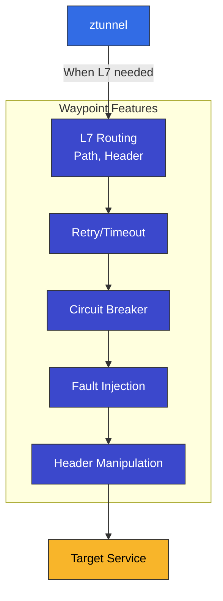

**Waypoint の特徴**:
- Service Account ごと、または Namespace ごとにデプロイ
- Envoy Proxy ベース
- すべての L7 Istio 機能をサポート
- 必要な Service にのみ選択的に使用

#### Waypoint のデプロイ

```yaml
apiVersion: gateway.networking.k8s.io/v1
kind: Gateway
metadata:
  name: reviews-waypoint
  namespace: default
spec:
  gatewayClassName: istio-waypoint
  listeners:
  - name: mesh
    port: 15008
    protocol: HBONE
```

### 完全なトラフィックフロー

以下は、**Sidecar なし**の Ambient Mode におけるトラフィックフロー全体を示す図です。

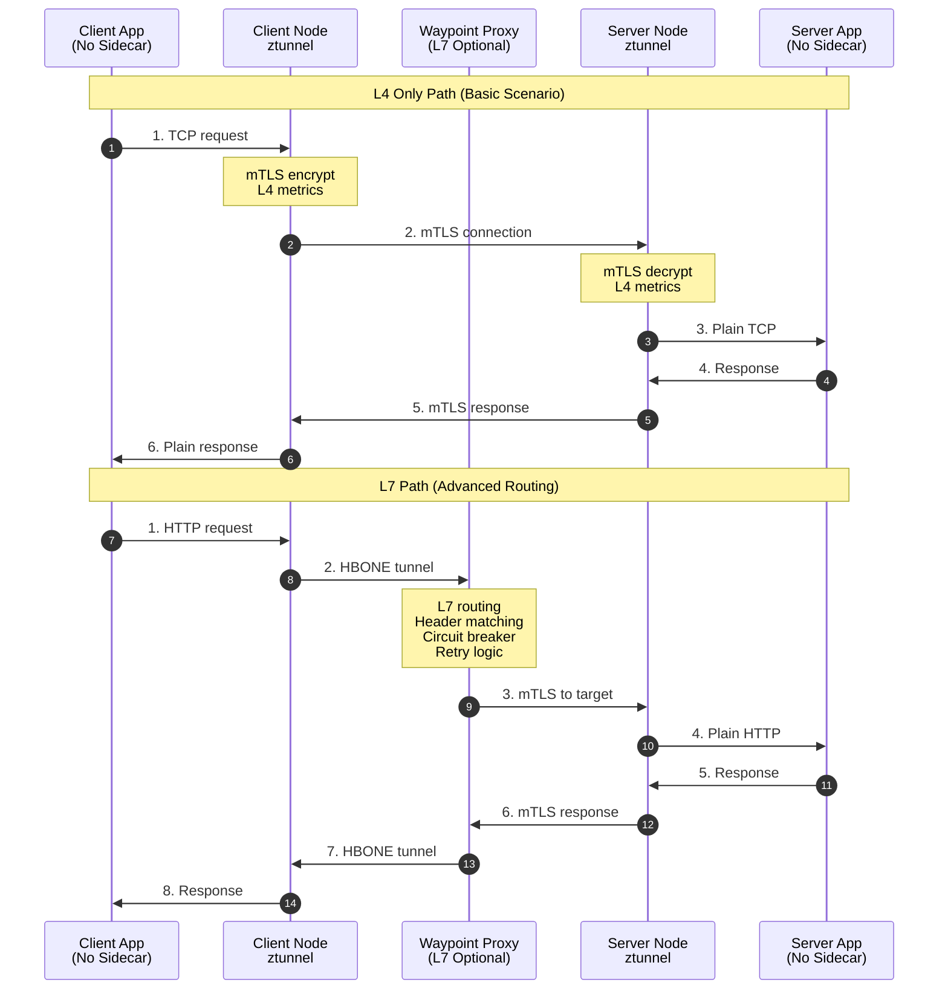

**トラフィックフローの分析**:

1. **L4 のみのパス**（ztunnel のみを使用）:
   - 最小限のレイテンシー（約 1ms）
   - mTLS を自動的に適用
   - 基本テレメトリー
   - ワークロードの 80～90% に十分

2. **L7 パス**（ztunnel + Waypoint）:
   - Header ベースのルーティング
   - Circuit Breaking
   - Retry/Timeout
   - 複雑なトラフィックポリシーが必要な場合

### HBONE プロトコル

<p align="center">
  
</p>

**HBONE（HTTP-Based Overlay Network Environment）**は、Ambient Mode で使用されるトンネリングプロトコルです。

- **HTTP/2 ベース**: 既存インフラストラクチャとの互換性
- **組み込み mTLS**: セキュアな通信
- **効率的**: 最小限のオーバーヘッド
- **ファイアウォールフレンドリー**: 標準 HTTP/2 ポートを使用

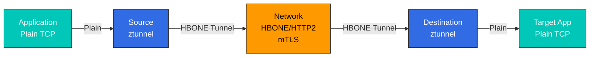

## インストールと設定

### 1. Istio のインストール（Ambient Mode）

```bash
# Download Istio
curl -L https://istio.io/downloadIstio | ISTIO_VERSION=1.28.0 sh -
cd istio-1.28.0
export PATH=$PWD/bin:$PATH

# Install with Ambient profile
istioctl install --set profile=ambient -y

# Verify installation
kubectl get pods -n istio-system
# Output:
# NAME                                   READY   STATUS
# istio-cni-node-xxxxx                   1/1     Running
# istiod-xxxxx                           1/1     Running
# ztunnel-xxxxx                          1/1     Running
```

### 2. Namespace で Ambient Mode を有効化

```bash
# Enable Ambient Mode with Label
kubectl label namespace default istio.io/dataplane-mode=ambient

# Verify
kubectl get namespace default -o yaml | grep istio.io/dataplane-mode
```

### 3. アプリケーションをデプロイ

```yaml
# Normal Deployment (No Sidecar needed)
apiVersion: apps/v1
kind: Deployment
metadata:
  name: reviews
  namespace: default
spec:
  replicas: 3
  selector:
    matchLabels:
      app: reviews
  template:
    metadata:
      labels:
        app: reviews
    spec:
      containers:
      - name: reviews
        image: istio/examples-bookinfo-reviews-v1:1.17.0
        ports:
        - containerPort: 9080
```

### 4. Waypoint Proxy をデプロイ（オプション）

```bash
# Create Waypoint per Service Account
istioctl x waypoint apply --service-account reviews

# Or per Namespace Waypoint
istioctl x waypoint apply --namespace default

# Verify Waypoint
kubectl get gateway -n default
```

### 5. L7 機能を使用

```yaml
# VirtualService (using Waypoint)
apiVersion: networking.istio.io/v1
kind: VirtualService
metadata:
  name: reviews
  namespace: default
spec:
  hosts:
  - reviews
  http:
  - match:
    - headers:
        end-user:
          exact: jason
    route:
    - destination:
        host: reviews
        subset: v2
  - route:
    - destination:
        host: reviews
        subset: v1
---
# DestinationRule
apiVersion: networking.istio.io/v1
kind: DestinationRule
metadata:
  name: reviews
spec:
  host: reviews
  subsets:
  - name: v1
    labels:
      version: v1
  - name: v2
    labels:
      version: v2
```

## 移行

### Sidecar Mode から Ambient Mode への移行

#### 段階的な移行

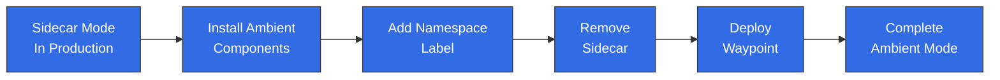

#### ステップ 1: Ambient コンポーネントをインストール

```bash
# If existing Istio is installed
istioctl install --set profile=ambient --skip-confirmation

# Verify ztunnel and CNI
kubectl get daemonset -n istio-system
```

#### ステップ 2: テスト Namespace に適用

```bash
# Create test namespace
kubectl create namespace test-ambient

# Enable Ambient Mode
kubectl label namespace test-ambient istio.io/dataplane-mode=ambient

# Deploy test application
kubectl apply -f samples/sleep/sleep.yaml -n test-ambient
```

#### ステップ 3: 検証

```bash
# Verify mTLS is working
kubectl exec -n test-ambient deploy/sleep -- curl -s http://httpbin:8000/headers

# Check Telemetry
kubectl logs -n istio-system -l app=ztunnel | grep test-ambient
```

#### ステップ 4: 本番 Namespace を切り替え

```bash
# Add Label to existing Namespace
kubectl label namespace default istio.io/dataplane-mode=ambient

# Restart pods (remove Sidecar)
kubectl rollout restart deployment -n default

# Verify Sidecar removal
kubectl get pods -n default -o jsonpath='{.items[*].spec.containers[*].name}' | grep -v istio-proxy
```

#### ステップ 5: Waypoint をデプロイ（L7 機能が必要な場合）

```bash
# Waypoint per Service Account
for sa in $(kubectl get sa -n default -o name); do
  istioctl x waypoint apply --service-account ${sa#serviceaccount/} -n default
done
```

### ロールバック戦略

```bash
# Rollback from Ambient to Sidecar

# 1. Remove Namespace Label
kubectl label namespace default istio.io/dataplane-mode-

# 2. Enable Sidecar Injection
kubectl label namespace default istio-injection=enabled

# 3. Restart pods
kubectl rollout restart deployment -n default

# 4. Remove Waypoint
kubectl delete gateway -n default --all
```

## パフォーマンス比較

<p align="center">
  
</p>

### ベンチマーク結果

上のグラフは Istio の公式パフォーマンステスト結果を示しており、Ambient Mode は Sidecar Mode と比べて**大幅に低いリソース使用量**を実現することを示しています。

| メトリクス | Sidecar Mode | Ambient Mode（ztunnel のみ） | Ambient Mode（Waypoint あり） |
|--------|-------------|---------------------------|---------------------------|
| **メモリ/Pod** | 約 50～100MB | 約 1～2MB | 約 1～2MB（アプリ）+ 共有 Waypoint |
| **CPU/Pod** | 約 0.1 vCPU | 約 0.01 vCPU | 約 0.01 vCPU（アプリ）+ 共有 Waypoint |
| **レイテンシー（P50）** | +2～3ms | +0.5～1ms | +2～3ms |
| **レイテンシー（P99）** | +5～10ms | +1～2ms | +5～10ms |
| **スループット** | -5～10% | -1～3% | -5～10% |

### リソース使用量の可視化

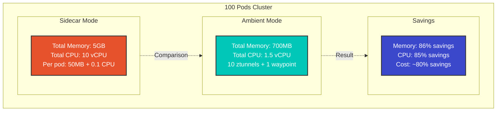

### リソース削減量の計算

```python
# Example with 100 pod cluster

# Sidecar Mode
sidecar_memory = 100 * 50  # 5000MB = 5GB
sidecar_cpu = 100 * 0.1    # 10 vCPU

# Ambient Mode (10 nodes)
ambient_memory = 10 * 50 + 200  # 700MB (ztunnel + 1 waypoint)
ambient_cpu = 10 * 0.1 + 0.5    # 1.5 vCPU

# Savings
memory_saved = sidecar_memory - ambient_memory  # 4300MB (~86%)
cpu_saved = sidecar_cpu - ambient_cpu          # 8.5 vCPU (~85%)
```

## ユースケース

### Ambient Mode を選ぶべき場合

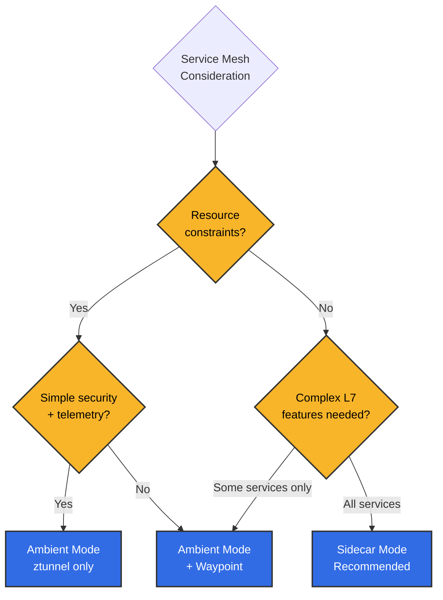

**Ambient Mode を推奨するシナリオ**:
- 数百以上のマイクロサービス
- リソースコストの最適化が重要
- ほとんどの Service ではシンプルな通信のみが必要
- 高度なルーティングが必要なのは一部の Service のみ
- 運用の複雑さを最小化したい

**Sidecar Mode を推奨するシナリオ**:
- すべての Service で L7 機能が必要
- 実績のある成熟したソリューションが必要
- Service ごとのきめ細かな制御が必要
- Pod ごとに独立した Proxy バージョン管理が必要

### 1. L4 機能だけが必要な場合

```yaml
# Using ztunnel only (Waypoint not needed)
apiVersion: v1
kind: Namespace
metadata:
  name: backend
  labels:
    istio.io/dataplane-mode: ambient
---
apiVersion: apps/v1
kind: Deployment
metadata:
  name: database
  namespace: backend
spec:
  replicas: 3
  # ... (normal Deployment)
```

**利点**:
- mTLS を自動的に適用
- 基本テレメトリー
- 最小限のリソース使用量

### 2. 選択的な L7 機能の使用

```yaml
# Only specific Service uses Waypoint
apiVersion: gateway.networking.k8s.io/v1
kind: Gateway
metadata:
  name: frontend-waypoint
  namespace: frontend
spec:
  gatewayClassName: istio-waypoint
  listeners:
  - name: mesh
    port: 15008
    protocol: HBONE
---
apiVersion: v1
kind: ServiceAccount
metadata:
  name: frontend
  namespace: frontend
  labels:
    istio.io/use-waypoint: frontend-waypoint
```

### 3. 段階的な移行

```bash
# Step-by-step migration
# 1. Non-critical services
kubectl label namespace dev istio.io/dataplane-mode=ambient

# 2. Testing
kubectl label namespace staging istio.io/dataplane-mode=ambient

# 3. Production (one by one)
kubectl label namespace prod-backend istio.io/dataplane-mode=ambient
kubectl label namespace prod-frontend istio.io/dataplane-mode=ambient
```

## トラブルシューティング

### ztunnel が動作しない

```bash
# Check ztunnel status
kubectl get daemonset -n istio-system ztunnel
kubectl logs -n istio-system -l app=ztunnel

# Check CNI
kubectl get daemonset -n istio-system istio-cni-node
kubectl logs -n istio-system -l k8s-app=istio-cni-node
```

### トラフィックが Waypoint に到達しない

```bash
# Check Waypoint status
kubectl get gateway -n <namespace>

# Verify Waypoint connection to Service Account
kubectl get sa <sa-name> -n <namespace> -o yaml | grep use-waypoint

# Check Envoy configuration
istioctl proxy-config clusters <waypoint-pod> -n <namespace>
```

## 参照情報

### 公式ドキュメント
- [Istio Ambient Mode 公式ドキュメント](https://istio.io/latest/docs/ops/ambient/)
- [Ambient Mode 紹介ブログ](https://istio.io/latest/blog/2022/introducing-ambient-mesh/)
- [Ambient Mode を始める](https://istio.io/latest/docs/ops/ambient/getting-started/)
- [ztunnel GitHub リポジトリ](https://github.com/istio/ztunnel)

### 技術リソース
- [Ambient Mesh アーキテクチャの詳細な解説](https://istio.io/latest/blog/2022/ambient-security/)
- [HBONE プロトコルの解説](https://istio.io/latest/blog/2022/get-started-ambient/)
- [パフォーマンスベンチマーク](https://istio.io/latest/blog/2022/ambient-performance/)

### コミュニティ
- [Istio Discuss - Ambient Mode](https://discuss.istio.io/c/ambient/47)
- [Istio Slack #ambient-mesh](https://istio.slack.com/)

### 比較リソース

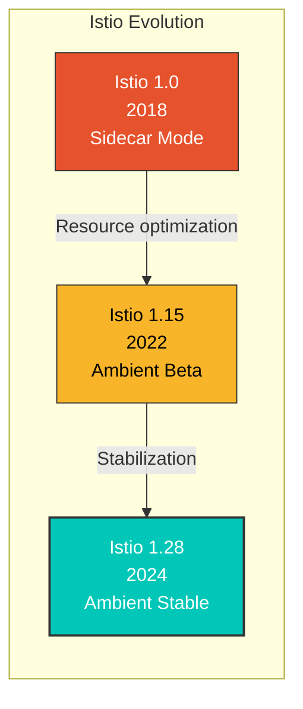

**本番利用の状況**（2024 年時点）:
- Solo.io: 社内クラスター全体を Ambient Mode に移行
- 金融企業: 数千のマイクロサービスに Ambient Mode を適用（コストを 80% 削減）
- E コマース: L4 ztunnel + 選択的 Waypoint によるハイブリッド運用

**主な機能ロードマップ**:
- 1.28（2024 年第 1 四半期）: Ambient Mode GA（General Availability）
- 1.29（2024 年第 2 四半期）: マルチクラスター Ambient のサポート
- 1.30+（2024 年第 3 四半期以降）: Gateway API の完全な統合、パフォーマンス最適化

## まとめ

Ambient Mode は、Istio の今後の方向性を示す革新的なアーキテクチャです。

| 機能 | 説明 | 利点 |
|---------|-------------|---------|
| **Sidecar の削除** | Pod ごとに Proxy が不要 | リソースを 90% 削減 |
| **2 層アーキテクチャ** | L4（ztunnel）+ L7（Waypoint） | 柔軟な機能選択 |
| **透過的な導入** | Pod の再起動が不要 | ダウンタイムゼロの導入 |
| **段階的な移行** | Namespace ごとの移行 | 安全な移行 |
| **HBONE プロトコル** | HTTP/2 ベースのトンネリング | ファイアウォールフレンドリー |

Ambient Mode は、特に**大規模なマイクロサービス環境**でリソース効率と運用の簡素化を実現し、L7 機能が必要な Service にのみ Waypoint を選択的にデプロイすることで、**コスト効率の高い Service Mesh**を実装できます。
