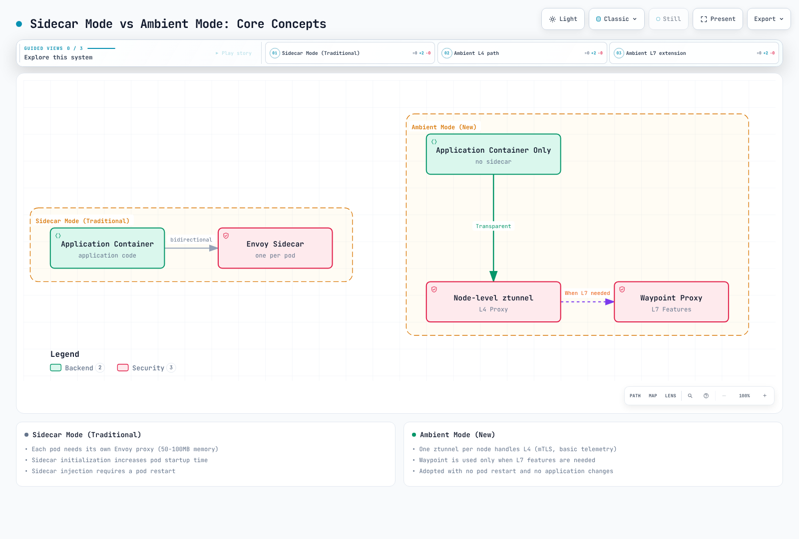
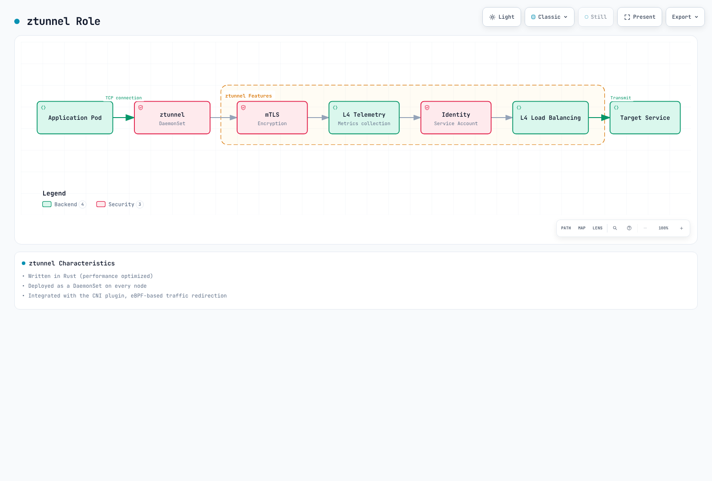
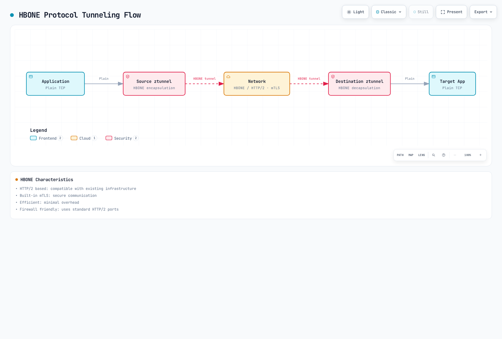

# Ambientモード

> **最終更新**: September 11, 2026 · Istio 1.31。この演習は互換Linuxノード、ノードエージェント/CNI権限、新規デモ名前空間を前提とします。監査ではデプロイコマンドを実行していません。

Ambientは2022年の実験プレビューとして導入され、Istio 1.18で初めてAlphaとして同梱、1.22でBeta、1.24で中核機能がGAとなりました。プレビューは主流の1.15リリースの一般提供機能ではありませんでした。リソース節約と移行安全性は実トポロジー、ポリシー、通信に依存します。

## 目次

1. [概要](#overview)
2. [サイドカーモードとAmbientモード](#sidecar-mode-vs-ambient-mode)
3. [アーキテクチャ](#architecture)
4. [インストールと設定](#installation-and-configuration)
5. [移行](#migration)
6. [性能比較](#performance-comparison)
7. [用途](#use-cases)
8. [トラブルシューティング](#troubleshooting)

## 概要 {#overview}


AmbientモードはアプリPodにサイドカープロキシを注入せずサービスメッシュ機能を提供する新しい方式です。**階層アーキテクチャ**からなります。

1. **セキュアオーバーレイ層（L4）**: ztunnelによるmTLSと基本テレメトリー
2. **L7処理層**: Waypoint Proxyによる高度なトラフィック管理

### Ambientモードが必要な理由

従来サイドカーモデルの制限:
- **大きなリソース負荷**: 各PodにEnvoyが必要（実プロキシ占有量を測定）
- **運用の複雑さ**: Pod再起動、版管理、ローリング更新が複雑
- **起動の調整**: プロキシとアプリの準備状態の調整が必要
- **過剰な機能**: L4メッシュ機能だけでよいワークロードもある

Ambientによる解決:
- 共有ノードプロキシと必要waypoint。総リソース使用量を測定する
- 未参加Podの参加は再起動を避けられる。サイドカー除去とポリシー変更には管理されたロールアウトが必要
- 段階的導入。必要に応じてL4からL7へ拡張
- L4転送は透過的にできるが、トレースコンテキストとアプリのタイムアウト/冪等性契約は重要なまま

### 中核概念

図の任意waypointは設定/参加で選択します。ztunnelは各HTTP要求を解析してL7へ迂回するかを決めません。既存接続、準備状態、ポリシー移行は引き続き検証が必要です。




[🔍 インタラクティブな図を見る](https://www.atomai.click/kubernetes-docs/archmaps/en-service-mesh-istio-advanced-01-ambient-mode-0.html)

### Ambientモードの利点

1. **共有リソースモデル**: ノードプロキシと必要waypointレプリカ
2. **簡単なデプロイ**: 未参加Podの参加は再起動不要な場合がある。サイドカー除去は必要
3. **透過L4転送**: アプリのトレース/期限/冪等性要件は残る
4. **柔軟なL7機能**: 必要時だけwaypointを使用

## サイドカーモードとAmbientモード {#sidecar-mode-vs-ambient-mode}

### アーキテクチャ比較

#### サイドカーモード


[🔍 インタラクティブな図を見る](https://www.atomai.click/kubernetes-docs/archmaps/en-service-mesh-istio-advanced-01-ambient-mode-1.html)

**特性**:
- 各PodにEnvoyを注入
- 成熟したL4/L7機能。選択リリースを確認
- リソース使用量が多い
- Pod再起動が必要

#### Ambientモード


[🔍 インタラクティブな図を見る](https://www.atomai.click/kubernetes-docs/archmaps/en-service-mesh-istio-advanced-01-ambient-mode-2.html)

**特性**:
- ノードごとにztunnel 1つ
- デフォルトでL4機能を提供
- L7機能にはwaypointが必要
- 未参加Podの参加は再起動不要な場合がある。サイドカー除去は必要

### 詳細比較表

| 項目 | サイドカーモード | Ambientモード |
|------|-------------|--------------|
| **デプロイ方法** | Podにサイドカー注入 | ノードztunnel + 任意waypoint |
| **リソース計算** | Pod別Envoy + コントロールプレーン | ノードztunnel + 全waypointレプリカ + コントロールプレーン。負荷下で測定 |
| **Pod再作成** | 注入プロキシ追加/除去に必要 | 未参加からの参加には通常不要。サイドカー除去には必要 |
| **起動調整** | プロキシ/アプリのライフサイクルと準備状態 | CNI捕捉とztunnel準備状態 |
| **L4機能** | 対応 | 対応 |
| **L7機能** | リリース固有の対応 | waypointと対応APIが必要。全拡張がGAではない |
| **mTLS** | 自動 | 自動 |
| **テレメトリー** | 詳細 | 基本（L4）、詳細（waypoint付きL7） |
| **サーキットブレーカー** | 対応 | Waypointが必要 |
| **再試行/タイムアウト** | 対応 | Waypointが必要 |
| **ヘッダー操作** | 対応 | Waypointが必要 |
| **性能オーバーヘッド** | ワークロード/設定に依存 | 経路/ID/waypoint/負荷に依存。同等ポリシーで比較 |
| **運用範囲** | ワークロードごとのプロキシライフサイクル | ノード/CNIと共有waypointのライフサイクル |
| **本番対応状況** | 成熟 | GA（Istio 1.24+） |

### リソース使用量比較 {#resource-usage-comparison}

以下の100 Pod計算は仮定の計画例で、公式ベンチマークではありません。全ノード/waypointレプリカを数え、同等のセキュリティ、テレメトリー、ルーティング要件を比較してからリソース/請求節約を見積もります。

## アーキテクチャ {#architecture}


Ambientデータプレーンは**ztunnel**と**Waypoint Proxy**の2つの中核コンポーネントで構成されます。

### ztunnel（Zero Trust Tunnel）


ztunnelはAmbientの中核で、**ノードレベルで動作する軽量L4プロキシ**です。適格LinuxノードでDaemonSetとして動き、参加ワークロードの対応通信を扱います。全Podの全通信ではありません。ホストネットワーク/除外ワークロード、非TCPアプリプロトコルは現サポートを確認します。

#### ztunnelの動作

1. **通信捕捉**: Istio CNIのPod内netfilter/iptablesルールとネットワーク名前空間の引き渡しでPod通信を透過捕捉
2. **mTLS適用**: SPIFFEベースIDでmTLS暗号化を自動適用
3. **負荷分散**: エンドポイント間でL4負荷分散
4. **テレメトリー収集**: 接続メトリクスとログを収集
5. **転送**: 宛先ztunnelまたはWaypointへ転送

**ztunnel技術スタック**:
- **言語**: Rust（高性能、低メモリ使用）
- **プロトコル**: HBONE（HTTP-Based Overlay Network Environment）
- **ID**: SPIFFEワークロードID。デフォルトIstiod CA、SPIREには別統合
- **CNI**: Istio CNIプラグインとの密接な統合

#### ztunnelの役割



[🔍 インタラクティブな図を見る](https://www.atomai.click/kubernetes-docs/archmaps/en-service-mesh-istio-advanced-01-ambient-mode-3.html)

**ztunnelの特性**:
- Rustで実装（性能最適化）
- DaemonSetでデプロイ
- CNIプラグインと統合
- Istio CNIと調整したPod内netfilter/iptablesリダイレクト

#### ztunnelのデプロイ

リリースされたambientインストール/チャートを使います。元の最小DaemonSetはトークン/CA/ソケットのマウントが欠け、hostNetwork/privileged設定も不正でした。1.31チャートは特定capabilityとPod内名前空間アクセスを提供し、`hostNetwork: true`や`privileged: true`は設定しません。完全なチャート/プラットフォームの文脈なしに権限をコピー・縮小しないでください。

```bash
# Offline inspection; use the same reviewed values as the actual installation
istioctl manifest generate --set profile=ambient > ambient-rendered.yaml
# Inspect a deployed resource if a mesh already exists
kubectl get daemonset ztunnel -n istio-system -o yaml
```

### Waypoint Proxy


Waypointは**L7機能が必要な場合に使う任意プロキシ**です。設定したwaypointを参加リソースの通信経路に置き、高度なトラフィック管理を提供します。

#### Waypointの主な特性

1. **選択的デプロイ**: 全サービスでなくL7が必要なサービスだけに使用
2. **共有プロキシ**: 名前空間/Service/Pod参加に従い、複数ワークロードが1 Waypointを共有
3. **Envoyベース**: 従来サイドカーと同じEnvoyを使い、L7 API対応はリリース固有
4. **オンデマンド**: 実行時に動的追加/削除が可能

#### Waypointのデプロイ単位

ServiceAccountはワークロードIDを提供し、ラベルを付けてもwaypointは選択**されません**。Namespace、Service、Podの`istio.io/use-waypoint`と、意図する通信に合う`istio.io/waypoint-for`を持つGatewayを使います。

| 参加対象 | 範囲 |
|---|---|
|Namespace|名前空間内の適格リソースのデフォルトwaypoint選択|
|Service|そのServiceへの通信。デフォルトwaypointタイプは`service`|
|Pod|`workload`または`all` waypointでの直接ワークロード/Pod IP通信|

Deploymentラベルだけでは既存Podに付きません。ワークロード参加にはPodテンプレートラベルを使います。`service` waypointは直接Pod IP通信を自動カバーしません。

#### Waypointの役割


**Waypointの特性**:
- Gatewayとしてデプロイし、対応リソースの参加で選択
- Envoyプロキシを使用
- APIごとの対応を確認。任意EnvoyFilterパッチは対応waypoint APIではない
- 必要サービスだけで選択使用

#### Waypointのデプロイ

```yaml
apiVersion: gateway.networking.k8s.io/v1
kind: Gateway
metadata:
  name: reviews-waypoint
  namespace: ambient-demo
  labels:
    istio.io/waypoint-for: service
spec:
  gatewayClassName: istio-waypoint
  listeners:
  - name: mesh
    port: 15008
    protocol: HBONE
```

デフォルト`istio-waypoint`クラスはEnvoyを使います。ambient中核GAは全APIのGAを意味しません。現文書ではambient VirtualServiceはAlphaで、Gateway APIルートとの混在は禁止です。ここではHTTPRouteを使います。EnvoyFilterは対応waypoint拡張ではありません。L7ポリシーはwaypoint到達通信を保護します。経由の強制には文書化されたztunnel認可ガードと正しい参加/準備状態も必要です。

### 完全なトラフィックフロー

以下はAmbientで**サイドカーなし**に通信が流れる全体図です。


[🔍 インタラクティブな図を見る](https://www.atomai.click/kubernetes-docs/archmaps/en-service-mesh-istio-advanced-01-ambient-mode-6.html)

**フロー分析**:

1. **L4専用経路**（ztunnelのみ）:
   - 代表負荷で経路レイテンシーを測定
   - mTLSを自動適用
   - 基本テレメトリー
   - 実要件がL4のみの場合に適合

2. **L7経路**（ztunnel + Waypoint）:
   - ヘッダーベースルーティング
   - サーキットブレーカー
   - 再試行/タイムアウト
   - 複雑な通信ポリシーが必要な場合

### HBONEプロトコル


**HBONE（HTTP-Based Overlay Network Environment）** はAmbientのトンネルプロトコルです。

- **HTTP/2ベース**: 既存インフラとの互換性
- **組み込みmTLS**: 安全な通信
- **多重化**: 同じ送信元/宛先ID対でTCPストリームがトンネルを共有
- **ネットワークポリシー**: 通常TCP15008を使用。必要メッシュ経路を明示許可



[🔍 インタラクティブな図を見る](https://www.atomai.click/kubernetes-docs/archmaps/en-service-mesh-istio-advanced-01-ambient-mode-7.html)

このガイドのHBONEはTCPストリームを運びます。アプリUDPは運ばず、DNS捕捉/プロキシは別機能です。プロキシ間のメッシュ転送が暗号化されても、ローカルアプリストリームは平文の場合があります。

## インストールと設定 {#installation-and-configuration}

演習には互換Linuxノードと必要なIstio CNI/ztunnel DaemonSetが必要です。EKS Fargateはこれらを実行できません。対応EC2配置を使い、実ノード/CNIプラットフォームを確認します。[プラットフォーム前提条件](https://istio.io/latest/docs/ambient/install/platform-prerequisites/)はCNIパス、権限、ヘルスプローブを扱います。SecurityGroupPolicy付きVPC CNI Pod ENIトランキングではstandard enforcingモードか適切なexecプローブが必要な場合があります。ポリシーへの影響を評価してください。GKE、OpenShift、k3sなどは設定が異なる場合があります。

Istio1.31はKubernetes1.32–1.36をサポートします。EKS互換性は[インストールガイド](../01-installation.md)を参照してください。以下のGateway API1.6.0はIstio1.31依存と公式ambientチュートリアルに一致します。既存バンドルの互換性を確認し、例をコピーするためだけに新しい互換版を下げないでください。

### 1. Istioインストール（Ambientモード）

インストーラーとプラットフォーム設定を確認した新規演習メッシュにだけこのコマンドを使います。既存メッシュの方法/valuesは移行手順で保持します。

```bash
curl -fsSL https://istio.io/downloadIstio -o download-istio.sh
ISTIO_VERSION=1.31.0 sh download-istio.sh
cd istio-1.31.0
export PATH="$PWD/bin:$PATH"

# Fresh cluster without Gateway API; review an existing bundle separately
if ! kubectl get crd gateways.gateway.networking.k8s.io >/dev/null 2>&1; then
  kubectl apply --server-side -f https://github.com/kubernetes-sigs/gateway-api/releases/download/v1.6.0/experimental-install.yaml
fi
kubectl wait --for=condition=Established crd/gateways.gateway.networking.k8s.io --timeout=60s
kubectl get crd httproutes.gateway.networking.k8s.io

# Fresh lab mesh only; include required platform-specific values
istioctl install --set profile=ambient -y
kubectl get pods,daemonsets -n istio-system
```

### 2. Ambientを有効にしてアプリをデプロイ

サイドカー注入/revision上書きのない新しい使い捨て名前空間を使います。ambientラベル追加では既存サイドカーPodは変換されません。1.31配布の完全Bookinfoマニフェストは、旧単一Deployment例で欠けたreviews Service、版ラベル、ServiceAccount、ratings依存を提供し、Bookinfo1.20.3イメージを使います。

```bash
kubectl create namespace ambient-demo
kubectl label namespace ambient-demo istio.io/dataplane-mode=ambient
kubectl get namespace ambient-demo -L istio-injection,istio.io/rev,istio.io/dataplane-mode
kubectl apply -n ambient-demo -f samples/bookinfo/platform/kube/bookinfo.yaml
kubectl apply -n ambient-demo -f samples/curl/curl.yaml
for deployment in reviews-v1 reviews-v2 ratings-v1 curl; do
  kubectl rollout status "deployment/$deployment" -n ambient-demo --timeout=120s
done
istioctl ztunnel-config workloads --workload-namespace ambient-demo
```

### 3. Waypointのデプロイと選択

現CLIはServiceAccount参加フラグでなくwaypoint名と通信タイプを取ります。準備完了を待ち、Serviceを明示参加させます。

```bash
istioctl waypoint apply --name reviews-waypoint --for service -n ambient-demo --wait
kubectl label service reviews -n ambient-demo istio.io/use-waypoint=reviews-waypoint --overwrite
kubectl get gateways.gateway.networking.k8s.io reviews-waypoint -n ambient-demo
kubectl get service reviews -n ambient-demo --show-labels
```

### 4. L7機能の使用

版別バックエンドServiceを作り、参加済みreviews ServiceにHTTPRouteを接続します。GET/ヘッダールーティングの例で、ヘッダーは認証済みIDではありません。旧VirtualServiceをこのGateway APIルートと混ぜないでください。別Service/Pod IPへの直接呼び出しは別経路です。

```yaml
apiVersion: v1
kind: Service
metadata:
  name: reviews-v1
  namespace: ambient-demo
spec:
  selector:
    app: reviews
    version: v1
  ports:
  - name: http
    port: 9080
    targetPort: 9080
---
apiVersion: v1
kind: Service
metadata:
  name: reviews-v2
  namespace: ambient-demo
spec:
  selector:
    app: reviews
    version: v2
  ports:
  - name: http
    port: 9080
    targetPort: 9080
---
apiVersion: gateway.networking.k8s.io/v1
kind: HTTPRoute
metadata:
  name: reviews
  namespace: ambient-demo
spec:
  parentRefs:
  - group: ''
    kind: Service
    name: reviews
    port: 9080
  rules:
  - matches:
    - method: GET
      headers:
      - name: end-user
        type: Exact
        value: jason
    backendRefs:
    - name: reviews-v2
      port: 9080
  - matches:
    - method: GET
    backendRefs:
    - name: reviews-v1
      port: 9080
```

```bash
kubectl describe httproutes.gateway.networking.k8s.io reviews -n ambient-demo
kubectl exec -n ambient-demo deploy/curl -c curl -- \
  curl -sS --max-time 5 -H "end-user: jason" http://reviews:9080/reviews/0
```

Accepted/ResolvedRefs条件と選択バックエンドをログ/テレメトリーで確認します。HTTP成功だけではmTLSも強制waypoint経由も証明できません。L7認可には適切な`targetRefs`、経由強制には文書化されたztunnel認可ガードも必要です。[waypointポリシー接続](https://istio.io/latest/docs/ambient/usage/l7-features/)を参照してください。

## 移行 {#migration}

### サイドカーモードからAmbientモードへ

移行はポリシー/ワークロードのロールアウトで、ラベルだけの変更ではありません。導入revision、CA/信頼、Gateway、CNIオプション、宣言的ワークロード設定を保持します。既存サイドカーはambient参加に優先します。L7ポリシーが必要なワークロードからサイドカーを外す前に、互換ルーティング/認可と準備済みwaypointを用意します。

#### ステップ1: Ambientコンポーネントの導入

既存の方法とレビュー済みvaluesで互換版のambient対応を追加します。Helm管理メッシュを無関係な単独`istioctl install --set profile=ambient`で上書きしないでください。意図した設定をレンダリング/差分確認し、CNI/ztunnelノードエージェントを検証します。

#### ステップ2: テスト名前空間へ適用

この独立ambientテストは1.31配布からクライアントとサーバー両方をデプロイします。httpbin Serviceは8000を公開し8080を対象にします。

```bash
kubectl create namespace test-ambient
kubectl label namespace test-ambient istio.io/dataplane-mode=ambient
kubectl apply -n test-ambient -f samples/curl/curl.yaml
kubectl apply -n test-ambient -f samples/httpbin/httpbin.yaml
kubectl rollout status deployment/curl -n test-ambient --timeout=120s
kubectl rollout status deployment/httpbin -n test-ambient --timeout=120s
kubectl exec -n test-ambient deploy/curl -c curl -- \
  curl -sS --max-time 5 http://httpbin:8000/headers
```

#### ステップ3: 検証

HBONEワークロード列は意図した転送を示します。実通信は正しいノードのztunnelログの期待送信元/宛先ID、または`connection_security_policy="mutual_tls"`のTCPメトリクスで確認します。HTTP成功はmTLS証明ではありません。HBONE参加は全平文呼び出し元を拒否しません。必要ならPeerAuthentication STRICTを使います。[mTLS検証](https://istio.io/latest/docs/ambient/usage/verify-mtls-enabled/)を参照してください。

```bash
istioctl ztunnel-config workloads --workload-namespace test-ambient
source_pod=$(kubectl get pod -n test-ambient -l app=curl -o jsonpath='{.items[0].metadata.name}')
source_node=$(kubectl get pod "$source_pod" -n test-ambient -o jsonpath='{.spec.nodeName}')
ztunnel_pod=$(kubectl get pod -n istio-system -l app=ztunnel \
  --field-selector "spec.nodeName=$source_node" -o jsonpath='{.items[0].metadata.name}')
kubectl logs "$ztunnel_pod" -n istio-system --since=5m
```

#### ステップ4: 選択ワークロードの切り替え

次の例は別の既存`migration-demo`名前空間に、レビュー済みで名前空間注入されたL4専用curl/httpbin Deploymentだけがある前提です。Podテンプレートの注入上書きや手動注入プロキシを確認してください。コマンドはそれらを除去しません。L7では先に`targetRefs`と強制経由ガードを含むwaypoint参加/ポリシー変換を検証します。移行中のポリシー共存を計画します。ztunnelが適用するセレクターベースL7ポリシーはfail-closedになる場合があります。

```bash
# Reference snapshots, not manifests to blindly reapply with stale server metadata
kubectl get namespace migration-demo -o json > migration-namespace-before.json
kubectl get deployment curl httpbin -n migration-demo -o yaml > migration-workloads-before.yaml

kubectl label namespace migration-demo istio.io/dataplane-mode=ambient --overwrite
kubectl label namespace migration-demo istio-injection- istio.io/rev-
kubectl get namespace migration-demo -L istio-injection,istio.io/rev,istio.io/dataplane-mode
for deployment in curl httpbin; do
  kubectl rollout restart "deployment/$deployment" -n migration-demo
  kubectl rollout status "deployment/$deployment" -n migration-demo --timeout=120s
done

# Check both classic containers and native-sidecar initContainers
kubectl get pods -n migration-demo -o json | jq -r '
  .items[] | [.metadata.name,
    any((.spec.containers + (.spec.initContainers // []))[]; .name == "istio-proxy")] | @tsv'
istioctl ztunnel-config workloads --workload-namespace migration-demo
```

#### ステップ5: 選択データ経路の検証

指定ワークロードの準備、接続、ID、ポリシーテストを繰り返します。L7対象群は実Namespace/Service/Pod参加、Gateway通信タイプ/準備、ルート/ポリシー接続を調べます。ServiceAccountごとにwaypointを作らないでください。ワークロード固有の停止/ロールバック基準を使います。演習手順は本番無停止保証ではありません。

### ロールバック戦略

記録した注入モードと元のPodテンプレート/ポリシーを戻します。以下のコードは上の名前空間注入だけを扱い、旧revisionが存在して正常である必要があります。waypointを持つ対象群は、レビュー済みロールバックの一部として参加/ルーティングポリシーも戻します。対象群用に作成した、特定済み・未参照のwaypointだけを削除し、名前空間内の全Gatewayは決して削除しないでください。

```bash
original_revision=$(jq -r '.metadata.labels["istio.io/rev"] // ""' migration-namespace-before.json)
original_injection=$(jq -r '.metadata.labels["istio-injection"] // ""' migration-namespace-before.json)

# Restore the recorded namespace-injection mode; do not invent a revision
if [ "$original_injection" = "enabled" ]; then
  kubectl label namespace migration-demo istio-injection=enabled --overwrite
elif [ -n "$original_revision" ]; then
  kubectl label namespace migration-demo "istio.io/rev=$original_revision" --overwrite
else
  echo "No supported namespace-injection mode recorded; restore the original workload configuration." >&2
  exit 1
fi
kubectl label namespace migration-demo istio.io/dataplane-mode-
for deployment in curl httpbin; do
  kubectl rollout restart "deployment/$deployment" -n migration-demo
  kubectl rollout status "deployment/$deployment" -n migration-demo --timeout=120s
done
```

## 性能比較 {#performance-comparison}

### ベンチマーク結果

削除した`perf.png` URLは404を返し、旧「公式ベンチマーク」表を裏付けませんでした。Pod別CPU/メモリ、レイテンシー、スループット割合を裏付ける出典はありません。[公表性能結果](https://istio.io/latest/docs/ops/deployment/performance-and-scalability/)を元のリリース、負荷、ペイロード、ハードウェア、ポリシー条件で使い、過去測定を現リリーステストに付け替えないでください。

| 測定 | 比較条件を合わせる項目 |
|---|---|
|メモリ/CPU|アプリ数、ID/接続、ノード数、全waypointレプリカ、同等ポリシー|
|P50/P99レイテンシー|要求サイズ/レート、接続再利用、mTLS、L7ポリシー、テレメトリー、過負荷条件|
|スループット|同じアプリ/バックエンド容量とエラー定義|
|費用|実プロビジョニング容量、利用率、課金。requests/使用量減少だけでは請求減少ではない|

### リソース節約の計算

元の100 Pod計算は**仮定の予算モデル**としてのみ以下に保持します。50MB/0.1CPUとwaypoint値は仮定入力で、推奨requests/limitsや実測費用ではありません。実比較では全waypoint/ztunnelレプリカ、HA配置、コントロールプレーンを含めます。waypoint追加で結果は変わります。

```python
# Hypothetical planning inputs, not measured resource consumption or billing
sidecar_memory = 100 * 50       # MB, decimal
sidecar_cpu = 100 * 0.1        # vCPU
ambient_memory = 10 * 50 + 200  # 10 ztunnels + one assumed waypoint budget
ambient_cpu = 10 * 0.1 + 0.5

memory_saved = sidecar_memory - ambient_memory  # 4300 MB, 86% of assumed baseline
cpu_saved = sidecar_cpu - ambient_cpu           # 8.5 vCPU, 85% of assumed baseline
```

## 用途 {#use-cases}

### Ambientモードを選ぶべき場合


**Ambientモードの推奨シナリオ**:
- 数百以上のマイクロサービス
- リソース費用最適化が重要
- 大半のサービスは単純通信のみ必要
- 一部だけ高度ルーティングが必要
- 運用の複雑さを最小化したい

**サイドカーモードの推奨シナリオ**:
- 必要API/拡張やプラットフォーム動作が選択サイドカー構成でのみ対応
- 実績のある成熟した解決策が必要
- サービスごとの細粒度制御が必要
- Podごとに独立したプロキシ版管理

### 1. L4機能だけが必要な場合

互換性のある既存TCPワークロードは、プラットフォーム、ポリシー、捕捉の前提を確認して名前空間を参加させます。このNamespaceは完全DBデプロイではありません。DB複製/ストレージ/HAは別設計です。

```yaml
apiVersion: v1
kind: Namespace
metadata:
  name: backend
  labels:
    istio.io/dataplane-mode: ambient
```

### 2. L7機能の選択使用

デモは準備済みreviews waypointをService単位で選びます。名前空間と直接ワークロード参加は別の対応範囲で、ServiceAccountラベルはセレクターではありません。

```bash
kubectl label service reviews -n ambient-demo istio.io/use-waypoint=reviews-waypoint --overwrite
```

L7要件があっても自動的にサイドカー必須ではありません。対応waypoint API/拡張とアプリの実要件を比較します。一方、中核GAは全高度APIの同等機能を意味しません。

### 3. 段階的移行

先に注入と参加を棚卸しし、明示的な準備/セキュリティ/ロールバック基準でレビュー済み対象群を移行します。全dev/staging/productionに無条件でラベルを付けたり、既存サイドカーが変換されると想定したりしないでください。

```bash
kubectl get namespaces -L istio-injection,istio.io/rev,istio.io/dataplane-mode,istio.io/use-waypoint
```

## トラブルシューティング {#troubleshooting}

### ztunnelが動かない

```bash
# Check ztunnel status
kubectl get daemonset -n istio-system ztunnel
kubectl logs -n istio-system -l app=ztunnel

# Check CNI
kubectl get daemonset -n istio-system istio-cni-node
kubectl logs -n istio-system -l k8s-app=istio-cni-node
```

### 通信がWaypointへ向かわない

```bash
# Check Waypoint status
kubectl get gateways.gateway.networking.k8s.io -n <namespace>

# Check supported enrollment scopes and Gateway readiness
kubectl get namespace <namespace> -L istio.io/use-waypoint
kubectl get services -n <namespace> -L istio.io/use-waypoint
istioctl waypoint list -n <namespace>
istioctl ztunnel-config services

# Check Envoy configuration
istioctl proxy-config clusters <waypoint-pod> -n <namespace>
```

## 参考資料

### 現在の公式ドキュメント

- [Ambient概要](https://istio.io/latest/docs/ambient/overview/)
- [はじめ方](https://istio.io/latest/docs/ambient/getting-started/)
- [Pod内通信リダイレクト](https://istio.io/latest/docs/ambient/architecture/traffic-redirection/)
- [HBONE](https://istio.io/latest/docs/ambient/architecture/hbone/)
- [Waypoint参加](https://istio.io/latest/docs/ambient/usage/waypoint/)
- [L7 API対応とポリシー接続](https://istio.io/latest/docs/ambient/usage/l7-features/)
- [性能測定方法/結果](https://istio.io/latest/docs/ops/deployment/performance-and-scalability/)
- [ztunnelソース](https://github.com/istio/ztunnel)
- [IstioコミュニティとSlackアクセス](https://istio.io/latest/get-involved/)

### 過去の紹介

2022年のこれらのページは実験プレビューを説明し、現在のインストールやServiceAccount-waypointコマンドではありません。

- [ambient meshの紹介（2022）](https://istio.io/latest/blog/2022/introducing-ambient-mesh/)
- [実験的セキュリティアーキテクチャ（2022）](https://istio.io/latest/blog/2022/ambient-security/)
- [実験版のはじめ方（2022）](https://istio.io/latest/blog/2022/get-started-ambient/)

### 確認済みの節目と現在の制限

| 節目 | 根拠 |
|---|---|
|2022プレビュー|実験実装を発表。主流1.15の機能リリースではない|
|1.18 Alpha（2023）|ambientを初めて同梱したIstioリリース|
|1.22 Beta（2024）|Beta到達|
|1.24中核GA（2024）|中核ztunnel/waypoint/APIの節目。個別機能には独自状態が残る|

現[ambientマルチクラスター文書](https://istio.io/latest/docs/ambient/install/multicluster/)は**Betaのマルチプライマリ・マルチネットワーク**対応を説明します。プライマリ/リモートは非対応、単一ネットワークは未テストです。waypoint命名/設定とサービス範囲をクラスター間で調整する必要があります。旧1.26/1.27ロードマップや出典のない企業節約は、対応動作や費用削減保証の証拠ではありません。

## まとめ

Ambientは共有L4転送と選択L7 waypoint処理を分離します。未参加ワークロードの参加とプロキシライフサイクル管理を簡素化できますが、リソース節約、ポリシー保持、可用性には同等ポリシーでの測定と検証済み移行計画が必要です。Linux/CNI/プラットフォーム制約、TCP15008接続、各APIの機能状態を考慮します。
