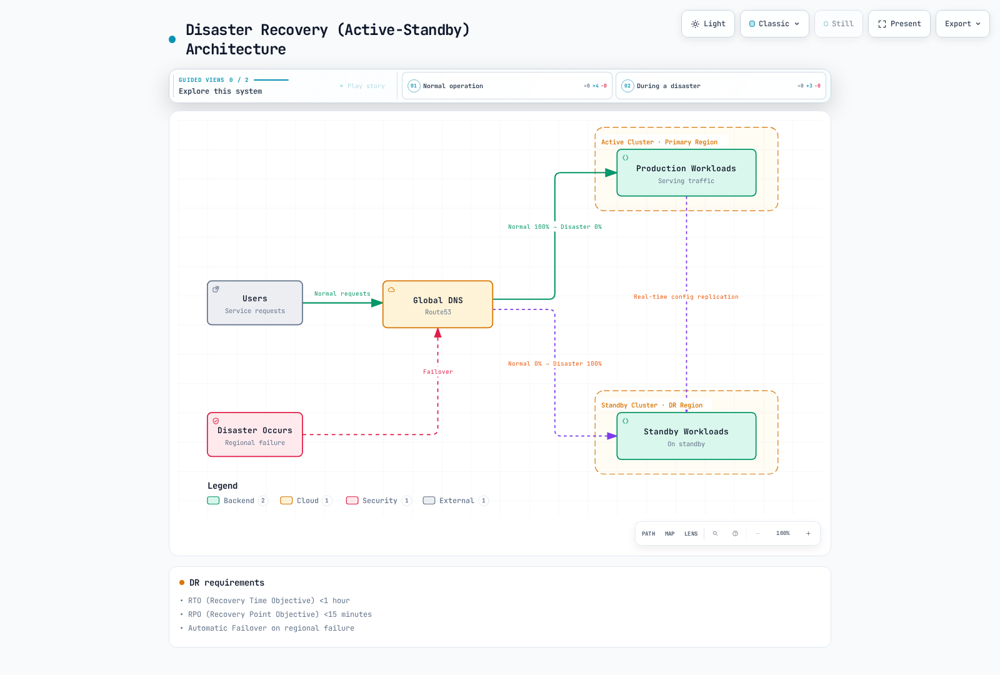
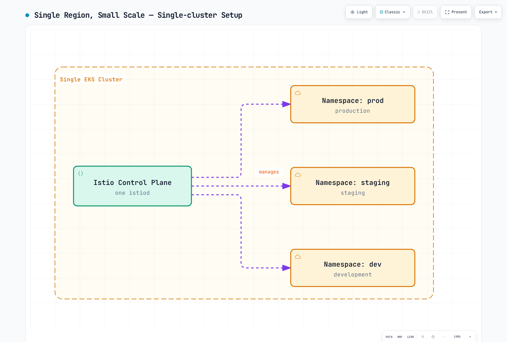

# マルチクラスター

> **最終更新**: September 11, 2026 · Istio1.31 · Kubernetes1.32–1.36。以下の導入例は**サイドカー**トポロジーの独立した選択肢です。Ambientの対応制限は異なります。監査ではクラスター、AWS、本番負荷のデプロイを行っていません。

マルチクラスターサービスメッシュは、複数Kubernetesクラスターを統一サービスメッシュに接続します。

## 目次

1. [マルチクラスターは本当に必要か](02-multi-cluster.md#do-you-really-need-multi-cluster)
2. [アーキテクチャ選択ガイド](02-multi-cluster.md#architecture-selection-guide)
3. [IstioとAWS VPC Lattice](02-multi-cluster.md#istio-vs-aws-vpc-lattice)
4. [トポロジー](02-multi-cluster.md#topology)
5. [プライマリ・リモート設定](02-multi-cluster.md#primary-remote-setup)
6. [マルチプライマリ設定](02-multi-cluster.md#multi-primary-setup)
7. [クラスター間通信](02-multi-cluster.md#cross-cluster-communication)
8. [VPC Latticeとの併用](02-multi-cluster.md#using-with-vpc-lattice)
9. [実践例](02-multi-cluster.md#practical-examples)
10. [性能と費用の比較](02-multi-cluster.md#performance-and-cost-comparison)
11. [トラブルシューティング](02-multi-cluster.md#troubleshooting)

## マルチクラスターは本当に必要か {#do-you-really-need-multi-cluster}

マルチクラスターサービスメッシュは強力ですが、複雑さと費用が増えます。導入前に慎重な検討が必要です。

### 判断の流れ

以下の要件を制約として使います。チェックリストの得点で普遍的に優れた構成が決まるわけではありません。


### マルチクラスターが必要な場合

#### 1. 地理的分散とレイテンシー最適化


[🔍 インタラクティブな図を見る](https://www.atomai.click/kubernetes-docs/archmaps/en-service-mesh-istio-advanced-02-multi-cluster-1.html)

**必要な場合**:

* 世界のユーザー向けサービス（遅延目標<100ms）
* ワークロード固有のデータ配置義務。メッシュ自体はコンプライアンスを成立させない
* 地域別トラフィックルーティングと障害分離

#### 2. 災害復旧（DR）



[🔍 インタラクティブな図を見る](https://www.atomai.click/kubernetes-docs/archmaps/en-service-mesh-istio-advanced-02-multi-cluster-2.html)

**必要な場合**:

* RTO（目標復旧時間）<1時間
* RPO（目標復旧時点）<15分
* リージョン障害時の自動フェイルオーバー

上のRTO/RPOは要件例で、メッシュが保証する結果ではありません。DR図は別途実装したデプロイ/データ複製とDNSヘルスルーティングを前提とし、クライアント、キャッシュ、既存接続が切り替えに影響します。

#### 3. 環境分離と段階的デプロイ

**必要な場合**:

* Dev/Staging/Prodクラスター分離と統一管理
* クラスター単位のブルー/グリーンデプロイ
* 地域を段階的に拡大するカナリアデプロイ

#### 4. 組織境界とセキュリティ分離

**必要な場合**:

* チーム/部署ごとの独立クラスター運用
* 強化したマルチテナンシー
* 明示的に評価した分離境界。メッシュ信頼の共有は別判断

### マルチクラスターが不要な場合

#### 1. 単一リージョンの小規模サービス



[🔍 インタラクティブな図を見る](https://www.atomai.click/kubernetes-docs/archmaps/en-service-mesh-istio-advanced-02-multi-cluster-3.html)

**代わりに使用**:

* Kubernetes Namespace分離
* NetworkPolicyによるネットワーク分離
* RBACによるアクセス制御

#### 2. 運用の複雑さに対応できない場合

**マルチクラスターの運用要件**:

* ネットワーク、PKI、更新、クラスター間障害を運用できる責任チーム
* East-West Gatewayの管理と監視
* クラスター間証明書管理
* クラスター間デバッグ能力

**小規模チームなら**:

* 単一クラスターIstio、または
* AWS VPC Lattice（マネージドサービス）

#### 3. 費用が重要な場合

**マルチクラスターの追加費用**:

* 選択プラットフォームのEast-Westロードバランサー時間/容量と処理料金
* 課金対象リージョン間バイトと方向/リージョン固有レート
* コントロールプレーン/Gatewayレプリカ、可観測性/ストレージ容量

### チェックリスト

導入前に以下へ回答してください。

**アーキテクチャ**:

* [ ] すでに2つ以上のクラスターを運用しているか
* [ ] マルチリージョンが必要か
* [ ] クラスター間サービス呼び出しが多いか

**業務要件**:

* [ ] 世界のユーザーが対象か
* [ ] 災害復旧（DR）は必須か
* [ ] RTO/RPO要件は厳しいか

**セキュリティとコンプライアンス**:

* [ ] データの地域内配置が必要か
* [ ] 強いクラスター間分離が必要か

**運用能力**:

* [ ] Istio専門家がいるか
* [ ] 複雑なネットワーク問題をデバッグできるか
* [ ] 追加費用を負担できるか

**結果**:

数値的な推奨得点でなく設計入力として使います。リージョン、信頼、API、復旧、運用制約によっては、チェック数にかかわらず選択肢が排除されます。

## アーキテクチャ選択ガイド {#architecture-selection-guide}

| 判断 | 必要な証拠 |
|---|---|
|リージョン内HAとリージョン災害復旧|コントロールプレーン/ワークロード配置、複製データ、検証済み復旧手順|
|クラスター間メッシュ|到達可能API/Gateway、共通信頼設計、名前空間/サービスID、独立した設定配布|
|リージョン内Lattice接続|リージョンサービスネットワーク、VPC関連付け/エンドポイント、リスナー/認証モード、ターゲット到達性|
|リージョン間接続|明示グローバルネットワーク/エンドポイントとアプリ/データ設計。リージョンの直接VPC関連付けはグローバルファブリックではない|
|費用と人員|実測ワークロード、同等通信前提、実課金、運用労力|

### 各方式の比較

#### 単一クラスターIstio

**利点**:

* 最も単純な管理
* コンポーネント削減で費用モデルを簡素化できる。実ワークロードを測定
* 迅速なデバッグ
* 全Istio機能を利用可能

**欠点**:

* クラスター障害ドメインを共有。ただしリージョン内HAは構成可能
* 別の復旧構成がなければリージョンに依存
* 単一EKSコントロールプレーンはリージョン単位。より広い障害ドメイン分散には追加設計が必要

**適する場合**:

* 単一リージョンサービス
* 地域信頼性目標がこの運用範囲に合うチーム
* リージョン間DRなしでリージョン内HAを達成可能

#### マルチクラスターIstio

**利点**:

* 完全な地理的分散
* 明示設計した通信フェイルオーバーの基盤。アプリ/データDRは別
* 全L7機能（再試行、タイムアウト、サーキットブレーカー）
* 細粒度トラフィック制御
* 統一可観測性

**欠点**:

* 運用が複雑
* East-West Gateway管理が必要
* リージョン間転送料
* デバッグが難しい

**適する場合**:

* グローバルサービス
* 強いDRが必要
* 細粒度L7制御が必須

#### AWS VPC Lattice

**利点**:

* AWSが完全管理
* 簡単な設定
* 小さな運用負担
* 明示関連付けとアクセスポリシーによるVPC間接続
* 実ワークロードのサービス/要求/データ/運用費をモデル化

**欠点**:

* 耐障害性制御が異なる。リスナールールAPIに同等のホップ別再試行/外れ値設定はない
* AWSへの依存
* ヘッダー/メソッド/パスと重み付きターゲットルーティングはあるが、Istioと一致タイプ/制限が異なる
* メトリクス/ログインターフェースが異なり、完全トレースにはアプリ統合が必要

**適する場合**:

* AWS中心の構成
* 単純なサービス接続だけが必要
* 運用簡素化を優先

## IstioとAWS VPC Lattice {#istio-vs-aws-vpc-lattice}

### 機能比較

| 分野 | Istioサイドカーメッシュ | VPC Latticeサービス |
|---|---|---|
|ルーティング|VirtualService/DestinationRuleポリシー|HTTPヘッダーの完全/前方/部分一致、パスの完全/前方一致、メソッド、重み付きターゲットグループルール|
|耐障害性|ホップ別再試行/タイムアウト、プールブレーカー、外れ値検出|マネージドサービス/接続制限。同じ設定可能なホップ別再試行/外れ値APIではない|
|TLS ID|互換メッシュ信頼によるワークロードmTLS|HTTPSはLattice終端。TLSパススルーはアプリmTLSを運べるが管理SPIFFE IDではない|
|認可|Istio/アプリポリシー|HTTP(S)認証ポリシーと必要時のIAM/SigV4。SourceVpcだけのAllowは匿名呼び出し元を含み得る|
|TLSパススルー制限|Gateway設定に依存|カスタムドメインSNI、TCPターゲットグループ、デフォルトルールのみ。匿名principal認証ポリシーで、HTTPヘッダーIAM認証ではない|
|可観測性|設定済みプロキシ/アプリのメトリクス、ログ、トレース|CloudWatchメトリクスとアクセスログ。アプリトレース/コンテキストは別統合|
|費用|コンピュート、Gateway、転送、運用|サービス時間、要求/データ処理、該当リソース/エンドポイント料金。普遍的に安い方はない|

Latticeサービス、リソース設定、サービスネットワークはリージョン単位です。リージョン間/オンプレミスクライアントには明示した対応ネットワーク/エンドポイント経路が必要です。ピアリング/中継通信には関連付けだけでなく適切なサービスネットワークVPCエンドポイントが必要です。TLSパススルーとHTTPS終端はルーティング/認証契約が異なり、ハイブリッドでは各TLS/ID境界を明示します。

### アーキテクチャパターン比較

#### パターン1: Istioマルチクラスターのみ


**利点**:

* 全Istio機能
* 統一可観測性
* 細粒度制御

**欠点**:

* East-West Gateway管理が必要
* 複雑
* リージョン間転送料

#### パターン2: VPC Latticeのみ


[🔍 インタラクティブな図を見る](https://www.atomai.click/kubernetes-docs/archmaps/en-service-mesh-istio-advanced-02-multi-cluster-5.html)

**利点**:

* AWSが完全管理
* 簡単な設定
* 小さな運用負担

**欠点**:

* Istio機能は使えない
* トラフィック制御は限定的
* Kubernetes統合にAWS Gateway API Controllerと対応APIが必要

#### パターン3: ハイブリッド（リージョン内接続の選択肢）


[🔍 インタラクティブな図を見る](https://www.atomai.click/kubernetes-docs/archmaps/en-service-mesh-istio-advanced-02-multi-cluster-6.html)

**利点**:

* クラスター内: 高度な全Istio機能（再試行、サーキットブレーカー、細粒度ルーティング）
* クラスター間: VPC Latticeの簡単な管理と安定性
* 運用の複雑さを削減（East-West Gateway不要）
* 費用は測定が必要。Lattice選択自体は必要なリージョン間バイトを減らさない

**欠点**:

* 2つの技術スタックの理解が必要
* クラスター間はLattice機能に限定

**適する場合**:

* AWS環境
* クラスター内は複雑な通信制御が必要
* クラスター間は単純接続のみ必要

## マルチクラスター概要

マルチクラスターサービスメッシュで可能になること:

* マルチリージョンデプロイ
* 災害復旧（DR）
* 環境分離（dev/staging/prod）
* クラスター間サービス検出と通信

## トポロジー {#topology}

これらはサイドカートポロジーです。現ambientマルチクラスターはBetaのマルチプライマリ/マルチネットワークで別制限があり、primary/remote手順を流用しないでください。各primaryは許可されたKubernetes APIを読みます。Istiodは他のIstio CRD、アプリ設定、DBを別primaryへ複製しません。別途配布してください。共有trust domainではクラスター間で同じnamespace/ServiceAccount IDとなり、クラスター分離だけでは認可分離ではありません。

1つのprimaryインストールでも複数レプリカを持てます。primary停止は検出、注入、証明書操作に影響しますが、既存プロキシは設定を保持でき、即座に全通信停止するとは限りません。マルチプライマリはその依存を減らしますが、共有障害要因をすべてなくしません。


### プライマリ・リモート


[🔍 インタラクティブな図を見る](https://www.atomai.click/kubernetes-docs/archmaps/en-service-mesh-istio-advanced-02-multi-cluster-7.html)

**特性**:

* 単一コントロールプレーン（Primary）
* 複数データプレーン（Remote）
* 簡単な管理
* 検出/注入/証明書操作でprimaryデプロイを共有依存

### マルチプライマリ


**特性**:

* 複数コントロールプレーン
* 高可用性
* 複雑な管理
* リージョンごとの自律性

### 共通前提条件

既存の互換クラスター2つとレビュー済みkubeconfigコンテキストを使い、Istio1.31配布ディレクトリで作業します。例はデフォルトrevisionを前提とし、異なる場合は名前空間ラベルとGateway生成で導入revisionを保持します。両Kubernetes APIと必要データ/制御経路へ到達できる必要があります。導入前に共有信頼を計画します。複数primaryの発行者は信頼する共通ルート（または明示的に対応する信頼設計）につながる必要があり、meshID文字列一致では証明書信頼は成立しません。[公式前提条件とCA準備](https://istio.io/latest/docs/setup/install/multicluster/before-you-begin/)に従い、秘密CA素材を保護します。アプリ/メッシュ設定は独立配布し、remote secretは複製しません。

```bash
export CTX_CLUSTER1=cluster1
export CTX_CLUSTER2=cluster2
kubectl --context="$CTX_CLUSTER1" get nodes
kubectl --context="$CTX_CLUSTER2" get nodes
```

## プライマリ・リモート設定 {#primary-remote-setup}

公式の**IPベース・同一ネットワークのサイドカー**構成です。クラスター間でPodへ直接到達でき、primaryからremote APIへ到達する必要があります。EKSのNLBホスト名手順ではありません。1.31チャートはExternalName ServiceでDNS値のremotePilotAddressを表せますが、この説明のIP検索は完全なDNSベースEKS設計ではありません。注入URL、署名DNS証明書、実コントロールプレーン到達性は[外部コントロールプレーンガイド](https://istio.io/latest/docs/setup/install/external-controlplane/)を使います。DNS値のレンダリングはデプロイを検証しません。以下のIstioOperatorはistioctl入力で、クラスター内Operatorリソースではありません。

### 1. Primaryクラスター設定

```bash
# Context setup
export CTX_CLUSTER1=cluster1

# Install Istio
istioctl install --context="${CTX_CLUSTER1}" -f - <<EOF
apiVersion: install.istio.io/v1alpha1
kind: IstioOperator
spec:
  values:
    global:
      meshID: mesh1
      externalIstiod: true
      multiCluster:
        clusterName: cluster1
      network: network1
EOF

# Install East-West Gateway
samples/multicluster/gen-eastwest-gateway.sh --network network1 > primary-eastwest.yaml
# Review platform-specific L4 load balancer and access settings before applying
istioctl install --context="${CTX_CLUSTER1}" -f primary-eastwest.yaml

# Expose Gateway
kubectl apply --context="${CTX_CLUSTER1}" -f \
  samples/multicluster/expose-istiod.yaml
```

### 2. Remoteクラスター設定

```bash
# Context setup
export CTX_CLUSTER2=cluster2

# Prepare the remote namespace and identify its managing primary
kubectl --context="$CTX_CLUSTER2" create namespace istio-system --dry-run=client -o yaml | kubectl --context="$CTX_CLUSTER2" apply -f -
kubectl --context="$CTX_CLUSTER2" annotate namespace istio-system topology.istio.io/controlPlaneClusters=cluster1 --overwrite
DISCOVERY_ADDRESS=$(kubectl --context="$CTX_CLUSTER1" -n istio-system get svc istio-eastwestgateway -o jsonpath='{.status.loadBalancer.ingress[0].ip}')
if [ -z "$DISCOVERY_ADDRESS" ]; then
  echo "This IP-based lab requires a reachable LB IP; DNS-based EKS endpoints need the external-control-plane design." >&2
  exit 1
fi


# Install Istio with Remote configuration
istioctl install --context="${CTX_CLUSTER2}" -f - <<EOF
apiVersion: install.istio.io/v1alpha1
kind: IstioOperator
spec:
  profile: remote
  values:
    istiodRemote:
      injectionPath: /inject/cluster/cluster2/net/network1
    global:
      meshID: mesh1
      multiCluster:
        clusterName: cluster2
      network: network1
      remotePilotAddress: ${DISCOVERY_ADDRESS}
EOF

# Give the primary access to the REMOTE API after remote components are configured
istioctl create-remote-secret \
  --context="${CTX_CLUSTER2}" \
  --name=cluster2 | \
  kubectl apply -f - --context="${CTX_CLUSTER1}"
```

## マルチプライマリ設定 {#multi-primary-setup}

この別ネットワーク構成では、各primaryが相手APIと相手East-West Gatewayへ到達する必要があります。Istiod導入前にトポロジーに適したCA Secretを用意します。実プラットフォームのL4 LB、Gateway到達性、限定アクセスを設定します。ALBなどTLS終端L7ホップはAUTO_PASSTHROUGHと非互換です。EKS LB前提条件は[AWS統合](../04-aws-integration.md)を参照してください。

### 1. 両クラスターをPrimaryに設定

```bash
# Cluster 1
istioctl install --context="${CTX_CLUSTER1}" -f - <<EOF
apiVersion: install.istio.io/v1alpha1
kind: IstioOperator
spec:
  values:
    global:
      meshID: mesh1
      multiCluster:
        clusterName: cluster1
      network: network1
EOF

# Cluster 2
istioctl install --context="${CTX_CLUSTER2}" -f - <<EOF
apiVersion: install.istio.io/v1alpha1
kind: IstioOperator
spec:
  values:
    global:
      meshID: mesh1
      multiCluster:
        clusterName: cluster2
      network: network2
EOF
```

```bash
# Both networks need their own gateway and service exposure
kubectl --context="$CTX_CLUSTER1" label namespace istio-system topology.istio.io/network=network1 --overwrite
kubectl --context="$CTX_CLUSTER2" label namespace istio-system topology.istio.io/network=network2 --overwrite
samples/multicluster/gen-eastwest-gateway.sh --network network1 > eastwest-cluster1.yaml
samples/multicluster/gen-eastwest-gateway.sh --network network2 > eastwest-cluster2.yaml
# Review platform-specific LB/access settings in these generated inputs before installing
istioctl install --context="$CTX_CLUSTER1" -f eastwest-cluster1.yaml
istioctl install --context="$CTX_CLUSTER2" -f eastwest-cluster2.yaml
kubectl --context="$CTX_CLUSTER1" apply -n istio-system -f samples/multicluster/expose-services.yaml
kubectl --context="$CTX_CLUSTER2" apply -n istio-system -f samples/multicluster/expose-services.yaml
```

### 2. Remote Secretを相互登録

```bash
# Cluster 1's Secret to Cluster 2
istioctl create-remote-secret \
  --context="${CTX_CLUSTER1}" \
  --name=cluster1 | \
  kubectl apply -f - --context="${CTX_CLUSTER2}"

# Cluster 2's Secret to Cluster 1
istioctl create-remote-secret \
  --context="${CTX_CLUSTER2}" \
  --name=cluster2 | \
  kubectl apply -f - --context="${CTX_CLUSTER1}"
```

## クラスター間通信 {#cross-cluster-communication}

一致するService/名前空間名と必要DNS可視性でremote discoveryを使います。IstiodはServiceやDeploymentをクラスター間コピーしません。演習は両クラスターにServiceを定義し、cluster2だけにbackendをデプロイし、cluster1の注入済みclientから呼びます。別ネットワークではIstioがEast-West GatewayとSNI/mTLS経路を選択します。port15443のHTTP ServiceEntryに置き換えないでください。

以下を`shared-httpbin-service.yaml`として保存します。

```yaml
apiVersion: v1
kind: Service
metadata:
  name: httpbin
  namespace: multicluster-demo
spec:
  selector:
    app: httpbin
  ports:
  - name: http
    port: 8000
    targetPort: 8080
```

```bash
for context in "$CTX_CLUSTER1" "$CTX_CLUSTER2"; do
  kubectl --context="$context" create namespace multicluster-demo --dry-run=client -o yaml | kubectl --context="$context" apply -f -
  # Default revision lab; use the recorded revision label if installed differently
  kubectl --context="$context" label namespace multicluster-demo istio-injection=enabled --overwrite
  kubectl --context="$context" apply -f shared-httpbin-service.yaml
done
kubectl --context="$CTX_CLUSTER2" apply -n multicluster-demo -f samples/httpbin/httpbin.yaml
kubectl --context="$CTX_CLUSTER1" apply -n multicluster-demo -f samples/curl/curl.yaml
kubectl --context="$CTX_CLUSTER2" rollout status deployment/httpbin -n multicluster-demo --timeout=120s
kubectl --context="$CTX_CLUSTER1" rollout status deployment/curl -n multicluster-demo --timeout=120s
istioctl proxy-config endpoints deployment/curl --context="$CTX_CLUSTER1" -n multicluster-demo --cluster 'outbound|8000||httpbin.multicluster-demo.svc.cluster.local'
kubectl --context="$CTX_CLUSTER1" exec -n multicluster-demo deploy/curl -c curl -- curl -sS --max-time 5 http://httpbin:8000/headers
```

HTTP応答はアプリ経路のテストで、単体では証明書信頼の検証ではありません。セキュリティ章のように送受信TLS設定とIDの証拠を確認します。[公式マルチクラスター検証](https://istio.io/latest/docs/setup/install/multicluster/verify/)には追加シナリオがあります。コマンドは信頼、ネットワーク、ポリシー、検出の前提が成立済みという想定です。

## VPC Latticeとの併用 {#using-with-vpc-lattice}

### ハイブリッドの契約と設定断片

この代替は独立Istioメッシュとリージョン内Latticeサービス経路から始めます。`meshID`変更や架空の`multiCluster.enabled`スイッチでは、結合済みメッシュを安全に切り離せません。トポロジー変更ではインストールガイドと、レビュー済みの信頼/remote-secret/ポリシー移行を使います。

以下は設定例で、エンドツーエンドの本番デプロイではありません。許可された管理ID、実VPC/SG ID、導入済みAWS Gateway API Controller/CRD、動作するHTTPS Latticeを前提とします。コマンドの管理認証情報と、意図したデータプレーン権限だけが必要なアプリ呼び出し元ロールは別です。Latticeサービス/ネットワークはリージョン単位です。ピアリング/中継で来るクライアントには対応サービスネットワークエンドポイント/経路が必要です。同一リージョンの2 VPC直接関連付けで3リージョンネットワークは作られません。

#### 1. リージョンサービスネットワークを作成または選択

新規なら曖昧な名前で検索せず返されたIDを取得します。既存なら重複作成せず確認済みIDを使います。VPC関連付けはクライアント経路を有効にし、Kubernetes Serviceの公開や全要求認可はしません。

```bash
# Both VPCs below are in this Region; use real reviewed VPC/security-group IDs
LATTICE_REGION=us-east-1
: "${VPC1_ID:?Set cluster1 VPC ID}"
: "${VPC2_ID:?Set cluster2 VPC ID}"
: "${LATTICE_SG1_ID:?Set cluster1 association security group}"
: "${LATTICE_SG2_ID:?Set cluster2 association security group}"
SERVICE_NETWORK_ID=$(aws vpc-lattice create-service-network   --region "$LATTICE_REGION" --name my-service-network --auth-type AWS_IAM   --query id --output text)
aws vpc-lattice create-service-network-vpc-association --region "$LATTICE_REGION"   --service-network-identifier "$SERVICE_NETWORK_ID" --vpc-identifier "$VPC1_ID"   --security-group-ids "$LATTICE_SG1_ID"
aws vpc-lattice create-service-network-vpc-association --region "$LATTICE_REGION"   --service-network-identifier "$SERVICE_NETWORK_ID" --vpc-identifier "$VPC2_ID"   --security-group-ids "$LATTICE_SG2_ID"
```

#### 2. 定義したIngress境界でコントローラーから公開

コントローラーの`amazon-vpc-lattice` GatewayClassとGatewayはサービスネットワークを名前で参照します。`my-service-network`というGatewayは上の別管理ネットワークを参照できます。対応HTTPRoute/GRPCRouteがサービス/リスナー/ターゲットのルーティングと独自割り当てエンドポイントを提供します。Gatewayは万能の単一サービスDNSエンドポイントではありません。

`ServiceExport`は有効なコントローラー固有APIですが、**ターゲットグループ**を作成し、完全なLatticeサービス/ネットワーク関連付けは作りません。旧`lattice-service-network`アノテーションはその処理を提供しませんでした。次の任意exportはport80の既存Ingress Service `lattice-entry`を前提とし、単体作成で完全な経路は公開されません。

```yaml
# Optional target-group export only; assumes this ingress Service already exists
apiVersion: application-networking.k8s.aws/v1alpha1
kind: ServiceExport
metadata:
  name: lattice-entry
  namespace: istio-system
spec:
  exportedPorts:
  - port: 80
    routeType: HTTP
```

実公開には[Gateway](https://www.gateway-api-controller.eks.aws.dev/latest/api-types/gateway/)、[HTTPRoute](https://www.gateway-api-controller.eks.aws.dev/latest/api-types/http-route/)、必要ならServiceImport設定を完了します。導入コントローラー/CRD版を合わせてください。exportedPortsはv2.1.3で確認しました。

LatticeはSTRICT backendへIstio SPIFFE mTLSを開始しません。意図したLattice通信を受け、迂回を制限し、backendへメッシュmTLSを開始するIngress境界を別設定するか、他の対応backendセキュリティ契約を明示設計します。backendポリシーを暗黙に弱めないでください。backendには元IAM呼び出し元でなくIngress IDが見える場合があり、信頼できるID伝播には独自設計が必要です。この文書はその境界、IAMロール、ACM証明書、DNSを用意しません。

#### 3. 実HTTPSエンドポイントを検出して呼び出す

providerルートとサービスネットワーク関連付けの準備後、実サービスDNS名を取得します。アプリはHTTPSを使い、一致証明書を検証し、認証が必要なら実host/path/payloadに署名します。架空の`.lattice.svc.cluster.local`名や、アプリTLSを包むSIMPLE TLSを追加しないでください。

```bash
# Obtain the real service ID from the reconciled provider configuration
: "${LATTICE_SERVICE_ID:?Set the created and associated HTTPS Lattice service ID}"
aws vpc-lattice get-service --region "$LATTICE_REGION"   --service-identifier "$LATTICE_SERVICE_ID" > lattice-service.json
LATTICE_SERVICE_DNS=$(jq -er '.dnsEntry.domainName' lattice-service.json)
LATTICE_SERVICE_ARN=$(jq -er '.arn' lattice-service.json)

# JSON is also a valid Kubernetes manifest; this explicitly renders the hostname
jq -n --arg host "$LATTICE_SERVICE_DNS" '{
  apiVersion:"networking.istio.io/v1",kind:"ServiceEntry",
  metadata:{name:"remote-service-via-lattice",namespace:"default"},
  spec:{hosts:[$host],location:"MESH_EXTERNAL",resolution:"DNS",
        ports:[{number:443,name:"https",protocol:"HTTPS"}]}
}' > lattice-service-entry.json
kubectl --context="$CTX_CLUSTER1" apply -f lattice-service-entry.json
```

このServiceEntryは外部サービスを呼び出し元のIstioレジストリへ登録するだけで、Lattice接続、ポリシー、署名器を用意しません。アプリ開始HTTPSはサイドカーから不透明なので、HTTPレベルのプロキシルーティング/メトリクスには別途明示設計したTLS終端経路が必要です。

#### 4. 意図したIAM呼び出し元を必須にする

`AWS_IAM`はポリシー評価を有効にします。ワイルドカードPrincipalとSourceVpc条件だけでは匿名要求を許し得て、IAM認証の証明にはなりません。例は代わりにIAMロールを指定し、1サービスと直接関連付けの2 VPCにアクセスを限定します。

```bash
: "${CALLER_ROLE_ARN:?Set the explicitly authorized caller IAM role ARN}"
# Compact resource policy; explicit role requires an authenticated caller
jq -cn --arg role "$CALLER_ROLE_ARN" --arg service "$LATTICE_SERVICE_ARN"   --arg vpc1 "$VPC1_ID" --arg vpc2 "$VPC2_ID" '{
  Version:"2012-10-17",Statement:[{
    Effect:"Allow",Principal:{AWS:$role},Action:"vpc-lattice-svcs:Invoke",
    Resource:($service+"/*"),
    Condition:{StringEquals:{"vpc-lattice-svcs:SourceVpc":[$vpc1,$vpc2]}}
  }]
}' > lattice-auth-policy.json
aws vpc-lattice put-auth-policy --region "$LATTICE_REGION"   --resource-identifier "$SERVICE_NETWORK_ID" --policy file://lattice-auth-policy.json
```

呼び出し元ロールにも適切なIDベースInvoke権限が必要です。有効な全ネットワーク/サービス認証ポリシーが許可する必要があり、明示拒否が優先します。サービス認証有効時はそのポリシーも管理し、CLI/コントローラー所有者を競合させません。ワークロード認証情報で対応アプリSDK/署名器か検証済み署名プロキシを使います。Istio TLS設定はSigV4署名を生成せず、署名後のhost/path/body変更は署名を無効にし得ます。

### トラフィックフローと可観測性

意図する流れは、呼び出し元が署名しHTTPS確立 → Latticeが認可しHTTPS終端 → 設定Ingress境界からbackendメッシュへ → アプリ受信です。TLSパススルーは別契約で、カスタムドメインSNI/TCPターゲット、デフォルトルールのみ、匿名principal認証ポリシーです。アプリmTLSを運べますが、HTTPヘッダーIAM認証は提供しません。

アプリ間のトレースコンテキストとcollector/backend設定を互換に保ちます。クラスターやLattice境界を越えるだけでトレースが必然的に分裂するわけではありません。元の2クラスター図を完全デプロイと想定せず、実ID、TLS、テレメトリー経路を検証します。

## 実践例 {#practical-examples}

### 例1: グローバルEC（マルチプライマリ + VPC Lattice）

グローバルアプリは地域メッシュと地域Latticeサービスネットワークを配置できます。同じリージョンではローカルOrderが定義したLattice/Ingress契約でローカルPaymentを呼べます。リージョン間には別の対応ネットワーク/エンドポイント設計が必要です。削除した図は1ネットワークの周囲に3地域を置いてもその経路を成立させていませんでした。データ複製と地域フェイルオーバーはアプリ/インフラの責任です。

以下のクラスター内例は実cart Serviceと一致v1/v2 Podラベルを前提とします。user-typeヘッダーはルート選択で認証ではありません。cart操作には副作用があり得るため、メッシュ再試行を無効にします。

#### 設定例

**クラスター1/2: Frontend -> Cart（Istio）**

```yaml
apiVersion: networking.istio.io/v1
kind: VirtualService
metadata:
  name: cart-service
  namespace: default
spec:
  hosts:
  - cart.default.svc.cluster.local
  http:
  - match:
    - headers:
        user-type:
          exact: premium
    route:
    - destination:
        host: cart.default.svc.cluster.local
        subset: v2
      weight: 100
    retries:
      attempts: 0
  - route:
    - destination:
        host: cart.default.svc.cluster.local
        subset: v1
      weight: 100
    retries:
      attempts: 0
---
apiVersion: networking.istio.io/v1
kind: DestinationRule
metadata:
  name: cart-service
  namespace: default
spec:
  host: cart.default.svc.cluster.local
  trafficPolicy:
    connectionPool:
      tcp:
        maxConnections: 100
      http:
        http1MaxPendingRequests: 1024
        maxRequestsPerConnection: 10
    outlierDetection:
      interval: 10s
      baseEjectionTime: 30s
      consecutive5xxErrors: 5
      minHealthPercent: 0
  subsets:
  - name: v1
    labels:
      version: v1
  - name: v2
    labels:
      version: v2
```

**リージョン内でLattice経由のOrder → Payment**

動作するproviderルート、互換Ingress境界、SigV4呼び出し元とともに、ハイブリッド節の実HTTPS DNSとレンダリング済みServiceEntryを使います。アプリHTTPSストリームにSIMPLE TLSを重ねたり、架空Kubernetes `.svc.cluster.local`別名を作ったりしないでください。地域Lattice経路だけではグローバルルーティングやデータ復旧は解決しません。

### 例2: 災害復旧（DR）シナリオ

既存の地域NLB 2つに対する**手動Route53エイリアスフェイルオーバー設定**です。ワークロード、LB、TLSリスナー、複製、ヘルスサービスはデプロイしません。先に各TGの実アプリ準備/ヘルスを設定します。このレコード所有者を旧不完全ExternalDNSアノテーションと併用したり、架空health-check IDを作ったりしないでください。

例は別の公開HTTPSヘルスチェックなしにNLBエイリアスの`EvaluateTargetHealth`を使います。深いアプリ/データ健全性が必要なら適切なエンドポイント/アラームのヘルスシグナルを設計します。旧HTTP80 ServiceとHTTPS443プローブは不一致でした。非公開エンドポイントを公開Route53 HTTPチェッカーでそのまま検査することはできません。

```bash
# Existing, healthy NLBs and a DNS zone controlled by this workflow
PRIMARY_REGION=us-east-1
STANDBY_REGION=us-west-2
RECORD_NAME=api.example.com
: "${PRIMARY_LB_ARN:?Set the primary NLB ARN}"
: "${STANDBY_LB_ARN:?Set the standby NLB ARN}"
: "${ZONE_ID:?Set the Route53 hosted zone ID}"
aws elbv2 describe-load-balancers --region "$PRIMARY_REGION" \
  --load-balancer-arns "$PRIMARY_LB_ARN" > primary-nlb.json
aws elbv2 describe-load-balancers --region "$STANDBY_REGION" \
  --load-balancer-arns "$STANDBY_LB_ARN" > standby-nlb.json

# Each regional load balancer supplies its own canonical hosted-zone ID
jq -n --arg name "$RECORD_NAME" \
  --slurpfile primary primary-nlb.json --slurpfile standby standby-nlb.json '
  def record($id; $mode; $lb):
    {Action:"UPSERT",ResourceRecordSet:{
      Name:$name,Type:"A",SetIdentifier:$id,Failover:$mode,
      AliasTarget:{HostedZoneId:$lb.CanonicalHostedZoneId,
                   DNSName:$lb.DNSName,EvaluateTargetHealth:true}
    }};
  {Changes:[
    record("primary";"PRIMARY";$primary[0].LoadBalancers[0]),
    record("secondary";"SECONDARY";$standby[0].LoadBalancers[0])
  ]}
' > failover-config.json

# Review the records/zone before applying; do not give another DNS controller ownership
aws route53 change-resource-record-sets --hosted-zone-id "$ZONE_ID" \
  --change-batch file://failover-config.json
```

DNS変更前に既存レコードと復元/ロールバック計画を確認します。alias Aは完全IPv6設定ではなく、dualstackには適切なAAAAと到達性も必要です。DNSキャッシュ、接続再利用、TGヘルスの意味、全異常時の動作が切り替えに影響します。アプリ/データ復旧と一緒にテストします。DNSもIstioも単体で15分RPOや1時間RTOを成立させません。

## 性能と費用の比較 {#performance-and-cost-comparison}

旧遅延/RPS/CPU/メモリ表には再現可能なベンチマーク出典、版、ハードウェア、負荷条件がありませんでした。費用表も異なる通信量（10TB対5TB）と任意人員予算を比較していました。安い/速い構成の根拠にならず、現測定に付け替えるものでもありません。

| 要素 | 明示的に測定/価格確認する項目 |
|---|---|
|アプリ遅延/スループット|同じ地域、ペイロード、同時実行数、TLS、ポリシー、アプリ容量、パーセンタイル定義|
|メッシュのコンピュート|実Istiod/プロキシ/Gateway/テレメトリーレプリカと消費量。Kubernetes/EKS費用は別に含める|
|ネットワーク|等しい課金バイト/方向、地域転送、LB/エンドポイント/TGW/ピアリング処理と容量|
|Latticeサービス|サービス稼働時間、要求、データ処理。リソース設定/エンドポイントは独自モデル|
|運用/DR|観測したエンジニアリング労力、障害/復旧演習、業務影響の仮定|

[Lattice料金](https://aws.amazon.com/vpc/lattice/pricing/)と実請求を使います。VPCピアリングで地域間転送料は自動的にはなくなりません。Latticeはサービス内のAZ間転送に追加料金なしとしますが、データ処理費ゼロとは異なります。Ambientは90%リソース節約を保証しません。同等ポリシーで測定します。固定人員数も$1,000/時間の停止しきい値も構成を選ぶ基準にはなりません。

## トラブルシューティング {#troubleshooting}

```bash
# Verify cross-cluster connectivity
istioctl ps --context="${CTX_CLUSTER1}"
istioctl ps --context="${CTX_CLUSTER2}"

# Check Remote Secret
kubectl get secrets -n istio-system --context="${CTX_CLUSTER1}"

# Verify cross-cluster traffic
kubectl logs -n istio-system -l app=istiod --context="${CTX_CLUSTER1}"
```

## 参考資料

### 公式ドキュメント

* [Istioマルチクラスター](https://istio.io/latest/docs/setup/install/multicluster/)
* [マルチプライマリ](https://istio.io/latest/docs/setup/install/multicluster/multi-primary/)
* [プライマリ・リモート](https://istio.io/latest/docs/setup/install/multicluster/primary-remote/)
* [AWS VPC Lattice](https://docs.aws.amazon.com/vpc-lattice/latest/ug/what-is-vpc-lattice.html)
* [AWS Gateway API Controller](https://www.gateway-api-controller.eks.aws.dev/latest/)

* [Lattice地域コンポーネントと地域間パターン](https://aws.amazon.com/vpc/lattice/faqs/)
* [Lattice認証ポリシーと匿名呼び出し元](https://docs.aws.amazon.com/vpc-lattice/latest/ug/auth-policies.html)
* [Lattice SigV4要求](https://docs.aws.amazon.com/vpc-lattice/latest/ug/sigv4-authenticated-requests.html)
* [Lattice TLSパススルー](https://docs.aws.amazon.com/vpc-lattice/latest/ug/tls-listeners.html)
* [Route53フェイルオーバーエイリアス](https://docs.aws.amazon.com/Route53/latest/DeveloperGuide/resource-record-sets-values-failover-alias.html)

### ブログと事例

* [Tetrate - マルチクラスターIstio](https://tetrate.io/blog/multicluster-istio/)

### 関連文書

* [Ambientモード](01-ambient-mode.md) - リソース最適化
* [mTLS](../security/01-mtls.md) - 安全なクラスター間通信
* [VPC Lattice](../../../networking/02-vpc-lattice.md) - AWSマネージドサービスネットワーキング

## まとめ

実際の信頼、ネットワーク、API、復旧要件からトポロジーを選びます。単一の地域クラスターでも複数AZのHAを提供できます。サイドカーマルチクラスターは前提を満たせば検出とメッシュmTLSを拡張できますが、アプリ状態は複製しません。Latticeはリスナー固有TLS/認証契約を持つマネージド地域アプリネットワークです。ハイブリッドは各ID/終端境界と地域間経路を定義する必要があります。推奨前に動作と同等ワークロードの費用を検証してください。
