# マルチクラスター

> **対応バージョン**: Istio 1.18+ **最終更新**: February 23, 2026 **Kubernetes 互換性**: 1.32+

マルチクラスター Service Mesh は、複数の Kubernetes クラスターを統合されたサービスメッシュに接続します。

## 目次

1. [マルチクラスターは本当に必要か？](02-multi-cluster.md#do-you-really-need-multi-cluster)
2. [アーキテクチャ選択ガイド](02-multi-cluster.md#architecture-selection-guide)
3. [Istio と AWS VPC Lattice](02-multi-cluster.md#istio-vs-aws-vpc-lattice)
4. [トポロジー](02-multi-cluster.md#topology)
5. [Primary-Remote セットアップ](02-multi-cluster.md#primary-remote-setup)
6. [Multi-Primary セットアップ](02-multi-cluster.md#multi-primary-setup)
7. [クラスター間通信](02-multi-cluster.md#cross-cluster-communication)
8. [VPC Lattice との併用](02-multi-cluster.md#using-with-vpc-lattice)
9. [実践例](02-multi-cluster.md#practical-examples)
10. [パフォーマンスとコストの比較](02-multi-cluster.md#performance-and-cost-comparison)
11. [トラブルシューティング](02-multi-cluster.md#troubleshooting)

## マルチクラスターは本当に必要か？

マルチクラスター Service Mesh は強力ですが、複雑さとコストが増加します。導入前に慎重な検討が必要です。

### 判断フロー

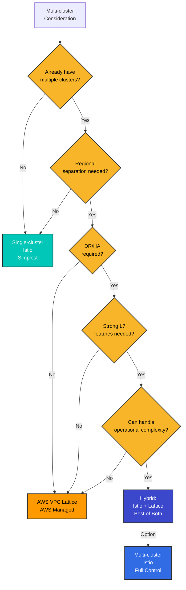

### マルチクラスターが必要な場合

#### 1. 地理的分散とレイテンシーの最適化

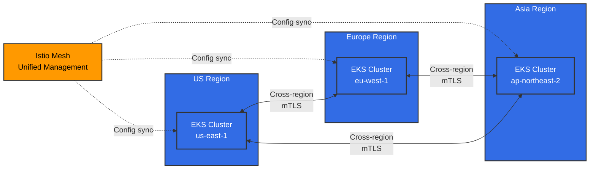

**必要な場合**:

* グローバルなユーザー向けサービス（レイテンシー目標 <100ms）
* データ主権コンプライアンス（GDPR、金融データのローカライゼーション）
* リージョナルなトラフィックルーティングと障害分離

#### 2. 災害復旧（DR）

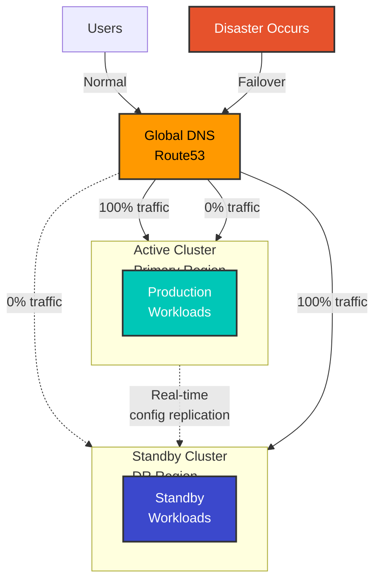

**必要な場合**:

* RTO（Recovery Time Objective）<1 時間
* RPO（Recovery Point Objective）<15 分
* リージョン障害時の自動 Failover

#### 3. 環境分離と段階的デプロイメント

**必要な場合**:

* 統合管理を伴う Dev/Staging/Prod クラスターの分離
* クラスターレベルの Blue/Green デプロイメント
* 段階的なリージョン拡大を伴う Canary デプロイメント

#### 4. 組織的な境界とセキュリティ分離

**必要な場合**:

* チーム／部門ごとの独立したクラスター運用
* 強化された Multi-tenancy
* 規制コンプライアンスのための物理的分離

### マルチクラスターが不要な場合

#### 1. 単一リージョン・小規模サービス

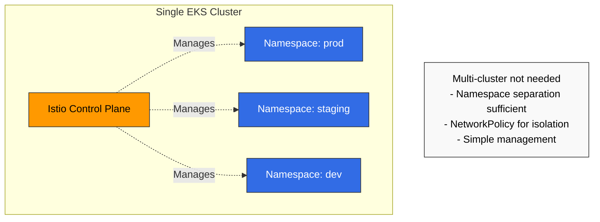

**代わりに使用するもの**:

* Kubernetes Namespace による分離
* ネットワーク分離のための NetworkPolicy
* アクセス制御のための RBAC

#### 2. 運用上の複雑さに対応できない場合

**マルチクラスターの運用要件**:

* 最低 2～3 人の Istio エキスパート
* East-West Gateway の管理とモニタリング
* クラスター間の証明書管理
* クラスター間のデバッグ能力

**チームが小規模な場合**:

* Single-cluster Istio または
* AWS VPC Lattice（マネージドサービス）

#### 3. コストが重要な考慮事項である場合

**マルチクラスターの追加コスト**:

* East-West Gateway 用の LoadBalancer（リージョンあたり月額 $20～50）
* リージョン間データ転送（$0.02/GB）
* Control Plane の冗長性（リソース 2～3 倍）

### チェックリスト

導入前に以下の質問に答えてください。

**アーキテクチャ**:

* [ ] すでに 2 つ以上のクラスターを運用していますか？
* [ ] マルチリージョンデプロイメントが必要ですか？
* [ ] クラスター間のサービス呼び出しは頻繁ですか？

**ビジネス要件**:

* [ ] グローバルユーザーを対象としていますか？
* [ ] 災害復旧（DR）は不可欠ですか？
* [ ] RTO/RPO 要件は厳格ですか？

**セキュリティとコンプライアンス**:

* [ ] データローカライゼーションが必要ですか？
* [ ] 強力なクラスター間分離が必要ですか？

**運用能力**:

* [ ] Istio エキスパートがいますか？
* [ ] 複雑なネットワーク問題をデバッグできますか？
* [ ] 追加コストを負担できますか？

**結果**:

* 9 個以上チェック: Multi-cluster Istio を推奨
* 5～8 個チェック: VPC Lattice または Hybrid を検討
* 4 個以下チェック: Single-cluster Istio から開始

## アーキテクチャ選択ガイド

### シナリオ別の最適なソリューション

| シナリオ                             | Single-cluster | Multi-cluster Istio | VPC Lattice | Hybrid      |
| ------------------------------------ | -------------- | ------------------- | ----------- | ----------- |
| **単一リージョン・小規模**           | 最適           | 過剰                | 不要        | 不要        |
| **マルチリージョン・強力な L7 が必要** | 不可能         | 最適                | 制限あり    | 推奨        |
| **AWS 中心・シンプルな接続性**       | 制限あり       | 過剰                | 最適        | 不要        |
| **DR・自動 Failover**                | 不可能         | 最適                | 手動        | 推奨        |
| **コスト最適化を優先**               | 最適           | 高コスト            | 推奨        | 中程度      |
| **運用の簡素化**                     | 最適           | 複雑                | 最適        | 中程度      |
| **きめ細かなトラフィック制御**       | 可能           | 最適                | 制限あり    | 推奨        |

### 各ソリューションの比較

#### Single-cluster Istio

**長所**:

* 最もシンプルな管理
* 低コスト
* 高速なデバッグ
* すべての Istio 機能を利用可能

**短所**:

* 単一障害点
* リージョン障害時にサービスが完全停止
* 地理的分散が不可能

**適している場合**:

* 単一リージョンのサービス
* 小規模チーム（50 人未満）
* 高可用性が必須ではない

#### Multi-cluster Istio

**長所**:

* 完全な地理的分散
* 自動 DR と Failover
* すべての L7 機能（Retry、Timeout、Circuit Breaker）
* きめ細かなトラフィック制御
* 統合された可観測性

**短所**:

* 高い運用上の複雑さ
* East-West Gateway の管理が必要
* リージョン間データ転送コスト
* デバッグが困難

**適している場合**:

* グローバルサービス
* 強力な DR が必要
* きめ細かな L7 制御が不可欠

#### AWS VPC Lattice

**長所**:

* AWS によるフルマネージド
* シンプルなセットアップ
* 低い運用負荷
* 安全なクロス VPC 接続
* コスト効率が高い

**短所**:

* L7 機能が制限される（Retry、Circuit Breaker なし）
* AWS ロックイン
* きめ細かなトラフィック制御がない
* Istio の可観測性がない

**適している場合**:

* AWS 中心のアーキテクチャ
* シンプルなサービス接続性のみが必要
* 運用の簡素化を優先

## Istio と AWS VPC Lattice

### 機能比較

| 機能                  | Istio Multi-cluster   | AWS VPC Lattice | Hybrid        |
| --------------------- | --------------------- | --------------- | ------------- |
| **トラフィックルーティング** |                       |                 |               |
| Header ベースのルーティング | 完全対応              | 制限あり        | Istio が処理  |
| 重み付きルーティング    | 対応                  | 対応            | 両方可能      |
| Path ベースのルーティング | 対応                  | 対応            | 両方可能      |
| **レジリエンス**      |                       |                 |               |
| Retry                 | きめ細かな制御        | 非対応          | Istio が処理  |
| Timeout               | きめ細かな制御        | 基本のみ        | Istio が処理  |
| Circuit Breaker       | 対応                  | 非対応          | Istio が処理  |
| **セキュリティ**      |                       |                 |               |
| mTLS                  | 自動                  | 対応            | 両方          |
| AuthN/AuthZ           | きめ細かなポリシー    | IAM のみ        | Istio が処理  |
| **可観測性**          |                       |                 |               |
| 分散トレーシング      | Jaeger/Zipkin         | 制限あり        | Istio が処理  |
| メトリクス            | 詳細                  | 基本のみ        | Istio が処理  |
| **運用**              |                       |                 |               |
| 管理の複雑さ          | 高い                  | 低い            | 中程度        |
| コスト                | 高い                  | 低い            | 中程度        |
| AWS 統合              | 手動                  | ネイティブ      | 良好          |

### アーキテクチャパターンの比較

#### パターン 1: Istio Multi-cluster のみ

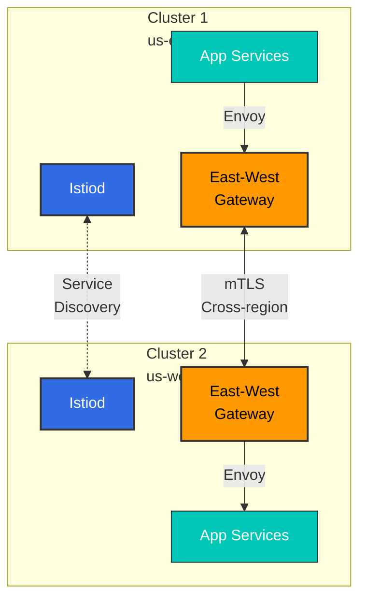

**長所**:

* 完全な Istio 機能
* 統合された可観測性
* きめ細かな制御

**短所**:

* East-West Gateway の管理が必要
* 高い複雑さ
* リージョン間データ転送コスト

#### パターン 2: VPC Lattice のみ

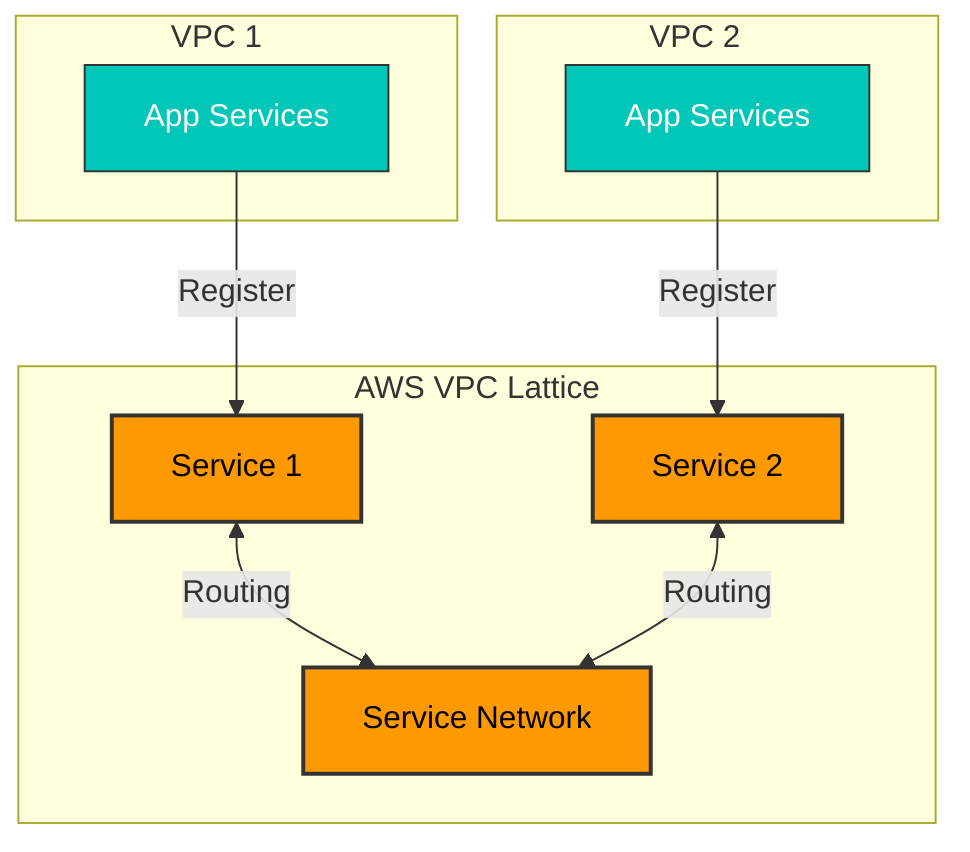

**長所**:

* AWS によるフルマネージド
* シンプルなセットアップ
* 低い運用負荷

**短所**:

* Istio 機能を使用できない
* トラフィック制御が制限される
* Kubernetes ネイティブではない

#### パターン 3: Hybrid（推奨）

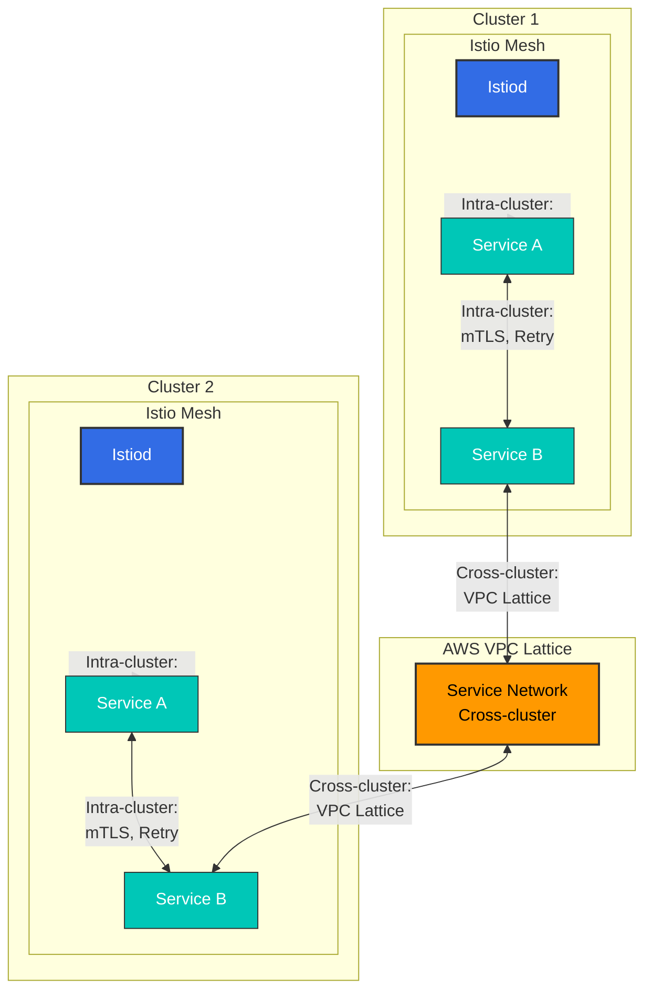

**長所**:

* クラスター内: すべての高度な Istio 機能（Retry、Circuit Breaker、きめ細かなルーティング）
* クラスター間: シンプルな VPC Lattice 管理と安定性
* 運用上の複雑さを低減（East-West Gateway 不要）
* コスト最適化（リージョン間トラフィックを最小化）

**短所**:

* 2 つのテクノロジースタックを理解する必要がある
* クラスター間では Lattice 機能に限定される

**適している場合**:

* AWS 環境
* クラスター内で複雑なトラフィック制御が必要
* クラスター間で必要なのはシンプルな接続性のみ

## マルチクラスターの概要

マルチクラスター Service Mesh では、次のことが可能です。

* マルチリージョンデプロイメント
* 災害復旧（DR）
* 環境分離（dev/staging/prod）
* クラスター間のサービスディスカバリーと通信

## トポロジー

### Primary-Remote

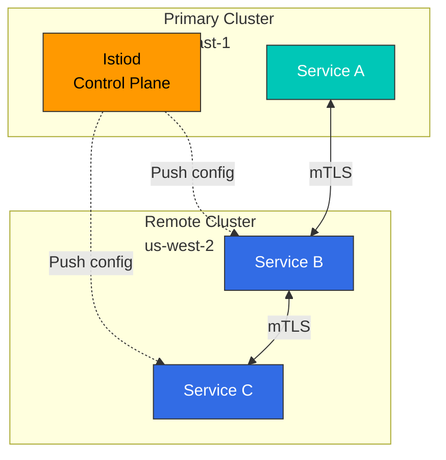

**特性**:

* 単一の Control Plane（Primary）
* 複数の Data Plane（Remote）
* シンプルな管理
* 単一障害点（Primary）

### Multi-Primary

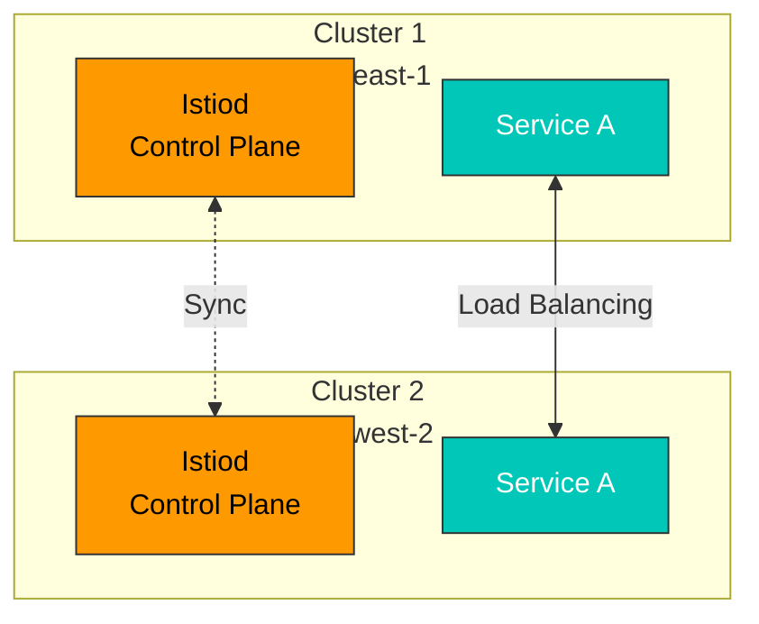

**特性**:

* 複数の Control Plane
* 高可用性
* 複雑な管理
* リージョンの自律性

## Primary-Remote セットアップ

### 1. Primary クラスターのセットアップ

```bash
# Context setup
export CTX_CLUSTER1=cluster1

# Install Istio
istioctl install --context="${CTX_CLUSTER1}" -f - <<EOF
apiVersion: install.istio.io/v1alpha1
kind: IstioOperator
spec:
  values:
    global:
      meshID: mesh1
      multiCluster:
        clusterName: cluster1
      network: network1
EOF

# Install East-West Gateway
samples/multicluster/gen-eastwest-gateway.sh \
  --mesh mesh1 --cluster cluster1 --network network1 | \
  istioctl install --context="${CTX_CLUSTER1}" -y -f -

# Expose Gateway
kubectl apply --context="${CTX_CLUSTER1}" -f \
  samples/multicluster/expose-services.yaml
```

### 2. Remote クラスターのセットアップ

```bash
# Context setup
export CTX_CLUSTER2=cluster2

# Create Remote Secret
istioctl create-remote-secret \
  --context="${CTX_CLUSTER1}" \
  --name=cluster1 | \
  kubectl apply -f - --context="${CTX_CLUSTER2}"

# Install Istio with Remote configuration
istioctl install --context="${CTX_CLUSTER2}" -f - <<EOF
apiVersion: install.istio.io/v1alpha1
kind: IstioOperator
spec:
  values:
    global:
      meshID: mesh1
      multiCluster:
        clusterName: cluster2
      network: network1
      remotePilotAddress: ${DISCOVERY_ADDRESS}
EOF
```

## Multi-Primary セットアップ

### 1. 両方のクラスターを Primary として設定

```bash
# Cluster 1
istioctl install --context="${CTX_CLUSTER1}" -f - <<EOF
apiVersion: install.istio.io/v1alpha1
kind: IstioOperator
spec:
  values:
    global:
      meshID: mesh1
      multiCluster:
        clusterName: cluster1
      network: network1
EOF

# Cluster 2
istioctl install --context="${CTX_CLUSTER2}" -f - <<EOF
apiVersion: install.istio.io/v1alpha1
kind: IstioOperator
spec:
  values:
    global:
      meshID: mesh1
      multiCluster:
        clusterName: cluster2
      network: network2
EOF
```

### 2. Remote Secret を相互登録

```bash
# Cluster 1's Secret to Cluster 2
istioctl create-remote-secret \
  --context="${CTX_CLUSTER1}" \
  --name=cluster1 | \
  kubectl apply -f - --context="${CTX_CLUSTER2}"

# Cluster 2's Secret to Cluster 1
istioctl create-remote-secret \
  --context="${CTX_CLUSTER2}" \
  --name=cluster2 | \
  kubectl apply -f - --context="${CTX_CLUSTER1}"
```

## クラスター間通信

### Service Entry

```yaml
apiVersion: networking.istio.io/v1
kind: ServiceEntry
metadata:
  name: httpbin-cluster2
spec:
  hosts:
  - httpbin.default.svc.cluster.local
  location: MESH_INTERNAL
  ports:
  - number: 8000
    name: http
    protocol: HTTP
  resolution: DNS
  addresses:
  - 240.0.0.1
  endpoints:
  - address: ${CLUSTER2_INGRESS_HOST}
    ports:
      http: 15443
```

## VPC Lattice との併用

### Hybrid アーキテクチャの実装

Istio と VPC Lattice を組み合わせることで、両者の長所を活かせます。

#### ステップ 1: 各クラスターに Istio を独立してインストール

```bash
# Cluster 1 (single cluster mode)
export CTX_CLUSTER1=cluster1
istioctl install --context="${CTX_CLUSTER1}" -f - <<EOF
apiVersion: install.istio.io/v1alpha1
kind: IstioOperator
spec:
  values:
    global:
      meshID: mesh1-cluster1
      multiCluster:
        enabled: false  # Disable Multi-cluster
      network: network1
EOF

# Cluster 2 (independent installation)
export CTX_CLUSTER2=cluster2
istioctl install --context="${CTX_CLUSTER2}" -f - <<EOF
apiVersion: install.istio.io/v1alpha1
kind: IstioOperator
spec:
  values:
    global:
      meshID: mesh1-cluster2
      multiCluster:
        enabled: false  # Disable Multi-cluster
      network: network2
EOF
```

#### ステップ 2: VPC Lattice Service Network を作成

```bash
# Create Service Network
aws vpc-lattice create-service-network \
  --name my-service-network \
  --auth-type AWS_IAM

# Save Service Network ID
SERVICE_NETWORK_ID=$(aws vpc-lattice list-service-networks \
  --query 'items[?name==`my-service-network`].id' \
  --output text)

# Connect VPC (Cluster 1 VPC)
aws vpc-lattice create-service-network-vpc-association \
  --service-network-identifier $SERVICE_NETWORK_ID \
  --vpc-identifier $VPC1_ID

# Connect VPC (Cluster 2 VPC)
aws vpc-lattice create-service-network-vpc-association \
  --service-network-identifier $SERVICE_NETWORK_ID \
  --vpc-identifier $VPC2_ID
```

#### ステップ 3: Kubernetes Service を VPC Lattice に登録

```yaml
# Register Cluster 1's service to VPC Lattice
apiVersion: application-networking.k8s.aws/v1alpha1
kind: ServiceExport
metadata:
  name: my-service
  namespace: default
  annotations:
    application-networking.k8s.aws/lattice-service-network: my-service-network
spec: {}
---
# Routing from Cluster 1 to VPC Lattice
apiVersion: networking.istio.io/v1
kind: ServiceEntry
metadata:
  name: remote-service-via-lattice
  namespace: default
spec:
  hosts:
  - remote-service.lattice.svc.cluster.local
  location: MESH_EXTERNAL
  ports:
  - number: 80
    name: http
    protocol: HTTP
  resolution: DNS
  endpoints:
  - address: ${LATTICE_SERVICE_DNS}  # VPC Lattice DNS
    ports:
      http: 80
---
# Don't apply mTLS for VPC Lattice traffic
apiVersion: networking.istio.io/v1beta1
kind: DestinationRule
metadata:
  name: remote-service-via-lattice
  namespace: default
spec:
  host: remote-service.lattice.svc.cluster.local
  trafficPolicy:
    tls:
      mode: SIMPLE  # VPC Lattice handles TLS
```

#### ステップ 4: IAM Policy のセットアップ

```json
{
  "Version": "2012-10-17",
  "Statement": [
    {
      "Effect": "Allow",
      "Principal": {
        "AWS": "*"
      },
      "Action": "vpc-lattice-svcs:Invoke",
      "Resource": "*",
      "Condition": {
        "StringEquals": {
          "vpc-lattice-svcs:SourceVpc": [
            "${VPC1_ID}",
            "${VPC2_ID}"
          ]
        }
      }
    }
  ]
}
```

### トラフィックフロー

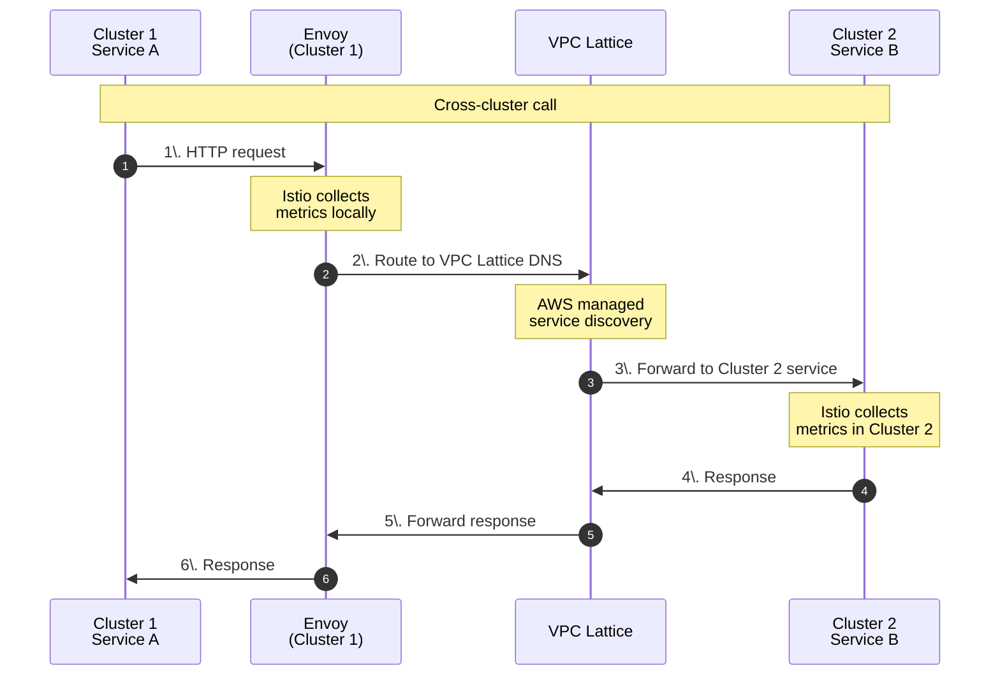

### 長所と考慮事項

**長所**:

* クラスター内: すべての Istio 機能（Retry、Circuit Breaker、きめ細かなルーティング）
* クラスター間: シンプルな VPC Lattice 管理
* East-West Gateway 不要 -> 運用負荷を低減
* AWS ネイティブ統合

**考慮事項**:

* クラスター間トラフィックは VPC Lattice 機能に限定される
* VPC Lattice では Retry、Timeout をきめ細かく制御できない
* Istio の分散トレーシングはクラスター境界で途切れる（各クラスターで独立してトレースされる）

## 実践例

### 例 1: グローバル E-commerce（Multi-Primary + VPC Lattice）

#### アーキテクチャ

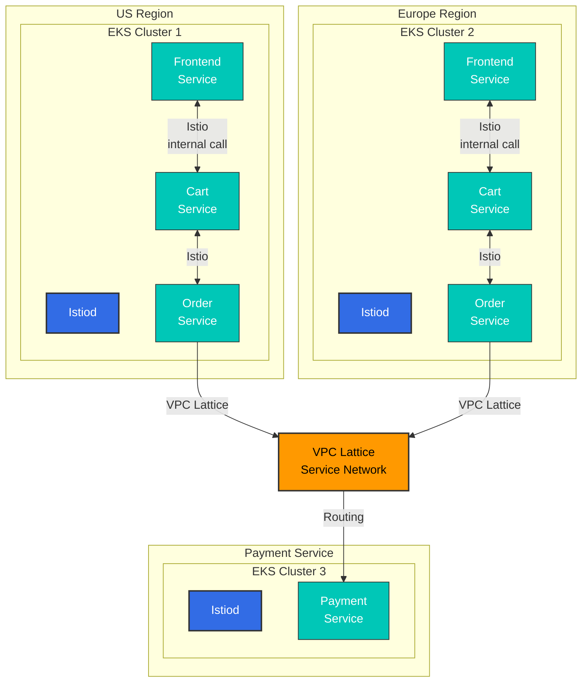

**判断**:

* **クラスター内（Frontend <-> Cart <-> Order）**: Istio を使用
  * 理由: 呼び出しが頻繁で、複雑なルーティングと Circuit Breaker が必要
* **クラスター間（Order -> Payment）**: VPC Lattice を使用
  * 理由: 比較的シンプルな呼び出しであり、AWS IAM 認証を活用でき、管理が簡単

#### 設定例

**クラスター 1/2: Frontend -> Cart（Istio）**

```yaml
apiVersion: networking.istio.io/v1
kind: VirtualService
metadata:
  name: cart-service
  namespace: default
spec:
  hosts:
  - cart.default.svc.cluster.local
  http:
  - match:
    - headers:
        user-type:
          exact: premium
    route:
    - destination:
        host: cart.default.svc.cluster.local
        subset: v2
      weight: 100
  - route:
    - destination:
        host: cart.default.svc.cluster.local
        subset: v1
      weight: 100
---
apiVersion: networking.istio.io/v1beta1
kind: DestinationRule
metadata:
  name: cart-service
spec:
  host: cart.default.svc.cluster.local
  trafficPolicy:
    connectionPool:
      tcp:
        maxConnections: 100
      http:
        http1MaxPendingRequests: 1024
        maxRequestsPerConnection: 10
    outlierDetection:
      consecutiveErrors: 5
      interval: 10s
      baseEjectionTime: 30s
  subsets:
  - name: v1
    labels:
      version: v1
  - name: v2
    labels:
      version: v2
```

**クラスター 1/2: Order -> Payment（VPC Lattice）**

```yaml
# ServiceEntry for VPC Lattice
apiVersion: networking.istio.io/v1
kind: ServiceEntry
metadata:
  name: payment-service-lattice
  namespace: default
spec:
  hosts:
  - payment.lattice.svc.cluster.local
  location: MESH_EXTERNAL
  ports:
  - number: 443
    name: https
    protocol: HTTPS
  resolution: DNS
  endpoints:
  - address: payment-service-abc123.vpc-lattice.amazonaws.com
---
# DestinationRule: VPC Lattice TLS
apiVersion: networking.istio.io/v1beta1
kind: DestinationRule
metadata:
  name: payment-service-lattice
spec:
  host: payment.lattice.svc.cluster.local
  trafficPolicy:
    tls:
      mode: SIMPLE  # VPC Lattice handles TLS
```

### 例 2: 災害復旧（DR）シナリオ

#### Route53 Failover を使用した Active-Standby

```yaml
# Cluster 1 (Active): Health Check Endpoint
apiVersion: v1
kind: Service
metadata:
  name: health-check
  namespace: istio-system
  annotations:
    service.beta.kubernetes.io/aws-load-balancer-type: "nlb"
    external-dns.alpha.kubernetes.io/hostname: api.example.com
    external-dns.alpha.kubernetes.io/set-identifier: "us-east-1-primary"
    external-dns.alpha.kubernetes.io/aws-health-check-id: "health-check-primary"
spec:
  type: LoadBalancer
  selector:
    app: health-check
  ports:
  - port: 80
    targetPort: 8080
---
# Cluster 2 (Standby): Health Check Endpoint
apiVersion: v1
kind: Service
metadata:
  name: health-check
  namespace: istio-system
  annotations:
    service.beta.kubernetes.io/aws-load-balancer-type: "nlb"
    external-dns.alpha.kubernetes.io/hostname: api.example.com
    external-dns.alpha.kubernetes.io/set-identifier: "us-west-2-standby"
    external-dns.alpha.kubernetes.io/aws-health-check-id: "health-check-standby"
spec:
  type: LoadBalancer
  selector:
    app: health-check
  ports:
  - port: 80
    targetPort: 8080
```

**Route53 Health Check と Failover Policy**:

```bash
# Create Primary Health Check
aws route53 create-health-check \
  --caller-reference "$(date +%s)" \
  --health-check-config \
    Type=HTTPS,ResourcePath=/healthz,FullyQualifiedDomainName=${PRIMARY_LB_DNS},Port=443

# Failover Routing Policy
aws route53 change-resource-record-sets \
  --hosted-zone-id ${ZONE_ID} \
  --change-batch file://failover-config.json
```

**failover-config.json**:

```json
{
  "Changes": [
    {
      "Action": "CREATE",
      "ResourceRecordSet": {
        "Name": "api.example.com",
        "Type": "A",
        "SetIdentifier": "Primary",
        "Failover": "PRIMARY",
        "AliasTarget": {
          "HostedZoneId": "${NLB_ZONE_ID}",
          "DNSName": "${PRIMARY_LB_DNS}",
          "EvaluateTargetHealth": true
        },
        "HealthCheckId": "${PRIMARY_HEALTH_CHECK_ID}"
      }
    },
    {
      "Action": "CREATE",
      "ResourceRecordSet": {
        "Name": "api.example.com",
        "Type": "A",
        "SetIdentifier": "Secondary",
        "Failover": "SECONDARY",
        "AliasTarget": {
          "HostedZoneId": "${NLB_ZONE_ID}",
          "DNSName": "${STANDBY_LB_DNS}",
          "EvaluateTargetHealth": true
        }
      }
    }
  ]
}
```

## パフォーマンスとコストの比較

### パフォーマンス比較

| 指標                       | Single-cluster | Multi-cluster Istio    | Hybrid（Istio + Lattice） |
| ------------------------- | -------------- | ---------------------- | ------------------------ |
| **クラスター内レイテンシー** | \~2ms          | \~2ms                  | \~2ms                    |
| **クラスター間レイテンシー** | N/A            | +5-10ms (East-West GW) | +3-5ms (VPC Lattice)     |
| **スループット（RPS）**   | 10,000         | 8,500                  | 9,200                    |
| **CPU オーバーヘッド**    | +10%           | +15%                   | +12%                     |
| **メモリ使用量**          | +50MB/pod      | +70MB/pod              | +55MB/pod                |

### コスト比較（月額、2 クラスター）

| 項目                       | Single-cluster | Multi-cluster Istio | Hybrid     | VPC Lattice のみ |
| ------------------------- | -------------- | ------------------- | ---------- | ---------------- |
| **Control Plane**         | $50            | $100 (x2)           | $100 (x2)  | $0               |
| **East-West Gateway**     | $0             | $100 (NLB x2)       | $0         | $0               |
| **リージョン間転送**      | $0             | $200 (10TB)         | $100 (5TB) | $100 (5TB)       |
| **VPC Lattice**           | $0             | $0                  | $30        | $50              |
| **運用担当者**            | $10,000        | $15,000             | $12,000    | $8,000           |
| **推定総コスト**          | \~$10,050      | \~$15,400           | \~$12,230  | \~$8,150         |

**コスト削減のヒント**:

* VPC Peering によりリージョン間転送コストを削減可能
* VPC Lattice はスループットベースの課金 -> トラフィック最適化が不可欠
* Ambient Mode によりリソースオーバーヘッドを 90% 削減

### ROI 分析

**Multi-cluster Istio の投資価値**:

* ダウンタイムコストが $1,000/時間を超える場合は強く推奨
* グローバルな顧客体験が重要な場合に推奨
* 小規模なスタートアップには過剰な投資

**Hybrid アプローチの最適なケース**:

* AWS 中心のアーキテクチャ
* クラスター内の複雑なロジック
* クラスター間のシンプルな接続性

## トラブルシューティング

```bash
# Verify cross-cluster connectivity
istioctl ps --context="${CTX_CLUSTER1}"
istioctl ps --context="${CTX_CLUSTER2}"

# Check Remote Secret
kubectl get secrets -n istio-system --context="${CTX_CLUSTER1}"

# Verify cross-cluster traffic
kubectl logs -n istio-system -l app=istiod --context="${CTX_CLUSTER1}"
```

## 参考資料

### 公式ドキュメント

* [Istio Multi-cluster](https://istio.io/latest/docs/setup/install/multicluster/)
* [Multi-Primary](https://istio.io/latest/docs/setup/install/multicluster/multi-primary/)
* [Primary-Remote](https://istio.io/latest/docs/setup/install/multicluster/primary-remote/)
* [AWS VPC Lattice](https://docs.aws.amazon.com/vpc-lattice/latest/ug/what-is-vpc-lattice.html)
* [AWS Gateway API Controller](https://www.gateway-api-controller.eks.aws.dev/)

### ブログとケーススタディ

* [Tetrate - Multi-cluster Istio](https://tetrate.io/blog/multicluster-istio/)
* [Solo.io - Istio Multi-cluster Best Practices](https://www.solo.io/blog/istio-multicluster/)

### 関連ドキュメント

* [Ambient Mode](01-ambient-mode.md) - リソース最適化
* [mTLS](../security/01-mtls.md) - 安全なクラスター間通信
* [VPC Lattice](https://github.com/Atom-oh/kubernetes-docs/blob/main/en/service-mesh/networking/02-vpc-lattice.md) - AWS マネージドサービスネットワーキング

## まとめ

マルチクラスター Service Mesh は強力ですが、複雑さとコストが増加します。判断ガイド:

| 選択肢                  | 適している場合                                      | 主な長所                            | 主な短所                                            |
| ----------------------- | --------------------------------------------------- | ----------------------------------- | --------------------------------------------------- |
| **Single-cluster**      | 単一リージョン・小規模                              | シンプルな管理、低コスト            | 単一障害点、地理的分散なし                          |
| **Multi-cluster Istio** | グローバルサービス、強力な L7 が必要                | 完全な制御、すべての Istio 機能     | 高い複雑さ、高コスト                                |
| **VPC Lattice**         | AWS 中心、シンプルな接続性                          | AWS マネージド、低い運用負荷        | Istio 機能が制限、AWS ロックイン                    |
| **Hybrid**              | AWS 環境、複雑な内部処理 + シンプルな外部接続       | 複雑さと機能のバランス              | 2 つのテクノロジースタックを理解する必要がある      |

**推奨アプローチ**:

1. Single-cluster から開始
2. マルチリージョンが必要になった場合 -> Hybrid（Istio + VPC Lattice）を検討
3. 強力な L7 制御が不可欠な場合 -> Multi-cluster Istio
4. 運用の簡素化を優先する場合 -> VPC Lattice のみ
