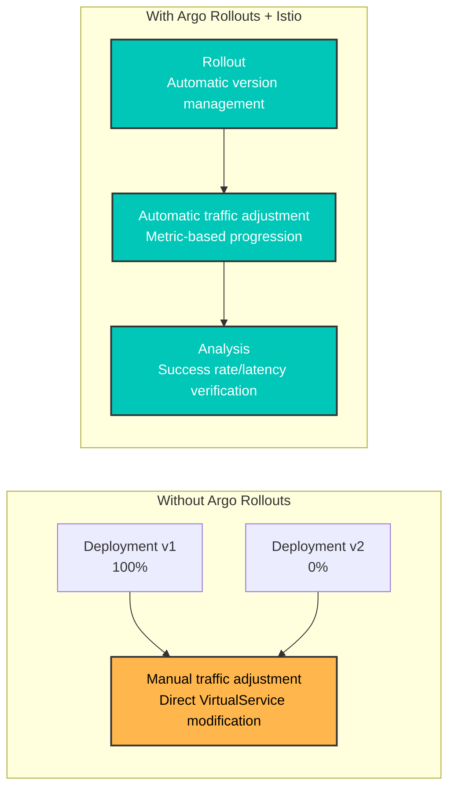
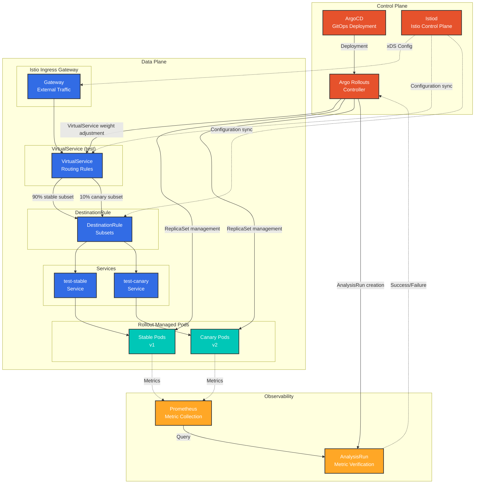
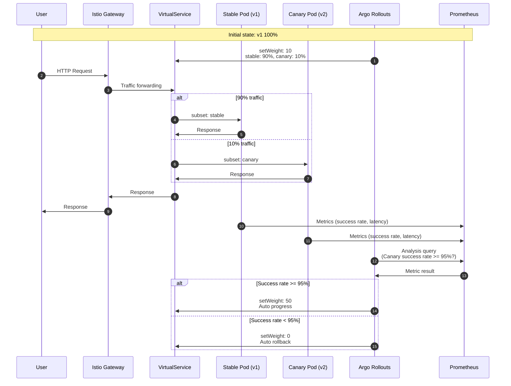
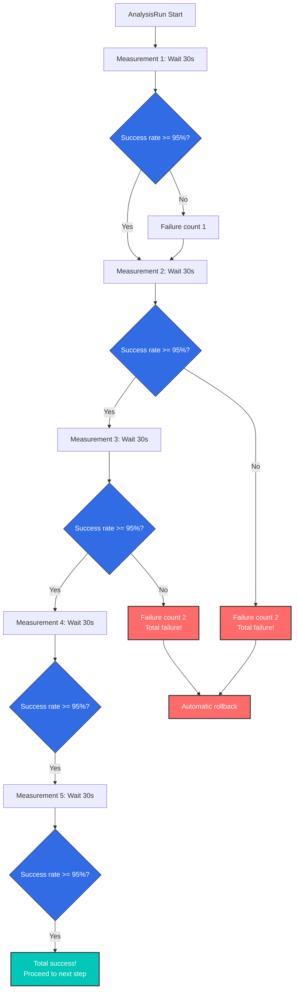
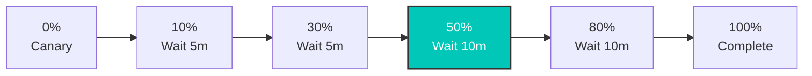
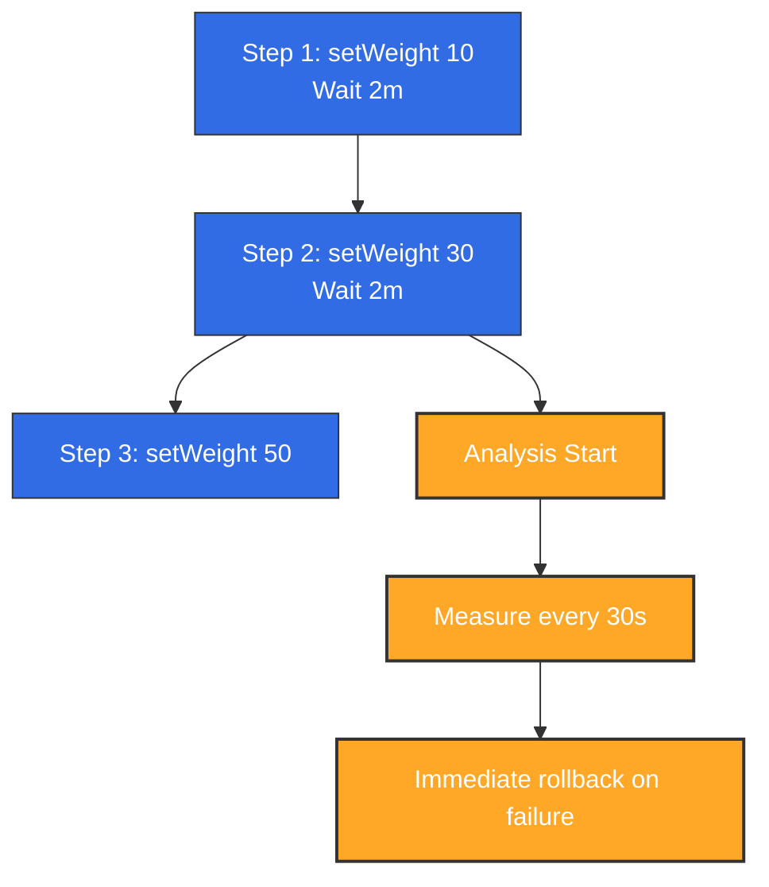
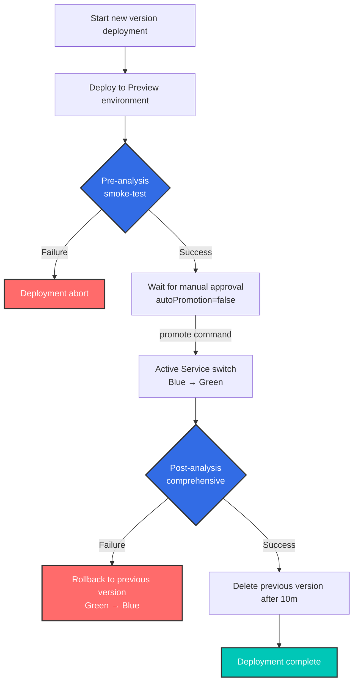

# Argo Rollouts と Istio の統合

> **対応バージョン**: Argo Rollouts 1.6+, Istio 1.18+
> **最終更新**: February 19, 2026
> **難易度**: ⭐⭐⭐⭐（上級）

このドキュメントでは、Argo Rollouts を Istio Service Mesh と統合して Progressive Delivery を実装する方法を詳しく説明します。

## 目次

1. [概要](#overview)
2. [アーキテクチャ](#architecture)
3. [コアコンセプト](#core-concepts)
4. [セットアップと設定](#setup-and-configuration)
5. [トラフィックルーティング戦略](#traffic-routing-strategies)
6. [分析とメトリクス](#analysis-and-metrics)
7. [高度なデプロイメントパターン](#advanced-deployment-patterns)
8. [トラブルシューティング](#troubleshooting)
9. [ベストプラクティス](#best-practices)

## 概要

### Argo Rollouts とは？

Argo Rollouts は、Kubernetes 向けの Progressive Delivery コントローラーであり、高度なデプロイメント戦略を提供します。

- **Canary デプロイメント**: 段階的なトラフィック移行
- **Blue/Green デプロイメント**: 即時切り替えとロールバック
- **分析ベースの自動化**: メトリクスに基づく自動進行／ロールバック
- **トラフィック管理の統合**: Istio、Nginx、ALB などをサポート

### Istio 統合の利点



**主な利点**:
- ✅ **Canary デプロイメントの自動化**: VirtualService の重みを自動調整
- ✅ **メトリクスベースの検証**: Prometheus メトリクスによる自動進行／ロールバック
- ✅ **きめ細かなトラフィック制御**: Istio の L7 ルーティングを活用
- ✅ **ダウンタイムゼロのデプロイメント**: トラフィック切り替え中もダウンタイムなし
- ✅ **自動ロールバック**: エラー率上昇時に自動ロールバック

### 対応する Istio リソース

| リソース | 目的 | Argo Rollouts による管理 |
|----------|------|-------------------|
| **VirtualService** | トラフィックルーティングルール | ✅ ルートの重みを自動調整 |
| **DestinationRule** | Subset の定義 | ⚠️ 手動作成が必要 |
| **Service** | Stable/Canary エンドポイント | ⚠️ 手動作成が必要 |

## アーキテクチャ

### 全体アーキテクチャ



### トラフィックフロー



## コアコンセプト

### 1. Rollout リソース

Rollout は Deployment を置き換え、高度なデプロイメント戦略をサポートするカスタムリソースです。

**Deployment との比較**:

| 機能 | Deployment | Rollout |
|------|-----------|---------|
| **基本的なロールアウト** | ✅ RollingUpdate | ✅ RollingUpdate |
| **Canary デプロイメント** | ❌ | ✅ トラフィック重みの制御 |
| **Blue/Green** | ❌ | ✅ 即時切り替え |
| **分析ベースの自動化** | ❌ | ✅ AnalysisTemplate |
| **トラフィック管理の統合** | ❌ | ✅ Istio、Nginx、ALB |
| **自動ロールバック** | ❌ | ✅ メトリクスベース |

### 2. VirtualService の管理方法

**重要**: Argo Rollouts は、指定したルート名の **destinations 配列全体を上書き** します。

```yaml
# VirtualService initial state
apiVersion: networking.istio.io/v1
kind: VirtualService
metadata:
  name: test
spec:
  http:
  - name: primary  # Route managed by Rollout
    route:
    - destination: {host: test, subset: stable}
      weight: 100
    - destination: {host: test, subset: canary}
      weight: 0
```

**Rollout 設定**:
```yaml
apiVersion: argoproj.io/v1alpha1
kind: Rollout
spec:
  strategy:
    canary:
      trafficRouting:
        istio:
          virtualService:
            name: test          # VirtualService name
            routes:
            - primary           # Route name to manage
          destinationRule:
            name: test          # DestinationRule name
            canarySubsetName: canary
            stableSubsetName: stable
      steps:
      - setWeight: 10  # → Modifies primary route of VirtualService
```

**setWeight: 10 の実行時**:
```yaml
# Automatically modified by Argo Rollouts
http:
- name: primary
  route:
  - destination: {host: test, subset: stable}
    weight: 90   # ← Auto adjusted
  - destination: {host: test, subset: canary}
    weight: 10   # ← Auto adjusted
```

**注意事項**:
- ⚠️ 複数の Rollout が同じルート名を参照すると競合が発生します
- ⚠️ Rollout はルートの **すべての destination** を管理します
- ⚠️ Subset 名が異なっていても同じルートを共有できません

### 3. Subset と Service

**DestinationRule Subset**:
```yaml
apiVersion: networking.istio.io/v1
kind: DestinationRule
metadata:
  name: test
spec:
  host: test  # Matches Service name
  subsets:
  - name: stable
    labels: {}  # ← Empty labels (uses Service selector)
  - name: canary
    labels: {}  # ← Empty labels (uses Service selector)
```

**Stable/Canary Service**:
```yaml
# Stable Service
apiVersion: v1
kind: Service
metadata:
  name: test-stable
spec:
  selector:
    app: test
    # Label automatically added by Rollout
    rollouts-pod-template-hash: <stable-hash>
  ports:
  - port: 8080

---
# Canary Service
apiVersion: v1
kind: Service
metadata:
  name: test-canary
spec:
  selector:
    app: test
    # Label automatically added by Rollout
    rollouts-pod-template-hash: <canary-hash>
  ports:
  - port: 8080
```

**動作方法**:
1. Rollout が新しいバージョンをデプロイすると、新しい `rollouts-pod-template-hash` ラベルを作成します
2. そのハッシュラベルを Canary Pod に自動追加します
3. Canary Service はそれらの Pod のみを選択します
4. Rollout の完了時に、Stable Service は新しいハッシュで更新されます

### 4. 分析とメトリクス

**AnalysisTemplate**:
```yaml
apiVersion: argoproj.io/v1alpha1
kind: AnalysisTemplate
metadata:
  name: success-rate
spec:
  args:
  - name: service-name
  - name: canary-hash
  metrics:
  - name: success-rate
    interval: 30s              # Measure every 30 seconds
    count: 5                   # 5 measurements
    successCondition: result >= 0.95  # Must be 95% or above for success
    failureLimit: 2            # Entire failure after 2 failures
    provider:
      prometheus:
        address: http://prometheus.istio-system:9090
        query: |
          sum(rate(
            istio_requests_total{
              destination_service_name="{{args.service-name}}",
              destination_workload_label_rollouts_pod_template_hash="{{args.canary-hash}}",
              response_code!~"5.*"
            }[2m]
          ))
          /
          sum(rate(
            istio_requests_total{
              destination_service_name="{{args.service-name}}",
              destination_workload_label_rollouts_pod_template_hash="{{args.canary-hash}}"
            }[2m]
          ))
```

**AnalysisRun**:


## セットアップと設定

### 必要なリソースの作成

#### 1. Rollout リソース

```yaml
apiVersion: argoproj.io/v1alpha1
kind: Rollout
metadata:
  name: test
  namespace: default
spec:
  replicas: 3
  revisionHistoryLimit: 2  # Number of ReplicaSets to keep
  selector:
    matchLabels:
      app: test
  template:
    metadata:
      labels:
        app: test
    spec:
      containers:
      - name: app
        image: myapp:v1
        ports:
        - containerPort: 8080
        resources:
          requests:
            cpu: 100m
            memory: 128Mi
          limits:
            cpu: 200m
            memory: 256Mi
  strategy:
    canary:
      # Stable/Canary Service specification
      canaryService: test-canary
      stableService: test-stable

      # Istio traffic routing
      trafficRouting:
        istio:
          virtualService:
            name: test              # VirtualService name
            routes:
            - primary               # Route name to manage
          destinationRule:
            name: test              # DestinationRule name
            canarySubsetName: canary
            stableSubsetName: stable

      # Deployment steps
      steps:
      - setWeight: 10
      - pause: {duration: 5m}
      - setWeight: 20
      - pause: {duration: 5m}
      - setWeight: 50
      - pause: {duration: 5m}
      - setWeight: 80
      - pause: {duration: 5m}
```

#### 2. Stable/Canary Service

```yaml
# Stable Service
apiVersion: v1
kind: Service
metadata:
  name: test-stable
  namespace: default
spec:
  selector:
    app: test
    # rollouts-pod-template-hash is auto-added by Rollout
  ports:
  - name: http
    port: 8080
    targetPort: 8080

---
# Canary Service
apiVersion: v1
kind: Service
metadata:
  name: test-canary
  namespace: default
spec:
  selector:
    app: test
    # rollouts-pod-template-hash is auto-added by Rollout
  ports:
  - name: http
    port: 8080
    targetPort: 8080

---
# Unified Service (referenced by VirtualService)
apiVersion: v1
kind: Service
metadata:
  name: test
  namespace: default
spec:
  selector:
    app: test
  ports:
  - name: http
    port: 8080
    targetPort: 8080
```

#### 3. VirtualService

```yaml
apiVersion: networking.istio.io/v1
kind: VirtualService
metadata:
  name: test
  namespace: default
spec:
  hosts:
  - test
  - test.default.svc.cluster.local
  http:
  - name: primary  # Route managed by Rollout
    route:
    - destination:
        host: test
        subset: stable
      weight: 100  # ← Auto adjusted by Rollout
    - destination:
        host: test
        subset: canary
      weight: 0    # ← Auto adjusted by Rollout
```

#### 4. DestinationRule

```yaml
apiVersion: networking.istio.io/v1
kind: DestinationRule
metadata:
  name: test
  namespace: default
spec:
  host: test
  trafficPolicy:
    loadBalancer:
      simple: LEAST_REQUEST
  subsets:
  - name: stable
    labels: {}  # Empty labels (uses Service selector)
  - name: canary
    labels: {}  # Empty labels (uses Service selector)
```

### デプロイメントワークフロー

```bash
# 1. Deploy new version
kubectl argo rollouts set image test app=myapp:v2

# 2. Check status (real-time monitoring)
kubectl argo rollouts get rollout test --watch

# Output example:
# Name:            test
# Namespace:       default
# Status:          ॥ Paused
# Strategy:        Canary
#   Step:          1/8
#   SetWeight:     10
#   ActualWeight:  10
# Images:          myapp:v1 (stable)
#                  myapp:v2 (canary)
# Replicas:
#   Desired:       3
#   Current:       4
#   Updated:       1
#   Ready:         4
#   Available:     4

# 3. Manually proceed to next step (after pause)
kubectl argo rollouts promote test

# 4. Immediate rollback (if issues occur)
kubectl argo rollouts abort test

# 5. Retry after rollback
kubectl argo rollouts retry rollout test
```

## トラフィックルーティング戦略

### 1. 基本的な Canary（重みベース）

```yaml
spec:
  strategy:
    canary:
      steps:
      - setWeight: 10   # 10% traffic
      - pause: {duration: 5m}
      - setWeight: 30
      - pause: {duration: 5m}
      - setWeight: 50
      - pause: {duration: 10m}
      - setWeight: 80
      - pause: {duration: 10m}
      # 100% auto transition
```

**トラフィック遷移グラフ**:


### 2. Header ベースのルーティング

**ユースケース**: 特定のユーザーグループ（内部テスター）にのみ Canary バージョンを公開する

```yaml
# VirtualService configuration
apiVersion: networking.istio.io/v1
kind: VirtualService
metadata:
  name: test
spec:
  http:
  # Priority 1: Header matching (Beta users → Canary)
  - name: header-route
    match:
    - headers:
        x-beta-user:
          exact: "true"
    route:
    - destination:
        host: test
        subset: canary
      weight: 100

  # Priority 2: Normal traffic (weight-based)
  - name: primary
    route:
    - destination:
        host: test
        subset: stable
      weight: 90
    - destination:
        host: test
        subset: canary
      weight: 10
```

```yaml
# Rollout configuration
spec:
  strategy:
    canary:
      trafficRouting:
        istio:
          virtualService:
            name: test
            routes:
            - primary  # Manages only primary route
      steps:
      - setWeight: 10
      - pause: {duration: 5m}
      - setWeight: 50
      - pause: {duration: 10m}
```

**動作**:
- `x-beta-user: true` Header を持つリクエスト → 100% Canary
- 通常のリクエスト → Rollout が重みを管理（10% → 50% → 100%）

### 3. ミラートラフィック（Shadow Testing）

**ユースケース**: 本番トラフィックを Canary にコピーする（レスポンスは無視）

```yaml
apiVersion: networking.istio.io/v1
kind: VirtualService
metadata:
  name: test
spec:
  http:
  - name: primary
    route:
    - destination:
        host: test
        subset: stable
      weight: 100  # Actual traffic 100% Stable
    mirror:
      host: test
      subset: canary
    mirrorPercentage:
      value: 10.0  # Copy 10% to Canary (ignore response)
```

**特徴**:
- ✅ 実際のユーザーへの影響なし（レスポンスは Stable からのみ返される）
- ✅ 本番トラフィックで Canary のパフォーマンス／エラーを検証
- ⚠️ Canary の書き込み操作には注意（データ重複の可能性）

### 4. 複数ルートの管理

**ユースケース**: 複数のパスのトラフィックを同時に調整する

```yaml
# VirtualService configuration
apiVersion: networking.istio.io/v1
kind: VirtualService
metadata:
  name: test
spec:
  http:
  - name: api-route  # API path
    match:
    - uri:
        prefix: /api
    route:
    - destination: {host: test, subset: stable}
      weight: 100
    - destination: {host: test, subset: canary}
      weight: 0

  - name: web-route  # Web path
    match:
    - uri:
        prefix: /web
    route:
    - destination: {host: test, subset: stable}
      weight: 100
    - destination: {host: test, subset: canary}
      weight: 0
```

```yaml
# Rollout configuration
spec:
  strategy:
    canary:
      trafficRouting:
        istio:
          virtualService:
            name: test
            routes:
            - api-route  # Manage both routes
            - web-route
      steps:
      - setWeight: 10  # Adjusts both routes to 10%
```

## 分析とメトリクス

Argo Rollouts は、Istio が収集する Prometheus メトリクスを使用して、Canary デプロイメントの成功を自動的に判定します。以下は、Argo Rollouts と Istio メトリクスの統合アーキテクチャです。


*出典: [Argo Rollouts 公式ドキュメント](https://argo-rollouts.readthedocs.io/en/stable/features/traffic-management/istio/)*

### 1. 基本的な Analysis 統合

```yaml
apiVersion: argoproj.io/v1alpha1
kind: Rollout
spec:
  strategy:
    canary:
      analysis:
        templates:
        - templateName: success-rate
        args:
        - name: service-name
          value: test
      steps:
      - setWeight: 10
      - pause: {duration: 5m}
      - analysis:  # ← Analysis runs at this step
          templates:
          - templateName: success-rate
          args:
          - name: service-name
            value: test
      - setWeight: 50
```

### 2. バックグラウンド Analysis

```yaml
spec:
  strategy:
    canary:
      analysis:
        templates:
        - templateName: success-rate
        startingStep: 2  # Runs continuously in background from step 2
        args:
        - name: service-name
          value: test
      steps:
      - setWeight: 10
      - pause: {duration: 2m}
      - setWeight: 30
      - pause: {duration: 2m}
      - setWeight: 50
```

**動作**:


### 3. 複合メトリクス分析

```yaml
apiVersion: argoproj.io/v1alpha1
kind: AnalysisTemplate
metadata:
  name: comprehensive-analysis
spec:
  args:
  - name: service-name
  - name: canary-hash
  metrics:
  # Metric 1: Success rate
  - name: success-rate
    interval: 30s
    count: 5
    successCondition: result >= 0.95
    failureLimit: 2
    provider:
      prometheus:
        address: http://prometheus.istio-system:9090
        query: |
          sum(rate(
            istio_requests_total{
              destination_service_name="{{args.service-name}}",
              destination_workload_label_rollouts_pod_template_hash="{{args.canary-hash}}",
              response_code!~"5.*"
            }[2m]
          ))
          /
          sum(rate(
            istio_requests_total{
              destination_service_name="{{args.service-name}}",
              destination_workload_label_rollouts_pod_template_hash="{{args.canary-hash}}"
            }[2m]
          ))

  # Metric 2: P95 Latency
  - name: latency-p95
    interval: 30s
    count: 5
    successCondition: result <= 0.5  # 500ms or less
    failureLimit: 2
    provider:
      prometheus:
        address: http://prometheus.istio-system:9090
        query: |
          histogram_quantile(0.95,
            sum(rate(
              istio_request_duration_milliseconds_bucket{
                destination_service_name="{{args.service-name}}",
                destination_workload_label_rollouts_pod_template_hash="{{args.canary-hash}}"
              }[2m]
            )) by (le)
          ) / 1000

  # Metric 3: Error rate
  - name: error-rate
    interval: 30s
    count: 5
    successCondition: result <= 0.01  # 1% or less
    failureLimit: 2
    provider:
      prometheus:
        address: http://prometheus.istio-system:9090
        query: |
          sum(rate(
            istio_requests_total{
              destination_service_name="{{args.service-name}}",
              destination_workload_label_rollouts_pod_template_hash="{{args.canary-hash}}",
              response_code=~"5.*"
            }[2m]
          ))
          /
          sum(rate(
            istio_requests_total{
              destination_service_name="{{args.service-name}}",
              destination_workload_label_rollouts_pod_template_hash="{{args.canary-hash}}"
            }[2m]
          ))
```

### 4. Pre/Post Analysis

```yaml
spec:
  strategy:
    canary:
      # Pre-analysis (before deployment)
      analysis:
        templates:
        - templateName: pre-deployment-check
        args:
        - name: service-name
          value: test

      steps:
      - setWeight: 10
      - pause: {duration: 5m}
      - setWeight: 50

      # Post-analysis (after deployment)
      analysis:
        templates:
        - templateName: post-deployment-check
        args:
        - name: service-name
          value: test
```

## 高度なデプロイメントパターン

### 1. Blue/Green デプロイメント

```yaml
apiVersion: argoproj.io/v1alpha1
kind: Rollout
metadata:
  name: test
spec:
  replicas: 3
  strategy:
    blueGreen:
      # Preview/Active Service specification
      previewService: test-preview
      activeService: test-active

      # Auto promotion (default: manual)
      autoPromotionEnabled: false

      # Pre-analysis
      prePromotionAnalysis:
        templates:
        - templateName: smoke-test

      # Post-analysis
      postPromotionAnalysis:
        templates:
        - templateName: comprehensive-analysis
        args:
        - name: service-name
          value: test

      # Previous version retention time
      scaleDownDelaySeconds: 600  # Delete previous version after 10 minutes
```

**VirtualService（Blue/Green）**:
```yaml
apiVersion: networking.istio.io/v1
kind: VirtualService
metadata:
  name: test
spec:
  http:
  - route:
    - destination:
        host: test-active  # ← Auto switched by Rollout
      weight: 100
```

**操作フロー**:


### 2. Experiment を使用した Canary

**ユースケース**: Canary デプロイメント中に複数バージョンを同時にテストする

```yaml
apiVersion: argoproj.io/v1alpha1
kind: Rollout
spec:
  strategy:
    canary:
      steps:
      - setWeight: 10
      - pause: {duration: 2m}

      # Experiment execution
      - experiment:
          duration: 10m
          templates:
          - name: canary-v2
            specRef: canary
            weight: 10
          - name: experimental-v3
            specRef: experimental
            weight: 5
          analyses:
          - name: compare-versions
            templateName: version-comparison

      - setWeight: 50
      - pause: {duration: 5m}
```

### 3. 段階的 Rollout

```yaml
spec:
  strategy:
    canary:
      # Very slow rollout
      steps:
      - setWeight: 1    # Start from 1%
      - pause: {duration: 1h}
      - setWeight: 5
      - pause: {duration: 1h}
      - setWeight: 10
      - pause: {duration: 2h}
      - setWeight: 25
      - pause: {duration: 4h}
      - setWeight: 50
      - pause: {duration: 8h}
      - setWeight: 75
      - pause: {duration: 8h}
      # 100% (total 24+ hours)

      # Background Analysis
      analysis:
        templates:
        - templateName: comprehensive-analysis
        startingStep: 1
```

## トラブルシューティング

### 1. VirtualService が更新されない

**症状**:
```bash
kubectl argo rollouts get rollout test
# Status: ॥ Paused
# Message: CannotUpdateVirtualService: ...
```

**原因**:
- VirtualService が存在しない
- ルート名が正しくない
- Istio がインストールされていない

**解決策**:
```bash
# 1. Check VirtualService
kubectl get virtualservice test -o yaml

# 2. Check route name
kubectl get virtualservice test -o jsonpath='{.spec.http[*].name}'

# 3. Check Rollout configuration
kubectl get rollout test -o jsonpath='{.spec.strategy.canary.trafficRouting.istio}'
```

### 2. Canary Pod がトラフィックを受信しない

**症状**: setWeight: 10 であるにもかかわらず Canary Pod へのトラフィックがない

**原因**:
- DestinationRule の Subset が正しく設定されていない
- Service selector が Pod を見つけられない

**確認**:
```bash
# 1. Check pod labels
kubectl get pods -l app=test --show-labels

# Output:
# NAME                    LABELS
# test-abc123-xyz         app=test,rollouts-pod-template-hash=abc123
# test-def456-xyz         app=test,rollouts-pod-template-hash=def456

# 2. Check if Canary Service selects correct pods
kubectl get endpoints test-canary

# 3. Check VirtualService → DestinationRule → Service path
istioctl proxy-config clusters <pod-name> | grep test
```

### 3. Analysis の失敗

**症状**:
```bash
kubectl get analysisrun
# NAME                       STATUS   AGE
# test-abc123-1              Failed   5m
```

**確認**:
```bash
# Check Analysis logs
kubectl describe analysisrun test-abc123-1

# Test Prometheus query
kubectl port-forward -n istio-system svc/prometheus 9090:9090

# Run query in browser
# http://localhost:9090/graph
```

**よくある問題**:
- Prometheus のアドレスが正しくない
- メトリクスが存在しない（トラフィック不足）
- クエリ構文エラー

### 4. ロールバックが機能しない

**症状**: `kubectl argo rollouts abort` が機能しない

**原因**: すべてのステップがすでに完了している（100%）

**解決策**:
```bash
# 1. Check current status
kubectl argo rollouts status test

# 2. Revert to previous version
kubectl argo rollouts undo test

# Or to specific revision
kubectl argo rollouts undo test --to-revision=2
```

### 5. デバッグコマンド

```bash
# 1. Rollout status (detailed)
kubectl argo rollouts get rollout test

# 2. Rollout events
kubectl describe rollout test

# 3. Check ReplicaSet
kubectl get replicaset -l app=test

# 4. Check VirtualService weight
kubectl get virtualservice test -o yaml | grep -A 10 "name: primary"

# 5. Check Istio proxy configuration
istioctl proxy-config route <pod-name> --name 8080

# 6. Check AnalysisRun
kubectl get analysisrun -l rollout=test

# 7. Rollout Controller logs
kubectl logs -n argo-rollouts deployment/argo-rollouts
```

## ベストプラクティス

### 1. デプロイメントステップの設計

**推奨ステップ**:
```yaml
steps:
- setWeight: 5      # Very small start
  pause: {duration: 5m}
- setWeight: 10     # Small-scale verification
  pause: {duration: 10m}
- setWeight: 25     # Meaningful traffic
  pause: {duration: 15m}
- setWeight: 50     # Half transition
  pause: {duration: 30m}
- setWeight: 75     # Most transition
  pause: {duration: 30m}
# 100% auto complete
```

**原則**:
- ✅ 小さなステップ（5～10%）から始める
- ✅ 各ステップで十分な検証時間を確保する
- ✅ 50% 以降（トラフィックの大半）は待機時間を長くする
- ✅ 最後の 20～30% は迅速に移行する

### 2. Analysis 設定

```yaml
metrics:
- name: success-rate
  interval: 30s        # Not too short (minimum 30s)
  count: 5             # Sufficient samples (minimum 5)
  successCondition: result >= 0.95  # Reasonable threshold
  failureLimit: 2      # Don't fail immediately
```

**原則**:
- ✅ 複数メトリクスの組み合わせ（成功率 + レイテンシー + エラー率）
- ✅ 十分な計測時間（最低 2～3 分）
- ✅ `failureLimit` により一時的なエラーを許容する
- ✅ バックグラウンド Analysis でデプロイメント全体を監視する

### 3. Service 設定

```yaml
# ❌ Wrong example: version label in selector
apiVersion: v1
kind: Service
metadata:
  name: test-stable
spec:
  selector:
    app: test
    version: v1  # ← Wrong! Should use hash managed by Rollout

---
# ✅ Correct example: Rollout manages hash
apiVersion: v1
kind: Service
metadata:
  name: test-stable
spec:
  selector:
    app: test
    # rollouts-pod-template-hash is auto-added
```

### 4. リソース管理

```yaml
spec:
  revisionHistoryLimit: 2  # Minimum 2 (for rollback)
  progressDeadlineSeconds: 600  # 10 minute timeout

  template:
    spec:
      containers:
      - name: app
        resources:
          requests:
            cpu: 100m
            memory: 128Mi
          limits:
            cpu: 200m      # 2x of request
            memory: 256Mi  # 2x of request
```

### 5. HA 設定

```yaml
spec:
  replicas: 3  # Minimum 3 (1 per AZ)

  strategy:
    canary:
      maxSurge: 1         # Maximum 1 extra pod
      maxUnavailable: 0   # Maintain minimum replicas
```

**PodDisruptionBudget**:
```yaml
apiVersion: policy/v1
kind: PodDisruptionBudget
metadata:
  name: test-pdb
spec:
  minAvailable: 2  # Maintain minimum 2
  selector:
    matchLabels:
      app: test
```

### 6. デプロイメントチェックリスト

デプロイメント前:
- [ ] Stable/Canary Service を作成済み
- [ ] VirtualService と DestinationRule を作成済み
- [ ] AnalysisTemplate を定義済み
- [ ] Prometheus メトリクス収集を確認済み
- [ ] Rollout ステップをレビュー済み

デプロイメント中:
- [ ] `kubectl argo rollouts get rollout --watch` で監視
- [ ] Canary Pod がトラフィックを受信していることを確認
- [ ] Analysis メトリクスが正常であることを確認
- [ ] エラーログを監視

デプロイメント後:
- [ ] 100% 移行を確認
- [ ] 以前の ReplicaSet の削除を確認
- [ ] 最終的なメトリクスを確認

### 7. 段階的な導入

**ステップ 1**: 基本的な Canary
```yaml
steps:
- setWeight: 10
- pause: {}  # Manual approval
```

**ステップ 2**: 自動 Analysis を追加
```yaml
steps:
- setWeight: 10
- pause: {duration: 5m}
- analysis:
    templates:
    - templateName: success-rate
```

**ステップ 3**: バックグラウンド Analysis
```yaml
analysis:
  templates:
  - templateName: success-rate
  startingStep: 1
```

**ステップ 4**: 複合メトリクス
```yaml
analysis:
  templates:
  - templateName: comprehensive-analysis  # Success rate + latency + error rate
```

## 参考資料

### 関連ドキュメント
- [トラフィック分割 - Canary デプロイメント](../traffic-management/04-traffic-splitting.md)
- [Zone-Aware Argo Rollouts](09-zone-aware-argo-rollouts.md)
- [VirtualService](../traffic-management/01-gateway-virtualservice.md)
- [DestinationRule](../traffic-management/03-destination-rule.md)

### 外部リンク
- [Argo Rollouts 公式ドキュメント](https://argo-rollouts.readthedocs.io/)
- [Istio トラフィック管理](https://argo-rollouts.readthedocs.io/en/stable/features/traffic-management/istio/)
- [AnalysisTemplate の例](https://github.com/argoproj/argo-rollouts/tree/master/examples)

## 次のステップ

1. [Zone-Aware Rollout の実装](09-zone-aware-argo-rollouts.md)
