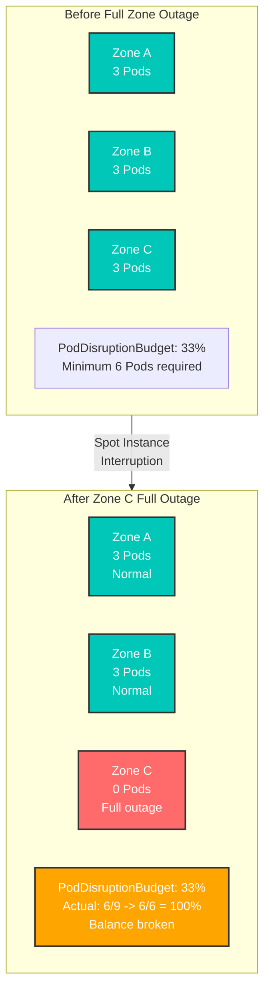
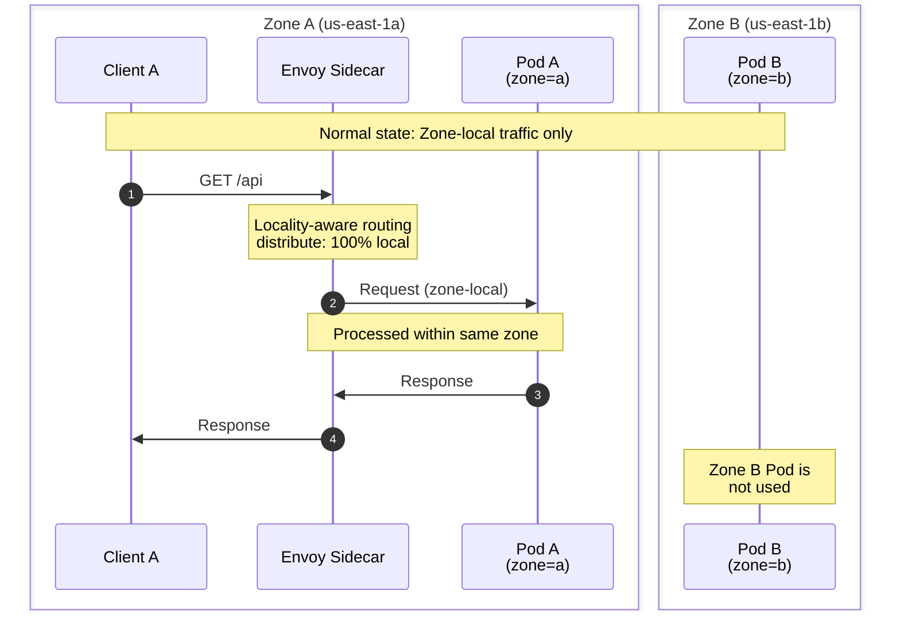
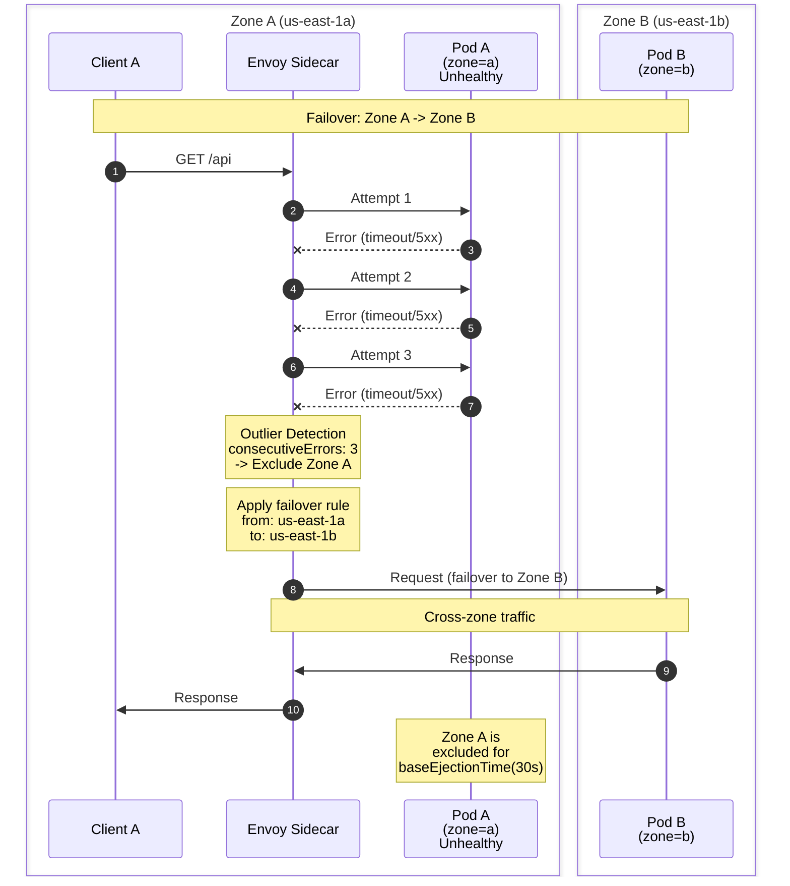
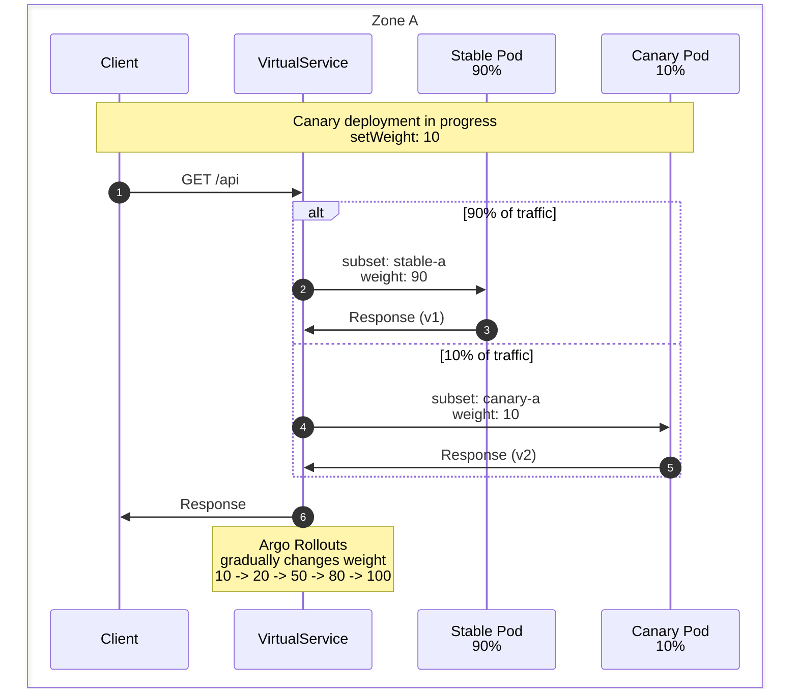

# Zone 対応 Argo Rollouts

> **サポート対象バージョン**: Istio 1.18+, Argo Rollouts 1.6+ **最終更新**: February 19, 2026 **難易度**: Expert

このドキュメントでは、Istio の locality-aware routing を活用して自動フェイルオーバーを実現しながら、AWS Availability Zone ごとに独立した Argo Rollouts Canary デプロイを設定する方法を説明します。

## 目次

1. [問題の定義](09-zone-aware-argo-rollouts.md#problem-definition)
2. [アーキテクチャの概要](09-zone-aware-argo-rollouts.md#architecture-overview)
3. [主要な設計判断](09-zone-aware-argo-rollouts.md#key-design-decisions)
4. [実装ガイド](09-zone-aware-argo-rollouts.md#implementation-guide)
5. [トラフィックフロー](09-zone-aware-argo-rollouts.md#traffic-flow)
6. [トラブルシューティング](09-zone-aware-argo-rollouts.md#troubleshooting)
7. [ベストプラクティス](09-zone-aware-argo-rollouts.md#best-practices)

## 問題の定義

### 実運用のユースケース: Spot Instance 環境における PDB 管理

**背景**: AWS Spot Instances を使用する環境では、特定の Availability Zone（Zone）にあるすべての Node が突然終了する可能性があります。

**問題のシナリオ**:



**Zone 固有の Rollout が必要な理由**

1. **Rollout ごとに独立した PDB 管理**
   * 各 Zone の Rollout が自身の PDB を管理します
   * Zone C が完全に消失しても、Zone A と B の PDB は影響を受けません
2. **Zone レベルの復旧**
   * Zone C が復旧した場合、影響を受けた Rollout のみが再起動します
   * 他の Zone のデプロイ状態には影響しません
3. **Spot Instance 中断への対応**
   * 特定の Zone のすべての Spot Instance が終了しても、他の Zone で Service を継続できます
   * Istio locality failover による自動トラフィック切り替え

**PDB 設定例**（Zone ごと）:

```yaml
# Zone A - PDB (Independent per Rollout)
apiVersion: policy/v1
kind: PodDisruptionBudget
metadata:
  name: test-a-pdb
  namespace: default
spec:
  minAvailable: 1  # Minimum 1 in Zone A
  selector:
    matchLabels:
      app: test
      zone: a
---
# Zone B - PDB
apiVersion: policy/v1
kind: PodDisruptionBudget
metadata:
  name: test-b-pdb
  namespace: default
spec:
  minAvailable: 1  # Minimum 1 in Zone B
  selector:
    matchLabels:
      app: test
      zone: b
---
# Zone C - PDB
apiVersion: policy/v1
kind: PodDisruptionBudget
metadata:
  name: test-c-pdb
  namespace: default
spec:
  minAvailable: 1  # Minimum 1 in Zone C
  selector:
    matchLabels:
      app: test
      zone: c
```

**利点**:

* Zone C が完全に停止している間も、Zone A と B の PDB は正常に動作します
* 各 Zone を独立して復旧できます
* Canary デプロイも Zone ごとに独立して進行します

### 要件

1. **独立した Zone デプロイ**: 3 つの Availability Zone（a、b、c）ごとに独立した Canary デプロイ
2. **Zone 分離**: デフォルトでは、各 Zone のトラフィックはその Zone 内でのみ処理する
3. **フェイルオーバーのみ**: 障害時にのみトラフィックを他の Zone へ切り替える（a->b、b->c、c->a）
4. **統一された呼び出し**: クライアントは単一の Service 名で呼び出す
5. **Spot Instance への対応**: Zone レベルの停止中でも Service の継続性を保証する

### よくある問題

**問題**: 複数の Argo Rollouts が同じ VirtualService を参照すると競合が発生します

```yaml
# Wrong approach: All Rollouts try to modify the same route
apiVersion: argoproj.io/v1alpha1
kind: Rollout
metadata:
  name: test-a
spec:
  strategy:
    canary:
      trafficRouting:
        istio:
          virtualService:
            name: test  # All zone Rollouts reference same VirtualService
            routes:
            - primary  # Trying to modify same route simultaneously -> Conflict!
```

**解決策**: Zone 固有の Route を使用して分離します

**重要**: Argo Rollouts は、指定された Route 名の **destinations 配列全体を管理します**。したがって、複数の Rollout が同じ Route 名を参照すると、各 Rollout が互いの設定を上書きします。subset の設定が異なる場合でも競合が発生します。

## アーキテクチャの概要

### 全体構成

```mermaid
flowchart TB
    subgraph Clients["Clients"]
        ClientA[Client A<br/>Zone: us-east-1a]
        ClientB[Client B<br/>Zone: us-east-1b]
        ClientC[Client C<br/>Zone: us-east-1c]
    end

    subgraph Istio["Istio Control Plane"]
        VS[VirtualService: test<br/>Single VirtualService]
        DR[DestinationRule: test<br/>locality-aware routing]
    end

    subgraph ZoneA["Zone A (us-east-1a)"]
        RolloutA[Rollout: test-a<br/>subset: stable-a/canary-a]
        StableA[Stable Pods<br/>label: zone=a]
        CanaryA[Canary Pods<br/>label: zone=a]
    end

    subgraph ZoneB["Zone B (us-east-1b)"]
        RolloutB[Rollout: test-b<br/>subset: stable-b/canary-b]
        StableB[Stable Pods<br/>label: zone=b]
        CanaryB[Canary Pods<br/>label: zone=b]
    end

    subgraph ZoneC["Zone C (us-east-1c)"]
        RolloutC[Rollout: test-c<br/>subset: stable-c/canary-c]
        StableC[Stable Pods<br/>label: zone=c]
        CanaryC[Canary Pods<br/>label: zone=c]
    end

    ClientA -->|test.default| VS
    ClientB -->|test.default| VS
    ClientC -->|test.default| VS

    VS -->|90% stable-a| StableA
    VS -->|10% canary-a| CanaryA
    VS -->|90% stable-b| StableB
    VS -->|10% canary-b| CanaryB
    VS -->|90% stable-c| StableC
    VS -->|10% canary-c| CanaryC

    DR -.->|localityLbSetting| VS

    RolloutA -.->|manages weights| VS
    RolloutB -.->|manages weights| VS
    RolloutC -.->|manages weights| VS

    classDef istio fill:#326CE5,stroke:#333,stroke-width:2px,color:white;
    classDef rollout fill:#E6522C,stroke:#333,stroke-width:2px,color:white;
    classDef pod fill:#00C7B7,stroke:#333,stroke-width:1px,color:white;
    classDef client fill:#f9f9f9,stroke:#333,stroke-width:1px,color:black;

    class VS,DR istio;
    class RolloutA,RolloutB,RolloutC rollout;
    class StableA,CanaryA,StableB,CanaryB,StableC,CanaryC pod;
    class ClientA,ClientB,ClientC client;
```



### 主要コンポーネント

1. **単一の VirtualService**: すべての Zone のトラフィックルーティングルールを定義します
2. **Zone 固有の Rollout**: 各 Zone で独立した Canary デプロイを管理します
3. **subset ベースの分離**: 各 Rollout は固有の subset ペア（stable-a/canary-a など）を管理します
4. **locality-aware DestinationRule**: Zone 内ルーティングとフェイルオーバーを自動化します

## 主要な設計判断

### 1. 単一の VirtualService + Zone 固有 Route の分離

**このアプローチが必要な理由**

Argo Rollouts は、指定された Route 名の destinations 配列全体を上書きして動作します。したがって、競合を避けるために **各 Zone の Rollout は独立した Route 名を管理する必要があります**:

```yaml
# VirtualService: Zone-specific routes defined in single VirtualService
http:
- name: zone-a-route  # Rollout A manages stable-a/canary-a for this route
  match:
  - sourceLabels:
      topology.istio.io/zone: us-east-1a
  route:
  - destination: {host: test, subset: stable-a}
    weight: 90
  - destination: {host: test, subset: canary-a}
    weight: 10

- name: zone-b-route  # Rollout B manages stable-b/canary-b for this route
  match:
  - sourceLabels:
      topology.istio.io/zone: us-east-1b
  route:
  - destination: {host: test, subset: stable-b}
    weight: 90
  - destination: {host: test, subset: canary-b}
    weight: 10
```

**基本原則**:

* 各 Rollout は **異なる Route 名**（`zone-a-route`、`zone-b-route`、`zone-c-route`）を参照します
* 各 Route は **sourceLabels match** により、その Zone からのトラフィックのみを処理します
* locality-aware routing は Zone 内の endpoint を自動的に優先します

### 2. locality-aware Routing

**デフォルトの動作**:

* Zone A のクライアント -> Zone A の Pod（100%）
* Zone B のクライアント -> Zone B の Pod（100%）
* Zone C のクライアント -> Zone C の Pod（100%）

**フェイルオーバー時**:

* Zone A の障害 -> Zone B へ自動切り替え
* Zone B の障害 -> Zone C へ自動切り替え
* Zone C の障害 -> Zone A へ自動切り替え

### 3. 統一された Service 呼び出し

クライアントは単一の DNS 名を使用します:

```bash
# Call like this
curl http://test.default.svc.cluster.local:8080

# Istio automatically routes to zone-local endpoint
```

## 実装ガイド

### 1. 共通 Service の作成

**重要**: `selector` に Zone label を含めないでください（すべての Zone の Pod を選択します）

```yaml
apiVersion: v1
kind: Service
metadata:
  name: test
  namespace: default
spec:
  selector:
    app: test  # No zone label - selects Pods from all zones
  ports:
  - name: http
    port: 8080
    targetPort: 8080
```

### 2. Zone 固有の Rollout Service

各 Rollout が管理する Stable/Canary Service:

```yaml
# Zone A - Stable Service
apiVersion: v1
kind: Service
metadata:
  name: test-stable-a
  namespace: default
spec:
  selector:
    app: test
    zone: a  # Selects only Zone A stable Pods
  ports:
  - name: http
    port: 8080
    targetPort: 8080
---
# Zone A - Canary Service
apiVersion: v1
kind: Service
metadata:
  name: test-canary-a
  namespace: default
spec:
  selector:
    app: test
    zone: a  # Selects only Zone A canary Pods
  ports:
  - name: http
    port: 8080
    targetPort: 8080
---
# Zone B - Stable Service
apiVersion: v1
kind: Service
metadata:
  name: test-stable-b
  namespace: default
spec:
  selector:
    app: test
    zone: b
  ports:
  - name: http
    port: 8080
    targetPort: 8080
---
# Zone B - Canary Service
apiVersion: v1
kind: Service
metadata:
  name: test-canary-b
  namespace: default
spec:
  selector:
    app: test
    zone: b
  ports:
  - name: http
    port: 8080
    targetPort: 8080
---
# Zone C - Stable Service
apiVersion: v1
kind: Service
metadata:
  name: test-stable-c
  namespace: default
spec:
  selector:
    app: test
    zone: c
  ports:
  - name: http
    port: 8080
    targetPort: 8080
---
# Zone C - Canary Service
apiVersion: v1
kind: Service
metadata:
  name: test-canary-c
  namespace: default
spec:
  selector:
    app: test
    zone: c
  ports:
  - name: http
    port: 8080
    targetPort: 8080
```

### 3. Zone 固有 Route を持つ単一の VirtualService

すべての Zone のトラフィックを処理する単一の VirtualService（Zone 固有 Route の分離）:

```yaml
apiVersion: networking.istio.io/v1
kind: VirtualService
metadata:
  name: test
  namespace: default
spec:
  hosts:
  - test
  - test.default.svc.cluster.local
  http:
  # Zone A route (Managed by Rollout A)
  - name: zone-a-route
    match:
    - sourceLabels:
        topology.kubernetes.io/zone: us-east-1a
    route:
    - destination:
        host: test
        subset: stable-a
      weight: 90
    - destination:
        host: test
        subset: canary-a
      weight: 10
  # Zone B route (Managed by Rollout B)
  - name: zone-b-route
    match:
    - sourceLabels:
        topology.kubernetes.io/zone: us-east-1b
    route:
    - destination:
        host: test
        subset: stable-b
      weight: 90
    - destination:
        host: test
        subset: canary-b
      weight: 10
  # Zone C route (Managed by Rollout C)
  - name: zone-c-route
    match:
    - sourceLabels:
        topology.kubernetes.io/zone: us-east-1c
    route:
    - destination:
        host: test
        subset: stable-c
      weight: 90
    - destination:
        host: test
        subset: canary-c
      weight: 10
```

**重要な変更点**:

* 以前: すべての Zone が同じ `primary` Route を共有 -> **競合が発生**
* 修正後: 各 Zone は独立した Route 名（`zone-a-route`、`zone-b-route`、`zone-c-route`）を使用
* 追加: `sourceLabels.topology.kubernetes.io/zone` match による Zone 固有のトラフィック分離

**動作の仕組み**:

1. Zone A の Pod からのリクエスト -> `zone-a-route` に match
2. Rollout A は `zone-a-route` の weight のみを変更します（他の Zone への影響なし）
3. locality-aware routing は Zone 内の endpoint を自動的に優先します

### 4. locality 設定を持つ DestinationRule

```yaml
apiVersion: networking.istio.io/v1
kind: DestinationRule
metadata:
  name: test
  namespace: default
spec:
  host: test
  trafficPolicy:
    loadBalancer:
      localityLbSetting:
        enabled: true
        # Each zone processes only local traffic by default
        distribute:
        - from: us-east-1/us-east-1a/*
          to:
            "us-east-1/us-east-1a/*": 100  # Zone A -> Zone A (100%)
        - from: us-east-1/us-east-1b/*
          to:
            "us-east-1/us-east-1b/*": 100  # Zone B -> Zone B (100%)
        - from: us-east-1/us-east-1c/*
          to:
            "us-east-1/us-east-1c/*": 100  # Zone C -> Zone C (100%)
        # Failover settings: a->b, b->c, c->a
        failover:
        - from: us-east-1/us-east-1a
          to: us-east-1/us-east-1b  # Zone A failure -> Zone B
        - from: us-east-1/us-east-1b
          to: us-east-1/us-east-1c  # Zone B failure -> Zone C
        - from: us-east-1/us-east-1c
          to: us-east-1/us-east-1a  # Zone C failure -> Zone A
    # Outlier Detection for fast failure detection
    outlierDetection:
      consecutiveErrors: 3        # 3 consecutive failures
      interval: 10s               # Check every 10 seconds
      baseEjectionTime: 30s       # Exclude for 30 seconds
      maxEjectionPercent: 100     # Up to 100% can be excluded
  # Define stable/canary subsets per zone
  subsets:
  # Zone A subsets
  - name: stable-a
    labels:
      app: test
      zone: a
  - name: canary-a
    labels:
      app: test
      zone: a
  # Zone B subsets
  - name: stable-b
    labels:
      app: test
      zone: b
  - name: canary-b
    labels:
      app: test
      zone: b
  # Zone C subsets
  - name: stable-c
    labels:
      app: test
      zone: c
  - name: canary-c
    labels:
      app: test
      zone: c
```

### 5. Zone 固有の Rollout 設定

#### Zone A Rollout

```yaml
apiVersion: argoproj.io/v1alpha1
kind: Rollout
metadata:
  name: test-a
  namespace: default
spec:
  replicas: 3
  selector:
    matchLabels:
      app: test
      zone: a
  template:
    metadata:
      labels:
        app: test
        zone: a
    spec:
      # Deploy Pods only to Zone A
      affinity:
        nodeAffinity:
          requiredDuringSchedulingIgnoredDuringExecution:
            nodeSelectorTerms:
            - matchExpressions:
              - key: topology.kubernetes.io/zone
                operator: In
                values:
                - us-east-1a
      containers:
      - name: app
        image: myapp:v1
        ports:
        - containerPort: 8080
        env:
        - name: ZONE
          value: "a"
  strategy:
    canary:
      # Zone A specific Services
      canaryService: test-canary-a
      stableService: test-stable-a
      trafficRouting:
        istio:
          virtualService:
            name: test              # Common VirtualService
            routes:
            - zone-a-route          # Zone A specific route
          destinationRule:
            name: test              # Common DestinationRule
            canarySubsetName: canary-a  # Zone A specific subset
            stableSubsetName: stable-a  # Zone A specific subset
      steps:
      - setWeight: 10
      - pause: {duration: 5m}
      - setWeight: 20
      - pause: {duration: 5m}
      - setWeight: 50
      - pause: {duration: 5m}
      - setWeight: 80
      - pause: {duration: 5m}
```

#### Zone B Rollout

```yaml
apiVersion: argoproj.io/v1alpha1
kind: Rollout
metadata:
  name: test-b
  namespace: default
spec:
  replicas: 3
  selector:
    matchLabels:
      app: test
      zone: b
  template:
    metadata:
      labels:
        app: test
        zone: b
    spec:
      # Deploy Pods only to Zone B
      affinity:
        nodeAffinity:
          requiredDuringSchedulingIgnoredDuringExecution:
            nodeSelectorTerms:
            - matchExpressions:
              - key: topology.kubernetes.io/zone
                operator: In
                values:
                - us-east-1b
      containers:
      - name: app
        image: myapp:v1
        ports:
        - containerPort: 8080
        env:
        - name: ZONE
          value: "b"
  strategy:
    canary:
      # Zone B specific Services
      canaryService: test-canary-b
      stableService: test-stable-b
      trafficRouting:
        istio:
          virtualService:
            name: test              # Common VirtualService
            routes:
            - zone-b-route          # Zone B specific route
          destinationRule:
            name: test              # Common DestinationRule
            canarySubsetName: canary-b  # Zone B specific subset
            stableSubsetName: stable-b  # Zone B specific subset
      steps:
      - setWeight: 10
      - pause: {duration: 5m}
      - setWeight: 20
      - pause: {duration: 5m}
      - setWeight: 50
      - pause: {duration: 5m}
      - setWeight: 80
      - pause: {duration: 5m}
```

#### Zone C Rollout

```yaml
apiVersion: argoproj.io/v1alpha1
kind: Rollout
metadata:
  name: test-c
  namespace: default
spec:
  replicas: 3
  selector:
    matchLabels:
      app: test
      zone: c
  template:
    metadata:
      labels:
        app: test
        zone: c
    spec:
      # Deploy Pods only to Zone C
      affinity:
        nodeAffinity:
          requiredDuringSchedulingIgnoredDuringExecution:
            nodeSelectorTerms:
            - matchExpressions:
              - key: topology.kubernetes.io/zone
                operator: In
                values:
                - us-east-1c
      containers:
      - name: app
        image: myapp:v1
        ports:
        - containerPort: 8080
        env:
        - name: ZONE
          value: "c"
  strategy:
    canary:
      # Zone C specific Services
      canaryService: test-canary-c
      stableService: test-stable-c
      trafficRouting:
        istio:
          virtualService:
            name: test              # Common VirtualService
            routes:
            - zone-c-route          # Zone C specific route
          destinationRule:
            name: test              # Common DestinationRule
            canarySubsetName: canary-c  # Zone C specific subset
            stableSubsetName: stable-c  # Zone C specific subset
      steps:
      - setWeight: 10
      - pause: {duration: 5m}
      - setWeight: 20
      - pause: {duration: 5m}
      - setWeight: 50
      - pause: {duration: 5m}
      - setWeight: 80
      - pause: {duration: 5m}
```

## トラフィックフロー

### 通常状態（Zone 内トラフィック）



### フェイルオーバーのシナリオ



### Canary デプロイ中のトラフィックフロー



## トラブルシューティング

### 1. VirtualService 競合エラー

**症状**:

```bash
Error: VirtualService update conflict
```

**原因**: 複数の Rollout が同時に同じ Route を変更しようとしている

**解決方法**:

```yaml
# Configure each Rollout to manage unique subsets
spec:
  strategy:
    canary:
      trafficRouting:
        istio:
          destinationRule:
            canarySubsetName: canary-a  # Different subset per Zone
            stableSubsetName: stable-a
```

### 2. クロス Zone トラフィックの発生

**症状**: フェイルオーバーなしでトラフィックが他の Zone に送信される

**原因**: `distribute` 設定が正しくない

**解決方法**:

```yaml
# Correct distribute settings
distribute:
- from: us-east-1/us-east-1a/*
  to:
    "us-east-1/us-east-1a/*": 100  # 100% local only
```

### 3. フェイルオーバーが機能しない

**症状**: Zone の障害中でも他の Zone へのフェイルオーバーが発生しない

**原因**: Outlier detection が無効、または設定が遅すぎる

**解決方法**:

```yaml
# Fast failure detection
outlierDetection:
  consecutiveErrors: 3      # Detect even after just 3 failures
  interval: 10s             # Check every 10 seconds
  baseEjectionTime: 30s     # Exclude for 30 seconds
```

### 4. Rollout が停止する

**症状**: Canary デプロイが進行しない

**確認**:

```bash
# Check Rollout status
kubectl argo rollouts get rollout test-a -n default

# Check VirtualService weights
kubectl get virtualservice test -n default -o yaml | grep weight

# Check DestinationRule subsets
kubectl get destinationrule test -n default -o yaml
```

### 5. デバッグコマンド

```bash
# 1. Verify Pods deployed to correct zones
kubectl get pods -l app=test -o wide
kubectl get nodes --show-labels | grep topology.kubernetes.io/zone

# 2. Verify locality routing configuration
istioctl proxy-config endpoint <pod-name> --cluster "outbound|8080||test.default.svc.cluster.local"

# 3. Verify VirtualService synchronization
istioctl proxy-config route <pod-name> --name 8080

# 4. Check outlier detection status
kubectl exec <pod-name> -c istio-proxy -- curl localhost:15000/clusters | grep outlier

# 5. Check Argo Rollouts logs
kubectl logs -n argo-rollouts deployment/argo-rollouts
```

## ベストプラクティス

### 1. Rollout の同期

**問題**: 複数の Zone Rollout を同時にデプロイすると複雑さが増します

**推奨**:

```bash
# Sequential deployment per Zone
kubectl argo rollouts promote test-a -n default
# Wait 5 minutes and monitor
kubectl argo rollouts promote test-b -n default
# Wait 5 minutes and monitor
kubectl argo rollouts promote test-c -n default
```

### 2. Canary 分析

Zone ごとに独立した分析を実行します:

```yaml
apiVersion: argoproj.io/v1alpha1
kind: AnalysisTemplate
metadata:
  name: success-rate-zone-a
spec:
  metrics:
  - name: success-rate
    interval: 1m
    successCondition: result[0] >= 0.95
    provider:
      prometheus:
        address: http://prometheus:9090
        query: |
          sum(rate(
            istio_requests_total{
              destination_service="test.default.svc.cluster.local",
              destination_workload_namespace="default",
              response_code=~"2..",
              destination_pod_label_zone="a"
            }[5m]
          )) /
          sum(rate(
            istio_requests_total{
              destination_service="test.default.svc.cluster.local",
              destination_workload_namespace="default",
              destination_pod_label_zone="a"
            }[5m]
          ))
```

### 3. 段階的な Rollout ステップ

```yaml
steps:
- setWeight: 5      # Start with very small traffic
- pause: {duration: 5m}
- analysis:
    templates:
    - templateName: success-rate-zone-a
- setWeight: 10
- pause: {duration: 5m}
- setWeight: 25
- pause: {duration: 10m}
- setWeight: 50
- pause: {duration: 10m}
- setWeight: 75
- pause: {duration: 10m}
```

### 4. 自動ロールバック

```yaml
spec:
  strategy:
    canary:
      analysis:
        templates:
        - templateName: success-rate-zone-a
        startingStep: 2  # Start analysis from second step
      trafficRouting:
        istio:
          virtualService:
            name: test
          destinationRule:
            name: test
            canarySubsetName: canary-a
            stableSubsetName: stable-a
```

### 5. モニタリングとアラート

**Prometheus アラート**:

```yaml
apiVersion: monitoring.coreos.com/v1
kind: PrometheusRule
metadata:
  name: zone-aware-rollout-alerts
spec:
  groups:
  - name: rollout
    rules:
    # Zone A Canary high failure rate
    - alert: HighErrorRateZoneA
      expr: |
        sum(rate(istio_requests_total{
          destination_service="test.default.svc.cluster.local",
          response_code=~"5..",
          destination_pod_label_zone="a"
        }[5m])) /
        sum(rate(istio_requests_total{
          destination_service="test.default.svc.cluster.local",
          destination_pod_label_zone="a"
        }[5m])) > 0.05
      for: 2m
      annotations:
        summary: "Zone A Canary has high error rate"

    # Cross-zone traffic occurring (unexpected)
    - alert: UnexpectedCrossZoneTraffic
      expr: |
        sum(rate(istio_requests_total{
          destination_service="test.default.svc.cluster.local",
          source_workload_zone="a",
          destination_pod_label_zone!="a"
        }[5m])) > 0
      for: 5m
      annotations:
        summary: "Unexpected cross-zone traffic from Zone A"
```

### 6. デプロイチェックリスト

* [ ] すべての Zone Node が ready である
* [ ] VirtualService にすべての subset が含まれている
* [ ] DestinationRule の locality 設定を確認済みである
* [ ] Outlier detection が有効である
* [ ] 各 Rollout が固有の subset を管理している
* [ ] Zone 固有の Service が定義されている
* [ ] Prometheus metrics の収集を確認済みである
* [ ] アラートルールを設定済みである

## パフォーマンスに関する考慮事項

### リソース要件

**Control Plane**:

* Istiod: CPU 500m、Memory 2GB（追加の VirtualService/DestinationRule による負荷）

**Data Plane**:

* Envoy Sidecar: CPU 100-500m、Memory 50-150MB（Zone 情報と locality routing のオーバーヘッド）

**Argo Rollouts Controller**:

* CPU 100m、Memory 128MB（3 つの Rollout を管理）

### ネットワークオーバーヘッド

* **Zone 内トラフィック**: 追加レイテンシー 1-2ms（Envoy オーバーヘッド）
* **クロス Zone トラフィック**（フェイルオーバー時）: 追加レイテンシー 5-10ms（Zone 間ネットワーク）

## 参照情報

### 関連ドキュメント

* [Argo Rollouts 統合](08-argo-rollouts.md)
* [Zone Aware Routing](../resilience/03-zone-aware-routing.md)
* [Outlier Detection](../resilience/01-outlier-detection.md)
* [DestinationRule](../traffic-management/03-destination-rule.md)

### 外部リンク

* [Istio Locality Load Balancing](https://istio.io/latest/docs/tasks/traffic-management/locality-load-balancing/)
* [Argo Rollouts Istio Integration](https://argoproj.github.io/argo-rollouts/features/traffic-management/istio/)
* [AWS Availability Zones](https://docs.aws.amazon.com/AWSEC2/latest/UserGuide/using-regions-availability-zones.html)

## 次のステップ

1. [Lab: Zone-aware Rollout の演習](https://github.com/Atom-oh/kubernetes-docs/blob/main/en/service-mesh/labs/zone-aware-rollout/README.md)
2. リージョン間フェイルオーバーを実装するために [Multi-cluster](02-multi-cluster.md) へ拡張する
3. 自動分析とロールバックについては [Progressive Delivery](https://github.com/Atom-oh/kubernetes-docs/blob/main/en/service-mesh/advanced/progressive-delivery.md) を参照する
