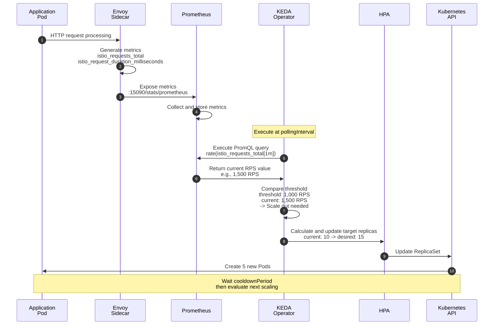
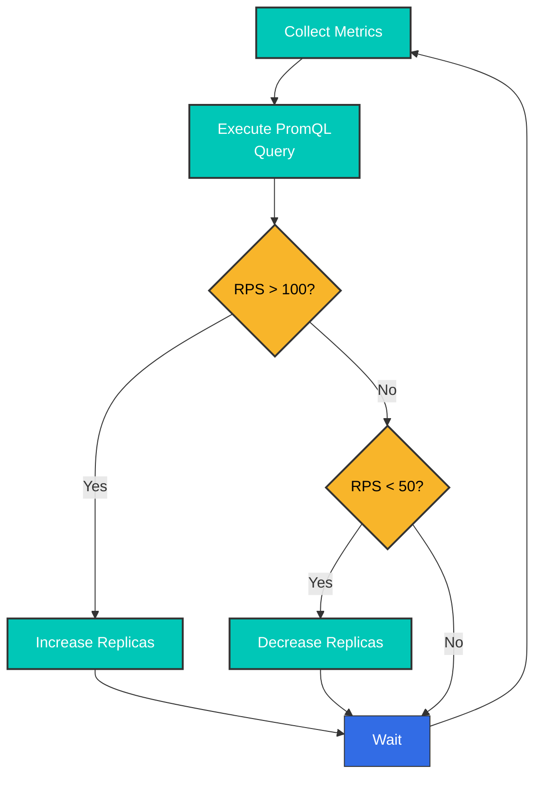
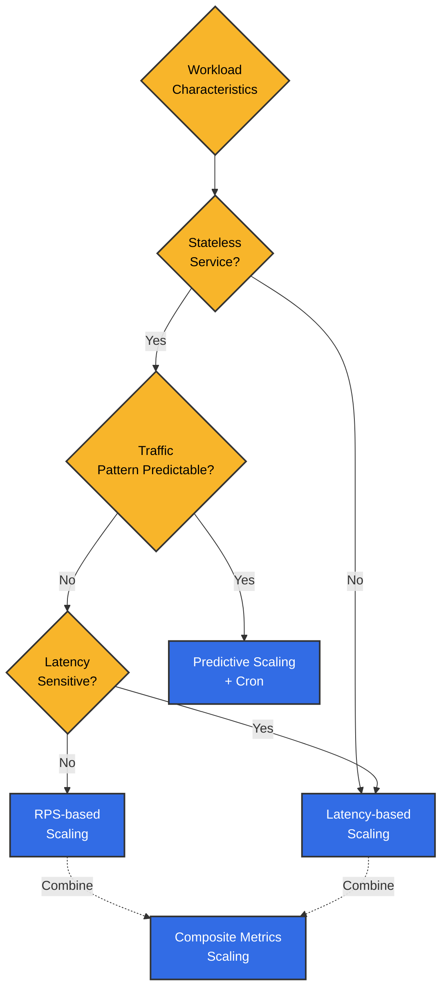

# Istio Metrics を使用した KEDA ベースの Autoscaling

> **サポート対象バージョン**: KEDA 2.18, Istio 1.28
> **最終更新**: February 19, 2026
> **Kubernetes 互換性**: 1.34

このドキュメントでは、**Istio metrics を使用した実践的な autoscaling 戦略**を扱います。KEDA を使用して Prometheus および CloudWatch metrics に基づいて workload をスケーリングするための、さまざまなパターンと実例を紹介します。

**学習目標**:
- Prometheus PromQL を使用した高度な scaling policy の作成
- CloudWatch metrics の統合と AWS service の組み合わせ
- RPS、Latency、error rate などのさまざまな metrics に基づく戦略
- Circuit Breaker と時間ベースの予測的 scaling
- 本番環境向けの安定化と monitoring

## 目次

1. [概要](#overview)
2. [アーキテクチャ](#architecture)
3. [Prometheus Metrics ベースの Scaling](#prometheus-metrics-based-scaling)
4. [CloudWatch Metrics ベースの Scaling](#cloudwatch-metrics-based-scaling)
5. [実践的な Scaling 戦略](#practical-scaling-strategies)
6. [ベストプラクティス](#best-practices)
7. [トラブルシューティング](#troubleshooting)
8. [リファレンス: KEDA Installation](#reference-keda-installation)

## 概要

このドキュメントでは、**Istio metrics を使用した実践的な autoscaling 戦略**に焦点を当てます。KEDA は Kubernetes HPA を拡張し、Prometheus および CloudWatch からの複雑な metric query に基づく scaling を可能にします。

### コア Istio Metrics

scaling に使用される Istio Envoy proxy が提供する metrics:

| Metric | 説明 | Scaling での用途 |
|--------|------|---------------|
| **istio_requests_total** | リクエスト総数 | RPS ベースの scaling |
| **istio_request_duration_milliseconds** | リクエスト Latency | Latency ベースの scaling |
| **istio_tcp_connections_opened_total** | TCP connection 数 | connection ベースの scaling |
| **istio_request_bytes_sum** | リクエスト bytes | throughput ベースの scaling |
| **envoy_cluster_upstream_rq_pending_overflow** | Circuit Breaker overflow | 過負荷の検出 |

### KEDA を使用する理由

標準 Kubernetes HPA と比較した KEDA の利点:

| 機能 | Kubernetes HPA | KEDA |
|------|---------------|------|
| **Metric Sources** | CPU/Memory + Custom Metrics API | 60 以上の Scaler を直接サポート |
| **PromQL Queries** | Custom Metrics Adapter が必要 | ネイティブサポート |
| **CloudWatch Integration** | 不可 | 直接 query |
| **Scale to Zero** | 最小 1 | 0 まで可能 |
| **Multiple Metrics** | 制限あり | 複数 trigger の組み合わせ |
| **Cron Schedule** | 非対応 | 時間ベースの scaling |

**このドキュメントの焦点**: KEDA Installation ではなく、**Prometheus および CloudWatch metrics を使用した実践的な scaling パターンと戦略**に焦点を当てます。

### 主な Scaling 戦略

このドキュメントで扱う実践的な scaling パターン:

| 戦略 | 主な Metric | 適したシナリオ | 主な利点 |
|------|----------|----------------|----------|
| **RPS ベース** | `istio_requests_total` | API server、web service | 直感的、実装が簡単 |
| **Latency ベース** | P50/P95/P99 Latency | Payment、orders - Latency に敏感な service | user experience の保証 |
| **Error rate ベース** | 5xx response 比率 | 高可用性が必須の service | 障害への迅速な対応 |
| **Composite Metrics** | RPS + Latency + Error | 本番 service | 安定した正確な scaling |
| **Circuit Breaker ベース** | overflow、connection pool | 外部 dependency が多い service | cascading failure の防止 |
| **時間ベースの予測** | Cron + metrics | 予測可能な traffic パターン | cost optimization、プロアクティブな対応 |

## アーキテクチャ

### Metrics ベースの Scaling フロー



### ScaledObject の基本構造

KEDA の中核は **ScaledObject** CRD です。Prometheus または CloudWatch metrics に基づいて HPA を自動的に作成・管理します:

```yaml
apiVersion: keda.sh/v1alpha1
kind: ScaledObject
metadata:
  name: my-app-scaler
  namespace: default
spec:
  # Scale target
  scaleTargetRef:
    name: my-app           # Deployment name
    kind: Deployment

  # Scaling policy
  pollingInterval: 30      # Check metrics every 30 seconds
  cooldownPeriod: 300      # Wait 5 minutes after scale down
  minReplicaCount: 2       # Minimum Pod count
  maxReplicaCount: 20      # Maximum Pod count

  # Metric triggers
  triggers:
  - type: prometheus       # or aws-cloudwatch
    metadata:
      serverAddress: http://prometheus.istio-system.svc:9090
      query: |             # PromQL query
        sum(rate(istio_requests_total{
          destination_workload="my-app"
        }[1m]))
      threshold: '1000'    # Threshold: 1000 RPS
```

## Prometheus Metrics ベースの Scaling

### 1. RPS（Requests Per Second）ベースの Scaling

#### ScaledObject の定義

```yaml
apiVersion: keda.sh/v1alpha1
kind: ScaledObject
metadata:
  name: reviews-rps-scaler
  namespace: default
spec:
  scaleTargetRef:
    name: reviews
    kind: Deployment

  # Scaling policy
  pollingInterval: 30  # Check metrics every 30 seconds
  cooldownPeriod: 300  # Wait 5 minutes after scale down
  minReplicaCount: 2   # Minimum replicas
  maxReplicaCount: 20  # Maximum replicas

  triggers:
  - type: prometheus
    metadata:
      serverAddress: http://prometheus.istio-system.svc:9090
      query: |
        sum(rate(istio_requests_total{
          destination_workload="reviews",
          destination_workload_namespace="default",
          response_code=~"2.*"
        }[1m]))
      threshold: '100'  # Scale out above 100 RPS
      activationThreshold: '50'  # Activate above 50 RPS
```

#### 動作の仕組み



### 2. Latency ベースの Scaling

#### P95 Latency による Scaling

```yaml
apiVersion: keda.sh/v1alpha1
kind: ScaledObject
metadata:
  name: reviews-latency-scaler
  namespace: default
spec:
  scaleTargetRef:
    name: reviews
    kind: Deployment

  pollingInterval: 30
  cooldownPeriod: 300
  minReplicaCount: 2
  maxReplicaCount: 20

  triggers:
  - type: prometheus
    metadata:
      serverAddress: http://prometheus.istio-system.svc:9090
      # P95 latency (95th percentile)
      query: |
        histogram_quantile(0.95,
          sum(rate(istio_request_duration_milliseconds_bucket{
            destination_workload="reviews",
            destination_workload_namespace="default"
          }[2m])) by (le)
        )
      threshold: '200'  # Scale out above 200ms
      activationThreshold: '100'
```

#### P50 と P99 を組み合わせた Scaling

```yaml
apiVersion: keda.sh/v1alpha1
kind: ScaledObject
metadata:
  name: reviews-multi-latency-scaler
  namespace: default
spec:
  scaleTargetRef:
    name: reviews
    kind: Deployment

  pollingInterval: 30
  cooldownPeriod: 300
  minReplicaCount: 2
  maxReplicaCount: 20

  # Scale when any trigger exceeds threshold
  triggers:
  # P50 latency
  - type: prometheus
    metadata:
      serverAddress: http://prometheus.istio-system.svc:9090
      query: |
        histogram_quantile(0.50,
          sum(rate(istio_request_duration_milliseconds_bucket{
            destination_workload="reviews",
            destination_workload_namespace="default"
          }[2m])) by (le)
        )
      threshold: '50'  # P50 > 50ms

  # P95 latency
  - type: prometheus
    metadata:
      serverAddress: http://prometheus.istio-system.svc:9090
      query: |
        histogram_quantile(0.95,
          sum(rate(istio_request_duration_milliseconds_bucket{
            destination_workload="reviews",
            destination_workload_namespace="default"
          }[2m])) by (le)
        )
      threshold: '200'  # P95 > 200ms

  # P99 latency (extreme cases)
  - type: prometheus
    metadata:
      serverAddress: http://prometheus.istio-system.svc:9090
      query: |
        histogram_quantile(0.99,
          sum(rate(istio_request_duration_milliseconds_bucket{
            destination_workload="reviews",
            destination_workload_namespace="default"
          }[2m])) by (le)
        )
      threshold: '500'  # P99 > 500ms
```

### 3. Success Rate ベースの Scaling

負荷を分散するため、error rate が高い場合に scale out します:

```yaml
apiVersion: keda.sh/v1alpha1
kind: ScaledObject
metadata:
  name: reviews-error-rate-scaler
  namespace: default
spec:
  scaleTargetRef:
    name: reviews
    kind: Deployment

  pollingInterval: 30
  cooldownPeriod: 300
  minReplicaCount: 2
  maxReplicaCount: 20

  triggers:
  # Scale out when error rate exceeds 5%
  - type: prometheus
    metadata:
      serverAddress: http://prometheus.istio-system.svc:9090
      query: |
        (
          sum(rate(istio_requests_total{
            destination_workload="reviews",
            response_code=~"5.*"
          }[2m]))
          /
          sum(rate(istio_requests_total{
            destination_workload="reviews"
          }[2m]))
        ) * 100
      threshold: '5'  # 5% error rate
      activationThreshold: '2'
```

### 4. Composite Metrics Scaling

RPS と Latency の両方を考慮します:

```yaml
apiVersion: keda.sh/v1alpha1
kind: ScaledObject
metadata:
  name: reviews-composite-scaler
  namespace: default
spec:
  scaleTargetRef:
    name: reviews
    kind: Deployment

  pollingInterval: 30
  cooldownPeriod: 300
  minReplicaCount: 2
  maxReplicaCount: 20

  # Advanced scaling behavior
  advanced:
    horizontalPodAutoscalerConfig:
      behavior:
        scaleDown:
          stabilizationWindowSeconds: 300  # 5 minute stabilization
          policies:
          - type: Percent
            value: 10  # Maximum 10% decrease
            periodSeconds: 60
        scaleUp:
          stabilizationWindowSeconds: 0  # Immediate scale out
          policies:
          - type: Percent
            value: 50  # Maximum 50% increase
            periodSeconds: 60
          - type: Pods
            value: 5  # Maximum 5 pods at once
            periodSeconds: 60
          selectPolicy: Max  # Select larger value

  triggers:
  # RPS-based
  - type: prometheus
    metricType: AverageValue
    metadata:
      serverAddress: http://prometheus.istio-system.svc:9090
      query: |
        sum(rate(istio_requests_total{
          destination_workload="reviews",
          destination_workload_namespace="default"
        }[1m])) / count(kube_pod_info{pod=~"reviews-.*"})
      threshold: '50'  # 50 RPS per Pod

  # P95 Latency-based
  - type: prometheus
    metricType: Value
    metadata:
      serverAddress: http://prometheus.istio-system.svc:9090
      query: |
        histogram_quantile(0.95,
          sum(rate(istio_request_duration_milliseconds_bucket{
            destination_workload="reviews"
          }[2m])) by (le)
        )
      threshold: '200'  # P95 > 200ms
```

## CloudWatch Metrics ベースの Scaling

### 概要

CloudWatch は Prometheus より**応答時間が遅く**（1～3 分の遅延）、AWS native service との統合および**長期保持**に適しています。

**利用シナリオ**:
- AWS service metrics（ALB、RDS、SQS など）との組み合わせ
- 長期トレンド分析と cost optimization
- multi-region 環境での集中 monitoring
- real-time scaling には非推奨（Prometheus を使用）

> **前提条件**: Istio metrics を CloudWatch に送信する必要があります。ADOT Collector のセットアップについては、[リファレンス: KEDA Installation](#reference-keda-installation) セクションを参照してください。

### CloudWatch Metrics による Scaling

#### RPS ベースの Scaling

```yaml
apiVersion: keda.sh/v1alpha1
kind: ScaledObject
metadata:
  name: reviews-cloudwatch-rps
  namespace: default
spec:
  scaleTargetRef:
    name: reviews
    kind: Deployment

  pollingInterval: 60  # 1 minute interval recommended for CloudWatch
  cooldownPeriod: 300
  minReplicaCount: 2
  maxReplicaCount: 20

  triggers:
  - type: aws-cloudwatch
    metadata:
      namespace: IstioMetrics
      metricName: IstioRequestsTotal
      dimensionName: destination_workload
      dimensionValue: reviews
      targetMetricValue: '1000'  # 1000 requests/minute
      minMetricValue: '100'

      # Statistics type
      metricStatPeriod: '60'  # 1 minute
      metricStat: Sum

      # AWS region
      awsRegion: us-west-2

      # Use IRSA
      identityOwner: operator
```

#### Latency ベースの Scaling

```yaml
apiVersion: keda.sh/v1alpha1
kind: ScaledObject
metadata:
  name: reviews-cloudwatch-latency
  namespace: default
spec:
  scaleTargetRef:
    name: reviews
    kind: Deployment

  pollingInterval: 60
  cooldownPeriod: 300
  minReplicaCount: 2
  maxReplicaCount: 20

  triggers:
  - type: aws-cloudwatch
    metadata:
      namespace: IstioMetrics
      metricName: IstioRequestDuration
      dimensionName: destination_workload
      dimensionValue: reviews

      # P95 latency (calculated in CloudWatch)
      targetMetricValue: '200'  # 200ms
      minMetricValue: '50'

      metricStatPeriod: '60'
      metricStat: 'p95'  # 95th percentile

      awsRegion: us-west-2
      identityOwner: operator
```

## 実践的な Scaling 戦略

### 戦略 1: Traffic パターンベースの予測的 Scaling

時間ベースの traffic パターンを考慮した事前 scaling:

```yaml
apiVersion: keda.sh/v1alpha1
kind: ScaledObject
metadata:
  name: frontend-predictive-scaler
  namespace: default
spec:
  scaleTargetRef:
    name: frontend
    kind: Deployment

  pollingInterval: 30
  cooldownPeriod: 300
  minReplicaCount: 2
  maxReplicaCount: 50

  # Advanced HPA behavior settings
  advanced:
    horizontalPodAutoscalerConfig:
      behavior:
        scaleDown:
          stabilizationWindowSeconds: 600  # 10 minute stabilization
          policies:
          - type: Percent
            value: 10
            periodSeconds: 120  # 10% decrease every 2 minutes
        scaleUp:
          stabilizationWindowSeconds: 0
          policies:
          - type: Percent
            value: 100  # Can double at once
            periodSeconds: 30
          - type: Pods
            value: 10  # Maximum 10 pods at once
            periodSeconds: 30
          selectPolicy: Max

  triggers:
  # RPS-based
  - type: prometheus
    metadata:
      serverAddress: http://prometheus.istio-system.svc:9090
      query: |
        sum(rate(istio_requests_total{
          destination_workload="frontend"
        }[1m])) / scalar(count(up{job="frontend"}))
      threshold: '100'  # 100 RPS per Pod

  # P95 latency
  - type: prometheus
    metadata:
      serverAddress: http://prometheus.istio-system.svc:9090
      query: |
        histogram_quantile(0.95,
          sum(rate(istio_request_duration_milliseconds_bucket{
            destination_workload="frontend"
          }[2m])) by (le)
        )
      threshold: '300'

  # Cron-based pre-scaling (peak hours)
  - type: cron
    metadata:
      timezone: Asia/Seoul
      start: 0 9 * * 1-5  # Weekdays 9 AM
      end: 0 18 * * 1-5   # Weekdays 6 PM
      desiredReplicas: '20'  # Minimum 20 during peak hours
```

### 戦略 2: Circuit Breaker 状態ベースの Scaling

Circuit が開いた場合に自動的に scale out します:

```yaml
apiVersion: keda.sh/v1alpha1
kind: ScaledObject
metadata:
  name: backend-circuit-breaker-scaler
  namespace: default
spec:
  scaleTargetRef:
    name: backend
    kind: Deployment

  pollingInterval: 15  # Circuit Breaker needs fast response
  cooldownPeriod: 180
  minReplicaCount: 3
  maxReplicaCount: 30

  triggers:
  # Circuit Breaker Overflow detection
  - type: prometheus
    metadata:
      serverAddress: http://prometheus.istio-system.svc:9090
      query: |
        sum(increase(envoy_cluster_upstream_rq_pending_overflow{
          cluster_name=~"outbound.*backend.*"
        }[1m]))
      threshold: '10'  # 10+ overflows per minute
      activationThreshold: '5'

  # Upstream connection pool saturation
  - type: prometheus
    metadata:
      serverAddress: http://prometheus.istio-system.svc:9090
      query: |
        sum(envoy_cluster_upstream_cx_active{
          cluster_name=~"outbound.*backend.*"
        })
        /
        sum(envoy_cluster_circuit_breakers_default_cx_open{
          cluster_name=~"outbound.*backend.*"
        }) * 100
      threshold: '80'  # Connection pool 80%+ usage
```

### 戦略 3: Tiered Scaling

負荷レベルに応じて異なる scaling 速度を適用します:

```yaml
apiVersion: keda.sh/v1alpha1
kind: ScaledObject
metadata:
  name: payment-tiered-scaler
  namespace: default
spec:
  scaleTargetRef:
    name: payment-service
    kind: Deployment

  pollingInterval: 30
  cooldownPeriod: 300
  minReplicaCount: 3
  maxReplicaCount: 50

  advanced:
    horizontalPodAutoscalerConfig:
      behavior:
        scaleUp:
          policies:
          # Low load (< 150% threshold): slow increase
          - type: Percent
            value: 20
            periodSeconds: 120
          # Medium load (150-200%): fast increase
          - type: Percent
            value: 50
            periodSeconds: 60
          # High load (> 200%): very fast increase
          - type: Pods
            value: 10
            periodSeconds: 30
          selectPolicy: Max

        scaleDown:
          policies:
          - type: Percent
            value: 5  # Slow decrease (5% at a time)
            periodSeconds: 180  # Every 3 minutes

  triggers:
  - type: prometheus
    metadata:
      serverAddress: http://prometheus.istio-system.svc:9090
      query: |
        sum(rate(istio_requests_total{
          destination_workload="payment-service",
          response_code=~"2.*"
        }[1m]))
      threshold: '500'  # 500 RPS
```

### 戦略 4: Cost 最適化 Scaling

business hours と営業時間外を区別します:

```yaml
apiVersion: keda.sh/v1alpha1
kind: ScaledObject
metadata:
  name: analytics-cost-optimized-scaler
  namespace: default
spec:
  scaleTargetRef:
    name: analytics-service
    kind: Deployment

  pollingInterval: 60
  cooldownPeriod: 600  # Longer wait for cost optimization
  minReplicaCount: 1
  maxReplicaCount: 30

  triggers:
  # Business hours (09:00-18:00): aggressive scaling
  - type: prometheus
    metadata:
      serverAddress: http://prometheus.istio-system.svc:9090
      query: |
        (
          sum(rate(istio_requests_total{
            destination_workload="analytics-service"
          }[2m]))
          and
          (hour() >= 9 and hour() < 18)
        )
      threshold: '50'
      activationThreshold: '20'

  # Off-hours: Allow Scale to Zero
  - type: cron
    metadata:
      timezone: Asia/Seoul
      start: 0 18 * * *  # 6 PM
      end: 0 9 * * *     # 9 AM
      desiredReplicas: '0'  # Scale to Zero
```

### 戦略 5: Gateway Metrics ベースの Scaling

Istio Gateway の負荷を監視して backend をスケーリングします:

```yaml
apiVersion: keda.sh/v1alpha1
kind: ScaledObject
metadata:
  name: backend-gateway-based-scaler
  namespace: default
spec:
  scaleTargetRef:
    name: backend
    kind: Deployment

  pollingInterval: 30
  cooldownPeriod: 300
  minReplicaCount: 2
  maxReplicaCount: 40

  triggers:
  # Monitor incoming traffic through Gateway
  - type: prometheus
    metadata:
      serverAddress: http://prometheus.istio-system.svc:9090
      query: |
        sum(rate(istio_requests_total{
          source_workload="istio-ingressgateway",
          destination_service="backend.default.svc.cluster.local"
        }[1m]))
      threshold: '1000'

  # Gateway pending connection count
  - type: prometheus
    metadata:
      serverAddress: http://prometheus.istio-system.svc:9090
      query: |
        sum(envoy_http_downstream_rq_active{
          app="istio-ingressgateway"
        })
      threshold: '500'  # 500+ concurrent requests
```

## ベストプラクティス

### 1. Metric 選択ガイド



**推奨 Metrics**:

| Workload Type | 主な Metric | 補助 Metric | 理由 |
|-------------|----------|-----------|------|
| **API Server** | RPS | P95 Latency | リクエスト数は直接的な負荷指標 |
| **Web Server** | RPS | Error rate | concurrent connection よりリクエスト数が重要 |
| **Data Processing** | P95 Latency | CPU/Memory | 処理時間は負荷指標 |
| **Streaming** | TCP connections | Throughput | connection 数が resource 消費の鍵 |
| **Batch Jobs** | Queue length | Processing time | 保留中の作業数が scaling 基準 |

### 2. Threshold 設定ガイド

```yaml
# Process for finding appropriate thresholds

# Step 1: Measure current workload
# Normal RPS
kubectl exec -it prometheus-xxx -n istio-system -- promtool query instant \
  'sum(rate(istio_requests_total{destination_workload="reviews"}[5m]))'

# Peak time RPS
# Normal: ~500 RPS
# Peak: ~2000 RPS

# Step 2: Measure per-Pod processing capacity
# Run load test
kubectl run load-test --image=fortio/fortio -- load -c 50 -qps 0 -t 60s http://reviews:9080

# Result: Maintains P95 < 100ms up to about 200 RPS per Pod

# Step 3: Calculate threshold
# Target P95: 100ms
# Per-Pod capacity: 200 RPS
# Safety margin: 70% (140 RPS/pod)
# -> threshold: '140'

# Step 4: Write ScaledObject
apiVersion: keda.sh/v1alpha1
kind: ScaledObject
metadata:
  name: reviews-optimized-scaler
spec:
  scaleTargetRef:
    name: reviews
  minReplicaCount: 3  # Normal 500 RPS / 140 = 3.5 -> 4
  maxReplicaCount: 20  # Peak 2000 RPS / 140 = 14.2 -> 20 (with margin)
  triggers:
  - type: prometheus
    metadata:
      query: |
        sum(rate(istio_requests_total{destination_workload="reviews"}[1m]))
        / count(kube_pod_info{pod=~"reviews-.*"})
      threshold: '140'  # 140 RPS per Pod
```

### 3. Scaling 速度の調整

```yaml
apiVersion: keda.sh/v1alpha1
kind: ScaledObject
metadata:
  name: balanced-scaler
  namespace: default
spec:
  scaleTargetRef:
    name: myapp
    kind: Deployment

  pollingInterval: 30
  cooldownPeriod: 300
  minReplicaCount: 2
  maxReplicaCount: 50

  advanced:
    horizontalPodAutoscalerConfig:
      behavior:
        # Scale down: conservative (service stability first)
        scaleDown:
          stabilizationWindowSeconds: 600  # 10 minute observation
          policies:
          - type: Percent
            value: 10  # 10% decrease
            periodSeconds: 180  # Every 3 minutes
          - type: Pods
            value: 2  # Or maximum 2 at a time
            periodSeconds: 180
          selectPolicy: Min  # Select more conservative value

        # Scale up: aggressive (fast response)
        scaleUp:
          stabilizationWindowSeconds: 0  # Immediate
          policies:
          - type: Percent
            value: 100  # Up to 2x increase
            periodSeconds: 30
          - type: Pods
            value: 10  # Or 10 at a time
            periodSeconds: 30
          selectPolicy: Max  # Select more aggressive value

  triggers:
  - type: prometheus
    metadata:
      serverAddress: http://prometheus.istio-system.svc:9090
      query: sum(rate(istio_requests_total{destination_workload="myapp"}[1m]))
      threshold: '1000'
```

### 4. Multi-cluster 環境の Scaling

```yaml
# Cluster 1: Primary traffic handling
apiVersion: keda.sh/v1alpha1
kind: ScaledObject
metadata:
  name: frontend-cluster1-scaler
  namespace: default
spec:
  scaleTargetRef:
    name: frontend
  minReplicaCount: 5
  maxReplicaCount: 30

  triggers:
  - type: prometheus
    metadata:
      serverAddress: http://prometheus.istio-system.svc:9090
      # 60% of global traffic handled by this cluster
      query: |
        sum(rate(istio_requests_total{
          destination_workload="frontend",
          source_cluster="cluster1"
        }[1m])) * 0.6
      threshold: '600'
---
# Cluster 2: Secondary traffic handling
apiVersion: keda.sh/v1alpha1
kind: ScaledObject
metadata:
  name: frontend-cluster2-scaler
  namespace: default
spec:
  scaleTargetRef:
    name: frontend
  minReplicaCount: 3
  maxReplicaCount: 20

  triggers:
  - type: prometheus
    metadata:
      serverAddress: http://prometheus.istio-system.svc:9090
      # 40% of global traffic
      query: |
        sum(rate(istio_requests_total{
          destination_workload="frontend",
          source_cluster="cluster2"
        }[1m])) * 0.4
      threshold: '400'
```

## ベストプラクティス

### 1. Metric 収集の最適化

```yaml
# Adjust Prometheus scrape interval
apiVersion: v1
kind: ConfigMap
metadata:
  name: prometheus
  namespace: istio-system
data:
  prometheus.yml: |
    global:
      scrape_interval: 15s  # Default 15 seconds
      evaluation_interval: 15s

    scrape_configs:
    # Collect Istio metrics more frequently
    - job_name: 'istio-mesh'
      scrape_interval: 10s  # 10 seconds
      kubernetes_sd_configs:
      - role: endpoints
        namespaces:
          names:
          - default
          - production
      relabel_configs:
      - source_labels: [__meta_kubernetes_pod_annotation_prometheus_io_scrape]
        action: keep
        regex: true
```

### 2. Scaling の安定性を確保する

```yaml
apiVersion: keda.sh/v1alpha1
kind: ScaledObject
metadata:
  name: stable-scaler
  namespace: default
spec:
  scaleTargetRef:
    name: myapp

  # 1. Appropriate polling interval
  pollingInterval: 30  # Too short is unstable, too long is slow

  # 2. Sufficient cooldown
  cooldownPeriod: 300  # 5 minutes is generally appropriate

  # 3. Safe min/max values
  minReplicaCount: 2  # 0 is risky, recommend minimum 2
  maxReplicaCount: 20  # 70% or less of cluster capacity

  advanced:
    horizontalPodAutoscalerConfig:
      behavior:
        scaleDown:
          # 4. Long stabilization window
          stabilizationWindowSeconds: 600
          policies:
          - type: Percent
            value: 10
            periodSeconds: 120
```

### 3. Monitoring と Alerting

```yaml
apiVersion: monitoring.coreos.com/v1
kind: PrometheusRule
metadata:
  name: keda-scaling-alerts
  namespace: keda
spec:
  groups:
  - name: keda-scaling
    interval: 30s
    rules:
    # Reached maximum replicas
    - alert: KEDAMaxReplicasReached
      expr: |
        kube_horizontalpodautoscaler_status_current_replicas
        >= kube_horizontalpodautoscaler_spec_max_replicas
      for: 5m
      labels:
        severity: warning
      annotations:
        summary: "KEDA scaled to maximum replicas"
        description: "{{ $labels.horizontalpodautoscaler }} has reached max replicas ({{ $value }})"

    # Scaling failed
    - alert: KEDAScalingFailed
      expr: |
        increase(keda_scaler_errors_total[5m]) > 0
      labels:
        severity: critical
      annotations:
        summary: "KEDA scaling failed"
        description: "KEDA scaler {{ $labels.scaledObject }} has errors"

    # Frequent scaling (Flapping)
    - alert: KEDAFlapping
      expr: |
        rate(keda_scaler_active[10m]) > 0.1
      for: 10m
      labels:
        severity: warning
      annotations:
        summary: "KEDA is flapping"
        description: "ScaledObject {{ $labels.scaledObject }} is scaling too frequently"
```

### 4. Resource Limit の設定

```yaml
apiVersion: apps/v1
kind: Deployment
metadata:
  name: reviews
  namespace: default
spec:
  replicas: 3
  template:
    spec:
      containers:
      - name: reviews
        image: istio/examples-bookinfo-reviews-v1:1.17.0

        # Resource requests/limits (important for scaling calculation)
        resources:
          requests:
            cpu: 100m
            memory: 128Mi
          limits:
            cpu: 200m
            memory: 256Mi

        # Readiness Probe (safety during scale out)
        readinessProbe:
          httpGet:
            path: /health
            port: 9080
          initialDelaySeconds: 10
          periodSeconds: 5
          timeoutSeconds: 3
          successThreshold: 1
          failureThreshold: 3

        # Liveness Probe
        livenessProbe:
          httpGet:
            path: /health
            port: 9080
          initialDelaySeconds: 30
          periodSeconds: 10
```

## トラブルシューティング

### 1. KEDA が Metrics を取得しない

**症状**:
```bash
kubectl get scaledobject -n default
# STATUS: Unknown
```

**根本原因の分析**:

```bash
# 1. Check KEDA Operator logs
kubectl logs -n keda -l app=keda-operator

# 2. Check ScaledObject status
kubectl describe scaledobject reviews-rps-scaler -n default

# 3. Test Prometheus connectivity
kubectl run curl-test --image=curlimages/curl -it --rm -- \
  curl -s http://prometheus.istio-system.svc:9090/api/v1/query \
  --data-urlencode 'query=up'
```

**解決方法**:

1. **Prometheus address を確認する**:
```bash
# Check Prometheus Service
kubectl get svc -n istio-system | grep prometheus

# Use correct address in ScaledObject
serverAddress: http://prometheus.istio-system.svc:9090
```

2. **PromQL query をテストする**:
```bash
# Test query directly in Prometheus UI
kubectl port-forward -n istio-system svc/prometheus 9090:9090

# Browser: http://localhost:9090
# Enter query and verify results
```

### 2. Scaling が遅すぎる

**症状**: traffic spike 時に scale out が遅延する

**解決方法**:

```yaml
apiVersion: keda.sh/v1alpha1
kind: ScaledObject
metadata:
  name: fast-scaler
spec:
  # 1. Reduce polling interval
  pollingInterval: 15  # 30s -> 15s

  # 2. Remove scale up stabilization window
  advanced:
    horizontalPodAutoscalerConfig:
      behavior:
        scaleUp:
          stabilizationWindowSeconds: 0  # React immediately
          policies:
          - type: Pods
            value: 5  # 5 at a time
            periodSeconds: 30

  # 3. Lower activation threshold
  triggers:
  - type: prometheus
    metadata:
      query: sum(rate(istio_requests_total{...}[1m]))
      threshold: '100'
      activationThreshold: '30'  # Low threshold for early activation
```

### 3. Flapping（不安定な Scaling）

**症状**: Pod 数が繰り返し増減し続ける

**原因**: threshold が敏感すぎる、または安定化期間が不十分

**解決方法**:

```yaml
apiVersion: keda.sh/v1alpha1
kind: ScaledObject
metadata:
  name: stable-scaler
spec:
  # 1. Longer cooldown
  cooldownPeriod: 600  # 10 minutes

  # 2. Longer PromQL evaluation period
  triggers:
  - type: prometheus
    metadata:
      query: |
        sum(rate(istio_requests_total{...}[5m]))  # 1m -> 5m
      threshold: '100'

  # 3. Conservative scale down
  advanced:
    horizontalPodAutoscalerConfig:
      behavior:
        scaleDown:
          stabilizationWindowSeconds: 600
          policies:
          - type: Percent
            value: 5  # Only 5% decrease
            periodSeconds: 180
```

### 4. CloudWatch Latency

**症状**: CloudWatch metrics が real-time ではない（1～3 分の遅延）

**解決方法**:

```yaml
# Use Prometheus primarily, CloudWatch as secondary
apiVersion: keda.sh/v1alpha1
kind: ScaledObject
metadata:
  name: hybrid-metrics-scaler
spec:
  triggers:
  # Primary metric: Prometheus (real-time)
  - type: prometheus
    metadata:
      serverAddress: http://prometheus.istio-system.svc:9090
      query: sum(rate(istio_requests_total{...}[1m]))
      threshold: '1000'

  # Secondary metric: CloudWatch (trend analysis)
  - type: aws-cloudwatch
    metadata:
      namespace: IstioMetrics
      metricName: IstioRequestsTotal
      targetMetricValue: '5000'  # Higher threshold
      metricStatPeriod: '300'  # 5 minute aggregation
```

## 実践例

### 例 1: E-commerce Payment Service

Latency が重要な service:

```yaml
apiVersion: keda.sh/v1alpha1
kind: ScaledObject
metadata:
  name: payment-service-scaler
  namespace: production
spec:
  scaleTargetRef:
    name: payment-service
    kind: Deployment

  pollingInterval: 15  # Fast response
  cooldownPeriod: 180  # 3 minute cooldown
  minReplicaCount: 5   # Always maintain 5+
  maxReplicaCount: 50

  advanced:
    horizontalPodAutoscalerConfig:
      behavior:
        scaleUp:
          stabilizationWindowSeconds: 0
          policies:
          - type: Percent
            value: 100  # Fast 2x
            periodSeconds: 30
        scaleDown:
          stabilizationWindowSeconds: 900  # 15 minute stabilization
          policies:
          - type: Percent
            value: 5
            periodSeconds: 300  # 5% every 5 minutes

  triggers:
  # P50 latency (normal case)
  - type: prometheus
    metadata:
      serverAddress: http://prometheus.istio-system.svc:9090
      query: |
        histogram_quantile(0.50,
          sum(rate(istio_request_duration_milliseconds_bucket{
            destination_workload="payment-service",
            destination_workload_namespace="production"
          }[1m])) by (le)
        )
      threshold: '50'  # P50 > 50ms
      activationThreshold: '30'

  # P95 latency (quality guarantee)
  - type: prometheus
    metadata:
      serverAddress: http://prometheus.istio-system.svc:9090
      query: |
        histogram_quantile(0.95,
          sum(rate(istio_request_duration_milliseconds_bucket{
            destination_workload="payment-service",
            destination_workload_namespace="production"
          }[1m])) by (le)
        )
      threshold: '200'  # P95 > 200ms

  # Error rate (emergency scale out above 5%)
  - type: prometheus
    metadata:
      serverAddress: http://prometheus.istio-system.svc:9090
      query: |
        (
          sum(rate(istio_requests_total{
            destination_workload="payment-service",
            response_code=~"5.*"
          }[1m]))
          /
          sum(rate(istio_requests_total{
            destination_workload="payment-service"
          }[1m]))
        ) * 100
      threshold: '5'
```

### 例 2: Data Processing Service

batch processing および queue ベースの scaling:

```yaml
apiVersion: keda.sh/v1alpha1
kind: ScaledObject
metadata:
  name: data-processor-scaler
  namespace: default
spec:
  scaleTargetRef:
    name: data-processor
    kind: Deployment

  pollingInterval: 60  # Batch allows slow response
  cooldownPeriod: 600  # 10 minute cooldown
  minReplicaCount: 0   # Allow Scale to Zero
  maxReplicaCount: 30

  triggers:
  # SQS queue length (primary metric)
  - type: aws-sqs-queue
    metadata:
      queueURL: https://sqs.us-west-2.amazonaws.com/123456789/data-processing-queue
      queueLength: '10'  # Activate when 10+ in queue
      awsRegion: us-west-2
      identityOwner: operator

  # Istio processing time (secondary metric)
  - type: prometheus
    metadata:
      serverAddress: http://prometheus.istio-system.svc:9090
      query: |
        histogram_quantile(0.95,
          sum(rate(istio_request_duration_milliseconds_bucket{
            destination_workload="data-processor"
          }[5m])) by (le)
        )
      threshold: '5000'  # Scale out when taking 5+ seconds
```

### 例 3: Multi-region Global Service

Latency に基づく region 固有の scaling:

```yaml
# US Region
apiVersion: keda.sh/v1alpha1
kind: ScaledObject
metadata:
  name: api-us-scaler
  namespace: default
  labels:
    region: us-east-1
spec:
  scaleTargetRef:
    name: api-service
  minReplicaCount: 3
  maxReplicaCount: 30

  triggers:
  - type: prometheus
    metadata:
      serverAddress: http://prometheus.istio-system.svc:9090
      # Aggregate only US user traffic
      query: |
        sum(rate(istio_requests_total{
          destination_workload="api-service",
          source_canonical_service=~".*-us-.*"
        }[1m]))
      threshold: '500'

  - type: prometheus
    metadata:
      serverAddress: http://prometheus.istio-system.svc:9090
      # US region P95 latency
      query: |
        histogram_quantile(0.95,
          sum(rate(istio_request_duration_milliseconds_bucket{
            destination_workload="api-service",
            destination_region="us-east-1"
          }[2m])) by (le)
        )
      threshold: '100'  # US users target 100ms
---
# EU Region
apiVersion: keda.sh/v1alpha1
kind: ScaledObject
metadata:
  name: api-eu-scaler
  namespace: default
  labels:
    region: eu-west-1
spec:
  scaleTargetRef:
    name: api-service
  minReplicaCount: 2
  maxReplicaCount: 20

  triggers:
  - type: prometheus
    metadata:
      serverAddress: http://prometheus.istio-system.svc:9090
      query: |
        sum(rate(istio_requests_total{
          destination_workload="api-service",
          source_canonical_service=~".*-eu-.*"
        }[1m]))
      threshold: '300'

  - type: prometheus
    metadata:
      serverAddress: http://prometheus.istio-system.svc:9090
      query: |
        histogram_quantile(0.95,
          sum(rate(istio_request_duration_milliseconds_bucket{
            destination_workload="api-service",
            destination_region="eu-west-1"
          }[2m])) by (le)
        )
      threshold: '150'  # EU allows 150ms
```

## リファレンス: KEDA Installation

> **注記**: このセクションは、初めて KEDA を Installation する場合にのみ必要です。すでに Installation 済みの場合は、[Prometheus Metrics ベースの Scaling](#prometheus-metrics-based-scaling) から始めてください。

### Helm で Installation

```bash
# Add KEDA Helm repository
helm repo add kedacore https://kedacore.github.io/charts
helm repo update

# Install KEDA
helm install keda kedacore/keda \
  --namespace keda \
  --create-namespace \
  --set prometheus.metricServer.enabled=true \
  --set prometheus.metricServer.port=9022 \
  --set operator.replicaCount=2

# Verify installation
kubectl get pods -n keda
# Output:
# NAME                                      READY   STATUS
# keda-operator-xxxxx                       1/1     Running
# keda-operator-metrics-apiserver-xxxxx     1/1     Running
```

### AWS IRSA セットアップ（CloudWatch 用）

CloudWatch metrics を使用する場合に KEDA Operator に必要な IAM permissions:

```bash
# IRSA setup
eksctl create iamserviceaccount \
  --name keda-operator \
  --namespace keda \
  --cluster my-cluster \
  --attach-policy-arn arn:aws:iam::aws:policy/CloudWatchReadOnlyAccess \
  --approve \
  --override-existing-serviceaccounts

# Verify ServiceAccount
kubectl get sa keda-operator -n keda -o yaml | grep eks.amazonaws.com/role-arn
```

### CloudWatch Metrics 送信セットアップ（任意）

CloudWatch metrics ベースの scaling を使用するには、ADOT Collector 経由で Istio metrics を送信する必要があります:

#### ステップ 1: ADOT Collector を Installation する

```yaml
apiVersion: opentelemetry.io/v1alpha1
kind: OpenTelemetryCollector
metadata:
  name: istio-metrics-collector
  namespace: istio-system
spec:
  mode: deployment
  serviceAccount: adot-collector
  config: |
    receivers:
      prometheus:
        config:
          scrape_configs:
          - job_name: 'istio-mesh'
            scrape_interval: 60s  # 1 minute recommended for CloudWatch
            kubernetes_sd_configs:
            - role: endpoints
              namespaces:
                names:
                - default
            relabel_configs:
            - source_labels: [__meta_kubernetes_pod_annotation_prometheus_io_scrape]
              action: keep
              regex: true

    processors:
      batch:
        timeout: 60s
      metricstransform:
        transforms:
        - include: istio_requests_total
          action: update
          new_name: IstioRequestsTotal
        - include: istio_request_duration_milliseconds
          action: update
          new_name: IstioRequestDuration

    exporters:
      awsemf:
        namespace: IstioMetrics
        region: us-west-2
        dimension_rollup_option: NoDimensionRollup
        metric_declarations:
        - dimensions: [[destination_workload, destination_workload_namespace]]
          metric_name_selectors:
          - IstioRequestsTotal
          - IstioRequestDuration

    service:
      pipelines:
        metrics:
          receivers: [prometheus]
          processors: [batch, metricstransform]
          exporters: [awsemf]
```

#### ステップ 2: IRSA セットアップ

```bash
# Create IRSA policy
cat > adot-cloudwatch-policy.json <<EOF
{
  "Version": "2012-10-17",
  "Statement": [
    {
      "Effect": "Allow",
      "Action": ["cloudwatch:PutMetricData"],
      "Resource": "*",
      "Condition": {
        "StringEquals": {
          "cloudwatch:namespace": "IstioMetrics"
        }
      }
    }
  ]
}
EOF

aws iam create-policy \
  --policy-name ADOTCollectorCloudWatchPolicy \
  --policy-document file://adot-cloudwatch-policy.json

eksctl create iamserviceaccount \
  --name adot-collector \
  --namespace istio-system \
  --cluster my-cluster \
  --attach-policy-arn arn:aws:iam::${ACCOUNT_ID}:policy/ADOTCollectorCloudWatchPolicy \
  --approve
```

**Installation 後**、[Prometheus Metrics ベースの Scaling](#prometheus-metrics-based-scaling) または [CloudWatch Metrics ベースの Scaling](#cloudwatch-metrics-based-scaling) セクションに戻ってください。

---

## リファレンス

### 公式ドキュメント

- [KEDA 公式ドキュメント](https://keda.sh/docs/)
- [KEDA Prometheus Scaler](https://keda.sh/docs/scalers/prometheus/)
- [KEDA AWS CloudWatch Scaler](https://keda.sh/docs/scalers/aws-cloudwatch/)
- [Istio Metrics](https://istio.io/latest/docs/reference/config/metrics/)

### 関連ドキュメント

- [Observability](../observability/README.md) - Prometheus と metrics 収集
- [Resilience](../resilience/README.md) - Circuit Breaker と resilience
- [Traffic Management](../traffic-management/README.md) - Istio traffic management

## まとめ

### Metric Source 選択ガイド

| Metric Source | 利点 | 欠点 | 推奨用途 |
|------------|------|------|----------|
| **Prometheus** | - Real-time 応答（15～30s）<br>- 強力な PromQL query<br>- cluster 内通信 | - 長期保持の cost<br>- cluster dependency | Real-time scaling、ほとんどの workload |
| **CloudWatch** | - AWS service 統合<br>- 長期保持<br>- multi-region サポート | - 1～3 分の遅延<br>- cost（metric 数に比例） | トレンド分析、AWS service の組み合わせ |

### Scaling 戦略選択ガイド

| Workload Type | 主な Metric | 補助 Metric | 推奨設定 |
|-------------|----------|-----------|----------|
| **API Server** | RPS（Pod ごと） | P95 Latency | `pollingInterval: 30`, `cooldownPeriod: 300` |
| **Payment/Orders** | P50/P95 Latency | Error rate | `pollingInterval: 15`、高速な scale out |
| **Data Processing** | Queue length、P95 Latency | CPU/Memory | `pollingInterval: 60`、Scale to Zero を許可 |
| **Web Frontend** | RPS、P95 Latency | Gateway metrics | Cron ベースの事前 scaling |
| **Microservices** | RPS、Circuit Breaker | Error rate | Tiered scaling policy |

### 本番環境チェックリスト

scaling policy を本番環境に適用する前に確認する項目:

- [ ] **Threshold の検証**: load test を通じて適切な threshold 値を検証する
- [ ] **Stabilization 設定**: 十分な `stabilizationWindowSeconds` を設定する（scale down には最低 300 秒）
- [ ] **Resource limits**: Pod の `requests` と `limits` を明確に定義する
- [ ] **Health Check**: Readiness/Liveness Probe を設定する
- [ ] **Monitoring**: `KEDAMaxReplicasReached`、`KEDAScalingFailed` alert を設定する
- [ ] **Flapping 防止**: 長い PromQL 評価期間（`[5m]`）と保守的な scale down
- [ ] **Min/Max 値**: `maxReplicaCount` を cluster capacity の 70% 以下に設定する
- [ ] **Fallback**: Prometheus 障害時の CPU/Memory ベース HPA backup

### 推奨開始パス

```
Step 1: Implement RPS-based scaling
   └─> Start with single metric, adjust thresholds

Step 2: Add Latency metrics
   └─> Monitor and scale on P95 latency

Step 3: Composite metrics strategy
   └─> Ensure stability with RPS + Latency combination

Step 4: Apply advanced strategies
   └─> Add Circuit Breaker, Cron, error rate, etc.
```

**コア原則**:
- Prometheus による real-time 応答
- composite metrics による安定性の確保
- 保守的な scale down、積極的な scale out
- 継続的な monitoring と threshold 調整
