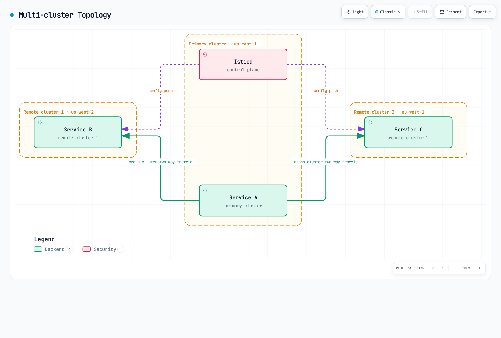
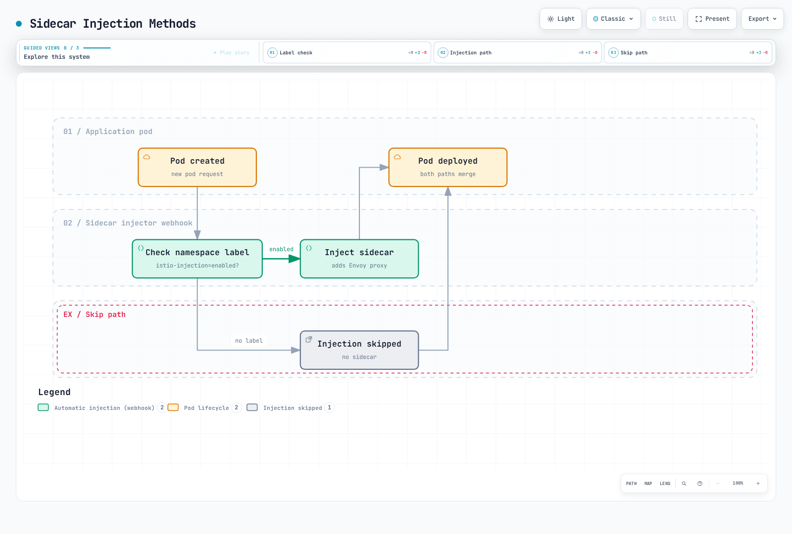

# 高度な機能

> **最終更新**: September 11, 2026 · Istio1.31。独立した例は指定ワークロード、Service、コントローラーが存在する前提です。導入/互換性と検証は各詳細章に従ってください。断片は本番テスト済みスタックではありません。

Ambientモード、マルチクラスター、EnvoyFilter、gRPC/WebSocket対応など、Istioの高度な機能を扱います。

## 目次

1. [Ambientモード](01-ambient-mode.md)
2. [マルチクラスター](02-multi-cluster.md)
3. [EnvoyFilter](03-envoy-filter.md)
4. [DNSキャッシュ](04-dns-cache.md)
5. [gRPC](05-grpc.md)
6. [WebSocket](06-websocket.md)
7. [サイドカー注入](07-sidecar-injection.md)
8. [Argo Rollouts統合](08-argo-rollouts.md)
9. [ゾーン対応Argo Rollouts](09-zone-aware-argo-rollouts.md)
10. [KEDA自動スケーリング](10-keda-autoscaling.md)

## 概要

本番環境に必要なIstioの高度な機能と詳細トピックを扱います。

### 主なトピック

デプロイモード、プロトコルルーティング、カスタマイズ、ロールアウト制御、自動スケーリングは関連しますが別の選択です。EnvoyFilterはRust製ztunnelを設定せず、Argo Rollouts向けIstioルーティングは本質的にアプリへのサイドカー注入に依存するわけではありません。

## 1. Ambientモード

AmbientはIstio1.18で初めてalphaとして同梱され、1.24でGAになりました。ノードレベルL4セキュアオーバーレイと、任意waypointによるL7処理を分離します。

### サイドカーモードとAmbientモード

| 特性 | サイドカーモード | Ambientモード |
|----------------|-------------|--------------|
| **アーキテクチャ** | 各PodにEnvoy注入 | ノードztunnel + 任意waypoint |
| **リソースモデル** | PodごとのEnvoy割り当て | 共有ztunnelとwaypoint割り当て。総使用量を測定 |
| **参加** | 注入は通常新Pod作成が必要 | 必要CNI/ztunnelを伴うラベル参加。waypoint参加は別 |
| **性能** | プロキシ/ワークロード設定次第 | 経路、waypoint使用、容量次第。常に速いわけではない |
| **機能** | 成熟L4/L7機能 | デフォルトL4。L7にwaypointが必要。版別対応を確認 |

### Ambientアーキテクチャ


[🔍 インタラクティブな図を見る](https://www.atomai.click/kubernetes-docs/archmaps/en-service-mesh-istio-advanced-readme-1.html)

図は概念的です。waypointを使うにはリソースの参加が必要で、設定範囲の通信が経由します。ztunnelがHTTP要求を検査し、要求ごとにL7の必要性を決めるわけではありません。

**詳細**: [Ambientモード詳細ガイド](01-ambient-mode.md)

## 2. マルチクラスター

複数Kubernetesクラスターを単一メッシュとして接続します。

### マルチクラスタートポロジー



[🔍 インタラクティブな図を見る](https://www.atomai.click/kubernetes-docs/archmaps/en-service-mesh-istio-advanced-readme-2.html)

**用途**:
- マルチリージョンデプロイ
- 災害復旧（DR）
- クラスターのブルー/グリーンデプロイ
- 選択環境を意図的に接続。分離にはID/ネットワーク/認可境界が必要

図は接続を前提としたprimary/remote構成です。マルチプライマリは別構成で、異なるネットワークには適切なEast-West Gateway/ルーティングと信頼が必要です。接続だけではDRも環境分離も提供されません。

**詳細**: [マルチクラスター設定ガイド](02-multi-cluster.md)

## 3. EnvoyFilter

Envoyプロキシ設定を直接カスタマイズします。

### EnvoyFilterの用途

要件を表せるならVirtualService headers、AuthorizationPolicy、WasmPluginなど対応APIを優先します。このLua例は版に依存するサイドカー拡張で、汎用ambient設定や認証システムではありません。


```yaml
apiVersion: networking.istio.io/v1alpha3
kind: EnvoyFilter
metadata:
  name: custom-header
  namespace: default
spec:
  workloadSelector:
    labels:
      app: myapp
  configPatches:
  - applyTo: HTTP_FILTER
    match:
      context: SIDECAR_OUTBOUND
      listener:
        filterChain:
          filter:
            name: envoy.filters.network.http_connection_manager
            subFilter:
              name: envoy.filters.http.router
    patch:
      operation: INSERT_BEFORE
      value:
        name: envoy.filters.http.lua
        typed_config:
          '@type': type.googleapis.com/envoy.extensions.filters.http.lua.v3.Lua
          default_source_code:
            inline_string: "function envoy_on_request(request_handle)\n  request_handle:headers():replace(\"x-custom-header\", \"value\")\nend\n"
```

**主な用途**:
- レート制限
- カスタム認証/認可
- ヘッダー操作
- 要求/応答変換
- WASMプラグイン

**詳細**: [EnvoyFilterガイド](03-envoy-filter.md)

## 4. DNSキャッシュ

Istio DNSプロキシはアプリDNSクエリを捕捉し、メッシュ/サービスエントリへローカル応答できます。DestinationRule接続プールはDNSキャッシュを有効にしません。このPodテンプレート断片をマージし、新しいサイドカーPodを作成します。

```yaml
spec:
  template:
    metadata:
      annotations:
        proxy.istio.io/config: "proxyMetadata:\n  ISTIO_META_DNS_CAPTURE: \"true\"\n"
```

**利点**:
- DNS検索遅延の削減
- 外部DNSサーバー負荷の削減
- 検出/TTL/更新動作に従うレジストリ認識の応答

サイドカーDNS捕捉は任意有効化、ambientは1.25からデフォルトでDNSプロキシを有効にします。捕捉、レジストリアドレス割り当て、上流DNS更新は別動作です。キャッシュは永久に同一のDNS回答や全外部検索の排除を約束しません。

**詳細**: [DNSキャッシュガイド](04-dns-cache.md)

## 5. gRPC対応

gRPCはHTTP/2ルーティングを使います。例は名前付きgRPCポート9090を持つ`grpc-service`と、`version: v2`の準備済みPodを前提とします。RPCは本質的に冪等とは限らないため、ここではメッシュ再試行を明示無効にします。クライアントには引き続き期限/コンテキスト伝播が必要です。

```yaml
apiVersion: networking.istio.io/v1
kind: VirtualService
metadata:
  name: grpc-service
  namespace: default
spec:
  hosts:
  - grpc-service
  http:
  - match:
    - uri:
        prefix: /mypackage.MyService/
    route:
    - destination:
        host: grpc-service
        subset: v2
        port:
          number: 9090
    retries:
      attempts: 0
  - route:
    - destination:
        host: grpc-service
        port:
          number: 9090
    retries:
      attempts: 0
---
apiVersion: networking.istio.io/v1
kind: DestinationRule
metadata:
  name: grpc-service
  namespace: default
spec:
  host: grpc-service
  subsets:
  - name: v2
    labels:
      version: v2
```

**主な機能**:
- HTTP/2ベース負荷分散
- 明示設定時のアプリヘルスプロトコル/Kubernetesプローブ
- 期限と再試行
- メタデータベースルーティング

**詳細**: [gRPCガイド](05-grpc.md)

## 6. WebSocket対応

IstioはHTTP WebSocketアップグレードをサポートします。例は`default`の`ws.example.com`向け既存`my-gateway`と、`/ws`を提供するHTTP8080 backend Serviceを前提とします。大文字小文字を区別する厳密なUpgradeヘッダー一致は不要です。

```yaml
apiVersion: networking.istio.io/v1
kind: VirtualService
metadata:
  name: websocket-service
  namespace: default
spec:
  hosts:
  - ws.example.com
  http:
  - match:
    - uri:
        prefix: /ws
    route:
    - destination:
        host: websocket-service
        port:
          number: 8080
    retries:
      attempts: 0
  gateways:
  - my-gateway
```

**主な機能**:
- 長時間接続の維持
- 接続プール設定
- アイドルタイムアウト管理

例はIstioでデフォルト無効のHTTPルートタイムアウトを省略します。全LB/プロキシ/アプリのアイドル/最大期間制限まで無効になるわけではありません。ロールアウト時の接続ドレインと再接続を計画します。

**詳細**: [WebSocketガイド](06-websocket.md)

## 7. サイドカー注入

サイドカープロキシ注入の仕組みとカスタマイズを扱います。

### 注入方法



[🔍 インタラクティブな図を見る](https://www.atomai.click/kubernetes-docs/archmaps/en-service-mesh-istio-advanced-readme-3.html)

図は単純な名前空間ラベル分岐だけです。実注入はPodラベル、revision/Webhookセレクター、除外、選択サイドカーライフサイクルにも依存します。名前空間ラベル変更で稼働済みPodに注入されません。

**詳細**: [サイドカー注入ガイド](07-sidecar-injection.md)

## 8. Argo Rollouts統合

以下はセレクター、Podテンプレート、コンテナを持つ完全Rolloutの**strategy断片**です。コントローラー、stable/canary Service、一致宛先を持つVirtualService `primary`ルートも必要です。分析/自動ロールバックには独自AnalysisTemplateとポリシーが必要で、ステップだけではメトリクス分析は設定されません。意図したIstioルーティング経路の通信だけがこの重みに従います。

```yaml
spec:
  strategy:
    canary:
      trafficRouting:
        istio:
          virtualService:
            name: myapp-vsvc
            routes:
            - primary
      steps:
      - setWeight: 10
      - pause:
          duration: 2m
      - setWeight: 50
      - pause:
          duration: 2m
      stableService: myapp-stable
      canaryService: myapp-canary
```

**主な機能**:
- メトリクスベースの自動カナリアデプロイ
- 分析と自動ロールバック
- ブルー/グリーンデプロイ
- 段階的デリバリー

**詳細**: [Argo Rollouts統合ガイド](08-argo-rollouts.md)

## 9. ゾーン対応Argo Rollouts

AZごとにゾーンを考慮したカナリアデプロイを行います。

**詳細**: [ゾーン対応Argo Rolloutsガイド](09-zone-aware-argo-rollouts.md)

## 10. KEDA自動スケーリング

KEDAでIstioメトリクスベースの自動スケーリングを実装します。

### KEDAとHPA

| 項目 | Kubernetes HPA | KEDA |
|---|---|---|
|メトリクス入力|resource/custom/external metrics API|ScalerがbackendメトリクスをHPAへ公開|
|スケーリング役割|通常minReplicas1でレプリカ調整|有効化/無効化と1→N用の管理HPA|
|外部メトリクス|external-metricsアダプターが必要|メトリクスAPIアダプターを提供|
|クエリロジック|数値メトリクスを消費|Scalerに応じてPromQLやCloudWatch metric/math/Metrics Insightsクエリ|

Metrics Serverはリソースメトリクスを提供し、汎用外部アダプターではありません。KEDA2.20はKubernetes≥1.30が必要です。版、API、プラットフォーム対応をIstioと独立して確認します。ゼロへの縮小にはゼロでも観測可能なシグナルと実行可能な起動経路も必要です。CloudWatch Metrics InsightsとCloudWatch Logs Insightsは別です。

### KEDAアーキテクチャ


[🔍 インタラクティブな図を見る](https://www.atomai.click/kubernetes-docs/archmaps/en-service-mesh-istio-advanced-readme-4.html)

### 主なスケーリング戦略

このKEDA2.20 API例は`default`の既存`reviews` Deployment、収集済みdestination-workloadメトリクス、アクセス可能な非公開Prometheusを前提とします。backend向けの対応認証/TLSを設定します。集約値を1つ返し、レプリカあたり100要求/sのAverageValueを使います。


```yaml
apiVersion: keda.sh/v1alpha1
kind: ScaledObject
metadata:
  name: reviews-rps-scaler
  namespace: default
spec:
  scaleTargetRef:
    name: reviews
  triggers:
  - type: prometheus
    metadata:
      query: sum(rate(istio_requests_total{reporter="destination",destination_workload="reviews",destination_workload_namespace="default"}[1m]))
      threshold: '100'
      serverAddress: http://prometheus.istio-system.svc.cluster.local:9090
      ignoreNullValues: 'false'
    metricType: AverageValue
  minReplicaCount: 1
  maxReplicaCount: 10
```

対象に稼働Podがないとdestination通信メトリクスが消えるため、最小は1のままです。例はゼロから自力起動できません。`ignoreNullValues: false`は空結果をエラーとし、失われたテレメトリーを暗黙にゼロとしません。同一ワークロードに競合HPAを付けないでください。遅延/エラー比率やブレーカーゲージは本質的にレプリカ容量へ比例しません。任意スケーリング信号として加えず制御動作を検証します。

**スケーリングメトリクス**:
- **RPS（毎秒要求数）**: 毎秒要求数に基づく
- **レイテンシー（P50/P95/P99）**: 遅延パーセンタイルに基づく
- **エラー率**: 5xxエラー率に基づく
- **サーキットブレーカー**: ブレーカー状態に基づく
- **複合メトリクス**: 複数メトリクスの組み合わせ

**メトリクスソース**:
- **Prometheus**: リアルタイムIstio/Envoyメトリクス
- **AWS CloudWatch**: ADOT Collector経由のCloudWatchメトリクス

**詳細**: [KEDA自動スケーリングガイド](10-keda-autoscaling.md)

## 学習順序

1. **[Ambientモード](01-ambient-mode.md)** - 新アーキテクチャの理解
2. **[マルチクラスター](02-multi-cluster.md)** - マルチクラスター設定
3. **[EnvoyFilter](03-envoy-filter.md)** - 高度なカスタマイズ
4. **[サイドカー注入](07-sidecar-injection.md)** - 注入の仕組み
5. **[gRPC](05-grpc.md)** - gRPCプロトコル対応
6. **[WebSocket](06-websocket.md)** - WebSocket対応
7. **[DNSキャッシュ](04-dns-cache.md)** - 性能最適化
8. **[Argo Rollouts](08-argo-rollouts.md)** - 段階的デリバリー
9. **[ゾーン対応Argo Rollouts](09-zone-aware-argo-rollouts.md)** - ゾーン別デプロイ
10. **[KEDA自動スケーリング](10-keda-autoscaling.md)** - メトリクスベース自動スケーリング

## 参考資料

- [Istioの高度な機能](https://istio.io/latest/docs/ops/)
- [Ambientモード文書](https://istio.io/latest/docs/ambient/overview/)
- [マルチクラスター文書](https://istio.io/latest/docs/setup/install/multicluster/)
- [EnvoyFilterリファレンス](https://istio.io/latest/docs/reference/config/networking/envoy-filter/)

## クイズ

この章の学習内容を確認するには、[Istio高度な機能クイズ](../../../quizzes/service-mesh/istio/advanced.md)に挑戦してください。
