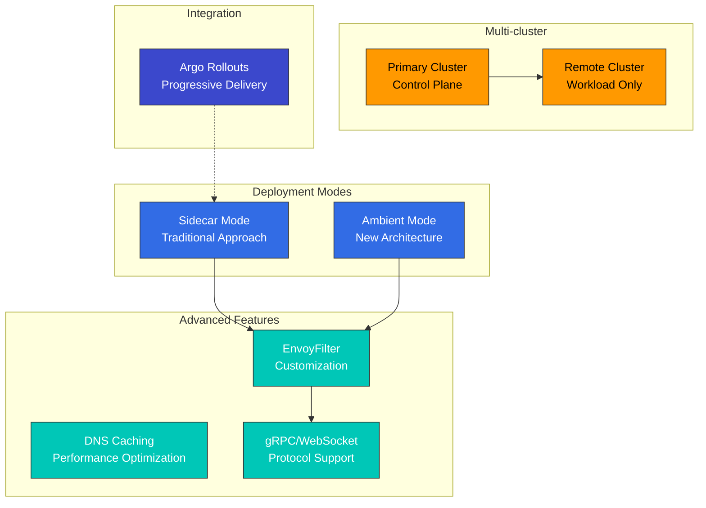
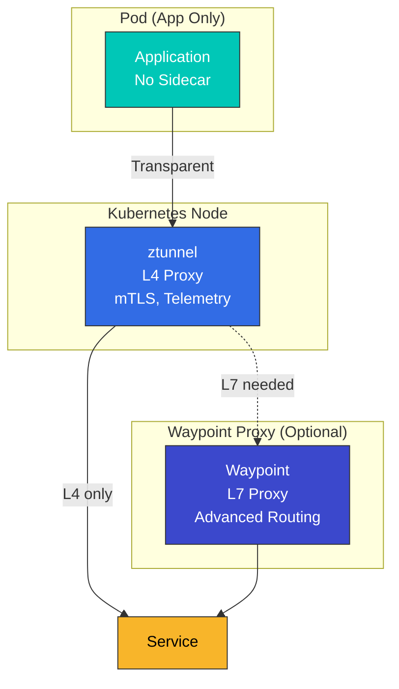
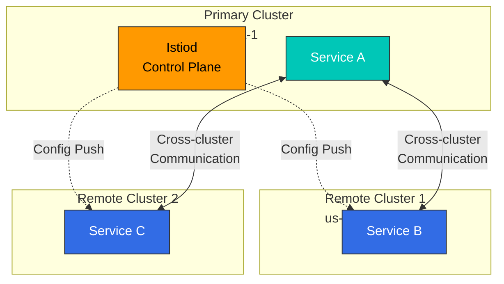
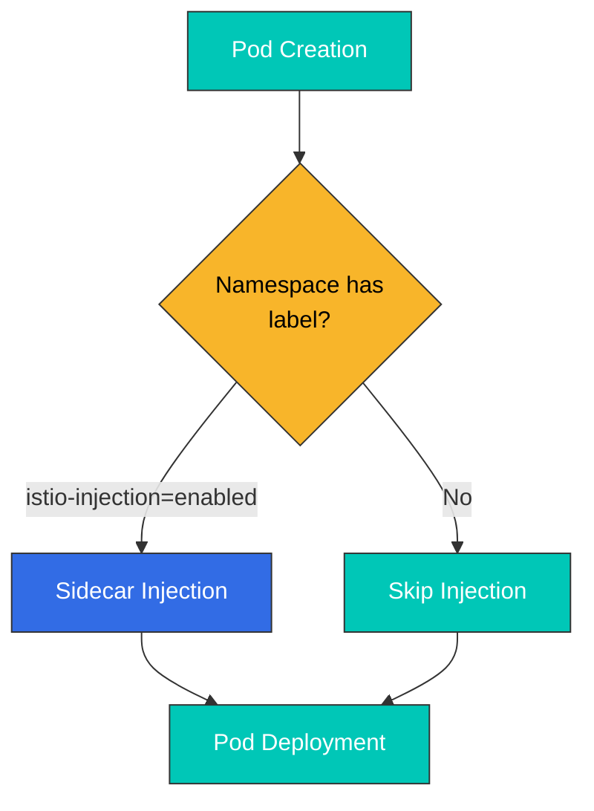
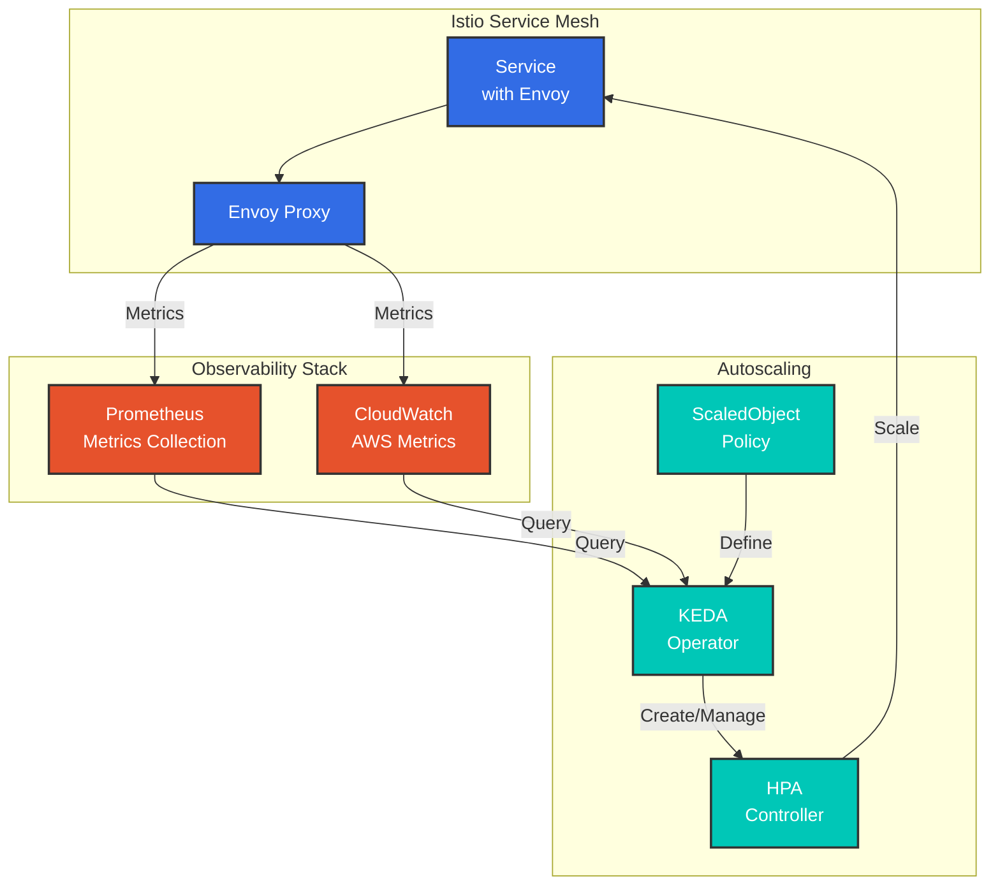

# 高度な機能

このセクションでは、Ambient Mode、Multi-cluster、EnvoyFilter、gRPC/WebSocket サポートなどを含む高度な Istio 機能を扱います。

## 目次

1. [Ambient Mode](01-ambient-mode.md)
2. [Multi-cluster](02-multi-cluster.md)
3. [EnvoyFilter](03-envoy-filter.md)
4. [DNS Caching](04-dns-cache.md)
5. [gRPC](05-grpc.md)
6. [WebSocket](06-websocket.md)
7. [Sidecar Injection](07-sidecar-injection.md)
8. [Argo Rollouts 統合](08-argo-rollouts.md)
9. [ゾーン対応 Argo Rollouts](09-zone-aware-argo-rollouts.md)
10. [KEDA Autoscaling](10-keda-autoscaling.md)

## 概要

このセクションでは、本番環境で必要となる高度な Istio 機能と詳細なトピックを扱います。

### 主なトピック



## 1. Ambient Mode

Istio 1.28+ で導入された新しい data plane アーキテクチャです。

### Sidecar Mode と Ambient Mode

| 特性 | Sidecar Mode | Ambient Mode |
|----------------|-------------|--------------|
| **アーキテクチャ** | 各 Pod に注入される Envoy proxy | ztunnel（node レベル）+ waypoint（任意） |
| **リソース使用量** | 高（Pod ごとに proxy） | 低（node ごとに proxy） |
| **Deployment の複雑さ** | 高（再 Deployment が必要） | 低（透過的に適用） |
| **パフォーマンス** | やや低速（追加の hop） | 高速（必要な場合のみ L4） |
| **機能** | すべての機能をサポート | デフォルトは L4、L7 には waypoint が必要 |

### Ambient Mode アーキテクチャ



**詳細**: [Ambient Mode 詳細ガイド](01-ambient-mode.md)

## 2. Multi-cluster

複数の Kubernetes cluster を単一の service mesh として接続します。

### Multi-cluster トポロジー



**ユースケース**:
- マルチリージョン Deployment
- 災害復旧（DR）
- Blue/Green cluster Deployment
- 環境分離（dev/staging/prod）

**詳細**: [Multi-cluster セットアップガイド](02-multi-cluster.md)

## 3. EnvoyFilter

Envoy proxy の設定を直接カスタマイズします。

### EnvoyFilter のユースケース

```yaml
# Add custom header
apiVersion: networking.istio.io/v1alpha3
kind: EnvoyFilter
metadata:
  name: custom-header
spec:
  workloadSelector:
    labels:
      app: myapp
  configPatches:
  - applyTo: HTTP_FILTER
    match:
      context: SIDECAR_OUTBOUND
    patch:
      operation: INSERT_BEFORE
      value:
        name: envoy.filters.http.lua
        typed_config:
          "@type": type.googleapis.com/envoy.extensions.filters.http.lua.v3.Lua
          inline_code: |
            function envoy_on_request(request_handle)
              request_handle:headers():add("x-custom-header", "value")
            end
```

**主なユースケース**:
- Rate Limiting
- カスタム Authentication/Authorization
- Header 操作
- Request/Response 変換
- WASM Plugins

**詳細**: [EnvoyFilter ガイド](03-envoy-filter.md)

## 4. DNS Caching

DNS lookup をキャッシュしてパフォーマンスを最適化します。

```yaml
apiVersion: networking.istio.io/v1
kind: DestinationRule
metadata:
  name: dns-cache
spec:
  host: external-api.example.com
  trafficPolicy:
    connectionPool:
      tcp:
        maxConnections: 100
      http:
        http1MaxPendingRequests: 100
```

**メリット**:
- DNS lookup のレイテンシー低減
- 外部 DNS server の負荷低減
- 一貫した DNS response

**詳細**: [DNS Caching ガイド](04-dns-cache.md)

## 5. gRPC サポート

gRPC protocol 向けに最適化された routing と load balancing を提供します。

```yaml
apiVersion: networking.istio.io/v1
kind: VirtualService
metadata:
  name: grpc-service
spec:
  hosts:
  - grpc-service
  http:
  - match:
    - uri:
        prefix: /mypackage.MyService/
    route:
    - destination:
        host: grpc-service
        subset: v2
```

**主な機能**:
- HTTP/2 ベースの load balancing
- gRPC health check
- Deadline と Retry
- Metadata ベースの routing

**詳細**: [gRPC ガイド](05-grpc.md)

## 6. WebSocket サポート

WebSocket connection 向けの特別な処理を提供します。

```yaml
apiVersion: networking.istio.io/v1
kind: VirtualService
metadata:
  name: websocket-service
spec:
  hosts:
  - ws.example.com
  http:
  - match:
    - headers:
        upgrade:
          exact: websocket
    route:
    - destination:
        host: websocket-service
```

**主な機能**:
- 長時間維持される connection の管理
- Connection Pool 設定
- Idle Timeout 管理

**詳細**: [WebSocket ガイド](06-websocket.md)

## 7. Sidecar Injection

sidecar proxy の injection mechanism とカスタマイズを扱います。

### Injection 方法



**詳細**: [Sidecar Injection ガイド](07-sidecar-injection.md)

## 8. Argo Rollouts 統合

Argo Rollouts を Istio と統合して高度な Deployment strategy を実装します。

```yaml
apiVersion: argoproj.io/v1alpha1
kind: Rollout
metadata:
  name: myapp
spec:
  strategy:
    canary:
      trafficRouting:
        istio:
          virtualService:
            name: myapp-vsvc
            routes:
            - primary
      steps:
      - setWeight: 10
      - pause: {duration: 2m}
      - setWeight: 50
      - pause: {duration: 2m}
```

**主な機能**:
- Metrics ベースの自動 Canary Deployment
- Analysis と自動 rollback
- Blue/Green Deployment
- Progressive Delivery

**詳細**: [Argo Rollouts 統合ガイド](08-argo-rollouts.md)

## 9. ゾーン対応 Argo Rollouts

availability zone ごとにゾーン対応 Canary Deployment を実行します。

**詳細**: [ゾーン対応 Argo Rollouts ガイド](09-zone-aware-argo-rollouts.md)

## 10. KEDA Autoscaling

KEDA を使用して、Istio metrics ベースの autoscaling を実装します。

### KEDA と HPA

| 機能 | Kubernetes HPA | KEDA |
|---------|---------------|------|
| **Metric source** | CPU/Memory + Custom Metrics | 60 以上の Scaler（Prometheus、CloudWatch、Kafka など） |
| **ゼロへのスケール** | 未サポート（最小 1） | サポート（0 Pod も可能） |
| **External Metrics** | Metrics Server が必要 | ネイティブサポート |
| **複雑な query** | 制限あり | PromQL、CloudWatch Insights |

### KEDA アーキテクチャ



### 主な Scaling strategy

```yaml
# RPS-based scaling
apiVersion: keda.sh/v1alpha1
kind: ScaledObject
metadata:
  name: reviews-rps-scaler
spec:
  scaleTargetRef:
    name: reviews
  triggers:
  - type: prometheus
    metadata:
      query: |
        sum(rate(istio_requests_total{
          destination_workload="reviews"
        }[1m]))
      threshold: '100'
```

**Scaling metrics**:
- **RPS (Requests Per Second)**: 1 秒あたりの request に基づく
- **Latency (P50/P95/P99)**: latency percentile に基づく
- **Error Rate**: 5xx error rate に基づく
- **Circuit Breaker**: Circuit Breaker の状態に基づく
- **Composite Metrics**: 複数の metric の組み合わせ

**Metric source**:
- **Prometheus**: リアルタイムの Istio/Envoy metrics
- **AWS CloudWatch**: ADOT Collector 経由の CloudWatch metrics

**詳細**: [KEDA Autoscaling ガイド](10-keda-autoscaling.md)

## 学習パス

1. **[Ambient Mode](01-ambient-mode.md)** - 新しいアーキテクチャの理解
2. **[Multi-cluster](02-multi-cluster.md)** - Multi-cluster 設定
3. **[EnvoyFilter](03-envoy-filter.md)** - 高度なカスタマイズ
4. **[Sidecar Injection](07-sidecar-injection.md)** - Injection mechanism
5. **[gRPC](05-grpc.md)** - gRPC protocol サポート
6. **[WebSocket](06-websocket.md)** - WebSocket サポート
7. **[DNS Caching](04-dns-cache.md)** - パフォーマンス最適化
8. **[Argo Rollouts](08-argo-rollouts.md)** - Progressive Delivery
9. **[ゾーン対応 Argo Rollouts](09-zone-aware-argo-rollouts.md)** - zone ベースの Deployment
10. **[KEDA Autoscaling](10-keda-autoscaling.md)** - Metrics ベースの autoscaling

## 参考資料

- [Istio 高度な機能](https://istio.io/latest/docs/ops/)
- [Ambient Mode ドキュメント](https://istio.io/latest/docs/ops/ambient/)
- [Multi-cluster ドキュメント](https://istio.io/latest/docs/setup/install/multicluster/)
- [EnvoyFilter リファレンス](https://istio.io/latest/docs/reference/config/networking/envoy-filter/)

## クイズ

この章で学んだ内容を確認するには、[Istio Advanced Quiz](../../../quizzes/service-mesh/istio/advanced.md)に取り組んでください。
