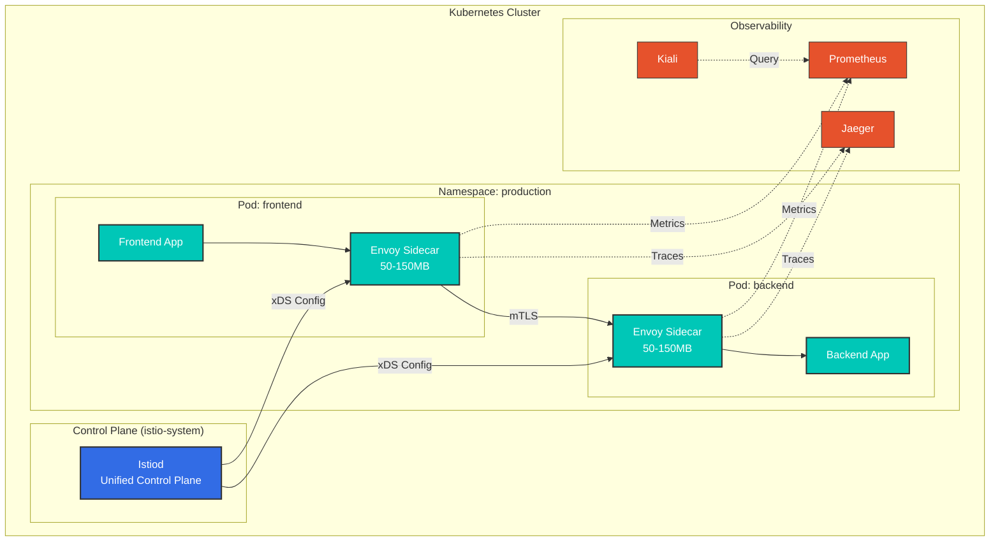
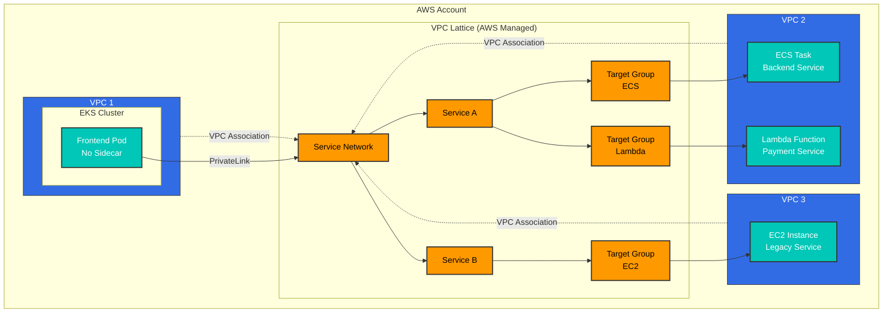
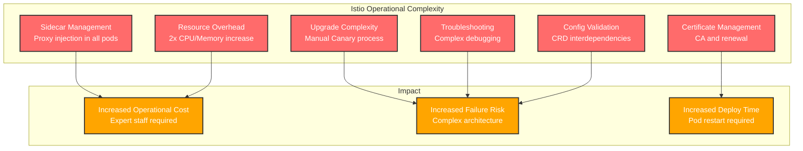
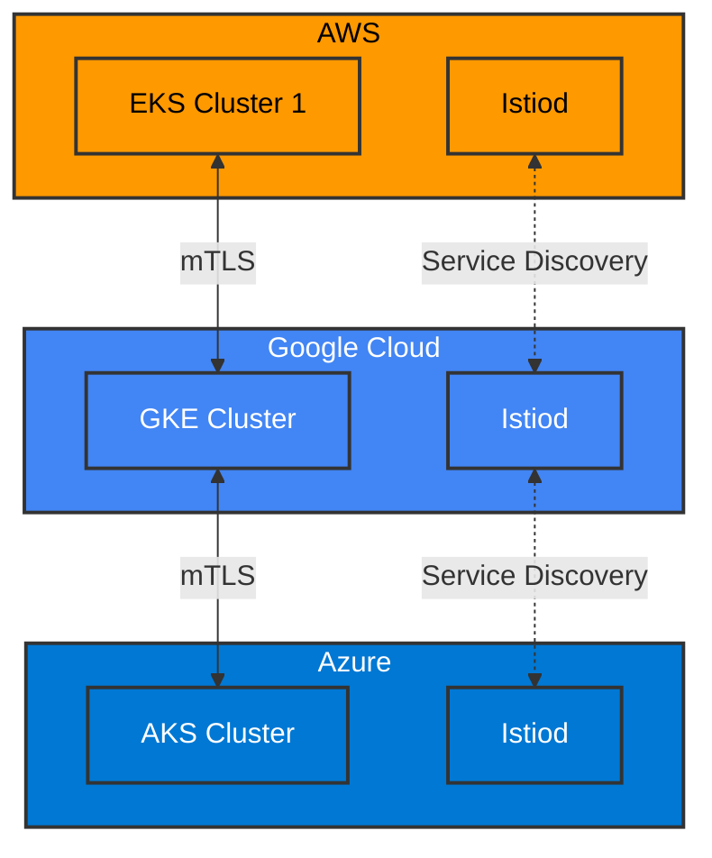
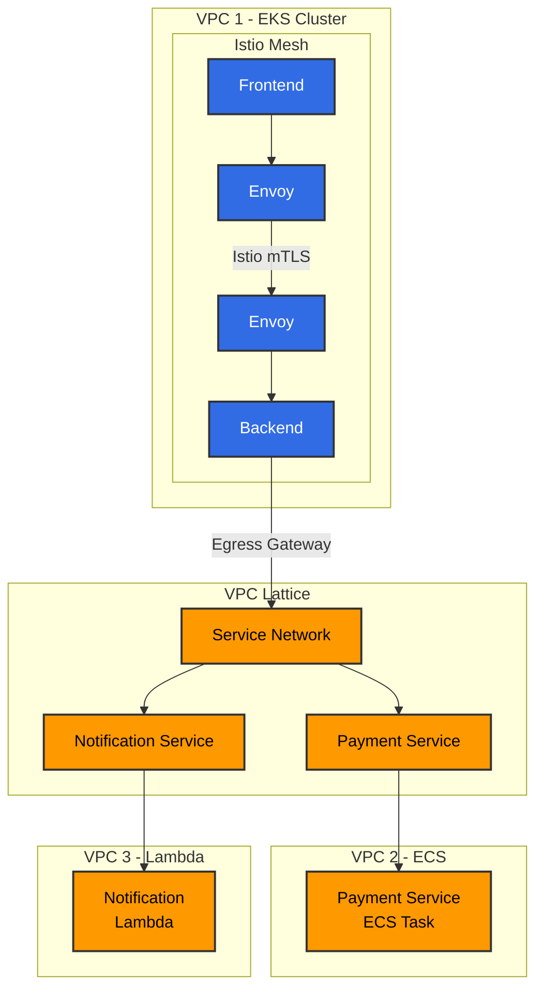
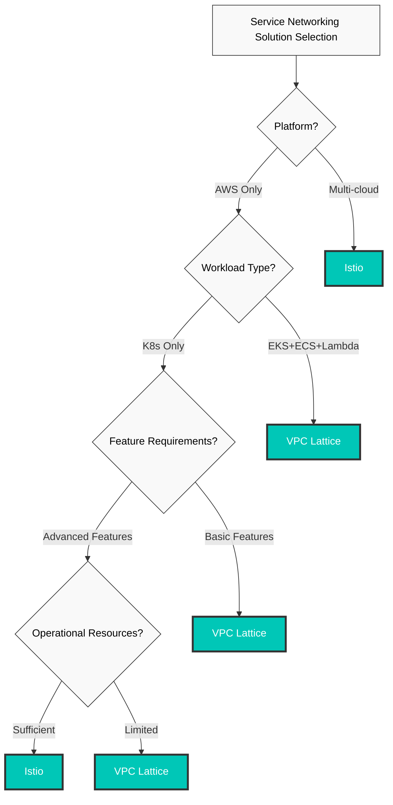

# Istio vs VPC Lattice

> **最終更新**: February 23, 2026 **Istio Version**: 1.24 **VPC Lattice**: GA (Released 2023)

このドキュメントでは、Kubernetes Service Mesh（Istio）と AWS ネイティブのサービスネットワーキング（VPC Lattice）を包括的に比較します。

## 目次

1. [概要と主な違い](02-istio-vs-lattice.md#overview-and-key-differences)
2. [アーキテクチャの比較](02-istio-vs-lattice.md#architecture-comparison)
3. [トラフィック管理機能](02-istio-vs-lattice.md#traffic-management-features)
4. [セキュリティモデル](02-istio-vs-lattice.md#security-model)
5. [可観測性とモニタリング](02-istio-vs-lattice.md#observability-and-monitoring)
6. [運用の複雑さ](02-istio-vs-lattice.md#operational-complexity)
7. [コスト分析](02-istio-vs-lattice.md#cost-analysis)
8. [パフォーマンス比較](02-istio-vs-lattice.md#performance-comparison)
9. [マルチクラウド戦略](02-istio-vs-lattice.md#multi-cloud-strategy)
10. [ハイブリッドアーキテクチャ](02-istio-vs-lattice.md#hybrid-architecture)
11. [選定ガイド](02-istio-vs-lattice.md#selection-guide)

## 概要と主な違い

### Istio Service Mesh

**定義**: Kubernetes 環境で稼働し、マイクロサービス間の通信をインフラストラクチャレイヤーとして管理、保護、監視するオープンソースの Service Mesh

**主な機能**:

* 自己管理（直接運用）
* Kubernetes ネイティブ（CRD ベース）
* クラウド非依存
* 豊富な機能セット
* Envoy Proxy ベース

### AWS VPC Lattice

**定義**: AWS が提供するフルマネージドのアプリケーションネットワーキングサービスであり、VPC、アカウント、コンピューティングプラットフォームにまたがるサービス接続とセキュリティを簡素化します

**主な機能**:

* フルマネージド
* AWS ネイティブ統合
* サーバーレスアーキテクチャ
* EKS、ECS、EC2、Lambda をサポート
* 透過的な VPC/アカウント間接続

### クイック比較表

| 項目                       | Istio          | VPC Lattice           |
| -------------------------- | -------------- | --------------------- |
| **デプロイモデル**         | 自己管理       | フルマネージド         |
| **プラットフォーム**       | Kubernetes     | EKS, ECS, EC2, Lambda |
| **アーキテクチャ**         | Sidecar Proxy  | AWS 管理              |
| **設定の複雑さ**           | 高             | 低                    |
| **機能の豊富さ**           | 5/5            | 3/5                   |
| **運用オーバーヘッド**     | 高             | ほぼなし              |
| **ベンダーロックイン**     | 低             | 高（AWS のみ）        |
| **コストモデル**           | リソースベース | 使用量ベース          |
| **学習曲線**               | 急             | 緩やか                |
| **マルチクラウド**         | 対応           | AWS のみ              |

## アーキテクチャの比較

### Istio アーキテクチャ



**機能**:

* **Sidecar パターン**: すべての Pod に Envoy Proxy をインジェクション
* **リソースオーバーヘッド**: Pod ごとにメモリ 50-150MB、CPU 100-500m
* **データパス**: App -> Envoy -> mTLS -> Envoy -> App
* **設定**: Kubernetes CRD（VirtualService、DestinationRule など）

### VPC Lattice アーキテクチャ



**機能**:

* **マネージドサービス**: AWS がネットワークインフラストラクチャを運用
* **Sidecar なし**: アプリケーション Pod に追加コンテナは不要
* **データパス**: App -> AWS PrivateLink -> VPC Lattice -> Target
* **設定**: AWS Console、CLI、CloudFormation、Terraform

### アーキテクチャの違いの概要

| 項目                       | Istio                    | VPC Lattice             |
| -------------------------- | ------------------------ | ----------------------- |
| **Proxy の配置場所**       | Pod 内（Sidecar）        | AWS 管理（外部）        |
| **メモリオーバーヘッド**   | Pod ごとに 50-150MB      | 0MB（管理済み）         |
| **CPU オーバーヘッド**     | Pod ごとに 100-500m      | 0（管理済み）           |
| **Control Plane**          | 自己管理（Istiod）       | AWS 管理                |
| **Data Plane**             | Envoy Proxy              | AWS PrivateLink         |
| **設定インターフェイス**   | Kubernetes CRD           | AWS API                 |
| **アップグレード**         | 手動（Canary が可能）    | 自動（AWS 管理）        |

## トラフィック管理機能

### トラフィック分割（Canary Deployment）

#### Istio

```yaml
apiVersion: networking.istio.io/v1
kind: VirtualService
metadata:
  name: frontend
spec:
  hosts:
  - frontend
  http:
  - match:
    - headers:
        user-agent:
          regex: ".*Mobile.*"
    route:
    - destination:
        host: frontend
        subset: v2
      weight: 100
  - route:
    - destination:
        host: frontend
        subset: v1
      weight: 90
    - destination:
        host: frontend
        subset: v2
      weight: 10
---
apiVersion: networking.istio.io/v1
kind: DestinationRule
metadata:
  name: frontend
spec:
  host: frontend
  trafficPolicy:
    loadBalancer:
      simple: LEAST_REQUEST
  subsets:
  - name: v1
    labels:
      version: v1
  - name: v2
    labels:
      version: v2
```

**機能**:

* Header、URL、Source ベースのルーティング
* 高精度な重み制御（1% 単位）
* 複雑な条件（AND、OR、Regex）
* 動的な負荷分散アルゴリズム

#### VPC Lattice

```yaml
# Weight-based routing with AWS CLI
aws vpc-lattice create-rule \
  --listener-identifier $LISTENER_ID \
  --priority 10 \
  --match '{
    "httpMatch": {
      "pathMatch": {"prefix": "/api"}
    }
  }' \
  --action '{
    "forward": {
      "targetGroups": [
        {
          "targetGroupIdentifier": "'$TG_V1'",
          "weight": 90
        },
        {
          "targetGroupIdentifier": "'$TG_V2'",
          "weight": 10
        }
      ]
    }
  }'
```

**機能**:

* Path、Header、Method ベースのルーティング
* 重みベースの分割
* 基本的な条件
* Round robin、least connections の負荷分散

**比較**:

* **Istio**: 非常に高精度な制御が可能で、複雑なシナリオに対応
* **VPC Lattice**: 基本機能を備え、簡単に利用可能

### トラフィックミラーリング

#### Istio

```yaml
apiVersion: networking.istio.io/v1
kind: VirtualService
metadata:
  name: backend
spec:
  hosts:
  - backend
  http:
  - route:
    - destination:
        host: backend
        subset: v1
      weight: 100
    mirror:
      host: backend
      subset: v2
    mirrorPercentage:
      value: 10.0  # Copy 10% traffic to v2
```

**ユースケース**:

* 本番トラフィックを使用した新バージョンのテスト
* パフォーマンス比較
* バグの検証

#### VPC Lattice

**非対応**: VPC Lattice はトラフィックミラーリングをサポートしていません。

**代替案**:

* Application Load Balancer + Lambda@Edge
* 個別のログストリーム分析

### Fault Injection

#### Istio

```yaml
apiVersion: networking.istio.io/v1
kind: VirtualService
metadata:
  name: backend
spec:
  hosts:
  - backend
  http:
  - fault:
      delay:
        percentage:
          value: 10.0
        fixedDelay: 5s
      abort:
        percentage:
          value: 5.0
        httpStatus: 503
    route:
    - destination:
        host: backend
```

**機能**:

* 遅延の注入
* Abort の注入（エラー注入）
* パーセンテージベースの制御
* Chaos Engineering をサポート

#### VPC Lattice

**非対応**: 組み込みの Fault Injection 機能はありません

**代替案**:

* アプリケーションレベルで実装
* AWS FIS（Fault Injection Simulator）を使用

### Circuit Breaking と Outlier Detection

#### Istio

```yaml
apiVersion: networking.istio.io/v1
kind: DestinationRule
metadata:
  name: backend
spec:
  host: backend
  trafficPolicy:
    connectionPool:
      tcp:
        maxConnections: 100
      http:
        http1MaxPendingRequests: 50
        http2MaxRequests: 100
        maxRequestsPerConnection: 2
    outlierDetection:
      consecutiveErrors: 5
      interval: 30s
      baseEjectionTime: 60s
      maxEjectionPercent: 50
      minHealthPercent: 50
```

#### VPC Lattice

**限定的に対応**: 基本的なヘルスチェックのみ提供

```yaml
# Target Group health check
aws vpc-lattice create-target-group \
  --name backend-tg \
  --health-check '{
    "enabled": true,
    "protocol": "HTTP",
    "path": "/health",
    "intervalSeconds": 30,
    "timeoutSeconds": 5,
    "healthyThresholdCount": 2,
    "unhealthyThresholdCount": 3
  }'
```

**比較**:

* **Istio**: 高精度な Circuit Breaking、自動 Outlier Detection
* **VPC Lattice**: 基本的なヘルスチェック、手動での除外

### 機能比較表

| 機能                    | Istio              | VPC Lattice       | 優位 |
| ----------------------- | ------------------ | ----------------- | ---- |
| **Canary Deployment**   | 非常に高精度       | 基本              | Istio |
| **A/B テスト**          | Header ベース      | Path ベースのみ   | Istio |
| **トラフィックミラーリング** | 対応           | 非対応            | Istio |
| **Fault Injection**     | 対応               | 非対応            | Istio |
| **Circuit Breaking**    | 高精度             | 基本              | Istio |
| **Retry**               | 高度               | 基本              | Istio |
| **Timeout**             | 高精度             | 基本              | Istio |
| **負荷分散**            | 多様なアルゴリズム | 基本              | Istio |

**結論**: トラフィック管理において、**Istio は圧倒的に優位**です

## セキュリティモデル

### mTLS の設定

#### Istio

```yaml
# Global mTLS STRICT mode
apiVersion: security.istio.io/v1
kind: PeerAuthentication
metadata:
  name: default
  namespace: istio-system
spec:
  mtls:
    mode: STRICT
---
# Namespace-level exception
apiVersion: security.istio.io/v1
kind: PeerAuthentication
metadata:
  name: legacy-permissive
  namespace: legacy
spec:
  mtls:
    mode: PERMISSIVE
---
# Service-level port-level settings
apiVersion: security.istio.io/v1
kind: PeerAuthentication
metadata:
  name: backend
spec:
  selector:
    matchLabels:
      app: backend
  mtls:
    mode: STRICT
  portLevelMtls:
    8080:
      mode: DISABLE  # Metrics port is plaintext
```

**機能**:

* 証明書の自動発行と更新
* Workload ごとの証明書
* 15 分ごとの自動更新
* SPIFFE 標準に準拠
* 外部 CA との統合（Cert-manager、Vault）

#### VPC Lattice

```yaml
# Create TLS Listener
aws vpc-lattice create-listener \
  --service-identifier $SERVICE_ID \
  --protocol HTTPS \
  --port 443 \
  --default-action '{
    "forward": {
      "targetGroups": [{"targetGroupIdentifier": "'$TG_ID'"}]
    }
  }'

# Apply Auth Policy
aws vpc-lattice create-auth-policy \
  --resource-identifier $SERVICE_ID \
  --policy '{
    "allowedPrincipals": [
      "arn:aws:iam::123456789012:role/app-role"
    ]
  }'
```

**機能**:

* AWS Certificate Manager（ACM）統合
* IAM ベースの認証
* SigV4 署名
* AWS PrivateLink 暗号化

**比較**:

* **Istio**: Workload 間の自動 mTLS、高精度な制御
* **VPC Lattice**: クライアントとサービス間の TLS、IAM 統合

### 認可ポリシー

#### Istio

```yaml
# L7 level fine-grained Authorization
apiVersion: security.istio.io/v1
kind: AuthorizationPolicy
metadata:
  name: backend-policy
spec:
  selector:
    matchLabels:
      app: backend
  action: ALLOW
  rules:
  - from:
    - source:
        principals: ["cluster.local/ns/frontend/sa/frontend"]
        namespaces: ["frontend"]
    to:
    - operation:
        methods: ["GET", "POST"]
        paths: ["/api/v1/*"]
        ports: ["8080"]
    when:
    - key: request.headers[user-role]
      values: ["admin", "poweruser"]
    - key: source.ip
      notValues: ["10.0.0.0/8"]
---
# JWT Authentication
apiVersion: security.istio.io/v1
kind: RequestAuthentication
metadata:
  name: jwt-auth
spec:
  selector:
    matchLabels:
      app: backend
  jwtRules:
  - issuer: "https://auth.example.com"
    jwksUri: "https://auth.example.com/.well-known/jwks.json"
    audiences:
    - "api.example.com"
---
# JWT-based Authorization
apiVersion: security.istio.io/v1
kind: AuthorizationPolicy
metadata:
  name: jwt-policy
spec:
  selector:
    matchLabels:
      app: backend
  action: ALLOW
  rules:
  - when:
    - key: request.auth.claims[role]
      values: ["admin"]
```

#### VPC Lattice

```json
// Auth Policy (IAM-based)
{
  "Version": "2012-10-17",
  "Statement": [
    {
      "Effect": "Allow",
      "Principal": {
        "AWS": "arn:aws:iam::123456789012:role/frontend-role"
      },
      "Action": "vpc-lattice:Invoke",
      "Resource": "arn:aws:vpc-lattice:region:account:service/svc-xxx"
    },
    {
      "Effect": "Deny",
      "Principal": "*",
      "Action": "vpc-lattice:Invoke",
      "Resource": "*",
      "Condition": {
        "IpAddress": {
          "aws:SourceIp": ["10.0.0.0/8"]
        }
      }
    }
  ]
}
```

**比較**:

| 機能                         | Istio                     | VPC Lattice             | 優位                |
| ---------------------------- | ------------------------- | ----------------------- | ------------------- |
| **認証メカニズム**           | mTLS、JWT、Custom         | IAM、SigV4              | Istio（柔軟性）     |
| **認可の粒度**               | L7（Method、Path、Header） | L4（Service レベル）   | Istio               |
| **Workload Identity**        | SPIFFE ID                 | IAM Role                | 同等                |
| **動的ポリシー**             | リアルタイムで適用        | 伝播時間が必要          | Istio               |
| **マルチテナンシー**         | Namespace 分離            | VPC/Account 分離        | 同等                |

**結論**: セキュリティにおいて、**Istio はより高精度な制御を提供**し、VPC Lattice は AWS IAM 統合に優れています

## 可観測性とモニタリング

### メトリクス収集

#### Istio

```yaml
# Prometheus metrics (50+ provided by default)
# Request metrics
istio_requests_total{
  destination_service="backend",
  response_code="200",
  source_app="frontend"
}

# Latency metrics (histogram)
istio_request_duration_milliseconds_bucket{
  destination_service="backend",
  le="100"
}

# Connection Pool metrics
envoy_cluster_upstream_cx_active{
  cluster_name="outbound|8080||backend"
}

# Circuit Breaker metrics
envoy_cluster_outlier_detection_ejections_active

# Custom Metrics (Telemetry API)
apiVersion: telemetry.istio.io/v1alpha1
kind: Telemetry
metadata:
  name: custom-metrics
spec:
  metrics:
  - providers:
    - name: prometheus
    dimensions:
      request_method:
        value: request.method
      custom_header:
        value: request.headers['x-custom-header'] | ''
```

**機能**:

* 50 以上のデフォルトメトリクス
* Prometheus 形式
* OpenTelemetry 統合
* Custom Metrics の追加が可能
* Exemplar をサポート（メトリクスとトレースのリンク）

#### VPC Lattice

```bash
# CloudWatch metrics
aws cloudwatch get-metric-statistics \
  --namespace AWS/VPCLattice \
  --metric-name RequestCount \
  --dimensions Name=ServiceName,Value=backend \
  --start-time 2025-01-01T00:00:00Z \
  --end-time 2025-01-01T23:59:59Z \
  --period 300 \
  --statistics Sum
```

**デフォルトメトリクス**:

* `RequestCount`: リクエスト数
* `ActiveConnectionCount`: アクティブな接続数
* `HealthyTargetCount`: 正常な Target 数
* `UnhealthyTargetCount`: 異常な Target 数
* `TargetResponseTime`: 応答時間
* `HTTPCode_Target_4XX_Count`: 4xx エラー
* `HTTPCode_Target_5XX_Count`: 5xx エラー

**機能**:

* CloudWatch 統合
* デフォルトメトリクスのみ提供
* Custom Metrics は不可
* 1 分または 5 分粒度

### 分散トレーシング

#### Istio

```yaml
# Tracing setup with Telemetry API
apiVersion: telemetry.istio.io/v1alpha1
kind: Telemetry
metadata:
  name: tracing
  namespace: istio-system
spec:
  tracing:
  - providers:
    - name: jaeger
    randomSamplingPercentage: 10.0
    customTags:
      environment:
        literal:
          value: "production"
      user_id:
        header:
          name: "x-user-id"
```

**対応するバックエンド**:

* Jaeger
* Zipkin
* Tempo
* AWS X-Ray
* Datadog APM
* OpenTelemetry Collector

**機能**:

* W3C Trace Context 標準
* Span の自動生成
* Custom tag の追加
* サンプリング制御
* Baggage 伝播

#### VPC Lattice

```bash
# Access Log to S3
aws vpc-lattice create-access-log-subscription \
  --resource-identifier $SERVICE_ID \
  --destination-arn arn:aws:s3:::lattice-logs

# Access Log to CloudWatch Logs
aws vpc-lattice create-access-log-subscription \
  --resource-identifier $SERVICE_ID \
  --destination-arn arn:aws:logs:region:account:log-group:/aws/vpclattice
```

**Access Log 形式**（JSON）:

```json
{
  "timestamp": "2025-01-15T12:34:56.789Z",
  "serviceNetworkArn": "arn:aws:vpc-lattice:...",
  "serviceArn": "arn:aws:vpc-lattice:...",
  "requestMethod": "GET",
  "requestPath": "/api/users",
  "requestProtocol": "HTTP/1.1",
  "responseCode": 200,
  "responseCodeDetails": "OK",
  "requestHeaders": {},
  "sourceVpcArn": "arn:aws:ec2:...",
  "targetGroupArn": "arn:aws:vpc-lattice:...",
  "traceparent": "00-4bf92f3577b34da6a3ce929d0e0e4736-00f067aa0ba902b7-01"
}
```

**機能**:

* W3C Trace Context header（`traceparent`）をサポート
* S3 または CloudWatch Logs に送信
* AWS X-Ray 統合が可能（アプリケーションのインストルメンテーションが必要）
* 自動トレーシングなし（手動インストルメンテーション）

**比較**:

* **Istio**: 自動トレーシング、すべてのバックエンドをサポート、高精度な制御
* **VPC Lattice**: Access Log ベース、X-Ray には手動統合が必要

### 可観測性の総合比較

| 機能                       | Istio          | VPC Lattice              | 優位 |
| -------------------------- | -------------- | ------------------------ | ---- |
| **メトリクス**             | 50 以上        | 約 10                    | Istio |
| **Custom Metrics**         | Telemetry API  | 非対応                   | Istio |
| **分散トレーシング**       | 自動           | 手動インストルメンテーション | Istio |
| **トレーシングバックエンド** | 6 以上       | X-Ray のみ               | Istio |
| **Access Logs**            | 非常に詳細     | 基本                     | Istio |
| **可視化**                 | Kiali、Grafana | CloudWatch               | Istio |
| **リアルタイム監視**       | 対応           | 限定的                   | Istio |
| **Exemplars**              | 対応           | 非対応                   | Istio |

**結論**: 可観測性において、**Istio は圧倒的に優位**です

## 運用の複雑さ

### Istio 運用における現実的な課題

Istio は強力な機能を提供しますが、本番環境での運用には大きな課題があります。

#### 主な運用上の課題



### インストールと初期セットアップ

#### Istio

```bash
# 1. Install Istioctl
curl -L https://istio.io/downloadIstio | sh -
cd istio-1.24.0
export PATH=$PWD/bin:$PATH

# 2. Install Istio (production profile)
istioctl install --set profile=production

# 3. Enable Sidecar injection for namespace
kubectl label namespace default istio.io/injection=enabled

# 4. Deploy gateway
kubectl apply -f samples/bookinfo/networking/bookinfo-gateway.yaml

# 5. Install observability tools
kubectl apply -f samples/addons/prometheus.yaml
kubectl apply -f samples/addons/grafana.yaml
kubectl apply -f samples/addons/jaeger.yaml
kubectl apply -f samples/addons/kiali.yaml

# 6. Validate configuration
istioctl analyze
```

**所要時間**: 30-60 分（設定を含む） **複雑さ**: 4/5（高）

#### VPC Lattice

```bash
# 1. Create Service Network
SERVICE_NETWORK_ID=$(aws vpc-lattice create-service-network \
  --name production-network \
  --auth-type AWS_IAM \
  --query 'id' --output text)

# 2. Associate VPC
aws vpc-lattice create-service-network-vpc-association \
  --service-network-identifier $SERVICE_NETWORK_ID \
  --vpc-identifier vpc-xxx \
  --security-group-ids sg-xxx

# 3. Create Service
SERVICE_ID=$(aws vpc-lattice create-service \
  --name backend-service \
  --auth-type AWS_IAM \
  --query 'id' --output text)

# 4. Associate Service to Network
aws vpc-lattice create-service-network-service-association \
  --service-network-identifier $SERVICE_NETWORK_ID \
  --service-identifier $SERVICE_ID

# 5. Create Target Group
TG_ID=$(aws vpc-lattice create-target-group \
  --name backend-tg \
  --type IP \
  --config '{
    "port": 8080,
    "protocol": "HTTP",
    "vpcIdentifier": "vpc-xxx"
  }' \
  --query 'id' --output text)

# 6. Register Targets
aws vpc-lattice register-targets \
  --target-group-identifier $TG_ID \
  --targets id=10.0.1.10,port=8080

# 7. Create Listener
aws vpc-lattice create-listener \
  --service-identifier $SERVICE_ID \
  --protocol HTTP \
  --port 80 \
  --default-action '{
    "forward": {
      "targetGroups": [{"targetGroupIdentifier": "'$TG_ID'"}]
    }
  }'
```

**所要時間**: 10-20 分 **複雑さ**: 2/5（中）

### アップグレード: Istio 最大の課題

#### Istio アップグレードの複雑さ

Istio のアップグレードは、本番環境において最もリスクが高く複雑な作業の一つです。

**必要な総時間**: **6-10 時間**（Namespace 数に応じて増加）

**主な課題**:

* **長所**: 無停止が可能、段階的なロールアウト、ロールバックが可能
* **短所**:
  * 非常に複雑な手動プロセス
  * 専門知識が必要
  * 作業時間が 6-10 時間
  * すべての Pod で再起動が必要（Workload への影響）
  * 2 バージョンの Control Plane が同時に稼働（リソース 2 倍）

#### VPC Lattice

**自動アップグレード**: AWS がサービス更新を管理

**ユーザーの操作**: 不要

### 運用の複雑さの概要

| タスク                     | Istio                           | VPC Lattice           | 違い                        |
| -------------------------- | ------------------------------- | --------------------- | --------------------------- |
| **初期セットアップ**       | 30-60 分、CRD の学習が必要      | 10-20 分、AWS Console | **Lattice は 3 倍高速**     |
| **アップグレード**         | 6-10 時間、手動 Canary          | 自動、0 時間          | **Lattice は完全自動**      |
| **日常運用**               | 15-25 時間/月                   | 2-5 時間/月           | **Lattice は 5-10 倍少ない** |
| **Sidecar 管理**           | すべての Pod で再起動が必要     | N/A                   | **Lattice は管理不要**      |
| **リソースオーバーヘッド** | CPU/Memory 2 倍                 | 0                     | **Lattice はオーバーヘッドなし** |
| **トラブルシューティング** | 複雑、専門ツールが必要          | シンプル、CloudWatch  | **Lattice の方が容易**      |
| **学習曲線**               | 急、3-6 か月                    | 緩やか、1-2 週間      | **Lattice は 10 倍高速**    |
| **専門スタッフ**           | Service Mesh の専門家           | 一般的な AWS エンジニア | **Lattice は人員確保が容易** |
| **障害リスク**             | 高、複雑なアーキテクチャ        | 低、AWS 管理          | **Lattice の方が安定**      |

**結論**: 運用の複雑さにおいて、**VPC Lattice は圧倒的に優位**です

## コスト分析

### Istio コストモデル（詳細）

#### インフラストラクチャコスト（100 Pod 環境、EKS）

**コンピューティングコスト**:

| コンポーネント                 | リソース        | Node 要件                    | コスト（月額） |
| ------------------------------ | --------------- | ---------------------------- | -------------- |
| **アプリケーション**（100 Pod） | 10 vCPU、25GB   | 3 Node（m5.xlarge）          | $420           |
| **Envoy Sidecar**（100 Pod）   | 10 vCPU、12.8GB | +2 Node（Sidecar オーバーヘッド） | $280       |
| **Istiod**（Control Plane）    | 1 vCPU、2GB     | 含まれる                     | -              |
| **Prometheus**                 | 2 vCPU、8GB     | 追加リソース                 | $80            |
| **Jaeger**                     | 1 vCPU、4GB     | 追加リソース                 | $50            |
| **Kiali**                      | 0.5 vCPU、1GB   | 追加リソース                 | $20            |
| **コンピューティング合計**     |                 | **5 Node**                   | **$850/月**    |

**ストレージコスト**:

* Prometheus メトリクス: 100GB SSD -> $10/月
* Jaeger トレース: 50GB SSD -> $5/月
* ストレージ合計: **$15/月**

**インフラストラクチャ合計**: **$875/月** = **$10,500/年**

#### 運用コスト（年間）

| タスク                         | 時間（年間）  | 時間単価 | 年間コスト       |
| ------------------------------ | ------------- | -------- | ---------------- |
| **初期セットアップ**           | 40h           | $100/h   | $4,000           |
| **日常運用**（20h/月）         | 240h          | $100/h   | $24,000          |
| **アップグレード**（四半期ごと） | 40h（4 回） | $100/h   | $4,000           |
| **緊急対応**（平均）           | 20h           | $150/h   | $3,000           |
| **トレーニング**               | 40h           | $100/h   | $4,000           |
| **運用合計**                   |               |          | **$39,000/年**   |

#### Istio の総コスト

**年間総コスト**: **$10,500 + $39,000 = $49,500**

### VPC Lattice コストモデル

**使用量ベースのコスト**:

| 項目                   | 単価        | 想定使用量       | コスト（月額） |
| ---------------------- | ----------- | ---------------- | -------------- |
| **Service Network**    | $0.025/時   | 1 x 730 時間     | $18            |
| **Service**            | $0.025/時   | 5 x 730 時間     | $91            |
| **データ処理**         | $0.010/GB   | 10TB             | $100           |
| **合計**               |             |                  | **$209**       |

**運用コスト**:

* 初期セットアップ: 10 時間 x $100/h = $1,000
* 月次運用: 3 時間 x $100/h = $300

**年間総コスト**: $209 x 12 + $300 x 12 + $1,000 = **$7,608**

### コスト比較の概要

| 項目                         | Istio Sidecar | VPC Lattice | 差異（Istio 比）       |
| ---------------------------- | ------------- | ----------- | ---------------------- |
| **インフラストラクチャ（年間）** | $10,500    | $2,508      | **76% 低コスト**       |
| **運用（年間）**             | $39,000       | $5,100      | **87% 低コスト**       |
| **合計（年間）**             | **$49,500**   | **$7,608**  | **85% 低コスト**       |
| **5 年間 TCO**               | **$297,500**  | **$38,040** | **87% 低コスト**       |

**結論**: VPC Lattice は、**年間約 $42,000、5 年間で $260,000 低コスト**です

## パフォーマンス比較

### レイテンシオーバーヘッド

**テスト環境**: 2 Node EKS、m5.xlarge、1000 RPS

| シナリオ | ベースライン | Istio          | VPC Lattice    |
| -------- | ------------ | -------------- | -------------- |
| **P50**  | 1.0ms        | +1.0ms（2.0ms） | +0.5ms（1.5ms） |
| **P95**  | 2.5ms        | +2.5ms（5.0ms） | +1.2ms（3.7ms） |
| **P99**  | 5.0ms        | +3.5ms（8.5ms） | +2.0ms（7.0ms） |

**結論**: VPC Lattice は **わずかに低レイテンシ**です（Sidecar なし）

### スループット

| メトリクス       | ベースライン | Istio       | VPC Lattice |
| ---------------- | ------------ | ----------- | ----------- |
| **最大 RPS**     | 10,000       | 8,500（85%） | 9,200（92%） |
| **CPU 使用率**   | 100%         | 115%        | 102%        |
| **メモリ使用量** | 1GB          | 1.5GB       | 1.05GB      |

**結論**: VPC Lattice は **わずかに高いスループット**を実現します

### リソース効率

**100 Pod 環境**:

| リソース               | ベースライン | Istio          | VPC Lattice |
| ---------------------- | ------------ | -------------- | ----------- |
| **追加 CPU**           | -            | +10 vCPU       | 0           |
| **追加メモリ**         | -            | +15GB          | 0           |
| **追加 Pod**           | -            | +100（Sidecar） | 0           |

**結論**: VPC Lattice は **圧倒的に効率的**です

## マルチクラウド戦略

### Istio マルチクラウド



**利点**:

* クラウド非依存
* 一貫したポリシーと可観測性
* 自動 Service Discovery
* フェデレーテッドアイデンティティ

### VPC Lattice マルチクラウド

**不可能**: VPC Lattice は AWS 専用です

**代替案**:

* AWS Transit Gateway + VPN
* アプリケーションレベルの統合
* API Gateway

## ハイブリッドアーキテクチャ

### Istio と VPC Lattice の併用



**ユースケース**:

* **Cluster 内**: Istio（豊富な機能）
* **Cluster 間/外部**: VPC Lattice（シンプルな接続性）

## 選定ガイド

### 決定木



### クイック推奨表

| 状況                         | Istio       | VPC Lattice | 理由                       |
| ---------------------------- | ----------- | ----------- | -------------------------- |
| **AWS のみ**                 | 限定的      | 推奨        | 管理の容易さ               |
| **マルチクラウド**           | 推奨        | 非対応      | クラウド非依存性           |
| **K8s のみ**                 | 対応        | 対応        | どちらも可能               |
| **EKS + Lambda**             | 非対応      | 推奨        | Lambda 統合                |
| **高度なトラフィック制御**   | 推奨        | 非対応      | 機能の豊富さ               |
| **シンプルな運用**           | 非対応      | 推奨        | フルマネージド             |
| **豊富な可観測性**           | 推奨        | 限定的      | Metrics/Tracing            |
| **低コスト**                 | 非対応      | 推奨        | 運用コストを含む           |
| **迅速な開始**               | 非対応      | 推奨        | 学習曲線                   |
| **高精度なセキュリティ**     | 推奨        | 限定的      | L7 Authorization           |

### 最終推奨

**VPC Lattice を選択**:

* AWS 中心のアーキテクチャ
* 限られた運用リソース
* 迅速な開始が必要
* EKS + ECS + Lambda の混在
* シンプルな複数 VPC/アカウント間接続

**Istio を選択**:

* マルチクラウド戦略
* 高精度なトラフィック制御が必要
* 強力な可観測性が必要
* 複雑なデプロイ戦略（Canary、A/B）
* チームに Service Mesh の経験がある

**ハイブリッド（Istio + VPC Lattice）**:

* Cluster 内: Istio
* Cluster 間/外部: VPC Lattice
* 豊富な機能とシンプルな外部接続性

## 結論

### 主なまとめ

**Istio の強み**:

* 豊富な機能（5/5）
* 高精度な制御（5/5）
* 強力な可観測性（5/5）
* マルチクラウド（5/5）

**VPC Lattice の強み**:

* 運用のシンプルさ（5/5）
* 低コスト（5/5）
* 迅速な開始（5/5）
* AWS 統合（5/5）

### 何を選ぶべきか？

**Istio を選択**:

* マルチクラウド環境
* 高精度なトラフィック制御が必要
* 強力な可観測性が必要
* チームに Service Mesh の経験がある
* クラウドベンダーロックインを回避

**VPC Lattice を選択**:

* AWS 中心のアーキテクチャ
* 運用のシンプルさを最優先
* EKS + ECS + Lambda の混在
* 市場投入までの時間を短縮
* 低い運用コスト

**両方を使用**（ハイブリッド）:

* Cluster 内: Istio
* Cluster 間/外部: VPC Lattice
* 最適なバランス

***

**次のステップ**:

1. PoC 環境で両方のソリューションをテスト
2. 実際の Workload パターンでパフォーマンスを測定
3. チームの学習曲線を評価
4. 長期戦略に沿って選定

**関連ドキュメント**:

* [Service Mesh ソリューション比較](01-service-mesh-comparison.md)
* [Istio アーキテクチャ](../03-architecture.md)
* [Istio Ambient Mode](https://github.com/Atom-oh/kubernetes-docs/blob/main/en/service-mesh/istio/istio/advanced/01-ambient-mode.md)
* [VPC Lattice 詳細ガイド](https://github.com/Atom-oh/kubernetes-docs/blob/main/en/service-mesh/networking/02-vpc-lattice.md)
