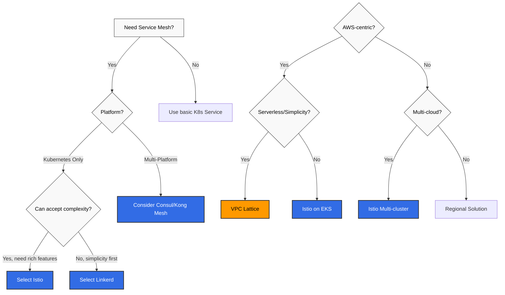

# 比較ガイド

> **最終更新**: July 7, 2026 **対象読者**: アーキテクト、DevOps エンジニア、Platform エンジニア

このセクションでは、さまざまな Service Mesh とネットワーキングソリューションを比較し、各ソリューションの長所、短所、および適切なユースケースを紹介します。

## 目次

### 1. [Service Mesh ソリューション比較](01-service-mesh-comparison.md)

Kubernetes 環境で利用できる主要な Service Mesh ソリューションの比較:

* **Istio** - 機能が豊富なエンタープライズグレードの Service Mesh
* **Linkerd** - 軽量で使いやすい Service Mesh
* **Kong Mesh** - Kuma をベースとしたユニバーサル Service Mesh
* **Consul Connect** - HashiCorp の Service Mesh ソリューション

**比較基準**:

* アーキテクチャとコンポーネント
* パフォーマンスとリソース使用量
* 機能セット（トラフィック管理、セキュリティ、可観測性）
* 学習曲線と運用の複雑さ
* マルチクラスターサポート
* スケーラビリティとプラットフォームサポート

### 2. [Istio vs VPC Lattice](02-istio-vs-lattice.md)

Kubernetes Service Mesh（Istio）と AWS ネイティブなサービスネットワーキング（VPC Lattice）の比較:

**Istio Service Mesh**:

* Kubernetes 中心の Service Mesh
* 豊富なトラフィック管理および可観測性機能
* クラウド中立

**AWS VPC Lattice**:

* AWS ネイティブなサービスネットワーキング
* サーバーレスアーキテクチャ
* シンプルなマルチアカウント/VPC 接続

**比較基準**:

* アーキテクチャとデプロイメントモデル
* トラフィック管理機能
* セキュリティモデル
* 運用オーバーヘッド
* コスト構造
* ハイブリッドおよびマルチクラウドサポート

### 3. [Sidecar vs Ambient Mode 選定ガイド](03-sidecar-vs-ambient.md)

EKS 1.36 上で Istio の sidecar モードと ambient モードを選択するための、テスト結果に基づく意思決定ガイド:

* mTLS、NetworkPolicy、レイテンシー、ゼロダウンタイムロールアウト（waypoint 503）の 4 要件に対するテスト結果
* sidecar よりも ambient waypoint 経由で高い 503 発生率を示す計測データ
* ワークロード層（core / semi-core / periphery）ごとの段階的な混在デプロイメント推奨事項

**比較基準**:

* mTLS の強制と検証
* HBONE ポートにおける NetworkPolicy の相互作用
* ロールアウト中の 503 発生率（計測値）
* 非冪等 API におけるリトライポリシーのリスク

## 選定ガイド

### Service Mesh の選定基準

### ユースケース別の推奨事項

#### 大企業

**推奨**: Istio

* 豊富な機能セット
* きめ細かなトラフィック制御
* 強力なセキュリティ（Authorization Policies、mTLS）
* マルチクラスター Federation
* 広範なエコシステムとコミュニティ

**代替**: Kong Mesh（ユニバーサル control plane が必要な場合）

#### スタートアップ / クイックスタート

**推奨**: Linkerd

* シンプルなインストールと運用
* 低いリソースオーバーヘッド
* 短い学習曲線
* 自動 mTLS とメトリクス

**代替**: VPC Lattice（AWS 中心のアーキテクチャの場合）

#### AWS ネイティブアーキテクチャ

**推奨**: VPC Lattice

* フルマネージドサービス
* 運用オーバーヘッドなし
* AWS サービス統合（Lambda、ECS、EKS）
* シンプルなクロス VPC/アカウント接続

**代替**: EKS 上の Istio（より豊富な機能が必要な場合）

#### マルチクラウド / ハイブリッド

**推奨**: Istio または Consul Connect

* クラウド中立
* VM ワークロードサポート
* マルチクラスター Federation
* 一貫したポリシーと可観測性

#### レガシーシステム統合

**推奨**: Consul Connect または Kong Mesh

* VM ワークロードを優先したサポート
* 段階的な移行が可能
* Service Discovery 統合
* 多様なプラットフォームサポート

#### 強力な可観測性の要件

**推奨**: Istio

* 豊富なメトリクス（Prometheus、OpenTelemetry）
* 分散トレーシング（Jaeger、Zipkin、Tempo）
* 詳細なアクセスログ
* Kiali 統合
* Grafana ダッシュボード

**代替**: Linkerd（シンプルな可観測性要件の場合）

## クイック比較表

### Service Mesh 比較

| 基準               | Istio        | Linkerd        | Kong Mesh   | Consul Connect |
| ---------------------- | ------------ | -------------- | ----------- | -------------- |
| **アーキテクチャ**       | Envoy proxy  | Linkerd2-proxy | Envoy proxy | Consul proxy   |
| **リソース使用量**     | 高い         | 低い           | 中程度      | 中程度         |
| **学習曲線**     | 急           | 緩やか         | 中程度      | 中程度         |
| **機能の豊富さ**   | 5/5          | 3/5            | 4/5         | 4/5            |
| **マルチクラスター**      | 優れている   | サポート済み   | 優れている  | 優れている     |
| **VM サポート**         | 制限あり     | なし           | 優れている  | 優れている     |
| **コミュニティ**          | 非常に大規模 | 中規模         | 中規模      | 大規模         |
| **エンタープライズサポート** | Google Cloud | Buoyant        | Kong        | HashiCorp      |

### Istio vs VPC Lattice 比較

| 基準                   | Istio             | VPC Lattice                 |
| -------------------------- | ----------------- | --------------------------- |
| **デプロイメントモデル**       | 自己管理          | フルマネージド              |
| **プラットフォーム**               | Kubernetes        | AWS (EKS, ECS, EC2, Lambda) |
| **運用の複雑さ** | 高い              | 低い                        |
| **機能の豊富さ**       | 5/5               | 3/5                         |
| **トラフィック制御**        | 非常にきめ細かい  | 基本的                      |
| **コストモデル**             | リソースベース    | 使用量ベース                |
| **ベンダーロックイン**         | 低い              | 高い（AWS）                 |
| **マルチクラウド**            | サポート済み      | AWS のみ                    |

## 関連リソース

### Istio ドキュメント

* [Istio アーキテクチャ](https://github.com/Atom-oh/kubernetes-docs/blob/main/en/service-mesh/istio/istio/architecture/README.md)
* [Istio トラフィック管理](https://github.com/Atom-oh/kubernetes-docs/blob/main/en/service-mesh/istio/istio/traffic-management/README.md)
* [Istio セキュリティ](https://github.com/Atom-oh/kubernetes-docs/blob/main/en/service-mesh/istio/istio/security/README.md)
* [Istio 可観測性](https://github.com/Atom-oh/kubernetes-docs/blob/main/en/service-mesh/istio/istio/observability/README.md)

### VPC Lattice ドキュメント

* [VPC Lattice 概要](https://github.com/Atom-oh/kubernetes-docs/blob/main/en/service-mesh/istio/vpc-lattice.md)

### 外部リファレンス

* [Istio 公式ドキュメント](https://istio.io/latest/docs/)
* [Linkerd 公式ドキュメント](https://linkerd.io/2.15/overview/)
* [Kong Mesh 公式ドキュメント](https://docs.konghq.com/mesh/)
* [Consul Connect ドキュメント](https://www.consul.io/docs/connect)
* [AWS VPC Lattice ドキュメント](https://docs.aws.amazon.com/vpc-lattice/)

## 移行ガイド

### Linkerd から Istio

* より多くの機能が必要な場合
* 段階的移行: namespace 単位で移行
* Annotation ベースの設定から Istio CRD への移行

### 基本的な Kubernetes から Service Mesh

* トラフィック管理、セキュリティ、可観測性のニーズ増加
* Canary デプロイメント: 一部のサービスから開始
* sidecar injection の影響を評価

### VPC Lattice から Istio（またはその逆）

* マルチクラウド要件と AWS ネイティブ志向の比較
* 機能の豊富さと運用のシンプルさの比較
* ハイブリッドアプローチ: 同時利用が可能

## FAQ

Q1: Service Mesh は絶対に必要ですか？

**回答**: Service Mesh は、次の場合に推奨されます:

* 数十以上のマイクロサービス
* きめ細かなトラフィック制御（Canary、A/B Testing）が必要
* 強力なセキュリティ要件（mTLS、Authorization）
* 分散トレーシングと可観測性
* マルチクラスター通信

**小規模なサービス**または**シンプルなアーキテクチャ**では、基本的な Kubernetes Service と Ingress で十分な場合があります。

Q2: Istio と Linkerd のどちらを選ぶべきですか？

**Istio を選択**:

* 豊富な機能が必要な場合
* 大企業環境
* きめ細かなトラフィック制御とポリシー
* マルチクラスター Federation

**Linkerd を選択**:

* シンプルかつ迅速な開始が必要な場合
* リソース効率が重要な場合
* 基本的な Service Mesh 機能だけが必要な場合
* 運用の複雑さを最小化する場合

Q3: VPC Lattice はいつ使用すべきですか？

**VPC Lattice を推奨**:

* AWS 中心のアーキテクチャ
* EKS + ECS + Lambda の混在環境
* サーバーレス優先戦略
* 運用オーバーヘッドの最小化
* シンプルなマルチ VPC/アカウント接続

**Istio を推奨**（VPC Lattice の代わり）:

* マルチクラウド戦略
* きめ細かなトラフィック制御が必要
* 豊富な可観測性要件
* Kubernetes 中心のアーキテクチャ

Q4: Service Mesh のパフォーマンスオーバーヘッドはどの程度ですか？

**Istio**:

* レイテンシー増加: 1-3ms（平均）
* CPU オーバーヘッド: 5-15%
* メモリ: Pod あたり +50-150MB

**Linkerd**:

* レイテンシー増加: 0.5-1ms（平均）
* CPU オーバーヘッド: 3-8%
* メモリ: Pod あたり +20-50MB

**VPC Lattice**:

* マネージドサービスのためインフラストラクチャオーバーヘッドなし
* 追加のネットワークホップによるわずかなレイテンシー増加
* 使用量ベースのコストが発生

Q5: 複数の Service Mesh を同時に使用できますか？

**回答**: 技術的には可能ですが、推奨されません。

**問題**:

* sidecar の競合の可能性
* 複雑なトラブルシューティング
* 二重のオーバーヘッド
* 責任分界が不明確

**例外的なユースケース**:

* **Istio + VPC Lattice**: クラスター内部には Istio、クラスター間/外部接続には VPC Lattice
* **段階的移行**: Linkerd から Istio（namespace 単位で移行）

***

**次のステップ**: 詳細な比較ドキュメントを読み、環境に最適なソリューションを選択してください。
