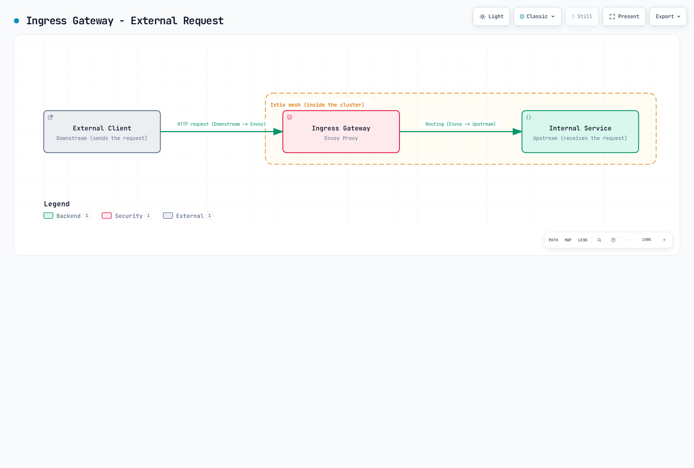

# Istio 用語集

> **レビュー対象バージョン**: Istio 1.31.0
> **最終更新**: September 13, 2026

この用語集では、Istio とサービスメッシュに関する主要な用語を、グループ別の参照セクションにまとめています。

> **参照先の言語**: 以下の Architecture および DestinationRule のセクションリンクは、継続的に更新される英語ガイドを参照します。各言語の翻訳がまだ同期されていない場合も、これらのリンクから現在の参照情報を確認できます。

## 目次

- [A-C](#a-c)
- [D-F](#d-f)
- [G-I](#g-i)
- [J-L](#j-l)
- [M-O](#m-o)
- [P-R](#p-r)
- [S-U](#s-u)
- [V-Z](#v-z)

---

## A-C {#a-c}

### AuthorizationPolicy {#authorizationpolicy}

選択したワークロードや対象リソースに対して、ALLOW、DENY、CUSTOM、AUDIT の動作を定義する Istio のセキュリティポリシーです。認証と認可は別の機能です。waypoint のポリシーは targetRefs を使用します。

### Control Plane {#control-plane}

istiod が実装する、設定、サービス検出、アイデンティティ管理の層です。アプリケーションのペイロードは istiod ではなく、データプレーンのプロキシを通ります。

### Ambient Mode {#ambient-mode}

Istio 1.18 で alpha として初めて提供され、Istio 1.24 から一般提供されているデータプレーンモードです。Sidecar Proxy なしでサービスメッシュ機能を提供します。

**特徴**:
- Sidecar コンテナが不要
- ノードレベルの ztunnel を使用
- リソース効率の向上
- L4 機能と L7 機能の分離

**関連ドキュメント**: [Ambient Mode](advanced/01-ambient-mode.md)

---

### Certificate Authority (CA) {#certificate-authority-ca}

サービス間の mTLS 通信に用いる証明書を発行、管理する認証局です。

**Istio での役割**:
- Istiod の Citadel 機能が CA の役割を担う
- SPIFFE ID に基づく証明書を発行
- 証明書を自動更新（デフォルト TTL：24 時間）

**関連用語**: [Citadel](#citadel)、[SPIFFE](#spiffe-secure-production-identity-framework-for-everyone)、[mTLS](#mtls-mutual-tls)

---

### Circuit Breaker

障害のあるサービスへのリクエストを遮断し、システム全体への障害伝播を防ぐパターンです。

**動作**:
1. **Closed**: 通常動作
2. **Open**: 連続した失敗の後にリクエストを遮断
3. **Half-Open**: 一定時間後に一部のリクエストを許可

**Istio の実装**: 接続プールのサーキットブレーカーと、エンドポイントごとの異常検出による除外は、この三状態のステートマシンをそのまま公開するものではありません。
```yaml
apiVersion: networking.istio.io/v1
kind: DestinationRule
metadata:
  name: glossary-example-1
spec:
  host: reviews
  trafficPolicy:
    outlierDetection:
      consecutive5xxErrors: 5
      interval: 30s
      baseEjectionTime: 30s
```

**関連ドキュメント**: [Circuit Breaker](traffic-management/07-circuit-breaker.md)

---

### Citadel {#citadel}

Istio 1.4 までは独立して存在していたセキュリティコンポーネントです。現在は Istiod に統合されています。

**主な機能**:
- 認証局（CA）の管理
- SPIFFE ID の発行と管理
- X.509 証明書の生成と更新

**現在の状態**: Istio 1.5+ では Istiod 内の機能として存在

**関連用語**: [Istiod](#istiod)、[Certificate Authority](#certificate-authority-ca)

---

### CDS (Cluster Discovery Service) {#cds-cluster-discovery-service}

Envoy が上流サービス（クラスター）の設定を動的に受け取るための xDS API の一つです。

**提供される情報**:
- クラスター名と種類
- 負荷分散ポリシー
- ヘルスチェック設定
- サーキットブレーカー設定
- TLS 設定

**関連用語**: [xDS](#xds-discovery-service)、[Envoy](#envoy-proxy)

---

## D-F {#d-f}

### Data Plane

サービスメッシュで実際のトラフィックを処理する層です。

**Istio のデータプレーン**:
- Envoy sidecar、または ambient の ztunnel と任意の L7 waypoint
- メッシュに登録されたトラフィックを処理。除外設定とプロトコルの制約が適用される
- mTLS の暗号化／復号
- メトリクス収集

**関連用語**: [Control Plane](#control-plane)、[Envoy](#envoy-proxy)

---

### DestinationRule

VirtualService でルーティングされるトラフィックのポリシーを定義する Istio CRD です。

**主な機能**:
- Subset の定義（バージョン、リージョンなど）
- 負荷分散ポリシー
- 接続プール設定
- サーキットブレーカー設定
- TLS 設定

```yaml
apiVersion: networking.istio.io/v1
kind: DestinationRule
metadata:
  name: reviews
spec:
  host: reviews
  subsets:
  - name: v1
    labels:
      version: v1
  - name: v2
    labels:
      version: v2
```

**関連ドキュメント**: [DestinationRule](traffic-management/03-destination-rule.md)

---

### eBPF (Extended Berkeley Packet Filter) {#ebpf-extended-berkeley-packet-filter}

Linux カーネル内でプログラムを安全に実行できるようにする技術です。

Istio は Cilium などの eBPF ベースのプライマリ CNI と共存できます。Istio CNI はリダイレクトを設定する独立したチェーン型プラグイン／ノードエージェントです。ambient は eBPF を必須とせず、プライマリ CNI を置き換えるものでもありません。

**利点**:
- 低いオーバーヘッド
- カーネルレベルの処理
- 動的なプログラミング機能

**関連用語**: [Ambient Mode](#ambient-mode)、[iptables](#iptables)

---

### EDS (Endpoint Discovery Service) {#eds-endpoint-discovery-service}

クラスター内の実際のエンドポイント（Pod IP）を動的に提供する xDS API の一つです。

**提供される情報**:
- エンドポイントの IP アドレスとポート
- 正常性の状態
- 負荷分散の重み
- ローカリティ情報

**例**:
```json
{
  "cluster_name": "outbound|9080||reviews",
  "endpoints": [
    {
      "lb_endpoints": [
        {"endpoint": {"address": {"socket_address": {"address": "10.244.1.5", "port_value": 9080}}}},
        {"endpoint": {"address": {"socket_address": {"address": "10.244.2.8", "port_value": 9080}}}}
      ]
    }
  ]
}
```

**関連用語**: [xDS](#xds-discovery-service)、[CDS](#cds-cluster-discovery-service)

---

### Envoy Proxy {#envoy-proxy}

Istio のデータプレーンを構成する高性能な L7 プロキシです。

**歴史**:
- 2016 年に Lyft の Matt Klein が開発
- 2017 年に CNCF Incubating プロジェクトに
- 2018 年に CNCF Graduated プロジェクトに

**主な特徴**:
- C++ で記述された高性能プロキシ
- xDS API による動的設定
- HTTP/1.1、HTTP/2、gRPC のサポート
- 豊富な可観測性機能

**構成要素**:
- Listener：ポートのリッスン
- Filter：リクエスト／レスポンス処理
- Router：ルーティング判断
- Cluster：上流サービス

**関連ドキュメント**: [アーキテクチャ - Envoy Proxy](https://www.atomai.click/kubernetes-docs/en/service-mesh/istio/03-architecture#data-plane-envoy-proxy)

---

## G-I {#g-i}

### Galley

Istio 1.4 までは独立して存在していた設定検証コンポーネントです。現在は Istiod に統合されています。

**主な機能**:
- Istio 設定の検証
- Kubernetes リソースの処理
- 設定デプロイ前のエラーチェック

**現在の状態**: Istio 1.5+ では Istiod 内の機能として存在

**関連用語**: [Istiod](#istiod)

---

### Gateway

サービスメッシュに入る外部トラフィックのエントリーポイントを定義する Istio CRD です。

**種類**:
1. **Ingress Gateway**: 外部から内部へのトラフィック
2. **Egress Gateway**: 内部から外部へのトラフィック

```yaml
apiVersion: networking.istio.io/v1
kind: Gateway
metadata:
  name: my-gateway
spec:
  selector:
    istio: ingressgateway
  servers:
  - port:
      number: 80
      name: http
      protocol: HTTP
    hosts:
    - "example.com"
```

**関連ドキュメント**: [Gateway と VirtualService](traffic-management/01-gateway-virtualservice.md)

---

### gRPC

Google が開発した高性能な RPC（Remote Procedure Call）フレームワークです。

**Istio との関係**:
- xDS API は gRPC ベース
- Istiod と Envoy の通信に使用
- HTTP/2 ベース（多重化をサポート）

**利点**:
- 双方向ストリーミング
- 低レイテンシー
- Protocol Buffers を使用

**関連用語**: [xDS](#xds-discovery-service)

---

### Identity {#identity}

サービスメッシュ内のワークロードのアイデンティティを表します。

**Istio のアイデンティティ**:
- SPIFFE ID 形式を使用
- Kubernetes ServiceAccount に基づく
- X.509 証明書で証明

**例**:
```
spiffe://cluster.local/ns/default/sa/reviews
```

**関連用語**: [SPIFFE](#spiffe-secure-production-identity-framework-for-everyone)、[mTLS](#mtls-mutual-tls)

---

### iptables {#iptables}

Linux のネットワークトラフィックを制御するファイアウォールツールです。

**Istio での役割**:
- istio-init または Istio CNI ノードエージェントがトラフィックのリダイレクトを設定
- Pod の全トラフィックを Envoy にリダイレクト
- NAT テーブル（PREROUTING、OUTPUT チェーン）を使用

**簡略化したルール（説明用であり、インストールスクリプトではない）**:
```bash
# Outbound: All traffic except Envoy -> 15001
iptables -t nat -A OUTPUT -p tcp -m owner ! --uid-owner 1337 -j REDIRECT --to-port 15001

# Inbound: All traffic -> 15006
iptables -t nat -A PREROUTING -p tcp -j REDIRECT --to-port 15006
```

**セットアップの代替策**: Istio CNI がノードレベルで特権ネットワーク設定を実行します。

**関連ドキュメント**: [アーキテクチャ - iptables](https://www.atomai.click/kubernetes-docs/en/service-mesh/istio/03-architecture#iptables-and-traffic-interception)

---

### Istiod {#istiod}

Istio 1.5+ の統合コントロールプレーンコンポーネントです。

**統合された機能**:
- **Pilot**: サービス検出、トラフィック管理
- **Citadel**: 認証局、アイデンティティ
- **Galley**: 設定検証

**実行方式**:
- 単一の Go バイナリ：`pilot-discovery`
- 全機能が一つのプロセス内で動作
- デフォルトポート：15012（xDS）、15017（Webhook）

**利点**:
- 複雑さの低減
- 運用の簡素化
- リソース効率

**関連ドキュメント**: [アーキテクチャ - Istiod](https://www.atomai.click/kubernetes-docs/en/service-mesh/istio/03-architecture#control-plane-istiod)

---

## J-L {#j-l}

### LDS (Listener Discovery Service) {#lds-listener-discovery-service}

Envoy がリッスンするポートとフィルターチェーンを動的に受け取るための xDS API の一つです。

**提供される情報**:
- リスナーのアドレスとポート
- プロトコル（HTTP、TCP）
- フィルターチェーン設定
- TLS 設定

**Istio のデフォルトリスナー**:
- `0.0.0.0:15001`：アウトバウンド TCP
- `0.0.0.0:15006`：インバウンド TCP
- `0.0.0.0:15021`：ヘルスチェック
- `0.0.0.0:15090`：Prometheus メトリクス

**関連用語**: [xDS](#xds-discovery-service)、[Envoy](#envoy-proxy)

---

### Locality-aware Load Balancing {#locality-aware-load-balancing}

ローカリティ（リージョン、ゾーン）情報を考慮する負荷分散方式です。

**優先順位**:
1. 同じゾーンのエンドポイント
2. 同じリージョンの別ゾーン
3. 別リージョン

**設定例**:
```yaml
apiVersion: networking.istio.io/v1
kind: DestinationRule
metadata:
  name: glossary-example-2
spec:
  host: reviews
  trafficPolicy:
    loadBalancer:
      localityLbSetting:
        enabled: true
        distribute:
        - from: us-west/zone-1a/*
          to:
            "us-west/zone-1a/*": 80
            "us-west/zone-1b/*": 20
```

**関連ドキュメント**: [ゾーン対応ルーティング](resilience/03-zone-aware-routing.md)

---

## M-O {#m-o}

### Mixer

Istio 1.4 まで存在したポリシーとテレメトリのコンポーネントです。

**主な機能**:
- ポリシーの適用（レート制限、アクセス制御）
- テレメトリ収集

**削除された理由**:
- 性能上のオーバーヘッド（リクエストごとの Mixer 呼び出し）
- 複雑なアーキテクチャ

**現在の状態**: 1.5 への移行時に非推奨となり、残っていた Mixer の機能は 1.8 で削除

**関連用語**: [Istiod](#istiod)

---

### mTLS (Mutual TLS) {#mtls-mutual-tls}

クライアントとサーバーが相互に認証する双方向 TLS 通信方式です。

**Istio の mTLS**:
- 証明書の自動発行と更新
- SPIFFE ID ベースの認証
- TLS 暗号スイートはネゴシエーションされ、AES-256-GCM に固定されない

**モード**:
1. **STRICT**: mTLS のみ許可
2. **PERMISSIVE**: mTLS と平文を許可（移行用）
3. **DISABLE**: sidecar モードで Istio のトランスポート mTLS を無効化。ambient では非対応

```yaml
apiVersion: security.istio.io/v1
kind: PeerAuthentication
metadata:
  name: default
spec:
  mtls:
    mode: STRICT
```

**関連ドキュメント**: [mTLS](security/01-mtls.md)

---

### Outlier Detection

異常な動作を示すエンドポイントを自動的に除外する機能です。

**検出条件**:
- 連続エラー数
- エラー率
- 接続失敗／タイムアウト。レイテンシーだけでは異常エンドポイント除外の閾値にならない

```yaml
apiVersion: networking.istio.io/v1
kind: DestinationRule
metadata:
  name: glossary-example-3
spec:
  host: reviews
  trafficPolicy:
    outlierDetection:
      consecutive5xxErrors: 5
      interval: 30s
      baseEjectionTime: 30s
      maxEjectionPercent: 50
```

**関連ドキュメント**: [異常検出](resilience/01-outlier-detection.md)

---

## P-R {#p-r}

### Downstream {#downstream}

Envoy から見て、**リクエストを送信する側**を指します。つまり、Envoy に対して接続を開始するクライアントです。

**Envoy の Downstream**:
- Envoy に入る接続（インバウンド）
- リクエストを送るクライアント
- Listener が受け付ける接続

**トラフィックの流れ**:
```
Downstream (Client)  ->  Envoy Proxy  ->  Upstream (Backend)
```

**シナリオ例**:

#### 1. Sidecar モード - アウトバウンドリクエスト


[🔍 インタラクティブな図を見る](https://www.atomai.click/kubernetes-docs/archmaps/en-service-mesh-istio-glossary-0.html)

**視点**:
- **Envoy から見た場合**: アプリケーションは Downstream（リクエスト送信側）
- **Envoy から見た場合**: バックエンドサービスは Upstream（リクエスト受信側）

#### 2. Ingress Gateway - 外部リクエスト



[🔍 インタラクティブな図を見る](https://www.atomai.click/kubernetes-docs/archmaps/en-service-mesh-istio-glossary-1.html)

**Downstream に関する Envoy 設定**:

```yaml
# Listener - Receive Downstream connections
apiVersion: networking.istio.io/v1alpha3
kind: EnvoyFilter
metadata:
  name: downstream-config
  namespace: default
spec:
  workloadSelector:
    labels:
      app: reviews
  configPatches:
  - applyTo: LISTENER
    match:
      context: SIDECAR_INBOUND
    patch:
      operation: MERGE
      value:
        per_connection_buffer_limit_bytes: 32768  # Downstream buffer
```

**Downstream メトリクス**:
```bash
# Downstream connection count
envoy_listener_downstream_cx_active

# Downstream request count
envoy_http_downstream_rq_total

# Downstream response time
envoy_http_downstream_rq_time
```

**関連用語**: [Upstream](#upstream)、[Envoy](#envoy-proxy)、[Listener](#lds-listener-discovery-service)

---

### Upstream {#upstream}

Envoy から見て、**リクエストを受信する側**を指します。つまり、Envoy が接続を開始する先のバックエンドサービスです。

**Envoy の Upstream**:
- Envoy から出る接続（アウトバウンド）
- リクエストを処理するバックエンドサービス
- Cluster が管理するエンドポイント

**トラフィックの流れ**:
```
Downstream (Client)  ->  Envoy Proxy  ->  Upstream (Backend)
```

**Upstream の構成要素**:

#### 1. Cluster（上流グループ）

```yaml
# Define Upstream Cluster with DestinationRule
apiVersion: networking.istio.io/v1
kind: DestinationRule
metadata:
  name: reviews
spec:
  host: reviews  # Upstream service
  trafficPolicy:
    loadBalancer:
      simple: ROUND_ROBIN
    connectionPool:
      tcp:
        maxConnections: 100      # Upstream connection limit
      http:
        http1MaxPendingRequests: 50
        http2MaxRequests: 100
    outlierDetection:
      consecutive5xxErrors: 5        # Upstream failure detection
      interval: 30s
```

#### 2. Endpoint（実際の上流インスタンス）

```bash
# Check upstream endpoints
istioctl proxy-config endpoints <pod-name> | grep reviews

# Example output:
# ENDPOINT              STATUS      CLUSTER
# 10.244.1.5:9080       HEALTHY     outbound|9080||reviews.default.svc.cluster.local
# 10.244.2.8:9080       HEALTHY     outbound|9080||reviews.default.svc.cluster.local
# 10.244.3.12:9080      UNHEALTHY   outbound|9080||reviews.default.svc.cluster.local
```

**Upstream のトラフィックポリシー**:

```yaml
apiVersion: networking.istio.io/v1
kind: DestinationRule
metadata:
  name: glossary-example-4
spec:
  host: reviews
  trafficPolicy:
    # Upstream load balancing
    loadBalancer:
      consistentHash:
        httpHeaderName: "x-user-id"

    # Upstream connection pool
    connectionPool:
      tcp:
        maxConnections: 100
        connectTimeout: 30s
      http:
        h2UpgradePolicy: UPGRADE

    # Upstream TLS
    tls:
      mode: ISTIO_MUTUAL

    # Upstream Circuit Breaker
    outlierDetection:
      consecutive5xxErrors: 5
      interval: 10s
      baseEjectionTime: 30s
```

**Upstream と Downstream の比較**:

| 項目 | Downstream | Upstream |
|------|-----------|----------|
| **方向** | Envoy に入る（インバウンド） | Envoy から出る（アウトバウンド） |
| **役割** | リクエスト送信（クライアント） | リクエスト受信（サーバー） |
| **Envoy 設定** | Listener、Filter Chain | Cluster、Endpoint |
| **例** | 外部ユーザー、他のサービス | バックエンド API、データベース |
| **メトリクス** | `downstream_cx_*`、`downstream_rq_*` | `upstream_cx_*`、`upstream_rq_*` |

**実際の利用例**:

#### シナリオ 1：Service A -> Service B の呼び出し

```
+---------------------------------------------------------+
| Service A Pod                                           |
|                                                         |
|  App --> Envoy Sidecar                                 |
|          |                                              |
|          | Downstream: App                              |
|          | Upstream: Service B                          |
+----------|-------------------------------------------------+
           |
           v
+---------------------------------------------------------+
| Service B Pod                                           |
|                                                         |
|          Envoy Sidecar --> App                          |
|          |                                              |
|          | Downstream: Service A Envoy                  |
|          | Upstream: Local App (Service B)              |
+---------------------------------------------------------+
```

**Service A の Envoy の視点**:
- Downstream：Service A のアプリケーション
- Upstream：Service B

**Service B の Envoy の視点**:
- Downstream：Service A の Envoy
- Upstream：Service B のアプリケーション（ローカル）

#### シナリオ 2：Ingress Gateway

```
External Client (Downstream)
        |
Ingress Gateway (Envoy)
        |
Internal Service (Upstream)
```

**Upstream メトリクス**:

```bash
# Upstream connection count
envoy_cluster_upstream_cx_active

# Upstream request counter; derive success/error rates from response-class counters
envoy_cluster_upstream_rq_total

# Upstream response time
envoy_cluster_upstream_rq_time

# Upstream health check
envoy_cluster_health_check_success

# Upstream Circuit Breaker
envoy_cluster_circuit_breakers_default_remaining_rq
```

**上流のパッシブヘルス検出**: アクティブヘルスチェックの統計には別途設定が必要です。

```yaml
apiVersion: networking.istio.io/v1
kind: DestinationRule
metadata:
  name: glossary-example-5
spec:
  host: reviews
  trafficPolicy:
    outlierDetection:
      # Upstream health detection
      consecutiveGatewayErrors: 5
      consecutive5xxErrors: 5
      interval: 10s
      baseEjectionTime: 30s
      maxEjectionPercent: 50
```

**デバッグ**:

```bash
# 1. Check upstream cluster
istioctl proxy-config clusters <pod-name> --fqdn reviews.default.svc.cluster.local

# 2. Check upstream endpoint status
istioctl proxy-config endpoints <pod-name> --cluster "outbound|9080||reviews.default.svc.cluster.local"

# 3. Check upstream metrics
kubectl exec <pod-name> -c istio-proxy -- \
  curl -s localhost:15000/stats/prometheus | grep upstream

# 4. Check upstream connections
istioctl proxy-config all <pod-name> -o json | \
  jq '.configs[] | select(.["@type"] | contains("ClustersConfigDump"))'
```

**関連用語**: [Downstream](#downstream)、[Envoy](#envoy-proxy)、[Cluster](#cds-cluster-discovery-service)、[Endpoint](#eds-endpoint-discovery-service)

---

### Pilot

Istio 1.4 までは独立して存在していたトラフィック管理コンポーネントです。現在は Istiod に統合されています。

**主な機能**:
- サービス検出
- トラフィック管理（VirtualService、DestinationRule の処理）
- xDS サーバー

**現在の状態**: Istio 1.5+ では Istiod 内の機能として存在

**関連用語**: [Istiod](#istiod)、[xDS](#xds-discovery-service)

---

### RDS (Route Discovery Service)

HTTP ルーティングルールを動的に提供する xDS API の一つです。

**提供される情報**:
- ルートのマッチングルール（パス、ヘッダーなど）
- 重み付きルーティング
- リダイレクトと書き換えのルール
- タイムアウトとリトライの設定

**VirtualService との関係**:
- VirtualService -> Istiod による変換 -> RDS 設定

**関連用語**: [xDS](#xds-discovery-service)、[VirtualService](#virtualservice)

---

### Rate Limiting

単位時間当たりに許可するリクエスト数を制限する機能です。

**実装方式**:
1. **Local Rate Limiting**: Envoy 内でローカルに処理
2. **Global Rate Limiting**: 外部のレート制限サービスを使用

```yaml
apiVersion: networking.istio.io/v1alpha3
kind: EnvoyFilter
metadata:
  name: filter-local-ratelimit
  namespace: default
spec:
  workloadSelector:
    labels:
      app: reviews
  configPatches:
  - applyTo: HTTP_FILTER
    match:
      context: SIDECAR_INBOUND
      listener:
        filterChain:
          filter:
            name: envoy.filters.network.http_connection_manager
            subFilter:
              name: envoy.filters.http.router
    patch:
      operation: INSERT_BEFORE
      value:
        name: envoy.filters.http.local_ratelimit
        typed_config:
          "@type": type.googleapis.com/envoy.extensions.filters.http.local_ratelimit.v3.LocalRateLimit
          stat_prefix: http_local_rate_limiter
          token_bucket:
            max_tokens: 100
            tokens_per_fill: 100
            fill_interval: 1s
          filter_enabled:
            default_value:
              numerator: 100
              denominator: HUNDRED
          filter_enforced:
            default_value:
              numerator: 100
              denominator: HUNDRED
```

**関連ドキュメント**: [レート制限](resilience/02-rate-limiting.md)

---

## S-U {#s-u}

### SDS (Secret Discovery Service)

TLS 証明書と鍵を動的に提供する xDS API の一つです。

**提供される情報**:
- X.509 証明書
- 秘密鍵
- CA ルート証明書

**利点**:
- ファイルシステムが不要
- 証明書の自動更新
- 無停止での更新

**関連用語**: [xDS](#xds-discovery-service)、[mTLS](#mtls-mutual-tls)

---

### Service Entry {#service-entry}

サービスメッシュ外のサービスをメッシュに登録する Istio CRD です。

**ユースケース**:
- 外部 API のアクセス制御
- 外部サービスへの Istio 機能の適用（リトライ、タイムアウトなど）
- Egress Gateway との連携

```yaml
apiVersion: networking.istio.io/v1
kind: ServiceEntry
metadata:
  name: external-api
spec:
  hosts:
  - api.external.com
  ports:
  - number: 443
    name: https
    protocol: HTTPS
  location: MESH_EXTERNAL
  resolution: DNS
```

**関連ドキュメント**: [ServiceEntry](traffic-management/12-service-entry.md)

---

### Service Mesh

マイクロサービス間の通信を管理するインフラストラクチャ層です。

**主な機能**:
- トラフィック管理（ルーティング、負荷分散）
- セキュリティ（mTLS、認証／認可）
- 可観測性（メトリクス、ログ、トレーシング）
- レジリエンシー（リトライ、サーキットブレーカー）

**主な実装**:
- Istio
- Linkerd
- Consul Connect
- AWS App Mesh（[September 30, 2026 にサポート終了](https://docs.aws.amazon.com/app-mesh/latest/userguide/what-is-app-mesh.html)）

---

### SigV4 (AWS Signature Version 4)

AWS API リクエストを認証するための署名プロトコルです。

**動作**:


[🔍 インタラクティブな図を見る](https://www.atomai.click/kubernetes-docs/archmaps/en-service-mesh-istio-glossary-2.html)

**署名の構成要素**:

1. **Canonical Request**: 正規化されたリクエスト形式
   - HTTP メソッド
   - URI パス
   - クエリ文字列
   - ヘッダー
   - ペイロードのハッシュ

2. **String to Sign**: 署名対象の文字列
   - アルゴリズム：`AWS4-HMAC-SHA256`
   - タイムスタンプ
   - 認証情報のスコープ
   - Canonical Request のハッシュ

3. **Signing Key**: 署名鍵の計算
   ```
   HMAC(HMAC(HMAC(HMAC("AWS4" + SecretKey, Date), Region), Service), "aws4_request")
   ```

4. **Signature**: 最終的な署名
   ```
   HMAC(SigningKey, StringToSign)
   ```

**Istio との連携**:

AWS SDK と AWS CLI は、IRSA または EKS Pod Identity から提供される一時的な認証情報を使い、HTTPS リクエストに署名します。これにより、署名とワークロードの AWS 権限が対応付けられます。Istio の mTLS アイデンティティと AWS IAM アイデンティティは別のものです。

Envoy の `aws_request_signing` HTTP フィルターは高度な代替手段です。この拡張を含む Envoy ビルド、**プロキシコンテナ**で利用できる認証情報、正しい AWS サービス／リージョン、対象の AWS 宛先だけに限定したフィルターマッチが必要です。署名に影響するヘッダー／パスの書き換えの後、ルーターの前に挿入してください。アプリケーションが開始した HTTPS は、この HTTP フィルターからは内容を検査できません。Envoy は暗号化された TLS 内に署名を追加できないため、プロキシ署名の設計では署名プロキシに HTTP を渡し、上流へ検証済みの TLS 接続を開始する必要があります。TLS の二重開始や、意図したローカルプロキシ経路の外に未署名 HTTP を露出させることは避けてください。

上の図は、明示的に設定したこの署名プロキシの経路を説明するもので、Istio のデフォルト機能ではありません。アプリケーション ServiceAccount の IRSA 注釈だけでは、ゲートウェイや sidecar に必要な認証情報の環境設定とトークンマウントが存在することは確認できません。

**この認証は JWT 検証ではない**:

SigV4 は HMAC によるリクエスト署名であり、JWT ではありません。`https://sts.amazonaws.com/.well-known/jwks` は AWS API 署名を検証するための JWT 発行者エンドポイントではありません。Istio RequestAuthentication は実在する OIDC 発行者の JWT を検証します。CUSTOM AuthorizationPolicy には、外部認可を実装した `extensionProviders` サービスの設定も必要であり、その実装なしに SigV4 を検証することはできません。AWS API アクセスには、IAM 認証を行う AWS エンドポイントまたは AWS SDK を優先してください。

**読み取り専用の確認例**（対象 IAM ロールを持つワークロードに AWS CLI がインストールされている場合）:

```bash
aws sts get-caller-identity
aws s3api head-object --bucket my-bucket --key object.txt --region us-west-2
```

**運用上の考慮事項**:

- ワークロードには必要な AWS アクションとリソースへの権限だけを付与し、共有のノードインスタンスロールへの依存を避けてください。
- 選択した認証情報プロバイダーが一時的な認証情報と更新に対応していることを確認してください。セッション期間は設定可能であり、一律に一時間ではありません。
- CloudTrail の管理イベントとデータイベントでは記録範囲が異なります。S3 オブジェクトアクセスには適切なデータイベント設定が必要です。
- プロキシ設定でフィルターの配置を確認してください。config dump に稼働中の各リクエストの Authorization ヘッダーが表示されるわけではなく、HTTPS の未署名 curl は SigV4 のテストにはなりません。
- 実際のリクエストサイズで署名、バッファリング、認証情報取得のオーバーヘッドを測定してください。固定のミリ秒単位のオーバーヘッドは保証されません。

**関連用語**: [AuthorizationPolicy](#authorizationpolicy)、[ServiceEntry](#service-entry)、[EnvoyFilter](advanced/03-envoy-filter.md)

**参考資料**:
- [AWS Signature Version 4](https://docs.aws.amazon.com/general/latest/gr/signature-version-4.html)
- [Envoy AWS Request Signing](https://www.envoyproxy.io/docs/envoy/latest/configuration/http/http_filters/aws_request_signing_filter)
- [AWS との連携](04-aws-integration.md)

---

### Sidecar

アプリケーションコンテナと並べてデプロイする補助コンテナのパターンです。

**Istio の Sidecar**:
- コンテナ名：`istio-proxy`
- イメージ：`istio/proxyv2`
- Envoy Proxy を実行
- init コンテナまたは Istio CNI のリダイレクトにより、設定されたトラフィックを捕捉

**注入方式**:
1. **自動**: 名前空間ラベル
2. **手動**: `istioctl kube-inject`

```yaml
apiVersion: v1
kind: Namespace
metadata:
  name: example-mesh
  labels:
    istio-injection: enabled  # Automatic injection
```

**関連ドキュメント**: [Sidecar 注入](advanced/07-sidecar-injection.md)

---

### Sidecar Resource

Envoy が受け取るサービス情報を制限する Istio CRD です。

**目的**:
- メモリ使用量の削減
- 設定プッシュ時間の短縮
- 設定範囲の限定。ネットワークのセキュリティ境界ではない

```yaml
apiVersion: networking.istio.io/v1
kind: Sidecar
metadata:
  name: default
  namespace: default
spec:
  egress:
  - hosts:
    - "./*"  # Same namespace only
    - "istio-system/*"
```

**効果**:
- 取り込むサービスを減らすことでメモリや設定処理を削減できる場合がある。実際の削減量を測定する。

**関連ドキュメント**: [アーキテクチャ - Sidecar Resource](https://www.atomai.click/kubernetes-docs/en/service-mesh/istio/03-architecture#optimization-with-sidecar-resource)

---

### SPIFFE (Secure Production Identity Framework for Everyone) {#spiffe-secure-production-identity-framework-for-everyone}

クラウドネイティブ環境でワークロードのアイデンティティを証明する標準です。

**SPIFFE ID 形式**:
```
spiffe://trust-domain/path
```

**Istio の例**:
```
spiffe://cluster.local/ns/default/sa/reviews
  |         |           |     |      |    |
  |         |           |     |      |    +- ServiceAccount name
  |         |           |     |      +----- "sa" (ServiceAccount)
  |         |           |     +------------ Namespace name
  |         |           +------------------ "ns" (Namespace)
  |         +------------------------------ Trust Domain
  +---------------------------------------- Protocol
```

**構成要素**:
- **SPIFFE ID**: ワークロードの識別子
- **SVID (SPIFFE Verifiable Identity Document)**: X.509-SVID または JWT-SVID。Istio mTLS は X.509-SVID を使用

**関連用語**: [Identity](#identity)、[mTLS](#mtls-mutual-tls)

---

### Subset

DestinationRule で定義されるサービスの論理的なグループです。

**一般的な用途**:
- バージョン別：`v1`、`v2`、`v3`
- デプロイ段階別：`stable`、`canary`、`test`
- リージョン別：`us-west`、`us-east`、`eu-central`

```yaml
apiVersion: networking.istio.io/v1
kind: DestinationRule
metadata:
  name: glossary-example-6
spec:
  host: reviews
  subsets:
  - name: v1
    labels:
      version: v1
  - name: v2
    labels:
      version: v2
```

**関連ドキュメント**: [DestinationRule - Subset の概念](https://www.atomai.click/kubernetes-docs/en/service-mesh/istio/traffic-management/03-destination-rule#subset-concept)

---

## V-Z {#v-z}

### Waypoint Proxy {#waypoint-proxy}

Ambient Mode で L7 機能を提供するオプションのプロキシです。

**役割**:
- 名前空間、Service、Pod のラベルで選択する。ServiceAccount ごとに自動で選択されるものではない
- Envoy Proxy ベース
- L7 トラフィック管理機能を担当
- ztunnel と共に動作

**提供する機能**:
- L7 ルーティング（パス、ヘッダーベース）
- リトライとタイムアウト
- サーキットブレーカー
- 障害注入
- ヘッダー操作

**デプロイ例**:
```yaml
apiVersion: gateway.networking.k8s.io/v1
kind: Gateway
metadata:
  name: reviews-waypoint
  namespace: default
spec:
  gatewayClassName: istio-waypoint
  listeners:
  - name: mesh
    port: 15008
    protocol: HBONE
```

**特徴**:
- ztunnel は L4 のみ、waypoint は L7 を処理
- 必要なサービスだけで選択的に使用
- Sidecar より高いリソース効率（共有方式）
- 名前空間、Service、Pod のラベルで選択する。ServiceAccount ごとに自動で選択されるものではない

**関連用語**: [Ambient Mode](#ambient-mode)、[ztunnel](#ztunnel-zero-trust-tunnel)

---

waypoint の作成後は、例えば `kubectl label service reviews istio.io/use-waypoint=reviews-waypoint --overwrite` で対象サービスを登録してください。Gateway をデプロイするだけでは、その Gateway を経由するようにトラフィックはルーティングされません。

### VirtualService {#virtualservice}

サービスメッシュ内のトラフィックをどのようにルーティングするかを定義する Istio CRD です。

**主な機能**:
- URI、ヘッダー、クエリパラメーターに基づくルーティング
- 重み付きのトラフィック分配
- リトライとタイムアウトの設定
- 障害注入

```yaml
apiVersion: networking.istio.io/v1
kind: VirtualService
metadata:
  name: reviews
spec:
  hosts:
  - reviews
  http:
  - match:
    - uri:
        prefix: "/v2"
    route:
    - destination:
        host: reviews
        subset: v2
  - route:
    - destination:
        host: reviews
        subset: v1
```

**関連ドキュメント**: [Gateway と VirtualService](traffic-management/01-gateway-virtualservice.md)

---

### WASM (WebAssembly)

Web ブラウザーで実行するために設計されたバイナリ命令形式です。Istio では Envoy プロキシの機能を拡張するために使用します。

**Istio での用途**:
- Envoy Filter として独自のロジックを追加
- 再デプロイせずに機能を動的に拡張
- 多様な言語で記述可能（Rust、C++、Go など）
- サンドボックス環境で安全に実行

**主なユースケース**:
1. **独自の認証／認可**: 複雑なビジネスロジックの実装
2. **リクエスト／レスポンス変換**: ヘッダー操作、ペイロード変換
3. **高度なルーティング**: 独自のルーティングロジック
4. **メトリクス収集**: 用途に特化したテレメトリ

以下のレジストリ URL、ダイジェスト、認証情報、pluginConfig フィールドは、自分でビルドしたプラグイン用のプレースホルダーです。Istio がこれらの例示イメージを提供したり、プラグイン固有のオプションを解釈したりするわけではありません。file:// のモジュールはプロキシコンテナ内に存在する必要があります。

**WASM プラグインの例**:
```yaml
apiVersion: extensions.istio.io/v1alpha1
kind: WasmPlugin
metadata:
  name: custom-auth
  namespace: istio-system
spec:
  selector:
    matchLabels:
      istio: ingressgateway
  url: oci://ghcr.io/my-org/custom-auth:v1.0.0
  phase: AUTHN
  pluginConfig:
    api_key_header: "X-API-Key"
    validate_endpoint: "https://auth.example.com/validate"
```

**デプロイ方式**:

#### 1. OCI レジストリ経由のデプロイ（推奨）

```yaml
apiVersion: extensions.istio.io/v1alpha1
kind: WasmPlugin
metadata:
  name: rate-limiter
spec:
  url: oci://ghcr.io/my-org/rate-limit:v1.0.0
  imagePullPolicy: Always
  imagePullSecret: registry-credential
```

#### 2. HTTP URL 経由のデプロイ

```yaml
apiVersion: extensions.istio.io/v1alpha1
kind: WasmPlugin
metadata:
  name: custom-filter
spec:
  url: https://example.com/filters/custom-filter.wasm
  # Add sha256: with the actual 64-character module digest before deployment
```

#### 3. ローカルファイルのデプロイ

```yaml
apiVersion: extensions.istio.io/v1alpha1
kind: WasmPlugin
metadata:
  name: local-filter
spec:
  url: file:///etc/istio/filters/custom.wasm
```

**WASM 開発例（Rust）**:

```rust
use proxy_wasm::traits::*;
use proxy_wasm::types::*;

proxy_wasm::main! {{
    proxy_wasm::set_http_context(|_, _| -> Box<dyn HttpContext> {
        Box::new(CustomFilter)
    });
}}

struct CustomFilter;
impl Context for CustomFilter {}

impl HttpContext for CustomFilter {
    fn on_http_request_headers(&mut self, _: usize, _: bool) -> Action {
        // Demonstrate header mutation, not production API-key authentication.
        self.set_http_request_header("x-mesh-demo", Some("wasm"));
        Action::Continue
    }
}
```

**ビルドとデプロイの前提条件**:

互換性のある `proxy-wasm` 依存関係を持つ Rust の `cdylib` クレートを使い、依存バージョンをロックしてください。上のコールバックは[公式 Rust SDK の例](https://github.com/proxy-wasm/proxy-wasm-rust-sdk/tree/main/examples/http_headers)に従っています。`wasm32-unknown-unknown` ターゲットをインストールしてモジュールをビルドし、生成された `.wasm` を対応する OCI Wasm イメージにパッケージ化してから WasmPlugin で参照します。Dockerfile のない一般的な `docker build` では、そのパッケージ化は行われません。

```bash
rustup target add wasm32-unknown-unknown
cargo build --target wasm32-unknown-unknown --release
```

対象プラグインの起動時間、メモリ、リクエストごとのオーバーヘッドを測定してください。Wasm はプロキシプロセス内のランタイムサンドボックスで実行されます。独立したプロセスではなく、無条件のセキュリティや性能の保証でもありません。

**Ambient Mode のサポート**:

```yaml
apiVersion: extensions.istio.io/v1alpha1
kind: WasmPlugin
metadata:
  name: waypoint-filter
spec:
  targetRefs:
  - group: gateway.networking.k8s.io
    kind: Gateway
    name: reviews-waypoint
  url: oci://ghcr.io/filters/custom:latest
  phase: AUTHN
```

**デバッグ**:

```bash
# Check WASM plugin status
kubectl get wasmplugin -A

# Check WASM-related logs in Envoy logs
kubectl logs <pod-name> -c istio-proxy | grep wasm

# Check WASM module load
istioctl proxy-config all <pod-name> -o json | jq '.. | objects | select(has("@type")) | select(.["@type"] | test("wasm"; "i"))'
```

**セキュリティ上の考慮事項**:
1. **サンドボックス分離**: Envoy 内のランタイムサンドボックス。プラグインの信頼性とリソース使用を確認する
2. **リソース制限**: CPU とメモリの制限を設定可能
3. **完全性の検証**: SHA256 は内容を確認するもので、発行者を認証するものではない
4. **最小権限**: 必要な権限だけを付与

**利点**:
- 高い性能（ネイティブコードレベル）
- 安全なサンドボックス実行
- 再デプロイせずに更新可能
- 複数言語のサポート
- 標準 OCI イメージ形式

**制約**:
- 一部のシステムコールに制限
- 制限付きのファイル I/O
- ネットワーク呼び出しは Envoy API 経由のみ

**関連用語**: [Envoy](#envoy-proxy)、[Waypoint Proxy](#waypoint-proxy)、[Ambient Mode](#ambient-mode)

**参考資料**:
- [Istio WASM Plugin](https://istio.io/latest/docs/reference/config/proxy_extensions/wasm-plugin/)
- [Proxy-Wasm SDK](https://github.com/proxy-wasm)
- [WebAssembly 公式サイト](https://webassembly.org/)
- [Ambient Mode - WASM](https://istio.io/latest/docs/ambient/usage/extend-waypoint-wasm/)

---

### xDS (Discovery Service) {#xds-discovery-service}

Envoy Proxy を動的に設定するための API 群です。

**「xDS」の意味**:
- `x`：さまざまな種類を表す変数
- `DS`：Discovery Service

**xDS API の種類**:

| API | 名前 | 役割 |
|-----|------|------|
| **LDS** | Listener Discovery Service | リッスンするポートとフィルターチェーン |
| **RDS** | Route Discovery Service | HTTP ルーティングルール |
| **CDS** | Cluster Discovery Service | 上流サービス設定 |
| **EDS** | Endpoint Discovery Service | 実際の Pod IP 一覧 |
| **SDS** | Secret Discovery Service | TLS 証明書と鍵 |

**通信方式**:
- プロトコル：gRPC
- ポート：15012（Istiod）
- 双方向ストリーミング

**順序**:
```
Agent bootstraps identity -> Envoy subscribes to ADS resources
Istiod pushes LDS/CDS/EDS/RDS updates; local agent serves SDS certificates
```

**関連ドキュメント**: [アーキテクチャ - xDS API 通信](https://www.atomai.click/kubernetes-docs/en/service-mesh/istio/03-architecture#xds-api-communication)

---

### Zone

Kubernetes のアベイラビリティーゾーンを表します。

**ラベル形式**:
```yaml
topology.kubernetes.io/zone: us-west-1a
```

**Istio での用途**:
- ローカリティを考慮した負荷分散
- ゾーン対応ルーティング
- 同じゾーンを優先するルーティング

**関連用語**: [Locality-aware Load Balancing](#locality-aware-load-balancing)

---

### ztunnel (Zero Trust Tunnel) {#ztunnel-zero-trust-tunnel}

Ambient Mode の中心的なコンポーネントで、ノードレベルで実行される軽量 L4 プロキシです。

**役割**:
- 各ノードに DaemonSet としてデプロイ
- 全 Pod の L4 トラフィックを処理
- Sidecar なしでサービスメッシュ機能を提供
- CNI プラグインと連携

**提供する機能**:
- **mTLS**: 自動的な暗号化／復号
- **L4 テレメトリ**: メトリクス収集
- **アイデンティティ**: ServiceAccount ベースの認証
- **L4 負荷分散**: 基本的な負荷分散

**技術的な特徴**:
- Rust で記述（高性能）
- Istio CNI が管理するトラフィックリダイレクト
- init コンテナが不要
- 共有する L4 プロキシのリソース。測定したノードのワークロードからサイズを決める

**デプロイ例**:
```bash
# Use the reviewed istioctl version and the complete ambient installation profile
istioctl install --set profile=ambient
kubectl rollout status daemonset/ztunnel -n istio-system
```

既存の sidecar ワークロードでは、ambient に登録する前に注入／リビジョンラベルを削除し、Pod を再起動して sidecar を取り除いてください。新しい sidecar のないワークロードでは再起動は不要です。

**名前空間の有効化**:
```bash
# Enable Ambient Mode
kubectl label namespace default istio-injection- istio.io/rev-
kubectl label namespace default istio.io/dataplane-mode=ambient --overwrite
```

**利点**:
- メモリ削減の可能性はノード／ワークロードと waypoint の容量による
- Pod の再起動が不要
- アプリケーションに対して透過的
- 初期レイテンシーの最小化

**制約**:
- L7 機能には Waypoint Proxy が必要
- 対応する Linux Kubernetes プラットフォーム、プライマリ CNI、Istio CNI の前提条件が必要

**関連用語**: [Ambient Mode](#ambient-mode)、[Waypoint Proxy](#waypoint-proxy)、[eBPF](#ebpf-extended-berkeley-packet-filter)

---

## 参考資料

### 公式ドキュメント
- [Istio 用語集](https://istio.io/latest/docs/reference/glossary/)
- [Envoy 用語](https://www.envoyproxy.io/docs/envoy/latest/intro/arch_overview/intro/terminology)
- [SPIFFE 仕様](https://github.com/spiffe/spiffe/tree/main/standards)

### 関連ドキュメント
- [Istio アーキテクチャ](03-architecture.md)
- [トラフィック管理](traffic-management/README.md)
- [セキュリティ](security/README.md)
- [可観測性](observability/README.md)

---

**最終更新**: September 11, 2026

- [Destination Rule](https://istio.io/latest/docs/reference/config/networking/destination-rule/)
- [Istio CNI ノードエージェントのインストール](https://istio.io/latest/docs/setup/additional-setup/cni/)
- [Ztunnel のトラフィックリダイレクト](https://istio.io/latest/docs/ambient/architecture/traffic-redirection/)
- [istioctl によるインストール](https://istio.io/latest/docs/ambient/install/istioctl/)
- [waypoint プロキシの設定](https://istio.io/latest/docs/ambient/usage/waypoint/)
- [Envoy を使ったレート制限の有効化](https://istio.io/latest/docs/tasks/policy-enforcement/rate-limit/)
- [Wasm Plugin](https://istio.io/latest/docs/reference/config/proxy_extensions/wasm-plugin/)
- [Proxy-Wasm Rust SDK の HTTP 例](https://raw.githubusercontent.com/proxy-wasm/proxy-wasm-rust-sdk/main/examples/http_headers/src/lib.rs)
- [API リクエストの AWS Signature Version 4 - AWS Identity and Access Management](https://docs.aws.amazon.com/IAM/latest/UserGuide/reference_sigv.html)
- [AWS Request Signing](https://www.envoyproxy.io/docs/envoy/latest/configuration/http/http_filters/aws_request_signing_filter)
- [統計](https://www.envoyproxy.io/docs/envoy/latest/configuration/upstream/cluster_manager/cluster_stats)
- [Istio 1.8 の変更点](https://istio.io/latest/news/releases/1.8.x/announcing-1.8/change-notes/)
- [AWS App Mesh とは - AWS App Mesh](https://docs.aws.amazon.com/app-mesh/latest/userguide/what-is-app-mesh.html)

- [CloudTrail データイベントの記録範囲](https://docs.aws.amazon.com/awscloudtrail/latest/userguide/logging-data-events-with-cloudtrail.html)
