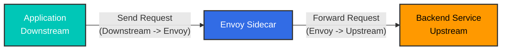
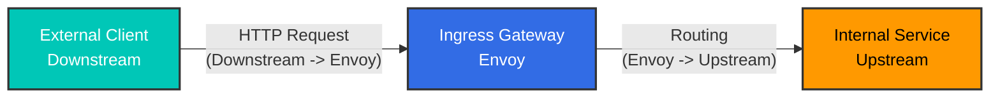
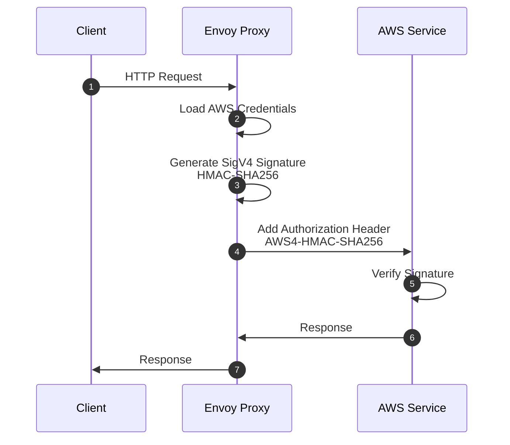

# Istio 用語集

> **サポート対象バージョン**: Istio 1.28+
> **最終更新**: February 23, 2026

この用語集では、Istio と Service Mesh に関連する主要な用語をアルファベット順に整理しています。

## 目次

- [A-C](#a-c)
- [D-F](#d-f)
- [G-I](#g-i)
- [J-L](#j-l)
- [M-O](#m-o)
- [P-R](#p-r)
- [S-U](#s-u)
- [V-Z](#v-z)

---

## A-C

### Ambient Mode

Sidecar Proxy なしで Service Mesh 機能を提供する、Istio 1.20+ で導入された新しい Data Plane モードです。

**機能**:
- Sidecar コンテナが不要
- ノードレベルで ztunnel を使用
- リソース効率の向上
- L4 と L7 機能の分離

**関連ドキュメント**: [Ambient Mode](advanced/01-ambient-mode.md)

---

### Certificate Authority (CA)

サービス間の mTLS 通信に使用する証明書を発行・管理する認証局です。

**Istio での役割**:
- Istiod の Citadel 機能が CA の役割を実行
- SPIFFE ID に基づいて証明書を発行
- 証明書の自動更新（デフォルト TTL: 24 時間）

**関連用語**: [Citadel](#citadel), [SPIFFE](#spiffe), [mTLS](#mtls)

---

### Circuit Breaker

障害が発生したサービスへのリクエストを遮断し、システム全体への障害の伝播を防ぐパターンです。

**仕組み**:
1. **Closed**: 通常動作
2. **Open**: 連続した障害の後にリクエストを遮断
3. **Half-Open**: 一定時間後に一部のリクエストを許可

**Istio での実装**:
```yaml
apiVersion: networking.istio.io/v1
kind: DestinationRule
spec:
  trafficPolicy:
    outlierDetection:
      consecutiveErrors: 5
      interval: 30s
      baseEjectionTime: 30s
```

**関連ドキュメント**: [Circuit Breaker](traffic-management/07-circuit-breaker.md)

---

### Citadel

Istio 1.4 より前は独立して存在していたセキュリティコンポーネントです。現在は Istiod に統合されています。

**主な機能**:
- Certificate Authority (CA) の管理
- SPIFFE ID の発行と管理
- X.509 証明書の生成と更新

**現在の状態**: Istio 1.5+ では Istiod 内の内部機能として存在

**関連用語**: [Istiod](#istiod), [Certificate Authority](#certificate-authority-ca)

---

### CDS (Cluster Discovery Service)

Envoy がアップストリームサービス（Cluster）の設定を動的に受信できるようにする xDS API の 1 つです。

**提供される情報**:
- Cluster 名とタイプ
- Load Balancing ポリシー
- ヘルスチェック設定
- Circuit Breaker 設定
- TLS 設定

**関連用語**: [xDS](#xds), [Envoy](#envoy)

---

## D-F

### Data Plane

Service Mesh で実際のトラフィックを処理するレイヤーです。

**Istio の Data Plane**:
- Envoy Proxy（Sidecar または Ambient Mode）
- すべての Inbound/Outbound トラフィックを処理
- mTLS の暗号化/復号
- メトリクス収集

**関連用語**: [Control Plane](#control-plane), [Envoy](#envoy)

---

### DestinationRule

VirtualService によってルーティングされるトラフィックのポリシーを定義する Istio CRD です。

**主な機能**:
- Subset 定義（バージョン、リージョンなど）
- Load Balancing ポリシー
- Connection Pool 設定
- Circuit Breaker 設定
- TLS 設定

```yaml
apiVersion: networking.istio.io/v1
kind: DestinationRule
metadata:
  name: reviews
spec:
  host: reviews
  subsets:
  - name: v1
    labels:
      version: v1
  - name: v2
    labels:
      version: v2
```

**関連ドキュメント**: [DestinationRule](traffic-management/03-destination-rule.md)

---

### eBPF (Extended Berkeley Packet Filter)

Linux カーネル内でプログラムを安全に実行できる技術です。

**Istio での使用**:
- Ambient Mode の中核技術
- iptables を置き換え（より高速なパフォーマンス）
- CNI プラグインを介したトラフィックのインターセプト
- Init Container が不要

**利点**:
- 低オーバーヘッド
- カーネルレベルの処理
- 動的プログラミング機能

**関連用語**: [Ambient Mode](#ambient-mode), [iptables](#iptables)

---

### EDS (Endpoint Discovery Service)

Cluster 内の実際の Endpoint（Pod IP）を動的に提供する xDS API の 1 つです。

**提供される情報**:
- Endpoint の IP アドレスとポート
- ヘルス状態
- Load Balancing の重み
- Locality 情報

**例**:
```json
{
  "cluster_name": "outbound|9080||reviews",
  "endpoints": [
    {
      "lb_endpoints": [
        {"endpoint": {"address": {"socket_address": {"address": "10.244.1.5", "port_value": 9080}}}},
        {"endpoint": {"address": {"socket_address": {"address": "10.244.2.8", "port_value": 9080}}}}
      ]
    }
  ]
}
```

**関連用語**: [xDS](#xds), [CDS](#cds-cluster-discovery-service)

---

### Envoy Proxy

Istio の Data Plane を構成する高性能な L7 Proxy です。

**歴史**:
- 2016 年に Lyft の Matt Klein が開発
- 2017 年に CNCF Incubating プロジェクトに選定
- 2018 年に CNCF Graduated プロジェクトに選定

**主な機能**:
- C++ で記述された高性能 Proxy
- xDS API による動的設定
- HTTP/1.1、HTTP/2、gRPC のサポート
- 豊富な可観測性

**コンポーネント**:
- Listeners: ポートのリッスン
- Filters: リクエスト/レスポンスの処理
- Routers: ルーティングの決定
- Clusters: アップストリームサービス

**関連ドキュメント**: [アーキテクチャ - Envoy Proxy](03-architecture.md#data-plane-envoy-proxy)

---

## G-I

### Galley

Istio 1.4 より前は独立して存在していた設定検証コンポーネントです。現在は Istiod に統合されています。

**主な機能**:
- Istio 設定の検証
- Kubernetes リソースの処理
- 設定デプロイ前のエラーチェック

**現在の状態**: Istio 1.5+ では Istiod 内の内部機能として存在

**関連用語**: [Istiod](#istiod)

---

### Gateway

Service Mesh に入る外部トラフィックのエントリポイントを定義する Istio CRD です。

**タイプ**:
1. **Ingress Gateway**: 外部から内部へのトラフィック
2. **Egress Gateway**: 内部から外部へのトラフィック

```yaml
apiVersion: networking.istio.io/v1
kind: Gateway
metadata:
  name: my-gateway
spec:
  selector:
    istio: ingressgateway
  servers:
  - port:
      number: 80
      name: http
      protocol: HTTP
    hosts:
    - "example.com"
```

**関連ドキュメント**: [Gateway と VirtualService](traffic-management/01-gateway-virtualservice.md)

---

### gRPC

Google が開発した高性能な RPC（Remote Procedure Call）フレームワークです。

**Istio との関係**:
- xDS API は gRPC ベース
- Istiod から Envoy への通信に使用
- HTTP/2 ベース（多重化をサポート）

**利点**:
- 双方向ストリーミング
- 低レイテンシ
- Protocol Buffers を使用

**関連用語**: [xDS](#xds)

---

### Identity

Service Mesh 内の Workload の ID を表します。

**Istio の Identity**:
- SPIFFE ID 形式を使用
- Kubernetes ServiceAccount に基づく
- X.509 証明書で証明

**例**:
```
spiffe://cluster.local/ns/default/sa/reviews
```

**関連用語**: [SPIFFE](#spiffe), [mTLS](#mtls)

---

### iptables

Linux でネットワークトラフィックを制御するファイアウォールツールです。

**Istio での役割**:
- istio-init コンテナが iptables ルールを設定
- すべての Pod トラフィックを Envoy にリダイレクト
- NAT テーブル（PREROUTING、OUTPUT チェーン）を使用

**主要ルール**:
```bash
# Outbound: All traffic except Envoy -> 15001
iptables -t nat -A OUTPUT -p tcp -m owner ! --uid-owner 1337 -j REDIRECT --to-port 15001

# Inbound: All traffic -> 15006
iptables -t nat -A PREROUTING -p tcp -j REDIRECT --to-port 15006
```

**代替手段**: eBPF（Ambient Mode）

**関連ドキュメント**: [アーキテクチャ - iptables](03-architecture.md#iptables-and-traffic-interception)

---

### Istiod

Istio 1.5+ における統合された Control Plane コンポーネントです。

**統合された機能**:
- **Pilot**: Service Discovery、Traffic Management
- **Citadel**: Certificate Authority、Identity
- **Galley**: Configuration Validation

**実行方法**:
- 単一の Go バイナリ: `pilot-discovery`
- すべての機能が単一プロセス内で実行
- デフォルトポート: 15012（xDS）、15017（Webhook）

**利点**:
- 複雑性の削減
- 運用の簡素化
- リソース効率

**関連ドキュメント**: [アーキテクチャ - Istiod](03-architecture.md#control-plane-istiod)

---

## J-L

### LDS (Listener Discovery Service)

Envoy がリッスンするポートと Filter Chain を動的に受信できるようにする xDS API の 1 つです。

**提供される情報**:
- Listener のアドレスとポート
- プロトコル（HTTP、TCP）
- Filter Chain の設定
- TLS 設定

**Istio のデフォルト Listener**:
- `0.0.0.0:15001`: Outbound TCP
- `0.0.0.0:15006`: Inbound TCP
- `0.0.0.0:15021`: ヘルスチェック
- `0.0.0.0:15090`: Prometheus メトリクス

**関連用語**: [xDS](#xds), [Envoy](#envoy)

---

### Locality-aware Load Balancing

Locality（Region、Zone）情報を考慮する Load Balancing 手法です。

**優先順位**:
1. 同じ Zone 内の Endpoint
2. 同じ Region 内の異なる Zone
3. 異なる Region

**設定例**:
```yaml
apiVersion: networking.istio.io/v1
kind: DestinationRule
spec:
  trafficPolicy:
    loadBalancer:
      localityLbSetting:
        enabled: true
        distribute:
        - from: us-west/zone-1a/*
          to:
            "us-west/zone-1a/*": 80
            "us-west/zone-1b/*": 20
```

**関連ドキュメント**: [Zone Aware Routing](resilience/03-zone-aware-routing.md)

---

## M-O

### Mixer

Istio 1.4 より前に存在していたポリシーおよびテレメトリコンポーネントです。

**主な機能**:
- ポリシーの適用（Rate Limiting、Access Control）
- テレメトリ収集

**削除された理由**:
- パフォーマンスオーバーヘッド（すべてのリクエストで Mixer 呼び出し）
- 複雑なアーキテクチャ

**現在の状態**: Istio 1.5+ で完全に削除（機能は Envoy に移行）

**関連用語**: [Istiod](#istiod)

---

### mTLS (Mutual TLS)

クライアントとサーバーが相互に認証する双方向の TLS 通信方式です。

**Istio の mTLS**:
- 証明書の自動発行と更新
- SPIFFE ID ベースの認証
- デフォルトの暗号化: AES-256-GCM

**モード**:
1. **STRICT**: mTLS のみを許可
2. **PERMISSIVE**: mTLS + 平文を許可（移行用）
3. **DISABLE**: 平文のみを許可

```yaml
apiVersion: security.istio.io/v1
kind: PeerAuthentication
metadata:
  name: default
spec:
  mtls:
    mode: STRICT
```

**関連ドキュメント**: [mTLS](security/01-mtls.md)

---

### Outlier Detection

異常な動作を示す Endpoint を自動的に除外する機能です。

**検出条件**:
- 連続エラー数
- エラー率
- レスポンスレイテンシ

```yaml
apiVersion: networking.istio.io/v1
kind: DestinationRule
spec:
  trafficPolicy:
    outlierDetection:
      consecutiveErrors: 5
      interval: 30s
      baseEjectionTime: 30s
      maxEjectionPercent: 50
```

**関連ドキュメント**: [Outlier Detection](resilience/01-outlier-detection.md)

---

## P-R

### Downstream

Envoy の観点では、これは**リクエストを送信する側**を指します。つまり、Envoy への接続を開始するクライアントです。

**Envoy の Downstream**:
- Envoy に入ってくる接続（Inbound）
- リクエストを送信するクライアント
- Listener が受信する接続

**トラフィックフロー**:
```
Downstream (Client)  ->  Envoy Proxy  ->  Upstream (Backend)
```

**シナリオ例**:

#### 1. Sidecar Mode - Outbound リクエスト



**観点**:
- **Envoy の観点**: Application は Downstream（リクエストを送信）
- **Envoy の観点**: Backend サービスは Upstream（リクエストを受信）

#### 2. Ingress Gateway - 外部リクエスト



**Downstream 関連の Envoy 設定**:

```yaml
# Listener - Receive Downstream connections
apiVersion: networking.istio.io/v1alpha3
kind: EnvoyFilter
metadata:
  name: downstream-config
spec:
  configPatches:
  - applyTo: LISTENER
    patch:
      operation: MERGE
      value:
        per_connection_buffer_limit_bytes: 32768  # Downstream buffer
        listener_filters:
        - name: envoy.filters.listener.tls_inspector
```

**Downstream メトリクス**:
```bash
# Downstream connection count
envoy_listener_downstream_cx_active

# Downstream request count
envoy_http_downstream_rq_total

# Downstream response time
envoy_http_downstream_rq_time
```

**関連用語**: [Upstream](#upstream), [Envoy](#envoy-proxy), [Listener](#lds-listener-discovery-service)

---

### Upstream

Envoy の観点では、これは**リクエストを受信する側**を指します。つまり、Envoy が接続を開始するバックエンドサービスです。

**Envoy の Upstream**:
- Envoy から出ていく接続（Outbound）
- リクエストを処理するバックエンドサービス
- Cluster が管理する Endpoint

**トラフィックフロー**:
```
Downstream (Client)  ->  Envoy Proxy  ->  Upstream (Backend)
```

**Upstream コンポーネント**:

#### 1. Cluster（Upstream グループ）

```yaml
# Define Upstream Cluster with DestinationRule
apiVersion: networking.istio.io/v1
kind: DestinationRule
metadata:
  name: reviews
spec:
  host: reviews  # Upstream service
  trafficPolicy:
    loadBalancer:
      simple: ROUND_ROBIN
    connectionPool:
      tcp:
        maxConnections: 100      # Upstream connection limit
      http:
        http1MaxPendingRequests: 50
        http2MaxRequests: 100
    outlierDetection:
      consecutiveErrors: 5        # Upstream failure detection
      interval: 30s
```

#### 2. Endpoint（実際の Upstream インスタンス）

```bash
# Check upstream endpoints
istioctl proxy-config endpoints <pod-name> | grep reviews

# Example output:
# ENDPOINT              STATUS      CLUSTER
# 10.244.1.5:9080       HEALTHY     outbound|9080||reviews.default.svc.cluster.local
# 10.244.2.8:9080       HEALTHY     outbound|9080||reviews.default.svc.cluster.local
# 10.244.3.12:9080      UNHEALTHY   outbound|9080||reviews.default.svc.cluster.local
```

**Upstream トラフィックポリシー**:

```yaml
apiVersion: networking.istio.io/v1
kind: DestinationRule
spec:
  host: reviews
  trafficPolicy:
    # Upstream load balancing
    loadBalancer:
      consistentHash:
        httpHeaderName: "x-user-id"

    # Upstream connection pool
    connectionPool:
      tcp:
        maxConnections: 100
        connectTimeout: 30s
      http:
        h2UpgradePolicy: UPGRADE

    # Upstream TLS
    tls:
      mode: ISTIO_MUTUAL

    # Upstream Circuit Breaker
    outlierDetection:
      consecutiveErrors: 5
      interval: 10s
      baseEjectionTime: 30s
```

**Upstream と Downstream の比較**:

| 項目 | Downstream | Upstream |
|------|-----------|----------|
| **方向** | Envoy に入る（Inbound） | Envoy から出る（Outbound） |
| **役割** | リクエストを送信（Client） | リクエストを受信（Server） |
| **Envoy 設定** | Listener、Filter Chain | Cluster、Endpoint |
| **例** | 外部ユーザー、他のサービス | Backend API、Database |
| **メトリクス** | `downstream_cx_*`, `downstream_rq_*` | `upstream_cx_*`, `upstream_rq_*` |

**実環境での例**:

#### シナリオ 1: Service A -> Service B 呼び出し

```
+---------------------------------------------------------+
| Service A Pod                                           |
|                                                         |
|  App --> Envoy Sidecar                                 |
|          |                                              |
|          | Downstream: App                              |
|          | Upstream: Service B                          |
+----------|-------------------------------------------------+
           |
           v
+---------------------------------------------------------+
| Service B Pod                                           |
|                                                         |
|          Envoy Sidecar --> App                          |
|          |                                              |
|          | Downstream: Service A Envoy                  |
|          | Upstream: Local App (Service B)              |
+---------------------------------------------------------+
```

**Service A の Envoy の観点**:
- Downstream: Service A の Application
- Upstream: Service B

**Service B の Envoy の観点**:
- Downstream: Service A の Envoy
- Upstream: Service B の Application（ローカル）

#### シナリオ 2: Ingress Gateway

```
External Client (Downstream)
        |
Ingress Gateway (Envoy)
        |
Internal Service (Upstream)
```

**Upstream メトリクス**:

```bash
# Upstream connection count
envoy_cluster_upstream_cx_active

# Upstream request success rate
envoy_cluster_upstream_rq_success_rate

# Upstream response time
envoy_cluster_upstream_rq_time

# Upstream health check
envoy_cluster_health_check_success

# Upstream Circuit Breaker
envoy_cluster_circuit_breakers_default_remaining
```

**Upstream ヘルスチェック**:

```yaml
apiVersion: networking.istio.io/v1
kind: DestinationRule
spec:
  host: reviews
  trafficPolicy:
    outlierDetection:
      # Upstream health detection
      consecutiveGatewayErrors: 5
      consecutive5xxErrors: 5
      interval: 10s
      baseEjectionTime: 30s
      maxEjectionPercent: 50
```

**デバッグ**:

```bash
# 1. Check upstream cluster
istioctl proxy-config clusters <pod-name> --fqdn reviews.default.svc.cluster.local

# 2. Check upstream endpoint status
istioctl proxy-config endpoints <pod-name> --cluster "outbound|9080||reviews.default.svc.cluster.local"

# 3. Check upstream metrics
kubectl exec <pod-name> -c istio-proxy -- \
  curl -s localhost:15000/stats/prometheus | grep upstream

# 4. Check upstream connections
istioctl proxy-config all <pod-name> -o json | \
  jq '.configs[] | select(.["@type"] | contains("ClustersConfigDump"))'
```

**関連用語**: [Downstream](#downstream), [Envoy](#envoy-proxy), [Cluster](#cds-cluster-discovery-service), [Endpoint](#eds-endpoint-discovery-service)

---

### Pilot

Istio 1.4 より前は独立して存在していたトラフィック管理コンポーネントです。現在は Istiod に統合されています。

**主な機能**:
- Service Discovery
- Traffic Management（VirtualService、DestinationRule の処理）
- xDS Server

**現在の状態**: Istio 1.5+ では Istiod 内の内部機能として存在

**関連用語**: [Istiod](#istiod), [xDS](#xds)

---

### RDS (Route Discovery Service)

HTTP ルーティングルールを動的に提供する xDS API の 1 つです。

**提供される情報**:
- ルート一致ルール（パス、ヘッダーなど）
- 重みベースのルーティング
- リダイレクトおよびリライトルール
- Timeout および Retry 設定

**VirtualService との関係**:
- VirtualService -> Istiod による変換 -> RDS 設定

**関連用語**: [xDS](#xds), [VirtualService](#virtualservice)

---

### Rate Limiting

単位時間あたりに許可するリクエスト数を制限する機能です。

**実装方法**:
1. **Local Rate Limiting**: Envoy によってローカルで処理
2. **Global Rate Limiting**: 外部の Rate Limit サービスを使用

```yaml
apiVersion: networking.istio.io/v1
kind: EnvoyFilter
metadata:
  name: filter-local-ratelimit
spec:
  configPatches:
  - applyTo: HTTP_FILTER
    patch:
      operation: INSERT_BEFORE
      value:
        name: envoy.filters.http.local_ratelimit
        typed_config:
          stat_prefix: http_local_rate_limiter
          token_bucket:
            max_tokens: 100
            tokens_per_fill: 100
            fill_interval: 1s
```

**関連ドキュメント**: [Rate Limiting](resilience/02-rate-limiting.md)

---

## S-U

### SDS (Secret Discovery Service)

TLS 証明書とキーを動的に提供する xDS API の 1 つです。

**提供される情報**:
- X.509 証明書
- Private Key
- CA Root Certificate

**利点**:
- ファイルシステムが不要
- 証明書の自動更新
- ダウンタイムなしの更新

**関連用語**: [xDS](#xds), [mTLS](#mtls)

---

### Service Entry

Service Mesh 外部のサービスをメッシュに登録する Istio CRD です。

**ユースケース**:
- 外部 API のアクセス制御
- 外部サービスへの Istio 機能の適用（Retry、Timeout など）
- Egress Gateway との統合

```yaml
apiVersion: networking.istio.io/v1
kind: ServiceEntry
metadata:
  name: external-api
spec:
  hosts:
  - api.external.com
  ports:
  - number: 443
    name: https
    protocol: HTTPS
  location: MESH_EXTERNAL
  resolution: DNS
```

**関連ドキュメント**: [ServiceEntry](traffic-management/12-service-entry.md)

---

### Service Mesh

マイクロサービス間の通信を管理するインフラストラクチャレイヤーです。

**中核機能**:
- Traffic Management（ルーティング、Load Balancing）
- セキュリティ（mTLS、認証/認可）
- 可観測性（メトリクス、ログ、トレーシング）
- レジリエンス（Retry、Circuit Breaker）

**主な実装**:
- Istio
- Linkerd
- Consul Connect
- AWS App Mesh

---

### SigV4 (AWS Signature Version 4)

AWS API リクエストを認証するための署名プロトコルです。

**仕組み**:



**署名の構成要素**:

1. **Canonical Request**: リクエストの標準化形式
   - HTTP メソッド
   - URI パス
   - クエリ文字列
   - ヘッダー
   - Payload ハッシュ

2. **String to Sign**: 署名対象の文字列
   - アルゴリズム: `AWS4-HMAC-SHA256`
   - タイムスタンプ
   - Credential Scope
   - Canonical Request ハッシュ

3. **Signing Key**: 署名キーの計算
   ```
   HMAC(HMAC(HMAC(HMAC("AWS4" + SecretKey, Date), Region), Service), "aws4_request")
   ```

4. **Signature**: 最終署名
   ```
   HMAC(SigningKey, StringToSign)
   ```

**Istio との統合**:

#### 1. EnvoyFilter による SigV4 認証

```yaml
apiVersion: networking.istio.io/v1alpha3
kind: EnvoyFilter
metadata:
  name: aws-sigv4-filter
  namespace: istio-system
spec:
  configPatches:
  - applyTo: HTTP_FILTER
    match:
      context: SIDECAR_OUTBOUND
      listener:
        filterChain:
          filter:
            name: envoy.filters.network.http_connection_manager
    patch:
      operation: INSERT_BEFORE
      value:
        name: envoy.filters.http.aws_request_signing
        typed_config:
          "@type": type.googleapis.com/envoy.extensions.filters.http.aws_request_signing.v3.AwsRequestSigning
          service_name: s3
          region: us-west-2
          use_unsigned_payload: false
          match_excluded_headers:
          - prefix: x-envoy
```

#### 2. External Authorization との統合

```yaml
apiVersion: security.istio.io/v1beta1
kind: RequestAuthentication
metadata:
  name: aws-auth
  namespace: default
spec:
  jwtRules:
  - issuer: "https://sts.amazonaws.com"
    audiences:
    - "sts.amazonaws.com"
    jwksUri: "https://sts.amazonaws.com/.well-known/jwks"
---
apiVersion: security.istio.io/v1beta1
kind: AuthorizationPolicy
metadata:
  name: require-aws-auth
  namespace: default
spec:
  action: CUSTOM
  provider:
    name: aws-sigv4-authorizer
  rules:
  - to:
    - operation:
        paths: ["/api/*"]
```

**ユースケースのシナリオ**:

#### シナリオ 1: S3 アクセス

```yaml
# Register S3 with ServiceEntry
apiVersion: networking.istio.io/v1beta1
kind: ServiceEntry
metadata:
  name: s3-external
spec:
  hosts:
  - "*.s3.amazonaws.com"
  ports:
  - number: 443
    name: https
    protocol: HTTPS
  location: MESH_EXTERNAL
  resolution: DNS
---
# Configure TLS with DestinationRule
apiVersion: networking.istio.io/v1beta1
kind: DestinationRule
metadata:
  name: s3-external
spec:
  host: "*.s3.amazonaws.com"
  trafficPolicy:
    tls:
      mode: SIMPLE
```

**Application コード**:
```python
import requests

# Envoy automatically adds SigV4 signature
response = requests.get("https://my-bucket.s3.us-west-2.amazonaws.com/object.txt")
print(response.text)
```

#### シナリオ 2: API Gateway 統合

```yaml
apiVersion: networking.istio.io/v1beta1
kind: VirtualService
metadata:
  name: aws-api-gateway
spec:
  hosts:
  - api.example.com
  http:
  - match:
    - uri:
        prefix: "/api"
    route:
    - destination:
        host: my-api.execute-api.us-west-2.amazonaws.com
        port:
          number: 443
```

#### シナリオ 3: DynamoDB アクセス

```yaml
apiVersion: networking.istio.io/v1alpha3
kind: EnvoyFilter
metadata:
  name: dynamodb-sigv4
spec:
  configPatches:
  - applyTo: HTTP_FILTER
    patch:
      operation: INSERT_BEFORE
      value:
        name: envoy.filters.http.aws_request_signing
        typed_config:
          "@type": type.googleapis.com/envoy.extensions.filters.http.aws_request_signing.v3.AwsRequestSigning
          service_name: dynamodb
          region: us-west-2
          host_rewrite: dynamodb.us-west-2.amazonaws.com
```

**AWS 認証情報の提供方法**:

1. **ServiceAccount + IRSA（推奨）**:
```yaml
apiVersion: v1
kind: ServiceAccount
metadata:
  name: app-sa
  annotations:
    eks.amazonaws.com/role-arn: arn:aws:iam::123456789012:role/app-role
```

2. **EC2 Instance Profile**:
   - ノードに割り当てられた IAM ロールを自動的に使用

3. **環境変数**:
```yaml
env:
- name: AWS_ACCESS_KEY_ID
  valueFrom:
    secretKeyRef:
      name: aws-credentials
      key: access-key-id
- name: AWS_SECRET_ACCESS_KEY
  valueFrom:
    secretKeyRef:
      name: aws-credentials
      key: secret-access-key
```

**セキュリティ上の考慮事項**:

1. **認証情報のローテーション**:
   - IRSA を使用した自動ローテーション
   - デフォルト TTL: 1 時間

2. **最小権限の原則**:
```json
{
  "Version": "2012-10-17",
  "Statement": [
    {
      "Effect": "Allow",
      "Action": [
        "s3:GetObject"
      ],
      "Resource": "arn:aws:s3:::my-bucket/*"
    }
  ]
}
```

3. **監査ログ**:
   - CloudTrail ですべての API 呼び出しを記録
   - Istio Access Log との統合

**デバッグ**:

```bash
# Check SigV4 signature in Envoy logs
kubectl logs <pod-name> -c istio-proxy | grep aws_request_signing

# Check Authorization header
kubectl exec -it <pod-name> -c istio-proxy -- \
  curl -v localhost:15000/config_dump | jq '.configs[] | select(.["@type"] == "type.googleapis.com/envoy.admin.v3.ClustersConfigDump")'

# Test AWS API call
kubectl exec -it <pod-name> -- \
  curl -v https://my-bucket.s3.amazonaws.com/test.txt
```

**パフォーマンスへの影響**:

| 操作 | レイテンシ |
|-----------|---------|
| SigV4 署名計算 | ~1-2ms |
| 認証情報のロード（キャッシュ） | ~0.1ms |
| 認証情報のロード（IRSA） | ~50ms（最初のリクエスト） |
| 合計オーバーヘッド | ~1-3ms |

**代替手段の比較**:

| 方法 | 利点 | 欠点 |
|--------|------------|---------------|
| **SigV4 (Envoy)** | Application コードの変更が不要 | Envoy 設定が必要 |
| **AWS SDK** | 柔軟な制御 | すべての App に SDK が必要 |
| **API Gateway** | マネージドソリューション | 追加コスト |

**関連用語**: [AuthorizationPolicy](#authorizationpolicy), [ServiceEntry](#service-entry), [EnvoyFilter](advanced/03-envoy-filter.md)

**参考資料**:
- [AWS Signature Version 4](https://docs.aws.amazon.com/general/latest/gr/signature-version-4.html)
- [Envoy AWS Request Signing](https://www.envoyproxy.io/docs/envoy/latest/configuration/http/http_filters/aws_request_signing_filter)
- [AWS Integration](04-aws-integration.md)

---

### Sidecar

Application コンテナと並行してデプロイされるヘルパーコンテナのパターンです。

**Istio の Sidecar**:
- コンテナ名: `istio-proxy`
- イメージ: `istio/proxyv2`
- Envoy Proxy を実行
- すべてのトラフィックをインターセプト（iptables または eBPF）

**Injection 方法**:
1. **自動**: Namespace ラベル
2. **手動**: `istioctl kube-inject`

```yaml
metadata:
  labels:
    istio-injection: enabled  # Automatic injection
```

**関連ドキュメント**: [Sidecar Injection](advanced/07-sidecar-injection.md)

---

### Sidecar Resource

Envoy が受信するサービス情報を制限する Istio CRD です。

**目的**:
- メモリ使用量の削減
- 設定 Push 時間の短縮
- ネットワーク分離

```yaml
apiVersion: networking.istio.io/v1
kind: Sidecar
metadata:
  name: default
  namespace: default
spec:
  egress:
  - hosts:
    - "./*"  # Same namespace only
    - "istio-system/*"
```

**効果**:
- 前: 1000 サービス -> 500 MB メモリ
- 後: 10 サービス -> 80 MB メモリ

**関連ドキュメント**: [アーキテクチャ - Sidecar Resource](03-architecture.md#optimization-through-sidecar-resource)

---

### SPIFFE (Secure Production Identity Framework for Everyone)

クラウドネイティブ環境で Workload Identity を証明するための標準です。

**SPIFFE ID 形式**:
```
spiffe://trust-domain/path
```

**Istio の例**:
```
spiffe://cluster.local/ns/default/sa/reviews
  |         |           |     |      |    |
  |         |           |     |      |    +- ServiceAccount name
  |         |           |     |      +----- "sa" (ServiceAccount)
  |         |           |     +------------ Namespace name
  |         |           +------------------ "ns" (Namespace)
  |         +------------------------------ Trust Domain
  +---------------------------------------- Protocol
```

**コンポーネント**:
- **SPIFFE ID**: Workload 識別子
- **SVID (SPIFFE Verifiable Identity Document)**: X.509 証明書

**関連用語**: [Identity](#identity), [mTLS](#mtls)

---

### Subset

DestinationRule で定義されるサービスの論理的なグループです。

**一般的な用途**:
- バージョン別: `v1`、`v2`、`v3`
- デプロイステージ別: `stable`、`canary`、`test`
- リージョン別: `us-west`、`us-east`、`eu-central`

```yaml
apiVersion: networking.istio.io/v1
kind: DestinationRule
spec:
  subsets:
  - name: v1
    labels:
      version: v1
  - name: v2
    labels:
      version: v2
```

**関連ドキュメント**: [DestinationRule - Subset の概念](traffic-management/03-destination-rule.md#subset-concept)

---

## V-Z

### Waypoint Proxy

Ambient Mode で L7 機能を提供するオプションの Proxy です。

**役割**:
- Service Account または Namespace ごとにデプロイ
- Envoy Proxy に基づく
- L7 トラフィック管理機能に特化
- ztunnel と連携

**提供される機能**:
- L7 ルーティング（Path、Header ベース）
- Retry と Timeout
- Circuit Breaker
- Fault Injection
- Header 操作

**デプロイ例**:
```yaml
apiVersion: gateway.networking.k8s.io/v1
kind: Gateway
metadata:
  name: reviews-waypoint
  namespace: default
spec:
  gatewayClassName: istio-waypoint
  listeners:
  - name: mesh
    port: 15008
    protocol: HBONE
```

**機能**:
- ztunnel は L4 のみを処理し、waypoint が L7 を処理
- 必要なサービスにのみ選択的に使用
- Sidecar よりもリソース効率が高い（共有アプローチ）
- Service Account または Namespace ごとにデプロイ

**関連用語**: [Ambient Mode](#ambient-mode), [ztunnel](#ztunnel-zero-trust-tunnel)

---

### VirtualService

Service Mesh 内でトラフィックをルーティングする方法を定義する Istio CRD です。

**主な機能**:
- URI、Header、Query Parameter に基づくルーティング
- 重みベースのトラフィック分散
- Retry と Timeout の設定
- Fault Injection

```yaml
apiVersion: networking.istio.io/v1
kind: VirtualService
metadata:
  name: reviews
spec:
  hosts:
  - reviews
  http:
  - match:
    - uri:
        prefix: "/v2"
    route:
    - destination:
        host: reviews
        subset: v2
  - route:
    - destination:
        host: reviews
        subset: v1
```

**関連ドキュメント**: [Gateway と VirtualService](traffic-management/01-gateway-virtualservice.md)

---

### WASM (WebAssembly)

Web ブラウザで実行するために設計されたバイナリ命令形式です。Istio では、Envoy Proxy の機能を拡張するために使用されます。

**Istio での使用**:
- Envoy Filter としてカスタムロジックを追加
- 再デプロイなしで機能を動的に拡張
- さまざまな言語（Rust、C++、Go など）で記述可能
- サンドボックス環境で安全に実行

**主なユースケース**:
1. **カスタム認証/認可**: 複雑なビジネスロジックを実装
2. **リクエスト/レスポンス変換**: Header 操作、Payload 変換
3. **高度なルーティング**: カスタムルーティングロジック
4. **メトリクス収集**: 特化したテレメトリ

**WASM Plugin の例**:
```yaml
apiVersion: extensions.istio.io/v1alpha1
kind: WasmPlugin
metadata:
  name: custom-auth
  namespace: istio-system
spec:
  selector:
    matchLabels:
      istio: ingressgateway
  url: oci://ghcr.io/my-org/custom-auth:v1.0.0
  phase: AUTHN
  pluginConfig:
    api_key_header: "X-API-Key"
    validate_endpoint: "https://auth.example.com/validate"
```

**デプロイ方法**:

#### 1. OCI Registry 経由のデプロイ（推奨）

```yaml
apiVersion: extensions.istio.io/v1alpha1
kind: WasmPlugin
metadata:
  name: rate-limiter
spec:
  url: oci://docker.io/istio/rate-limit:1.0.0
  imagePullPolicy: Always
  imagePullSecret: registry-credential
```

#### 2. HTTP URL 経由のデプロイ

```yaml
apiVersion: extensions.istio.io/v1alpha1
kind: WasmPlugin
metadata:
  name: custom-filter
spec:
  url: https://example.com/filters/custom-filter.wasm
  sha256: "8a8c3b5e..."
```

#### 3. ローカルファイルのデプロイ

```yaml
apiVersion: extensions.istio.io/v1alpha1
kind: WasmPlugin
metadata:
  name: local-filter
spec:
  url: file:///etc/istio/filters/custom.wasm
```

**WASM 開発例（Rust）**:

```rust
use proxy_wasm::traits::*;
use proxy_wasm::types::*;

#[no_mangle]
pub fn _start() {
    proxy_wasm::set_log_level(LogLevel::Trace);
    proxy_wasm::set_http_context(|_, _| -> Box<dyn HttpContext> {
        Box::new(CustomFilter)
    });
}

struct CustomFilter;

impl HttpContext for CustomFilter {
    fn on_http_request_headers(&mut self, _: usize) -> Action {
        // API Key validation
        match self.get_http_request_header("x-api-key") {
            Some(key) if key == "secret-key" => {
                Action::Continue
            }
            _ => {
                self.send_http_response(
                    403,
                    vec![("content-type", "text/plain")],
                    Some(b"Forbidden: Invalid API Key"),
                );
                Action::Pause
            }
        }
    }
}
```

**ビルドとデプロイ**:

```bash
# 1. Build WASM (Rust)
cargo build --target wasm32-unknown-unknown --release

# 2. Package as OCI image
docker build -t ghcr.io/my-org/custom-auth:v1.0.0 .
docker push ghcr.io/my-org/custom-auth:v1.0.0

# 3. Apply WasmPlugin
kubectl apply -f wasmplugin.yaml
```

**パフォーマンス特性**:

| メトリクス | 値 |
|--------|-------|
| 起動時間 | ~1-5ms |
| メモリオーバーヘッド | フィルターあたり ~100KB |
| 実行オーバーヘッド | リクエストあたり ~0.1-1ms |
| サンドボックス分離 | 保証済み |

**Ambient Mode のサポート**:

```yaml
apiVersion: extensions.istio.io/v1alpha1
kind: WasmPlugin
metadata:
  name: waypoint-filter
spec:
  selector:
    matchLabels:
      gateway.networking.k8s.io/gateway-name: reviews-waypoint
  url: oci://ghcr.io/filters/custom:latest
  phase: AUTHN
```

**デバッグ**:

```bash
# Check WASM plugin status
kubectl get wasmplugin -A

# Check WASM-related logs in Envoy logs
kubectl logs <pod-name> -c istio-proxy | grep wasm

# Check WASM module load
istioctl proxy-config all <pod-name> -o json | jq '.configs[] | select(.name | contains("wasm"))'
```

**セキュリティ上の考慮事項**:
1. **サンドボックス分離**: WASM モジュールは Envoy プロセスから分離された環境で実行
2. **リソース制限**: CPU とメモリの制限を設定可能
3. **署名検証**: SHA256 ハッシュによる完全性チェック
4. **最小権限**: 必要な権限のみを付与

**利点**:
- 高性能（ネイティブコードレベル）
- 安全なサンドボックス実行
- 再デプロイなしで更新可能
- マルチ言語のサポート
- 標準 OCI イメージ形式

**制限事項**:
- 一部のシステムコールは制限される
- ファイル I/O は限定的
- ネットワーク呼び出しは Envoy API 経由のみ

**関連用語**: [Envoy](#envoy-proxy), [Waypoint Proxy](#waypoint-proxy), [Ambient Mode](#ambient-mode)

**参考資料**:
- [Istio WASM Plugin](https://istio.io/latest/docs/concepts/wasm/)
- [Proxy-Wasm SDK](https://github.com/proxy-wasm)
- [WebAssembly Official Site](https://webassembly.org/)
- [Ambient Mode - WASM](advanced/01-ambient-mode.md#wasm-plugin)

---

### xDS (Discovery Service)

Envoy Proxy を動的に設定するための API セットです。

**「xDS」の意味**:
- `x`: さまざまなタイプを表す変数
- `DS`: Discovery Service

**xDS API タイプ**:

| API | 名前 | 役割 |
|-----|------|------|
| **LDS** | Listener Discovery Service | リッスンポートと Filter Chain |
| **RDS** | Route Discovery Service | HTTP ルーティングルール |
| **CDS** | Cluster Discovery Service | Upstream サービス設定 |
| **EDS** | Endpoint Discovery Service | 実際の Pod IP リスト |
| **SDS** | Secret Discovery Service | TLS 証明書とキー |

**通信方法**:
- プロトコル: gRPC
- ポート: 15012（Istiod）
- 双方向ストリーミング

**順序**:
```
Envoy Start -> LDS -> CDS -> EDS -> RDS -> SDS
```

**関連ドキュメント**: [アーキテクチャ - xDS API 通信](03-architecture.md#xds-api-communication)

---

### Zone

Kubernetes Availability Zone を表します。

**ラベル形式**:
```yaml
topology.kubernetes.io/zone: us-west-1a
```

**Istio での使用**:
- Locality-aware Load Balancing
- Zone Aware Routing
- 同じ Zone を優先するルーティング

**関連用語**: [Locality-aware Load Balancing](#locality-aware-load-balancing)

---

### ztunnel (Zero Trust Tunnel)

Ambient Mode の中核コンポーネントであり、ノードレベルで実行される軽量な L4 Proxy です。

**役割**:
- 各ノードに DaemonSet としてデプロイ
- すべての Pod の L4 トラフィックを処理
- Sidecar なしで Service Mesh 機能を提供
- CNI プラグインと統合

**提供される機能**:
- **mTLS**: 自動暗号化/復号
- **L4 Telemetry**: メトリクス収集
- **Identity**: Service Account ベースの認証
- **L4 Load Balancing**: 基本的な Load Balancing

**技術的な特徴**:
- Rust で記述（高性能）
- eBPF ベースのトラフィックリダイレクト
- Init Container が不要
- 低いリソース使用量（ノードあたり約 50MB）

**デプロイ例**:
```yaml
apiVersion: apps/v1
kind: DaemonSet
metadata:
  name: ztunnel
  namespace: istio-system
spec:
  selector:
    matchLabels:
      app: ztunnel
  template:
    spec:
      hostNetwork: true
      containers:
      - name: istio-proxy
        image: istio/ztunnel:1.28.0
        securityContext:
          privileged: true
        resources:
          requests:
            cpu: 100m
            memory: 50Mi
```

**Namespace の有効化**:
```bash
# Enable Ambient Mode
kubectl label namespace default istio.io/dataplane-mode=ambient
```

**利点**:
- Sidecar と比較してメモリを 86% 削減
- Pod の再起動が不要
- Application の透過性
- 初期レイテンシを最小化

**制限事項**:
- L7 機能には Waypoint Proxy が必要
- eBPF 互換カーネルが必要（Linux 4.20+）

**関連用語**: [Ambient Mode](#ambient-mode), [Waypoint Proxy](#waypoint-proxy), [eBPF](#ebpf-extended-berkeley-packet-filter)

---

## 参考資料

### 公式ドキュメント
- [Istio Glossary](https://istio.io/latest/docs/reference/glossary/)
- [Envoy Terminology](https://www.envoyproxy.io/docs/envoy/latest/intro/arch_overview/intro/terminology)
- [SPIFFE Specification](https://github.com/spiffe/spiffe/tree/main/standards)

### 関連ドキュメント
- [Istio Architecture](03-architecture.md)
- [Traffic Management](traffic-management/README.md)
- [Security](security/README.md)
- [Observability](observability/README.md)

---

**最終更新**: November 24, 2025
