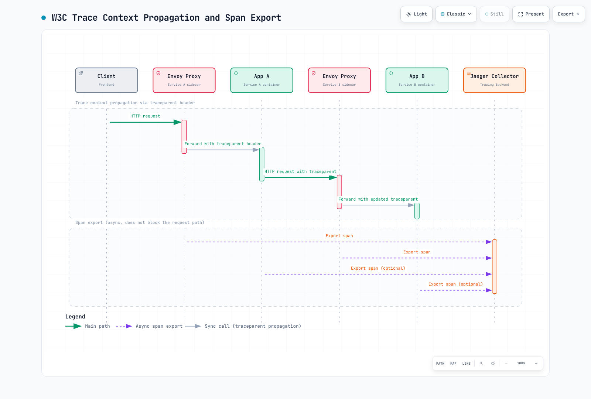

# Istio分散トレーシング

> **対応バージョン**: Istio 1.31
> **最終更新**: September 11, 2026

> **検証範囲**: 演習設定は公式資料とオフライン検証器で確認し、クラスターはデプロイしていません。名前空間、ID、ストレージ、バックエンド、負荷の前提は各例で示し、対象環境で検証する必要があります。

分散トレーシングはマイクロサービス間の要求の流れを追跡・可視化し、遅延ボトルネックの特定、エラー根本原因分析、サービス依存関係の理解を可能にします。

## 目次

1. [分散トレーシング概要](#distributed-tracing-overview)
2. [OpenTelemetry統合](#opentelemetry-integration)
3. [Jaeger統合](#jaeger-integration)
4. [Zipkin統合](#zipkin-integration)
5. [コンテキスト伝播](#context-propagation)
6. [サンプリング戦略](#sampling-strategies)
7. [トレース分析](#trace-analysis)
8. [カスタムスパン追加](#adding-custom-spans)
9. [性能最適化](#performance-optimization)
10. [トラブルシューティング](#troubleshooting)

## 分散トレーシング概要 {#distributed-tracing-overview}

### W3C Trace Context

Istioは互換トレースproviderでW3C trace contextをサポートします。アプリは自身の要求間でコンテキストを伝播する必要があります。図のアプリスパンには初期化済みSDK/エージェントが必要です。例はサイドカー/waypoint用で、ztunnelはHTTPトレーススパンを生成しません。



[🔍 インタラクティブな図を見る](https://www.atomai.click/kubernetes-docs/archmaps/en-service-mesh-istio-observability-02-tracing-0.html)

### 中核概念

#### トレース

単一要求のシステム内の全経路を表すスパンの集合

#### スパン

特定操作の開始と終了を表す単位
- **Span ID**: 一意識別子
- **Parent Span ID**: 親スパンへの参照
- **Trace ID**: トレース全体の識別子
- **操作名**: 操作の名前（例: `HTTP GET /api/products`）
- **所要時間**: 操作にかかった時間
- **タグ**: メタデータ（サービス名、HTTP状態など）
- **ログ**: タイムスタンプ付きイベント

#### Baggage

アプリ/propagatorが対応する場合に伝播するコンテキストのキー値ペアです。自動的にスパン属性になるわけではなく、シークレットを含めてはいけません。

## OpenTelemetry統合 {#opentelemetry-integration}

OpenTelemetryは計装、プロトコル、collectorを提供し、トレース保存backendではありません。例はOTLPをcollectorへ、その後Jaegerへ送ります。ZipkinとTempoは代替backendです。

### 1. OpenTelemetry Collectorのインストール

テスト前に`observability`を作り、下のJaegerをデプロイします。メモリ内テールサンプリング状態を持つ単一レプリカ例です。複数テールサンプラーの前の通常Serviceは1トレースの全スパンをまとめないため、本番拡張にはトレースIDルーティング、容量計画、遅延スパン処理が必要です。内部OTLPは演習では平文です。ネットワーク制限かTLS/mTLSを設定します。health拡張と内部メトリクスリスナーは明示有効です。

```yaml
apiVersion: v1
kind: ConfigMap
metadata:
  name: otel-collector-config
  namespace: observability
data:
  config.yaml: |
    extensions:
      health_check:
        endpoint: 0.0.0.0:13133
    receivers:
      otlp:
        protocols:
          grpc:
            endpoint: 0.0.0.0:4317
          http:
            endpoint: 0.0.0.0:4318
    processors:
      memory_limiter:
        check_interval: 1s
        limit_mib: 1024
      resource:
        attributes:
        - key: k8s.cluster.name
          value: production-k8s
          action: upsert
        - key: deployment.environment.name
          value: production
          action: upsert
      filter/health:
        error_mode: ignore
        trace_conditions:
        - span.name == "/health" or span.name == "/readiness" or span.name == "/liveness"
      tail_sampling:
        decision_wait: 30s
        num_traces: 50000
        policies:
        - name: errors
          type: status_code
          status_code:
            status_codes:
            - ERROR
        - name: slow
          type: latency
          latency:
            threshold_ms: 1000
        - name: baseline
          type: probabilistic
          probabilistic:
            sampling_percentage: 10
      batch:
        timeout: 10s
        send_batch_size: 1024
        send_batch_max_size: 2048
    exporters:
      otlp_grpc/jaeger:
        endpoint: jaeger-collector.observability.svc.cluster.local:4317
        tls:
          insecure: true
      debug:
        verbosity: basic
    service:
      extensions:
      - health_check
      pipelines:
        traces:
          receivers:
          - otlp
          processors:
          - memory_limiter
          - resource
          - filter/health
          - tail_sampling
          - batch
          exporters:
          - otlp_grpc/jaeger
          - debug
      telemetry:
        logs:
          level: info
        metrics:
          readers:
          - pull:
              exporter:
                prometheus:
                  host: 0.0.0.0
                  port: 8888
---
apiVersion: apps/v1
kind: Deployment
metadata:
  name: otel-collector
  namespace: observability
spec:
  replicas: 1
  selector:
    matchLabels:
      app: otel-collector
  template:
    metadata:
      labels:
        app: otel-collector
      annotations:
        sidecar.istio.io/inject: 'false'
    spec:
      containers:
      - name: otel-collector
        image: otel/opentelemetry-collector-contrib:0.160.0
        args:
        - --config=/etc/otel/config.yaml
        ports:
        - containerPort: 4317
          name: otlp-grpc
          protocol: TCP
        - containerPort: 4318
          name: otlp-http
          protocol: TCP
        - containerPort: 8888
          name: metrics
          protocol: TCP
        - containerPort: 13133
          name: health
        volumeMounts:
        - name: config
          mountPath: /etc/otel
        resources:
          requests:
            cpu: 500m
            memory: 1Gi
          limits:
            cpu: 2000m
            memory: 2Gi
        livenessProbe:
          httpGet:
            path: /
            port: 13133
        readinessProbe:
          httpGet:
            path: /
            port: 13133
      volumes:
      - name: config
        configMap:
          name: otel-collector-config
---
apiVersion: v1
kind: Service
metadata:
  name: otel-collector
  namespace: observability
  labels:
    app: otel-collector
spec:
  selector:
    app: otel-collector
  ports:
  - name: otlp-grpc
    port: 4317
    targetPort: 4317
  - name: otlp-http
    port: 4318
    targetPort: 4318
  - name: metrics
    port: 8888
    targetPort: 8888
  type: ClusterIP
```

廃止`jaeger`はOTLP/gRPC、`logging`は`debug`に置き換えます。フィルターは実観測スパン名に完全一致するため、計装に合わせ、スパン破棄による完全性への影響を考慮します。テールポリシーが保持できるのは実際に届く対象トレースで、上流破棄は復元できません。検証後は診断出力を除去します。

### 2. IstioでOpenTelemetryを有効化

#### MeshConfig設定

`istioctl install -f`で既存設定へproviderをマージし、`istio` ConfigMap全体を上書きしないでください。`maxTagLength`はパスタグを制限し、全スパン属性ではありません。

```yaml
apiVersion: install.istio.io/v1alpha1
kind: IstioOperator
spec:
  meshConfig:
    enableTracing: true
    extensionProviders:
    - name: otel-tracing
      opentelemetry:
        service: otel-collector.observability.svc.cluster.local
        port: 4317
        maxTagLength: 256
```

#### Telemetry APIによるトレース有効化

```yaml
apiVersion: telemetry.istio.io/v1
kind: Telemetry
metadata:
  name: otel-tracing
  namespace: istio-system
spec:
  tracing:
  - providers:
    - name: otel-tracing
    randomSamplingPercentage: 100.0
    customTags:
      cluster_id:
        literal:
          value: "production-cluster"
      environment:
        literal:
          value: "production"
```

名前空間ごとに該当するセレクターなしTelemetryを1つ使い、競合例を適用せずトレース/ログ設定をマージします。ヘッダータグは未信頼要求メタデータで、認証済みIDではありません。承認された仮名のユーザー相関値だけを使います。環境タグはアプリ環境変数でなくプロキシ環境を読みます。

### 3. 名前空間ごとのトレース設定

```yaml
apiVersion: telemetry.istio.io/v1
kind: Telemetry
metadata:
  name: namespace-tracing
  namespace: production
spec:
  tracing:
  - providers:
    - name: otel-tracing
    randomSamplingPercentage: 100.0
    customTags:
      namespace:
        literal:
          value: "production"
      team:
        literal:
          value: "backend-team"
      # Add request headers as tags
      user_id:
        header:
          name: x-user-id
          defaultValue: "unknown"
      request_id:
        header:
          name: x-request-id
      # Add environment variables as tags
      pod_name:
        environment:
          name: POD_NAME
          defaultValue: "unknown"
```

## Jaeger統合 {#jaeger-integration}

### Jaeger 2の開発用デプロイ

Jaeger 2は明示設定ファイルと`jaegertracing/jaeger`イメージを使います。以下のメモリ型インスタンスは開発用で、再起動でトレースを失います。Query/OTLPはクラスター内部に置き、UIはport-forwardで接続します。

```yaml
apiVersion: v1
kind: ConfigMap
metadata:
  name: jaeger-config
  namespace: observability
data:
  config.yaml: |
    extensions:
      jaeger_storage:
        backends:
          traces:
            memory:
              max_traces: 50000
      jaeger_query:
        storage:
          traces: traces
    receivers:
      otlp:
        protocols:
          grpc:
            endpoint: 0.0.0.0:4317
          http:
            endpoint: 0.0.0.0:4318
    processors:
      batch: {}
    exporters:
      jaeger_storage_exporter:
        trace_storage: traces
    service:
      extensions:
      - jaeger_storage
      - jaeger_query
      pipelines:
        traces:
          receivers:
          - otlp
          processors:
          - batch
          exporters:
          - jaeger_storage_exporter
---
apiVersion: apps/v1
kind: Deployment
metadata:
  name: jaeger
  namespace: observability
spec:
  replicas: 1
  selector:
    matchLabels:
      app: jaeger
  template:
    metadata:
      labels:
        app: jaeger
      annotations:
        sidecar.istio.io/inject: 'false'
    spec:
      containers:
      - name: jaeger
        image: jaegertracing/jaeger:2.20.0
        args:
        - --config=/etc/jaeger/config.yaml
        ports:
        - containerPort: 4317
          name: otlp-grpc
        - containerPort: 4318
          name: otlp-http
        - containerPort: 16686
          name: query-http
        volumeMounts:
        - name: config
          mountPath: /etc/jaeger
          readOnly: true
        resources:
          requests:
            cpu: 200m
            memory: 512Mi
          limits:
            cpu: 1000m
            memory: 2Gi
      volumes:
      - name: config
        configMap:
          name: jaeger-config
---
apiVersion: v1
kind: Service
metadata:
  name: jaeger-collector
  namespace: observability
spec:
  selector:
    app: jaeger
  ports:
  - name: otlp-grpc
    port: 4317
    targetPort: otlp-grpc
  - name: otlp-http
    port: 4318
    targetPort: otlp-http
---
apiVersion: v1
kind: Service
metadata:
  name: jaeger-query
  namespace: observability
spec:
  selector:
    app: jaeger
  ports:
  - name: query-http
    port: 16686
    targetPort: query-http
  type: ClusterIP
```

### 本番ストレージとスケーリング

耐久ストレージには、対応する管理Elasticsearch/OpenSearchと一致Jaegerドライバーを使います。Jaeger 2.20の公表Elasticsearch表は**7.x/8.x**です。最新リリースから新メジャー対応を推測しないでください。既存ECKもOperator/クラスター互換性を確認します。EKSの`gp3`にはEBS CSIドライバーと実StorageClassが必要です。

Elasticsearchでは`jaeger-config`内メモリbackendをこの断片に置き換え、storage名`traces`でreceiver、exporter、query、pipeline設定を保持します。制限した`jaeger`ユーザーの`password`とサーバー証明書に一致する公開`ca.crt`を持つSecret `jaeger-es-client`を作成します。サーバーホスト名検証は有効のままです。

```yaml
extensions:
  jaeger_storage:
    backends:
      traces:
        elasticsearch:
          server_urls:
          - https://jaeger-es-es-http.observability.svc.cluster.local:9200
          auth:
            basic:
              username: jaeger
              password_file: /etc/jaeger/es/password
          tls:
            ca_file: /etc/jaeger/es/ca.crt
          indices:
            index_prefix: production
```

次のDeployment断片を既存`jaeger`にマージします（イメージ、引数、設定マウント、他フィールドを保持）。共有耐久ストレージがあればcollector/query兼用インスタンスはステートレスで複製できます。独立スケーリングが必要なら同じJaeger 2バイナリで役割を分離できます。

```yaml
spec:
  replicas: 3
  template:
    spec:
      containers:
      - name: jaeger
        volumeMounts:
        - name: es-client
          mountPath: /etc/jaeger/es
          readOnly: true
      volumes:
      - name: es-client
        secret:
          secretName: jaeger-es-client
```

[Jaeger Elasticsearchガイド](https://www.jaegertracing.io/docs/2.20/storage/elasticsearch/)とリリーススキーマで、初期化、インデックスローテーション/保持、バックアップ、ストレージ側権限を設定します。旧1.xの環境変数/イメージデプロイはJaeger 2設定ではありません。既存トレース移行前にリリースノートを確認します。

### Istio → Jaeger OTLPの直接接続という代替

別collectorとそのテールサンプリングを迂回します。ワークロードに適したヘッドサンプリングを使います。provider選択の代替として既存導入へマージし、該当Telemetryで意図したproviderだけを選びます。

```yaml
apiVersion: install.istio.io/v1alpha1
kind: IstioOperator
spec:
  meshConfig:
    enableTracing: true
    extensionProviders:
    - name: jaeger
      opentelemetry:
        service: jaeger-collector.observability.svc.cluster.local
        port: 4317
        maxTagLength: 256
```

```yaml
apiVersion: telemetry.istio.io/v1
kind: Telemetry
metadata:
  name: jaeger-tracing
  namespace: istio-system
spec:
  tracing:
  - providers:
    - name: jaeger
    randomSamplingPercentage: 1
```

## Zipkin統合 {#zipkin-integration}

### Zipkinの開発用デプロイ

代替例はテスト用Zipkin 3.6.1とメモリストレージで、再起動時にデータを失います。本番には対応永続backend、認証/TLS、ネットワーク設定が必要です。[Zipkinサーバー設定](https://github.com/openzipkin/zipkin/blob/3.6.1/zipkin-server/README.md)でbackendを選び、未導入`elasticsearch:9200`を指定しないでください。

```yaml
apiVersion: apps/v1
kind: Deployment
metadata:
  name: zipkin
  namespace: observability
spec:
  replicas: 1
  selector:
    matchLabels:
      app: zipkin
  template:
    metadata:
      labels:
        app: zipkin
      annotations:
        sidecar.istio.io/inject: 'false'
    spec:
      containers:
      - name: zipkin
        image: openzipkin/zipkin:3.6.1
        ports:
        - containerPort: 9411
          name: http
        env:
        - name: STORAGE_TYPE
          value: mem
        resources:
          requests:
            cpu: 200m
            memory: 512Mi
          limits:
            cpu: 1000m
            memory: 2Gi
---
apiVersion: v1
kind: Service
metadata:
  name: zipkin
  namespace: observability
spec:
  selector:
    app: zipkin
  ports:
  - name: http
    port: 9411
    targetPort: http
  type: ClusterIP
```

### Istio providerの設定

Telemetry参照前にproviderが存在する必要があります。導入入力をマージし、collector/Jaeger選択の代わりにこのTelemetryを使います。

```yaml
apiVersion: install.istio.io/v1alpha1
kind: IstioOperator
spec:
  meshConfig:
    enableTracing: true
    extensionProviders:
    - name: zipkin
      zipkin:
        service: zipkin.observability.svc.cluster.local
        port: 9411
        maxTagLength: 256
```

```yaml
apiVersion: telemetry.istio.io/v1
kind: Telemetry
metadata:
  name: zipkin-tracing
  namespace: istio-system
spec:
  tracing:
  - providers:
    - name: zipkin
    randomSamplingPercentage: 1
```

## コンテキスト伝播 {#context-propagation}

分散トレースの鍵は、サービス間でコンテキストを正しく伝播することです。

### 必要なHTTPヘッダー

プロキシ/backendに設定した形式を伝播します。W3CとB3は選択肢か、明示設定した複数形式伝播です。`x-request-id`も転送します。B3は引き続き対応し、デバッグ用`X-B3-Flags: 1`を無差別に有効にしないでください。

#### W3C Trace Context（推奨）

```
traceparent: 00-0af7651916cd43dd8448eb211c80319c-b7ad6b7169203331-01
tracestate: congo=t61rcWkgMzE
```

#### B3ヘッダー

**単一ヘッダー形式（推奨）**:
```
b3: 80f198ee56343ba864fe8b2a57d3eff7-e457b5a2e4d86bd1-1-05e3ac9a4f6e3b90
```

**複数ヘッダー形式**:
```
X-B3-TraceId: 80f198ee56343ba864fe8b2a57d3eff7
X-B3-SpanId: e457b5a2e4d86bd1
X-B3-ParentSpanId: 05e3ac9a4f6e3b90
X-B3-Sampled: 1
```

### アプリによるコンテキスト伝播

以下は既存collectorと`service-b:8080/api/service-b`を前提とします。互換API/SDK/exporter/instrumentation依存を導入し、**要求処理の前**にSDKを初期化します。演習は内部平文OTLPで、実デプロイでは信頼するTLS/mTLSとネットワーク制限を設定します。SDK自動計装と手動伝播でクライアントスパンを重複させないでください。Istio相関用の`x-request-id`は別に保持します。

#### Python（Flask + OpenTelemetry）

Flask、requests、`opentelemetry-sdk`、`opentelemetry-exporter-otlp-proto-grpc`、`opentelemetry-instrumentation-flask`、`opentelemetry-instrumentation-requests`をアプリ環境に導入します。Flask/requests計装が抽出/注入を管理します。手動伝播APIは元の不正importでなく`opentelemetry.propagate.extract`です。

```python
import atexit
import requests
from flask import Flask, request
from opentelemetry import trace
from opentelemetry.sdk.resources import Resource
from opentelemetry.sdk.trace import TracerProvider
from opentelemetry.sdk.trace.export import BatchSpanProcessor
from opentelemetry.exporter.otlp.proto.grpc.trace_exporter import OTLPSpanExporter
from opentelemetry.instrumentation.flask import FlaskInstrumentor
from opentelemetry.instrumentation.requests import RequestsInstrumentor
from opentelemetry.propagate import set_global_textmap
from opentelemetry.trace.propagation.tracecontext import TraceContextTextMapPropagator

provider = TracerProvider(resource=Resource.create({"service.name": "service-a"}))
provider.add_span_processor(BatchSpanProcessor(OTLPSpanExporter(
    endpoint="otel-collector.observability.svc.cluster.local:4317", insecure=True
)))
trace.set_tracer_provider(provider)
set_global_textmap(TraceContextTextMapPropagator())
atexit.register(provider.shutdown)
app = Flask(__name__)
FlaskInstrumentor().instrument_app(app)
RequestsInstrumentor().instrument()
tracer = trace.get_tracer(__name__)

@app.get("/api/service-a")
def service_a():
    # Flask instrumentation extracted the parent; requests instrumentation injects its child.
    with tracer.start_as_current_span("process-request"):
        headers = {}
        if request.headers.get("x-request-id"):
            headers["x-request-id"] = request.headers["x-request-id"]
        response = requests.get("http://service-b:8080/api/service-b",
                                headers=headers, timeout=3)
        response.raise_for_status()
        return response.text, response.status_code, {
            "Content-Type": response.headers.get("Content-Type", "text/plain")
        }

if __name__ == "__main__":
    app.run(host="0.0.0.0", port=8080)
```

Flask開発サーバーはローカルテスト専用です。本番サーバーとSDK終了ライフサイクルでデプロイします。

#### Go（Gin + OpenTelemetry）

実tracer providerとW3C propagatorを初期化します。`Start`が返すコンテキストを下流要求に使い、エラー処理と応答bodyのcloseを行います。importモジュールをアプリの`go.mod`に加え、コンテキスト/エラー戻り値を捨てないでください。

```go
package main

import (
	"context"
	"io"
	"log"
	"net/http"
	"time"

	"github.com/gin-gonic/gin"
	"go.opentelemetry.io/contrib/instrumentation/github.com/gin-gonic/gin/otelgin"
	"go.opentelemetry.io/contrib/instrumentation/net/http/otelhttp"
	"go.opentelemetry.io/otel"
	"go.opentelemetry.io/otel/attribute"
	"go.opentelemetry.io/otel/codes"
	"go.opentelemetry.io/otel/exporters/otlp/otlptrace/otlptracegrpc"
	"go.opentelemetry.io/otel/propagation"
	"go.opentelemetry.io/otel/sdk/resource"
	sdktrace "go.opentelemetry.io/otel/sdk/trace"
)

func main() {
	exporter, err := otlptracegrpc.New(context.Background(),
		otlptracegrpc.WithEndpoint("otel-collector.observability.svc.cluster.local:4317"),
		otlptracegrpc.WithInsecure())
	if err != nil {
		log.Fatal(err)
	}
	provider := sdktrace.NewTracerProvider(sdktrace.WithBatcher(exporter),
		sdktrace.WithResource(resource.NewSchemaless(attribute.String("service.name", "service-a"))))
	otel.SetTracerProvider(provider)
	otel.SetTextMapPropagator(propagation.TraceContext{})
	defer func() {
		ctx, cancel := context.WithTimeout(context.Background(), 5*time.Second)
		defer cancel()
		if err := provider.Shutdown(ctx); err != nil {
			log.Print(err)
		}
	}()
	client := &http.Client{Transport: otelhttp.NewTransport(http.DefaultTransport), Timeout: 3 * time.Second}
	router := gin.Default()
	router.Use(otelgin.Middleware("service-a"))
	router.GET("/api/service-a", func(c *gin.Context) {
		ctx, span := otel.Tracer("service-a").Start(c.Request.Context(), "process-request")
		defer span.End()
		req, err := http.NewRequestWithContext(ctx, http.MethodGet, "http://service-b:8080/api/service-b", nil)
		if err != nil {
			c.Status(http.StatusInternalServerError)
			return
		}
		if id := c.GetHeader("x-request-id"); id != "" {
			req.Header.Set("x-request-id", id)
		}
		resp, err := client.Do(req)
		if err != nil {
			span.RecordError(err)
			span.SetStatus(codes.Error, "downstream request failed")
			c.Status(http.StatusBadGateway)
			return
		}
		defer resp.Body.Close()
		// Bound this demonstration response to 1 MiB.
		body, err := io.ReadAll(io.LimitReader(resp.Body, (1<<20)+1))
		if err != nil || len(body) > 1<<20 {
			c.Status(http.StatusBadGateway)
			return
		}
		c.Data(resp.StatusCode, resp.Header.Get("Content-Type"), body)
	})
	if err := router.Run(":8080"); err != nil {
		log.Print(err)
	}
}
```

#### Java（Spring WebFlux + OpenTelemetry Java Agent）

互換OpenTelemetry Java agentとOTLPエンドポイントでSpring WebFluxを起動します。agentはリアクティブserver/clientライフサイクルと伝播を計装します。`try (Scope ...) { return Mono... } finally { span.end(); }`は購読完了前にスパンを終え、非同期処理では不正です。このcontrollerはagentの対応WebFlux/Reactor計装に依存します。

```bash
OTEL_SERVICE_NAME=service-a \
OTEL_EXPORTER_OTLP_PROTOCOL=grpc \
OTEL_EXPORTER_OTLP_ENDPOINT=http://otel-collector.observability.svc.cluster.local:4317 \
java -javaagent:/opt/otel/opentelemetry-javaagent.jar -jar app.jar
```

```java
import java.time.Duration;
import org.springframework.web.bind.annotation.GetMapping;
import org.springframework.web.bind.annotation.RequestHeader;
import org.springframework.web.bind.annotation.RestController;
import org.springframework.web.reactive.function.client.WebClient;
import reactor.core.publisher.Mono;

@RestController
public class ServiceAController {
    private final WebClient webClient;
    public ServiceAController(WebClient.Builder builder) {
        this.webClient = builder.baseUrl("http://service-b:8080").build();
    }

    @GetMapping("/api/service-a")
    public Mono<String> serviceA(@RequestHeader(value = "x-request-id", required = false) String requestId) {
        return webClient.get().uri("/api/service-b")
                .headers(headers -> { if (requestId != null) headers.set("x-request-id", requestId); })
                .retrieve().bodyToMono(String.class)
                .timeout(Duration.ofSeconds(3));
    }
}
```

#### Node.js（CommonJS Express + OpenTelemetry）

`express`、`axios`、`@opentelemetry/api`、`@opentelemetry/sdk-node`、`@opentelemetry/auto-instrumentations-node`、`@opentelemetry/exporter-trace-otlp-grpc`を導入します。アプリimport前に計装を読み込みます。APIのimportだけではSDK/exporterは設定されません。

```javascript
// instrumentation.cjs: load before Express, HTTP clients, or application modules.
const { NodeSDK } = require('@opentelemetry/sdk-node');
const { getNodeAutoInstrumentations } = require('@opentelemetry/auto-instrumentations-node');
const { OTLPTraceExporter } = require('@opentelemetry/exporter-trace-otlp-grpc');
const sdk = new NodeSDK({
  traceExporter: new OTLPTraceExporter(),
  instrumentations: [getNodeAutoInstrumentations()],
});
sdk.start();
process.once('SIGTERM', () => sdk.shutdown().finally(() => process.exit(0)));
```

```javascript
// app.cjs
const express = require('express');
const axios = require('axios');
const { trace, SpanStatusCode } = require('@opentelemetry/api');
const app = express();
const tracer = trace.getTracer('service-a');
app.get('/api/service-a', async (req, res) => {
  await tracer.startActiveSpan('process-request', async (span) => {
    try {
      const headers = {};
      if (req.headers['x-request-id']) headers['x-request-id'] = req.headers['x-request-id'];
      const response = await axios.get('http://service-b:8080/api/service-b', {headers, timeout: 3000});
      res.json({result: response.data});
    } catch (error) {
      span.recordException(error);
      span.setStatus({code: SpanStatusCode.ERROR});
      res.status(502).json({error: 'Downstream request failed'});
    } finally {
      span.end();
    }
  });
});
app.listen(8080);
```

```bash
OTEL_SERVICE_NAME=service-a \
OTEL_EXPORTER_OTLP_ENDPOINT=http://otel-collector.observability.svc.cluster.local:4317 \
node --require ./instrumentation.cjs app.cjs
```

### トレースコンテキストの検証

テスト要求がbackendで同じtrace IDと意図した親子関係を生成するか確認します。管理されたアプリテストで送受信ヘッダーを調べます。デフォルトEnvoyアクセスログは全トレースヘッダーを含まず、プロキシデバッグ有効化はアクセスログ有効化やヘッダー出力保証ではありません。必要なら形式を明示設定し、認証情報/baggageの記録を避けます。

```bash
istioctl proxy-config listeners <pod-name> -n <namespace> -o json | \
  jq '.. | objects | select(has("tracing")) | .tracing'
istioctl proxy-config clusters <pod-name> -n <namespace> \
  --fqdn otel-collector.observability.svc.cluster.local
kubectl logs -n observability deployment/otel-collector --tail=100
```

## サンプリング戦略 {#sampling-strategies}

### サンプリングレベル

#### 1. ヘッドサンプリング（開始時）

ヘッドサンプリングは早い段階で判断します。以下の割合は選択肢で、上流判断とSDK samplerも到達スパンに影響します。collectorが全トレースのエラー/遅延を評価するなら、テール前に90%捨てず全対象スパンを送ります。

**メッシュ全体**:
```yaml
apiVersion: telemetry.istio.io/v1
kind: Telemetry
metadata:
  name: mesh-head-sampling
  namespace: istio-system
spec:
  tracing:
  - providers:
    - name: otel-tracing
    randomSamplingPercentage: 10.0
```

**名前空間単位**:
```yaml
apiVersion: telemetry.istio.io/v1
kind: Telemetry
metadata:
  name: sampling-config
  namespace: production
spec:
  tracing:
  - providers:
    - name: otel-tracing
    randomSamplingPercentage: 25.0  # 25% sampling
```

**ワークロード単位**:
```yaml
apiVersion: telemetry.istio.io/v1
kind: Telemetry
metadata:
  name: critical-service-tracing
  namespace: production
spec:
  selector:
    matchLabels:
      app: payment-service
  tracing:
  - providers:
    - name: otel-tracing
    randomSamplingPercentage: 100.0  # 100% sampling for critical services
```

#### 2. テールサンプリング（事後）

テールは判断期間中に蓄積したスパンから判断し、完全トレースが保証されるわけではありません。想定時間/量に合わせ窓とバッファを決め、1トレースを同じcollectorへ送り、遅延スパン、再起動、超過を考慮します。以下は到着した一致トレースを保持します。traces pipelineのbatch前にprocessorをマージします。

```yaml
# OpenTelemetry Collector's tail_sampling processor
processors:
  tail_sampling:
    decision_wait: 10s  # Wait time for trace completion
    num_traces: 100000  # Number of traces to keep in memory
    expected_new_traces_per_sec: 1000
    policies:
      # Keep all traces with errors
      - name: errors
        type: status_code
        status_code:
          status_codes: [ERROR]

      # Keep all slow requests (> 1 second)
      - name: slow-traces
        type: latency
        latency:
          threshold_ms: 1000

      # 100% sampling for specific services
      - name: critical-services
        type: string_attribute
        string_attribute:
          key: service.name
          values:
          - payment-service
          - auth-service

      # Keep all HTTP 5xx errors
      - name: http-errors
        type: numeric_attribute
        numeric_attribute:
          key: http.response.status_code
          min_value: 500
          max_value: 599
      - name: legacy-http-errors
        type: numeric_attribute
        numeric_attribute:
          key: http.status_code
          min_value: 500
          max_value: 599

      # 5% sampling for the rest
      - name: probabilistic
        type: probabilistic
        probabilistic:
          sampling_percentage: 5
```

### レート制限付きサンプリング

rate-limitingポリシーはスパンレートのトークンバケットで、自己調整するエラー/遅延samplerではありません。代替ポリシーリストです。他keepポリシーと並べても、それらが保持するトレースへの全体上限にはなりません。短い期間ではバーストとトレース単位判断が影響します。

```yaml
processors:
  tail_sampling:
    policies:
      - name: rate-limited-sampling
        type: rate_limiting
        rate_limiting:
          spans_per_second: 1000  # Keep maximum 1000 spans per second
```

### サンプリング戦略ガイド

| 目標 | ヘッド入力 | Collector/ストレージ判断 |
|------|------------|----------------------------|
| 小規模開発テスト | 100% | 全保持し伝播確認 |
| 本番量の制限 | 実測割合 | 受信サンプルを保存 |
| エラー/遅いトレース保持 | 全対象スパン | テールで一致トレースと基準サンプルを保持 |
| 保持量制限 | テール判断用の全対象スパン | 明示レート/複合ポリシーと容量制限 |

設計選択であり普遍的環境デフォルトではありません。低いヘッド割合とテールの併用は全エラー保持を保証できません。実スパン状態と属性名を確認します（現OpenTelemetry規約は`http.response.status_code`、一部プロキシ/旧スパンは`http.status_code`）。

## トレース分析 {#trace-analysis}

### Jaeger UIでトレース検索

```bash
# Access Jaeger UI
kubectl port-forward -n observability svc/jaeger-query 16686:16686

# Browser: http://localhost:16686
```

**検索オプション**:
- **Service**: サービス名
- **Operation**: 操作名（例: `GET /api/products`）
- **Tags**: タグフィルター（例: `http.status_code=500`）
- **Min Duration**: 最小遅延
- **Max Duration**: 最大遅延
- **Limit Results**: 結果数上限

### 有用なトレースクエリ

#### 1. エラーのあるトレースを検索

```
Tags: error=true
```

または

```
Tags: http.status_code=500
```

#### 2. 遅い要求を検索

```
Min Duration: 1s
```

#### 3. 特定ユーザー要求を追跡

```
Tags: user_id=12345
```

#### 4. 特定APIエンドポイントを分析

```
Operation: GET /api/products/{id}
```

### Jaeger UI API診断

上のport-forward後、UIクエリエンドポイントで対話的診断ができます。内部UI APIで安定アプリ契約ではありません。長期統合には文書化されたJaeger query APIを使います。

```bash
# Query traces for a specific service
curl "http://localhost:16686/api/traces?service=productpage&limit=10"

# Query specific trace ID
curl "http://localhost:16686/api/traces/0af7651916cd43dd8448eb211c80319c"

# Query service list
curl "http://localhost:16686/api/services"

# Query operations for a specific service
curl "http://localhost:16686/api/services/productpage/operations"
```

### 遅延ボトルネックの特定

1. **ウォーターフォールと自身だけの時間を確認**: 親スパンは子の時間を含み、最長の親だけでは原因を特定できない。
2. **クリティカルパスを確認**: 全体要求時間に最も影響する経路
3. **並列と順次の実行**: 並列可能な処理が順次実行されていないか確認

### Grafana Tempo統合

Tempoは代替トレースbackendです。デフォルトHTTP**クエリ**ポートは3200、OTLP取り込みは4317など別設定receiverです。以下をGrafanaの`provisioning/datasources`へマウントするかチャートのデータソース設定を使います。ConfigMapだけでは自動読込されません。

```yaml
apiVersion: v1
kind: ConfigMap
metadata:
  name: grafana-datasources
  namespace: observability
data:
  tempo.yaml: |
    apiVersion: 1
    datasources:
    - name: Tempo
      uid: tempo
      type: tempo
      access: proxy
      url: http://tempo.observability.svc.cluster.local:3200
      jsonData:
        tracesToLogsV2:
          datasourceUid: loki
          tags:
          - key: service.name
            value: app
          filterByTraceID: false
          filterBySpanID: false
        tracesToMetrics:
          datasourceUid: prometheus
          tags:
          - key: service.name
            value: destination_canonical_service
          queries:
          - name: Request rate
            query: sum(rate(istio_requests_total{reporter="destination",$$__tags}[5m]))
        nodeGraph:
          enabled: true
```

例には既存UID `loki`と`prometheus`が必要です。SDKの`service.name`、Lokiの`app`、Istioの`destination_canonical_service`を合わせ、違えばマッピングを変えます。サービス名衝突時は名前空間/クラスター対応を追加します。Grafanaプロビジョニングは`$$__tags`をリテラルのクエリ変数`$__tags`へ変換します。ログにtrace IDがある場合だけIDフィルターを有効にします。Tempo Service graphにはPrometheusの生成service-graph/spanメトリクスも必要で、通常Istio要求メトリクスだけでは提供されません。

## カスタムスパン追加 {#adding-custom-spans}

詳細なトレースのためアプリコードにカスタムスパンを加えます。

### Python例

初期化済みアプリ内の関数です。`check_inventory`、`process_payment`、`PaymentError`はアプリ定義のコールバック/型です。

```python
from opentelemetry import trace
from opentelemetry.trace import Status, StatusCode

tracer = trace.get_tracer(__name__)

def process_order(order_id):
    with tracer.start_as_current_span("process-order") as span:
        span.set_attribute("order.id", order_id)
        span.set_attribute("order.amount", 99.99)

        # Check inventory
        with tracer.start_as_current_span("check-inventory") as inventory_span:
            inventory = check_inventory(order_id)
            inventory_span.set_attribute("inventory.available", inventory)

        # Process payment
        with tracer.start_as_current_span("process-payment", record_exception=False,
                                          set_status_on_exception=False) as payment_span:
            try:
                payment_result = process_payment(order_id)
                payment_span.set_attribute("payment.status", "success")
            except PaymentError as e:
                payment_span.set_status(Status(StatusCode.ERROR))
                payment_span.record_exception(e)
                raise

        # Record event
        span.add_event("Order processed successfully", {
            "order.id": order_id
        })

        return {"status": "success"}
```

### Go例

アプリの断片で、`checkInventory`と`processPayment`はアプリ関数です。両子スパンは親processコンテキストを使い、paymentが終了済みinventoryの子にならないようにします。

```go
import (
    "context"
    "go.opentelemetry.io/otel"
    "go.opentelemetry.io/otel/attribute"
    "go.opentelemetry.io/otel/codes"
)

func processOrder(ctx context.Context, orderID string) error {
    tracer := otel.Tracer("order-service")

    ctx, span := tracer.Start(ctx, "process-order")
    defer span.End()

    span.SetAttributes(
        attribute.String("order.id", orderID),
        attribute.Float64("order.amount", 99.99),
    )

    // Check inventory
    inventoryCtx, inventorySpan := tracer.Start(ctx, "check-inventory")
    inventory, err := checkInventory(inventoryCtx, orderID)
    if err != nil {
        inventorySpan.RecordError(err)
        inventorySpan.SetStatus(codes.Error, err.Error())
        inventorySpan.End()
        return err
    }
    inventorySpan.SetAttributes(attribute.Bool("inventory.available", inventory))
    inventorySpan.End()

    // Process payment
    paymentCtx, paymentSpan := tracer.Start(ctx, "process-payment")
    err = processPayment(paymentCtx, orderID)
    if err != nil {
        paymentSpan.RecordError(err)
        paymentSpan.SetStatus(codes.Error, err.Error())
        paymentSpan.End()
        return err
    }
    paymentSpan.SetAttributes(attribute.String("payment.status", "success"))
    paymentSpan.End()

    // Record event
    span.AddEvent("Order processed successfully")

    return nil
}
```

## 性能最適化 {#performance-optimization}

### トレースデータサイズの最適化

前述providerの`maxTagLength`とTelemetryカスタムタグを使います。必要に応じてSDK/collectorで属性/イベントを制限します。パス短縮はURLやタグ内シークレットのマスキングではありません。必要属性だけを保存し、可能なら生IDでなくルートテンプレートを使います。

### Collector性能調整

```yaml
processors:
  batch:
    timeout: 10s
    send_batch_size: 1024
    send_batch_max_size: 2048

  memory_limiter:
    check_interval: 1s
    limit_mib: 1024
    spike_limit_mib: 256
```

### ストレージ最適化

永続Jaegerは実`production`インデックスプレフィックスと選択ローテーションモードの保持を設定します。実取り込み/クエリ負荷に合わせシャード/レプリカを決めます。版互換の初期化とElasticsearch ILM（またはbackendのライフサイクル機構）を使い、期限切れにする前にバックアップと検索期間を確認します。7日は例の保持判断で、普遍的デフォルトではありません。

旧単独Curator手順は設定プレフィックスと不一致で、ストレージ認証情報/TLSとローテーション前提を欠いていました。[Jaeger 2.20ストレージライフサイクル手順](https://www.jaegertracing.io/docs/2.20/storage/elasticsearch/)とリリーススキーマに従い、トレース診断として広範なインデックス削除を実行しないでください。

## トラブルシューティング {#troubleshooting}

### トレースがない

実効HTTP connection-managerのトレース設定とproviderクラスターを確認し、受信、出力、保存を区別します。`.bootstrap.tracing`だけでは動的トレース設定を見逃します。次の読み取り専用確認を使います。

```bash
istioctl proxy-config listeners <pod-name> -n <namespace> -o json | \
  jq '.. | objects | select(has("tracing")) | .tracing'
istioctl proxy-config clusters <pod-name> -n <namespace> \
  --fqdn otel-collector.observability.svc.cluster.local
kubectl logs -n observability deployment/otel-collector --tail=100
kubectl logs -n observability deployment/jaeger --tail=100
# Keep this running; use a second terminal for the curl command below.
kubectl port-forward -n observability svc/otel-collector 8888:8888
```

```bash
curl -fsS http://localhost:8888/metrics | \
  rg 'otelcol_(receiver_accepted|exporter_sent|exporter_send_failed)_spans'
```

スパン受理は出力や耐久保存を証明しません。exporterエラー、backend接続/認証、保存trace IDを確認します。テールサンプリングとメモリ保存は意図的に保持量を減らします。メトリクス接尾辞はcollector telemetry設定で変わり得ます。

### コンテキスト伝播の不具合

独立要求ごとに新テストtrace IDを使い、backendのアプリ/serverスパンを確認します。新しい送信呼び出しではアプリがアクティブ子コンテキストを注入する必要があります。W3C/B3がproviderとSDK propagatorに一致し、HTTPライブラリ読込前に計装が始まるか確認します。プロキシログレベル変更はアクセスログを有効にしません。必要ならTelemetryのアクセスログproviderを明示設定します。

### 予期しないサンプリング

```bash
kubectl get telemetry -A
kubectl describe telemetry <name> -n <namespace>
istioctl analyze -n <namespace>
istioctl proxy-config listeners <pod-name> -n <namespace> -o json | \
  jq '.. | objects | select(has("tracing")) | .tracing'
```

root/namespace/workloadの継承、上流sampledフラグ、SDK sampler、collectorポリシーを一緒に確認します。Collectorはヘッドで捨てたトレースを再構成できません。

## 参考資料

- [Istio分散トレーシング](https://istio.io/latest/docs/tasks/observability/distributed-tracing/)
- [OpenTelemetryドキュメント](https://opentelemetry.io/docs/)
- [Jaegerドキュメント](https://www.jaegertracing.io/docs/)
- [Zipkinドキュメント](https://zipkin.io/)
- [W3C Trace Context](https://www.w3.org/TR/trace-context/)
- [B3伝播](https://github.com/openzipkin/b3-propagation)
- [Grafana Tempo](https://grafana.com/docs/tempo/latest/)
