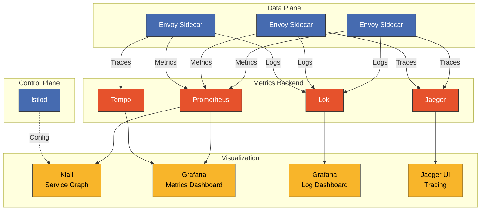

# Istio ダッシュボード

> **サポート対象バージョン**: Istio 1.28
> **最終更新**: February 19, 2026

Grafana、Kiali、Prometheus を使用して、Istio service mesh を包括的に可視化・監視します。

## 目次

1. [ダッシュボードの概要](#dashboard-overview)
2. [Kiali](#kiali)
3. [Grafana ダッシュボード](#grafana-dashboards)
4. [Prometheus](#prometheus)
5. [カスタムダッシュボードの作成](#creating-custom-dashboards)
6. [ダッシュボード統合](#dashboard-integration)
7. [ベストプラクティス](#best-practices)

## ダッシュボードの概要

### Observability Stack アーキテクチャ



### ツール別の目的

| ツール | 主な用途 | データソース |
|------|-------------|-------------|
| **Kiali** | Service トポロジー、トラフィック分析、設定検証 | Prometheus、Istio Config |
| **Grafana** | Metrics の可視化、アラート、ログ分析 | Prometheus、Loki、Tempo |
| **Prometheus** | Metrics の収集とクエリ | Envoy、istiod |
| **Jaeger** | 分散トレース分析 | Envoy span |

## Kiali

<p align="center">
  
</p>

Kiali は Istio service mesh 向けの **observability コンソール**です。Service トポロジーをリアルタイムで可視化し、トラフィックフローを分析して、Istio 設定を検証します。

### Kiali の中核的な価値

1. **Service Graph の可視化**: microservice 間の関係とトラフィックフローを直感的に表現
2. **リアルタイム監視**: request rate、error rate、response time をリアルタイムで表示
3. **設定検証**: VirtualService、DestinationRule などの Istio CRD のエラーを検出
4. **mTLS ステータスの検証**: Service 間での mTLS 適用を視覚的に確認
5. **分散トレーシング統合**: Jaeger 統合により Service Graph から直接トレースを表示

### 本番環境へのデプロイ

#### 1. Kiali Operator のインストール

```bash
# Deploy Kiali Operator
kubectl create namespace kiali-operator
kubectl apply -f https://raw.githubusercontent.com/kiali/kiali-operator/v1.79/deploy/kiali-operator.yaml

# Verify installation
kubectl get pods -n kiali-operator
```

#### 2. Kiali CR の作成（本番用設定）

```yaml
apiVersion: kiali.io/v1alpha1
kind: Kiali
metadata:
  name: kiali
  namespace: istio-system
spec:
  # Deployment settings
  deployment:
    accessible_namespaces:
    - "**"  # Access all namespaces
    image_name: quay.io/kiali/kiali
    image_version: v1.79
    replicas: 2
    resources:
      requests:
        cpu: 100m
        memory: 256Mi
      limits:
        cpu: 500m
        memory: 1Gi

    # Ingress settings
    ingress:
      enabled: true
      class_name: nginx
      override_yaml:
        metadata:
          annotations:
            cert-manager.io/cluster-issuer: letsencrypt-prod
        spec:
          rules:
          - host: kiali.example.com
            http:
              paths:
              - path: /
                pathType: Prefix
                backend:
                  service:
                    name: kiali
                    port:
                      number: 20001
          tls:
          - hosts:
            - kiali.example.com
            secretName: kiali-tls

  # Authentication settings
  auth:
    strategy: token  # token, openid, openshift, anonymous

  # External service integration
  external_services:
    # Prometheus
    prometheus:
      url: http://prometheus.istio-system:9090

    # Grafana
    grafana:
      enabled: true
      url: http://grafana.observability:3000
      in_cluster_url: http://grafana.observability:3000
      dashboards:
      - name: "Istio Service Dashboard"
        variables:
          namespace: "var-namespace"
          service: "var-service"
      - name: "Istio Workload Dashboard"
        variables:
          namespace: "var-namespace"
          workload: "var-workload"

    # Jaeger
    jaeger:
      enabled: true
      url: http://jaeger-query.observability:16686
      in_cluster_url: http://jaeger-query.observability:16686

    # Custom Dashboards
    custom_dashboards:
    - name: "Loki Istio Logs"
      title: "Istio Access Logs"
      runtime: Grafana
      template: "/dashboards/loki-istio.json"

  # Kiali feature settings
  kiali_feature_flags:
    # Enable validation features
    validations:
      ignore:
      - "KIA1301"  # Ignore specific validation rules

    # UI features
    ui_defaults:
      graph:
        find_options:
        - description: "Find: slow edges (> 1s)"
          expression: "rt > 1000"
        - description: "Find: error edges (>= 5%)"
          expression: "error > 5"
        impl: cy  # cytoscape graph engine

      metrics_per_refresh: "1m"
      namespaces:
      - istio-system
      refresh_interval: "60s"
```

**デプロイ**:
```bash
kubectl apply -f kiali-cr.yaml

# Verify installation
kubectl get kiali -n istio-system
kubectl get pods -n istio-system -l app=kiali
```

### Kiali へのアクセス

#### 開発環境

```bash
# Access via port-forward
kubectl port-forward -n istio-system svc/kiali 20001:20001

# Browser: http://localhost:20001
```

#### 本番環境（Token 認証）

```bash
# Create ServiceAccount Token
kubectl create token kiali -n istio-system --duration=24h

# Login with Token
# Browser: https://kiali.example.com
# Username: (leave empty)
# Token: (token generated above)
```

### Kiali の主要機能

#### 1. Service Graph（グラフ）

<p align="center">
  
</p>

**概要**:
- namespace ごとに Service トポロジーを可視化
- トラフィックフローと request rate（RPS）を表示
- error rate と response time を可視化
- バージョン別のトラフィック分散を検証

<p align="center">
  
</p>

上の画像は、アニメーションでリアルタイムのトラフィックフローを表示する Kiali の **Traffic Animation** 機能を示しています。ドットのサイズと頻度により、トラフィック量を直感的に把握できます。

**Graph View の種類**:

| View の種類 | 説明 | 使用シナリオ |
|-----------|-------------|--------------|
| **App Graph** | Application レベル | Service 依存関係の把握 |
| **Versioned App Graph** | バージョン別 Application | Canary デプロイの監視 |
| **Workload Graph** | Workload レベル | Deployment/StatefulSet レベルの分析 |
| **Service Graph** | Service レベル | Kubernetes Service 中心のビュー |

**Graph Filter のオプション**:

```yaml
# Edge label display
- Request percentage: Traffic distribution rate (%)
- Request rate: Request rate (RPS)
- Response time: P95 response time
- Throughput: Throughput (bytes/sec)

# Display options
- Traffic Animation: Real-time traffic flow
- Service Nodes: Show service nodes
- Traffic Distribution: Version-based traffic distribution
- Security: mTLS lock icon
- Circuit Breakers: Circuit breaker status
- Virtual Services: VirtualService icon
```

**Find/Hide 機能**:
```
# Find slow edges
Find: response time > 1s
Expression: rt > 1000

# Find edges with errors
Find: error rate >= 5%
Expression: error >= 5

# Hide specific services
Hide: kube-system namespace
```

#### 2. Applications ビュー

Application ごとの詳細情報:

- **Overview**: 全体的なステータスの概要
- **Traffic**: Inbound/Outbound トラフィック Metrics
  - request volume（RPS）
  - request duration（P50、P95、P99）
  - request size / response size
- **Inbound Metrics**: 受信トラフィックの分析
  - source Workload
  - request protocol（HTTP/gRPC/TCP）
  - response code
- **Outbound Metrics**: 送信トラフィックの分析
  - destination Service
  - response time
  - error rate

#### 3. Workloads ビュー

<p align="center">
  
</p>

Workload（Deployment、StatefulSet など）ごとの詳細情報:

- **Pods**: Pod のリストとステータス
- **Services**: 接続された Service のリスト
- **Logs**: リアルタイム Pod ログ（Envoy + Application）
- **Metrics**: Workload Metrics
  - request volume
  - duration（P50/P95/P99）
  - error rate
- **Traces**: Jaeger 統合による分散トレーシング
- **Envoy**: Envoy 設定の検証
  - Cluster
  - Listener
  - Route
  - Bootstrap config

#### 4. Services ビュー

Kubernetes Service ごとの詳細情報:

- **Overview**: Service metadata
- **Traffic**: トラフィック Metrics
- **Inbound Metrics**: Client ごとの request 分析
- **Traces**: Service 呼び出しのトレーシング

#### 5. Istio 設定の検証（Istio Config）

<p align="center">
  
</p>

すべての Istio リソースを検証・管理します。

**検証対象**:
- VirtualService
- DestinationRule
- Gateway
- ServiceEntry
- Sidecar
- PeerAuthentication
- RequestAuthentication
- AuthorizationPolicy
- Telemetry

**検証レベル**:

| アイコン | レベル | 説明 |
|------|-------|-------------|
| ✅ | Valid | 設定は正しい |
| ⚠️ | Warning | 潜在的な問題（ベストプラクティス違反） |
| ❌ | Error | 設定エラー（Application の障害） |

**一般的な検証エラーの例**:

```yaml
# KIA0101: DestinationRule and VirtualService don't reference the same host
---
apiVersion: networking.istio.io/v1beta1
kind: VirtualService
metadata:
  name: reviews
spec:
  hosts:
  - reviews  # ❌ Mismatch with DestinationRule host
  http:
  - route:
    - destination:
        host: reviews
        subset: v1
---
apiVersion: networking.istio.io/v1beta1
kind: DestinationRule
metadata:
  name: reviews
spec:
  host: reviews.default.svc.cluster.local  # ⚠️ Using FQDN
  subsets:
  - name: v1
    labels:
      version: v1
```

**修正版**:
```yaml
# Both resources use FQDN
apiVersion: networking.istio.io/v1beta1
kind: VirtualService
metadata:
  name: reviews
spec:
  hosts:
  - reviews.default.svc.cluster.local  # ✅
  http:
  - route:
    - destination:
        host: reviews.default.svc.cluster.local
        subset: v1
---
apiVersion: networking.istio.io/v1beta1
kind: DestinationRule
metadata:
  name: reviews
spec:
  host: reviews.default.svc.cluster.local  # ✅
  subsets:
  - name: v1
    labels:
      version: v1
```

#### 6. セキュリティ

<p align="center">
  
</p>

**mTLS ステータスの検証**:

Kiali グラフで mTLS ステータスを視覚的に検証します。

- 🔒 **ロックアイコン**: mTLS が有効
- 🔓 **ロック解除**: mTLS が無効
- ⚠️ **警告アイコン**: 部分的な mTLS（PERMISSIVE）

**Security Dashboard**:
- namespace ごとの mTLS ステータス
- PeerAuthentication Policy の適用ステータス
- AuthorizationPolicy の影響

#### 7. 分散トレーシング統合

<p align="center">
  
</p>

Kiali は Jaeger と統合し、Service Graph から直接トレースを表示できます。

**使用方法**:
1. グラフ内の Service ノードをクリックします。
2. 「View Traces」リンクをクリックします。
3. 自動的に Jaeger UI に移動し、その Service のトレースを表示します。

**トレースの詳細**:
- span duration（各 Service の処理時間）
- request/response header
- error の詳細
- Service 依存関係マップ

### Kiali の高度な機能

#### Traffic Shifting の可視化

<p align="center">
  
</p>

```yaml
# Canary deployment VirtualService
apiVersion: networking.istio.io/v1beta1
kind: VirtualService
metadata:
  name: reviews-canary
spec:
  hosts:
  - reviews
  http:
  - route:
    - destination:
        host: reviews
        subset: v1
      weight: 90  # Displayed as 90% in Kiali
    - destination:
        host: reviews
        subset: v2
      weight: 10  # Displayed as 10% in Kiali
```

Kiali グラフは、リアルタイムのトラフィック分散率を Edge label として表示します。

**Canary デプロイの監視**:
- バージョン別 request rate（v1: 90%、v2: 10%）
- バージョン別 error rate の比較
- バージョン別 response time（P50、P95、P99）
- リアルタイムトラフィックアニメーションによる分散の検証

#### Namespace の分離とアクセス制御

```yaml
# Kiali with access to specific namespaces only
apiVersion: kiali.io/v1alpha1
kind: Kiali
metadata:
  name: kiali-team-a
  namespace: team-a
spec:
  deployment:
    accessible_namespaces:
    - team-a
    - istio-system
  auth:
    strategy: openid
    openid:
      client_id: kiali-team-a
      issuer_uri: https://keycloak.example.com/auth/realms/kubernetes
```

## Grafana ダッシュボード

### 公式 Istio ダッシュボード

Istio は以下の公式 Grafana ダッシュボードを提供しています。

#### 1. Istio Mesh Dashboard

**目的**: mesh 全体のステータスの概要

**主要パネル**:
- Global Request Volume
- Global Success Rate（5xx 以外の response）
- 4xx Response Codes
- 5xx Response Codes
- Average Response Time
- P50/P90/P95/P99 Latency

**アクセス**:
```bash
# In Grafana UI
Dashboards → Istio → Istio Mesh Dashboard
```

#### 2. Istio Service Dashboard

**目的**: Service ごとの詳細な Metrics 分析

**主要パネル**:
- Service Request Volume
- Service Success Rate
- Service Request Duration（Percentile）
- Incoming Request By Source
- Outgoing Request By Destination
- Service Workloads

**変数**:
- `$namespace`: Namespace の選択
- `$service`: Service の選択

#### 3. Istio Workload Dashboard

**目的**: Workload（Deployment/StatefulSet）の Metrics

**主要パネル**:
- Workload Request Volume
- Workload Success Rate
- Workload Request Duration
- Incoming Requests by Source
- Outgoing Requests by Destination
- TCP Sent/Received Bytes

**変数**:
- `$namespace`: Namespace
- `$workload`: Workload 名

#### 4. Istio Performance Dashboard

**目的**: Istio コンポーネントのパフォーマンス監視

**主要パネル**:
- Pilot Metrics
  - Proxy Push Time
  - Pilot XDS Pushes
  - Pilot XDS Errors
- Envoy Proxy Metrics
  - Memory Usage
  - CPU Usage
  - Active Connections

#### 5. Istio Control Plane Dashboard

**目的**: istiod ステータスの監視

**主要パネル**:
- Pilot Memory
- Pilot CPU
- Pilot Goroutines
- Configuration Validation Errors
- Push Queue Depth
- XDS Push Time

### Istio 向け Grafana Loki Dashboard（#14876）

**Dashboard ID**: 14876
**URL**: https://grafana.com/grafana/dashboards/14876

このダッシュボードは Grafana Loki を使用して Istio Access Logs を分析します。

#### インストール方法

**1. Grafana UI からインポート**:

```bash
# Access Grafana
kubectl port-forward -n observability svc/grafana 3000:3000

# Browser: http://localhost:3000
# 1. Dashboards → Import
# 2. Enter Dashboard ID: 14876
# 3. Select Loki datasource
# 4. Click Import
```

**2. JSON File によるインポート**（自動化）:

```bash
# Download Dashboard JSON
curl -o istio-loki-dashboard.json \
  https://grafana.com/api/dashboards/14876/revisions/latest/download

# Deploy as ConfigMap
kubectl create configmap grafana-dashboard-loki-istio \
  --from-file=istio-loki-dashboard.json \
  -n observability \
  --dry-run=client -o yaml | kubectl apply -f -

# Add label for auto-loading in Grafana
kubectl label configmap grafana-dashboard-loki-istio \
  -n observability \
  grafana_dashboard=1
```

#### 主要パネル

**1. 概要パネル**:
- **Total Requests**: request の総数
- **Request Rate**: 1 秒あたりの request 数（RPS）
- **Error Rate**: 5xx error rate
- **P95 Latency**: 95 パーセンタイルの latency

**2. トラフィック分析**:
- **Top Services by Request Volume**: request volume が最も多い Service
- **Request Rate by Service**: Service ごとの request 傾向
- **Response Code Distribution**: HTTP status code の分布

**3. パフォーマンス Metrics**:
- **Latency Heatmap**: response time の分布を示すヒートマップ
- **P50/P95/P99 Latency**: パーセンタイル別 latency
- **Slow Requests**: 遅い request のリスト（> 1s）

**4. Error 分析**:
- **4xx Errors**: Client error（不正な request）
- **5xx Errors**: Server error（内部 error）
- **Error Logs**: error log の詳細

**5. セキュリティ**:
- **mTLS Usage**: mTLS 使用率
- **Non-mTLS Traffic**: Non-mTLS トラフィックの警告

#### LogQL クエリの例

このダッシュボードで使用される LogQL クエリ:

```logql
# Request rate
sum(rate({container="istio-proxy"} | json [5m]))

# Error rate
sum(rate({container="istio-proxy"} | json | response_code >= "500" [5m]))
/
sum(rate({container="istio-proxy"} | json [5m]))

# P95 latency
quantile_over_time(0.95, {container="istio-proxy"} | json | unwrap duration [5m])

# Request distribution by service
sum(count_over_time({container="istio-proxy"} | json [5m])) by (destination_service_name)

# Find slow requests
{container="istio-proxy"}
| json
| duration > 1000
| line_format "{{.method}} {{.path}} - {{.duration}}ms"
```

### 追加のコミュニティダッシュボード

#### Istio Workload Dashboard（#7636）

**URL**: https://grafana.com/grafana/dashboards/7636

Workload に焦点を当てた Metrics:
- Request Volume
- Request Duration
- Request Size
- Response Size
- TCP Connections

**インポート**:
```bash
# Dashboard ID: 7636
Dashboards → Import → 7636 → Load
```

#### Istio Service Mesh Dashboard（#11829）

**URL**: https://grafana.com/grafana/dashboards/11829

mesh 全体の概要:
- Service Graph data
- Golden Signals（Latency、Traffic、Errors、Saturation）
- Control Plane のステータス

#### Istio Gateway Dashboard（#13277）

**URL**: https://grafana.com/grafana/dashboards/13277

Ingress/Egress Gateway の監視:
- Gateway Request Volume
- Gateway Latency
- TLS Handshake Errors
- Connection Metrics

### Grafana Alerting

#### Istio 用 Alert Rule

```yaml
apiVersion: v1
kind: ConfigMap
metadata:
  name: grafana-alerting
  namespace: observability
data:
  istio-alerts.yaml: |
    groups:
    - name: istio-service-alerts
      interval: 1m
      rules:
      # High error rate
      - alert: HighErrorRate
        expr: |
          (sum(rate(istio_requests_total{response_code=~"5..", reporter="destination"}[5m])) by (destination_service_name)
          /
          sum(rate(istio_requests_total{reporter="destination"}[5m])) by (destination_service_name))
          * 100 > 5
        for: 2m
        labels:
          severity: critical
        annotations:
          summary: "High error rate for {{ $labels.destination_service_name }}"
          description: "Error rate is {{ $value | humanizePercentage }}"

      # High latency
      - alert: HighLatency
        expr: |
          histogram_quantile(0.95,
            sum(rate(istio_request_duration_milliseconds_bucket{reporter="destination"}[5m]))
            by (destination_service_name, le)
          ) > 1000
        for: 5m
        labels:
          severity: warning
        annotations:
          summary: "High P95 latency for {{ $labels.destination_service_name }}"
          description: "P95 latency is {{ $value }}ms"

      # Circuit Breaker triggered
      - alert: CircuitBreakerTriggered
        expr: |
          rate(istio_requests_total{response_flags=~".*UO.*", reporter="destination"}[1m]) > 0
        for: 1m
        labels:
          severity: warning
        annotations:
          summary: "Circuit breaker triggered for {{ $labels.destination_service_name }}"
          description: "Requests are being rejected by circuit breaker"

      # Non-mTLS traffic
      - alert: NonMTLSTraffic
        expr: |
          sum(rate(istio_requests_total{connection_security_policy="none", reporter="destination"}[5m])) by (source_workload, destination_workload) > 0
        for: 5m
        labels:
          severity: warning
        annotations:
          summary: "Non-mTLS traffic detected"
          description: "{{ $labels.source_workload }} → {{ $labels.destination_workload }} is not using mTLS"
```

## Prometheus

### 本番環境へのデプロイ

#### Prometheus Operator の使用

```yaml
apiVersion: monitoring.coreos.com/v1
kind: Prometheus
metadata:
  name: istio
  namespace: istio-system
spec:
  replicas: 2
  retention: 15d
  retentionSize: "50GB"

  serviceAccountName: prometheus
  serviceMonitorSelector:
    matchLabels:
      monitoring: istio

  podMonitorSelector:
    matchLabels:
      monitoring: istio-proxies

  resources:
    requests:
      cpu: 1000m
      memory: 4Gi
    limits:
      cpu: 2000m
      memory: 8Gi

  storage:
    volumeClaimTemplate:
      spec:
        accessModes:
        - ReadWriteOnce
        resources:
          requests:
            storage: 100Gi
        storageClassName: gp3

  # Remote Write (long-term storage)
  remoteWrite:
  - url: http://victoria-metrics:8428/api/v1/write
    queueConfig:
      capacity: 10000
      maxShards: 5
      minShards: 1
      maxSamplesPerSend: 5000
```

### Prometheus クエリの例

#### Golden Signals

```promql
# 1. Latency
histogram_quantile(0.95,
  sum(rate(istio_request_duration_milliseconds_bucket{
    reporter="destination"
  }[5m])) by (destination_service_name, le)
)

# 2. Traffic
sum(rate(istio_requests_total{reporter="destination"}[1m])) by (destination_service_name)

# 3. Errors (error rate)
sum(rate(istio_requests_total{response_code=~"5..", reporter="destination"}[5m])) by (destination_service_name)
/
sum(rate(istio_requests_total{reporter="destination"}[5m])) by (destination_service_name)
* 100

# 4. Saturation
envoy_cluster_upstream_cx_active / envoy_cluster_circuit_breakers_default_cx_max * 100
```

## カスタムダッシュボードの作成

### Grafana Dashboard JSON テンプレート

```json
{
  "dashboard": {
    "title": "Custom Istio Service Dashboard",
    "tags": ["istio", "custom"],
    "timezone": "browser",
    "schemaVersion": 38,
    "version": 1,

    "panels": [
      {
        "id": 1,
        "title": "Request Rate",
        "type": "timeseries",
        "gridPos": {"h": 8, "w": 12, "x": 0, "y": 0},
        "targets": [
          {
            "expr": "sum(rate(istio_requests_total{destination_service_name=\"$service\"}[5m])) by (response_code)",
            "legendFormat": "{{ response_code }}",
            "refId": "A"
          }
        ],
        "fieldConfig": {
          "defaults": {
            "color": {"mode": "palette-classic"},
            "custom": {
              "drawStyle": "line",
              "lineInterpolation": "linear",
              "fillOpacity": 10
            },
            "unit": "reqps"
          }
        }
      },

      {
        "id": 2,
        "title": "P95 Latency",
        "type": "gauge",
        "gridPos": {"h": 8, "w": 6, "x": 12, "y": 0},
        "targets": [
          {
            "expr": "histogram_quantile(0.95, sum(rate(istio_request_duration_milliseconds_bucket{destination_service_name=\"$service\"}[5m])) by (le))",
            "refId": "A"
          }
        ],
        "fieldConfig": {
          "defaults": {
            "unit": "ms",
            "thresholds": {
              "mode": "absolute",
              "steps": [
                {"value": 0, "color": "green"},
                {"value": 500, "color": "yellow"},
                {"value": 1000, "color": "red"}
              ]
            },
            "max": 2000
          }
        },
        "options": {
          "showThresholdLabels": true,
          "showThresholdMarkers": true
        }
      },

      {
        "id": 3,
        "title": "Error Rate",
        "type": "stat",
        "gridPos": {"h": 8, "w": 6, "x": 18, "y": 0},
        "targets": [
          {
            "expr": "sum(rate(istio_requests_total{destination_service_name=\"$service\", response_code=~\"5..\"}[5m])) / sum(rate(istio_requests_total{destination_service_name=\"$service\"}[5m])) * 100",
            "refId": "A"
          }
        ],
        "fieldConfig": {
          "defaults": {
            "unit": "percent",
            "thresholds": {
              "mode": "absolute",
              "steps": [
                {"value": 0, "color": "green"},
                {"value": 1, "color": "yellow"},
                {"value": 5, "color": "red"}
              ]
            }
          }
        }
      },

      {
        "id": 4,
        "title": "Request by Source",
        "type": "table",
        "gridPos": {"h": 8, "w": 12, "x": 0, "y": 8},
        "targets": [
          {
            "expr": "sum(rate(istio_requests_total{destination_service_name=\"$service\"}[5m])) by (source_workload, response_code)",
            "format": "table",
            "instant": true,
            "refId": "A"
          }
        ],
        "transformations": [
          {
            "id": "organize",
            "options": {
              "excludeByName": {"Time": true},
              "indexByName": {
                "source_workload": 0,
                "response_code": 1,
                "Value": 2
              },
              "renameByName": {
                "source_workload": "Source",
                "response_code": "Code",
                "Value": "RPS"
              }
            }
          }
        ]
      },

      {
        "id": 5,
        "title": "Circuit Breaker Status",
        "type": "timeseries",
        "gridPos": {"h": 8, "w": 12, "x": 12, "y": 8},
        "targets": [
          {
            "expr": "sum(rate(istio_requests_total{destination_service_name=\"$service\", response_flags=~\".*UO.*\"}[5m]))",
            "legendFormat": "Circuit Breaker Open",
            "refId": "A"
          },
          {
            "expr": "sum(rate(istio_requests_total{destination_service_name=\"$service\", response_flags=~\".*URX.*\"}[5m]))",
            "legendFormat": "Rejected by CB",
            "refId": "B"
          }
        ]
      }
    ],

    "templating": {
      "list": [
        {
          "name": "namespace",
          "type": "query",
          "query": "label_values(istio_requests_total, destination_service_namespace)",
          "datasource": "Prometheus",
          "current": {"selected": true, "text": "default", "value": "default"},
          "multi": false
        },
        {
          "name": "service",
          "type": "query",
          "query": "label_values(istio_requests_total{destination_service_namespace=\"$namespace\"}, destination_service_name)",
          "datasource": "Prometheus",
          "current": {},
          "multi": false
        }
      ]
    },

    "time": {
      "from": "now-1h",
      "to": "now"
    },
    "refresh": "30s"
  }
}
```

### ダッシュボードの自動デプロイ

```yaml
apiVersion: v1
kind: ConfigMap
metadata:
  name: grafana-dashboard-custom-istio
  namespace: observability
  labels:
    grafana_dashboard: "1"
data:
  custom-istio-service.json: |
    {
      "dashboard": {
        "title": "Custom Istio Service Dashboard",
        ...
      }
    }
```

**Grafana 設定**:
```yaml
# Grafana Deployment sidecar configuration
apiVersion: apps/v1
kind: Deployment
metadata:
  name: grafana
spec:
  template:
    spec:
      containers:
      - name: grafana-sc-dashboard
        image: quay.io/kiwigrid/k8s-sidecar:1.25.2
        env:
        - name: LABEL
          value: "grafana_dashboard"
        - name: FOLDER
          value: "/tmp/dashboards"
        - name: NAMESPACE
          value: "ALL"
        volumeMounts:
        - name: sc-dashboard-volume
          mountPath: /tmp/dashboards
```

## ダッシュボード統合

### Kiali → Grafana リンク

Kiali から Grafana ダッシュボードへのワンクリック移動:

```yaml
# Kiali CR configuration
external_services:
  grafana:
    enabled: true
    url: http://grafana.observability:3000
    dashboards:
    - name: "Istio Service Dashboard"
      variables:
        namespace: "var-namespace"
        service: "var-service"
    - name: "Istio Workload Dashboard"
      variables:
        namespace: "var-namespace"
        workload: "var-workload"
```

**使用方法**:
1. Kiali で Service をクリックします。
2. 「Metrics」タブの「View in Grafana」リンクをクリックします。
3. Grafana ダッシュボードに自動的に移動します（namespace、Service の変数は自動設定されます）。

### Grafana → Jaeger リンク

Grafana のログ/Metrics からトレースに移動:

```yaml
# Prometheus datasource configuration
apiVersion: v1
kind: ConfigMap
metadata:
  name: grafana-datasources
data:
  prometheus.yaml: |
    apiVersion: 1
    datasources:
    - name: Prometheus
      type: prometheus
      jsonData:
        exemplarTraceIdDestinations:
        - datasourceUid: jaeger
          name: TraceID
          urlDisplayLabel: "View Trace"
```

### Loki → Tempo 統合

ログからトレースにジャンプ:

```yaml
# Loki datasource configuration
apiVersion: 1
datasources:
- name: Loki
  type: loki
  jsonData:
    derivedFields:
    - datasourceUid: tempo
      matcherRegex: '"request_id":"([^"]+)"'
      name: TraceID
      url: '$${__value.raw}'
      urlDisplayLabel: 'View Trace'
```

## ベストプラクティス

### 1. ダッシュボードの整理

```
Grafana Folder Structure:
├── Istio/
│   ├── Overview/
│   │   ├── Istio Mesh Dashboard
│   │   └── Istio Control Plane Dashboard
│   ├── Services/
│   │   ├── Istio Service Dashboard
│   │   └── Custom Service Dashboards
│   ├── Workloads/
│   │   └── Istio Workload Dashboard
│   ├── Gateways/
│   │   └── Istio Gateway Dashboard
│   └── Logs/
│       ├── Loki Istio Dashboard (#14876)
│       └── Access Log Analysis
```

### 2. 変数の使用

すべてのダッシュボードで一貫した変数を使用します。

```json
{
  "templating": {
    "list": [
      {"name": "datasource", "type": "datasource"},
      {"name": "namespace", "type": "query"},
      {"name": "service", "type": "query"},
      {"name": "workload", "type": "query"},
      {"name": "interval", "type": "interval", "auto": true}
    ]
  }
}
```

### 3. Alert 管理

- **段階的 Alerting**: Critical（PagerDuty）→ Warning（Slack）→ Info（Email）
- **Alert のグループ化**: Service、namespace ごとにグループ化
- **Silencing Rule**: メンテナンス中は Alert をミュート

### 4. パフォーマンス最適化

```yaml
# Grafana configuration
[dashboards]
min_refresh_interval = 10s

[panels]
disable_sanitize_html = false

[dataproxy]
timeout = 30
```

**クエリの最適化**:
- Recording Rule を使用して、頻繁に使用するクエリを事前計算します。
- 動的な時間範囲の調整には `$__interval` 変数を使用します。
- `rate()` ではなく `increase()` を使用します（counter がリセットされない場合）。

### 5. アクセス制御

```yaml
# Grafana RBAC
apiVersion: v1
kind: ConfigMap
metadata:
  name: grafana-config
data:
  grafana.ini: |
    [auth]
    disable_login_form = false

    [auth.anonymous]
    enabled = false

    [auth.basic]
    enabled = true

    [users]
    allow_sign_up = false
    auto_assign_org = true
    auto_assign_org_role = Viewer

    [security]
    admin_user = admin
    admin_password = ${GF_SECURITY_ADMIN_PASSWORD}
```

### 6. バックアップとリカバリ

```bash
# Grafana dashboard backup
kubectl exec -n observability grafana-xxx -- \
  grafana-cli admin export-dashboard > dashboards-backup.json

# Prometheus data backup
kubectl exec -n istio-system prometheus-xxx -- \
  promtool tsdb snapshot /prometheus
```

## 参考資料

### 公式ドキュメント
- [Kiali ドキュメント](https://kiali.io/docs/)
- [Istio Observability](https://istio.io/latest/docs/tasks/observability/)
- [Grafana ダッシュボード](https://grafana.com/grafana/dashboards/)
- [Prometheus Operator](https://prometheus-operator.dev/)

### コミュニティダッシュボード
- [Istio 向け Grafana Loki Dashboard（#14876）](https://grafana.com/grafana/dashboards/14876)
- [Istio Workload Dashboard（#7636）](https://grafana.com/grafana/dashboards/7636)
- [Istio Service Mesh Dashboard（#11829）](https://grafana.com/grafana/dashboards/11829)
- [Istio Gateway Dashboard（#13277）](https://grafana.com/grafana/dashboards/13277)

### 参考資料
- [Kiali アーキテクチャ](https://kiali.io/docs/architecture/architecture/)
- [Grafana ベストプラクティス](https://grafana.com/docs/grafana/latest/best-practices/)
- [Prometheus クエリの例](https://prometheus.io/docs/prometheus/latest/querying/examples/)
