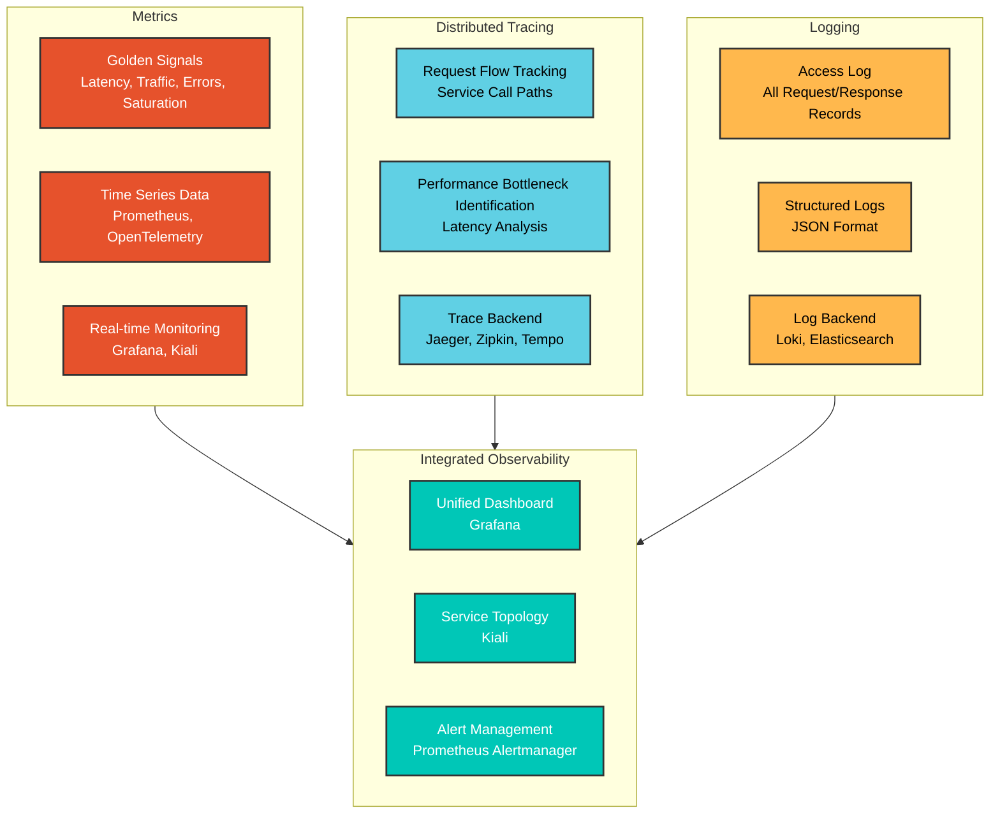
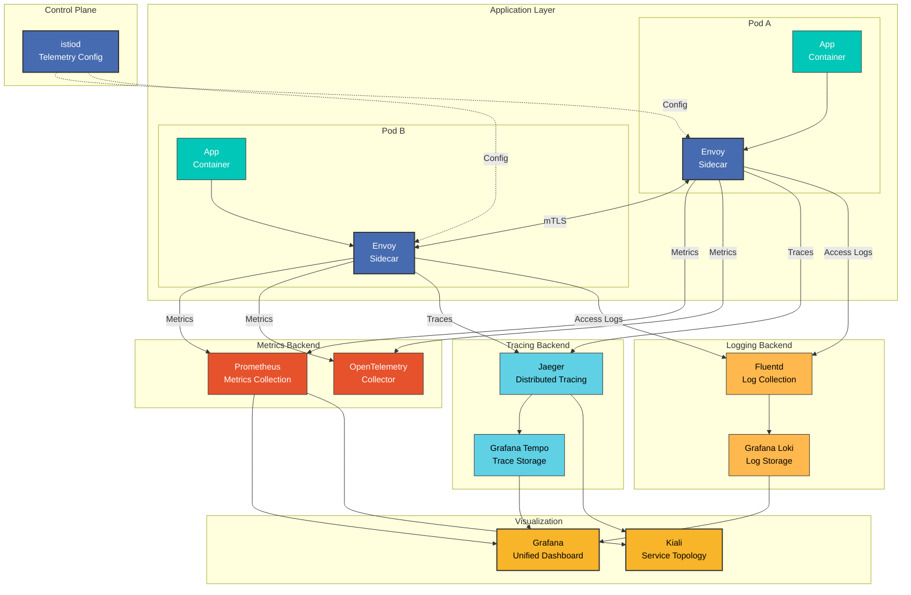

# 可観測性

> **サポート対象バージョン**: Istio 1.28
> **最終更新**: February 19, 2026

Istio は、service mesh 内で包括的な可観測性を提供します。アプリケーションコードを変更することなく、すべてのサービス間通信のメトリクス、ログ、トレースを自動的に収集します。

## 目次

1. [可観測性の概要](#observability-overview)
2. [可観測性の3つの柱](#three-pillars-of-observability)
3. [可観測性アーキテクチャ](#observability-architecture)
4. [Golden Signals](#golden-signals)
5. [詳細ドキュメント](#detailed-documentation)
6. [可観測性のベストプラクティス](#observability-best-practices)
7. [次のステップ](#next-steps)

## 可観測性の概要

<p align="center">
  
</p>

Istio の可観測性機能は、**Zero Instrumentation** の原則に従います。
- アプリケーションコードの変更は不要
- メトリクスの自動収集と送信
- 分散トレースの自動生成
- 標準化されたログ形式

## 可観測性の3つの柱

### 可観測性の3要素



### 1. メトリクス

**何を測定するか？**
- リクエスト数、応答時間、エラー率
- リソース使用率（CPU、メモリ）
- ネットワークトラフィック（Bytes、Packets）

**いつ使用するか？**
- システムヘルスの監視
- SLO/SLI の追跡
- 容量計画

**主要ツール**: Prometheus、Grafana、VictoriaMetrics

### 2. 分散トレーシング

**何を追跡するか？**
- 単一リクエストの完全な経路
- 各サービスの処理時間
- サービスの依存関係

**いつ使用するか？**
- パフォーマンスボトルネックの特定
- 障害の根本原因分析
- Microservices のデバッグ

**主要ツール**: Jaeger、Zipkin、Grafana Tempo

### 3. ロギング

**何を記録するか？**
- すべての HTTP リクエスト/レスポンス
- エラーと例外
- セキュリティイベント

**いつ使用するか？**
- 詳細なデバッグ
- セキュリティ監査
- コンプライアンス要件

**主要ツール**: Grafana Loki、Elasticsearch、Fluentd

## 可観測性アーキテクチャ

### 全体アーキテクチャ



### データフロー

**1. メトリクス収集フロー**:
```
App → Envoy (metric generation)
    → Prometheus (Scrape /stats/prometheus)
    → Grafana (visualization)
```

**2. 分散トレーシングフロー**:
```
App → Envoy (Span generation)
    → Jaeger/Zipkin (trace collection)
    → Tempo (long-term storage)
    → Grafana (trace visualization)
```

**3. ロギングフロー**:
```
App → Envoy (Access Log generation)
    → Fluentd/Fluent Bit (log collection)
    → Loki (log storage)
    → Grafana (log query and visualization)
```

## Golden Signals

Google SRE の原則に従う主要メトリクス:

### 1. レイテンシー

```promql
# P50 latency
histogram_quantile(0.50,
  sum(rate(istio_request_duration_milliseconds_bucket[5m])) by (le)
)

# P95 latency
histogram_quantile(0.95,
  sum(rate(istio_request_duration_milliseconds_bucket[5m])) by (le)
)

# P99 latency
histogram_quantile(0.99,
  sum(rate(istio_request_duration_milliseconds_bucket[5m])) by (le)
)
```

### 2. トラフィック

```promql
# Requests per second (RPS)
sum(rate(istio_requests_total[5m]))

# Traffic by service
sum(rate(istio_requests_total[5m])) by (destination_service)
```

### 3. エラー

```promql
# Error rate (%)
sum(rate(istio_requests_total{response_code=~"5.."}[5m]))
/
sum(rate(istio_requests_total[5m]))
* 100

# 4xx vs 5xx errors
sum(rate(istio_requests_total{response_code=~"4.."}[5m])) by (response_code)
sum(rate(istio_requests_total{response_code=~"5.."}[5m])) by (response_code)
```

### 4. 飽和度

```promql
# CPU utilization
rate(container_cpu_usage_seconds_total{pod=~".*"}[5m])

# Memory utilization
container_memory_working_set_bytes{pod=~".*"}
/
container_spec_memory_limit_bytes{pod=~".*"}
* 100
```

## 可観測性のベストプラクティス

### 1. 標準メトリクスを使用する

**推奨**:
- Istio 標準メトリクスの使用を優先する
- カスタムメトリクスは必要な場合にのみ追加する
- カーディナリティを考慮してラベルを最小限にする

**避けるべきこと**:
- 過剰なカスタムメトリクス
- 高カーディナリティのラベル（user_id、request_id など）

### 2. トレースサンプリング

本番環境に適切なサンプリングレートを設定します。

```yaml
apiVersion: install.istio.io/v1alpha1
kind: IstioOperator
spec:
  meshConfig:
    defaultConfig:
      tracing:
        sampling: 1.0  # Dev: 100%, Prod: 1-10%
```

**推奨サンプリングレート**:
- 開発: 100%
- ステージング: 10-50%
- 本番: 1-10%

### 3. Access Log の最適化

必要なフィールドのみを選択的に記録します。

```yaml
apiVersion: telemetry.istio.io/v1alpha1
kind: Telemetry
metadata:
  name: mesh-default
  namespace: istio-system
spec:
  accessLogging:
  - providers:
    - name: envoy
    filter:
      expression: response.code >= 400  # Record only errors
```

### 4. メトリクス保持ポリシー

データ保持期間を設定します。
- **リアルタイムメトリクス**: 1～7日（高解像度）
- **長期メトリクス**: 30～90日（ダウンサンプリング済み）
- **トレース**: 7～30日
- **ログ**: 規制に準拠（30～365日）

### 5. アラート設定

**重大アラート**（即時対応）:
- エラー率 > 5%
- P99 レイテンシー > しきい値
- Service 停止

**警告アラート**（監視）:
- エラー率 > 1%
- P95 レイテンシーの増加
- リソース使用率 > 80%

## 詳細ドキュメント

可観測性の各領域に関する詳細ガイド:

### 1. メトリクス

**[メトリクスガイド](01-metrics.md)** で以下を学びます:
- Istio 標準メトリクス
- Prometheus 統合
- OpenTelemetry 統合
- カスタムメトリクスの追加
- メトリクスの最適化

**主要トピック**:
- `istio_requests_total`: 総リクエスト数
- `istio_request_duration_milliseconds`: リクエストレイテンシー
- `istio_request_bytes`: リクエスト/レスポンスサイズ
- Circuit Breaker メトリクス
- Telemetry API のカスタマイズ

### 2. 分散トレーシング

**[分散トレーシングガイド](02-tracing.md)** で以下を学びます:
- Jaeger 統合
- Zipkin 統合
- トレースサンプリング
- コンテキスト伝播
- パフォーマンス分析

**主要トピック**:
- Trace Context 伝播（W3C Trace Context）
- Span の作成と管理
- バックエンドの選択（Jaeger、Zipkin、Tempo）
- サンプリング戦略
- トレース分析

### 3. ロギング

**[ロギングガイド](03-logging.md)** で以下を学びます:
- Access Log の設定
- ログ形式のカスタマイズ
- Grafana Loki 統合
- ログフィルタリング
- ログ集約

**主要トピック**:
- Envoy Access Log 形式
- JSON 構造化ログ
- ログレベル設定
- ログ収集（Fluentd、Fluent Bit）
- ログクエリ（LogQL）

### 4. ダッシュボード

**[ダッシュボードガイド](04-dashboards.md)** で以下を学びます:
- Grafana ダッシュボード
- Kiali service graph
- カスタムダッシュボードの作成
- アラートルール設定

**主要トピック**:
- Istio 標準ダッシュボード
- Service Mesh ダッシュボード
- Workload ダッシュボード
- Kiali トラフィックの可視化
- SLO ダッシュボード

## 次のステップ

1. **[メトリクス](01-metrics.md)**: Prometheus メトリクス収集とクエリ
2. **[分散トレーシング](02-tracing.md)**: Jaeger/Zipkin トレース分析
3. **[ロギング](03-logging.md)**: Access Log と Loki の統合
4. **[ダッシュボード](04-dashboards.md)**: Grafana と Kiali のダッシュボード

## 参考資料

### 公式ドキュメント
- [Istio Observability](https://istio.io/latest/docs/tasks/observability/)
- [Metrics](https://istio.io/latest/docs/tasks/observability/metrics/)
- [Distributed Tracing](https://istio.io/latest/docs/tasks/observability/distributed-tracing/)
- [Logs](https://istio.io/latest/docs/tasks/observability/logs/)

### 関連プロジェクト
- [Prometheus](https://prometheus.io/)
- [Grafana](https://grafana.com/)
- [Jaeger](https://www.jaegertracing.io/)
- [Grafana Loki](https://grafana.com/oss/loki/)
- [Kiali](https://kiali.io/)

### 標準と仕様
- [OpenTelemetry](https://opentelemetry.io/)
- [W3C Trace Context](https://www.w3.org/TR/trace-context/)
- [Google SRE - Golden Signals](https://sre.google/sre-book/monitoring-distributed-systems/)

## クイズ

この章で学んだ内容を確認するには、[Istio Observability Quiz](../../../quizzes/service-mesh/istio/observability.md) に挑戦してください。
