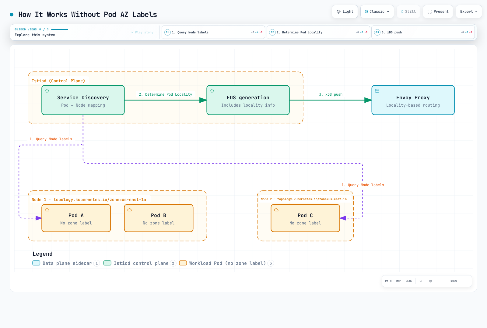

# ゾーンを考慮したルーティング

> **最終更新**: September 11, 2026 · Istio1.31。`localityLbSetting`でローカリティ重み付け/優先フェイルオーバーを扱います。別APIの`zoneAwareLbSetting`は前提と意味が異なるためフィールドを混ぜないでください。サイドカーメッシュと同じhostへの独立した代替ポリシーを前提とし、デプロイ/負荷テストはしていません。

ゾーンを考慮したルーティングはKubernetesのAZを認識して通信を最適化します。同じAZを優先して遅延とAZ間転送料を減らします。

## 目次

1. [概要](#overview)
2. [動作](#how-it-works)
3. [基本設定](#basic-configuration)
4. [高度な設定](#advanced-configuration)
5. [AWS EKSでの設定](#configuration-on-aws-eks)
6. [実践例](#practical-examples)
7. [監視](#monitoring)
8. [トラブルシューティング](#troubleshooting)

## 概要 {#overview}

次の利点を提供します。


### 利点

1. **遅延削減**: 同一AZ通信でネットワーク遅延を最小化
2. **費用節約**: AZ間転送料を削減
   - 実課金バイト、方向、リージョン、AWSサービス経路で見積もる。全EKS要求に普遍的なGB単価はない。
3. **可用性の支援**: 他ゾーンに正常で到達可能なエンドポイントと予備容量が必要。
4. **性能最適化**: ネットワーク帯域を最適化

## 動作 {#how-it-works}

### ローカリティ負荷分散アルゴリズム

80/10/10の`distribute`は通常通信を正常な全3ゾーンへ送り、10%部分は待機フェイルオーバーではありません。優先型フェイルオーバーは別モードです。ヘルス/容量重み付けでローカル全ホスト失敗前に通信が流出する場合があります。AZ文字は物理的隣接や遅延を表しません。


### ローカリティ階層

Istioは次の階層を使います。

```
Region/Zone/SubZone

Example:
us-east-1/us-east-1a/*
us-east-1/us-east-1b/*
us-west-2/us-west-2a/*
```

**デフォルトの優先順位**（優先フェイルオーバー有効時）:

1. 同じリージョン、ゾーン、サブゾーン。
2. 同じリージョン/ゾーン、異なるサブゾーン。
3. 同じリージョン、異なるゾーン。
4. 他リージョン。設定されていれば地域フェイルオーバーポリシーの順序。

### Pod AZラベルなしで動く仕組み

**重要**: Pod自身にAZラベルは不要です。Istioは**NodeのTopologyラベル**を読み、自動的にPod localityを判定します。

#### 動作



[🔍 インタラクティブな図を見る](https://www.atomai.click/kubernetes-docs/archmaps/en-service-mesh-istio-resilience-03-zone-aware-routing-2.html)

#### 段階的な処理

**ステップ1: IstiodがPod情報を収集**

```bash
# Istiod queries Pod information via Kubernetes API
kubectl get pod <pod-name> -o json | jq '.spec.nodeName'
# Output: "ip-10-0-1-10.ec2.internal"
```

**ステップ2: Pod実行NodeのTopologyラベルを照会**

```bash
# Query Node info using Pod's nodeName
kubectl get node ip-10-0-1-10.ec2.internal -o json | \
  jq '.metadata.labels."topology.kubernetes.io/zone"'
# Output: "us-east-1a"
```

**ステップ3: EDS（Endpoint Discovery Service）を生成**

以下は概略ClusterLoadAssignmentで、取得したCLI出力ではありません。実EDSには生成重み/優先順位とヘルス状態もあります。

```json
{
  "cluster_name": "outbound|8080||myapp.default.svc.cluster.local",
  "endpoints": [
    {
      "locality": {
        "region": "us-east-1",
        "zone": "us-east-1a"
      },
      "lb_endpoints": [
        {
          "endpoint": {
            "address": {
              "socket_address": {
                "address": "10.0.1.10",
                "port_value": 8080
              }
            }
          }
        }
      ]
    },
    {
      "locality": {
        "region": "us-east-1",
        "zone": "us-east-1b"
      },
      "lb_endpoints": [
        {
          "endpoint": {
            "address": {
              "socket_address": {
                "address": "10.0.2.20",
                "port_value": 8080
              }
            }
          }
        }
      ]
    }
  ]
}
```

**ステップ4: Envoyがローカリティルーティング**

Envoyは自身のlocalityと受信EDSを比較してルーティングします。

```bash
# Check Envoy's Locality (based on node it's running on)
istioctl proxy-config bootstrap <pod-name> -n default -o json | \
  jq '.bootstrap.node.locality'

# Output:
# {
#   "region": "us-east-1",
#   "zone": "us-east-1a"
# }
```

#### 確認方法

```bash
# 1. Check which Node the Pod is running on
kubectl get pod <pod-name> -o wide
# NAME        READY   STATUS    NODE
# myapp-abc   2/2     Running   ip-10-0-1-10.ec2.internal

# 2. Check the Node's Zone label
kubectl get node ip-10-0-1-10.ec2.internal \
  -o jsonpath='{.metadata.labels.topology\.kubernetes\.io/zone}'
# Output: us-east-1a

# 3. Check Endpoint Locality recognized by Envoy
istioctl proxy-config all <pod-name> -n default -o json | \
  jq '.configs[] | select(.["@type"] | endswith("EndpointsConfigDump")) |
      ((.dynamic_endpoint_configs // .dynamicEndpointConfigs // [])[] |
       (.endpoint_config // .endpointConfig)) |
      select((.cluster_name // .clusterName) == "outbound|8080||myapp.default.svc.cluster.local") |
      .endpoints[] | {locality, priority}'
```

#### Podラベルが不要な理由

スケジュール済みPodはそのUIDの間は同じノードに留まり、コントローラーが別ノードの新Podへ置換できます。IstiodはKubernetes検出でendpointとnode topologyを結び付けます。この通常経路に追加Podゾーンラベルは不要です。API watch/cacheとプロキシ設定は非同期収束するため即時更新と想定せず実効設定を確認します。カスタムテレメトリー情報付加は別事項です。

```yaml
# Relevant existing Node metadata; do not overwrite actual cloud topology
metadata:
  labels:
    topology.kubernetes.io/zone: us-east-1a
    topology.kubernetes.io/region: us-east-1
```

#### AWS EKSの自動設定

AWS EKSはノード作成時にTopologyラベルを自動追加します。

```bash
# Check EKS nodes
kubectl get nodes -L topology.kubernetes.io/zone,topology.kubernetes.io/region

# Example output:
# NAME                           ZONE         REGION
# ip-10-0-1-10.ec2.internal      us-east-1a   us-east-1
# ip-10-0-2-20.ec2.internal      us-east-1b   us-east-1
# ip-10-0-3-30.ec2.internal      us-east-1c   us-east-1
```

EC2ノードではcloud/bootstrap統合がAWSインスタンス配置を使います。`spec.providerID`はproviderインスタンスを識別し、EC2 instance IDそのものではありません。ワークロードからIMDSが制限される場合があり、IMDSv2にはトークンが必要です。適切なら下の読み取り専用EC2診断を使います。Fargateは独自診断が必要です。

## 基本設定 {#basic-configuration}

### 1. Kubernetes NodeのTopologyラベル設定

AWS EKSは次を自動追加します。

```yaml
topology.kubernetes.io/region: us-east-1
topology.kubernetes.io/zone: us-east-1a
```

**確認**:
```bash
kubectl get nodes -L topology.kubernetes.io/zone -L topology.kubernetes.io/region

# Example output:
# NAME                          ZONE         REGION
# ip-10-0-1-10.ec2.internal     us-east-1a   us-east-1
# ip-10-0-2-20.ec2.internal     us-east-1b   us-east-1
# ip-10-0-3-30.ec2.internal     us-east-1c   us-east-1
```

### 2. DestinationRuleでゾーン対応を有効化

```yaml
apiVersion: networking.istio.io/v1
kind: DestinationRule
metadata:
  name: myapp
  namespace: default
spec:
  host: myapp
  trafficPolicy:
    loadBalancer:
      localityLbSetting:
        enabled: true
    outlierDetection:
      consecutive5xxErrors: 5
      interval: 10s
      baseEjectionTime: 30s
      maxEjectionPercent: 100
      minHealthPercent: 0
```

基本例はlocality優先と外れ値検出です。除外上限100%は全異常先の除外を許し、容量が残らなければ「no healthy upstream」になり得ます。フェイルオーバー例で、普遍的に安全な上限ではありません。

### 3. 分配比率の設定

```yaml
apiVersion: networking.istio.io/v1
kind: DestinationRule
metadata:
  name: myapp
  namespace: default
spec:
  host: myapp
  trafficPolicy:
    loadBalancer:
      localityLbSetting:
        enabled: true
        distribute:
        - from: us-east-1/us-east-1a/*
          to:
            us-east-1/us-east-1a/*: 80
            us-east-1/us-east-1b/*: 10
            us-east-1/us-east-1c/*: 10
        - from: us-east-1/us-east-1b/*
          to:
            us-east-1/us-east-1b/*: 80
            us-east-1/us-east-1a/*: 10
            us-east-1/us-east-1c/*: 10
        - from: us-east-1/us-east-1c/*
          to:
            us-east-1/us-east-1c/*: 80
            us-east-1/us-east-1a/*: 10
            us-east-1/us-east-1b/*: 10
    outlierDetection:
      consecutive5xxErrors: 5
      interval: 10s
      baseEjectionTime: 30s
      maxEjectionPercent: 100
      minHealthPercent: 0
```

## 高度な設定 {#advanced-configuration}

### フェイルオーバー設定

```yaml
apiVersion: networking.istio.io/v1
kind: DestinationRule
metadata:
  name: myapp-failover
  namespace: default
spec:
  host: myapp
  trafficPolicy:
    loadBalancer:
      localityLbSetting:
        enabled: true
        failoverPriority:
        - topology.kubernetes.io/region
        - topology.kubernetes.io/zone
    outlierDetection:
      consecutive5xxErrors: 5
      interval: 10s
      baseEjectionTime: 30s
      maxEjectionPercent: 100
      minHealthPercent: 0
```

`localityLbSetting`の`failoverPriority`は上のようにregion/zoneメタデータを比較できます。一方`failover`は`region/zone`パスでなく**リージョン名**を取り、ゾーンA→B→Cの順序は表しません。ここでは`distribute`、`failover`、`failoverPriority`の1つを使います。別の`zoneAwareLbSetting` APIとはルールが異なります。

### 外れ値検出との併用

```yaml
apiVersion: networking.istio.io/v1
kind: DestinationRule
metadata:
  name: myapp-resilient
  namespace: default
spec:
  host: myapp
  trafficPolicy:
    loadBalancer:
      localityLbSetting:
        enabled: true
        distribute:
        - from: us-east-1/us-east-1a/*
          to:
            us-east-1/us-east-1a/*: 80
            us-east-1/us-east-1b/*: 20
    outlierDetection:
      consecutive5xxErrors: 5
      interval: 30s
      baseEjectionTime: 30s
      maxEjectionPercent: 50
      minHealthPercent: 0
```

`minHealthPercent`はプールのpanic/fail-openしきい値で、ゾーン別最小正常容量ではありません。0で無効になります。80/20分配は正常な両ゾーンを使い続け、待機フェイルオーバーではありません。

### マルチリージョン設定

```yaml
apiVersion: networking.istio.io/v1
kind: DestinationRule
metadata:
  name: myapp-multi-region
  namespace: default
spec:
  host: myapp.default.svc.cluster.local
  trafficPolicy:
    loadBalancer:
      localityLbSetting:
        enabled: true
        distribute:
        - from: us-east-1/*
          to:
            us-east-1/*: 90
            us-west-2/*: 10
        - from: us-west-2/*
          to:
            us-west-2/*: 90
            us-east-1/*: 10
    outlierDetection:
      consecutive5xxErrors: 5
      interval: 10s
      baseEjectionTime: 30s
      maxEjectionPercent: 100
      minHealthPercent: 0
```

90/10例は分配のみです。両地域でサービスを公開する実マルチクラスター/ネットワークが必要で、`myapp.global`は自動作成サービスではありません。優先フェイルオーバーなら次の別ポリシーを使い、実endpoint/接続を確認します。

```yaml
# Alternative to distribute: region-name priority failover
apiVersion: networking.istio.io/v1
kind: DestinationRule
metadata:
  name: myapp-regional-failover
  namespace: default
spec:
  host: myapp.default.svc.cluster.local
  trafficPolicy:
    loadBalancer:
      localityLbSetting:
        enabled: true
        failover:
        - from: us-east-1
          to: us-west-2
        - from: us-west-2
          to: us-east-1
    outlierDetection:
      consecutive5xxErrors: 5
      interval: 10s
      baseEjectionTime: 30s
      maxEjectionPercent: 100
      minHealthPercent: 0
```

## AWS EKSでの設定 {#configuration-on-aws-eks}

### 1. 複数AZノードグループを作成

```yaml
apiVersion: eksctl.io/v1alpha5
kind: ClusterConfig
metadata:
  name: my-cluster
  region: us-east-1
  version: '1.36'
nodeGroups:
- name: ng-zone-a
  instanceType: t3.medium
  desiredCapacity: 2
  availabilityZones:
  - us-east-1a
  amiFamily: AmazonLinux2023
- name: ng-zone-b
  instanceType: t3.medium
  desiredCapacity: 2
  availabilityZones:
  - us-east-1b
  amiFamily: AmazonLinux2023
- name: ng-zone-c
  instanceType: t3.medium
  desiredCapacity: 2
  availabilityZones:
  - us-east-1c
  amiFamily: AmazonLinux2023
```

eksctlファイルは課金されるクラスター/ノードグループ設計例で、監査で実行したコマンドではありません。文書化されたIstio/EKS互換範囲のKubernetes1.36に固定しAL2023を使います。実サブネット/AZ、インスタンス容量、アクセスを選びます。既存クラスターには適切な変更計画が必要です。

### 2. Podをゾーン間に分散

意図的に解決不能なイメージを、HTTP8080を提供するテスト済みアプリへ置換し準備動作を設定します。下のServiceがポリシーの`myapp`宛先を提供します。`maxSkew: 1`は適格ドメイン間に適用し、無条件3ゾーン保証ではありません。node affinity、Taint、容量、`minDomains`が配置に影響します。


```yaml
apiVersion: apps/v1
kind: Deployment
metadata:
  name: myapp
  namespace: default
spec:
  replicas: 9
  selector:
    matchLabels:
      app: myapp
  template:
    metadata:
      labels:
        app: myapp
    spec:
      topologySpreadConstraints:
      - maxSkew: 1
        topologyKey: topology.kubernetes.io/zone
        whenUnsatisfiable: DoNotSchedule
        labelSelector:
          matchLabels:
            app: myapp
      containers:
      - name: myapp
        image: example.invalid/myapp:replace-with-tested-tag
        ports:
        - containerPort: 8080
        resources:
          requests:
            memory: 64Mi
            cpu: 100m
          limits:
            memory: 128Mi
            cpu: 200m
---
apiVersion: v1
kind: Service
metadata:
  name: myapp
  namespace: default
spec:
  selector:
    app: myapp
  ports:
  - name: http
    port: 8080
    targetPort: 8080
```

### 3. Istioでゾーン対応を有効化

```yaml
apiVersion: networking.istio.io/v1
kind: DestinationRule
metadata:
  name: myapp
  namespace: default
spec:
  host: myapp
  trafficPolicy:
    loadBalancer:
      localityLbSetting:
        enabled: true
        distribute:
        - from: us-east-1/us-east-1a/*
          to:
            us-east-1/us-east-1a/*: 80
            us-east-1/us-east-1b/*: 10
            us-east-1/us-east-1c/*: 10
    outlierDetection:
      consecutive5xxErrors: 5
      interval: 10s
      baseEjectionTime: 30s
      maxEjectionPercent: 100
      minHealthPercent: 0
```

## 実践例 {#practical-examples}

### 例1: マイクロサービスチェーン

最初の3文書は既存frontend/backend DeploymentとDBワークロードの**Podテンプレートパッチ**で、完全リソースではありません。実コンテナ、セレクター、Service、ストレージを持つワークロードへマージします。DB affinityはゾーン固定済みの1ボリューム/インスタンス例で、全DBレプリカを1 AZへ置くHA推奨ではありません。最後のDestinationRuleは実`backend` Serviceを前提とします。


```yaml
spec:
  template:
    metadata:
      labels:
        app: frontend
    spec:
      topologySpreadConstraints:
      - maxSkew: 1
        topologyKey: topology.kubernetes.io/zone
        whenUnsatisfiable: DoNotSchedule
        labelSelector:
          matchLabels:
            app: frontend
---
spec:
  template:
    metadata:
      labels:
        app: backend
    spec:
      topologySpreadConstraints:
      - maxSkew: 1
        topologyKey: topology.kubernetes.io/zone
        whenUnsatisfiable: DoNotSchedule
        labelSelector:
          matchLabels:
            app: backend
---
spec:
  template:
    metadata:
      labels:
        app: database
    spec:
      affinity:
        nodeAffinity:
          requiredDuringSchedulingIgnoredDuringExecution:
            nodeSelectorTerms:
            - matchExpressions:
              - key: topology.kubernetes.io/zone
                operator: In
                values:
                - us-east-1a
---
apiVersion: networking.istio.io/v1
kind: DestinationRule
metadata:
  name: backend
  namespace: default
spec:
  host: backend
  trafficPolicy:
    loadBalancer:
      localityLbSetting:
        enabled: true
        distribute:
        - from: us-east-1/us-east-1a/*
          to:
            us-east-1/us-east-1a/*: 90
            us-east-1/us-east-1b/*: 5
            us-east-1/us-east-1c/*: 5
    outlierDetection:
      consecutive5xxErrors: 5
      interval: 10s
      baseEjectionTime: 30s
      maxEjectionPercent: 100
      minHealthPercent: 0
```

### 例2: 費用最適化

```yaml
apiVersion: networking.istio.io/v1
kind: DestinationRule
metadata:
  name: cost-optimized
  namespace: default
spec:
  host: myapp
  trafficPolicy:
    loadBalancer:
      localityLbSetting:
        enabled: true
        distribute:
        - from: us-east-1/us-east-1a/*
          to:
            us-east-1/us-east-1a/*: 95
            us-east-1/us-east-1b/*: 3
            us-east-1/us-east-1c/*: 2
    outlierDetection:
      consecutive5xxErrors: 5
      interval: 10s
      baseEjectionTime: 30s
      maxEjectionPercent: 100
      minHealthPercent: 0
```

95/3/2はzoneA呼び出し元だけが対象で、必要なら他source localityを定義します。集中でローカル先が過負荷になり得ます。[EKSネットワーク費用ガイド](https://docs.aws.amazon.com/eks/latest/best-practices/cost-opt-networking.html)で実課金バイトとサービス別価格を比較します。要求数/重みだけでは費用計算になりません。

### 例3: 高可用性

```yaml
apiVersion: networking.istio.io/v1
kind: DestinationRule
metadata:
  name: high-availability
  namespace: default
spec:
  host: myapp
  trafficPolicy:
    loadBalancer:
      localityLbSetting:
        enabled: true
        distribute:
        - from: us-east-1/us-east-1a/*
          to:
            us-east-1/us-east-1a/*: 34
            us-east-1/us-east-1b/*: 33
            us-east-1/us-east-1c/*: 33
    outlierDetection:
      consecutive5xxErrors: 5
      interval: 10s
      baseEjectionTime: 30s
      maxEjectionPercent: 100
      minHealthPercent: 0
```

## 監視 {#monitoring}

### Prometheusメトリクス

`source_zone`と`destination_zone`は**標準Istioメトリクスラベルではありません**。任意クエリには、通常serviceラベルを保ち両端を実ゾーンに対応させる別実装・検証済み情報付加pipelineが必要です。この章はそれをデプロイしません。Nodeラベル、locality有効化、Grafanaパネルだけではメトリクスは生まれません。必要ならcluster/accountを保持します。AWS AZ名の物理対応はアカウント間で異なり、AZ IDは同じ物理ゾーンを識別します。

例は1クラスター/アカウントのus-east-1a/b/c間を明示対象とします。不明ゾーン、他地域、他宛先は分子/分母の両方から除外します。PromQLは`{source_zone=destination_zone}`のようにセレクター内で2ラベル値を比較できません。下のように明示ペアを使います。rateは毎秒、同一ゾーン結果は0–100%です。

```promql
sum by (source_zone, destination_zone) (rate(istio_requests_total{reporter="source",source_workload_namespace="default",destination_service="myapp.default.svc.cluster.local",source_zone=~"us-east-1[abc]",destination_zone=~"us-east-1[abc]"}[5m]))

100 * sum(rate(istio_requests_total{reporter="source",source_workload_namespace="default",destination_service="myapp.default.svc.cluster.local",source_zone="us-east-1a",destination_zone="us-east-1a"}[5m]) or rate(istio_requests_total{reporter="source",source_workload_namespace="default",destination_service="myapp.default.svc.cluster.local",source_zone="us-east-1b",destination_zone="us-east-1b"}[5m]) or rate(istio_requests_total{reporter="source",source_workload_namespace="default",destination_service="myapp.default.svc.cluster.local",source_zone="us-east-1c",destination_zone="us-east-1c"}[5m])) / sum(rate(istio_requests_total{reporter="source",source_workload_namespace="default",destination_service="myapp.default.svc.cluster.local",source_zone=~"us-east-1[abc]",destination_zone=~"us-east-1[abc]"}[5m]))

sum by (destination_zone) (rate(istio_requests_total{reporter="source",source_workload_namespace="default",destination_service="myapp.default.svc.cluster.local",source_zone=~"us-east-1[abc]",destination_zone=~"us-east-1[abc]",response_code=~"5.."}[5m])) / sum by (destination_zone) (rate(istio_requests_total{reporter="source",source_workload_namespace="default",destination_service="myapp.default.svc.cluster.local",source_zone=~"us-east-1[abc]",destination_zone=~"us-east-1[abc]"}[5m]))
```

無通信、情報付加欠損、収集失敗は別処理です。source報告は要求数で課金バイトではなく、destination報告は未到着失敗を省きます。アクティブcluster接続は宛先ゾーンを示さず、locality効果の証拠ではありません。

### Grafanaダッシュボード

上の情報付加とUID `prometheus`が必要です。[ダッシュボード章](../observability/04-dashboards.md)で完全オブジェクトを設定します。情報付加なしではAZ通信の測定として機能しません。

```json
{
  "uid": "istio-enriched-zone-traffic",
  "title": "Istio Enriched Zone Traffic",
  "panels": [
    {
      "id": 1,
      "title": "Enriched Request Rate by Zone",
      "type": "timeseries",
      "datasource": {
        "type": "prometheus",
        "uid": "prometheus"
      },
      "targets": [
        {
          "expr": "sum by (source_zone, destination_zone) (rate(istio_requests_total{reporter=\"source\",source_workload_namespace=\"default\",destination_service=\"myapp.default.svc.cluster.local\",source_zone=~\"us-east-1[abc]\",destination_zone=~\"us-east-1[abc]\"}[5m]))",
          "legendFormat": "{{source_zone}} → {{destination_zone}}",
          "refId": "A"
        }
      ],
      "gridPos": {
        "x": 0,
        "y": 0,
        "w": 24,
        "h": 8
      },
      "fieldConfig": {
        "defaults": {
          "unit": "reqps"
        }
      }
    },
    {
      "id": 2,
      "title": "Same-Zone Percentage (Known a/b/c Traffic)",
      "type": "timeseries",
      "datasource": {
        "type": "prometheus",
        "uid": "prometheus"
      },
      "targets": [
        {
          "expr": "100 * sum(rate(istio_requests_total{reporter=\"source\",source_workload_namespace=\"default\",destination_service=\"myapp.default.svc.cluster.local\",source_zone=\"us-east-1a\",destination_zone=\"us-east-1a\"}[5m]) or rate(istio_requests_total{reporter=\"source\",source_workload_namespace=\"default\",destination_service=\"myapp.default.svc.cluster.local\",source_zone=\"us-east-1b\",destination_zone=\"us-east-1b\"}[5m]) or rate(istio_requests_total{reporter=\"source\",source_workload_namespace=\"default\",destination_service=\"myapp.default.svc.cluster.local\",source_zone=\"us-east-1c\",destination_zone=\"us-east-1c\"}[5m])) / sum(rate(istio_requests_total{reporter=\"source\",source_workload_namespace=\"default\",destination_service=\"myapp.default.svc.cluster.local\",source_zone=~\"us-east-1[abc]\",destination_zone=~\"us-east-1[abc]\"}[5m]))",
          "legendFormat": "Same-zone %",
          "refId": "A"
        }
      ],
      "gridPos": {
        "x": 0,
        "y": 8,
        "w": 24,
        "h": 8
      },
      "fieldConfig": {
        "defaults": {
          "unit": "percent"
        }
      }
    }
  ],
  "time": {
    "from": "now-1h",
    "to": "now"
  },
  "refresh": "30s"
}
```

### リアルタイム確認

`proxy-config endpoints`はホスト健全性に有用ですが、EDS locality割り当てとは表示が異なります。`proxy-config all -o json`はEDSを含むため、対応ClusterLoadAssignmentを調べます。クエリは生snake_caseと正規化camelCase両フィールドを受け入れます。設定証拠であり観測通信分布ではありません。

```bash
istioctl proxy-config endpoints <pod-name> -n <namespace>

istioctl proxy-config all <pod-name> -n <namespace> -o json | \
  jq '.configs[] | select(.["@type"] | endswith("EndpointsConfigDump")) |
      ((.dynamic_endpoint_configs // .dynamicEndpointConfigs // [])[] |
       (.endpoint_config // .endpointConfig)) |
      select((.cluster_name // .clusterName) == "outbound|8080||myapp.default.svc.cluster.local") |
      .endpoints[] | {locality, priority}'
```

## トラブルシューティング {#troubleshooting}

### ゾーン対応ルーティングが動かない

ラベル修復前に実クラウドトポロジーを確認します。全ノードに任意の1ゾーンラベルを付けると、スケジューラー/ストレージ/経路判断を変え、メタデータが誤る場合があります。例は意図ポリシーが呼び出し元プロキシへ届き、宛先が検出可能である必要があります。

```bash
kubectl get nodes -L topology.kubernetes.io/region,topology.kubernetes.io/zone
kubectl get destinationrule -n <namespace>
kubectl describe destinationrule <name> -n <namespace>
istioctl analyze -n <namespace>
istioctl proxy-config clusters <pod-name> -n <namespace> --fqdn myapp.default.svc.cluster.local -o json
kubectl get pods -n <namespace> -l app=myapp -o wide
```

上のコマンドでEDSを読みます。Kubernetes EDSクラスターではcluster設定の`.loadAssignment`はendpointソースではありません。PodゾーンラベルはNodeから自動コピーされず、`.spec.nodeName`で結合します。

### 他ゾーンへの通信割合が高い

構造化フィールドでPod→Node配置と準備を確認します。Runningでも未準備の場合があり、ノード数要約はAZ数要約ではありません。ロールアウト中は2スナップショットの時刻がずれる場合があります。

```bash
kubectl get nodes -o json > /tmp/zone-nodes.json
kubectl get pods -n default -l app=myapp -o json > /tmp/zone-pods.json
jq -r --slurpfile nodes /tmp/zone-nodes.json '
  ($nodes[0].items | map({key: .metadata.name,
    value: .metadata.labels["topology.kubernetes.io/zone"]}) | from_entries) as $zones |
  .items[] | [.metadata.name, (.spec.nodeName // "unscheduled"),
    ($zones[(.spec.nodeName // "")] // "unknown"),
    ([.status.conditions[]? | select(.type == "Ready") | .status][0] // "Unknown")] | @tsv
' /tmp/zone-pods.json

istioctl x envoy-stats <pod-name> -n <namespace> --output prom | grep outlier_detection
```

endpoint/除外状態、source-localityの`from`一致、接続再利用、通信量、予備ゾーン容量も確認します。重み分配は正常通信の一部を意図的に他ゾーンへ送ります。レプリカ数の不均衡だけで設定ゾーン重みは再定義されません。

### EKSでTopologyラベルがない

AWS Node Termination Handlerは中断/終了イベントに応じ、導入してもtopologyラベルは直りません。EKS node bootstrap/cloud統合と実配置を調べます。下は**読み取り専用かつEC2ノード専用**で、providerIDからinstance IDを抽出しcluster regionを渡します。ノードを再ラベルしません。Fargateや非EC2は適切な診断を使います。

```bash
CLUSTER_REGION=us-east-1
NODE_NAME=<node-name>
PROVIDER_ID=$(kubectl get node "$NODE_NAME" -o jsonpath='{.spec.providerID}')
INSTANCE_ID=${PROVIDER_ID##*/}
if [[ ! "$INSTANCE_ID" =~ ^i-([0-9a-f]{8}|[0-9a-f]{17})$ ]]; then
  echo "Expected an EC2 instance ID in providerID; inspect the node platform." >&2
  exit 1
fi
aws ec2 describe-instances --region "$CLUSTER_REGION" \
  --instance-ids "$INSTANCE_ID" \
  --query 'Reservations[].Instances[].{InstanceId:InstanceId,AZ:Placement.AvailabilityZone,State:State.Name}' \
  --output table
```

レビュー済みbootstrap/ラベル修復前にaccount/regionと実Node IDを確認します。`--instance-ids`へ`aws:///zone/i-...` URI全体を渡さず、未認証IMDSv1が動くとも想定しないでください。

## ベストプラクティス

### 1. Podをゾーン間で均等配置

Podテンプレートの`spec`下へ置き、セレクターをPodラベルに合わせます。制約は適格ドメインを数えます。ゾーン不在時に厳格配置でPodをPendingにすべきか検討します。


```yaml
# Use topologySpreadConstraints
topologySpreadConstraints:
- maxSkew: 1
  topologyKey: topology.kubernetes.io/zone
  whenUnsatisfiable: DoNotSchedule
  labelSelector:
    matchLabels:
      app: myapp
```

### 2. 費用最適化

```yaml
# Prioritize same zone (80% or more)
distribute:
- from: us-east-1/us-east-1a/*
  to:
    "us-east-1/us-east-1a/*": 80
    "us-east-1/us-east-1b/*": 10
    "us-east-1/us-east-1c/*": 10
```

### 3. 高可用性の確保

検証済み予備容量とともにlocality優先と外れ値検出を使います。断片は`trafficPolicy.loadBalancer.localityLbSetting`下です。`failover`はゾーンでなく地域を順序付け、`distribute`の代替です。

```yaml
failover:
- from: us-east-1
  to: us-west-2
```

### 4. ステートフルなワークロードのストレージと可用性

EBSと接続EC2は同じAZにある必要があります。個別ボリューム/レプリカの制約で、StatefulSet全レプリカではありません。互換ストレージと配置で障害ドメイン間DB複製/切り替えを設計します。topology対応ルーティングは安全な書込primaryを選べません。下のaffinityは既存zoneAボリュームに意図的に固定したワークロード専用で、全ステートフルレプリカを1 AZへ置く一般推奨ではありません。


```yaml
# Pod-spec fragment for one existing zonal volume/replica
affinity:
  nodeAffinity:
    requiredDuringSchedulingIgnoredDuringExecution:
      nodeSelectorTerms:
      - matchExpressions:
        - key: topology.kubernetes.io/zone
          operator: In
          values:
          - us-east-1a
```

Kubernetes Serviceのtopology hints/通信分配とIstio Envoy負荷分散は別機構です。Serviceアノテーション有効化で呼び出し元サイドカーのlocalityポリシーが設定されると想定しないでください。

## 参考資料

- [Istioローカリティ負荷分散](https://istio.io/latest/docs/tasks/traffic-management/locality-load-balancing/)
- [Kubernetesトポロジー対応ルーティング](https://kubernetes.io/docs/concepts/services-networking/topology-aware-routing/)
- [AWS EKS耐障害性](https://docs.aws.amazon.com/eks/latest/userguide/disaster-recovery-resiliency.html)
- [EKSネットワーク費用最適化](https://docs.aws.amazon.com/eks/latest/best-practices/cost-opt-networking.html)
- [EBSボリュームのAZ](https://docs.aws.amazon.com/ebs/latest/userguide/ebs-volumes.html)
- [AWS AZ ID](https://docs.aws.amazon.com/global-infrastructure/latest/regions/az-ids.html)
