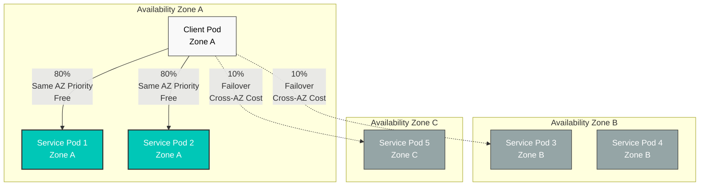
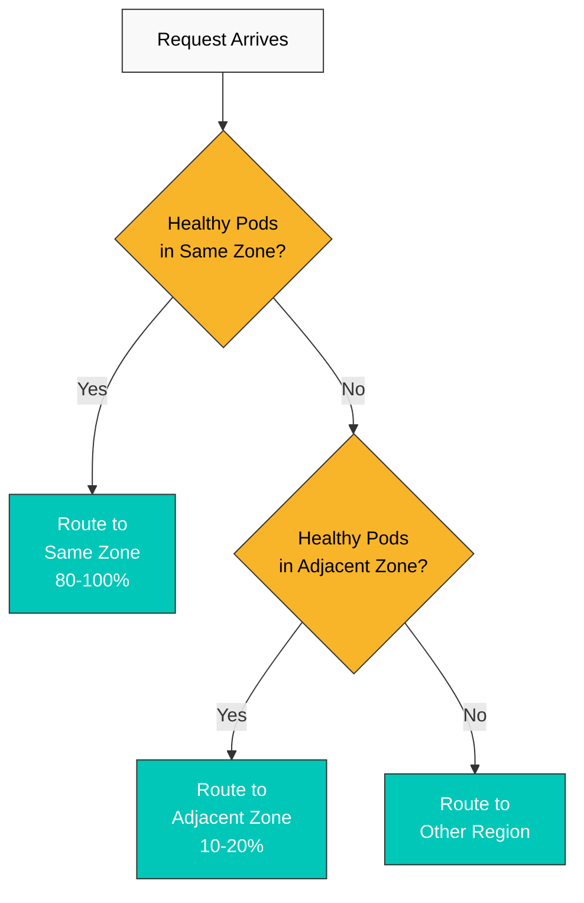
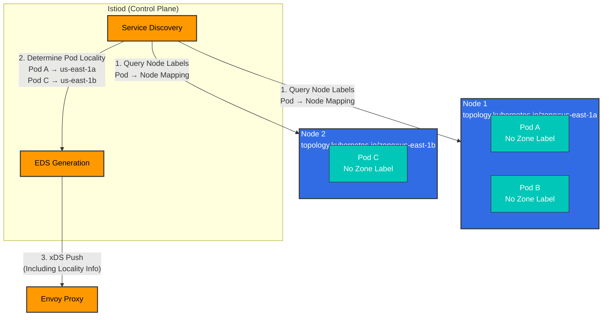

# Zone Aware Routing（ゾーン認識ルーティング）

Zone Aware Routing は、Kubernetes の Availability Zone を認識してトラフィックを最適化する機能です。同一 AZ 内の通信を優先することで、レイテンシーと AZ 間データ転送コストを削減します。

## 目次

1. [概要](#overview)
2. [仕組み](#how-it-works)
3. [基本設定](#basic-configuration)
4. [高度な設定](#advanced-configuration)
5. [AWS EKS での設定](#configuration-on-aws-eks)
6. [実践例](#practical-examples)
7. [モニタリング](#monitoring)
8. [トラブルシューティング](#troubleshooting)

## 概要

Zone Aware Routing には次の利点があります。



### 利点

1. **レイテンシーの削減**: 同一 AZ 内の通信によりネットワークレイテンシーを最小化
2. **コスト削減**: AZ 間データ転送コストを削減
   - AWS: AZ 間転送では GB あたり $0.01-0.02
3. **可用性の向上**: 障害時に他の AZ へ自動フェイルオーバー
4. **パフォーマンスの最適化**: ネットワーク帯域幅を最適化

## 仕組み

### Locality 負荷分散アルゴリズム



### Locality の階層

Istio は次の階層的な Locality を使用します。

```
Region/Zone/SubZone

Example:
us-east-1/us-east-1a/*
us-east-1/us-east-1b/*
us-west-2/us-west-2a/*
```

**優先順位**:
1. **同一 Zone**: 同一 Region、同一 Zone
2. **同一 Region**: 同一 Region、異なる Zone
3. **異なる Region**: 異なる Region

### Pod AZ ラベルなしでの動作

**重要**: Pod 自体に AZ ラベルは不要です。Istio は **Node Topology labels** を読み取り、Pod Locality を自動的に判定します。

#### 仕組み



#### 手順

**ステップ 1: Istiod が Pod 情報を収集する**

```bash
# Istiod queries Pod information via Kubernetes API
kubectl get pod <pod-name> -o json | jq '.spec.nodeName'
# Output: "ip-10-0-1-10.ec2.internal"
```

**ステップ 2: Pod を実行している Node の Topology ラベルを照会する**

```bash
# Query Node info using Pod's nodeName
kubectl get node ip-10-0-1-10.ec2.internal -o json | \
  jq '.metadata.labels."topology.kubernetes.io/zone"'
# Output: "us-east-1a"
```

**ステップ 3: EDS（Endpoint Discovery Service）を生成する**

Istiod は Pod IP と Locality 情報を含む EDS を生成します。

```json
{
  "cluster_name": "outbound|8080||myapp.default.svc.cluster.local",
  "endpoints": [
    {
      "locality": {
        "region": "us-east-1",
        "zone": "us-east-1a"
      },
      "lb_endpoints": [
        {
          "endpoint": {
            "address": {
              "socket_address": {
                "address": "10.0.1.10",
                "port_value": 8080
              }
            }
          }
        }
      ]
    },
    {
      "locality": {
        "region": "us-east-1",
        "zone": "us-east-1b"
      },
      "lb_endpoints": [
        {
          "endpoint": {
            "address": {
              "socket_address": {
                "address": "10.0.2.20",
                "port_value": 8080
              }
            }
          }
        }
      ]
    }
  ]
}
```

**ステップ 4: Envoy が Locality ベースのルーティングを実行する**

Envoy はルーティングのために自身の Locality と受信した EDS 情報を比較します。

```bash
# Check Envoy's Locality (based on node it's running on)
kubectl exec <pod-name> -c istio-proxy -- \
  curl -s localhost:15000/config_dump | \
  jq '.configs[] | select(.["@type"] | contains("BootstrapConfigDump")) | .bootstrap.node.locality'

# Output:
# {
#   "region": "us-east-1",
#   "zone": "us-east-1a"
# }
```

#### 検証方法

```bash
# 1. Check which Node the Pod is running on
kubectl get pod <pod-name> -o wide
# NAME        READY   STATUS    NODE
# myapp-abc   2/2     Running   ip-10-0-1-10.ec2.internal

# 2. Check the Node's Zone label
kubectl get node ip-10-0-1-10.ec2.internal \
  -o jsonpath='{.metadata.labels.topology\.kubernetes\.io/zone}'
# Output: us-east-1a

# 3. Check Endpoint Locality recognized by Envoy
istioctl proxy-config endpoints <pod-name> | grep myapp
# ENDPOINT          STATUS    OUTLIER CHECK     CLUSTER                    LOCALITY
# 10.0.1.10:8080    HEALTHY   OK                myapp.default              us-east-1/us-east-1a
# 10.0.2.20:8080    HEALTHY   OK                myapp.default              us-east-1/us-east-1b
```

#### Pod ラベルが不要な理由

**従来のアプローチ（不要）**:
```yaml
# Not needed
apiVersion: v1
kind: Pod
metadata:
  labels:
    topology.kubernetes.io/zone: us-east-1a  # Unnecessary!
```

**Istio のアプローチ（自動）**:
```yaml
# Only Node labels needed
apiVersion: v1
kind: Node
metadata:
  name: ip-10-0-1-10.ec2.internal
  labels:
    topology.kubernetes.io/zone: us-east-1a  # This is all you need!
    topology.kubernetes.io/region: us-east-1
```

**理由**:
1. **Pod は移動しない**: Pod は作成後に他の Node へ移動しません
2. **Node が信頼できる情報源である**: Pod の物理的な配置場所は常に Node によって決まります
3. **冗長性を排除**: 各 Pod にラベルを追加する必要はなく、Node ラベルのみを管理します
4. **自動同期**: Istiod は Kubernetes API から常に最新の Node 情報を照会します

#### AWS EKS の自動設定

AWS EKS は Node の作成時に Topology ラベルを自動的に追加します。

```bash
# Check EKS nodes
kubectl get nodes -L topology.kubernetes.io/zone,topology.kubernetes.io/region

# Example output:
# NAME                           ZONE         REGION
# ip-10-0-1-10.ec2.internal      us-east-1a   us-east-1
# ip-10-0-2-20.ec2.internal      us-east-1b   us-east-1
# ip-10-0-3-30.ec2.internal      us-east-1c   us-east-1
```

これらのラベルは、次のソースから自動的に取得されます。
- **EC2 Instance Metadata**: `http://169.254.169.254/latest/meta-data/placement/availability-zone`
- **AWS API**: Node の `spec.providerID` を通じて EC2 情報を照会

## 基本設定

### 1. Kubernetes Node に Topology ラベルを設定する

AWS EKS は次のラベルを自動的に追加します。

```yaml
topology.kubernetes.io/region: us-east-1
topology.kubernetes.io/zone: us-east-1a
```

**検証**:
```bash
kubectl get nodes -L topology.kubernetes.io/zone -L topology.kubernetes.io/region

# Example output:
# NAME                          ZONE         REGION
# ip-10-0-1-10.ec2.internal     us-east-1a   us-east-1
# ip-10-0-2-20.ec2.internal     us-east-1b   us-east-1
# ip-10-0-3-30.ec2.internal     us-east-1c   us-east-1
```

### 2. DestinationRule で Zone Aware Routing を有効にする

```yaml
apiVersion: networking.istio.io/v1
kind: DestinationRule
metadata:
  name: myapp
  namespace: default
spec:
  host: myapp
  trafficPolicy:
    loadBalancer:
      localityLbSetting:
        enabled: true  # Enable Zone Aware Routing
```

### 3. 分散比率を設定する

```yaml
apiVersion: networking.istio.io/v1
kind: DestinationRule
metadata:
  name: myapp
  namespace: default
spec:
  host: myapp
  trafficPolicy:
    loadBalancer:
      localityLbSetting:
        enabled: true
        distribute:
        # Traffic originating from us-east-1a
        - from: us-east-1/us-east-1a/*
          to:
            "us-east-1/us-east-1a/*": 80   # 80% to same AZ
            "us-east-1/us-east-1b/*": 10   # 10% to adjacent AZ
            "us-east-1/us-east-1c/*": 10   # 10% to adjacent AZ

        # Traffic originating from us-east-1b
        - from: us-east-1/us-east-1b/*
          to:
            "us-east-1/us-east-1b/*": 80
            "us-east-1/us-east-1a/*": 10
            "us-east-1/us-east-1c/*": 10

        # Traffic originating from us-east-1c
        - from: us-east-1/us-east-1c/*
          to:
            "us-east-1/us-east-1c/*": 80
            "us-east-1/us-east-1a/*": 10
            "us-east-1/us-east-1b/*": 10
```

## 高度な設定

### フェイルオーバー設定

```yaml
apiVersion: networking.istio.io/v1
kind: DestinationRule
metadata:
  name: myapp-failover
  namespace: default
spec:
  host: myapp
  trafficPolicy:
    loadBalancer:
      localityLbSetting:
        enabled: true
        failover:
        # When us-east-1a fails, go to us-east-1b
        - from: us-east-1/us-east-1a
          to: us-east-1/us-east-1b

        # When us-east-1b fails, go to us-east-1c
        - from: us-east-1/us-east-1b
          to: us-east-1/us-east-1c

        # When us-east-1c fails, go to us-east-1a
        - from: us-east-1/us-east-1c
          to: us-east-1/us-east-1a
```

### Outlier Detection との併用

```yaml
apiVersion: networking.istio.io/v1
kind: DestinationRule
metadata:
  name: myapp-resilient
  namespace: default
spec:
  host: myapp
  trafficPolicy:
    # Zone Aware Routing
    loadBalancer:
      localityLbSetting:
        enabled: true
        distribute:
        - from: us-east-1/us-east-1a/*
          to:
            "us-east-1/us-east-1a/*": 80
            "us-east-1/us-east-1b/*": 20

    # Outlier Detection
    outlierDetection:
      consecutiveErrors: 5
      interval: 30s
      baseEjectionTime: 30s
      maxEjectionPercent: 50

      # Maintain minimum healthy instances per zone
      minHealthPercent: 50
```

### 複数 Region の設定

```yaml
apiVersion: networking.istio.io/v1
kind: DestinationRule
metadata:
  name: myapp-multi-region
  namespace: default
spec:
  host: myapp.global
  trafficPolicy:
    loadBalancer:
      localityLbSetting:
        enabled: true

        # Cross-region distribution
        distribute:
        # Traffic originating from us-east-1
        - from: us-east-1/*/*
          to:
            "us-east-1/*/*": 90      # 90% to same region
            "us-west-2/*/*": 10      # 10% to other region

        # Traffic originating from us-west-2
        - from: us-west-2/*/*
          to:
            "us-west-2/*/*": 90
            "us-east-1/*/*": 10

        # Region failover
        failover:
        - from: us-east-1
          to: us-west-2
        - from: us-west-2
          to: us-east-1
```

## AWS EKS での設定

### 1. 複数 AZ の Node Group を作成する

```yaml
# eksctl configuration
apiVersion: eksctl.io/v1alpha5
kind: ClusterConfig

metadata:
  name: my-cluster
  region: us-east-1

nodeGroups:
  - name: ng-zone-a
    instanceType: t3.medium
    desiredCapacity: 2
    availabilityZones:
      - us-east-1a
    labels:
      zone: us-east-1a

  - name: ng-zone-b
    instanceType: t3.medium
    desiredCapacity: 2
    availabilityZones:
      - us-east-1b
    labels:
      zone: us-east-1b

  - name: ng-zone-c
    instanceType: t3.medium
    desiredCapacity: 2
    availabilityZones:
      - us-east-1c
    labels:
      zone: us-east-1c
```

### 2. Pod を Zone 間に分散する

```yaml
apiVersion: apps/v1
kind: Deployment
metadata:
  name: myapp
spec:
  replicas: 9
  selector:
    matchLabels:
      app: myapp
  template:
    metadata:
      labels:
        app: myapp
    spec:
      # Even distribution across zones
      topologySpreadConstraints:
      - maxSkew: 1
        topologyKey: topology.kubernetes.io/zone
        whenUnsatisfiable: DoNotSchedule
        labelSelector:
          matchLabels:
            app: myapp

      containers:
      - name: myapp
        image: myapp:latest
        ports:
        - containerPort: 8080
        resources:
          requests:
            memory: "64Mi"
            cpu: "100m"
          limits:
            memory: "128Mi"
            cpu: "200m"
```

### 3. Istio で Zone Aware Routing を有効にする

```yaml
apiVersion: networking.istio.io/v1
kind: DestinationRule
metadata:
  name: myapp
spec:
  host: myapp
  trafficPolicy:
    loadBalancer:
      localityLbSetting:
        enabled: true
        distribute:
        - from: us-east-1/us-east-1a/*
          to:
            "us-east-1/us-east-1a/*": 80
            "us-east-1/us-east-1b/*": 10
            "us-east-1/us-east-1c/*": 10
```

## 実践例

### 例 1: マイクロサービスチェーン

```yaml
# Frontend → Backend → Database

# Frontend (All AZs)
apiVersion: apps/v1
kind: Deployment
metadata:
  name: frontend
spec:
  replicas: 6
  template:
    spec:
      topologySpreadConstraints:
      - maxSkew: 1
        topologyKey: topology.kubernetes.io/zone
        whenUnsatisfiable: DoNotSchedule
        labelSelector:
          matchLabels:
            app: frontend
---
# Backend (All AZs)
apiVersion: apps/v1
kind: Deployment
metadata:
  name: backend
spec:
  replicas: 9
  template:
    spec:
      topologySpreadConstraints:
      - maxSkew: 1
        topologyKey: topology.kubernetes.io/zone
        whenUnsatisfiable: DoNotSchedule
        labelSelector:
          matchLabels:
            app: backend
---
# Database (Single AZ - StatefulSet)
apiVersion: apps/v1
kind: StatefulSet
metadata:
  name: database
spec:
  replicas: 1
  template:
    spec:
      affinity:
        nodeAffinity:
          requiredDuringSchedulingIgnoredDuringExecution:
            nodeSelectorTerms:
            - matchExpressions:
              - key: topology.kubernetes.io/zone
                operator: In
                values:
                - us-east-1a
---
# Zone Aware Routing configuration
apiVersion: networking.istio.io/v1
kind: DestinationRule
metadata:
  name: backend
spec:
  host: backend
  trafficPolicy:
    loadBalancer:
      localityLbSetting:
        enabled: true
        distribute:
        - from: us-east-1/us-east-1a/*
          to:
            "us-east-1/us-east-1a/*": 90
            "us-east-1/us-east-1b/*": 5
            "us-east-1/us-east-1c/*": 5
```

### 例 2: コスト最適化

```yaml
# Minimize cross-AZ costs
apiVersion: networking.istio.io/v1
kind: DestinationRule
metadata:
  name: cost-optimized
spec:
  host: myapp
  trafficPolicy:
    loadBalancer:
      localityLbSetting:
        enabled: true
        distribute:
        # Concentrate 95% in same AZ
        - from: us-east-1/us-east-1a/*
          to:
            "us-east-1/us-east-1a/*": 95
            "us-east-1/us-east-1b/*": 3
            "us-east-1/us-east-1c/*": 2
```

### 例 3: 高可用性

```yaml
# Availability first (allow cross-AZ)
apiVersion: networking.istio.io/v1
kind: DestinationRule
metadata:
  name: high-availability
spec:
  host: myapp
  trafficPolicy:
    loadBalancer:
      localityLbSetting:
        enabled: true
        distribute:
        # Even distribution across all AZs
        - from: us-east-1/us-east-1a/*
          to:
            "us-east-1/us-east-1a/*": 34
            "us-east-1/us-east-1b/*": 33
            "us-east-1/us-east-1c/*": 33

        # Failover configuration
        failover:
        - from: us-east-1/us-east-1a
          to: us-east-1/us-east-1b
```

## モニタリング

### Prometheus メトリクス

```promql
# Traffic distribution across zones
sum(rate(istio_requests_total[5m])) by (source_zone, destination_zone)

# Same zone traffic ratio
(
  sum(rate(istio_requests_total{source_zone=destination_zone}[5m]))
  /
  sum(rate(istio_requests_total[5m]))
) * 100

# Error rate by zone
sum(rate(istio_requests_total{response_code=~"5.."}[5m])) by (destination_zone)
/
sum(rate(istio_requests_total[5m])) by (destination_zone)

# Locality information check
envoy_cluster_upstream_cx_active{envoy_cluster_name=~".*myapp.*"}
```

### Grafana ダッシュボード

```json
{
  "dashboard": {
    "title": "Istio Zone Aware Routing",
    "panels": [
      {
        "title": "Traffic Distribution by Zone",
        "targets": [
          {
            "expr": "sum(rate(istio_requests_total[5m])) by (source_zone, destination_zone)",
            "legendFormat": "{{source_zone}} → {{destination_zone}}"
          }
        ]
      },
      {
        "title": "Same Zone Traffic Percentage",
        "targets": [
          {
            "expr": "(sum(rate(istio_requests_total{source_zone=destination_zone}[5m])) / sum(rate(istio_requests_total[5m]))) * 100",
            "legendFormat": "Same Zone %"
          }
        ]
      }
    ]
  }
}
```

### リアルタイム検証

```bash
# Check Envoy endpoints
istioctl proxy-config endpoints <pod-name> -n <namespace>

# Check locality information
kubectl exec -n <namespace> <pod-name> -c istio-proxy -- \
  curl localhost:15000/clusters | grep myapp

# Example output:
# myapp.default.svc.cluster.local::10.0.1.10:8080::region::us-east-1::zone::us-east-1a::
# myapp.default.svc.cluster.local::10.0.2.20:8080::region::us-east-1::zone::us-east-1b::
```

## トラブルシューティング

### Zone Aware Routing が機能しない

```bash
# 1. Check node Topology labels
kubectl get nodes -L topology.kubernetes.io/zone -L topology.kubernetes.io/region

# If labels are missing, add manually:
kubectl label nodes <node-name> topology.kubernetes.io/zone=us-east-1a
kubectl label nodes <node-name> topology.kubernetes.io/region=us-east-1

# 2. Check DestinationRule
kubectl get destinationrule -n <namespace>
kubectl describe destinationrule <name> -n <namespace>

# 3. Check Envoy configuration
istioctl proxy-config clusters <pod-name> -n <namespace> -o json | \
  jq '.[] | select(.name | contains("myapp")) | .loadAssignment.endpoints[].locality'

# 4. Check pod zone distribution
kubectl get pods -n <namespace> -o wide \
  -L topology.kubernetes.io/zone
```

### 他の Zone へ送られるトラフィックの割合が高い

```bash
# Root cause analysis:
# 1. Unbalanced pod count per zone
kubectl get pods -n <namespace> -o wide | \
  awk '{print $7}' | sort | uniq -c

# 2. Some pods are unhealthy
kubectl get pods -n <namespace> -o wide | \
  grep -v "Running"

# 3. Pods excluded by Outlier Detection
kubectl exec -n <namespace> <pod-name> -c istio-proxy -- \
  curl localhost:15000/stats/prometheus | grep outlier_detection
```

### EKS で Topology ラベルが欠落している

```bash
# Resolve by installing AWS Node Termination Handler
kubectl apply -f https://github.com/aws/aws-node-termination-handler/releases/download/v1.19.0/all-resources.yaml

# Or add labels manually
for node in $(kubectl get nodes -o name); do
  ZONE=$(kubectl get $node -o jsonpath='{.metadata.labels.topology\.kubernetes\.io/zone}')
  if [ -z "$ZONE" ]; then
    # Get AZ from AWS EC2 metadata
    ZONE=$(kubectl get $node -o jsonpath='{.spec.providerID}' | \
      xargs -I {} aws ec2 describe-instances --instance-ids {} --query 'Reservations[0].Instances[0].Placement.AvailabilityZone' --output text)
    kubectl label $node topology.kubernetes.io/zone=$ZONE
  fi
done
```

## ベストプラクティス

### 1. Zone 間で Pod を均等に分散する

```yaml
# Use topologySpreadConstraints
topologySpreadConstraints:
- maxSkew: 1
  topologyKey: topology.kubernetes.io/zone
  whenUnsatisfiable: DoNotSchedule
```

### 2. コスト最適化

```yaml
# Prioritize same zone (80% or more)
distribute:
- from: us-east-1/us-east-1a/*
  to:
    "us-east-1/us-east-1a/*": 80
    "us-east-1/us-east-1b/*": 10
    "us-east-1/us-east-1c/*": 10
```

### 3. 高可用性を確保する

```yaml
# Failover configuration is essential
failover:
- from: us-east-1/us-east-1a
  to: us-east-1/us-east-1b
```

### 4. StatefulSet には単一 AZ を推奨

```yaml
# Deploy StatefulSet (Database, etc.) in single AZ
affinity:
  nodeAffinity:
    requiredDuringSchedulingIgnoredDuringExecution:
      nodeSelectorTerms:
      - matchExpressions:
        - key: topology.kubernetes.io/zone
          operator: In
          values:
          - us-east-1a
```

## 参考資料

- [Istio Locality Load Balancing](https://istio.io/latest/docs/tasks/traffic-management/locality-load-balancing/)
- [Kubernetes Topology Aware Hints](https://kubernetes.io/docs/concepts/services-networking/topology-aware-hints/)
- [AWS EKS Multi-AZ](https://docs.aws.amazon.com/eks/latest/userguide/disaster-recovery-resiliency.html)
