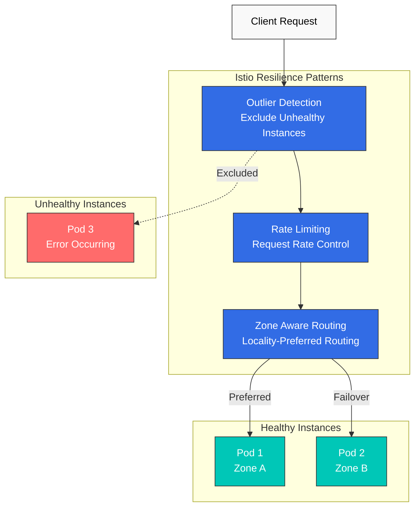
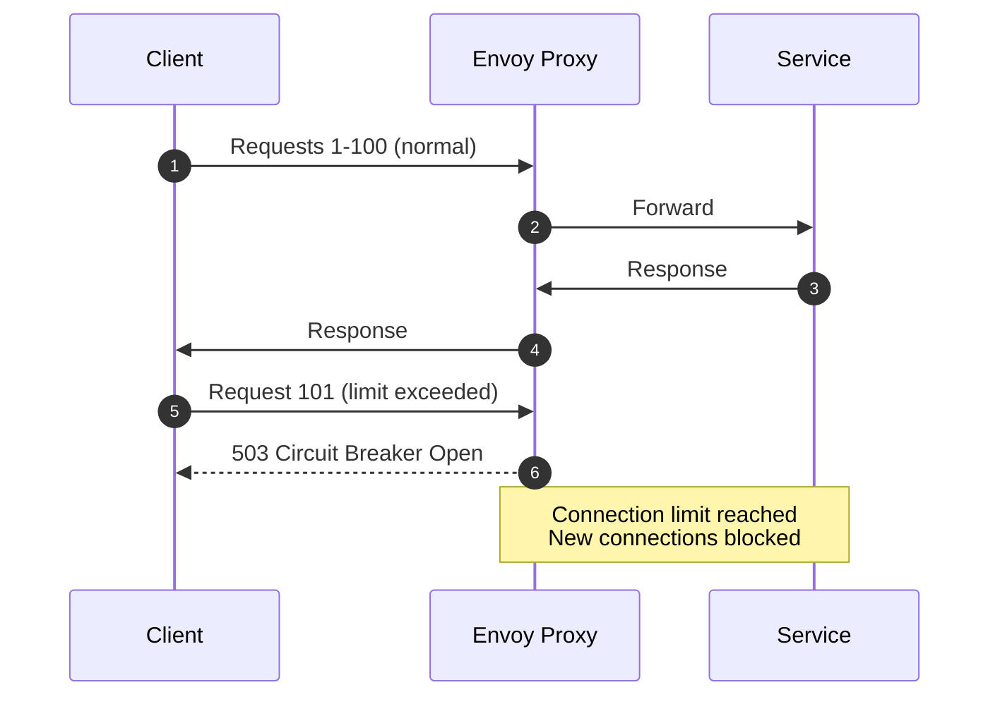
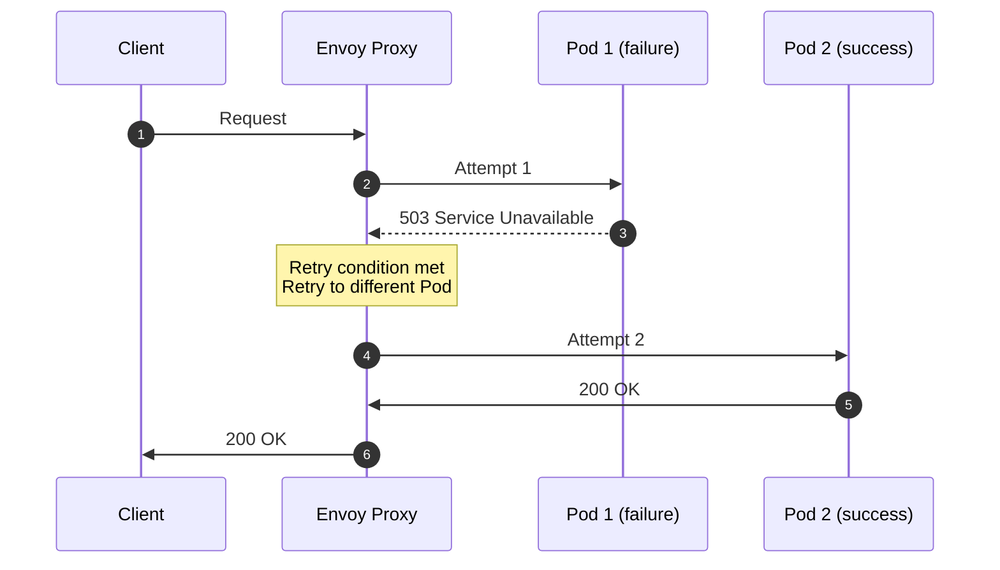
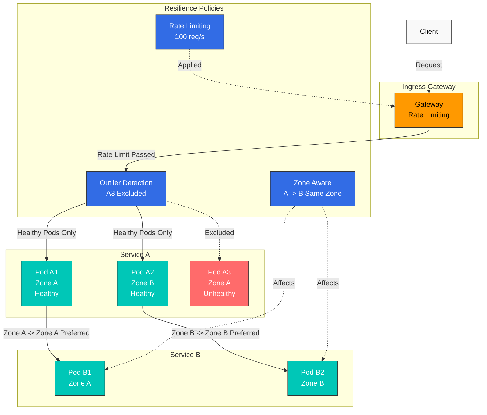

# レジリエンス

Istio のレジリエンス機能により、障害シナリオでも Service Mesh が信頼性高く動作します。

## 目次

1. [Outlier Detection](01-outlier-detection.md)
2. [Rate Limiting](02-rate-limiting.md)
3. [Zone Aware Routing](03-zone-aware-routing.md)

### その他のレジリエンスパターン

このドキュメントでは、次のパターンについても扱います。
- **Circuit Breaker**: Connection Pool によるサーキットブレーク
- **Retry**: リトライポリシー
- **Timeout**: リクエストの時間制限
- **Fault Injection**: 障害注入テスト

## 概要

レジリエンスは分散システムにおける重要な特性です。Istio はさまざまなレジリエンスパターンを自動的に実装できます。

### 主要なレジリエンスパターン



### 1. Outlier Detection

異常な動作を示す Service インスタンスを自動的に検出し、トラフィックプールから除外します。

```yaml
apiVersion: networking.istio.io/v1
kind: DestinationRule
metadata:
  name: myapp
spec:
  host: myapp
  trafficPolicy:
    outlierDetection:
      consecutiveErrors: 5
      interval: 30s
      baseEjectionTime: 30s
      maxEjectionPercent: 50
```

**主な機能**:
- 連続エラーの検出
- 自動的な除外と復旧
- Circuit Breaker と連携

### 2. Rate Limiting

過負荷から Service を保護するため、リクエストレートを制限します。

```yaml
apiVersion: networking.istio.io/v1
kind: EnvoyFilter
metadata:
  name: ratelimit
spec:
  configPatches:
  - applyTo: HTTP_FILTER
    match:
      context: SIDECAR_INBOUND
    patch:
      operation: INSERT_BEFORE
      value:
        name: envoy.filters.http.local_ratelimit
        typed_config:
          "@type": type.googleapis.com/envoy.extensions.filters.http.local_ratelimit.v3.LocalRateLimit
          stat_prefix: http_local_rate_limiter
          token_bucket:
            max_tokens: 100
            tokens_per_fill: 10
            fill_interval: 1s
```

**主な機能**:
- Token Bucket アルゴリズム
- ローカルおよびグローバルのレート制限
- クライアント別およびパス別の制限

### 3. Zone Aware Routing

レイテンシーを削減しコストを節約するため、Availability Zone 間のトラフィックを最適化します。

```yaml
apiVersion: networking.istio.io/v1
kind: DestinationRule
metadata:
  name: myapp
spec:
  host: myapp
  trafficPolicy:
    loadBalancer:
      localityLbSetting:
        enabled: true
        distribute:
        - from: us-east-1a/*
          to:
            "us-east-1a/*": 80
            "us-east-1b/*": 20
```

**主な機能**:
- 同一 AZ のトラフィックを優先
- AZ 間コストを削減
- 障害時の自動フェイルオーバー

### 4. Circuit Breaker

Service の過負荷を防ぐため、接続数とリクエスト数を制限します。

```yaml
apiVersion: networking.istio.io/v1
kind: DestinationRule
metadata:
  name: circuit-breaker
spec:
  host: myapp
  trafficPolicy:
    connectionPool:
      tcp:
        maxConnections: 100              # Maximum TCP connections
      http:
        http1MaxPendingRequests: 10      # Maximum pending requests
        http2MaxRequests: 100            # Maximum HTTP/2 requests
        maxRequestsPerConnection: 2       # Maximum requests per connection
    outlierDetection:
      consecutiveErrors: 5
      interval: 30s
      baseEjectionTime: 30s
```

**仕組み**:


**主な機能**:
- TCP 接続数の制限
- HTTP リクエスト数の制限
- 保留中のリクエスト数の制限
- オーバーフロー時の Fail Fast

### 5. Retry

一時的な障害が発生したリクエストを自動的にリトライします。

```yaml
apiVersion: networking.istio.io/v1
kind: VirtualService
metadata:
  name: myapp
spec:
  hosts:
  - myapp
  http:
  - route:
    - destination:
        host: myapp
    retries:
      attempts: 3                        # Maximum 3 retries
      perTryTimeout: 2s                  # Timeout per attempt
      retryOn: 5xx,reset,connect-failure,refused-stream  # Retry conditions
    timeout: 10s                         # Total request timeout
```

**リトライ条件** (`retryOn`):
- `5xx`: Server エラー (500、502、503、504)
- `reset`: TCP 接続のリセット
- `connect-failure`: 接続失敗
- `refused-stream`: HTTP/2 ストリームの拒否
- `retriable-4xx`: リトライ可能な 4xx (例: 409)
- `gateway-error`: Gateway エラー (502、503、504)

**指数バックオフ**:
```yaml
retries:
  attempts: 5
  perTryTimeout: 2s
  retryOn: 5xx
  retryRemoteLocalities: true            # Retry to other localities
```

**仕組み**:


### 6. Timeout

リクエストが無期限に待機することを防ぐため、時間制限を設定します。

```yaml
apiVersion: networking.istio.io/v1
kind: VirtualService
metadata:
  name: myapp
spec:
  hosts:
  - myapp
  http:
  - route:
    - destination:
        host: myapp
    timeout: 5s                          # Request timeout
    retries:
      attempts: 3
      perTryTimeout: 2s                  # Per-retry timeout
```

**Timeout の階層**:
```yaml
# Gateway level timeout
apiVersion: networking.istio.io/v1
kind: VirtualService
metadata:
  name: gateway-timeout
spec:
  gateways:
  - my-gateway
  hosts:
  - example.com
  http:
  - route:
    - destination:
        host: frontend
    timeout: 30s                         # Gateway -> Frontend: 30 seconds

---
# Service level timeout
apiVersion: networking.istio.io/v1
kind: VirtualService
metadata:
  name: service-timeout
spec:
  hosts:
  - backend
  http:
  - route:
    - destination:
        host: backend
    timeout: 5s                          # Frontend -> Backend: 5 seconds
```

**推奨設定**:
- Gateway -> Frontend: 30～60 秒 (ユーザー向け)
- Service -> Service: 5～10 秒 (内部通信)
- Database クエリ: 2～5 秒
- 外部 API: 10～30 秒

### 7. Fault Injection

Chaos Engineering のために意図的に障害を注入します。

```yaml
apiVersion: networking.istio.io/v1
kind: VirtualService
metadata:
  name: fault-injection
spec:
  hosts:
  - myapp
  http:
  - fault:
      # Delay injection
      delay:
        percentage:
          value: 10.0                    # 10% of requests delayed
        fixedDelay: 5s                   # 5 second delay

      # Error injection
      abort:
        percentage:
          value: 5.0                     # 5% of requests fail
        httpStatus: 503                  # Return 503 error

    route:
    - destination:
        host: myapp
```

**ユースケースのシナリオ**:

1. **ネットワークレイテンシーのシミュレーション**:
```yaml
fault:
  delay:
    percentage:
      value: 100.0
    fixedDelay: 7s
```

2. **断続的な障害のテスト**:
```yaml
fault:
  abort:
    percentage:
      value: 20.0                        # 20% failure rate
    httpStatus: 500
```

3. **特定のユーザーにのみ障害を注入**:
```yaml
apiVersion: networking.istio.io/v1
kind: VirtualService
metadata:
  name: fault-injection-user
spec:
  hosts:
  - myapp
  http:
  - match:
    - headers:
        end-user:
          exact: test-user               # Apply only to test-user
    fault:
      abort:
        percentage:
          value: 100.0
        httpStatus: 503
    route:
    - destination:
        host: myapp
```

## レジリエンスパターンの組み合わせ

### Outlier Detection + Circuit Breaker

```yaml
apiVersion: networking.istio.io/v1
kind: DestinationRule
metadata:
  name: myapp-resilient
spec:
  host: myapp
  trafficPolicy:
    # Connection Pool (Circuit Breaker)
    connectionPool:
      tcp:
        maxConnections: 100
      http:
        http1MaxPendingRequests: 50
        maxRequestsPerConnection: 2

    # Outlier Detection
    outlierDetection:
      consecutiveErrors: 5
      interval: 30s
      baseEjectionTime: 30s
      maxEjectionPercent: 50
      minHealthPercent: 50
```

### Rate Limiting + Retry

```yaml
apiVersion: networking.istio.io/v1
kind: VirtualService
metadata:
  name: myapp
spec:
  hosts:
  - myapp
  http:
  - route:
    - destination:
        host: myapp
    retries:
      attempts: 3
      perTryTimeout: 2s
      retryOn: 5xx,reset,connect-failure
    timeout: 10s
---
apiVersion: networking.istio.io/v1
kind: EnvoyFilter
metadata:
  name: ratelimit
spec:
  workloadSelector:
    labels:
      app: myapp
  configPatches:
  - applyTo: HTTP_FILTER
    match:
      context: SIDECAR_INBOUND
    patch:
      operation: INSERT_BEFORE
      value:
        name: envoy.filters.http.local_ratelimit
        typed_config:
          "@type": type.googleapis.com/envoy.extensions.filters.http.local_ratelimit.v3.LocalRateLimit
          stat_prefix: http_local_rate_limiter
          token_bucket:
            max_tokens: 1000
            tokens_per_fill: 100
            fill_interval: 1s
```

## レジリエンスアーキテクチャ



## レジリエンスメトリクス

### Prometheus クエリ

```promql
# 1. Outlier Detection: Ejected instance count
envoy_cluster_outlier_detection_ejections_active

# 2. Rate Limiting: Rate-limited request count
rate(envoy_http_local_rate_limit_rate_limited[5m])

# 3. Zone Aware: Traffic ratio between zones
sum(rate(istio_requests_total[5m])) by (source_zone, destination_zone)

# 4. Circuit Breaker: Open circuit count
envoy_cluster_circuit_breakers_default_rq_open

# 5. Circuit Breaker: Requests rejected due to overflow
envoy_cluster_circuit_breakers_default_rq_overflow

# 6. Retry: Retried request count
sum(rate(envoy_cluster_upstream_rq_retry[5m]))

# 7. Retry: Retry success rate
sum(rate(envoy_cluster_upstream_rq_retry_success[5m])) /
sum(rate(envoy_cluster_upstream_rq_retry[5m])) * 100

# 8. Timeout: Timeout occurrence count
sum(rate(envoy_cluster_upstream_rq_timeout[5m]))

# 9. Overall request success rate
sum(rate(istio_requests_total{response_code!~"5.."}[5m])) /
sum(rate(istio_requests_total[5m])) * 100
```

### Grafana Dashboard パネル

**Circuit Breaker のステータス**:
```promql
# Active connections vs max connections
envoy_cluster_upstream_cx_active /
envoy_cluster_circuit_breakers_default_cx_max * 100
```

**Retry の有効性**:
```promql
# Error rate without retries
sum(rate(envoy_cluster_upstream_rq_xx{envoy_response_code_class="5"}[5m])) /
sum(rate(envoy_cluster_upstream_rq_xx[5m])) * 100

# Actual error rate after retries
sum(rate(istio_requests_total{response_code=~"5.."}[5m])) /
sum(rate(istio_requests_total[5m])) * 100
```

## ベストプラクティス

### 1. Outlier Detection のしきい値調整

```yaml
# Adjust according to service characteristics
outlierDetection:
  consecutiveErrors: 5          # 5 consecutive failures
  interval: 30s                 # Evaluate every 30 seconds
  baseEjectionTime: 30s         # 30 second ejection
  maxEjectionPercent: 50        # Maximum 50% ejected
  minHealthPercent: 50          # Maintain at least 50%
```

### 2. 段階的な Rate Limiting

```yaml
# Apply limits at Gateway -> Service stages
# Gateway: Overall traffic limit
# Service: Individual service limit
```

### 3. Zone Aware Routing の優先順位

```yaml
# Prioritize same AZ, use other AZs for failover
distribute:
- from: us-east-1a/*
  to:
    "us-east-1a/*": 80    # Same AZ 80%
    "us-east-1b/*": 20    # Other AZ 20% (failover)
```

### 4. Circuit Breaker の設定

```yaml
# Configure according to service capacity
connectionPool:
  tcp:
    maxConnections: 100              # Maximum connections per pod
  http:
    http1MaxPendingRequests: 10      # Queue size (keep small)
    http2MaxRequests: 100
    maxRequestsPerConnection: 2       # Keep-alive limit

# Avoid overly large values
connectionPool:
  tcp:
    maxConnections: 10000            # Excessively large
  http:
    http1MaxPendingRequests: 1000    # Queue too long
```

**推奨値**:
- `maxConnections`: Pod 数 x 想定同時接続数 x 1.5
- `http1MaxPendingRequests`: 10～50 (迅速な失敗が重要)
- `maxRequestsPerConnection`: 1～5 (接続再利用を制限)

### 5. Retry ポリシー

```yaml
# Retry only idempotent requests
retries:
  attempts: 3
  perTryTimeout: 2s
  retryOn: 5xx,reset,connect-failure    # GET requests

# Avoid indiscriminate retries on POST/PUT requests
retries:
  attempts: 5
  retryOn: 5xx                           # Risk of duplicate data creation
```

**Retry ガイドライン**:
- **GET、HEAD、OPTIONS**: 安全にリトライ可能
- **POST、PUT、PATCH**: 冪等性が保証される場合にのみリトライ
- **DELETE**: 安全にリトライ可能 (冪等)

### 6. Timeout の設定

```yaml
# Hierarchical timeouts (parent > child)
# Gateway
timeout: 30s
retries:
  perTryTimeout: 10s

# Service A -> Service B
timeout: 10s
retries:
  perTryTimeout: 3s

# Avoid child timeout larger than parent
timeout: 5s
retries:
  perTryTimeout: 10s                     # perTryTimeout > timeout
```

**Timeout の計算式**:
```
total timeout >= (perTryTimeout x attempts) + overhead
```

例: `timeout: 10s`、`perTryTimeout: 2s`、`attempts: 3`
- 必要な最小値: 2s x 3 = 6s
- 推奨値: 10s (余裕を含む)

### 7. Fault Injection テスト

```yaml
# In production, limit to specific users/headers
- match:
  - headers:
      x-chaos-test:
        exact: "true"
  fault:
    delay:
      percentage:
        value: 100.0
      fixedDelay: 5s

# Avoid indiscriminate fault injection in production
fault:
  abort:
    percentage:
      value: 50.0                        # 50% failure!
    httpStatus: 500
```

**テスト段階**:
1. **開発**: 100% の障害注入で徹底的にテスト
2. **ステージング**: 特定のユーザーグループにのみ適用
3. **本番**: 段階的なカナリア方式 (1% -> 5% -> 10%)

## トラブルシューティング

### Outlier Detection が動作しない

```bash
# 1. Check DestinationRule
kubectl get destinationrule -A

# 2. Check Envoy cluster status
istioctl proxy-config clusters <pod-name> -n <namespace>

# 3. Check Outlier Detection metrics
kubectl exec -n <namespace> <pod-name> -c istio-proxy -- \
  curl localhost:15000/stats/prometheus | grep outlier
```

### Rate Limiting が適用されない

```bash
# 1. Check EnvoyFilter
kubectl get envoyfilter -A

# 2. Check Envoy configuration
istioctl proxy-config listener <pod-name> -n <namespace> -o json

# 3. Check Rate Limit metrics
kubectl exec -n <namespace> <pod-name> -c istio-proxy -- \
  curl localhost:15000/stats/prometheus | grep rate_limit
```

### Zone Aware Routing が動作しない

```bash
# 1. Check DestinationRule
kubectl get destinationrule -A

# 2. Check Pod Zone labels
kubectl get pods -n <namespace> -o wide \
  -L topology.kubernetes.io/zone

# 3. Check Locality information
istioctl proxy-config endpoints <pod-name> -n <namespace>
```

### Circuit Breaker が開かない

```bash
# 1. Check DestinationRule connectionPool settings
kubectl get destinationrule <name> -o yaml

# 2. Check Circuit Breaker metrics
kubectl exec -n <namespace> <pod-name> -c istio-proxy -- \
  curl localhost:15000/stats/prometheus | grep circuit_breakers

# 3. Check for overflow
kubectl exec -n <namespace> <pod-name> -c istio-proxy -- \
  curl localhost:15000/stats/prometheus | grep overflow

# 4. Check active connection count
kubectl exec -n <namespace> <pod-name> -c istio-proxy -- \
  curl localhost:15000/stats/prometheus | grep upstream_cx_active
```

### Retry が動作しない

```bash
# 1. Check VirtualService
kubectl get virtualservice <name> -o yaml

# 2. Check Retry metrics
kubectl exec -n <namespace> <pod-name> -c istio-proxy -- \
  curl localhost:15000/stats/prometheus | grep retry

# 3. Check Envoy logs for retries
kubectl logs -n <namespace> <pod-name> -c istio-proxy | grep retry

# 4. Check retry conditions
istioctl proxy-config routes <pod-name> -n <namespace> -o json | \
  jq '.[] | select(.name | contains("your-service")) | .virtualHosts[].routes[].route.retryPolicy'
```

### Timeout が適用されない

```bash
# 1. Check VirtualService timeout
kubectl get virtualservice <name> -o yaml | grep timeout

# 2. Check Timeout metrics
kubectl exec -n <namespace> <pod-name> -c istio-proxy -- \
  curl localhost:15000/stats/prometheus | grep timeout

# 3. Check request duration
kubectl exec -n <namespace> <pod-name> -c istio-proxy -- \
  curl localhost:15000/stats/prometheus | grep request_duration

# 4. Check Envoy route configuration
istioctl proxy-config routes <pod-name> -n <namespace> -o json | \
  jq '.[] | .virtualHosts[].routes[].route.timeout'
```

### Fault Injection が動作しない

```bash
# 1. Check VirtualService fault configuration
kubectl get virtualservice <name> -o yaml | grep -A 10 fault

# 2. Check request headers (if match conditions exist)
curl -H "end-user: test-user" http://your-service/api

# 3. Check Envoy filters
istioctl proxy-config routes <pod-name> -n <namespace> -o json | \
  jq '.[] | .virtualHosts[].routes[].route.rateLimits'

# 4. Check Fault metrics
kubectl exec -n <namespace> <pod-name> -c istio-proxy -- \
  curl localhost:15000/stats/prometheus | grep fault
```

## 次のステップ

1. **[Outlier Detection](01-outlier-detection.md)**: 異常なインスタンスの自動検出
2. **[Rate Limiting](02-rate-limiting.md)**: リクエストレート制御
3. **[Zone Aware Routing](03-zone-aware-routing.md)**: ローカリティを考慮したルーティング

## 参考資料

### 公式ドキュメント
- [Istio Resilience](https://istio.io/latest/docs/concepts/traffic-management/#network-resilience-and-testing)
- [Outlier Detection](https://istio.io/latest/docs/reference/config/networking/destination-rule/#OutlierDetection)
- [Circuit Breaking](https://istio.io/latest/docs/tasks/traffic-management/circuit-breaking/)
- [Request Timeouts](https://istio.io/latest/docs/tasks/traffic-management/request-timeouts/)
- [Retries](https://istio.io/latest/docs/concepts/traffic-management/#retries)
- [Rate Limiting](https://istio.io/latest/docs/tasks/policy-enforcement/rate-limit/)
- [Fault Injection](https://istio.io/latest/docs/tasks/traffic-management/fault-injection/)
- [Locality Load Balancing](https://istio.io/latest/docs/tasks/traffic-management/locality-load-balancing/)

### AWS 関連リソース
- [Enhancing Network Resilience with Istio on Amazon EKS](https://aws.amazon.com/blogs/opensource/enhancing-network-resilience-with-istio-on-amazon-eks/)
- [Amazon EKS Best Practices - Service Mesh](https://aws.github.io/aws-eks-best-practices/reliability/docs/networkmanagement/#service-mesh)

### パターンとアーキテクチャ
- [Microservices Patterns - Circuit Breaker](https://microservices.io/patterns/reliability/circuit-breaker.html)
- [Release It! - Stability Patterns](https://pragprog.com/titles/mnee2/release-it-second-edition/)
- [Chaos Engineering Principles](https://principlesofchaos.org/)

## クイズ

この章の理解度を確認するには、[Istio Resilience Quiz](../../../quizzes/service-mesh/istio/resilience.md) を試してください。
