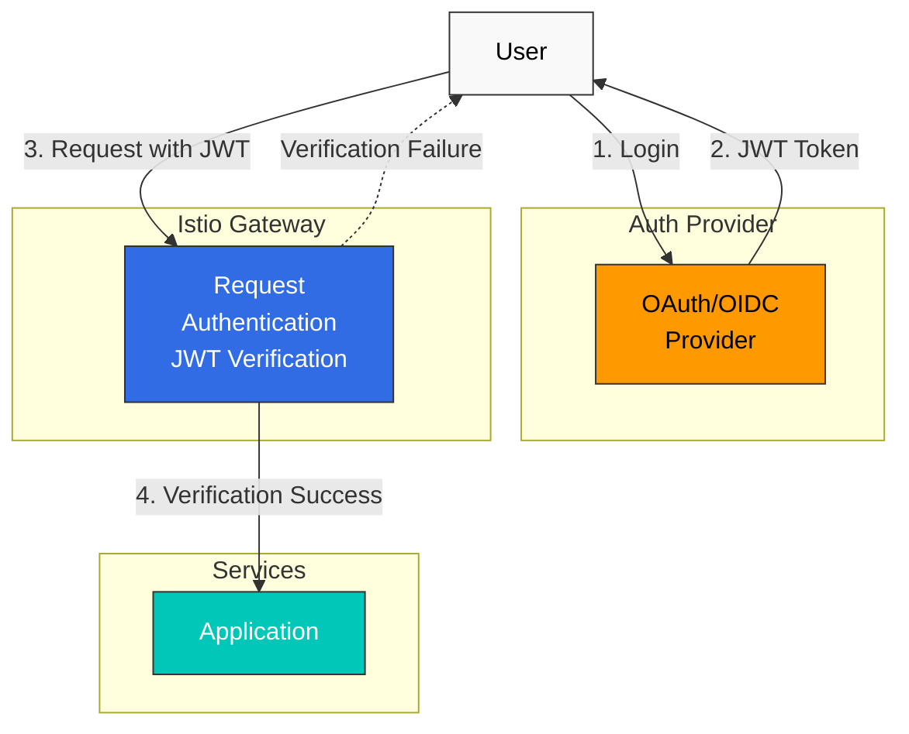

# 認証

Istio はサービス間認証（Peer Authentication）とエンドユーザー認証（Request Authentication）をサポートしています。

## 目次

1. [認証の概要](#authentication-overview)
2. [Request Authentication (JWT)](#request-authentication-jwt)
3. [OAuth/OIDC 統合](#oauthoidc-integration)
4. [実践例](#practical-examples)
5. [トラブルシューティング](#troubleshooting)

## 認証の概要

<p align="center">
  
</p>

Istio は 2 種類の認証を提供します。

1. **Peer Authentication（Service-to-Service Authentication）**
   - mTLS を使用したサービス間認証
   - SPIFFE ID に基づく identity verification
   - PeerAuthentication CRD で構成

2. **Request Authentication（End-User Authentication）**
   - JWT token に基づくユーザー認証
   - OAuth/OIDC provider との統合
   - RequestAuthentication CRD で構成



## Request Authentication (JWT)

### 基本的な JWT Verification

```yaml
apiVersion: security.istio.io/v1
kind: RequestAuthentication
metadata:
  name: jwt-auth
  namespace: default
spec:
  selector:
    matchLabels:
      app: myapp
  jwtRules:
  - issuer: "https://accounts.google.com"
    jwksUri: "https://www.googleapis.com/oauth2/v3/certs"
```

### 複数 Issuer のサポート

```yaml
apiVersion: security.istio.io/v1
kind: RequestAuthentication
metadata:
  name: multi-issuer-jwt
  namespace: default
spec:
  jwtRules:
  - issuer: "https://accounts.google.com"
    jwksUri: "https://www.googleapis.com/oauth2/v3/certs"
  - issuer: "https://login.microsoftonline.com/tenant-id/v2.0"
    jwksUri: "https://login.microsoftonline.com/tenant-id/discovery/v2.0/keys"
```

### カスタム Header

```yaml
apiVersion: security.istio.io/v1
kind: RequestAuthentication
metadata:
  name: jwt-custom-header
  namespace: default
spec:
  jwtRules:
  - issuer: "https://auth.example.com"
    jwksUri: "https://auth.example.com/.well-known/jwks.json"
    fromHeaders:
    - name: "X-Auth-Token"
      prefix: "Bearer "
```

## OAuth/OIDC 統合

### AWS Cognito

```yaml
apiVersion: security.istio.io/v1
kind: RequestAuthentication
metadata:
  name: cognito-jwt
  namespace: default
spec:
  jwtRules:
  - issuer: "https://cognito-idp.{region}.amazonaws.com/{userPoolId}"
    jwksUri: "https://cognito-idp.{region}.amazonaws.com/{userPoolId}/.well-known/jwks.json"
```

### Keycloak

```yaml
apiVersion: security.istio.io/v1
kind: RequestAuthentication
metadata:
  name: keycloak-jwt
  namespace: default
spec:
  jwtRules:
  - issuer: "https://keycloak.example.com/auth/realms/myrealm"
    jwksUri: "https://keycloak.example.com/auth/realms/myrealm/protocol/openid-connect/certs"
```

### Auth0

```yaml
apiVersion: security.istio.io/v1
kind: RequestAuthentication
metadata:
  name: auth0-jwt
  namespace: default
spec:
  jwtRules:
  - issuer: "https://your-tenant.auth0.com/"
    jwksUri: "https://your-tenant.auth0.com/.well-known/jwks.json"
    audiences:
    - "https://your-api.example.com"
```

## 実践例

### JWT Verification + Authorization

```yaml
# JWT Verification
apiVersion: security.istio.io/v1
kind: RequestAuthentication
metadata:
  name: jwt-auth
  namespace: default
spec:
  selector:
    matchLabels:
      app: myapp
  jwtRules:
  - issuer: "https://auth.example.com"
    jwksUri: "https://auth.example.com/.well-known/jwks.json"
---
# Deny requests without JWT
apiVersion: security.istio.io/v1
kind: AuthorizationPolicy
metadata:
  name: require-jwt
  namespace: default
spec:
  selector:
    matchLabels:
      app: myapp
  action: DENY
  rules:
  - from:
    - source:
        notRequestPrincipals: ["*"]
```

## トラブルシューティング

### JWT Verification の失敗

```bash
# 1. Check RequestAuthentication
kubectl get requestauthentication -A
kubectl describe requestauthentication <name> -n <namespace>

# 2. Decode JWT token
echo "<jwt-token>" | cut -d'.' -f2 | base64 -d | jq

# 3. Verify JWKS endpoint
curl https://auth.example.com/.well-known/jwks.json

# 4. Check Envoy logs
kubectl logs <pod-name> -c istio-proxy -n <namespace> | grep JWT
```

## 参考資料

- [Istio Request Authentication](https://istio.io/latest/docs/reference/config/security/request_authentication/)
- [JWT Authentication](https://istio.io/latest/docs/tasks/security/authentication/authn-policy/)
