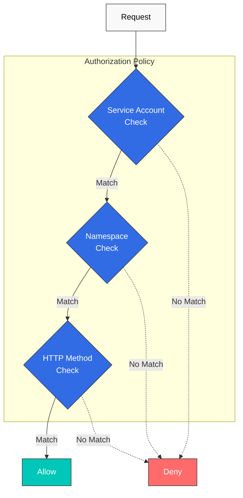

# 認可

AuthorizationPolicy を使用すると、サービスへのアクセス権限をきめ細かく制御できます。

## 目次

1. [認可の概要](#authorization-overview)
2. [基本ポリシー](#basic-policies)
3. [高度なポリシー](#advanced-policies)
4. [実践例](#practical-examples)
5. [ベストプラクティス](#best-practices)

## 認可の概要

<p align="center">
  
</p>

Istio AuthorizationPolicy は、サービスに対するきめ細かなアクセス制御を提供します。上の図は、Authorization Policy の動作を示しています。

1. **リクエストの受信**: Envoy が受信リクエストを受け取ります
2. **ポリシーの評価**: AuthorizationPolicy ルールが順番に評価されます
3. **アクセス判定**: ALLOW、DENY、または CUSTOM アクションが適用されます
4. **監査ログ**: すべての判定が記録されます

**サポートされる条件**:
- **送信元**: リクエストの発信元（ServiceAccount、Namespace、IP）
- **操作**: HTTP メソッド、パス、ポート
- **条件**: カスタム条件（ヘッダー、JWT クレームなど）



## 基本ポリシー

### デフォルト拒否（すべて拒否）

```yaml
apiVersion: security.istio.io/v1
kind: AuthorizationPolicy
metadata:
  name: deny-all
  namespace: default
spec:
  action: DENY
  rules:
  - {}  # Deny all requests
```

### デフォルト許可（すべて許可）

```yaml
apiVersion: security.istio.io/v1
kind: AuthorizationPolicy
metadata:
  name: allow-all
  namespace: default
spec:
  action: ALLOW
  rules:
  - {}  # Allow all requests
```

### HTTP メソッドベース

```yaml
apiVersion: security.istio.io/v1
kind: AuthorizationPolicy
metadata:
  name: httpbin-get-only
  namespace: default
spec:
  selector:
    matchLabels:
      app: httpbin
  action: ALLOW
  rules:
  - to:
    - operation:
        methods: ["GET"]  # Allow only GET
```

## 高度なポリシー

### Service Account ベース

```yaml
apiVersion: security.istio.io/v1
kind: AuthorizationPolicy
metadata:
  name: ratings-sa-policy
  namespace: default
spec:
  selector:
    matchLabels:
      app: ratings
  action: ALLOW
  rules:
  - from:
    - source:
        principals: ["cluster.local/ns/default/sa/reviews"]  # Allow only reviews SA
```

### Namespace ベース

```yaml
apiVersion: security.istio.io/v1
kind: AuthorizationPolicy
metadata:
  name: db-namespace-policy
  namespace: database
spec:
  selector:
    matchLabels:
      app: postgresql
  action: ALLOW
  rules:
  - from:
    - source:
        namespaces: ["production", "staging"]  # Specific namespaces only
```

### パスベース

```yaml
apiVersion: security.istio.io/v1
kind: AuthorizationPolicy
metadata:
  name: path-based-policy
  namespace: default
spec:
  selector:
    matchLabels:
      app: api
  action: ALLOW
  rules:
  - to:
    - operation:
        paths: ["/api/public/*"]  # Allow only public API
  - from:
    - source:
        principals: ["cluster.local/ns/default/sa/admin"]
    to:
    - operation:
        paths: ["/api/admin/*"]  # admin SA can access admin API
```

### JWT クレームベース

```yaml
apiVersion: security.istio.io/v1
kind: AuthorizationPolicy
metadata:
  name: jwt-claims-policy
  namespace: default
spec:
  selector:
    matchLabels:
      app: myapp
  action: ALLOW
  rules:
  - when:
    - key: request.auth.claims[role]
      values: ["admin", "superuser"]  # role claim is admin or superuser
```

## 参考資料

- [Istio Authorization Policy](https://istio.io/latest/docs/reference/config/security/authorization-policy/)
- [認可の例](https://istio.io/latest/docs/tasks/security/authorization/)
