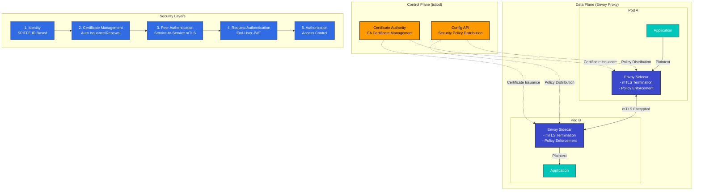

# セキュリティ

> **対応バージョン**: Istio 1.28
> **最終更新**: February 19, 2026

Istio は、service mesh 内で堅牢なセキュリティ機能を提供します。Zero Trust セキュリティモデルに基づき、サービス間通信を自動的に暗号化し、きめ細かなアクセス制御を提供します。

## 目次

1. [セキュリティアーキテクチャの概要](#security-architecture-overview)
2. [主要なセキュリティ機能](#core-security-features)
3. [セキュリティコンポーネント](#security-components)
4. [詳細ドキュメント](#detailed-documentation)
5. [セキュリティのベストプラクティス](#security-best-practices)
6. [セキュリティモニタリング](#security-monitoring)

## セキュリティアーキテクチャの概要

<p align="center">
  
</p>

Istio は、service mesh 内のすべての通信を保護するために、**Zero Trust セキュリティモデル**を実装します。セキュリティアーキテクチャは、4 つの主要なレイヤーで構成されています。

### セキュリティアーキテクチャのレイヤー



**主要なアーキテクチャコンポーネント**:

1. **Control Plane (istiod)**
   - Certificate Authority (CA): X.509 証明書の発行と管理
   - Configuration API: セキュリティポリシーの配布と管理
   - Service Discovery: Workload identity の管理

2. **Data Plane (Envoy Proxy)**
   - mTLS Termination Points: サービス間の暗号化通信
   - Policy Enforcement: 認証/認可ポリシーの適用
   - Security Telemetry: セキュリティメトリクスの収集

3. **アイデンティティ管理**
   - SPIFFE 標準に基づく強力なアイデンティティ管理
   - Kubernetes ServiceAccount との統合
   - 証明書の自動更新（デフォルトは 24 時間）

4. **ポリシーエンジン**
   - 宣言型セキュリティポリシー（CRD ベース）
   - きめ細かなアクセス制御（RBAC）
   - 監査ログのサポート

## 主要なセキュリティ機能

Istio は、以下の主要なセキュリティ機能を提供します。

### 1. 通信セキュリティ（mTLS）

<p align="center">
  
</p>

すべてのサービス間通信は自動的に暗号化されます。Istio は、**PERMISSIVE** モードによる段階的な移行をサポートします。

```yaml
apiVersion: security.istio.io/v1
kind: PeerAuthentication
metadata:
  name: default
  namespace: istio-system
spec:
  mtls:
    mode: STRICT  # Production: STRICT, Migration: PERMISSIVE
```

**モードの説明**:
- **STRICT**: mTLS のみ許可（本番環境に推奨）
- **PERMISSIVE**: mTLS と平文の両方を許可（移行用）
- **DISABLE**: mTLS を無効化

### 2. 認証

<p align="center">
  
</p>

Istio は 2 層の認証を提供します。

- **Peer Authentication**: サービス間認証（mTLS + SPIFFE ID）
- **Request Authentication**: エンドユーザー認証（JWT + OAuth/OIDC）

**例**:
```yaml
# Request Authentication (JWT)
apiVersion: security.istio.io/v1
kind: RequestAuthentication
metadata:
  name: jwt-auth
spec:
  jwtRules:
  - issuer: "https://accounts.google.com"
    jwksUri: "https://www.googleapis.com/oauth2/v3/certs"
```

### 3. 認可

<p align="center">
  
</p>

きめ細かなアクセス制御ポリシーが適用されます。AuthorizationPolicy は、以下に基づいて制御します。
- Service Account / Namespace
- HTTP Method / Path
- IP Address
- JWT Claims

```yaml
apiVersion: security.istio.io/v1
kind: AuthorizationPolicy
metadata:
  name: allow-read
spec:
  action: ALLOW
  rules:
  - from:
    - source:
        principals: ["cluster.local/ns/default/sa/myapp"]
    to:
    - operation:
        methods: ["GET"]
        paths: ["/api/*"]
```

## セキュリティのベストプラクティス

### 1. 多層防御

<p align="center">
  
</p>

複数のレイヤーでセキュリティを適用し、多層防御を実装します。

**ネットワークレイヤー**:
```yaml
# 1. Enable mTLS STRICT mode
apiVersion: security.istio.io/v1
kind: PeerAuthentication
metadata:
  name: default
  namespace: istio-system
spec:
  mtls:
    mode: STRICT
```

**アプリケーションレイヤー**:
```yaml
# 2. Enable JWT authentication
apiVersion: security.istio.io/v1
kind: RequestAuthentication
metadata:
  name: require-jwt
spec:
  jwtRules:
  - issuer: "https://your-auth-provider.com"
    jwksUri: "https://your-auth-provider.com/.well-known/jwks.json"
```

**アクセス制御レイヤー**:
```yaml
# 3. Default deny policy
apiVersion: security.istio.io/v1
kind: AuthorizationPolicy
metadata:
  name: deny-all
spec:
  action: DENY
  rules:
  - {}
---
# 4. Allow only required access
apiVersion: security.istio.io/v1
kind: AuthorizationPolicy
metadata:
  name: allow-specific
spec:
  action: ALLOW
  rules:
  - from:
    - source:
        principals: ["cluster.local/ns/frontend/sa/webapp"]
    to:
    - operation:
        methods: ["GET", "POST"]
```

### 2. 最小権限の原則

- 各サービスには必要最小限の権限のみを付与する
- ServiceAccount をきめ細かく分離する
- Namespace の分離を活用する

### 3. セキュリティモニタリング

- Istio Access Logs を有効にする
- Prometheus でセキュリティメトリクスを収集する
- Kiali で mTLS ステータスを監視する

## 次のステップ

1. **[mTLS](01-mtls.md)**: サービス間暗号化とアイデンティティ管理
2. **[認証](02-authentication.md)**: JWT と OAuth/OIDC の統合
3. **[認可](03-authorization.md)**: きめ細かなアクセス制御ポリシー

## 参考資料

### 公式ドキュメント
- [Istio Security Concepts](https://istio.io/latest/docs/concepts/security/)
- [Security Best Practices](https://istio.io/latest/docs/ops/best-practices/security/)
- [Security Reference](https://istio.io/latest/docs/reference/config/security/)

### 関連標準
- [SPIFFE Specification](https://github.com/spiffe/spiffe)
- [OAuth 2.0 / OIDC](https://oauth.net/2/)
- [JWT (RFC 7519)](https://datatracker.ietf.org/doc/html/rfc7519)

## クイズ

この章で学んだ内容を確認するには、[Istio Security Quiz](../../../quizzes/service-mesh/istio/security.md)に挑戦してください。
