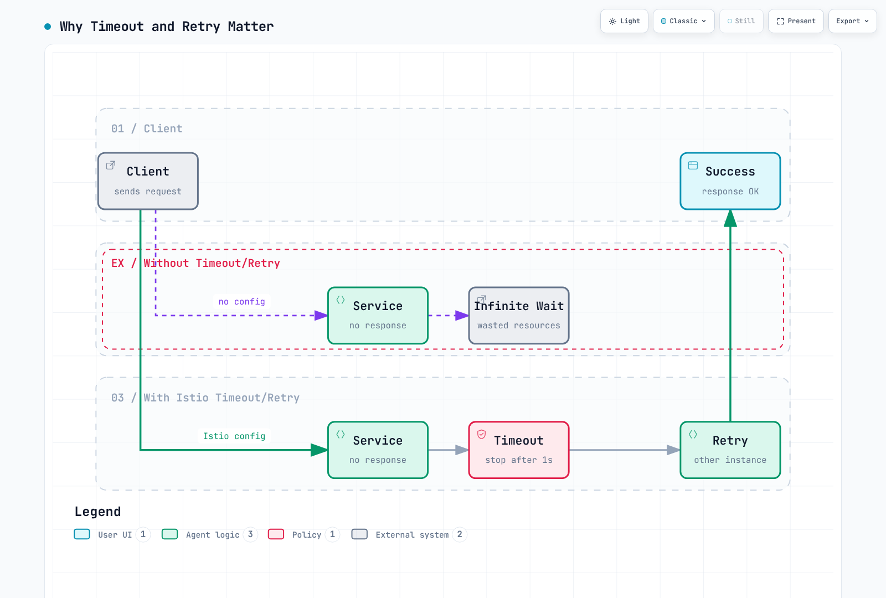
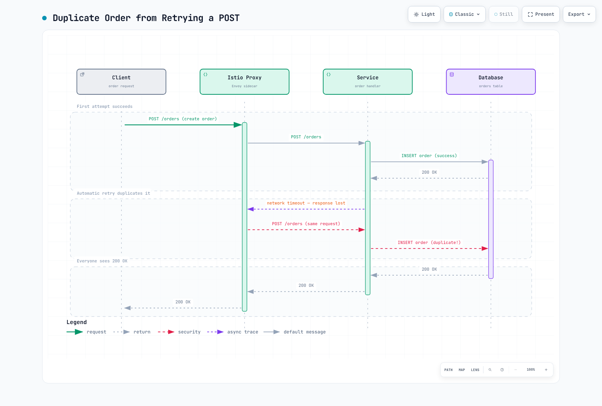

# Retry と Timeout

Retry と Timeout は、マイクロサービスのレジリエンスを向上させるための中核的なメカニズムです。Istio では、アプリケーションコードを変更せずにこれらのポリシーを設定できます。

## 目次

1. [概要](#overview)
2. [Timeout の設定](#timeout-configuration)
3. [Retry の設定](#retry-configuration)
4. [Retry と Timeout の組み合わせ](#combining-retry-and-timeout)
5. [実践例](#practical-examples)
6. [重要な警告](#important-warnings)
7. [ベストプラクティス](#best-practices)
8. [トラブルシューティング](#troubleshooting)

## 概要

### Timeout と Retry が必要な理由



[🔍 インタラクティブな図を表示](https://www.atomai.click/kubernetes-docs/archmaps/en-service-mesh-istio-traffic-management-05-retry-timeout-0.html)

## Timeout の設定

### 基本的な Timeout

```yaml
apiVersion: networking.istio.io/v1
kind: VirtualService
metadata:
  name: reviews-timeout
spec:
  hosts:
  - reviews
  http:
  - route:
    - destination:
        host: reviews
    timeout: 10s  # Timeout after 10 seconds
```

### パス固有の Timeout

```yaml
apiVersion: networking.istio.io/v1
kind: VirtualService
metadata:
  name: api-timeouts
spec:
  hosts:
  - api.example.com
  http:
  # Fast response API - short timeout
  - match:
    - uri:
        prefix: "/api/quick"
    route:
    - destination:
        host: api-service
    timeout: 1s

  # Standard API
  - match:
    - uri:
        prefix: "/api/standard"
    route:
    - destination:
        host: api-service
    timeout: 5s

  # Heavy operations - long timeout
  - match:
    - uri:
        prefix: "/api/batch"
    route:
    - destination:
        host: api-service
    timeout: 30s
```

## Retry の設定

> **重要:** `retries` を省略しても、必ずしも retry が無効になるわけではありません。Istio のクラスタ全体のデフォルトは、`retryOn: connect-failure,refused-stream,unavailable,cancelled` を伴う `attempts: 2` です。`attempts` は**元のリクエスト後の追加 retry**を数えるため、合計 3 回の配信となる可能性があります。Proxy retry を明示的に無効にするには、ルートで `attempts: 0` を設定します。

### 基本的な Retry

```yaml
apiVersion: networking.istio.io/v1
kind: VirtualService
metadata:
  name: reviews-retry
spec:
  hosts:
  - reviews
  http:
  - route:
    - destination:
        host: reviews
    retries:
      attempts: 3  # Maximum 3 retries
      perTryTimeout: 2s  # 2s timeout per attempt
      retryOn: 5xx,reset,connect-failure,refused-stream  # Retry conditions
```

### Retry 条件

| 条件 | 説明 |
|-----------|-------------|
| `5xx` | HTTP 5xx エラー |
| `gateway-error` | 502、503、504 エラー |
| `reset` | 接続リセット |
| `connect-failure` | 接続失敗 |
| `refused-stream` | HTTP/2 REFUSED_STREAM |
| `retriable-4xx` | 409 Conflict |
| `retriable-status-codes` | カスタムステータスコード |

### 高度な Retry 設定

`payment-service` は非冪等な書き込み（請求の送信）を受け付けるため、すべてのメソッドに単一の
retry ポリシーを適用すると、mesh が `reset` や `5xx` に対して POST を再実行できてしまいます。
これは、このページで警告しているまさに曖昧な再実行のリスクです。代わりにルートをメソッド別に
分割します。読み取り専用のステータスチェックは十分に retry し、書き込みパスでは mesh retry を
完全に無効化します。

```yaml
apiVersion: networking.istio.io/v1
kind: VirtualService
metadata:
  name: advanced-retry
spec:
  hosts:
  - payment-service
  http:
  - name: reads-retryable
    match:
    - method:
        regex: "^(GET|HEAD)$"
    route:
    - destination:
        host: payment-service
    retries:
      attempts: 3
      perTryTimeout: 2s
      retryOn: connect-failure,refused-stream
      retryRemoteLocalities: true  # Retry to other regions
  - name: writes-no-mesh-retry
    match:
    - method:
        regex: "^(POST|PUT|PATCH|DELETE)$"
    route:
    - destination:
        host: payment-service
    retries:
      attempts: 0
```

## Retry と Timeout の組み合わせ

### 階層化された Timeout

```yaml
apiVersion: networking.istio.io/v1
kind: VirtualService
metadata:
  name: layered-timeouts
spec:
  hosts:
  - frontend
  http:
  - route:
    - destination:
        host: frontend
    timeout: 10s  # Total timeout
    retries:
      attempts: 3
      perTryTimeout: 3s  # Timeout for each delivery, including the original
```

**計算**: 理論上の配信時間の上限は `(1 + attempts) × perTryTimeout = 4 × 3s = 12s` ですが、ルートレベルの `timeout: 10s` が先に適用されます。バックオフと残りのルート timeout により、実際に試行される retry 回数は減少する可能性があります。

### HTTP メソッド別に Retry ポリシーを分割

```yaml
apiVersion: networking.istio.io/v1
kind: VirtualService
metadata:
  name: order-service
spec:
  hosts:
  - order-service
  http:
  # POST/PATCH: do not replay an ambiguous write in the mesh
  - name: writes-no-mesh-retry
    match:
    - method:
        regex: "^(POST|PATCH)$"
    route:
    - destination:
        host: order-service
    timeout: 10s
    retries:
      attempts: 0

  # GET/HEAD: retry only connection establishment and REFUSED_STREAM failures
  - name: reads-limited-retry
    match:
    - method:
        regex: "^(GET|HEAD)$"
    route:
    - destination:
        host: order-service
    timeout: 5s
    retries:
      attempts: 2
      perTryTimeout: 2s
      retryOn: connect-failure,refused-stream
```

POST/PATCH およびドメインで書き込みと定義されるすべての操作では、デフォルトで mesh retry を無効にします。PUT や DELETE が HTTP メソッドであることだけから安全と判断してはいけません。繰り返し実行しても安全であることをアプリケーションの実際の契約が保証する場合にのみ、それらを retry してください。

## 実践例

### 例 1: マイクロサービスチェーン

```yaml
# Frontend → Backend → Database
apiVersion: networking.istio.io/v1
kind: VirtualService
metadata:
  name: frontend
spec:
  hosts:
  - frontend
  http:
  - route:
    - destination:
        host: frontend
    timeout: 15s  # Consider entire chain
    retries:
      attempts: 2
      perTryTimeout: 7s
---
apiVersion: networking.istio.io/v1
kind: VirtualService
metadata:
  name: backend
spec:
  hosts:
  - backend
  http:
  - route:
    - destination:
        host: backend
    timeout: 10s  # Consider database call
    retries:
      attempts: 3
      perTryTimeout: 3s
      retryOn: 5xx,reset
---
apiVersion: networking.istio.io/v1
kind: VirtualService
metadata:
  name: database
spec:
  hosts:
  - database
  http:
  - route:
    - destination:
        host: database
    timeout: 5s
    retries:
      attempts: 2
      perTryTimeout: 2s
      retryOn: connect-failure,refused-stream
```

### 例 2: 外部 API 呼び出し

```yaml
apiVersion: networking.istio.io/v1
kind: VirtualService
metadata:
  name: external-api
spec:
  hosts:
  - api.external.com
  http:
  - route:
    - destination:
        host: api.external.com
    timeout: 30s  # External APIs can be slow
    retries:
      attempts: 5  # External APIs have frequent transient failures
      perTryTimeout: 5s
      retryOn: 5xx,reset,connect-failure,gateway-error
---
apiVersion: networking.istio.io/v1
kind: ServiceEntry
metadata:
  name: external-api
spec:
  hosts:
  - api.external.com
  ports:
  - number: 443
    name: https
    protocol: HTTPS
  location: MESH_EXTERNAL
  resolution: DNS
```

### 例 3: Circuit Breaker との組み合わせ

`payment` は非冪等な書き込みを処理するため、この例では前出の `payment-service` の例と同様にルートを
メソッド別に分割します。読み取りは十分に retry し、書き込みでは mesh retry を無効化します。以下の
Circuit Breaker は両方に適用されます。

```yaml
apiVersion: networking.istio.io/v1
kind: VirtualService
metadata:
  name: resilient-service
spec:
  hosts:
  - payment
  http:
  - name: reads-retryable
    match:
    - method:
        regex: "^(GET|HEAD)$"
    route:
    - destination:
        host: payment
    timeout: 10s
    retries:
      attempts: 3
      perTryTimeout: 3s
      retryOn: connect-failure,refused-stream
  - name: writes-no-mesh-retry
    match:
    - method:
        regex: "^(POST|PUT|PATCH|DELETE)$"
    route:
    - destination:
        host: payment
    timeout: 10s
    retries:
      attempts: 0
---
apiVersion: networking.istio.io/v1
kind: DestinationRule
metadata:
  name: payment-circuit-breaker
spec:
  host: payment
  trafficPolicy:
    connectionPool:
      tcp:
        maxConnections: 100
      http:
        http1MaxPendingRequests: 50
        maxRequestsPerConnection: 2
    outlierDetection:
      consecutiveErrors: 5
      interval: 30s
      baseEjectionTime: 30s
      maxEjectionPercent: 50
```

## 重要な警告

### 非冪等リクエストに対する Retry のリスク

**基本原則**: POST/PATCH およびドメインで定義された非冪等な書き込みに対する Istio Proxy の自動 retry は、**データ整合性の問題**を引き起こす可能性があります。アプリケーションの実際の契約が冪等性を保証する場合にのみ、PUT/DELETE を例外として扱います。

#### 問題のシナリオ



[🔍 インタラクティブな図を表示](https://www.atomai.click/kubernetes-docs/archmaps/en-service-mesh-istio-traffic-management-05-retry-timeout-1.html)

#### なぜ危険なのか

1. **重複作成**: POST リクエストは実際には成功したものの、ネットワークの問題で応答が失われ、Proxy が retry することで**重複レコード**が作成されます。
2. **不正な状態変更**: **支払い、在庫の引き落とし**などのビジネスクリティカルな操作が複数回実行される可能性があります。
3. **検証不能**: Istio Proxy には、リクエストが成功したかどうかを確認する手段がありません。

#### 安全な Retry 戦略

**推奨: mesh retry を無効化し、アプリケーションレベルの重複排除を強制する**

```yaml
# Istio: explicitly do not retry a non-idempotent write
apiVersion: networking.istio.io/v1
kind: VirtualService
metadata:
  name: order-service
spec:
  hosts:
  - order-service
  http:
  - match:
    - method:
        exact: POST
    route:
    - destination:
        host: order-service
    timeout: 10s
    retries:
      attempts: 0  # No delivery after the original request
```

`reset`、`503`、および timeout は、サーバーがリクエストを拒否したことの証明にはなりません。サーバーはデータベーストランザクションをコミットした後、応答だけを失う可能性があるため、proxy は再実行が安全かどうかを判断できません。結果が曖昧な場合、アプリケーションは盲目的に再送するのではなく、操作ステータスを照会する必要があります。

```python
# Application: Use Idempotency Key
import uuid
import requests
from requests.adapters import HTTPAdapter
from requests.packages.urllib3.util.retry import Retry

def create_order_with_idempotency(order_data):
    # Generate unique Idempotency Key
    idempotency_key = str(uuid.uuid4())

    session = requests.Session()
    retry_strategy = Retry(
        total=3,
        status_forcelist=[500, 502, 503, 504],
        allowed_methods=["POST"],  # Allow POST retry
        backoff_factor=1
    )
    adapter = HTTPAdapter(max_retries=retry_strategy)
    session.mount("http://", adapter)

    headers = {
        "X-Idempotency-Key": idempotency_key  # Prevent duplicates
    }

    response = session.post(
        "http://order-service/orders",
        json=order_data,
        headers=headers
    )
    return response

# Server side: Validate Idempotency Key
@app.route('/orders', methods=['POST'])
def create_order():
    idempotency_key = request.headers.get('X-Idempotency-Key')

    # Check if already processed in Redis/DB
    if redis.exists(f"order:idempotency:{idempotency_key}"):
        # Already processed - return cached result
        cached_result = redis.get(f"order:result:{idempotency_key}")
        return jsonify(json.loads(cached_result)), 200

    # Create new order
    order = create_order_in_db(request.json)

    # Cache Idempotency Key and result (24h TTL)
    redis.setex(f"order:idempotency:{idempotency_key}", 86400, "1")
    redis.setex(f"order:result:{idempotency_key}", 86400, json.dumps(order))

    return jsonify(order), 201
```

本番の書き込み API には、以下の安全策を組み合わせてください。

- 同一トランザクション内のデータベース一意制約によって裏付けられた `Idempotency-Key`
- 更新に対する `ETag`/`If-Match` またはバージョンフィールドの compare-and-swap
- timeout/reset 後の transaction-ID または command-ID のステータス照会
- 支払いまたはイベント公開など、取り消し不可能な下流の影響に対する transactional outbox

#### HTTP メソッドの Retry 安全性

| メソッド | 冪等 | Istio Retry の安全性 | 推奨設定 |
|--------|------------|-------------------|---------------------|
| **GET** | はい | 安全 | `attempts: 3, retryOn: 5xx,reset` |
| **HEAD** | はい | 安全 | `attempts: 3, retryOn: 5xx,reset` |
| **OPTIONS** | はい | 安全 | `attempts: 3, retryOn: 5xx,reset` |
| **PUT** | 契約に依存 | 注意 | 実際の冪等性契約 + 条件付き更新 |
| **DELETE** | 契約に依存 | 注意 | 実際の冪等性契約 + 結果照会 |
| **POST** | 通常はいいえ | 危険 | `attempts: 0`、Idempotency Key |
| **PATCH** | 通常はいいえ | 危険 | `attempts: 0`、version/ETag |

#### 安全に Retry できるケース

```yaml
# Read-only requests - safe
apiVersion: networking.istio.io/v1
kind: VirtualService
metadata:
  name: api-service-reads
spec:
  hosts:
  - api-service
  http:
  - match:
    - method:
        regex: "GET|HEAD|OPTIONS"
    route:
    - destination:
        host: api-service
    retries:
      attempts: 3
      perTryTimeout: 2s
      retryOn: 5xx,reset,connect-failure
```

```yaml
# Write requests with idempotency guaranteed
apiVersion: networking.istio.io/v1
kind: VirtualService
metadata:
  name: idempotent-writes
spec:
  hosts:
  - api-service
  http:
  - match:
    - method:
        exact: PUT
    - headers:
        x-idempotency-key:
          regex: ".+"  # Only when Idempotency Key present
    route:
    - destination:
        host: api-service
    retries:
      attempts: 3
      perTryTimeout: 2s
      retryOn: 5xx,reset
```

#### Circuit Breaker と併用する際の注意

Circuit Breaker は**障害分離**には有効ですが、非冪等リクエストの**重複実行を防ぐことはできません**。

```yaml
# Bad example: POST + Circuit Breaker + Retry
apiVersion: networking.istio.io/v1
kind: VirtualService
metadata:
  name: payment-service
spec:
  hosts:
  - payment-service
  http:
  - route:
    - destination:
        host: payment-service
    retries:
      attempts: 3  # 3 retries for POST is dangerous
      retryOn: 5xx
---
apiVersion: networking.istio.io/v1
kind: DestinationRule
metadata:
  name: payment-circuit-breaker
spec:
  host: payment-service
  trafficPolicy:
    outlierDetection:
      consecutiveErrors: 5
      baseEjectionTime: 30s

# Result: Before the Circuit Breaker opens,
# duplicate payments can occur 3 times!
```

```yaml
# Good example: Use Circuit Breaker only, retry at application level
apiVersion: networking.istio.io/v1
kind: VirtualService
metadata:
  name: payment-service
spec:
  hosts:
  - payment-service
  http:
  - route:
    - destination:
        host: payment-service
    timeout: 10s
    retries:
      attempts: 0  # Completely disable retry
---
apiVersion: networking.istio.io/v1
kind: DestinationRule
metadata:
  name: payment-circuit-breaker
spec:
  host: payment-service
  trafficPolicy:
    outlierDetection:
      consecutiveErrors: 5
      baseEjectionTime: 30s
```

#### 実践ガイドライン

1. **GET/HEAD/OPTIONS**: Istio Proxy Retry を使用可能
2. **POST/PATCH**: Istio Retry を無効化し、アプリケーションレベルの Retry + Idempotency Key を使用
3. **PUT/DELETE**: 冪等性が保証される場合にのみ Istio Retry を使用
4. **重要な操作（支払い/在庫/ポイント）**: アプリケーションレベルの検証 + Idempotency Key が必須

## ベストプラクティス

### 1. Timeout 設定ガイド

```yaml
# Good example: Appropriate timeout per layer
# Frontend: 15s
# API Gateway: 10s
# Backend Service: 5s
# Database: 3s

apiVersion: networking.istio.io/v1
kind: VirtualService
metadata:
  name: api-gateway
spec:
  hosts:
  - api-gateway
  http:
  - route:
    - destination:
        host: api-gateway
    timeout: 10s
    retries:
      attempts: 2
      perTryTimeout: 4s
```

```yaml
# Bad example: Timeout too long
apiVersion: networking.istio.io/v1
kind: VirtualService
metadata:
  name: api-gateway
spec:
  hosts:
  - api-gateway
  http:
  - route:
    - destination:
        host: api-gateway
    timeout: 300s  # 5 minutes is too long
```

### 2. Retry 戦略

```yaml
# Good example: Consider idempotency
apiVersion: networking.istio.io/v1
kind: VirtualService
metadata:
  name: api-service
spec:
  hosts:
  - api-service
  http:
  # GET - safe to retry
  - match:
    - method:
        exact: GET
    route:
    - destination:
        host: api-service
    retries:
      attempts: 3
      perTryTimeout: 2s
      retryOn: 5xx,reset,connect-failure

  # POST/PATCH - explicitly disable mesh retry
  - match:
    - method:
        regex: "^(POST|PATCH)$"
    route:
    - destination:
        host: api-service
    retries:
      attempts: 0
```

### 3. Exponential Backoff

Istio はデフォルトで 25ms の間隔で retry しますが、カスタムバックオフを設定する方法を以下に示します。これは読み取りパスにのみ適用されます。このページの前述のとおり、`payment` は書き込みに対する mesh retry を引き続き無効にします。

```yaml
apiVersion: networking.istio.io/v1
kind: VirtualService
metadata:
  name: backoff-retry
spec:
  hosts:
  - payment
  http:
  - match:
    - method:
        regex: "^(GET|HEAD)$"
    route:
    - destination:
        host: payment
    retries:
      attempts: 5
      perTryTimeout: 2s
      retryOn: connect-failure,refused-stream
      # Istio automatically increases retry interval
      # 25ms, 50ms, 100ms, 200ms, 400ms
```

### 4. システム全体の Timeout 計算

```yaml
# Frontend → API Gateway → Backend → Database
# Frontend: 20s
# API Gateway: 15s (must be less than Frontend)
# Backend: 10s (must be less than API Gateway)
# Database: 5s (must be less than Backend)

# Each layer should consider downstream timeout + overhead
```

## トラブルシューティング

### Timeout が機能しない

```bash
# 1. Check VirtualService
kubectl get virtualservice -n <namespace>
kubectl describe virtualservice <name> -n <namespace>

# 2. Check Envoy configuration
istioctl proxy-config routes <pod-name> -n <namespace> -o json | grep timeout

# 3. Test actual timeout
kubectl exec -it <pod-name> -n <namespace> -c istio-proxy -- \
  curl -v --max-time 5 http://backend-service
```

### Retry が多すぎる

```bash
# Check retry metrics
kubectl exec -n <namespace> <pod-name> -c istio-proxy -- \
  curl -s localhost:15000/stats/prometheus | grep retry

# Check retries for specific service
istio_requests_total{destination_service="backend.default.svc.cluster.local",response_flags="UR"}
```

### Retry Storm の防止

```yaml
# Use with Circuit Breaker
apiVersion: networking.istio.io/v1
kind: DestinationRule
metadata:
  name: prevent-retry-storm
spec:
  host: backend
  trafficPolicy:
    connectionPool:
      tcp:
        maxConnections: 100
      http:
        http1MaxPendingRequests: 10  # Limit pending requests
        http2MaxRequests: 100
        maxRequestsPerConnection: 1
    outlierDetection:
      consecutiveErrors: 3  # Fast circuit break
      interval: 10s
      baseEjectionTime: 30s
```

## 参考資料

- [Istio Timeout](https://istio.io/latest/docs/reference/config/networking/virtual-service/#HTTPRoute)
- [Istio Retry](https://istio.io/latest/docs/reference/config/networking/virtual-service/#HTTPRetry)
- [Envoy Retry Policy](https://www.envoyproxy.io/docs/envoy/latest/configuration/http/http_filters/router_filter#config-http-filters-router-x-envoy-retry-on)
- [RFC 9110: Idempotent Methods](https://www.rfc-editor.org/rfc/rfc9110.html#name-idempotent-methods)
