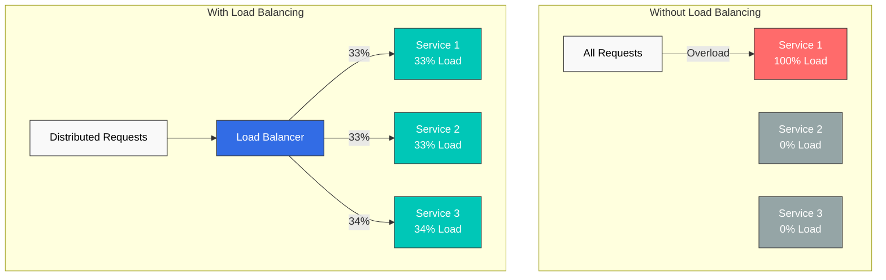
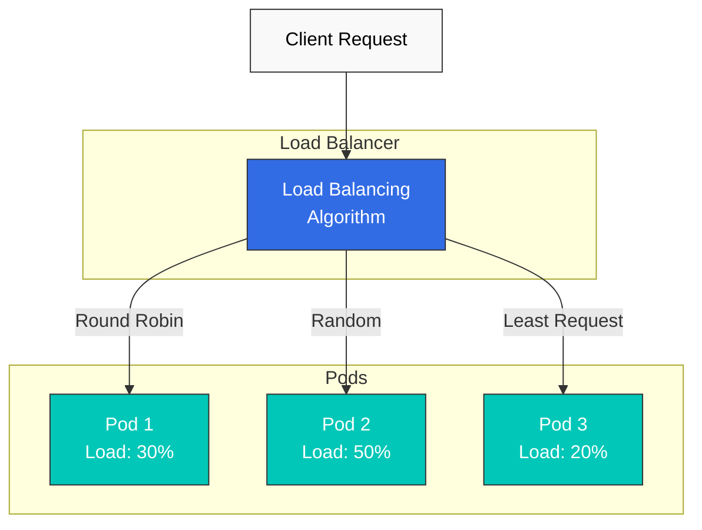
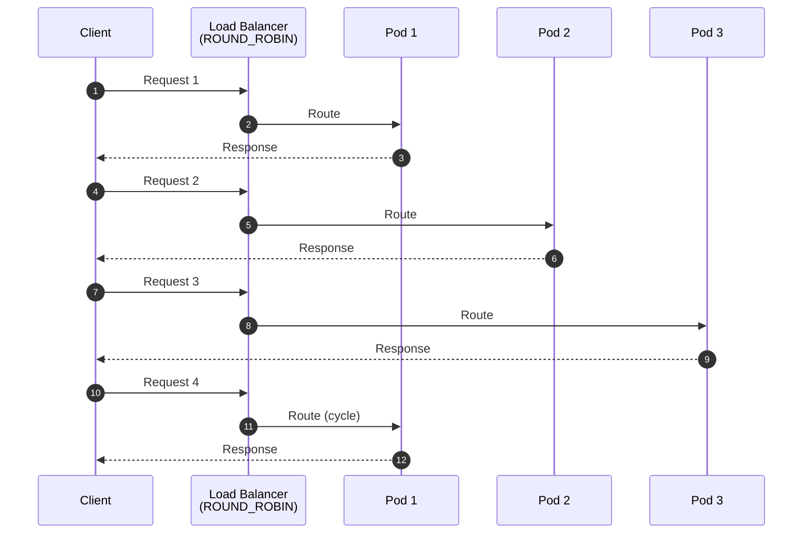
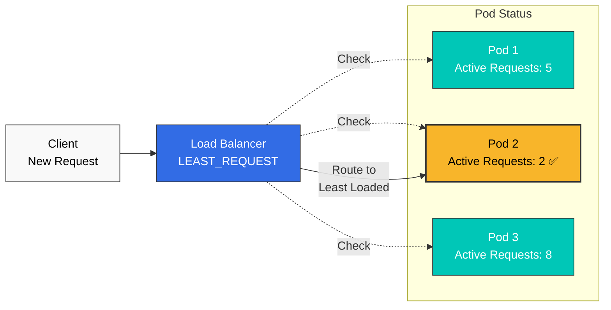
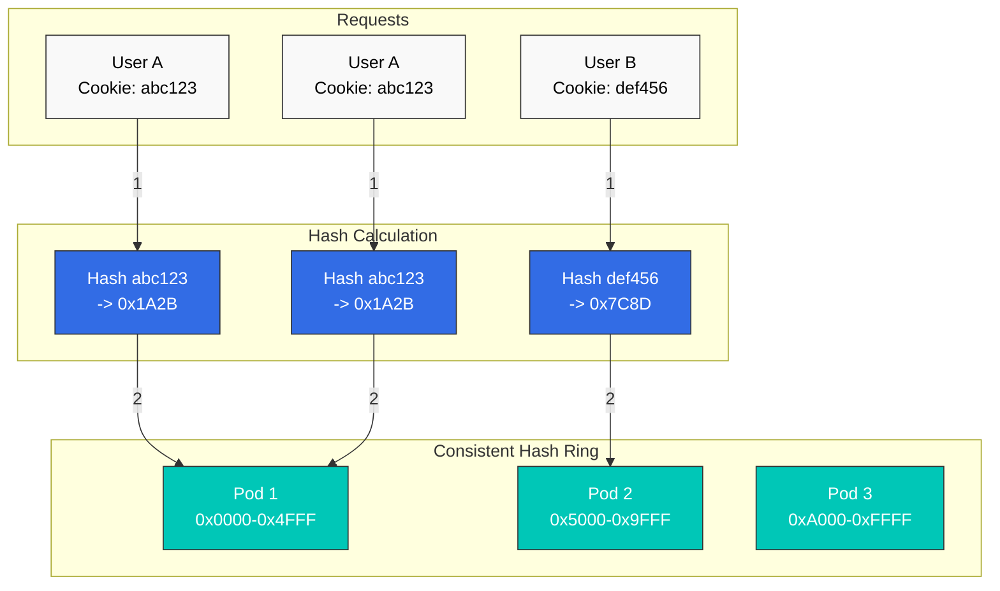
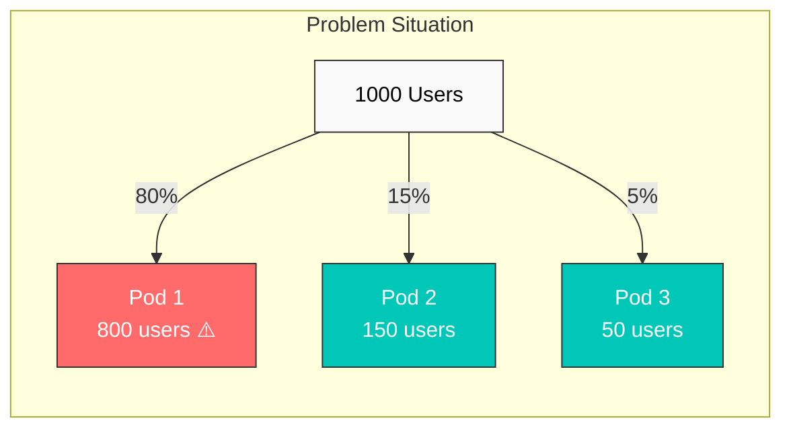
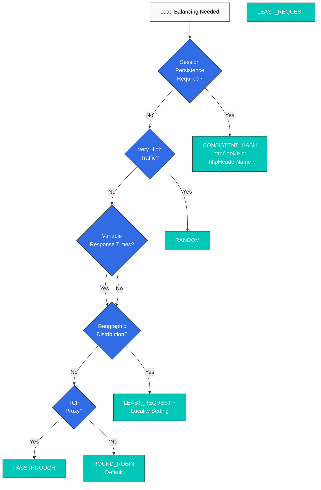

# ロードバランシング

Istio は Envoy を通じてさまざまなロードバランシングアルゴリズムを提供し、トラフィックを効率的に分散します。

## 目次

1. [ロードバランシングが必要な理由](#why-load-balancing)
2. [ロードバランシングの概要](#load-balancing-overview)
3. [ロードバランシングアルゴリズム](#load-balancing-algorithms)
4. [Consistent Hash の詳細](#consistent-hash-details)
5. [ローカリティベースのロードバランシング](#locality-based-load-balancing)
6. [Connection Pool の設定](#connection-pool-settings)
7. [実践例](#practical-examples)
8. [アルゴリズム選択ガイド](#algorithm-selection-guide)
9. [ベストプラクティス](#best-practices)
10. [トラブルシューティング](#troubleshooting)

## ロードバランシングが必要な理由

### 効率的なリソース活用

ロードバランシングは複数のインスタンスにトラフィックを分散し、システム全体のスループットと安定性を向上させます。



### 主な利点

| 問題 | ロードバランシングなし | ロードバランシングあり |
|---------|------------------------|---------------------|
| **可用性** | Single Point of Failure (SPOF) | 障害発生時の自動フェイルオーバー |
| **パフォーマンス** | 特定インスタンスの過負荷 | 均等な負荷分散 |
| **スケーラビリティ** | 水平スケーリングが困難 | 容易なスケールアウト |
| **レスポンスタイム** | 不安定（0～1000ms以上） | 一貫したレスポンスタイム |
| **リソース活用** | 非効率（部分的な使用） | 効率的なリソース使用 |

## ロードバランシングの概要



## ロードバランシングアルゴリズム

Istio は以下のロードバランシングアルゴリズムを提供します。

### アルゴリズム比較

| アルゴリズム | 説明 | ユースケース | 長所 | 短所 |
|-----------|-------------|-----------|------|------|
| **ROUND_ROBIN** | 順次分散（デフォルト） | ステートレスサービス | シンプルで公平 | 負荷が不均衡になる可能性 |
| **LEAST_REQUEST** | アクティブリクエスト数が最少 | 高性能 API、DB 接続 | 負荷の均等化 | わずかなオーバーヘッド |
| **RANDOM** | ランダム分散 | 大量トラフィック | シンプルで高速 | 短期的な不均衡の可能性 |
| **PASSTHROUGH** | 元の宛先 | TCP プロキシ、SNI ルーティング | 柔軟性 | 制御が限定的 |
| **CONSISTENT_HASH** | Hash ベースのスティッキー | セッション維持、キャッシュ | スティッキーセッション | 不均衡になる可能性 |

### 1. ROUND_ROBIN（デフォルト）

各エンドポイントに順番にリクエストを分散します。



**設定例：**

```yaml
apiVersion: networking.istio.io/v1
kind: DestinationRule
metadata:
  name: reviews-round-robin
spec:
  host: reviews
  trafficPolicy:
    loadBalancer:
      simple: ROUND_ROBIN
```

**ユースケース：**
- ステートレス REST API
- 同一のパフォーマンスを持つ Pod
- デフォルト設定で十分な場合

**長所：**
- シンプルで予測可能な実装
- 公平な分散

**短所：**
- Pod ごとの負荷差を考慮しない
- 長時間のリクエストにより不均衡が生じる可能性

### 2. LEAST_REQUEST

アクティブリクエスト数が最も少ないエンドポイントへルーティングします。



**設定例：**

```yaml
apiVersion: networking.istio.io/v1
kind: DestinationRule
metadata:
  name: api-least-request
spec:
  host: api-service
  trafficPolicy:
    loadBalancer:
      simple: LEAST_REQUEST
      warmupDurationSecs: 60  # 60 second warmup (optional)
```

**詳細設定：**

```yaml
apiVersion: networking.istio.io/v1
kind: DestinationRule
metadata:
  name: api-least-request-advanced
spec:
  host: api-service
  trafficPolicy:
    loadBalancer:
      simple: LEAST_REQUEST
      warmupDurationSecs: 120  # New pod warmup
    connectionPool:
      http:
        http2MaxRequests: 100
        maxRequestsPerConnection: 10
```

**ユースケース：**
- レスポンスタイムが変動する API
- Database 接続プール
- 重い処理を行うサービス
- リアルタイムの負荷分散が重要な場合

**長所：**
- リアルタイムの負荷に適応
- レスポンスタイムの一貫性を向上
- Pod ごとのパフォーマンス差を吸収

**短所：**
- わずかなオーバーヘッド（アクティブリクエストの追跡）

### 3. RANDOM

エンドポイントをランダムに選択します。

```yaml
apiVersion: networking.istio.io/v1
kind: DestinationRule
metadata:
  name: reviews-random
spec:
  host: reviews
  trafficPolicy:
    loadBalancer:
      simple: RANDOM
```

**ユースケース：**
- 大量トラフィック（統計的に均等）
- シンプルかつ高速な選択が必要な場合
- Pod のパフォーマンスが同一の場合

**長所：**
- 非常に高速な選択
- シンプルな実装
- 大規模環境では統計的に均等

**短所：**
- 短期的な不均衡が生じる可能性
- 予測不能

### 4. PASSTHROUGH

クライアントが指定した元の宛先に直接接続します。

```yaml
apiVersion: networking.istio.io/v1
kind: DestinationRule
metadata:
  name: tcp-passthrough
spec:
  host: "*.external-service.com"
  trafficPolicy:
    loadBalancer:
      simple: PASSTHROUGH
```

**ユースケース：**
- TCP プロキシ
- SNI ベースのルーティング
- 外部サービスへの直接接続
- TLS PASSTHROUGH モード

**長所：**
- 元の宛先アドレスを保持
- 柔軟なルーティング

**短所：**
- ロードバランシング制御が限定的

### 5. LEAST_CONN（非推奨 -> LEAST_REQUEST）

**注記**：`LEAST_CONN` は**非推奨**であり、`LEAST_REQUEST` に置き換えられました。

**移行：**
```yaml
# Old version (deprecated)
trafficPolicy:
  loadBalancer:
    simple: LEAST_CONN

# New version
trafficPolicy:
  loadBalancer:
    simple: LEAST_REQUEST
```

## Consistent Hash の詳細

Consistent Hash は特定の属性に基づいて同じエンドポイントへルーティングし、セッション維持を保証します。

### Consistent Hash の動作原理



### 1. HTTP Header ベース

特定の HTTP Header 値から Hash を計算します。

```yaml
apiVersion: networking.istio.io/v1
kind: DestinationRule
metadata:
  name: user-hash
spec:
  host: api-service
  trafficPolicy:
    loadBalancer:
      consistentHash:
        httpHeaderName: "x-user-id"
```

**ユースケース：**
- ユーザーごとのセッション維持
- API key ベースのルーティング
- テナントごとの分離

### 2. HTTP Cookie ベース

Cookie 値から Hash を計算し、存在しない場合は Cookie を自動生成します。

```yaml
apiVersion: networking.istio.io/v1
kind: DestinationRule
metadata:
  name: cookie-hash
spec:
  host: web-service
  trafficPolicy:
    loadBalancer:
      consistentHash:
        httpCookie:
          name: "user-session"
          ttl: 3600s  # 1 hour TTL
```

**ユースケース：**
- Web アプリケーションのセッション維持
- ショッピングカートの維持
- ユーザー体験の一貫性

### 3. Source IP ベース

クライアントの送信元 IP アドレスから Hash を計算します。

```yaml
apiVersion: networking.istio.io/v1
kind: DestinationRule
metadata:
  name: source-ip-hash
spec:
  host: api-service
  trafficPolicy:
    loadBalancer:
      consistentHash:
        useSourceIp: true
```

**ユースケース：**
- IP ベースのセッション維持
- レート制限（IP ごと）
- リージョナルキャッシュ

**注意事項：**
- NAT 配下のクライアントは同じ Pod にルーティングされる可能性があります
- プロキシを使用する場合は、実際のクライアント IP を確認してください

### 4. HTTP Query Parameter ベース

Query Parameter 値から Hash を計算します。

```yaml
apiVersion: networking.istio.io/v1
kind: DestinationRule
metadata:
  name: query-param-hash
spec:
  host: api-service
  trafficPolicy:
    loadBalancer:
      consistentHash:
        httpQueryParameterName: "user_id"
```

**ユースケース：**
- RESTful API におけるリソース ID ベースのルーティング
- キャッシュフレンドリーなルーティング
- シャーディング戦略

### 5. 最小 Ring Size の設定

再分散を最小化するため、Consistent Hash Ring の最小サイズを設定します。

```yaml
apiVersion: networking.istio.io/v1
kind: DestinationRule
metadata:
  name: hash-with-ring-size
spec:
  host: cache-service
  trafficPolicy:
    loadBalancer:
      consistentHash:
        httpHeaderName: "x-cache-key"
        minimumRingSize: 1024  # Default: 1024
```

**説明：**
- Ring Size を大きくすると、より均等に分散されます
- Pod の追加・削除時に再分散される key の割合を削減します
- メモリ使用量がわずかに増加します

**推奨値：**
- 小規模（Pod 10 未満）：1024（デフォルト）
- 中規模（Pod 10～50）：2048
- 大規模（Pod 50 以上）：4096

### Consistent Hash の組み合わせ例

```yaml
apiVersion: networking.istio.io/v1
kind: DestinationRule
metadata:
  name: advanced-consistent-hash
spec:
  host: api-service
  trafficPolicy:
    loadBalancer:
      consistentHash:
        httpCookie:
          name: "session-id"
          path: "/api"
          ttl: 7200s  # 2 hours
        minimumRingSize: 2048
    connectionPool:
      http:
        maxRequestsPerConnection: 100
        idleTimeout: 300s
```

### Consistent Hash の注意事項

#### 1. 不均衡のリスク



**原因**：特定の Hash 値へのトラフィック集中

**解決策：**
- `minimumRingSize` を増やす
- 複数の Hash key を組み合わせて使用する
- Bounded Load アルゴリズムを検討する（Envoy では未サポート）

#### 2. Pod の追加・削除時の再分散

```yaml
# On pod scale out
# - Before: Pod 1, Pod 2, Pod 3
# - After: Pod 1, Pod 2, Pod 3, Pod 4
# - Result: ~25% of sessions redistributed to different pods
```

**軽減策：**
- グレースフルシャットダウンを使用する
- 外部セッションストレージ（Redis、Memcached）を使用する
- 段階的にスケールする

## ローカリティベースのロードバランシング

ローカリティベースのロードバランシングは、地理的に近いエンドポイントを優先します。

### 基本的なローカリティ設定

```yaml
apiVersion: networking.istio.io/v1
kind: DestinationRule
metadata:
  name: locality-lb
spec:
  host: reviews
  trafficPolicy:
    loadBalancer:
      localityLbSetting:
        enabled: true
```

### ローカリティ分散比率

```yaml
apiVersion: networking.istio.io/v1
kind: DestinationRule
metadata:
  name: locality-distribute
spec:
  host: reviews
  trafficPolicy:
    loadBalancer:
      localityLbSetting:
        enabled: true
        distribute:
        - from: us-west/zone-1/*
          to:
            "us-west/zone-1/*": 80  # 80% to same zone
            "us-west/zone-2/*": 20  # 20% to other zone
```

### ローカリティフェイルオーバー

一方のリージョンで障害が発生すると、別のリージョンへ自動的に切り替えます。

```yaml
apiVersion: networking.istio.io/v1
kind: DestinationRule
metadata:
  name: locality-failover
spec:
  host: api-service
  trafficPolicy:
    loadBalancer:
      localityLbSetting:
        enabled: true
        failover:
        - from: us-west
          to: us-east
```

### マルチリージョンの例

```yaml
apiVersion: networking.istio.io/v1
kind: DestinationRule
metadata:
  name: global-service-locality
spec:
  host: global-api
  trafficPolicy:
    loadBalancer:
      simple: LEAST_REQUEST
      localityLbSetting:
        enabled: true
        distribute:
        # US West clients
        - from: us-west/*
          to:
            "us-west/*": 90      # 90% local
            "us-east/*": 10      # 10% remote (DR)
        # US East clients
        - from: us-east/*
          to:
            "us-east/*": 90
            "us-west/*": 10
        failover:
        - from: us-west
          to: us-east
        - from: us-east
          to: us-west
    outlierDetection:
      consecutiveErrors: 5
      interval: 30s
      baseEjectionTime: 30s
```

**ユースケース：**
- マルチリージョン Deployment
- レイテンシの最小化
- リージョン間の災害復旧
- コスト最適化（同一 AZ 通信）

## Connection Pool の設定

パフォーマンスを最適化するため、ロードバランシングと併せて Connection Pool を設定します。

### HTTP/1.1 Connection Pool

```yaml
apiVersion: networking.istio.io/v1
kind: DestinationRule
metadata:
  name: http1-connection-pool
spec:
  host: api-service
  trafficPolicy:
    loadBalancer:
      simple: LEAST_REQUEST
    connectionPool:
      tcp:
        maxConnections: 100        # Maximum connections
        connectTimeout: 3s         # Connection timeout
      http:
        http1MaxPendingRequests: 50  # Pending request count
        maxRequestsPerConnection: 100 # Max requests per connection
        idleTimeout: 300s             # Idle connection timeout
```

### HTTP/2 Connection Pool

```yaml
apiVersion: networking.istio.io/v1
kind: DestinationRule
metadata:
  name: http2-connection-pool
spec:
  host: grpc-service
  trafficPolicy:
    loadBalancer:
      simple: LEAST_REQUEST
    connectionPool:
      tcp:
        maxConnections: 50
      http:
        http2MaxRequests: 1000     # HTTP/2 concurrent requests
        maxRequestsPerConnection: 0 # Unlimited (HTTP/2 multiplexing)
        h2UpgradePolicy: UPGRADE    # Allow HTTP/2 upgrade
```

## 実践例

### 例 1：高性能 API サービス

```yaml
apiVersion: networking.istio.io/v1
kind: DestinationRule
metadata:
  name: api-high-performance
  namespace: production
spec:
  host: api-service
  trafficPolicy:
    loadBalancer:
      simple: LEAST_REQUEST
      warmupDurationSecs: 60  # New pod warmup
    connectionPool:
      tcp:
        maxConnections: 200
        connectTimeout: 5s
      http:
        http2MaxRequests: 500
        maxRequestsPerConnection: 100
        idleTimeout: 300s
    outlierDetection:
      consecutiveErrors: 5
      interval: 30s
      baseEjectionTime: 30s
      maxEjectionPercent: 50
```

**利用シナリオ：**
- 高性能 REST API
- レスポンスタイムが変動するリクエスト
- Pod ごとにパフォーマンス差がある環境

### 例 2：ユーザーセッションベースのルーティング

```yaml
apiVersion: networking.istio.io/v1
kind: DestinationRule
metadata:
  name: web-session-affinity
spec:
  host: web-frontend
  trafficPolicy:
    loadBalancer:
      consistentHash:
        httpCookie:
          name: "session-id"
          ttl: 7200s  # 2 hours
        minimumRingSize: 2048
    connectionPool:
      tcp:
        maxConnections: 500
      http:
        http1MaxPendingRequests: 100
        maxRequestsPerConnection: 50
```

**利用シナリオ：**
- Web アプリケーションのセッション維持
- ショッピングカートの一貫性
- ユーザーごとのキャッシュ活用

### 例 3：マルチリージョンのグローバルサービス

```yaml
apiVersion: networking.istio.io/v1
kind: DestinationRule
metadata:
  name: global-api-multi-region
spec:
  host: global-api
  trafficPolicy:
    loadBalancer:
      simple: LEAST_REQUEST
      localityLbSetting:
        enabled: true
        distribute:
        # US West
        - from: us-west-1/*
          to:
            "us-west-1/*": 80
            "us-west-2/*": 15
            "us-east-1/*": 5
        # US East
        - from: us-east-1/*
          to:
            "us-east-1/*": 80
            "us-east-2/*": 15
            "us-west-1/*": 5
        # EU
        - from: eu-central-1/*
          to:
            "eu-central-1/*": 90
            "eu-west-1/*": 10
        failover:
        - from: us-west-1
          to: us-west-2
        - from: us-east-1
          to: us-east-2
    connectionPool:
      tcp:
        maxConnections: 1000
      http:
        http2MaxRequests: 2000
    outlierDetection:
      consecutiveErrors: 5
      interval: 30s
      baseEjectionTime: 60s
```

**利用シナリオ：**
- グローバル SaaS サービス
- レイテンシの最小化
- リージョンごとの災害復旧
- AZ 間トラフィックコストの削減

### 例 4：Cache Service の最適化

```yaml
apiVersion: networking.istio.io/v1
kind: DestinationRule
metadata:
  name: cache-service-optimized
spec:
  host: redis-cache
  trafficPolicy:
    loadBalancer:
      consistentHash:
        httpHeaderName: "x-cache-key"
        minimumRingSize: 4096  # Large ring size to minimize redistribution
    connectionPool:
      tcp:
        maxConnections: 100
        connectTimeout: 1s
      http:
        http1MaxPendingRequests: 20
        maxRequestsPerConnection: 1000
        idleTimeout: 600s
    outlierDetection:
      consecutiveErrors: 3
      interval: 10s
      baseEjectionTime: 30s
```

**利用シナリオ：**
- キャッシュヒット率の最大化
- 一貫したキャッシュ key のルーティング
- シャーディング戦略

### 例 5：Database Connection Pool

```yaml
apiVersion: networking.istio.io/v1
kind: DestinationRule
metadata:
  name: database-connection-pool
spec:
  host: postgres-primary
  trafficPolicy:
    loadBalancer:
      simple: LEAST_REQUEST
    connectionPool:
      tcp:
        maxConnections: 50  # DB connection limit
        connectTimeout: 5s
      http:
        http1MaxPendingRequests: 10
        maxRequestsPerConnection: 100
    outlierDetection:
      consecutiveErrors: 3
      interval: 60s
      baseEjectionTime: 120s
```

**利用シナリオ：**
- Database 接続プール管理
- 遅い Query の分散
- 接続制限の適用

### 例 6：高トラフィック処理

```yaml
apiVersion: networking.istio.io/v1
kind: DestinationRule
metadata:
  name: high-traffic-service
spec:
  host: analytics-ingestion
  trafficPolicy:
    loadBalancer:
      simple: RANDOM  # Fast selection to minimize overhead
    connectionPool:
      tcp:
        maxConnections: 5000
        connectTimeout: 1s
      http:
        http2MaxRequests: 10000
        maxRequestsPerConnection: 1000
        idleTimeout: 60s
    outlierDetection:
      consecutiveErrors: 10
      interval: 30s
      baseEjectionTime: 30s
      maxEjectionPercent: 20  # Limited ejection at scale
```

**利用シナリオ：**
- イベント収集（Analytics）
- ログ収集
- 大規模データ処理

## アルゴリズム選択ガイド

### 決定木



### サービス種別ごとの推奨アルゴリズム

| サービス種別 | 推奨アルゴリズム | 理由 |
|-------------|----------------------|--------|
| **REST API** | LEAST_REQUEST | レスポンスタイムの一貫性 |
| **GraphQL API** | LEAST_REQUEST | 複雑な Query の分散 |
| **gRPC** | LEAST_REQUEST | ストリーミングの負荷分散 |
| **Web Frontend** | CONSISTENT_HASH（cookie） | セッション維持 |
| **WebSocket** | CONSISTENT_HASH（header） | 接続の維持 |
| **Cache Service** | CONSISTENT_HASH（header） | キャッシュヒット率 |
| **Analytics/Log Collection** | RANDOM | 大規模処理 |
| **Database** | LEAST_REQUEST | Connection Pool 管理 |
| **Static Content** | ROUND_ROBIN | シンプルで十分 |
| **Message Queue** | LEAST_REQUEST | Queue の負荷分散 |
| **Batch Processing** | LEAST_REQUEST | Job の分散 |

### トラフィックパターン別の選択

```yaml
# 1. Uniform small requests (< 10ms)
trafficPolicy:
  loadBalancer:
    simple: ROUND_ROBIN  # Simple and efficient

# 2. Variable requests (10ms ~ 1s+)
trafficPolicy:
  loadBalancer:
    simple: LEAST_REQUEST  # Load adaptive

# 3. Very high traffic (10,000+ RPS)
trafficPolicy:
  loadBalancer:
    simple: RANDOM  # Minimize overhead

# 4. Session-based (user state)
trafficPolicy:
  loadBalancer:
    consistentHash:
      httpCookie:
        name: "session-id"
        ttl: 3600s

# 5. Multi-region
trafficPolicy:
  loadBalancer:
    simple: LEAST_REQUEST
    localityLbSetting:
      enabled: true
```

## ベストプラクティス

### 1. アルゴリズム選択の原則

**良い例：**
```yaml
# API with variable response times
apiVersion: networking.istio.io/v1
kind: DestinationRule
metadata:
  name: api-service-best-practice
spec:
  host: api-service
  trafficPolicy:
    loadBalancer:
      simple: LEAST_REQUEST  # Load adaptive
      warmupDurationSecs: 60  # New pod warmup
```

**悪い例：**
```yaml
# Using ROUND_ROBIN with variable response times
apiVersion: networking.istio.io/v1
kind: DestinationRule
metadata:
  name: api-service-bad-practice
spec:
  host: api-service
  trafficPolicy:
    loadBalancer:
      simple: ROUND_ROBIN  # Causes load imbalance
```

### 2. Connection Pool の必須設定

ロードバランシングでは常に Connection Pool を設定してください。

```yaml
apiVersion: networking.istio.io/v1
kind: DestinationRule
metadata:
  name: complete-lb-config
spec:
  host: api-service
  trafficPolicy:
    loadBalancer:
      simple: LEAST_REQUEST
    connectionPool:  # Required
      tcp:
        maxConnections: 100
      http:
        http1MaxPendingRequests: 50
        maxRequestsPerConnection: 100
```

### 3. Outlier Detection との組み合わせ

Circuit Breaker と組み合わせて使用し、障害が発生している Pod を除外します。

```yaml
apiVersion: networking.istio.io/v1
kind: DestinationRule
metadata:
  name: lb-with-outlier
spec:
  host: api-service
  trafficPolicy:
    loadBalancer:
      simple: LEAST_REQUEST
    outlierDetection:  # Required
      consecutiveErrors: 5
      interval: 30s
      baseEjectionTime: 30s
```

### 4. Consistent Hash 使用時の注意事項

```yaml
# Good example: Using session storage
apiVersion: networking.istio.io/v1
kind: DestinationRule
metadata:
  name: web-with-redis-session
  annotations:
    description: "Uses Redis for session storage"
spec:
  host: web-frontend
  trafficPolicy:
    loadBalancer:
      consistentHash:
        httpCookie:
          name: "session-id"
          ttl: 3600s
    # Using Redis session storage maintains
    # sessions even on pod restart
```

```yaml
# Caution: Local session only
apiVersion: networking.istio.io/v1
kind: DestinationRule
metadata:
  name: web-local-session-only
  annotations:
    warning: "No external session storage - sessions lost on pod restart"
spec:
  host: web-frontend
  trafficPolicy:
    loadBalancer:
      consistentHash:
        httpCookie:
          name: "session-id"
          ttl: 3600s
    # Warning: Sessions lost on pod restart
```

### 5. マルチリージョン Deployment

```yaml
# Good example: Locality + Failover
apiVersion: networking.istio.io/v1
kind: DestinationRule
metadata:
  name: multi-region-best-practice
spec:
  host: global-service
  trafficPolicy:
    loadBalancer:
      simple: LEAST_REQUEST
      localityLbSetting:
        enabled: true
        distribute:
        - from: us-west/*
          to:
            "us-west/*": 80
            "us-east/*": 20
        failover:  # Required
        - from: us-west
          to: us-east
```

### 6. 監視とメトリクス

ロードバランシングの有効性を監視します。

```yaml
# Prometheus queries
# Request distribution per pod
sum by (destination_workload) (rate(istio_requests_total[5m]))

# Response time per pod
histogram_quantile(0.95,
  sum by (destination_workload, le) (
    rate(istio_request_duration_milliseconds_bucket[5m])
  )
)

# Active connection count
sum by (destination_workload) (envoy_cluster_upstream_cx_active)
```

### 7. 段階的な適用

```yaml
# Step 1: Default ROUND_ROBIN
simple: ROUND_ROBIN

# Step 2: LEAST_REQUEST after monitoring
simple: LEAST_REQUEST

# Step 3: Add Connection Pool
simple: LEAST_REQUEST
connectionPool: ...

# Step 4: Add Outlier Detection
simple: LEAST_REQUEST
connectionPool: ...
outlierDetection: ...
```

### 8. ドキュメント化

```yaml
apiVersion: networking.istio.io/v1
kind: DestinationRule
metadata:
  name: api-service-lb
  annotations:
    # Configuration rationale
    purpose: "Distribute load based on active requests"

    # Algorithm selection basis
    algorithm-rationale: |
      - LEAST_REQUEST: Response times vary 10ms-500ms
      - warmupDurationSecs: New pods need 60s to warm up cache

    # Test results
    test-results: |
      - Load test: 1000 RPS evenly distributed
      - P95 latency: 150ms (improved from 300ms with ROUND_ROBIN)
      - No pod overload observed

    # Monitoring
    monitoring: |
      - Dashboard: grafana.example.com/d/istio-workload
      - Alert: High P95 latency > 500ms
```

## トラブルシューティング

### 不均衡な負荷分散

**症状：**
```bash
# Check CPU usage per pod
kubectl top pods -n production

# Output:
# NAME                CPU    MEMORY
# api-pod-1           80%    2Gi
# api-pod-2           20%    1Gi
# api-pod-3           15%    1Gi
```

**原因と解決策：**

```yaml
# 1. Change ROUND_ROBIN -> LEAST_REQUEST
apiVersion: networking.istio.io/v1
kind: DestinationRule
metadata:
  name: api-service-fix
spec:
  host: api-service
  trafficPolicy:
    loadBalancer:
      simple: LEAST_REQUEST  # Changed

# 2. Add Warmup
      warmupDurationSecs: 60

# 3. Add Outlier Detection
    outlierDetection:
      consecutiveErrors: 5
      interval: 30s
      baseEjectionTime: 30s
```

### Consistent Hash の不均衡

**症状：**
```bash
# Check Envoy metrics
kubectl exec -it pod-name -c istio-proxy -- \
  curl localhost:15000/stats/prometheus | grep upstream_rq_total

# Requests concentrated on specific pod
```

**解決策：**

```yaml
apiVersion: networking.istio.io/v1
kind: DestinationRule
metadata:
  name: hash-fix
spec:
  host: api-service
  trafficPolicy:
    loadBalancer:
      consistentHash:
        httpHeaderName: "x-user-id"
        minimumRingSize: 4096  # Increase 2048 -> 4096
```

### ローカリティベースのルーティングが機能しない

**確認手順：**

```bash
# 1. Check pod locality labels
kubectl get pods -o jsonpath='{range .items[*]}{.metadata.name}{"\t"}{.metadata.labels.topology\.kubernetes\.io/region}{"\t"}{.metadata.labels.topology\.kubernetes\.io/zone}{"\n"}{end}'

# 2. Check Istio Proxy configuration
istioctl proxy-config endpoints pod-name | grep locality

# 3. Check DestinationRule application
istioctl proxy-config clusters pod-name --fqdn api-service.default.svc.cluster.local -o json | jq '.[] | .localityLbEndpoints'
```

**修正：**

```yaml
# Check and add node labels
apiVersion: v1
kind: Node
metadata:
  labels:
    topology.kubernetes.io/region: us-west
    topology.kubernetes.io/zone: us-west-1
```

## 参考資料

- [Istio Load Balancing](https://istio.io/latest/docs/reference/config/networking/destination-rule/#LoadBalancerSettings)
- [Envoy Load Balancing](https://www.envoyproxy.io/docs/envoy/latest/intro/arch_overview/upstream/load_balancing/load_balancing)
- [Consistent Hashing](https://www.toptal.com/big-data/consistent-hashing)
- [Locality Load Balancing](https://istio.io/latest/docs/tasks/traffic-management/locality-load-balancing/)
