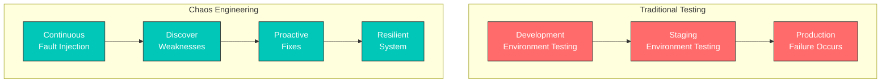
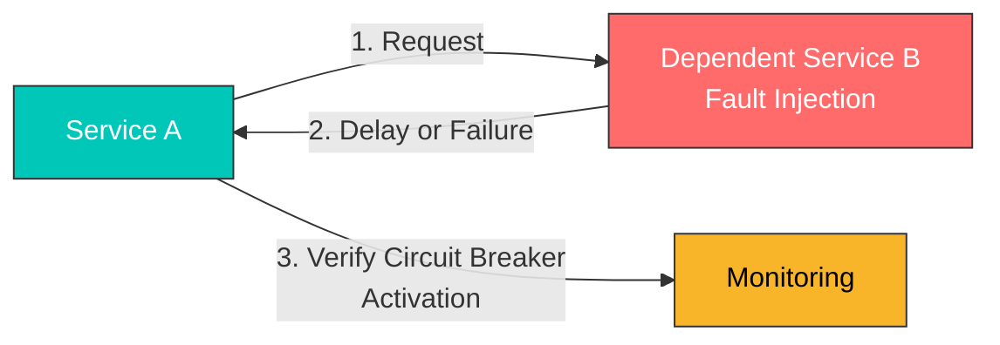
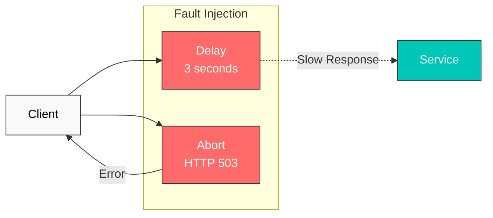
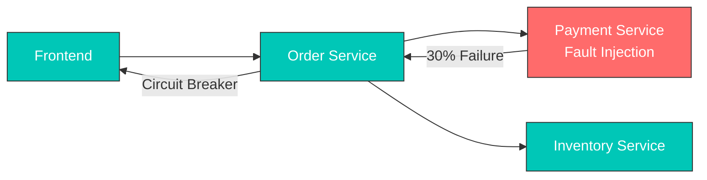
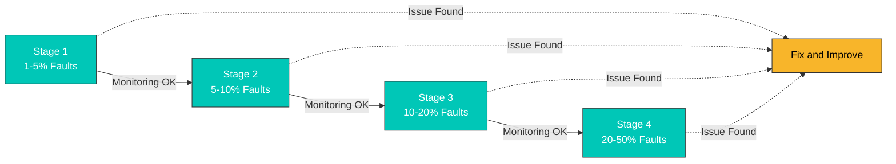

# Fault Injection

Fault Injection は、システムのレジリエンスをテストするために、意図的に障害を注入する手法です。

## 目次

1. [Fault Injection が必要な理由](#why-fault-injection)
2. [Fault Injection を使用する場面](#when-to-use-fault-injection)
3. [Fault Injection の概要](#fault-injection-overview)
4. [Delay Injection](#delay-injection)
5. [Abort Injection](#abort-injection)
6. [実践例](#practical-examples)
7. [実際のシナリオ](#real-world-scenarios)
8. [テスト戦略](#testing-strategies)
9. [ベストプラクティス](#best-practices)

## Fault Injection が必要な理由

### 本番環境でのレジリエンスのテスト

マイクロサービスアーキテクチャでは、多数のサービスが相互に依存しており、**1 つのサービス障害がシステム全体に影響を及ぼす可能性があります**。Fault Injection が不可欠である理由は次のとおりです。

#### 1. **Chaos Engineering の中核原則**

Netflix の Chaos Monkey に端を発する Chaos Engineering は、**本番環境で障害をプロアクティブに体験**し、システムの弱点を発見することを目的とします。



#### 2. **実際の本番シナリオの再現**

本番環境では、次の問題が発生する可能性があります。

| シナリオ | 原因 | Fault Injection テスト |
|----------|-------|---------------------|
| **Network Latency** | リージョン間のネットワーク遅延 | Delay Injection |
| **Service Timeout** | 遅いデータベースクエリ | Delay Injection |
| **Temporary Failure** | サービスの再起動、スケールダウン | Abort Injection |
| **Partial Failure** | 一部の Pod のみが失敗 | パーセンテージベースの Injection |
| **Cascading Failure** | 1 つのサービス障害が他のサービスに伝播 | 組み合わせた Fault Injection |

#### 3. **Circuit Breaker と Timeout 設定の検証**

Fault Injection がないと、**Circuit Breaker と Timeout の設定が実際に機能するか確認することは困難です**。



#### 4. **安全なデプロイの検証**

新しいバージョンをデプロイする際、**依存サービスが失敗しても安全かどうか**を検証できます。

- 新しいバージョンは Timeout を正しく処理しますか？
- 依存サービスが失敗したときにグレースフルデグラデーションを実行しますか？
- エラーハンドリングロジックは正しく機能しますか？

## Fault Injection を使用する場面

Fault Injection は、次の状況で使用する必要があります。

### 1. **開発環境およびテスト環境**

#### シナリオ: 新しいマイクロサービスの開発

```yaml
# Inject faults into service under development
apiVersion: networking.istio.io/v1
kind: VirtualService
metadata:
  name: payment-service-dev
  namespace: dev
spec:
  hosts:
  - payment-service
  http:
  - match:
    - headers:
        x-testing:
          exact: "true"  # Apply only to test traffic
    fault:
      delay:
        percentage:
          value: 50.0
        fixedDelay: 3s
      abort:
        percentage:
          value: 20.0
        httpStatus: 503
    route:
    - destination:
        host: payment-service
        subset: v2
```

**ユースケース**:
- Payment Service が遅くなったり失敗したりした際に、Order Service がどのように反応するかをテストする
- 適切なエラーメッセージがユーザーに表示されることを確認する

### 2. **Staging 環境での統合テスト**

#### シナリオ: 本番デプロイ前の最終検証

```yaml
# Inject random faults into all dependent services
apiVersion: networking.istio.io/v1
kind: VirtualService
metadata:
  name: database-service-staging
spec:
  hosts:
  - database-service
  http:
  - fault:
      delay:
        percentage:
          value: 10.0  # 10% of requests delayed
        fixedDelay: 5s
      abort:
        percentage:
          value: 5.0   # 5% of requests fail
        httpStatus: 500
    route:
    - destination:
        host: database-service
```

**ユースケース**:
- 本番デプロイ前にシステム全体のレジリエンスを検証する
- モニタリングアラートが正しく機能することを確認する

### 3. **本番環境での Chaos Testing**

#### シナリオ: 定期的な本番レジリエンステスト

```yaml
# Inject faults at very low rate in production
apiVersion: networking.istio.io/v1
kind: VirtualService
metadata:
  name: recommendation-service-prod
spec:
  hosts:
  - recommendation-service
  http:
  - match:
    - headers:
        x-canary:
          exact: "true"  # Apply only to canary users
    fault:
      abort:
        percentage:
          value: 1.0  # Only 1% of requests fail
        httpStatus: 503
    route:
    - destination:
        host: recommendation-service
```

**ユースケース**:
- Netflix スタイルの Chaos Engineering
- 本番環境での実際の障害対応能力を検証する
- **注**: 非常に低い割合（1～5%）から開始し、影響を監視する

### 4. **Timeout および Retry ポリシーの調整**

#### シナリオ: 最適な Timeout 値の特定

```yaml
# Test with various delay times
apiVersion: networking.istio.io/v1
kind: VirtualService
metadata:
  name: search-service-timeout-test
spec:
  hosts:
  - search-service
  http:
  - match:
    - headers:
        x-test-scenario:
          exact: "slow-response"
    fault:
      delay:
        percentage:
          value: 100.0
        fixedDelay: 10s  # 10 second delay
    timeout: 5s  # 5 second timeout setting
    route:
    - destination:
        host: search-service
```

**ユースケース**:
- 現在の Timeout 設定（5 秒）が適切かをテストする
- 10 秒の遅延がある場合に Timeout が機能することを確認する
- ユーザーエクスペリエンスを損なわない最適な値を見つける

### 5. **Circuit Breaker の動作検証**

#### シナリオ: Circuit Breaker が正しく機能することの確認

```yaml
# DestinationRule: Circuit Breaker configuration
apiVersion: networking.istio.io/v1
kind: DestinationRule
metadata:
  name: reviews-circuit-breaker
spec:
  host: reviews
  trafficPolicy:
    outlierDetection:
      consecutiveErrors: 5
      interval: 30s
      baseEjectionTime: 30s
---
# VirtualService: Fault injection
apiVersion: networking.istio.io/v1
kind: VirtualService
metadata:
  name: reviews-fault
spec:
  hosts:
  - reviews
  http:
  - fault:
      abort:
        percentage:
          value: 60.0  # 60% failure rate
        httpStatus: 503
    route:
    - destination:
        host: reviews
```

**ユースケース**:
- 60% の失敗率で 5 回連続してエラーが発生した後に Circuit Breaker が有効になることを検証する
- 30 秒後の自動回復を検証する

### 6. **特定のユーザーグループ向けテスト**

#### シナリオ: Beta Tester にのみ障害を注入

```yaml
# Inject faults only for specific users
apiVersion: networking.istio.io/v1
kind: VirtualService
metadata:
  name: api-service-beta
spec:
  hosts:
  - api-service
  http:
  - match:
    - headers:
        end-user:
          exact: "beta-tester"  # Beta testers only
    fault:
      delay:
        percentage:
          value: 20.0
        fixedDelay: 2s
    route:
    - destination:
        host: api-service
  - route:  # Normal routing for regular users
    - destination:
        host: api-service
```

**ユースケース**:
- 実際のユーザーに影響を与えずに安全にテストする
- Beta Tester からのフィードバックに基づいて改善する

## Fault Injection の概要



## Delay Injection

```yaml
apiVersion: networking.istio.io/v1
kind: VirtualService
metadata:
  name: reviews-delay
spec:
  hosts:
  - reviews
  http:
  - fault:
      delay:
        percentage:
          value: 10.0  # Inject delay in 10% of requests
        fixedDelay: 5s  # 5 second delay
    route:
    - destination:
        host: reviews
```

## Abort Injection

```yaml
apiVersion: networking.istio.io/v1
kind: VirtualService
metadata:
  name: reviews-abort
spec:
  hosts:
  - reviews
  http:
  - fault:
      abort:
        percentage:
          value: 10.0  # Abort 10% of requests
        httpStatus: 503  # Return HTTP 503 error
    route:
    - destination:
        host: reviews
```

## 実践例

### 1. Delay と Abort の組み合わせ

実際の本番環境では、遅延と障害が同時に発生する可能性があります。

```yaml
apiVersion: networking.istio.io/v1
kind: VirtualService
metadata:
  name: ratings-combined-fault
spec:
  hosts:
  - ratings
  http:
  - fault:
      delay:
        percentage:
          value: 20.0  # 20% of requests delayed
        fixedDelay: 3s
      abort:
        percentage:
          value: 10.0  # 10% of requests fail
        httpStatus: 503
    route:
    - destination:
        host: ratings
```

**結果**:
- リクエストの 20% に 3 秒の遅延が発生する
- リクエストの 10% に即時の 503 エラーが発生する
- 残りの 70% は通常どおり処理される

### 2. 条件付き Fault Injection

特定の条件下でのみ障害を注入します。

```yaml
apiVersion: networking.istio.io/v1
kind: VirtualService
metadata:
  name: reviews-conditional-fault
spec:
  hosts:
  - reviews
  http:
  # Inject faults only for mobile users
  - match:
    - headers:
        user-agent:
          regex: ".*Mobile.*"
    fault:
      delay:
        percentage:
          value: 30.0
        fixedDelay: 2s
    route:
    - destination:
        host: reviews
        subset: v2
  # Normal routing for regular users
  - route:
    - destination:
        host: reviews
        subset: v1
```

### 3. 段階的な Fault Injection

障害率を徐々に上げてテストします。

```yaml
# Stage 1: 5% faults
apiVersion: networking.istio.io/v1
kind: VirtualService
metadata:
  name: api-fault-stage1
spec:
  hosts:
  - api-service
  http:
  - fault:
      abort:
        percentage:
          value: 5.0
        httpStatus: 500
    route:
    - destination:
        host: api-service
---
# Stage 2: 10% faults (apply after monitoring)
apiVersion: networking.istio.io/v1
kind: VirtualService
metadata:
  name: api-fault-stage2
spec:
  hosts:
  - api-service
  http:
  - fault:
      abort:
        percentage:
          value: 10.0
        httpStatus: 500
    route:
    - destination:
        host: api-service
---
# Stage 3: 20% faults (apply after sufficient validation)
apiVersion: networking.istio.io/v1
kind: VirtualService
metadata:
  name: api-fault-stage3
spec:
  hosts:
  - api-service
  http:
  - fault:
      abort:
        percentage:
          value: 20.0
        httpStatus: 500
    route:
    - destination:
        host: api-service
```

### 4. HTTP Status Code ごとのテスト

さまざまな HTTP エラーコードでテストします。

```yaml
apiVersion: networking.istio.io/v1
kind: VirtualService
metadata:
  name: payment-error-scenarios
spec:
  hosts:
  - payment-service
  http:
  # Scenario 1: Service overload (503)
  - match:
    - headers:
        x-test-scenario:
          exact: "overload"
    fault:
      abort:
        percentage:
          value: 50.0
        httpStatus: 503
    route:
    - destination:
        host: payment-service
  # Scenario 2: Internal server error (500)
  - match:
    - headers:
        x-test-scenario:
          exact: "server-error"
    fault:
      abort:
        percentage:
          value: 30.0
        httpStatus: 500
    route:
    - destination:
        host: payment-service
  # Scenario 3: Gateway timeout (504)
  - match:
    - headers:
        x-test-scenario:
          exact: "timeout"
    fault:
      abort:
        percentage:
          value: 20.0
        httpStatus: 504
    route:
    - destination:
        host: payment-service
  # Default routing
  - route:
    - destination:
        host: payment-service
```

## 実際のシナリオ

### シナリオ 1: 遅いデータベースクエリのシミュレーション

**状況**: データベースクエリが断続的に遅くなる

```yaml
apiVersion: networking.istio.io/v1
kind: VirtualService
metadata:
  name: database-slow-query
  namespace: production
spec:
  hosts:
  - database-service
  http:
  - fault:
      delay:
        percentage:
          value: 15.0  # 15% of queries are slow
        fixedDelay: 8s   # 8 second delay
    route:
    - destination:
        host: database-service
```

**テスト目標**:
1. アプリケーションの Timeout 設定は適切ですか？
2. Connection Pool は枯渇しますか？
3. 適切なエラーメッセージがユーザーに表示されますか？

**期待される結果**:
- 適切な Timeout により迅速な失敗（fail-fast）が可能になる
- Connection Pool の管理が正常である
- システム全体の応答遅延 -> Circuit Breaker が必要

### シナリオ 2: マイクロサービスのカスケード障害のテスト

**状況**: 1 つのサービス障害が他のサービスに伝播するかを検証する



```yaml
# Inject faults into payment service
apiVersion: networking.istio.io/v1
kind: VirtualService
metadata:
  name: payment-cascade-test
spec:
  hosts:
  - payment-service
  http:
  - fault:
      abort:
        percentage:
          value: 30.0  # 30% failure
        httpStatus: 503
    route:
    - destination:
        host: payment-service
---
# Configure Circuit Breaker for order service
apiVersion: networking.istio.io/v1
kind: DestinationRule
metadata:
  name: order-circuit-breaker
spec:
  host: order-service
  trafficPolicy:
    outlierDetection:
      consecutiveErrors: 5
      interval: 30s
      baseEjectionTime: 30s
```

**テスト目標**:
1. Order Service は Payment Service の障害を適切に処理しますか？
2. Circuit Breaker が有効になり、Inventory Service は正常に動作しますか？
3. Frontend に適切なユーザーメッセージが表示されますか？

### シナリオ 3: API Rate Limit 状況のテスト

**状況**: 外部 API が Rate Limit に達する状況をシミュレートする

```yaml
apiVersion: networking.istio.io/v1
kind: VirtualService
metadata:
  name: external-api-rate-limit
spec:
  hosts:
  - external-api-service
  http:
  - match:
    - headers:
        x-api-key:
          exact: "test-key"
    fault:
      abort:
        percentage:
          value: 40.0  # 40% of requests rate limited
        httpStatus: 429  # Too Many Requests
    route:
    - destination:
        host: external-api-service
```

**テスト目標**:
1. 429 エラーは適切に処理されますか？
2. Retry ロジックは Exponential Backoff を使用しますか？
3. API 呼び出しを減らすためにキャッシュが利用されますか？

### シナリオ 4: リージョン間ネットワーク遅延のシミュレーション

**状況**: 異なるリージョンのサービスを呼び出す際の遅延

```yaml
apiVersion: networking.istio.io/v1
kind: VirtualService
metadata:
  name: cross-region-latency
spec:
  hosts:
  - us-east-service
  http:
  - match:
    - sourceLabels:
        region: "eu-west"  # Calling from EU to US
    fault:
      delay:
        percentage:
          value: 100.0
        fixedDelay: 150ms  # 150ms delay (transatlantic)
    route:
    - destination:
        host: us-east-service
```

**テスト目標**:
1. グローバルサービスにおけるリージョン間遅延の影響を確認する
2. キャッシュまたは CDN による最適化が可能か判断する
3. SLA の目標を満たしているか（例: リクエストの 95% が 500ms 以内）？

### シナリオ 5: デプロイ中の一時的な障害のシミュレーション

**状況**: Rolling Update 中に一部の Pod が一時的に利用できなくなる

```yaml
apiVersion: networking.istio.io/v1
kind: VirtualService
metadata:
  name: deployment-transient-failure
spec:
  hosts:
  - app-service
  http:
  - match:
    - headers:
        x-deployment-test:
          exact: "true"
    fault:
      abort:
        percentage:
          value: 25.0  # 25% pods fail (1 out of 4)
        httpStatus: 503
      delay:
        percentage:
          value: 10.0
        fixedDelay: 5s   # Some start slowly
    route:
    - destination:
        host: app-service
        subset: v2
```

**テスト目標**:
1. デプロイ中に可用性を維持する（最低 75%）
2. Readiness Probe は正しく機能しますか？
3. Load Balancer は正常な Pod にのみトラフィックをルーティングしますか？

## テスト戦略

### 1. 段階的な Chaos Engineering

障害率を徐々に上げてシステムの限界を見つけます。



**段階的な実行**:

```bash
# Stage 1: 1% fault injection
kubectl apply -f fault-injection-1percent.yaml
# Monitor for 15 minutes
kubectl logs -f deployment/monitoring

# If no issues, proceed to stage 2
kubectl apply -f fault-injection-5percent.yaml
# Monitor for 15 minutes

# Continue...
```

### 2. 時間ベースのテスト

特定の時間帯にのみ障害を注入します。

```yaml
# Automate with CronJob
apiVersion: batch/v1
kind: CronJob
metadata:
  name: fault-injection-scheduler
spec:
  schedule: "0 2 * * *"  # Every day at 2 AM
  jobTemplate:
    spec:
      template:
        spec:
          containers:
          - name: apply-fault
            image: bitnami/kubectl
            command:
            - /bin/sh
            - -c
            - |
              kubectl apply -f /config/fault-injection.yaml
              sleep 3600  # Maintain for 1 hour
              kubectl delete -f /config/fault-injection.yaml
```

### 3. 自動テストパイプライン

CI/CD パイプラインに統合します。

```yaml
# GitLab CI example
stages:
  - deploy
  - fault-injection-test
  - verify
  - cleanup

fault_injection_test:
  stage: fault-injection-test
  script:
    # Apply Fault Injection
    - kubectl apply -f tests/fault-injection.yaml

    # Run load test
    - k6 run --vus 100 --duration 5m tests/load-test.js

    # Validate metrics
    - |
      ERROR_RATE=$(curl -s "http://prometheus:9090/api/v1/query?query=rate(istio_requests_total{response_code=\"500\"}[5m])" | jq '.data.result[0].value[1]')
      if [ $(echo "$ERROR_RATE > 0.05" | bc) -eq 1 ]; then
        echo "Error rate too high: $ERROR_RATE"
        exit 1
      fi
  after_script:
    # Remove Fault Injection
    - kubectl delete -f tests/fault-injection.yaml
```

### 4. モニタリングとアラート

障害注入中は主要なメトリクスを監視します。

```yaml
# Prometheus alert rules
apiVersion: v1
kind: ConfigMap
metadata:
  name: prometheus-alerts
data:
  fault-injection-alerts.yaml: |
    groups:
    - name: fault-injection
      rules:
      # Error rate increase
      - alert: HighErrorRate
        expr: rate(istio_requests_total{response_code=~"5.."}[5m]) > 0.1
        for: 2m
        annotations:
          summary: "High error rate during fault injection"

      # Circuit Breaker activation
      - alert: CircuitBreakerOpen
        expr: envoy_cluster_circuit_breakers_default_rq_open > 0
        for: 1m
        annotations:
          summary: "Circuit breaker opened"

      # Response time increase
      - alert: HighLatency
        expr: histogram_quantile(0.95, rate(istio_request_duration_milliseconds_bucket[5m])) > 3000
        for: 5m
        annotations:
          summary: "95th percentile latency > 3s"
```

### 5. Blue-Green Fault Injection

Blue 環境に障害を注入し、Green 環境と比較します。

```yaml
# Blue environment: Fault Injection
apiVersion: networking.istio.io/v1
kind: VirtualService
metadata:
  name: app-blue-fault
spec:
  hosts:
  - app-service
  http:
  - match:
    - headers:
        x-version:
          exact: "blue"
    fault:
      delay:
        percentage:
          value: 20.0
        fixedDelay: 3s
    route:
    - destination:
        host: app-service
        subset: blue
---
# Green environment: Normal
apiVersion: networking.istio.io/v1
kind: VirtualService
metadata:
  name: app-green-normal
spec:
  hosts:
  - app-service
  http:
  - match:
    - headers:
        x-version:
          exact: "green"
    route:
    - destination:
        host: app-service
        subset: green
```

**比較メトリクス**:
- エラー率
- 応答時間（P50、P95、P99）
- ユーザーエクスペリエンス指標

## ベストプラクティス

### 1. 小規模から開始する

- 最初は低い割合の **1～5%** から開始する
- 開発環境および Staging 環境で十分にテストする
- 本番環境ではビジネスへの影響が少ない時間帯に実行する

### 2. モニタリングは必須

Fault Injection を適用する前にモニタリングダッシュボードを準備します。

```yaml
# Grafana dashboard metrics
- istio_requests_total (Error rate)
- istio_request_duration_milliseconds (Latency)
- envoy_cluster_upstream_rq_retry (Retry count)
- envoy_cluster_circuit_breakers_* (Circuit Breaker status)
```

### 3. 明確なラベルを使用する

```yaml
apiVersion: networking.istio.io/v1
kind: VirtualService
metadata:
  name: payment-fault
  labels:
    fault-injection: "true"
    test-type: "chaos-engineering"
    test-date: "2025-01-15"
  annotations:
    description: "Testing payment service resilience"
    owner: "platform-team"
```

### 4. 自動ロールバックメカニズム

```bash
#!/bin/bash
# Apply Fault Injection
kubectl apply -f fault-injection.yaml

# Monitor for 5 minutes
sleep 300

# Check error rate
ERROR_RATE=$(kubectl exec -it prometheus-pod -- \
  promtool query instant \
  'rate(istio_requests_total{response_code="500"}[5m])' | \
  jq '.data.result[0].value[1]')

# Rollback if threshold exceeded
if [ $(echo "$ERROR_RATE > 0.1" | bc) -eq 1 ]; then
  echo "Error rate too high, rolling back..."
  kubectl delete -f fault-injection.yaml
  exit 1
fi
```

### 5. ドキュメント化

すべての Fault Injection テストを文書化します。

```yaml
apiVersion: networking.istio.io/v1
kind: VirtualService
metadata:
  name: api-fault-test
  annotations:
    # Test purpose
    test-purpose: "Verify Circuit Breaker activation"

    # Expected behavior
    expected-behavior: |
      - Circuit Breaker opens after 5 consecutive errors
      - Requests fail fast with 503 error
      - System recovers after 30 seconds

    # Success criteria
    success-criteria: |
      - Error rate < 5%
      - P95 latency < 500ms
      - No cascading failures

    # Rollback plan
    rollback-plan: "kubectl delete vs api-fault-test"
```

### 6. 本番環境での注意事項

- **ビジネス影響評価**: Fault Injection が実際のユーザーに与える影響を分析する
- **段階的な拡大**: 1% -> 5% -> 10% とゆっくり増やす
- **アラート設定**: しきい値を超えた場合に即時アラートを送る
- **ロールバックの準備**: いつでも即時にロールバックできるようにする
- **営業時間を避ける**: トラフィックが少ない時間帯を選ぶ

### 7. 定期テスト

```yaml
# Weekly automated Chaos Test
apiVersion: batch/v1
kind: CronJob
metadata:
  name: weekly-chaos-test
spec:
  schedule: "0 3 * * 0"  # Every Sunday at 3 AM
  jobTemplate:
    spec:
      template:
        spec:
          serviceAccountName: chaos-tester
          containers:
          - name: chaos-test
            image: chaos-tester:latest
            env:
            - name: FAULT_PERCENTAGE
              value: "5"
            - name: DURATION
              value: "1h"
```

## 参考資料

- [Istio Fault Injection](https://istio.io/latest/docs/tasks/traffic-management/fault-injection/)
- [Principles of Chaos Engineering](https://principlesofchaos.org/)
- [Netflix Chaos Engineering](https://netflix.github.io/chaosmonkey/)
- [Google SRE - Testing for Reliability](https://sre.google/sre-book/testing-reliability/)
