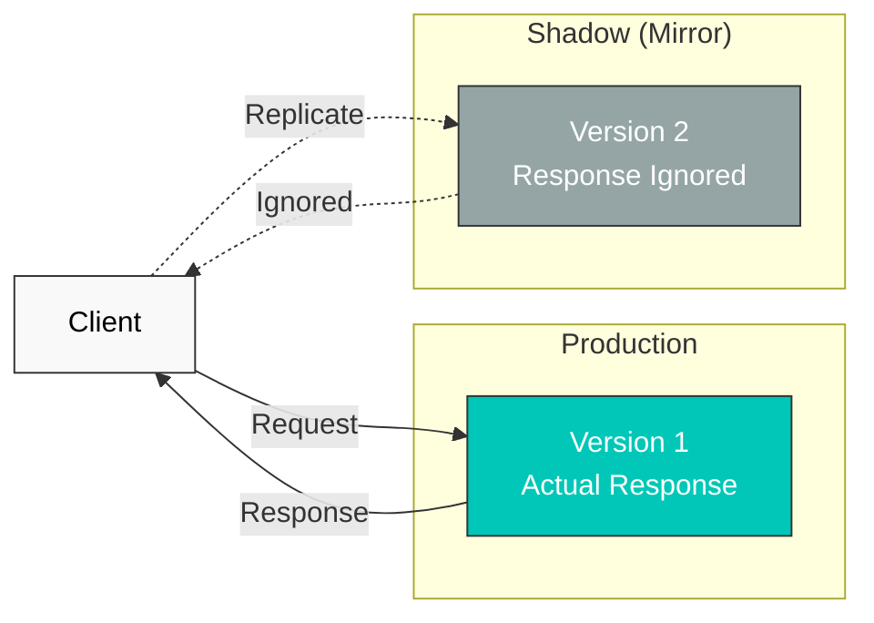

# トラフィックミラーリング

Traffic Mirroring（またはShadow Traffic）は、本番トラフィックをリアルタイムで複製して、新しいバージョンをテストする手法です。

## 目次

1. [トラフィックミラーリングの概要](#traffic-mirroring-overview)
2. [基本設定](#basic-configuration)
3. [部分ミラーリング](#partial-mirroring)
4. [実践例 (English)](https://www.atomai.click/kubernetes-docs/en/service-mesh/istio/traffic-management/09-traffic-mirror#basic-configuration)
5. [ベストプラクティス (English)](https://www.atomai.click/kubernetes-docs/en/service-mesh/istio/traffic-management/09-traffic-mirror#best-practices)

<span id="traffic-mirroring-overview"></span>

## トラフィックミラーリングの概要



<span id="basic-configuration"></span>

## 基本設定

```yaml
apiVersion: networking.istio.io/v1
kind: VirtualService
metadata:
  name: reviews-mirror
spec:
  hosts:
  - reviews
  http:
  - route:
    - destination:
        host: reviews
        subset: v1
      weight: 100
    mirror:
      host: reviews
      subset: v2
    mirrorPercentage:
      value: 100  # 100% mirroring
```

<span id="partial-mirroring"></span>

## 部分ミラーリング

```yaml
apiVersion: networking.istio.io/v1
kind: VirtualService
metadata:
  name: reviews-partial-mirror
spec:
  hosts:
  - reviews
  http:
  - route:
    - destination:
        host: reviews
        subset: v1
      weight: 100
    mirror:
      host: reviews
      subset: v2
    mirrorPercentage:
      value: 10  # Mirror only 10%
```

## 参考資料

- [Istio Traffic Mirroring](https://istio.io/latest/docs/tasks/traffic-management/mirroring/)
