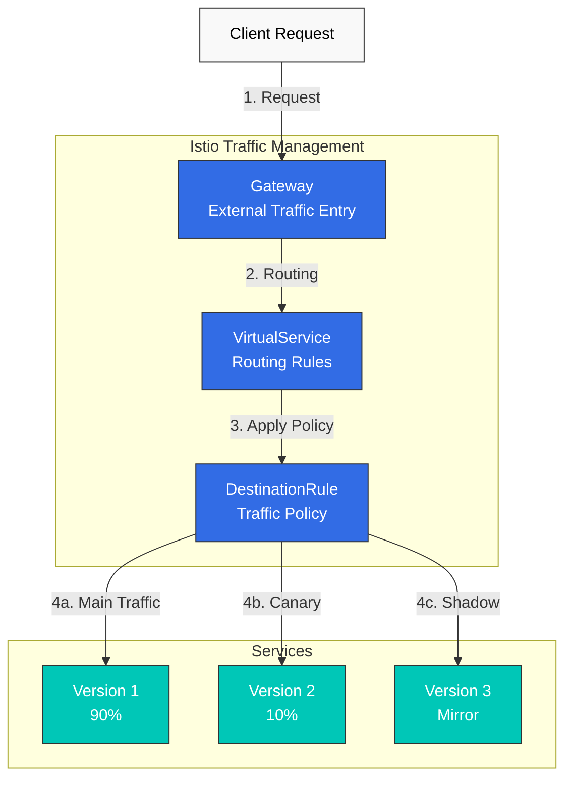
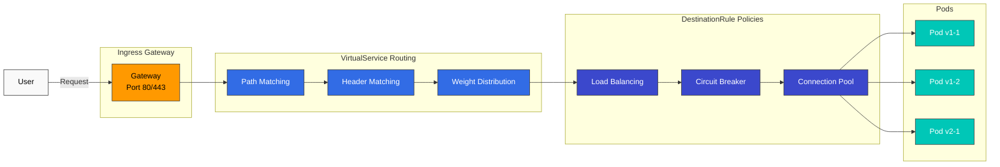

# トラフィック管理

Istio のトラフィック管理機能により、Service Mesh 内のトラフィックフローをきめ細かく制御できます。

## 目次

1. [Gateway と VirtualService](01-gateway-virtualservice.md)
2. [ルーティング](02-routing.md)
3. [DestinationRule](03-destination-rule.md) ⭐ 必須概念
4. [トラフィック分割](04-traffic-splitting.md)
5. [リトライとタイムアウト](05-retry-timeout.md)
6. [ロードバランシング](06-load-balancing.md)
7. [Circuit Breaker](07-circuit-breaker.md)
8. [フォールトインジェクション](08-fault-injection.md)
9. [トラフィックミラーリング](09-traffic-mirror.md)
10. [セッションアフィニティ](10-session-affinity.md)
11. [Egress 制御](11-egress-control.md)
12. [ServiceEntry（外部 Service 管理）](12-service-entry.md)

## 概要

トラフィック管理は Istio の中核機能の一つであり、コードを変更せずに以下の操作を可能にします。

### 主な機能



### 1. インテリジェントルーティング

- **パスベース**: `/api/v1` → Service A、`/api/v2` → Service B
- **ヘッダーベース**: `User-Agent: Mobile` → モバイルバージョン
- **Cookie ベース**: 特定のユーザーを特定のバージョンへルーティング
- **重みベース**: 比率に応じてトラフィックを分散

### 2. デプロイ戦略

**Canary Deployment**:
```yaml
# Only 10% to new version
route:
- destination:
    host: reviews
    subset: v1
  weight: 90
- destination:
    host: reviews
    subset: v2
  weight: 10
```

**Blue/Green Deployment**:
```yaml
# Instant switch
route:
- destination:
    host: reviews
    subset: v2  # Switch to Green
  weight: 100
```

### 3. レジリエンスパターン

- **Circuit Breaker**: 障害が発生している Service を隔離
- **Retry**: 自動リトライ
- **Timeout**: レスポンスタイムの制限
- **Rate Limiting**: リクエストレートの制御

### 4. テストとデバッグ

- **Traffic Mirroring**: テストのために本番トラフィックを複製
- **Fault Injection**: 意図的な障害の注入
- **A/B Testing**: 異なるユーザーグループに異なるバージョンを提供

## コアリソース

### Gateway

Mesh への外部トラフィックのエントリポイントを定義します。

```yaml
apiVersion: networking.istio.io/v1
kind: Gateway
metadata:
  name: my-gateway
spec:
  selector:
    istio: ingressgateway
  servers:
  - port:
      number: 80
      name: http
      protocol: HTTP
    hosts:
    - "myapp.example.com"
```

### VirtualService

リクエストのルーティング方法を定義します。

```yaml
apiVersion: networking.istio.io/v1
kind: VirtualService
metadata:
  name: reviews
spec:
  hosts:
  - reviews
  http:
  - match:
    - uri:
        prefix: "/v2"
    route:
    - destination:
        host: reviews
        subset: v2
  - route:
    - destination:
        host: reviews
        subset: v1
```

### DestinationRule

宛先 Service のポリシーを定義します。

```yaml
apiVersion: networking.istio.io/v1
kind: DestinationRule
metadata:
  name: reviews
spec:
  host: reviews
  trafficPolicy:
    loadBalancer:
      simple: LEAST_REQUEST
  subsets:
  - name: v1
    labels:
      version: v1
  - name: v2
    labels:
      version: v2
```

## 実践例

### 安全な Canary Deployment

```yaml
# Step 1: Start with 5% traffic
apiVersion: networking.istio.io/v1
kind: VirtualService
metadata:
  name: reviews-canary
spec:
  hosts:
  - reviews
  http:
  - route:
    - destination:
        host: reviews
        subset: v1
      weight: 95
    - destination:
        host: reviews
        subset: v2
      weight: 5
```

監視後、問題がなければ段階的に増やします。
- 5% → 10% → 25% → 50% → 100%

### ヘッダーベースルーティング（開発者テスト）

```yaml
apiVersion: networking.istio.io/v1
kind: VirtualService
metadata:
  name: reviews-dev
spec:
  hosts:
  - reviews
  http:
  # Developers use new version
  - match:
    - headers:
        x-dev-user:
          exact: "true"
    route:
    - destination:
        host: reviews
        subset: v2
  # Regular users use stable version
  - route:
    - destination:
        host: reviews
        subset: v1
```

### Circuit Breaker + Retry

```yaml
apiVersion: networking.istio.io/v1
kind: DestinationRule
metadata:
  name: reviews-resilient
spec:
  host: reviews
  trafficPolicy:
    # Connection Pool settings
    connectionPool:
      tcp:
        maxConnections: 100
      http:
        http1MaxPendingRequests: 50
        maxRequestsPerConnection: 2
    # Circuit Breaker
    outlierDetection:
      consecutiveErrors: 5
      interval: 30s
      baseEjectionTime: 30s
---
apiVersion: networking.istio.io/v1
kind: VirtualService
metadata:
  name: reviews-retry
spec:
  hosts:
  - reviews
  http:
  - route:
    - destination:
        host: reviews
    retries:
      attempts: 3
      perTryTimeout: 2s
      retryOn: 5xx,reset,connect-failure
    timeout: 10s
```

## トラフィックフロー



## 学習パス

効果的にトラフィック管理を学習するには、以下の順序を推奨します。

1. **[Gateway と VirtualService](01-gateway-virtualservice.md)** ⭐ 開始地点
   - 基本概念の理解
   - 外部トラフィックの処理

2. **[ルーティング](02-routing.md)**
   - 高度なルーティングパターン
   - 条件付きルーティング

3. **[DestinationRule](03-destination-rule.md)** ⭐ 必須概念
   - Subset の概念を理解する
   - Traffic Policy の基本
   - VirtualService との統合

4. **[トラフィック分割](04-traffic-splitting.md)**
   - Canary Deployment
   - A/B Testing

5. **[リトライとタイムアウト](05-retry-timeout.md)**
   - 障害からの復旧
   - レスポンスタイムの制御

6. **[ロードバランシング](06-load-balancing.md)**
   - さまざまなアルゴリズム
   - パフォーマンスの最適化

7. **[Circuit Breaker](07-circuit-breaker.md)**
   - 障害の隔離
   - Cascading Failure の防止

8. **[Fault Injection](08-fault-injection.md)**
   - 障害テスト
   - Chaos Engineering

9. **[Traffic Mirroring](09-traffic-mirror.md)**
   - 本番テスト
   - 新バージョンの検証

10. **[Session Affinity](10-session-affinity.md)**
    - Sticky Session
    - 状態の維持

11. **[Egress 制御](11-egress-control.md)**
    - 外部 Service へのアクセス
    - セキュリティ強化

12. **[ServiceEntry](12-service-entry.md)**
    - 外部 Service の登録
    - Egress Gateway との統合

## ベストプラクティス

### 1. 段階的ロールアウト

```yaml
# ❌ Bad example: 100% at once
weight: 100

# ✅ Good example: Gradual increase
# 5% → Monitor → 10% → Monitor → ...
```

### 2. 常に Timeout を設定する

```yaml
# ✅ Always set timeout
http:
- route:
  - destination:
      host: reviews
  timeout: 10s
```

### 3. Retry を慎重に使用する

```yaml
# ✅ Only when idempotency is guaranteed
retries:
  attempts: 3
  perTryTimeout: 2s
  retryOn: 5xx,reset,connect-failure
```

### 4. Circuit Breaker のしきい値を調整する

```yaml
# ✅ Adjust according to service characteristics
outlierDetection:
  consecutiveErrors: 5      # Adjust per service
  interval: 30s
  baseEjectionTime: 30s
  maxEjectionPercent: 50    # Maximum 50% ejection
```

### 5. メトリクスを監視する

トラフィック管理を変更する際は、常に次の項目を監視します。
- **リクエストレート**: リクエスト数の変化
- **エラーレート**: エラーの割合
- **レイテンシー**: P50、P95、P99 レイテンシー
- **成功率**: 成功の割合

## トラブルシューティング

### トラフィックがルーティングされない

```bash
# 1. Check VirtualService
kubectl get virtualservice -n <namespace>
kubectl describe virtualservice <name> -n <namespace>

# 2. Check DestinationRule
kubectl get destinationrule -n <namespace>

# 3. Check pod labels
kubectl get pods --show-labels -n <namespace>

# 4. Analyze Istio configuration
istioctl analyze -n <namespace>
```

### 重みが適用されない

```bash
# Check Envoy configuration
istioctl proxy-config routes <pod-name> -n <namespace>

# Check cluster information
istioctl proxy-config clusters <pod-name> -n <namespace>
```

## 次のステップ

1. **[セキュリティ](../security/README.md)**: mTLS と認証／認可
2. **[可観測性](../observability/README.md)**: メトリクス、ログ、トレース
3. **[レジリエンス](../resilience/README.md)**: Rate Limiting、Zone Aware Routing

## 参考資料

- [Istio Traffic Management](https://istio.io/latest/docs/concepts/traffic-management/)
- [VirtualService リファレンス](https://istio.io/latest/docs/reference/config/networking/virtual-service/)
- [DestinationRule リファレンス](https://istio.io/latest/docs/reference/config/networking/destination-rule/)
- [Gateway リファレンス](https://istio.io/latest/docs/reference/config/networking/gateway/)

## クイズ

この章で学んだ内容を確認するには、[Istio Traffic Management クイズ](../../../quizzes/service-mesh/istio/traffic-management.md)に挑戦してください。
