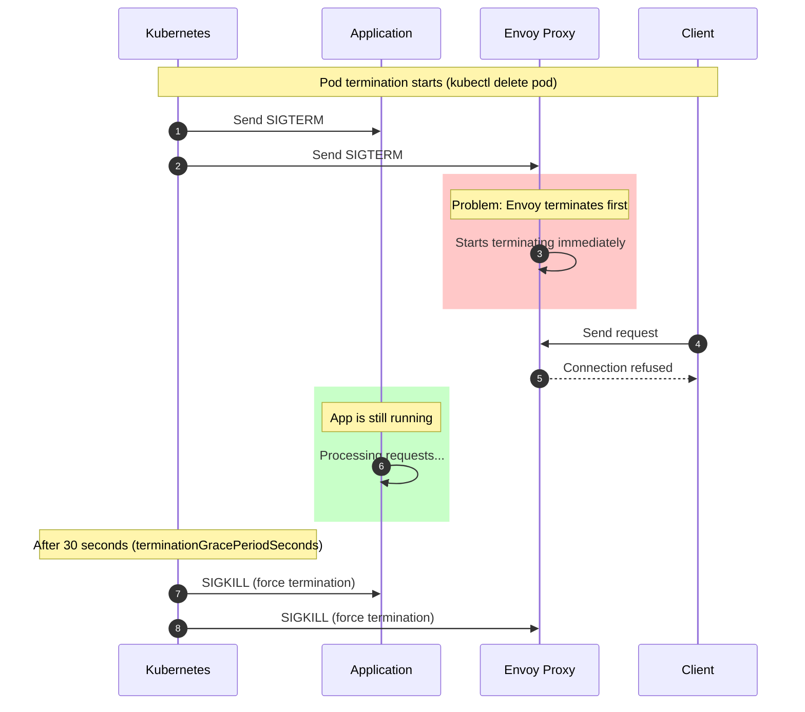
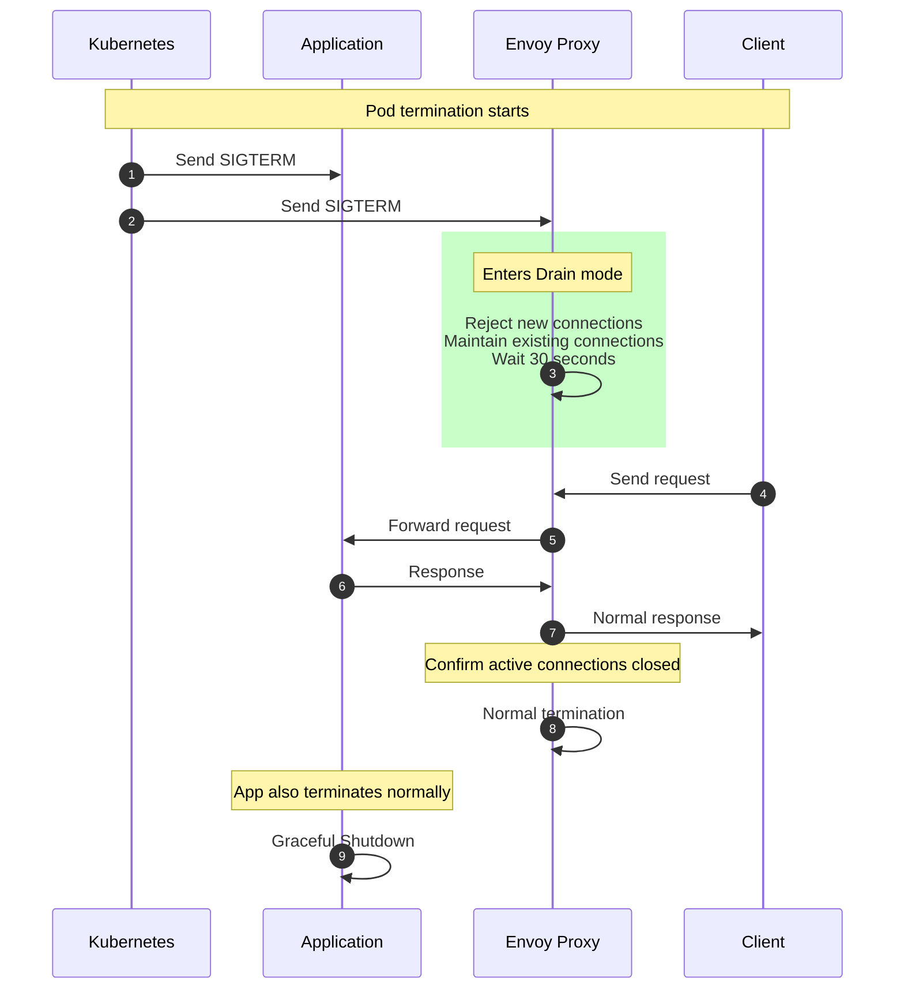
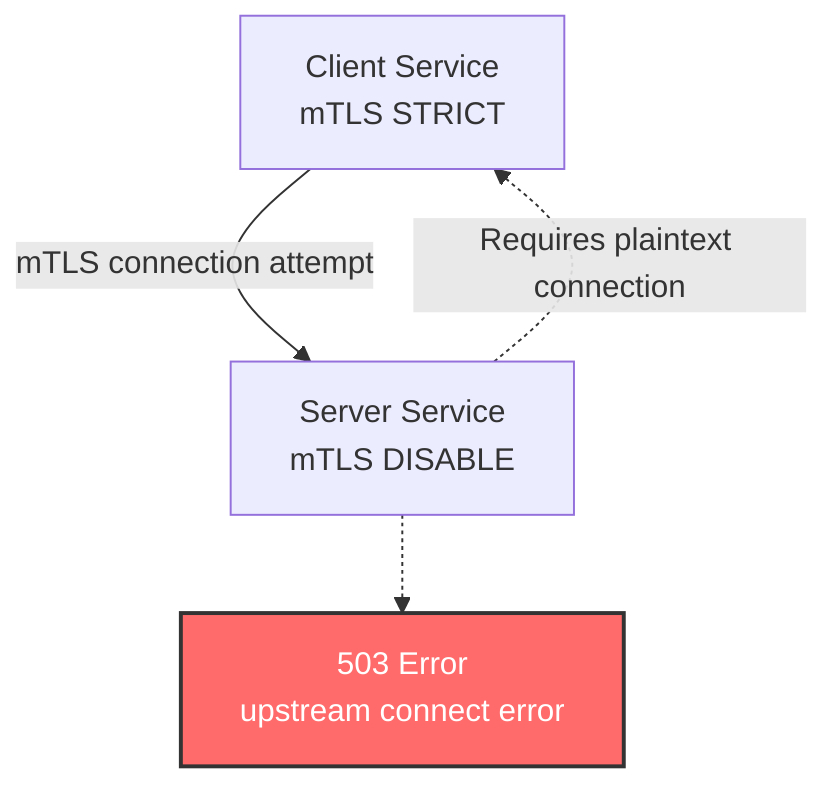

# Istio の一般的なエラーと解決策

> **対応バージョン**: Istio 1.28
> **最終更新**: February 19, 2026

このドキュメントでは、Istio の使用時に発生する最も一般的なエラーとその解決策をまとめます。

## 目次

1. [Pod 終了時の接続エラー](#connection-errors-during-pod-termination)
2. [Sidecar インジェクションの問題](#sidecar-injection-issues)
3. [mTLS 接続の失敗](#mtls-connection-failure)
4. [VirtualService ルーティングの失敗](#virtualservice-routing-failure)
5. [Gateway 設定の問題](#gateway-configuration-issues)
6. [メモリとパフォーマンスの問題](#memory-and-performance-issues)
7. [証明書の有効期限切れ](#certificate-expiration)
8. [DNS 解決の失敗](#dns-resolution-failure)
9. [Envoy 初期化タイムアウト](#envoy-initialization-timeout)
10. [デバッグツール](#debugging-tools)

## Pod 終了時の接続エラー

### 問題の説明

pod が終了すると、Envoy Sidecar がアプリケーションより先に終了し、接続エラーが発生します。

**症状**:
```
Connection reset by peer
Broken pipe
EOF
HTTP 503 Service Unavailable
```

### 根本原因



**根本原因**:
1. Envoy とアプリケーションが同時に SIGTERM を受信する
2. Envoy がアプリケーションより速く終了する
3. アプリケーションがリクエストを処理中にもかかわらず Envoy がすでに終了しており、接続が失敗する

### 解決策

#### 方法 1: Envoy Proxy の preStop Hook を設定する（推奨）

Istio Proxy コンテナに preStop Hook を設定し、すべてのアクティブな接続が閉じるまで待機させます。

```yaml
apiVersion: apps/v1
kind: Deployment
metadata:
  name: myapp
spec:
  template:
    metadata:
      annotations:
        # Envoy waits for active connections to close
        proxy.istio.io/config: |
          terminationDrainDuration: 30s
    spec:
      terminationGracePeriodSeconds: 60
      containers:
      - name: myapp
        image: myapp:latest
        ports:
        - containerPort: 8080
```

**仕組み**:


#### 方法 2: Pod Annotation で Envoy の終了動作を制御する

Pod ごとに Envoy の終了動作を細かく調整できます。

```yaml
apiVersion: apps/v1
kind: Deployment
metadata:
  name: myapp
spec:
  template:
    metadata:
      annotations:
        # Envoy waits for application startup
        proxy.istio.io/config: |
          holdApplicationUntilProxyStarts: true
          terminationDrainDuration: 30s
        # Envoy termination timeout
        sidecar.istio.io/terminationGracePeriodSeconds: "60"
    spec:
      terminationGracePeriodSeconds: 60
      containers:
      - name: myapp
        image: myapp:latest
```

**設定の説明**:
- `holdApplicationUntilProxyStarts: true`: Envoy はアプリケーションより先に起動する
- `terminationDrainDuration: 30s`: Envoy は終了時に 30 秒間 Drain を実行する
- `terminationGracePeriodSeconds: 60`: pod 終了時の合計猶予期間

#### 方法 3: グローバル設定（IstioOperator）

クラスター全体に一貫した終了ポリシーを適用します。

```yaml
apiVersion: install.istio.io/v1alpha1
kind: IstioOperator
metadata:
  name: istio-controlplane
spec:
  meshConfig:
    defaultConfig:
      terminationDrainDuration: 30s
      holdApplicationUntilProxyStarts: true
  values:
    global:
      proxy:
        lifecycle:
          preStop:
            exec:
              command:
              - /bin/sh
              - -c
              - |
                # Start Envoy drain
                curl -X POST http://localhost:15000/drain_listeners?graceful
                # Wait for active connections
                while [ $(netstat -plunt | grep tcp | grep -v TIME_WAIT | wc -l | xargs) -ne 0 ]; do
                  sleep 1;
                done
```

**推奨設定**:
- `terminationDrainDuration`: 30 秒（アクティブな接続の Drain 時間）
- `terminationGracePeriodSeconds`: 60 秒（SIGKILL 前の猶予期間）
- Envoy がアクティブな接続を確認し、グレースフルシャットダウンを実行する

### 検証方法

```bash
# 1. Check logs during pod termination
kubectl logs -f <pod-name> -c istio-proxy --previous

# 2. Check connection status during termination
kubectl exec <pod-name> -c istio-proxy -- netstat -an | grep ESTABLISHED

# 3. Check termination events
kubectl get events --field-selector involvedObject.name=<pod-name>
```

### ベストプラクティス

```yaml
# Recommended configuration template
apiVersion: apps/v1
kind: Deployment
metadata:
  name: myapp
spec:
  template:
    metadata:
      annotations:
        # Envoy termination behavior control
        proxy.istio.io/config: |
          holdApplicationUntilProxyStarts: true
          terminationDrainDuration: 30s
    spec:
      terminationGracePeriodSeconds: 60
      containers:
      - name: myapp
        image: myapp:latest
        ports:
        - containerPort: 8080
        readinessProbe:
          httpGet:
            path: /health
            port: 8080
          periodSeconds: 5
          successThreshold: 1
          failureThreshold: 3
        # Optional: application graceful shutdown
        lifecycle:
          preStop:
            exec:
              command:
              - /bin/sh
              - -c
              - |
                # Disable readiness (optional)
                touch /tmp/not-ready
                # Wait for application requests to complete
                sleep 5
```

**チェックリスト**:
- **Envoy の terminationDrainDuration を設定する**（最重要）
- **holdApplicationUntilProxyStarts: true**（起動順序を保証）
- **terminationGracePeriodSeconds を十分に設定する**（最小 60 秒）
- ReadinessProbe を設定する（終了時に素早く非正常状態へ移行する）
- アプリケーションのグレースフルシャットダウンを実装する（任意）
- モニタリングとロギングを設定する

**重要なポイント**:
- **アプリケーションコンテナに sleep を追加しないでください。**
- **Envoy を Drain モードでグレースフルシャットダウンするよう設定してください。**

## Sidecar インジェクションの問題

### 問題 1: Sidecar がインジェクトされない

**症状**:
```bash
kubectl get pod <pod-name> -o jsonpath='{.spec.containers[*].name}'
# Output: myapp (no istio-proxy)
```

**原因と解決策**:

#### 1. Namespace Label がない

```bash
# Check
kubectl get namespace <namespace> --show-labels

# Solution
kubectl label namespace <namespace> istio-injection=enabled
```

#### 2. Pod Annotation によりインジェクションが無効化されている

```yaml
# Incorrect configuration
apiVersion: v1
kind: Pod
metadata:
  annotations:
    sidecar.istio.io/inject: "false"  # <- Injection disabled
```

**解決策**:
```yaml
# Correct configuration
apiVersion: v1
kind: Pod
metadata:
  annotations:
    sidecar.istio.io/inject: "true"
```

#### 3. Istio Sidecar Injector の動作を確認する

```bash
# Check sidecar injector webhook
kubectl get mutatingwebhookconfigurations

# Check Istio injector logs
kubectl logs -n istio-system -l app=sidecar-injector
```

### 問題 2: Sidecar のリソース不足

**症状**:
```
OOMKilled
CrashLoopBackOff
Error: container has runAsNonRoot and image has non-numeric user
```

**解決策**:

```yaml
apiVersion: v1
kind: Pod
metadata:
  annotations:
    sidecar.istio.io/proxyCPU: "200m"
    sidecar.istio.io/proxyMemory: "256Mi"
    sidecar.istio.io/proxyCPULimit: "1000m"
    sidecar.istio.io/proxyMemoryLimit: "512Mi"
spec:
  containers:
  - name: myapp
    image: myapp:latest
```

## mTLS 接続の失敗

### 問題の説明

**症状**:
```
upstream connect error or disconnect/reset before headers
503 Service Unavailable
SSL routines:OPENSSL_internal:WRONG_VERSION_NUMBER
```

### 原因 1: PeerAuthentication モードの不一致



**解決策**:

```yaml
# Apply consistent mTLS policy across namespace
apiVersion: security.istio.io/v1
kind: PeerAuthentication
metadata:
  name: default
  namespace: istio-system
spec:
  mtls:
    mode: STRICT  # All services STRICT mode
```

### 原因 2: DestinationRule と PeerAuthentication の競合

```yaml
# Incorrect example
---
apiVersion: security.istio.io/v1
kind: PeerAuthentication
metadata:
  name: default
spec:
  mtls:
    mode: STRICT
---
apiVersion: networking.istio.io/v1
kind: DestinationRule
metadata:
  name: myapp
spec:
  host: myapp
  trafficPolicy:
    tls:
      mode: DISABLE  # <- Conflict!
```

**解決策**:
```yaml
# Correct example
apiVersion: networking.istio.io/v1
kind: DestinationRule
metadata:
  name: myapp
spec:
  host: myapp
  trafficPolicy:
    tls:
      mode: ISTIO_MUTUAL  # Matches PeerAuthentication
```

### デバッグコマンド

```bash
# 1. Check mTLS status
istioctl x describe pod <pod-name> -n <namespace>

# 2. Check PeerAuthentication policies
kubectl get peerauthentication -A

# 3. Check DestinationRule TLS settings
kubectl get destinationrule -A -o yaml | grep -A 5 "tls:"

# 4. Check Envoy cluster TLS settings
istioctl proxy-config clusters <pod-name> -n <namespace> --fqdn <service-name>
```

## VirtualService ルーティングの失敗

### 問題 1: トラフィックがルーティングされない

**症状**:
```
404 Not Found
default backend - 404
```

**原因と解決策**:

#### Host の不正な一致

```yaml
# Incorrect example
apiVersion: networking.istio.io/v1
kind: VirtualService
metadata:
  name: myapp
spec:
  hosts:
  - myapp.example.com  # <- DNS name
  http:
  - route:
    - destination:
        host: myapp  # <- Kubernetes Service name
```

**解決策**:
```yaml
# Correct example
apiVersion: networking.istio.io/v1
kind: VirtualService
metadata:
  name: myapp
  namespace: default
spec:
  hosts:
  - myapp  # Exactly matches Kubernetes Service name
  - myapp.default.svc.cluster.local  # Also add FQDN
  http:
  - route:
    - destination:
        host: myapp
```

### 問題 2: Subset が見つからない

**症状**:
```
no healthy upstream
subset not found
```

**原因**:
```yaml
# VirtualService exists but DestinationRule is missing
apiVersion: networking.istio.io/v1
kind: VirtualService
metadata:
  name: myapp
spec:
  http:
  - route:
    - destination:
        host: myapp
        subset: v1  # <- Subset not defined
```

**解決策**:
```yaml
# Add DestinationRule
apiVersion: networking.istio.io/v1
kind: DestinationRule
metadata:
  name: myapp
spec:
  host: myapp
  subsets:
  - name: v1
    labels:
      version: v1
  - name: v2
    labels:
      version: v2
```

### デバッグ

```bash
# 1. Validate VirtualService
istioctl analyze -n <namespace>

# 2. Check routing rules
istioctl proxy-config routes <pod-name> -n <namespace>

# 3. Check VirtualService status
kubectl get virtualservice <name> -n <namespace> -o yaml
```

## Gateway 設定の問題

### 問題 1: トラフィックが Gateway に到達しない

**症状**:
```bash
curl: (7) Failed to connect to example.com port 443: Connection refused
```

**原因と解決策**:

#### 1. Gateway Service を確認する

```bash
# Check Gateway Service status
kubectl get svc -n istio-system istio-ingressgateway

# Check External IP
kubectl get svc -n istio-system istio-ingressgateway -o jsonpath='{.status.loadBalancer.ingress[0].hostname}'
```

#### 2. Gateway と VirtualService の接続を確認する

```yaml
# Incorrect example
---
apiVersion: networking.istio.io/v1
kind: Gateway
metadata:
  name: myapp-gateway
spec:
  selector:
    istio: ingressgateway
  servers:
  - port:
      number: 80
      name: http
      protocol: HTTP
    hosts:
    - "example.com"
---
apiVersion: networking.istio.io/v1
kind: VirtualService
metadata:
  name: myapp
spec:
  hosts:
  - "example.com"
  gateways:
  - my-gateway  # <- Gateway name typo!
```

**解決策**:
```yaml
# Correct example
apiVersion: networking.istio.io/v1
kind: VirtualService
metadata:
  name: myapp
spec:
  hosts:
  - "example.com"
  gateways:
  - myapp-gateway  # Exactly matches Gateway name
```

### 問題 2: HTTPS 証明書エラー

**症状**:
```
SSL certificate problem: self signed certificate
```

**解決策**:

```yaml
apiVersion: networking.istio.io/v1
kind: Gateway
metadata:
  name: myapp-gateway
spec:
  selector:
    istio: ingressgateway
  servers:
  - port:
      number: 443
      name: https
      protocol: HTTPS
    tls:
      mode: SIMPLE
      credentialName: myapp-tls-secret  # <- Specify exact Secret name
    hosts:
    - "example.com"
```

```bash
# Create TLS Secret
kubectl create secret tls myapp-tls-secret \
  --cert=path/to/cert.pem \
  --key=path/to/key.pem \
  -n istio-system
```

## メモリとパフォーマンスの問題

### 問題 1: Envoy のメモリ使用量増加

**症状**:
```
OOMKilled
Memory usage > 1GB per pod
```

**原因**:
- 作成される listener/cluster が多すぎる
- 大きな ConfigMap/Secret
- メモリリーク

**解決策**:

```yaml
# Limit scope with Sidecar resource
apiVersion: networking.istio.io/v1
kind: Sidecar
metadata:
  name: default
  namespace: default
spec:
  egress:
  - hosts:
    - "./*"  # Same namespace only
    - "istio-system/*"  # istio-system only
```

```yaml
# Envoy resource limits
apiVersion: v1
kind: Pod
metadata:
  annotations:
    sidecar.istio.io/proxyMemory: "512Mi"
    sidecar.istio.io/proxyMemoryLimit: "1Gi"
```

### 問題 2: 高レイテンシー

**症状**:
- P99 レイテンシーが 1 秒を超える
- タイムアウトエラーが頻発する

**解決策**:

```yaml
# Set timeout in VirtualService
apiVersion: networking.istio.io/v1
kind: VirtualService
metadata:
  name: myapp
spec:
  http:
  - route:
    - destination:
        host: myapp
    timeout: 5s  # Total request timeout
    retries:
      attempts: 3
      perTryTimeout: 2s  # Timeout per retry
```

## 証明書の有効期限切れ

### 問題の説明

**症状**:
```
x509: certificate has expired
SSL handshake failed
```

**原因**:
- Istio CA 証明書の有効期限切れ（デフォルトは 10 年）
- Workload 証明書の有効期限切れ（デフォルトは 24 時間、自動更新）

**解決策**:

```bash
# 1. Check CA certificate
kubectl get secret istio-ca-secret -n istio-system -o jsonpath='{.data.ca-cert\.pem}' | base64 -d | openssl x509 -noout -dates

# 2. Check workload certificates
istioctl proxy-config secret <pod-name> -n <namespace>

# 3. Regenerate CA certificate
istioctl x ca root
```

## DNS 解決の失敗

### 問題の説明

**症状**:
```
no such host
DNS resolution failed
```

**解決策**:

```yaml
# Register external service with ServiceEntry
apiVersion: networking.istio.io/v1
kind: ServiceEntry
metadata:
  name: external-api
spec:
  hosts:
  - api.example.com
  ports:
  - number: 443
    name: https
    protocol: HTTPS
  location: MESH_EXTERNAL
  resolution: DNS
```

## Envoy 初期化タイムアウト

### 問題の説明

**症状**:
```
waiting for Envoy proxy to be ready
Readiness probe failed
```

**解決策**:

```yaml
apiVersion: v1
kind: Pod
metadata:
  annotations:
    proxy.istio.io/config: |
      holdApplicationUntilProxyStarts: true
spec:
  containers:
  - name: myapp
    image: myapp:latest
    readinessProbe:
      initialDelaySeconds: 10  # Wait for Envoy initialization
```

## デバッグツール

### istioctl コマンド

```bash
# 1. Analyze pod status
istioctl x describe pod <pod-name> -n <namespace>

# 2. Validate configuration
istioctl analyze -A

# 3. Check Envoy configuration
istioctl proxy-config all <pod-name> -n <namespace>

# 4. Change Envoy log level
istioctl proxy-config log <pod-name> --level debug

# 5. Generate bug report
istioctl bug-report
```

### Envoy Admin API

```bash
# Port-forward to Envoy admin port
kubectl port-forward <pod-name> 15000:15000

# 1. Check cluster status
curl localhost:15000/clusters

# 2. Check statistics
curl localhost:15000/stats/prometheus

# 3. Configuration dump
curl localhost:15000/config_dump

# 4. Change logging level
curl -X POST localhost:15000/logging?level=debug
```

### 一般的なログ確認

```bash
# Application logs
kubectl logs <pod-name> -c <container-name>

# Envoy logs
kubectl logs <pod-name> -c istio-proxy

# Previous container logs (if restarted)
kubectl logs <pod-name> -c istio-proxy --previous

# Real-time logs
kubectl logs -f <pod-name> -c istio-proxy
```

## 参考資料

### 公式ドキュメント
- [Istio デバッグガイド](https://istio.io/latest/docs/ops/diagnostic-tools/)
- [Istio FAQ](https://istio.io/latest/about/faq/)
- [一般的な問題](https://istio.io/latest/docs/ops/common-problems/)

### 関連ドキュメント
- [可観測性](../observability/README.md)
- [セキュリティ](../security/README.md)
- [トラフィック管理](../traffic-management/README.md)

---

**最終更新**: November 27, 2025
