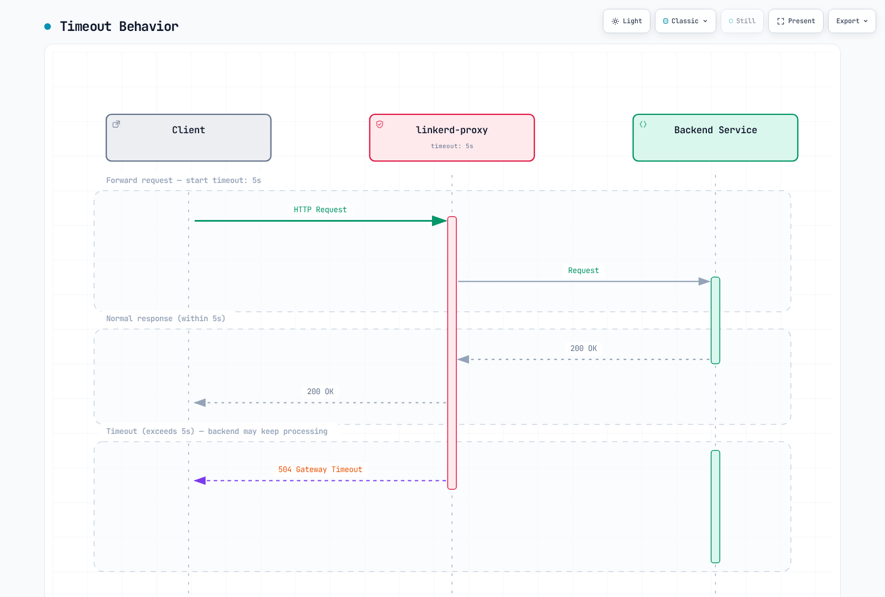
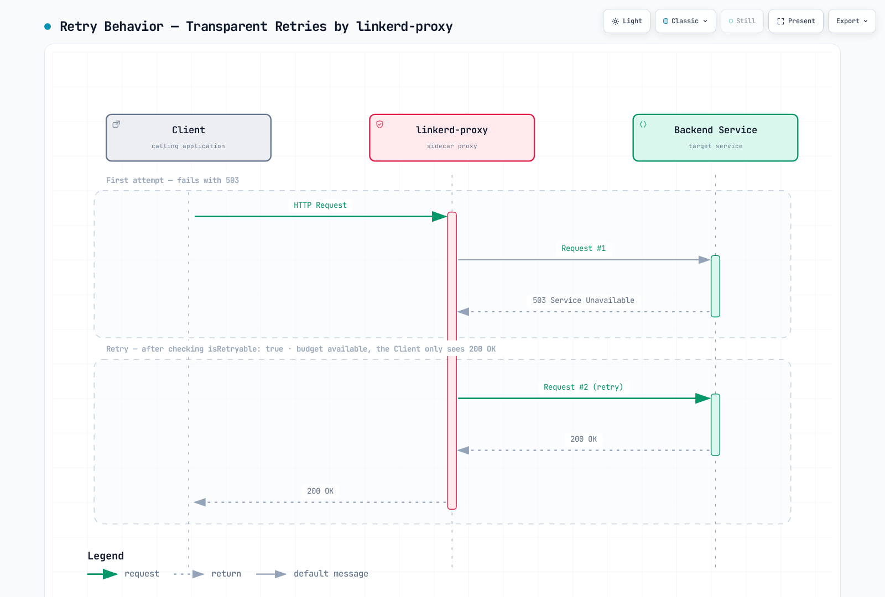

# Linkerdトラフィック管理

> **最終更新**: September 11, 2026 · Linkerd edge-26.9.1 · Gateway API 1.5.1 · Flagger 1.45.0

現在のLinkerd routingはGateway APIと対応アノテーションを使います。ServiceProfileは互換インターフェースとして残り、TrafficSplit/linkerd-smiは非推奨です。これらは交換可能ではありません。同じServiceの既存ServiceProfileは送信HTTPRouteに優先し、新しい再試行/timeout/failure-accrual設定の反映を妨げます。

以下は既存のテスト済みアプリの独立演習です。[導入前提](01-installation.md)、適切な名前空間参加、宣言Service/container port、準備済みendpointを前提とします。レビューではcluster導入、通信移行、本番負荷テストを実行していません。

## トラフィック管理アーキテクチャ

| ポリシー経路 | 役割 | 重要な境界 |
|---|---|---|
| Service親HTTPRoute | メッシュcallerからの送信routing/信頼性 | Client参加とHTTP検査可能性が必要 |
| Server親HTTPRoute | 受信認可の一致 | 接続とpolicyの役割が異なる |
| ServiceProfile | 従来のroute metrics/retry/timeout | 同じServiceの新policy経路を上書き |
| TrafficSplit | 旧SMI重み付きrouting | 非推奨拡張/CRDが必要 |

Serviceベースpolicyは検出に依存します。直接Pod IP/headless、未参加caller、アプリ開始の不透明TLSに同じL7動作が自動適用されるわけではありません。ID、認可、routingは別制御です。

## 現在のHTTPRouteルーティング

### Serviceと重み付きルーティング

app:web、version:stable/canaryラベルで8080に待受し、適切なreadinessを持つstable/canary Deploymentを準備します。下の名前空間は新しい適格Podを参加させ、アプリはデプロイしません。

```yaml
apiVersion: v1
kind: Namespace
metadata:
  name: route-demo
  annotations:
    linkerd.io/inject: enabled
---
apiVersion: v1
kind: Service
metadata:
  name: web
  namespace: route-demo
spec:
  selector:
    app: web
    version: stable
  ports:
  - name: http
    port: 80
    targetPort: 8080
    appProtocol: http
---
apiVersion: v1
kind: Service
metadata:
  name: web-stable
  namespace: route-demo
spec:
  selector:
    app: web
    version: stable
  ports:
  - name: http
    port: 80
    targetPort: 8080
    appProtocol: http
---
apiVersion: v1
kind: Service
metadata:
  name: web-canary
  namespace: route-demo
spec:
  selector:
    app: web
    version: canary
  ports:
  - name: http
    port: 80
    targetPort: 8080
    appProtocol: http
```

apex ServiceはKubernetes/default routing用に**stable** Podを選びます。selectorは未使用ではありません。未参加などpolicy外通信にも意図的backendが必要です。HTTPRouteは適格メッシュclientをbackend Serviceへ送ります。

```yaml
apiVersion: gateway.networking.k8s.io/v1
kind: HTTPRoute
metadata:
  name: web-route
  namespace: route-demo
spec:
  parentRefs:
  - group: ''
    kind: Service
    name: web
    port: 80
  rules:
  - backendRefs:
    - name: web-stable
      port: 80
      weight: 90
    - name: web-canary
      port: 80
      weight: 10
```

group:""がService参照の正規core groupです。Linkerdの一部経路に旧core別名は残りますが、移植可能Gateway APIでは空groupを使います。参照80はService portで、container 8080ではありません。

重みは非負の相対値で、利用可能な正の合計が必要です。90/10と9/1は同じ比率で、合計100は不要です。routing設定であり、短時間の正確な件数、等しい接続、対応レプリカ数の保証ではありません。

```bash
kubectl -n route-demo get httproute web-route -o yaml
kubectl -n route-demo get endpointslices.discovery.k8s.io \
  -l kubernetes.io/service-name=web-stable -o yaml
linkerd diagnostics policy -n route-demo svc/web 80 -o json
linkerd viz stat deploy/client -n route-demo --to svc/web
linkerd viz stat pods -n route-demo
```

Accepted/ResolvedRefs、実controller policy、実client通信を確認します。controllerのpolicy表示は全proxyが反映済みの証明ではありません。

### ヘッダーとパス

以下はweb-routeの**代替置換**で、重み付きdefaultの前にcanary群ヘッダーを加えます。

```yaml
apiVersion: gateway.networking.k8s.io/v1
kind: HTTPRoute
metadata:
  name: web-route
  namespace: route-demo
spec:
  parentRefs:
  - group: ''
    kind: Service
    name: web
    port: 80
  rules:
  - matches:
    - headers:
      - name: x-release-track
        type: Exact
        value: canary
    backendRefs:
    - name: web-canary
      port: 80
  - backendRefs:
    - name: web-stable
      port: 80
      weight: 90
    - name: web-canary
      port: 80
      weight: 10
```

ヘッダー値は認証済みIDではありません。未信頼clientもx-release-track/x-debugを設定できるため、特権/debug backendには別認可を使います。Cookie:beta=true完全一致はヘッダー全体だけに一致し、複数cookieのどこかにある値の一致ではありません。認可された群の信号を正規化するか意図的cookie解析を実装し、完全一致から汎用cookie意味を主張しないでください。

別途準備したServiceのパスrouting例:

```yaml
apiVersion: gateway.networking.k8s.io/v1
kind: HTTPRoute
metadata:
  name: frontend-paths
  namespace: route-demo
spec:
  parentRefs:
  - group: ''
    kind: Service
    name: frontend
    port: 80
  rules:
  - matches:
    - path:
        type: PathPrefix
        value: /api
    backendRefs:
    - name: api-service
      port: 80
  - matches:
    - path:
        type: PathPrefix
        value: /static
    backendRefs:
    - name: static-service
      port: 80
  - backendRefs:
    - name: web-stable
      port: 80
```

1エントリ内の一致はANDです。代替エントリ/ルールと競合routeはGateway API優先順位に従います。別HTTPRoute間の競合がファイル順だけで解決すると想定しないでください。


## 再試行とタイムアウト

再試行は任意有効化の送信動作で、失敗回復の自動保証ではありません。実操作を安全に再実行できる場合だけ使います。reset/error/timeoutではサーバー側書込結果が不明になり得ます。アプリ冪等性とclient再試行は別制御が必要です。

retry-demoの既存Service apiに対し、GET /api/readと配下だけに再試行を設定し、他は転送fallbackにします。

```yaml
apiVersion: gateway.networking.k8s.io/v1
kind: HTTPRoute
metadata:
  name: api-read
  namespace: retry-demo
  annotations:
    retry.linkerd.io/http: gateway-error
    retry.linkerd.io/limit: '2'
    retry.linkerd.io/timeout: 400ms
    timeout.linkerd.io/request: 2s
spec:
  parentRefs:
  - group: ''
    kind: Service
    name: api
    port: 80
  rules:
  - matches:
    - method: GET
      path:
        type: PathPrefix
        value: /api/read
    backendRefs:
    - name: api
      port: 80
---
apiVersion: gateway.networking.k8s.io/v1
kind: HTTPRoute
metadata:
  name: api-default
  namespace: retry-demo
spec:
  parentRefs:
  - group: ''
    kind: Service
    name: api
    port: 80
  rules:
  - matches:
    - path:
        type: PathPrefix
        value: /
    backendRefs:
    - name: api
      port: 80
```

**親Serviceに再試行アノテーションがない**こと、競合ServiceProfileがないこと、未信頼の要求別policy上書きが無効であることが必要です。そうでなければfallbackが再試行を継承し得ます。実効policyとwrite要求を別測定します。書込転送は全レイヤーで再試行無効という証拠ではありません。

最大2再試行（計3試行）、400ms retry timeout、2s要求全体timeoutを設定します。要求期限は試行予算を含み、全再試行前に終了する場合があります。現参照では64KiB超のbodyを持つ要求は再試行されません。

**edge-26.9.1でretry.linkerd.io/limit:"0"を無効化スイッチにしないでください。** [リリースparser](https://github.com/linkerd/linkerd2/blob/edge-26.9.1/policy-controller/k8s/index/src/outbound/index/http.rs)は0を未指定へ変換し、条件があれば1再試行へfallbackします。空HTTP retry-conditionも対応する無再試行policyではありません。混在メソッドServiceのdefaultには再試行を置かず、意図するread routeだけに付けます。

route再試行アノテーションはService設定をグループとして上書きし、timeoutも同様です。ServiceProfileはこれらより優先します。明示有効化すればl5d-*要求ヘッダーを尊重できますが、未信頼clientからpolicy上書きを受けず、認証として扱わないでください。

### 期限の範囲

| 設定 | 範囲 |
|---|---|
| timeout.linkerd.io/request | 要求/応答ストリーム全体 |
| timeout.linkerd.io/response | backend応答が進行中の時間 |
| timeout.linkerd.io/idle | ストリーム非活動時間 |
| retry.linkerd.io/timeout | retry policy/limitに従う再試行可能な試行のtimeout |
| ServiceProfile route timeout | 再試行を含む従来route全体の待機 |

通常request/response/idle timeoutはretry timeoutではありません。timeoutは業務処理キャンセルの証明ではありません。応答header/body開始後は新HTTPエラーでなくstream終了/resetになる場合があります。



[インタラクティブな図を見る](https://www.atomai.click/kubernetes-docs/archmaps/en-service-mesh-linkerd-03-traffic-management-2.html)

「同期」「非同期」「ファイルアップロード」ラベルだけで5/60/600秒を指定しないでください。アプリ全体期限、処理/streaming、client/server取消意味から始めます。1つのpolicy timeout省略は他アプリ/転送/proxy/LB制限をなくしません。

## ServiceProfile: 対応する互換設定

ServiceProfileは引き続き対応しますが、新機能開発はGateway APIへ移っています。この**独立したprofile-demo演習**は有効な旧route一致と明示write再試行不可を示します。

```yaml
apiVersion: linkerd.io/v1alpha2
kind: ServiceProfile
metadata:
  name: api.profile-demo.svc.cluster.local
  namespace: profile-demo
spec:
  routes:
  - name: read-users
    condition:
      all:
      - method: GET
      - pathRegex: ^/api/users(/.*)?$
    isRetryable: true
    timeout: 5s
  - name: write-api
    condition:
      all:
      - any:
        - method: POST
        - method: PUT
        - method: PATCH
        - method: DELETE
      - pathRegex: ^/api/.*$
    isRetryable: false
    timeout: 10s
  - name: health
    condition:
      all:
      - method: GET
      - pathRegex: ^/(health|ready|live)$
    isRetryable: false
    timeout: 1s
  - name: stream
    condition:
      all:
      - method: GET
      - pathRegex: ^/stream$
    isRetryable: false
  retryBudget:
    retryRatio: 0.2
    minRetriesPerSecond: 10
    ttl: 10s
```

methodは正確なHTTPメソッドで正規表現ではありません。POST|PUT|DELETEは和集合ではありません。明示any/all条件か別routeを使い、適切ならPATCHも含めます。route選択と応答分類はアプリに合わせます。retryableフラグは運用者の安全宣言で、自動的な冪等性証明ではありません。

isRetryable:falseは一致routeのServiceProfile再試行を無効にし、SDK/client/他中継の再試行は止めません。stream routeのprofile timeout省略は、そのフィールドからのtimeoutなしを意味し、end-to-end無制限ではありません。

### 再試行予算

retryRatio:0.2は比例枠、minRetriesPerSecond:10は独立追加枠なので、低通信時に**厳格な20%上限ではありません**。ttlは予算計算の参照/保持期間で定期リセットではありません。実再試行はroute適格性、応答分類、バッファ、期限、endpointにも依存します。



[インタラクティブな図を見る](https://www.atomai.click/kubernetes-docs/archmaps/en-service-mesh-linkerd-03-traffic-management-1.html)

生の失敗試行、追加上流配信、最終結果を別観測します。図は成功再試行の1例で、全失敗を隠す約束ではありません。

### Profile生成と観測

```bash
# SERVICE is the short Service name; the CLI adds the namespace/domain.
linkerd profile -n profile-demo --open-api swagger.yaml api > api-openapi-profile.yaml
linkerd profile -n profile-demo --proto service.proto api > api-proto-profile.yaml
# Requires actual Viz tap traffic; the final Service argument is mandatory.
linkerd viz profile -n profile-demo api --tap deploy/api --tap-duration 60s \
  > api-observed-profile.yaml
# For offline generation with default assumptions, use --ignore-cluster.
```

native CLIは短いService名が必要で、元のFQDN引数は拒否されます。tapにも最後のService引数が必要です。OpenAPI/protobuf/tap出力はレビューします。観測通信は完全route一覧ではなく、生成pathは高cardinalityになり得ます。生成は全操作の再試行安全性を証明しません。

```bash
linkerd viz routes service/api -n profile-demo -o wide
linkerd viz routes deploy/client -n profile-demo --to svc/api -o wide
linkerd viz stat deploy/client -n profile-demo --to svc/api
```

viz routesはServiceProfile向け表示です。実版のwide/JSON出力と文書化されたmetricsを使います。旧架空[RETRIES]行と推測top-level .success_rateは信頼できる自動化インターフェースではありません。


## 負荷分散と障害の蓄積

HTTP要求は遅延対応EWMA、TCPは接続粒度で分散します。正常/速い候補を優先しますが、全要求が表示scoreの世界最小を決定的に選ぶ主張ではありません。Pod別とsource→Service統計は異なる集約です。

### 任意有効化のサーキットブレーカー

現HTTP failure accrualは**Serviceに設定しなければ無効**です。同ServiceのServiceProfileと非互換です。別circuit-demoの準備済みapi workload用です。

```yaml
apiVersion: v1
kind: Service
metadata:
  name: api
  namespace: circuit-demo
  annotations:
    balancer.linkerd.io/failure-accrual: consecutive
    balancer.linkerd.io/failure-accrual-consecutive-max-failures: '7'
    balancer.linkerd.io/failure-accrual-consecutive-min-penalty: 1s
    balancer.linkerd.io/failure-accrual-consecutive-max-penalty: 1m
spec:
  selector:
    app: api
  ports:
  - name: http
    port: 80
    targetPort: 8080
    appProtocol: http
```

consecutiveの既定しきい値は7で、自動的な接続失敗5回ではありません。対応HTTP/gRPC応答失敗を追跡し、全TCP接続エラーへの一般論ではありません。選択版には成功率/レート制限を扱うunified policyもあり、使用前に別パラメーターを確認します。

| 状態 | 意味 |
|---|---|
| Available | Load balancerがendpointを選択可能 |
| Unavailable | 可能なら通常要求を他へ送る |
| Probation | Backoff後、実アプリ要求で復旧を試す |

Probationは定期的にKubernetes health probeを作りません。適格アプリ通信がなければ/ready成功だけではendpointは戻りません。Backoffは設定時間とジッターを含みます。全利用可能先が失敗すると要求も失敗し得て、または別設定backendが選択されます。

```bash
linkerd diagnostics policy -n circuit-demo svc/api 80 -o json
linkerd viz stat pods -n circuit-demo
linkerd viz stat deploy/client -n circuit-demo --to svc/api
```

Pod準備や集約成功だけでなく実policyと結果を確認します。outbound_http_balancer_endpointsはready/pending数を区別し、pendingはfailure accrualだけの診断ではありません。

## 旧TrafficSplitとSMI

TrafficSplit/linkerd-smiは非推奨で別拡張/CRDが必要です。現在の通常導入にYAMLを適用するだけではその処理は提供されません。新規は対応Gateway APIを優先し、既存SMIは移行を計画します。


[インタラクティブな図を見る](https://www.atomai.click/kubernetes-docs/archmaps/en-service-mesh-linkerd-03-traffic-management-4.html)

旧resourceのserviceはapex Serviceを指定し、backendは相対重みを持ちます。既存設定の理解には有用ですが、上の現行例はHTTPRouteです。未参加/fallbackにはService selectorも重要で、policy外callerへ誤ってcanaryを公開しないようにします。

手動段階変更では99/1、90/10、50/50などを1段階ずつ実通信/エラー/遅延でレビューします。同名リソースを1ファイルに複数適用して時間付きrolloutと考えないでください。最後の適用状態が残ります。

### 明示的な手動ロールバック

**手動所有route-demo例に限り**、stableだけの状態をweb-stable-only.yamlとして保存します。

```yaml
apiVersion: gateway.networking.k8s.io/v1
kind: HTTPRoute
metadata:
  name: web-route
  namespace: route-demo
spec:
  parentRefs:
  - group: ''
    kind: Service
    name: web
    port: 80
  rules:
  - backendRefs:
    - name: web-stable
      port: 80
      weight: 100
    - name: web-canary
      port: 80
      weight: 0
```

```bash
# Review the target context and this manually owned route before applying.
kubectl apply -f web-stable-only.yaml
kubectl -n route-demo get httproute web-route -o yaml
```

変更後にcontroller受付、stable準備、実client結果を確認します。旧shellループは「Rolling back」と表示してbreakしただけで重みを戻しておらず、確実なno-data/error処理もありませんでした。自動化は実delivery controllerを使い、Flagger所有routeを裏で手動上書きしないでください。

## Flaggerの段階的デリバリー

### バージョンを定めたコントローラーと所有権

Flagger/chart 1.45.0、選択Linkerd/Gateway API、既存Viz Prometheusを使います。リリースfactoryはmeshProvider:linkerdをまだSMI routerへ対応付けます。現HTTPRouteには**gatewayapi:v1**を使い、bare/無関係なprovider文字列は同等ではありません。

flagger-values.yamlとして保存します。

```yaml
image:
  tag: 1.45.0
meshProvider: gatewayapi:v1
metricsServer: http://prometheus.linkerd-viz.svc.cluster.local:9090
crd:
  create: true
prometheus:
  install: false
podAnnotations:
  linkerd.io/inject: enabled
linkerdAuthPolicy:
  create: true
  namespace: linkerd-viz
```

```bash
helm repo add flagger https://flagger.app
helm repo update flagger
helm template flagger flagger/flagger --version 1.45.0 \
  -n flagger-system -f flagger-values.yaml > flagger-rendered.yaml
# Review existing CRD ownership, RBAC, injection and Prometheus access first.
helm upgrade --install flagger flagger/flagger --version 1.45.0 \
  -n flagger-system --create-namespace -f flagger-values.yaml \
  --wait --timeout 10m
```

チャートは要求時だけFlagger CRDを作ります。crd.create前に既存所有権を確認します。controller Podはメッシュ参加し、Linkerd認可はcontroller ServiceAccountで既存Viz prometheus-admin Serverを対象にします。外部Prometheusは独自scrape、ID/認証、認可設計が必要です。

### アプリと分析の設計例

progressive-demoに8080 HTTP宣言、動作readiness、テスト済みイメージ、十分な容量の既存Deployment webを準備します。Canary適用はDeployment/ServiceライフサイクルをFlaggerへ委任し、primary Deploymentとapex/primary/canary Serviceを作り、分析間は元targetを0へ縮小できます。前の手動stable/canaryとは別です。

Service親HTTPRouteを使うcallerはメッシュ参加が必要です。apexへの管理された通信でroutingを検証します。canary Serviceへの直接負荷はその版のテストに有用ですが、重み付きapex判断を迂回します。

```yaml
apiVersion: v1
kind: Namespace
metadata:
  name: progressive-demo
  annotations:
    linkerd.io/inject: enabled
---
apiVersion: flagger.app/v1beta1
kind: Canary
metadata:
  name: web
  namespace: progressive-demo
spec:
  provider: gatewayapi:v1
  targetRef:
    apiVersion: apps/v1
    kind: Deployment
    name: web
  progressDeadlineSeconds: 600
  service:
    port: 80
    targetPort: 8080
    gatewayRefs:
    - group: ''
      kind: Service
      name: web
      namespace: progressive-demo
      port: 80
  analysis:
    interval: 30s
    threshold: 5
    maxWeight: 50
    stepWeight: 10
    metrics:
    - name: linkerd-completed-responses
      templateRef:
        name: completed-responses
        namespace: progressive-demo
      thresholdRange:
        min: 20
      interval: 1m
    - name: linkerd-http-availability
      templateRef:
        name: http-availability
        namespace: progressive-demo
      thresholdRange:
        min: 99
        max: 100
      interval: 1m
    - name: linkerd-ttfb-p99-ms
      templateRef:
        name: ttfb-p99-ms
        namespace: progressive-demo
      thresholdRange:
        min: 0
        max: 500
      interval: 1m
```

gatewayRefsは意図的にServiceを指し、v1 routerが親参照を保持します。生成routeより優先するServiceProfileがあってはいけません。同じHTTPRouteを他controller/手動ループに所有させないでください。

threshold:5は失敗確認の打ち切り、maxWeight:50は分析中canary通信上限、stepWeight:10はパーセントポイント増分です。成功確認5回必須や失敗50回許容ではありません。記録失敗上限や他失敗条件後の調整でrollbackし、即時保証ではありません。


### 明示的なLinkerdメトリクステンプレート

Canary分析有効化前にMetricTemplateを作ります。カスタム名で、Gateway API router設定と交換可能でないprovider固有の組み込みrequest-success-rate/request-duration observerを避けます。

```yaml
apiVersion: flagger.app/v1beta1
kind: MetricTemplate
metadata:
  name: completed-responses
  namespace: progressive-demo
spec:
  provider:
    type: prometheus
    address: http://prometheus.linkerd-viz.svc.cluster.local:9090
  query: sum(increase(response_total{namespace="{{ namespace }}",deployment="{{ target }}",direction="inbound"}[{{
    interval }}]))
---
apiVersion: flagger.app/v1beta1
kind: MetricTemplate
metadata:
  name: http-availability
  namespace: progressive-demo
spec:
  provider:
    type: prometheus
    address: http://prometheus.linkerd-viz.svc.cluster.local:9090
  query: |-
    (100 * (sum(rate(response_total{namespace="{{ namespace }}",deployment="{{ target }}",direction="inbound",classification="success"}[{{ interval }}])) or vector(0)) / sum(rate(response_total{namespace="{{ namespace }}",deployment="{{ target }}",direction="inbound"}[{{ interval }}])))
    and on() (sum(rate(response_total{namespace="{{ namespace }}",deployment="{{ target }}",direction="inbound"}[{{ interval }}])) > 0)
---
apiVersion: flagger.app/v1beta1
kind: MetricTemplate
metadata:
  name: ttfb-p99-ms
  namespace: progressive-demo
spec:
  provider:
    type: prometheus
    address: http://prometheus.linkerd-viz.svc.cluster.local:9090
  query: |-
    histogram_quantile(0.99,
      sum by (le) (rate(response_latency_ms_bucket{namespace="{{ namespace }}",deployment="{{ target }}",direction="inbound"}[{{ interval }}]))
    )
```

Viz scrapeがnamespace/deploymentラベルを供給する前提で、対象Deploymentの受信完了応答を意図的に選びます。実Prometheusで確認します。共有/連携backendは適切なcluster範囲と重複排除が必要で、なければ同名workloadが混ざります。

各確認の目的は異なります。

- completed-responsesは参照窓内に最低20完了応答を要求。increaseは外挿カウンター推定で正確な監査ログ件数ではない。確定/エラー観測を含み、業務成功や一意ユーザー要求数ではない。
- http-availabilityは成功系列なしの全失敗窓でも0を返す。正の合計を要求するため欠損/アイドルを100%正常と通さない。
- ttfb-p99-msは最初のバイトまでのresponse_latency_msヒストグラムを**ミリ秒**で使用。完全応答時間ではない。リリースproxyは最初の利用可能body frame時、body破棄時にはfallbackで記録し、通常stream全体終了を待たない。最終応答分類/計数は別で、ヒストグラムと応答カウンターは同時に現れるとは限らない。

各queryは1結果へ集約します。リリースPrometheus providerは空/NaNを拒否し、availability/latencyの明示上下限は無限大通過も防ぎます。1queryで全欠損/古いtelemetryを識別できる約束ではありません。鮮度、scrape health、targetラベル、窓を別確認します。

### トラフィック、フック、観測

意味ある分析には持続する代表通信が必要です。例は負荷生成器/アプリを導入しません。任意のpre-rollout acceptance/rollout load-test webhookには別途デプロイした互換非公開endpoint、認証/ネットワークpolicy、有限実行、テストの意味が必要です。未作成ServiceのWebhook URLを貼らないでください。

```bash
kubectl -n progressive-demo get canary web
kubectl -n progressive-demo describe canary web
kubectl -n progressive-demo get httproute web -o yaml
kubectl -n progressive-demo get deployments,services
kubectl -n flagger-system logs deployment/flagger --tail=200
kubectl -n progressive-demo get events \
  --field-selector involvedObject.kind=Canary
```

生成web-primary/web-canary、apex HTTPRoute、実endpoint、controllerイベント、実metric値を確認します。直接canary正常でもapex通信が意図分割に従う証明ではありません。

rollbackは後続routingとdeployment状態を変え、コミット済み書込を取り消したり進行中要求の停止を証明したりしません。アプリデータ/副作用の復旧を別定義します。

## 運用チェックリスト

- 所有権を明示する: 手動HTTPRoute、Flagger、旧SMI controllerのいずれか。
- HTTPRouteアノテーションが無視されたように見える時はServiceProfile優先を確認。
- 検証済みの安全に再実行できる操作だけ再試行を有効にし、期限と追加試行の証拠を持つ。
- controllerが受理したpolicyとメッシュcallerからの観測結果を両方確認。
- endpoint準備、遅延、生失敗、最終結果、telemetry可用性を一緒に監視。
- 容量、負荷生成、アプリイメージ、rollbackは環境固有前提で、本文の本番検証済み保証としない。

## 参考資料

- [Linkerd HTTPRoute参照](https://linkerd.io/docs/reference/httproute/)
- [再試行](https://linkerd.io/docs/reference/retries/)と[タイムアウト](https://linkerd.io/docs/reference/timeouts/)
- [ServiceProfile](https://linkerd.io/docs/reference/service-profiles/)
- [サーキットブレーカー](https://linkerd.io/docs/reference/circuit-breaking/)
- [負荷分散](https://linkerd.io/docs/features/load-balancing/)
- [トラフィック分割とSMI非推奨化](https://linkerd.io/docs/features/traffic-split/)
- [Proxyメトリクス](https://linkerd.io/docs/reference/proxy-metrics/)
- [リリースの応答メトリクス時刻実装](https://github.com/linkerd/linkerd2-proxy/blob/a66af8117769df060adda6233302a2d1c4142229/linkerd/http/metrics/src/requests/service.rs)
- [Flagger 1.45.0 Gateway API router](https://github.com/fluxcd/flagger/blob/v1.45.0/pkg/router/gateway_api.go)
- [Flagger 1.45.0 provider選択](https://github.com/fluxcd/flagger/blob/v1.45.0/pkg/router/factory.go)
- [Flagger 1.45.0メトリクス評価](https://github.com/fluxcd/flagger/blob/v1.45.0/pkg/controller/scheduler_metrics.go)
- [トラフィック管理クイズ](../../quizzes/service-mesh/linkerd/traffic-management.md)
