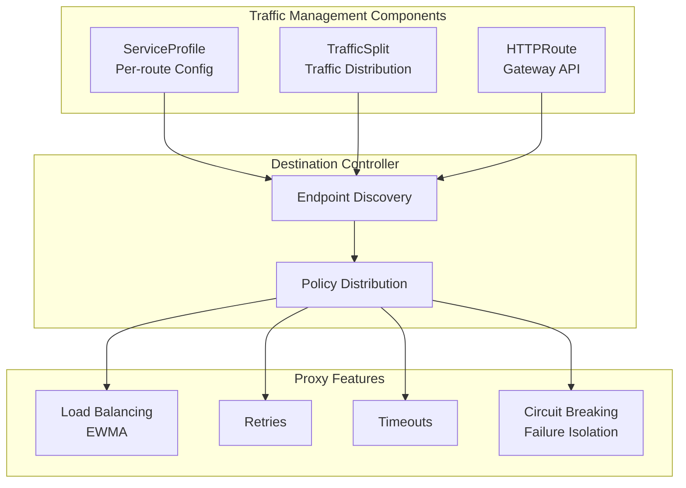
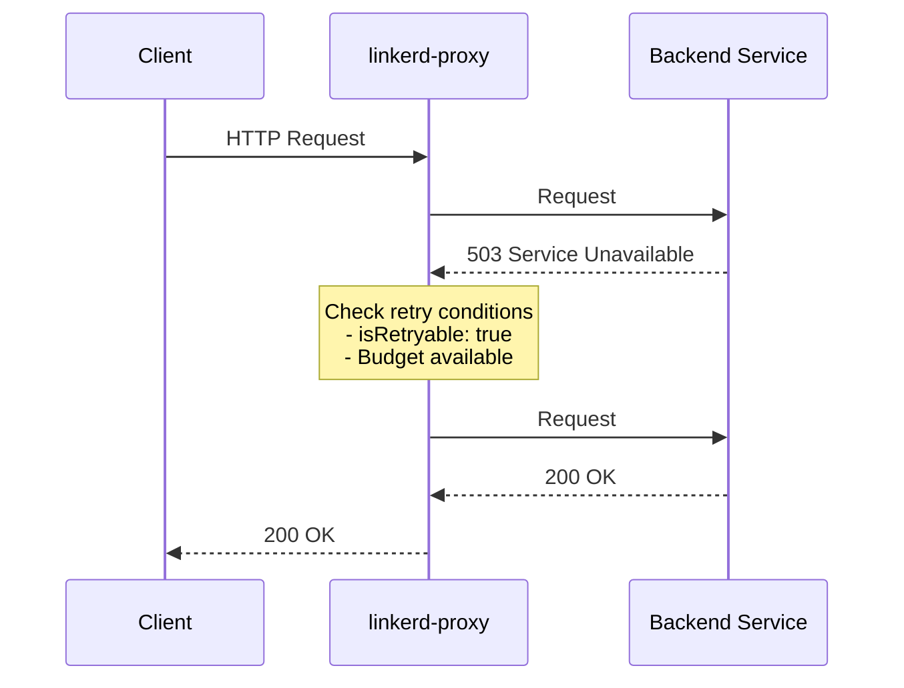
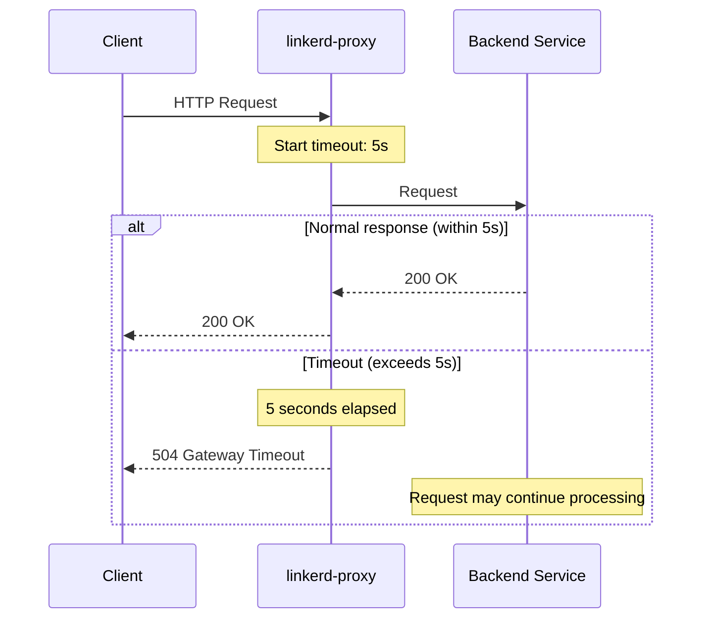
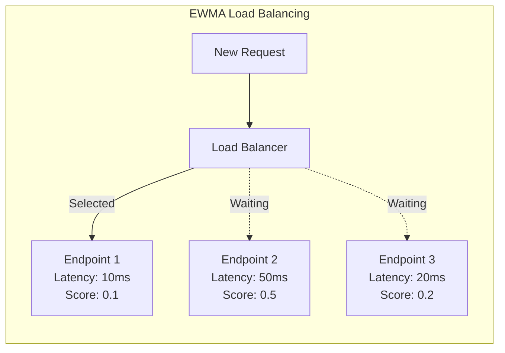
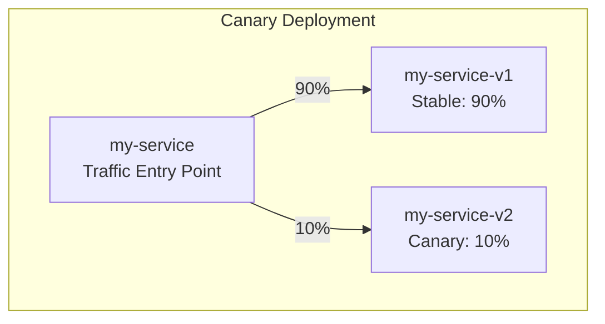
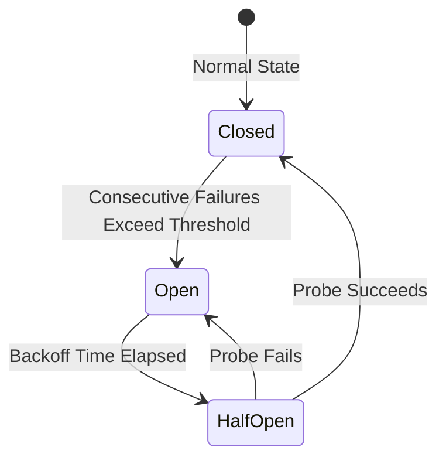
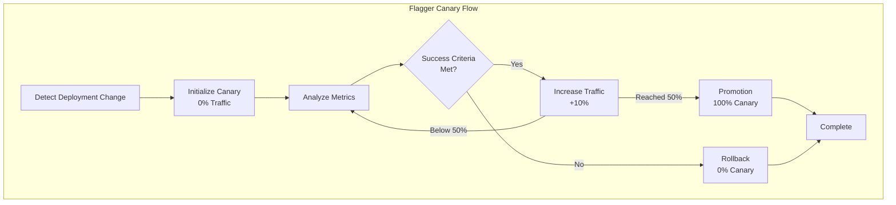

# Linkerd トラフィック管理

> **サポート対象バージョン**: Linkerd 2.16+
> **最終更新**: February 22, 2026

## 概要

Linkerd は、ServiceProfile、TrafficSplit、HTTPRoute などを通じて、サービス間トラフィックをきめ細かく制御できます。このドキュメントでは、リトライ、タイムアウト、トラフィック分割、カナリアデプロイメントを含むトラフィック管理機能について詳しく説明します。

## トラフィック管理アーキテクチャ



## ServiceProfile

ServiceProfile は Linkerd の中核となるトラフィック管理リソースであり、Service ごとのルートを定義し、各ルートのリトライ、タイムアウト、メトリクスを設定します。

### ServiceProfile の構造

```yaml
apiVersion: linkerd.io/v1alpha2
kind: ServiceProfile
metadata:
  name: web-service.my-app.svc.cluster.local
  namespace: my-app
spec:
  # Route definitions
  routes:
  - name: GET /api/users
    condition:
      method: GET
      pathRegex: /api/users(/.*)?
    # This route is retryable
    isRetryable: true
    # Timeout setting
    timeout: 5s

  - name: POST /api/orders
    condition:
      method: POST
      pathRegex: /api/orders
    # POST requests are not retried by default
    isRetryable: false
    timeout: 10s

  - name: GET /health
    condition:
      method: GET
      pathRegex: /health
    isRetryable: true
    timeout: 1s

  # Retry budget (retry ratio relative to total requests)
  retryBudget:
    retryRatio: 0.2          # Max 20% additional requests
    minRetriesPerSecond: 10  # Minimum retries per second
    ttl: 10s                 # Budget reset period
```

### ルート条件

```yaml
# HTTP method and path matching
routes:
- name: user-read
  condition:
    method: GET
    pathRegex: /api/v1/users/[^/]+

- name: user-list
  condition:
    method: GET
    pathRegex: /api/v1/users$

- name: user-create
  condition:
    method: POST
    pathRegex: /api/v1/users

- name: user-update
  condition:
    method: PUT
    pathRegex: /api/v1/users/[^/]+

- name: user-delete
  condition:
    method: DELETE
    pathRegex: /api/v1/users/[^/]+
```

### ServiceProfile の自動生成

```bash
# Generate ServiceProfile from Swagger/OpenAPI
linkerd profile --open-api swagger.yaml web-service.my-app.svc.cluster.local

# Generate ServiceProfile from live traffic (using tap)
linkerd viz profile --tap deploy/web-service -n my-app --tap-duration 60s

# Generate ServiceProfile from protobuf
linkerd profile --proto service.proto web-service.my-app.svc.cluster.local
```

### 詳細な例

```yaml
apiVersion: linkerd.io/v1alpha2
kind: ServiceProfile
metadata:
  name: api-gateway.production.svc.cluster.local
  namespace: production
spec:
  routes:
  # User authentication - requires fast response
  - name: POST /auth/login
    condition:
      method: POST
      pathRegex: /auth/login
    isRetryable: false  # Don't retry auth requests (prevent duplicate logins)
    timeout: 3s

  # User profile retrieval - cacheable, retryable
  - name: GET /users/profile
    condition:
      method: GET
      pathRegex: /users/[^/]+/profile
    isRetryable: true
    timeout: 2s

  # Order creation - not idempotent, risky to retry
  - name: POST /orders
    condition:
      method: POST
      pathRegex: /orders
    isRetryable: false
    timeout: 30s  # Payment processing takes time

  # Order retrieval - safe operation
  - name: GET /orders
    condition:
      method: GET
      pathRegex: /orders(/.*)?
    isRetryable: true
    timeout: 5s

  # Health check - fast response required
  - name: health-check
    condition:
      method: GET
      pathRegex: /(health|ready|live)
    isRetryable: true
    timeout: 500ms

  retryBudget:
    retryRatio: 0.2
    minRetriesPerSecond: 10
    ttl: 10s
```

## リトライ

Linkerd は、一時的な障害を克服するために失敗したリクエストを自動的にリトライします。

### リトライの動作



### リトライ条件

```yaml
# Conditions for retry to occur
# 1. ServiceProfile has isRetryable: true
# 2. Response is a retryable status code
#    - 5xx server errors
#    - Connection failures
#    - Timeouts
# 3. Retry budget has capacity

routes:
- name: GET /api/data
  condition:
    method: GET
    pathRegex: /api/data
  isRetryable: true  # This route is retryable
```

### リトライバジェット

```yaml
# Retry budget configuration
retryBudget:
  # Additional retry ratio relative to original requests
  # 0.2 = max 20 additional retries per 100 requests
  retryRatio: 0.2

  # Minimum retries when traffic is low
  # Enables retries even under low traffic
  minRetriesPerSecond: 10

  # Budget reset period
  ttl: 10s
```

### リトライのモニタリング

```bash
# Check retry metrics
linkerd viz stat deploy/my-service -n my-app

# Check retries per route
linkerd viz routes deploy/my-service -n my-app

# Expected output:
# ROUTE                       SERVICE   SUCCESS   RPS  LATENCY_P50  LATENCY_P95  LATENCY_P99
# GET /api/users              my-app    95.00%   100       10ms         50ms        100ms
# POST /api/orders            my-app    99.50%    50       20ms        100ms        200ms
# [RETRIES]                   my-app     5.00%    10        -            -            -
```

## タイムアウト

タイムアウトでは、指定した時間内に完了しないリクエストを失敗として扱います。

### ルートごとのタイムアウト

```yaml
apiVersion: linkerd.io/v1alpha2
kind: ServiceProfile
metadata:
  name: backend.my-app.svc.cluster.local
  namespace: my-app
spec:
  routes:
  # API requiring fast response
  - name: GET /api/quick
    condition:
      method: GET
      pathRegex: /api/quick
    timeout: 100ms
    isRetryable: true

  # Normal API
  - name: GET /api/normal
    condition:
      method: GET
      pathRegex: /api/normal
    timeout: 5s
    isRetryable: true

  # Slow operations (file processing, etc.)
  - name: POST /api/process
    condition:
      method: POST
      pathRegex: /api/process
    timeout: 60s
    isRetryable: false

  # Streaming (no timeout)
  - name: GET /api/stream
    condition:
      method: GET
      pathRegex: /api/stream
    # No timeout specified = no timeout
```

### タイムアウトの動作



## ロードバランシング

Linkerd は、インテリジェントなロードバランシングのために EWMA（指数加重移動平均）アルゴリズムを使用します。

### EWMA アルゴリズム



**EWMA の特性:**

| 特性 | 説明 |
|----------------|-------------|
| レイテンシベース | より高速な応答時間の Endpoint を優先します |
| リアルタイム適応 | Endpoint の状態変化に素早く適応します |
| 公平な分散 | 新しい Endpoint にトラフィックを受信する機会を与えます |
| 自動回避 | 低速な Endpoint へのトラフィックを自動的に削減します |

### ロードバランシングのモニタリング

```bash
# Check traffic distribution per endpoint
linkerd viz stat deploy/my-service -n my-app --to deploy/backend

# Check per-pod status
linkerd viz stat po -n my-app

# Check real-time request flow
linkerd viz top deploy/my-service -n my-app
```

## TrafficSplit (SMI)

TrafficSplit は、SMI（Service Mesh Interface）標準に準拠したトラフィック分割リソースです。

### 基本構造

```yaml
apiVersion: split.smi-spec.io/v1alpha2
kind: TrafficSplit
metadata:
  name: my-service-split
  namespace: my-app
spec:
  # Service to split traffic
  service: my-service

  # Backend services and weights
  backends:
  - service: my-service-v1
    weight: 90   # 90% traffic
  - service: my-service-v2
    weight: 10   # 10% traffic
```

### カナリアデプロイメント



**段階的カナリアデプロイメント:**

```yaml
# Stage 1: Initial canary (1%)
apiVersion: split.smi-spec.io/v1alpha2
kind: TrafficSplit
metadata:
  name: web-split
  namespace: production
spec:
  service: web
  backends:
  - service: web-stable
    weight: 99
  - service: web-canary
    weight: 1

---
# Stage 2: Expand (10%)
apiVersion: split.smi-spec.io/v1alpha2
kind: TrafficSplit
metadata:
  name: web-split
  namespace: production
spec:
  service: web
  backends:
  - service: web-stable
    weight: 90
  - service: web-canary
    weight: 10

---
# Stage 3: Expand (50%)
apiVersion: split.smi-spec.io/v1alpha2
kind: TrafficSplit
metadata:
  name: web-split
  namespace: production
spec:
  service: web
  backends:
  - service: web-stable
    weight: 50
  - service: web-canary
    weight: 50

---
# Stage 4: Complete (100%)
apiVersion: split.smi-spec.io/v1alpha2
kind: TrafficSplit
metadata:
  name: web-split
  namespace: production
spec:
  service: web
  backends:
  - service: web-stable
    weight: 0
  - service: web-canary
    weight: 100
```

### TrafficSplit Service の設定

```yaml
# Apex service (traffic entry point)
apiVersion: v1
kind: Service
metadata:
  name: web
  namespace: production
spec:
  selector:
    app: web  # Not actually used (TrafficSplit handles routing)
  ports:
  - port: 80
    targetPort: 8080

---
# Stable version service
apiVersion: v1
kind: Service
metadata:
  name: web-stable
  namespace: production
spec:
  selector:
    app: web
    version: stable
  ports:
  - port: 80
    targetPort: 8080

---
# Canary version service
apiVersion: v1
kind: Service
metadata:
  name: web-canary
  namespace: production
spec:
  selector:
    app: web
    version: canary
  ports:
  - port: 80
    targetPort: 8080

---
# Stable Deployment
apiVersion: apps/v1
kind: Deployment
metadata:
  name: web-stable
  namespace: production
spec:
  replicas: 3
  selector:
    matchLabels:
      app: web
      version: stable
  template:
    metadata:
      labels:
        app: web
        version: stable
    spec:
      containers:
      - name: web
        image: myapp:v1.0.0

---
# Canary Deployment
apiVersion: apps/v1
kind: Deployment
metadata:
  name: web-canary
  namespace: production
spec:
  replicas: 1
  selector:
    matchLabels:
      app: web
      version: canary
  template:
    metadata:
      labels:
        app: web
        version: canary
    spec:
      containers:
      - name: web
        image: myapp:v1.1.0
```

### TrafficSplit のモニタリング

```bash
# Check TrafficSplit status
kubectl get trafficsplit -n production

# Traffic statistics per version
linkerd viz stat deploy -n production

# Expected output:
# NAME         MESHED   SUCCESS   RPS  LATENCY_P50  LATENCY_P95
# web-stable   3/3      99.50%   900       10ms         50ms
# web-canary   1/1      98.00%   100       15ms         80ms
```

## HTTPRoute (Gateway API)

Linkerd 2.14+ は Gateway API の HTTPRoute をサポートします。

### HTTPRoute の基本構造

```yaml
apiVersion: gateway.networking.k8s.io/v1beta1
kind: HTTPRoute
metadata:
  name: web-route
  namespace: my-app
spec:
  parentRefs:
  - name: web
    kind: Service
    group: core
    port: 80

  rules:
  # Header-based routing
  - matches:
    - headers:
      - name: x-version
        value: beta
    backendRefs:
    - name: web-beta
      port: 80

  # Default routing
  - backendRefs:
    - name: web-stable
      port: 80
```

### 高度な HTTPRoute 設定

```yaml
apiVersion: gateway.networking.k8s.io/v1beta1
kind: HTTPRoute
metadata:
  name: api-route
  namespace: production
spec:
  parentRefs:
  - name: api-gateway
    kind: Service
    group: core
    port: 80

  rules:
  # Canary: requests with specific header
  - matches:
    - headers:
      - name: x-canary
        value: "true"
    backendRefs:
    - name: api-canary
      port: 80

  # Beta users: cookie-based
  - matches:
    - headers:
      - name: cookie
        value: "beta=true"
    backendRefs:
    - name: api-beta
      port: 80

  # A/B testing: weight-based splitting
  - backendRefs:
    - name: api-v1
      port: 80
      weight: 80
    - name: api-v2
      port: 80
      weight: 20

---
# Path-based routing
apiVersion: gateway.networking.k8s.io/v1beta1
kind: HTTPRoute
metadata:
  name: path-route
  namespace: production
spec:
  parentRefs:
  - name: frontend
    kind: Service
    group: core
    port: 80

  rules:
  # /api/* -> api-service
  - matches:
    - path:
        type: PathPrefix
        value: /api
    backendRefs:
    - name: api-service
      port: 80

  # /static/* -> static-service
  - matches:
    - path:
        type: PathPrefix
        value: /static
    backendRefs:
    - name: static-service
      port: 80

  # Everything else -> web-service
  - backendRefs:
    - name: web-service
      port: 80
```

## サーキットブレーカー（障害分離）

Linkerd は failure accrual を通じてサーキットブレーカーパターンを実装します。

### Failure Accrual の動作



**動作:**

| 状態 | 説明 |
|-------|-------------|
| Closed | 通常動作。すべてのリクエストを転送します |
| Open | Endpoint にリクエストを転送しません |
| Half-Open | 定期的にプローブリクエストを送信します |

### サーキットブレーカーの設定

```yaml
# Currently Linkerd uses automatic failure accrual
# Excludes endpoints temporarily on consecutive failures

# Automatic behavior at proxy level:
# - Exclude endpoint after 5 consecutive connection failures
# - Retry with exponential backoff
# - Return to normal state on success
```

### 障害分離のモニタリング

```bash
# Check endpoint status
linkerd viz stat po -n my-app

# Check failure rate
linkerd viz routes deploy/my-service -n my-app

# Real-time failure monitoring
linkerd viz tap deploy/my-service -n my-app --method GET --path /api
```

## Flagger による自動カナリアデプロイメント

Flagger は Linkerd と統合し、自動カナリアデプロイメントを提供します。

### Flagger のインストール

```bash
# Install Flagger CRDs
kubectl apply -f https://raw.githubusercontent.com/fluxcd/flagger/main/artifacts/flagger/crd.yaml

# Install Flagger (with Linkerd support)
helm repo add flagger https://flagger.app
helm upgrade -i flagger flagger/flagger \
  --namespace linkerd-viz \
  --set meshProvider=linkerd \
  --set metricsServer=http://prometheus.linkerd-viz:9090
```

### Canary リソース定義

```yaml
apiVersion: flagger.app/v1beta1
kind: Canary
metadata:
  name: web
  namespace: production
spec:
  # Target Deployment
  targetRef:
    apiVersion: apps/v1
    kind: Deployment
    name: web

  # Auto-generated service
  service:
    port: 80
    targetPort: 8080

  # Analysis configuration
  analysis:
    # Analysis interval
    interval: 30s
    # Required successful iterations before promotion
    threshold: 5
    # Maximum allowed failures
    maxWeight: 50
    # Weight increment per step
    stepWeight: 10

    # Success criteria
    metrics:
    - name: request-success-rate
      # Requires 99%+ success rate
      thresholdRange:
        min: 99
      interval: 1m

    - name: request-duration
      # p99 latency must be 500ms or less
      thresholdRange:
        max: 500
      interval: 1m

    # Webhooks (additional validation)
    webhooks:
    - name: load-test
      url: http://flagger-loadtester.test/
      timeout: 5s
      metadata:
        type: cmd
        cmd: "hey -z 1m -q 10 -c 2 http://web-canary.production:80/"
```

### Flagger のデプロイフロー



### Flagger メトリクステンプレート

```yaml
apiVersion: flagger.app/v1beta1
kind: MetricTemplate
metadata:
  name: linkerd-success-rate
  namespace: linkerd-viz
spec:
  provider:
    type: prometheus
    address: http://prometheus.linkerd-viz:9090
  query: |
    sum(rate(response_total{
      namespace="{{ namespace }}",
      deployment=~"{{ target }}",
      classification!="failure"
    }[{{ interval }}]))
    /
    sum(rate(response_total{
      namespace="{{ namespace }}",
      deployment=~"{{ target }}"
    }[{{ interval }}]))
    * 100

---
apiVersion: flagger.app/v1beta1
kind: MetricTemplate
metadata:
  name: linkerd-request-duration
  namespace: linkerd-viz
spec:
  provider:
    type: prometheus
    address: http://prometheus.linkerd-viz:9090
  query: |
    histogram_quantile(0.99,
      sum(rate(response_latency_ms_bucket{
        namespace="{{ namespace }}",
        deployment=~"{{ target }}"
      }[{{ interval }}])) by (le)
    )
```

### Flagger のモニタリング

```bash
# Check Canary status
kubectl get canary -n production

# Detailed status
kubectl describe canary web -n production

# Flagger logs
kubectl logs -n linkerd-viz deploy/flagger -f

# Check events
kubectl get events -n production --field-selector involvedObject.kind=Canary
```

## ヘッダーベースルーティング

### デバッグヘッダールーティング

```yaml
apiVersion: gateway.networking.k8s.io/v1beta1
kind: HTTPRoute
metadata:
  name: debug-route
  namespace: my-app
spec:
  parentRefs:
  - name: api-service
    kind: Service
    group: core
    port: 80

  rules:
  # Debug mode
  - matches:
    - headers:
      - name: x-debug
        value: "true"
    backendRefs:
    - name: api-debug
      port: 80

  # Specific user testing
  - matches:
    - headers:
      - name: x-user-id
        value: "test-user-123"
    backendRefs:
    - name: api-test
      port: 80

  # Default
  - backendRefs:
    - name: api-stable
      port: 80
```

## トラフィック管理のベストプラクティス

### 1. ServiceProfile 定義戦略

```yaml
# Define ServiceProfile for all major routes
apiVersion: linkerd.io/v1alpha2
kind: ServiceProfile
metadata:
  name: critical-service.production.svc.cluster.local
  namespace: production
spec:
  routes:
  # Read operations: retryable, short timeout
  - name: read-operations
    condition:
      method: GET
      pathRegex: /api/.*
    isRetryable: true
    timeout: 5s

  # Write operations: not retryable, longer timeout
  - name: write-operations
    condition:
      method: POST|PUT|DELETE
      pathRegex: /api/.*
    isRetryable: false
    timeout: 30s

  # Health checks: very short timeout
  - name: health
    condition:
      method: GET
      pathRegex: /(health|ready|live)
    timeout: 500ms

  retryBudget:
    retryRatio: 0.2
    minRetriesPerSecond: 10
    ttl: 10s
```

### 2. 段階的トラフィック移行

```bash
# Automated canary deployment script
#!/bin/bash

SERVICE="web"
NAMESPACE="production"

# Progressive traffic shift
for weight in 1 5 10 25 50 75 100; do
  echo "Setting canary weight to ${weight}%"

  cat <<EOF | kubectl apply -f -
apiVersion: split.smi-spec.io/v1alpha2
kind: TrafficSplit
metadata:
  name: ${SERVICE}-split
  namespace: ${NAMESPACE}
spec:
  service: ${SERVICE}
  backends:
  - service: ${SERVICE}-stable
    weight: $((100 - weight))
  - service: ${SERVICE}-canary
    weight: ${weight}
EOF

  # Wait for metric collection
  sleep 60

  # Check success rate
  SUCCESS_RATE=$(linkerd viz stat deploy/${SERVICE}-canary -n ${NAMESPACE} -o json | jq '.success_rate')

  if (( $(echo "$SUCCESS_RATE < 0.95" | bc -l) )); then
    echo "Success rate too low: ${SUCCESS_RATE}. Rolling back..."
    # Rollback logic
    break
  fi
done
```

### 3. タイムアウトのチューニング

```yaml
# Timeout guidelines by service type
routes:
# Synchronous API: 1-5 seconds
- name: sync-api
  timeout: 5s

# Asynchronous processing: 30-60 seconds
- name: async-process
  timeout: 60s

# File upload: 5-10 minutes
- name: file-upload
  timeout: 600s

# Streaming: no timeout
- name: streaming
  # No timeout specified
```

## 次のステップ

- [セキュリティ](./04-security.md): mTLS と認可ポリシー
- [可観測性](./05-observability.md): メトリクスとダッシュボード
- [マルチクラスター](./06-multi-cluster.md): クラスター間トラフィック管理

## 参考資料

- [Linkerd トラフィック管理](https://linkerd.io/2/features/traffic-split/)
- [ServiceProfile リファレンス](https://linkerd.io/2/reference/service-profiles/)
- [SMI TrafficSplit 仕様](https://github.com/servicemeshinterface/smi-spec/blob/main/apis/traffic-split/v1alpha2/traffic-split.md)
- [Flagger ドキュメント](https://flagger.app/tutorials/linkerd-progressive-delivery/)
