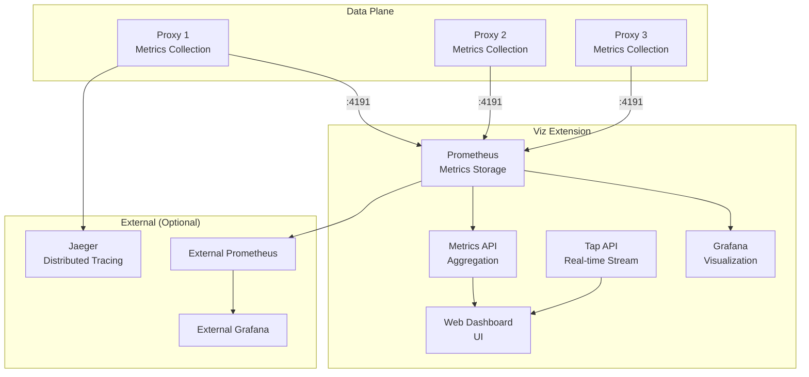
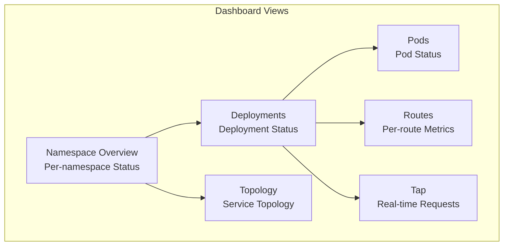
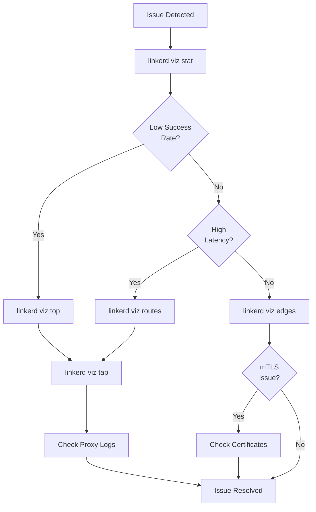

# Linkerd 可観測性

> **サポート対象バージョン**: Linkerd 2.16+
> **最終更新**: February 22, 2026

## 概要

Linkerd は、すぐに利用できる強力な可観測性機能を提供します。インストルメンテーションを行わなくても、ゴールデンシグナル（成功率、リクエストレート、レイテンシー）を自動的に収集し、直感的なダッシュボードと CLI ツールを通じてリアルタイムの Service ヘルスモニタリングを可能にします。

## 可観測性アーキテクチャ



## ゴールデンメトリクス

Linkerd は、Google の 3 つのゴールデンシグナルを自動的に収集します。

### 3 つのコアメトリクス

| メトリクス | 説明 | Prometheus メトリクス |
|--------|-------------|-------------------|
| **成功率** | 成功したリクエスト（2xx/3xx）の割合 | `response_total{classification="success"}` |
| **リクエストレート** | 1 秒あたりのリクエスト数（RPS） | `request_total` |
| **レイテンシー** | リクエスト処理時間の分布（p50、p95、p99） | `response_latency_ms_bucket` |

### メトリクスの確認

```bash
# Basic statistics
linkerd viz stat deploy -n my-app

# Expected output:
# NAME      MESHED   SUCCESS   RPS  LATENCY_P50  LATENCY_P95  LATENCY_P99
# api       2/2      99.50%   100       10ms         50ms        100ms
# web       3/3      98.20%   200       15ms         80ms        200ms
# database  1/1     100.00%    50        5ms         20ms         50ms

# Detailed specific Deployment
linkerd viz stat deploy/web -n my-app --to deploy/api

# Per-Pod statistics
linkerd viz stat po -n my-app

# Per-Namespace statistics
linkerd viz stat ns
```

## Viz ダッシュボード

Viz extension は、Web ベースのダッシュボードを提供します。

### ダッシュボードへのアクセス

```bash
# Open dashboard (auto-launches browser)
linkerd viz dashboard

# Open on specific port
linkerd viz dashboard --port 8084

# Run in background
linkerd viz dashboard &

# Allow external access (caution: security consideration required)
linkerd viz dashboard --address 0.0.0.0
```

### ダッシュボードの機能



**ダッシュボードビュー:**

| ビュー | 説明 |
|------|-------------|
| Namespace | Namespace ごとの Mesh ステータス概要 |
| Deployments | Deployment ごとの成功率、RPS、レイテンシー |
| Pods | Pod ごとの詳細なメトリクス |
| TCP | TCP 接続メトリクス |
| Routes | ServiceProfile Route ごとのメトリクス |
| Topology | Service 間通信の可視化 |
| Tap | リアルタイムのリクエストストリーム |

## CLI ツール

### linkerd viz stat

Service の統計情報を照会します。

```bash
# Basic usage
linkerd viz stat <resource-type> [flags]

# Resource types: deploy, po, ns, svc, rs, job, cronjob, ds, sts

# Deployment statistics
linkerd viz stat deploy -n my-app

# Traffic to specific service only
linkerd viz stat deploy/web -n my-app --to deploy/api

# Traffic from specific service only
linkerd viz stat deploy/api -n my-app --from deploy/web

# Specify time range
linkerd viz stat deploy -n my-app --time-window 10m

# JSON output
linkerd viz stat deploy -n my-app -o json

# Show additional info (proxy version, etc.)
linkerd viz stat deploy -n my-app -o wide
```

### linkerd viz top

最もアクティブなパスをリアルタイムで表示します。

```bash
# Top request paths for Deployment
linkerd viz top deploy/web -n my-app

# Expected output:
# Source                Destination          Method  Path                Count  Best  Worst  Last  Success
# web-7b8f9c-abc12     api-5d6e7f-xyz89      GET    /api/users            150   2ms   50ms   5ms    98.00%
# web-7b8f9c-abc12     api-5d6e7f-xyz89      POST   /api/orders            50   5ms  100ms  10ms    96.00%

# Entire namespace
linkerd viz top ns/my-app

# Show hidden headers
linkerd viz top deploy/web -n my-app --hide-sources=false
```

### linkerd viz tap

リアルタイムのリクエストストリームを表示します。

```bash
# Basic tap
linkerd viz tap deploy/web -n my-app

# Expected output:
# req id=0:0 proxy=out src=10.0.0.1:54321 dst=10.0.0.2:80 tls=true :method=GET :path=/api/users
# rsp id=0:0 proxy=out src=10.0.0.1:54321 dst=10.0.0.2:80 tls=true :status=200 latency=5ms
# end id=0:0 proxy=out src=10.0.0.1:54321 dst=10.0.0.2:80 tls=true duration=5ms response-length=1234B

# Filtering
linkerd viz tap deploy/web -n my-app --method GET --path /api

# Traffic to specific destination
linkerd viz tap deploy/web -n my-app --to deploy/api

# Traffic from specific source
linkerd viz tap deploy/api -n my-app --from deploy/web

# Include HTTP headers
linkerd viz tap deploy/web -n my-app --show-headers

# Limit maximum requests
linkerd viz tap deploy/web -n my-app --max-rps 100

# JSON output
linkerd viz tap deploy/web -n my-app -o json
```

### linkerd viz routes

ServiceProfile Route ごとのメトリクスを確認します。

```bash
# Per-route statistics
linkerd viz routes deploy/api -n my-app

# Expected output:
# ROUTE                          SERVICE   SUCCESS      RPS   LATENCY_P50   LATENCY_P95   LATENCY_P99
# GET /api/users                 api       99.50%    50.0rps         10ms          50ms         100ms
# POST /api/orders               api       98.00%    20.0rps         20ms         100ms         200ms
# GET /health                    api      100.00%     5.0rps          1ms           2ms           5ms
# [DEFAULT]                      api       95.00%    10.0rps         15ms          80ms         150ms

# Routes to specific destination
linkerd viz routes deploy/web -n my-app --to svc/api

# Time range
linkerd viz routes deploy/api -n my-app --time-window 10m
```

### linkerd viz edges

Service 間の接続（エッジ）を確認します。

```bash
# Check edges
linkerd viz edges deploy -n my-app

# Expected output:
# SRC          DST          SRC_NS    DST_NS    SECURED
# web          api          my-app    my-app    √
# api          database     my-app    database  √
# ingress      web          ingress   my-app    √

# Per-Pod edges
linkerd viz edges po -n my-app
```

## Prometheus 統合

### 組み込み Prometheus（Viz に含まれるもの）

Viz extension に含まれる Prometheus を使用します。

```bash
# Access Prometheus
kubectl port-forward -n linkerd-viz svc/prometheus 9090:9090

# Access http://localhost:9090 in browser
```

### 外部 Prometheus 統合

Linkerd メトリクスを既存の Prometheus と統合します。

```yaml
# prometheus-additional-scrape-configs.yaml
- job_name: 'linkerd-controller'
  kubernetes_sd_configs:
  - role: pod
    namespaces:
      names:
      - linkerd
      - linkerd-viz
  relabel_configs:
  - source_labels:
    - __meta_kubernetes_pod_container_port_name
    action: keep
    regex: admin-http
  - source_labels: [__meta_kubernetes_namespace]
    action: replace
    target_label: namespace
  - source_labels: [__meta_kubernetes_pod_name]
    action: replace
    target_label: pod
  - source_labels: [__meta_kubernetes_pod_container_name]
    action: replace
    target_label: container

- job_name: 'linkerd-proxy'
  kubernetes_sd_configs:
  - role: pod
  relabel_configs:
  - source_labels:
    - __meta_kubernetes_pod_container_name
    - __meta_kubernetes_pod_container_port_name
    action: keep
    regex: ^linkerd-proxy;linkerd-admin$
  - source_labels: [__meta_kubernetes_namespace]
    action: replace
    target_label: namespace
  - source_labels: [__meta_kubernetes_pod_name]
    action: replace
    target_label: pod
  - source_labels: [__meta_kubernetes_pod_label_linkerd_io_proxy_deployment]
    action: replace
    target_label: deployment
  - action: labeldrop
    regex: __meta_kubernetes_pod_label_linkerd_io_proxy_job
```

### Prometheus Operator 統合

```yaml
# ServiceMonitor for Linkerd
apiVersion: monitoring.coreos.com/v1
kind: ServiceMonitor
metadata:
  name: linkerd-controller
  namespace: monitoring
spec:
  namespaceSelector:
    matchNames:
    - linkerd
  selector:
    matchLabels:
      linkerd.io/control-plane-component: destination
  endpoints:
  - port: admin-http
    interval: 10s

---
# PodMonitor for Linkerd Proxies
apiVersion: monitoring.coreos.com/v1
kind: PodMonitor
metadata:
  name: linkerd-proxies
  namespace: monitoring
spec:
  namespaceSelector:
    any: true
  selector:
    matchLabels:
      linkerd.io/control-plane-ns: linkerd
  podMetricsEndpoints:
  - port: linkerd-admin
    interval: 10s
    path: /metrics
```

### 主要な Prometheus メトリクス

```promql
# Success rate (5-minute window)
sum(rate(response_total{classification="success"}[5m])) by (deployment)
/
sum(rate(response_total[5m])) by (deployment)

# Request rate (RPS)
sum(rate(request_total[5m])) by (deployment)

# P99 latency
histogram_quantile(0.99,
  sum(rate(response_latency_ms_bucket[5m])) by (le, deployment)
)

# P95 latency
histogram_quantile(0.95,
  sum(rate(response_latency_ms_bucket[5m])) by (le, deployment)
)

# P50 latency
histogram_quantile(0.50,
  sum(rate(response_latency_ms_bucket[5m])) by (le, deployment)
)

# TCP connection count
sum(tcp_open_total) by (deployment)

# Retry ratio
sum(rate(request_total{direction="outbound", tls="true", retry="true"}[5m]))
/
sum(rate(request_total{direction="outbound", tls="true"}[5m]))

# mTLS ratio
sum(rate(response_total{tls="true"}[5m]))
/
sum(rate(response_total[5m]))
```

## Grafana ダッシュボード

### Viz 組み込み Grafana

```bash
# Access Grafana
kubectl port-forward -n linkerd-viz svc/grafana 3000:3000

# Access http://localhost:3000 in browser
```

### 外部 Grafana 統合

```yaml
# Disable Grafana when installing Viz
# viz-values.yaml
grafana:
  enabled: false
```

### 事前構築済みダッシュボード

Linkerd は、複数の Grafana ダッシュボードを提供します。

| ダッシュボード | 説明 |
|-----------|-------------|
| Linkerd Health | Control Plane のステータス |
| Linkerd Top Line | Mesh 全体の概要 |
| Linkerd Deployment | Deployment ごとの詳細 |
| Linkerd Pod | Pod ごとの詳細 |
| Linkerd Service | Service ごとの詳細 |
| Linkerd Route | Route ごとの詳細 |
| Linkerd Authority | Authority ごとの詳細 |
| Linkerd Multicluster | マルチクラスターのステータス |

### カスタムダッシュボードの例

```json
{
  "title": "Linkerd Service Overview",
  "panels": [
    {
      "title": "Success Rate",
      "type": "gauge",
      "targets": [
        {
          "expr": "sum(rate(response_total{classification=\"success\", namespace=\"$namespace\", deployment=\"$deployment\"}[5m])) / sum(rate(response_total{namespace=\"$namespace\", deployment=\"$deployment\"}[5m])) * 100",
          "legendFormat": "Success Rate"
        }
      ]
    },
    {
      "title": "Request Rate",
      "type": "graph",
      "targets": [
        {
          "expr": "sum(rate(request_total{namespace=\"$namespace\", deployment=\"$deployment\"}[5m]))",
          "legendFormat": "RPS"
        }
      ]
    },
    {
      "title": "Latency Distribution",
      "type": "graph",
      "targets": [
        {
          "expr": "histogram_quantile(0.50, sum(rate(response_latency_ms_bucket{namespace=\"$namespace\", deployment=\"$deployment\"}[5m])) by (le))",
          "legendFormat": "p50"
        },
        {
          "expr": "histogram_quantile(0.95, sum(rate(response_latency_ms_bucket{namespace=\"$namespace\", deployment=\"$deployment\"}[5m])) by (le))",
          "legendFormat": "p95"
        },
        {
          "expr": "histogram_quantile(0.99, sum(rate(response_latency_ms_bucket{namespace=\"$namespace\", deployment=\"$deployment\"}[5m])) by (le))",
          "legendFormat": "p99"
        }
      ]
    }
  ]
}
```

## 分散トレーシング（Jaeger）

### Jaeger extension のインストール

```bash
# Install Jaeger extension
linkerd jaeger install | kubectl apply -f -

# Verify installation
linkerd jaeger check

# Open dashboard
linkerd jaeger dashboard
```

### トレーシング設定

```yaml
# Jaeger extension values
# jaeger-values.yaml
collector:
  replicas: 1
  resources:
    cpu:
      request: 100m
      limit: 500m
    memory:
      request: 100Mi
      limit: 500Mi

jaeger:
  replicas: 1
  resources:
    cpu:
      request: 100m
      limit: 500m
    memory:
      request: 100Mi
      limit: 500Mi

# Sampling configuration
webhook:
  collectorSvcAddr: collector.linkerd-jaeger:55678
```

### アプリケーションのトレースヘッダー

分散トレーシングを行うには、アプリケーションがトレースヘッダーを伝播する必要があります。

```yaml
# Headers to propagate
# - x-request-id
# - x-b3-traceid
# - x-b3-spanid
# - x-b3-parentspanid
# - x-b3-sampled
# - x-b3-flags
# - b3
```

```python
# Python Flask example
from flask import Flask, request
import requests

app = Flask(__name__)

# Headers to propagate
TRACE_HEADERS = [
    'x-request-id',
    'x-b3-traceid',
    'x-b3-spanid',
    'x-b3-parentspanid',
    'x-b3-sampled',
    'x-b3-flags',
    'b3'
]

@app.route('/api/data')
def get_data():
    # Extract trace headers
    headers = {h: request.headers.get(h) for h in TRACE_HEADERS if request.headers.get(h)}

    # Propagate headers when calling downstream services
    response = requests.get('http://backend-service/api/backend', headers=headers)
    return response.json()
```

```go
// Go example
package main

import (
    "net/http"
)

var traceHeaders = []string{
    "x-request-id",
    "x-b3-traceid",
    "x-b3-spanid",
    "x-b3-parentspanid",
    "x-b3-sampled",
    "x-b3-flags",
    "b3",
}

func handler(w http.ResponseWriter, r *http.Request) {
    // Create downstream request
    req, _ := http.NewRequest("GET", "http://backend-service/api/backend", nil)

    // Propagate trace headers
    for _, h := range traceHeaders {
        if v := r.Header.Get(h); v != "" {
            req.Header.Set(h, v)
        }
    }

    client := &http.Client{}
    resp, _ := client.Do(req)
    defer resp.Body.Close()
}
```

### 外部 Jaeger 統合

```yaml
# When using external Jaeger
apiVersion: v1
kind: ConfigMap
metadata:
  name: linkerd-jaeger-config
  namespace: linkerd-jaeger
data:
  config.yaml: |
    collector:
      address: jaeger-collector.monitoring:14268
```

## アクセスログ

### Proxy ログ設定

```yaml
# Set log level via Pod annotation
apiVersion: apps/v1
kind: Deployment
metadata:
  name: web
spec:
  template:
    metadata:
      annotations:
        config.linkerd.io/proxy-log-level: "warn,linkerd=info,linkerd_proxy=debug"
        config.linkerd.io/proxy-log-format: "json"
```

### ログレベル

| レベル | 説明 |
|-------|-------------|
| error | エラーのみ |
| warn | 警告以上 |
| info | 情報以上（デフォルト） |
| debug | デバッグ以上 |
| trace | すべてのログ |

### ログの表示

```bash
# Check proxy logs
kubectl logs deploy/web -n my-app -c linkerd-proxy

# Real-time log stream
kubectl logs deploy/web -n my-app -c linkerd-proxy -f

# Filter specific keywords
kubectl logs deploy/web -n my-app -c linkerd-proxy | grep "error"
```

## ServiceProfile メトリクス

ServiceProfile を定義すると、Route ごとのメトリクス収集が可能になります。

### Route ごとのメトリクスを有効化

```yaml
apiVersion: linkerd.io/v1alpha2
kind: ServiceProfile
metadata:
  name: api-service.my-app.svc.cluster.local
  namespace: my-app
spec:
  routes:
  - name: GET /api/users
    condition:
      method: GET
      pathRegex: /api/users
    isRetryable: true

  - name: POST /api/orders
    condition:
      method: POST
      pathRegex: /api/orders
    isRetryable: false

  - name: GET /health
    condition:
      method: GET
      pathRegex: /health
```

### Route メトリクスクエリ

```promql
# Per-route success rate
sum(rate(route_response_total{classification="success"}[5m])) by (rt_route)
/
sum(rate(route_response_total[5m])) by (rt_route)

# Per-route latency
histogram_quantile(0.99,
  sum(rate(route_response_latency_ms_bucket[5m])) by (le, rt_route)
)

# Per-route request rate
sum(rate(route_request_total[5m])) by (rt_route)
```

## モニタリングのベストプラクティス

### アラート設定

```yaml
# Prometheus alert rules
apiVersion: monitoring.coreos.com/v1
kind: PrometheusRule
metadata:
  name: linkerd-alerts
  namespace: monitoring
spec:
  groups:
  - name: linkerd
    rules:
    # Low success rate alert
    - alert: LinkerdHighErrorRate
      expr: |
        (
          sum(rate(response_total{classification="failure"}[5m])) by (deployment, namespace)
          /
          sum(rate(response_total[5m])) by (deployment, namespace)
        ) > 0.05
      for: 5m
      labels:
        severity: critical
      annotations:
        summary: "High error rate detected"
        description: "{{ $labels.deployment }} in {{ $labels.namespace }} has error rate > 5%"

    # High latency alert
    - alert: LinkerdHighLatency
      expr: |
        histogram_quantile(0.99,
          sum(rate(response_latency_ms_bucket[5m])) by (le, deployment, namespace)
        ) > 1000
      for: 5m
      labels:
        severity: warning
      annotations:
        summary: "High latency detected"
        description: "{{ $labels.deployment }} p99 latency > 1s"

    # Proxy not injected alert
    - alert: LinkerdProxyNotInjected
      expr: |
        sum by (namespace) (
          kube_pod_status_phase{phase="Running"}
        ) - sum by (namespace) (
          kube_pod_container_status_running{container="linkerd-proxy"}
        ) > 0
      for: 10m
      labels:
        severity: warning
      annotations:
        summary: "Pods without Linkerd proxy"
        description: "Some pods in {{ $labels.namespace }} are not meshed"
```

### ダッシュボード設定に関する推奨事項

```yaml
# Key monitoring dashboard configuration
1. Overview Dashboard:
   - Overall mesh success rate
   - Total request rate
   - Top error services

2. Per-Service Dashboard:
   - Service success rate trend
   - Request rate trend
   - Latency distribution (p50, p95, p99)
   - Upstream/downstream dependencies

3. Infrastructure Dashboard:
   - Control plane status
   - Proxy resource usage
   - Certificate expiration time
```

### トラブルシューティングのワークフロー



## 次のステップ

- [マルチクラスター](./06-multi-cluster.md): クラスター間の可観測性
- [ベストプラクティス](./07-best-practices.md): 本番環境のモニタリング設定

## 参考資料

- [Linkerd Observability](https://linkerd.io/2/features/dashboard/)
- [Prometheus Integration](https://linkerd.io/2/tasks/exporting-metrics/)
- [Grafana Dashboards](https://linkerd.io/2/tasks/grafana/)
- [Distributed Tracing](https://linkerd.io/2/tasks/distributed-tracing/)
