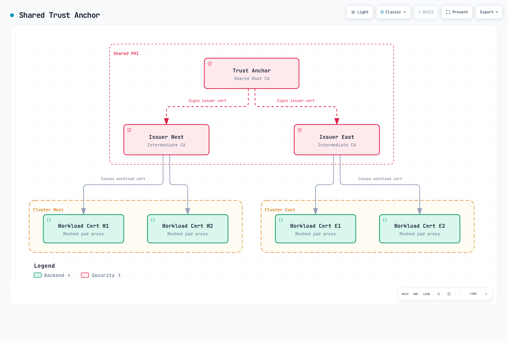

# Linkerdマルチクラスター

> **最終更新**: September 11, 2026 · Linkerd edge-26.9.1 / charts 2026.9.1 · Gateway API 1.5.1

Linkerdは選択サービス情報をクラスター間で複製します。動作するcontrol-plane検出経路と適切なdata-plane経路の両方が必要です。cluster統合、アプリデータ複製、シャドーテスト用の全要求複製はしません。

## 通信モード

| モード | 検出/Service選択 | データ経路とID |
|---|---|---|
| 階層型 | 既定`mirror.linkerd.io/exported=true` | Source client proxy → target Gateway → server。元caller IDはGatewayで失われる |
| フラット / remote discovery | `mirror.linkerd.io/exported=remote-discovery` | cluster間Pod直接接続。元workload IDを保持 |
| Federated Service | `mirror.linkerd.io/federated=member` | フラット網で同名/同namespace Serviceの和集合。メッシュclient必須 |

sourceのmirror controllerは他mirrorでなく**target Kubernetes API**を監視します。mirror Serviceは検出オブジェクトでTLS処理プロセスではありません。通常名は対応namespaceの`<service>-<Link cluster name>`です。


[インタラクティブな図を見る](https://www.atomai.click/kubernetes-docs/archmaps/en-service-mesh-linkerd-06-multi-cluster-2.html)

階層型はsource clientからtarget Gatewayへの到達性が必要です。flat/federatedにはさらにcluster間の直接で曖昧さのないPod IP routingと同じcontrol-plane namespaceが必要です。内部LBやVPC endpoint単体ではflat networkは成立しません。

## 前提条件と共有信頼

明示context `west`/`east`の準備済み2 clusterを使います。local別名でAWS account/Regionの証明ではありません。[導入ガイド](01-installation.md)の互換Kubernetes/Gateway API、Linux worker/CNI、固定CLIを使い、最新Kubernetesを互換性と同一視しません。

両Linkerdは関連issuer chainを信頼する必要があります。共通公開rootが最も単純で、複数適切rootを含む共有bundleも対応します。issuer秘密鍵やworkload証明書は共有不要です。



[インタラクティブな図を見る](https://www.atomai.click/kubernetes-docs/archmaps/en-service-mesh-linkerd-06-multi-cluster-3.html)

**新規の隔離演習専用**として共通rootと別ECDSA P-256 issuerを作ります。root 10年は例でCLI defaultや普遍的推奨ではありません。

```bash
set -euo pipefail
umask 077
# New lab PKI only. The chosen root lifetime is an example, not a default.
step certificate create root.linkerd.cluster.local ca.crt ca.key \
  --profile root-ca --kty EC --curve P-256 \
  --not-after 87600h --no-password --insecure
step certificate create identity.linkerd.cluster.local issuer-west.crt issuer-west.key \
  --profile intermediate-ca --kty EC --curve P-256 \
  --ca ca.crt --ca-key ca.key --not-after 8760h --no-password --insecure
step certificate create identity.linkerd.cluster.local issuer-east.crt issuer-east.key \
  --profile intermediate-ca --kty EC --curve P-256 \
  --ca ca.crt --ca-key ca.key --not-after 8760h --no-password --insecure
cp ca.crt shared-roots.pem
```

`--no-password --insecure`は暗号化なし秘密鍵ファイルを作ります。保護した作業場所に置き、公開trust bundleと各clusterに必要issuerだけ配布します。既存meshは[段階的trust rotation](04-security.md)を使い、新規例のためだけにrootを置換しません。

### 明示contextでcoreを導入

両clusterで導入ガイドのGateway API/CNI前提を完了した後のCLI所有core経路です。Helm所有はその所有者を維持し、reviewしたvaluesでcluster別認証情報を渡します。

互換Linux workerの既定proxy-init経路を示します。Linkerd CNIでは選択導入設定に`cniEnabled:true`も渡します。

```bash
set -euo pipefail
# New CLI-owned installations only; complete Gateway API/CNI prerequisites first.
linkerd --context west install --crds | kubectl --context west apply -f -
linkerd --context west install \
  --identity-trust-anchors-file shared-roots.pem \
  --identity-issuer-certificate-file issuer-west.crt \
  --identity-issuer-key-file issuer-west.key | kubectl --context west apply -f -

linkerd --context east install --crds | kubectl --context east apply -f -
linkerd --context east install \
  --identity-trust-anchors-file shared-roots.pem \
  --identity-issuer-certificate-file issuer-east.crt \
  --identity-issuer-key-file issuer-east.key | kubectl --context east apply -f -
linkerd --context west check
linkerd --context east check
```

通信統計が必要ならVizを別導入します。multicluster自身の確認はアプリ/業務検証ではありません。

## 拡張と方向付きリンク

演習はHelmでmulticluster拡張とpeer controllerを所有します。旧`multicluster link`は非推奨です。`link-gen`でLink/認証Secretを生成し、チャートの`controllers`リストと併用します。

### 基本導入

**AWS Load Balancer Controller導入済みEKS**用に`mc-base-values.yaml`へ保存します。内部TCP NLBを要求し、peer経路、DNS、SG、必要portは設計済みにします。他platformには対応LB設定が必要です。

```yaml
gateway:
  enabled: true
  serviceType: LoadBalancer
  loadBalancerClass: service.k8s.aws/nlb
  serviceAnnotations:
    service.beta.kubernetes.io/aws-load-balancer-scheme: internal
    service.beta.kubernetes.io/aws-load-balancer-nlb-target-type: ip
    service.beta.kubernetes.io/aws-load-balancer-attributes: load_balancing.cross_zone.enabled=true
```

```bash
helm repo add linkerd-edge https://helm.linkerd.io/edge
helm repo update linkerd-edge
# Initially install gateway/remote-access prerequisites, without peer controllers.
helm --kube-context west upgrade --install linkerd-multicluster \
  linkerd-edge/linkerd-multicluster --version 2026.9.1 \
  -n linkerd-multicluster --create-namespace -f mc-base-values.yaml \
  --wait --timeout 10m
helm --kube-context east upgrade --install linkerd-multicluster \
  linkerd-edge/linkerd-multicluster --version 2026.9.1 \
  -n linkerd-multicluster --create-namespace -f mc-base-values.yaml \
  --wait --timeout 10m
kubectl --context west -n linkerd-multicluster get svc linkerd-gateway -o yaml
kubectl --context east -n linkerd-multicluster get svc linkerd-gateway -o yaml
```

gateway型Link生成にはtarget Serviceのingress IP**またはhost名**が必要です。AWS NLBは通常host名で、`link-gen`は受け入れます。データは既定4143、準備probeは4191です。どちらへの到達性もremote APIや全アプリの健全性を証明しません。

### EastからWestを利用

希望controller一覧を`mc-east-links.yaml`として保存します。

```yaml
controllers:
- link:
    ref:
      name: west
```

```bash
set -euo pipefail
umask 077
# Read West's configuration; install the generated credentials/Link into East.
linkerd --context west multicluster link-gen --cluster-name west > west-link.yaml
# Review public metadata and target endpoint without printing credential values.
kubectl --context east apply -f west-link.yaml
helm --kube-context east upgrade linkerd-multicluster \
  linkerd-edge/linkerd-multicluster --version 2026.9.1 \
  -n linkerd-multicluster -f mc-base-values.yaml -f mc-east-links.yaml \
  --wait --timeout 10m
kubectl --context east -n linkerd-multicluster get links.multicluster.linkerd.io
linkerd --context east multicluster check
linkerd --context east multicluster gateways
```

`link-gen`はWest API位置/CAと選択remote-access ServiceAccount tokenを読み、Linkと、`linkerd-multicluster`およびcontrol-planeの`linkerd`向け2 Secretを出します。ネットワーク経路やsource mirror controllerは導入しません。

生成ファイルは認証情報として制限し、commitやログへの内容出力をしません。kubeconfigは自己完結したAPI CAと、到達可能で証明書有効なserver addressを含み、controllerから使える必要があります。workstation endpointが不適なら、実controller到達APIへ対応`--api-server-address`を使います。

Linkは方向付きです。Westで生成しEastへ適用すると**EastがWestを検出**できます。既存導入更新では希望Helm一覧の全peerを保持します。配列を1件例で置換すると他controllerを削除し得ます。

### 任意の逆方向

`mc-west-links.yaml`を保存します。

```yaml
controllers:
- link:
    ref:
      name: east
```

```bash
set -euo pipefail
umask 077
linkerd --context east multicluster link-gen --cluster-name east > east-link.yaml
kubectl --context west apply -f east-link.yaml
helm --kube-context west upgrade linkerd-multicluster \
  linkerd-edge/linkerd-multicluster --version 2026.9.1 \
  -n linkerd-multicluster -f mc-base-values.yaml -f mc-west-links.yaml \
  --wait --timeout 10m
linkerd --context west multicluster check
```

peer別remote-access ServiceAccountは選択的失効に役立ちます。RBACと認証情報更新を調整します。これはKubernetes API認証情報で、mesh workload証明書とは別です。

## Serviceの公開と利用

両clusterにアプリ名前空間を準備します。チャートは既定で欠けたmirror namespaceを作りません。

`mc-namespace.yaml`として保存します。

```yaml
apiVersion: v1
kind: Namespace
metadata:
  name: mc-demo
  annotations:
    linkerd.io/inject: enabled
```

8080で待つ`app:web`のテスト済みメッシュ`web`と、要求確認用の既存メッシュ`client`を使います。このページは版不明`client:latest`を導入せず、部分Deploymentが有効とも主張しません。

この**West** Serviceを`west-web-service.yaml`へ保存します。

```yaml
apiVersion: v1
kind: Service
metadata:
  name: web
  namespace: mc-demo
  labels:
    mirror.linkerd.io/exported: 'true'
spec:
  selector:
    app: web
  ports:
  - name: http
    port: 80
    targetPort: 8080
    appProtocol: http
```

```bash
# Apply the Namespace manifest to both contexts before creating workloads/mirrors.
kubectl --context west apply -f mc-namespace.yaml
kubectl --context east apply -f mc-namespace.yaml
kubectl --context west apply -f west-web-service.yaml
# Alternative for an existing West Service:
kubectl --context west -n mc-demo label service/web mirror.linkerd.io/exported=true --overwrite
kubectl --context east -n mc-demo get service web-west
# Hierarchical mode: current service-mirror still manages legacy Endpoints.
kubectl --context east -n mc-demo get endpoints web-west -o yaml
kubectl --context east -n mc-demo get endpointslices.discovery.k8s.io \
  -l kubernetes.io/service-name=web-west -o yaml
# Existing meshed client with curl installed and the expected app endpoint.
kubectl --context east -n mc-demo exec deployment/client -c client -- \
  curl --fail --show-error --retry 0 --max-time 10 http://web-west.mc-demo.svc.cluster.local/
```

新Serviceはnamespace/workload準備後にマニフェスト適用します。ラベルコマンドは既存Service向け代替です。export labelは検出を選び、アクセス制御境界ではありません。Link selector/RBACが一致するpeerだけに作用します。

選択service-mirrorは階層mirrorに旧`Endpoints`を維持します。存在するEndpointSliceも見ますが、診断コマンド変更でcontrollerが移行すると装わないでください。remote-discoveryではdestinationがremote endpointを照会するため、local Endpointsが意図的にない場合があります。

## 明示的なローカル/リモートルーティング

**East**のlocal web用apex/local backendを`east-web-services.yaml`へ保存します。

```yaml
apiVersion: v1
kind: Service
metadata:
  name: web
  namespace: mc-demo
spec:
  selector:
    app: web
  ports:
  - name: http
    port: 80
    targetPort: 8080
    appProtocol: http
---
apiVersion: v1
kind: Service
metadata:
  name: web-local
  namespace: mc-demo
spec:
  selector:
    app: web
  ports:
  - name: http
    port: 80
    targetPort: 8080
    appProtocol: http
```

`east-web-route.yaml`で適格mesh clientをlocal backendとimport Serviceへ分割します。

```yaml
apiVersion: gateway.networking.k8s.io/v1
kind: HTTPRoute
metadata:
  name: web-cluster-route
  namespace: mc-demo
spec:
  parentRefs:
  - group: ''
    kind: Service
    name: web
    port: 80
  rules:
  - backendRefs:
    - name: web-local
      port: 80
      weight: 80
    - name: web-west
      port: 80
      weight: 20
```

```bash
kubectl --context east apply -f east-web-services.yaml
kubectl --context east apply -f east-web-route.yaml
kubectl --context east -n mc-demo get httproute web-cluster-route -o yaml
linkerd --context east diagnostics policy -n mc-demo service/web 80 -o json
```

core Service group `""`とService port 80を使います。local/remote準備、route受理、実効client policyを確認します。競合ServiceProfileは現送信policyより優先し得ます。[トラフィック管理](03-traffic-management.md)を参照します。

### 手動移行と自動フェイルオーバー

100/0設定は0重みbackendを自動的にactive standbyへ変えません。手動所有routeの明示review済みremote-only状態は次です。

```yaml
apiVersion: gateway.networking.k8s.io/v1
kind: HTTPRoute
metadata:
  name: web-cluster-route
  namespace: mc-demo
spec:
  parentRefs:
  - group: ''
    kind: Service
    name: web
    port: 80
  rules:
  - backendRefs:
    - name: web-local
      port: 80
      weight: 0
    - name: web-west
      port: 80
      weight: 100
```

状態を意図的に適用し、アプリ結果、remote容量、データ整合性を確認してから復旧と扱います。既存要求/書込結果が不明な場合もあり、routing変更はDB複製やcommit済み操作取消をしません。

旧Flagger rollback webhookは未導入/未検証`/failover`を参照し、別名TrafficSplitへpatchしていました。信頼できる地域切り替えは成立していません。Flaggerはtrafficガイドで別に扱います。

SMI TrafficSplitとLinkerd Failover拡張は非推奨です。公式移行先はflat網がある場合のfederated serviceで、全階層網や厳格local-primary要件の自動代替ではありません。


## フラットネットワークとFederated Service

別の**flat専用設定**ではGatewayを省き、`flat-base-values.yaml`へ保存します。

```yaml
gateway:
  enabled: false
```

East peer valuesの`flat-east-links.yaml`もGateway probeを省きます。

```yaml
controllers:
- link:
    ref:
      name: west
  gateway:
    enabled: false
```

同じ基本導入 → Link/Secret → Helm controller順で、これらとLink生成の`--gateway=false`を使います。先に両clusterのPod経路、namespace、信頼を用意します。既存移行では最後の階層consumer移動までGatewayを保持します。

```bash
set -euo pipefail
umask 077
# Separate flat-network setup: both base installs omit the gateway.
# Use flat-base-values.yaml plus the corresponding flat controller values.
linkerd --context west multicluster link-gen --cluster-name west \
  --gateway=false > west-flat-link.yaml
kubectl --context east apply -f west-flat-link.yaml
helm --kube-context east upgrade linkerd-multicluster \
  linkerd-edge/linkerd-multicluster --version 2026.9.1 \
  -n linkerd-multicluster -f flat-base-values.yaml -f flat-east-links.yaml \
  --wait --timeout 10m
kubectl --context west -n mc-demo label service/web \
  mirror.linkerd.io/exported=remote-discovery --overwrite
linkerd --context east diagnostics endpoints web-west.mc-demo.svc.cluster.local:80
```

remote-discoveryはendpoint検索場所を変え、Pod経路、SG、remote APIアクセスは作りません。対応control-plane認証情報はdestination componentからも動く必要があります。

### Federated Serviceのメンバー

同名/同namespace Serviceはfederated Serviceに参加でき、例では通常`web-federated`です。

```bash
# Flat connectivity, matching namespaces and the required directional Links first.
kubectl --context west -n mc-demo label service/web mirror.linkerd.io/federated=member --overwrite
kubectl --context east -n mc-demo label service/web mirror.linkerd.io/federated=member --overwrite
kubectl --context east -n mc-demo get service web-federated
kubectl --context east -n linkerd-multicluster get link west -o yaml
linkerd --context east diagnostics endpoints web-federated.mc-demo.svc.cluster.local:80
```

関連方向Link/controllerがある場所にfederated Serviceが存在します。mesh clientはGatewayなしで検出member endpointへ直接分散します。耐障害性の基盤ですが即時復旧、厳格local-first、アプリ/データ可用性は保証しません。

endpoint準備、failure-accrual、ネットワーク分断、検出鮮度、client再試行意味を確認します。member Serviceが異なるとmetadata/port選択も重要です。競合アノテーションが全部意図通りマージされると想定しないでください。

headless mirroringは別の任意controller機能（設定の`enableHeadlessServices`）です。適切な名前付きhostが必要でendpoint動作が異なり、headlessはfederatedに参加できません。

## クラスター間認可

階層Gatewayは受信mesh接続を認証し、別の送信接続を作ります。最終serverは元remote client IDでGateway経由callerを区別できません。

**flat/federated通信**ではWestの次policyが保持された`client.mc-demo.serviceaccount.identity.linkerd.cluster.local`を許可します。

```yaml
apiVersion: policy.linkerd.io/v1beta3
kind: Server
metadata:
  name: web-http
  namespace: mc-demo
spec:
  podSelector:
    matchLabels:
      app: web
  port: 8080
  proxyProtocol: HTTP/1
  accessPolicy: deny
---
apiVersion: policy.linkerd.io/v1alpha1
kind: AuthorizationPolicy
metadata:
  name: web-from-client
  namespace: mc-demo
spec:
  targetRef:
    group: policy.linkerd.io
    kind: Server
    name: web-http
  requiredAuthenticationRefs:
  - kind: ServiceAccount
    name: client
    namespace: mc-demo
```

APIはServer `v1beta3`とLinkerd AuthorizationPolicyで、存在しないServerAuthorization `v1beta2`ではありません。標準Kubernetes IDはDNS形式で、旧Istio型SPIFFE URIではありません。

同ServiceAccount/namespace/trust-domainの組は複数clusterで同じIDになれます。別issuer鍵でも暗黙の暗号学的cluster IDは加わりません。このpolicyはworkload IDを許し、「Eastのみ」の証明ではありません。必要な別ID/信頼境界を設計し、各強制点で実際に見えるIDを評価します。

Gateway型では最終serverから見えるGateway IDと、Gateway/network境界制御を考慮します。export labelや内部LBは認可を代替しません。

## EKS接続と所有権

基本valuesは**AWS Load Balancer Controller**、`service.k8s.aws/nlb`、IP target、内部NLBを前提とします。非推奨cross-zoneでなく現load-balancer attributesアノテーションを使います。Auto Modeは別owner/classの`eks.amazonaws.com/nlb`で、対応アノテーションを別確認します。

Linkerd TCP/mTLS経路を維持します。ALB HTTP routing/TLS終端は交換可能なGateway転送ではありません。source→Gateway data 4143、mirror controller→Gateway probe 4191、source control plane→target APIを別に考慮し、実routing/SNAT/SG設計でsourceを制限します。

| 接続 | 提供するもの |
|---|---|
| VPC peering / 適切なTGW routing | 経路、アドレス、DNS、security設定時の私設接続 |
| AWS PrivateLink | endpoint経由の選択サービス/リソースアクセス。peeringや任意Pod間自動routingではない |
| EKS private Kubernetes API endpoint | VPC/適切な接続網からそのclusterのKubernetes APIへアクセス |
| EKS interface VPC endpoint | AWS EKS管理APIへのprivateアクセス。Kubernetes API endpointではない |

flatでは非競合で直接到達可能なPodアドレスが必要です。Gatewayだけでは不足します。階層では任意remote Pod routingがなくてもGatewayとremote API到達性を設計します。

review済みインフラ手順でcluster/networkを用意し、対象AWS account/profileと互換版を選びます。2つの`eksctl create cluster`に違う名前を付けても別accountにはなりません。監査ではcluster作成、Gateway作成、実地域間通信はしていません。

AWS管理を行う運用者/controllerにIAMが必要です。生成mirror認証情報はKubernetes ServiceAccount token/RBACで認証し、全runtime Linkに一律cross-account IAMが必須ではありません。信頼関係を分離します。

## 可観測性とFederation

`multicluster gateways`はtarget Gateway probeで、全exportアプリのend-to-end healthではありません。probe metricsはsource mirror controllerに属し、`target_cluster_name`付き`gateway_alive`、`gateway_probe_latency_ms`などです。local Gateway proxyの通常metricsではありません。

中央Prometheus向けの以下は、**Basic認証付きの導入済みprivate HTTPS endpoint用client設定例**です。実DNS、CA/passwordファイル、server認証、到達性、scrape認可を用意します。既定Vizは自動公開しません。

```yaml
scrape_configs:
- job_name: federate-west
  scheme: https
  honor_labels: true
  metrics_path: /federate
  params:
    match[]:
    - '{job=~"linkerd-proxy|linkerd-controller"}'
  static_configs:
  - targets:
    - prometheus-west.internal.example.com:443
  tls_config:
    ca_file: /etc/prometheus/federation/ca.crt
  basic_auth:
    username: federation-reader
    password_file: /etc/prometheus/federation/west/password
  metric_relabel_configs:
  - target_label: origin_cluster
    replacement: west
- job_name: federate-east
  scheme: https
  honor_labels: true
  metrics_path: /federate
  params:
    match[]:
    - '{job=~"linkerd-proxy|linkerd-controller"}'
  static_configs:
  - targets:
    - prometheus-east.internal.example.com:443
  tls_config:
    ca_file: /etc/prometheus/federation/ca.crt
  basic_auth:
    username: federation-reader
    password_file: /etc/prometheus/federation/east/password
  metric_relabel_configs:
  - target_label: origin_cluster
    replacement: east
```

`honor_labels:true`はsource labelを保持します。target relabelだけでは競合exported labelを確実に上書きできません。ここではscrape後にmetric relabelでcollector管理の`origin_cluster`を設定します。集約で保持し重複収集を避けます。

メトリクス起点ごとのbackend成功率:

```promql
(sum by (origin_cluster) (rate(response_total{namespace="mc-demo",deployment="web",direction="inbound",classification="success"}[5m]))
 or on(origin_cluster) (0 * sum by (origin_cluster) (rate(response_total{namespace="mc-demo",deployment="web",direction="inbound"}[5m])))) / sum by (origin_cluster) (rate(response_total{namespace="mc-demo",deployment="web",direction="inbound"}[5m]))
and on(origin_cluster) (sum by (origin_cluster) (rate(response_total{namespace="mc-demo",deployment="web",direction="inbound"}[5m])) > 0)
```

メトリクス起点ごとのclient観測TTFB:

```promql
histogram_quantile(0.99,
  sum by (le, origin_cluster) (rate(response_latency_ms_bucket{namespace="mc-demo",deployment="client",direction="outbound"}[5m]))
)
```

2つ目がその経路を表すにはデモclientが意図remote通信を送る必要があります。アプリ/proxy/network時間を含み、純粋な地域間RTTではありません。`src_cluster`/`dst_cluster`はこの設定で追加される保証がありません。詳細なcluster間次元を作る前に実系列を確認します。

欠けたsuccess系列はclusterごとのtotalに合わせ、idle/欠損totalは100%成功と報告しません。分類、単位、scrape health、dashboard前提は[可観測性ガイド](05-observability.md)を参照します。

## トラブルシューティング

```bash
linkerd --context east multicluster check
linkerd --context east multicluster gateways
kubectl --context east -n linkerd-multicluster get link west -o yaml
kubectl --context east -n linkerd-multicluster logs deployment/controller-west -c controller --tail=100
kubectl --context west -n linkerd-multicluster logs deployment/linkerd-gateway -c linkerd-proxy --tail=100
linkerd --context east viz stat deployment/client -n mc-demo --to service/web-west
linkerd --context west check --proxy
linkerd --context east check --proxy
```

Link statusとcontrollerログでremote API/RBAC/namespace問題を確認します。Gateway問題は**target** Service ingress、probe経路/port、networkを調べます。正常probeはdata portや業務ロジックを検証しません。flatではGateway統計を期待せずdestination診断と直接Pod接続を使います。

実公開trust bundleを読みます。

```bash
set -euo pipefail
# Public bundle data, not private keys or the generated Link kubeconfig.
kubectl --context west -n linkerd get configmap linkerd-identity-trust-roots -o json \
  | jq -er '.data["ca-bundle.crt"] | select(length > 0)' > west-trust.pem
kubectl --context east -n linkerd get configmap linkerd-identity-trust-roots -o json \
  | jq -er '.data["ca-bundle.crt"] | select(length > 0)' > east-trust.pem
openssl crl2pkcs7 -nocrl -certfile west-trust.pem | openssl pkcs7 -print_certs -text -noout
openssl crl2pkcs7 -nocrl -certfile east-trust.pem | openssl pkcs7 -print_certs -text -noout
```

全証明書と期限/issuer chainを調べます。PEM順/形式だけでは同等信頼テストではなく、旧configの短いgrepも完全検証ではありません。変更はsecurityガイドの段階rotationを使います。

## 参考資料と次のステップ

- [ベストプラクティス](07-best-practices.md)、[マルチクラスタークイズ](../../quizzes/service-mesh/linkerd/multi-cluster.md)
- [Multicluster参照](https://linkerd.io/docs/reference/multicluster/)と[導入](https://linkerd.io/docs/tasks/installing-multicluster/)
- [Pod間モード](https://linkerd.io/docs/tasks/pod-to-pod-multicluster/)と[Federated Service](https://linkerd.io/docs/tasks/federated-services/)
- [非推奨failover拡張](https://linkerd.io/docs/tasks/automatic-failover/)
- [リリースlink-gen実装](https://github.com/linkerd/linkerd2/blob/edge-26.9.1/multicluster/cmd/link-gen.go)
- [リリースservice-mirror endpoint処理](https://github.com/linkerd/linkerd2/blob/edge-26.9.1/multicluster/service-mirror/cluster_watcher.go)
- [AWS LB Controllerアノテーション](https://kubernetes-sigs.github.io/aws-load-balancer-controller/latest/guide/service/annotations/)
- [EKS Auto Mode NLB](https://docs.aws.amazon.com/eks/latest/userguide/auto-configure-nlb.html)
- [VPC peering](https://docs.aws.amazon.com/vpc/latest/peering/what-is-vpc-peering.html)と[AWS PrivateLink](https://docs.aws.amazon.com/vpc/latest/privatelink/what-is-privatelink.html)
- [EKS Kubernetes API endpoint](https://docs.aws.amazon.com/eks/latest/userguide/cluster-endpoint.html)と[EKS interface endpoint](https://docs.aws.amazon.com/eks/latest/userguide/vpc-interface-endpoints.html)
