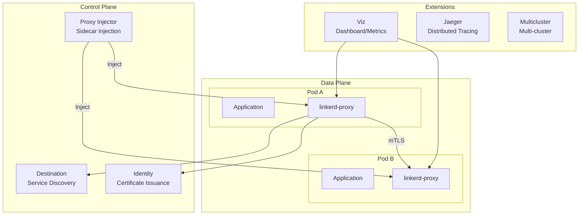

# Linkerd

> **対応バージョン**: Linkerd 2.16+ **最終更新**: August 17, 2026

### 2026年8月アップデート: edge-26.8.2 — Gateway API 1.5.1 サポート

2026年8月14日に公開された edge-26.8.2 リリースでは、Gateway API 1.5.1 のサポート（linkerd-kubert 0.27.0 経由）が追加され、テスト済みの Kubernetes 最大バージョンが 1.36 に引き上げられました。また、宛先コントローラー内の重複する Job informer の削除や、lease watch タスクが停止した場合に policy controller を終了させるなど、安定性に関する修正も含まれています。詳細は[リリースノート](https://github.com/linkerd/linkerd2/releases/tag/edge-26.8.2)を参照してください。

### 2026年7月アップデート: edge-26.7.1 — 未定義の Service ポートへのリクエストを拒否

2026年7月16日に公開された edge-26.7.1 リリースには、**動作を変更する（破壊的な）修正**が含まれています。以前は、対象 Service に対して ServiceProfile が定義されている場合、Service 上で定義されていないポートへのリクエストも許可されていました。現在、destination controller は Service で定義されていないポートに対する `GetProfile` リクエストに空の `DestinationProfile` を返すため、proxy は client policy API にフォールバックします。client policy API は正しく Forbidden filter を返し、接続を拒否します。Service リソースで宣言されていないポートを介して通信する workload がある場合は、アップグレード前にポート定義を整理してください。詳細は[リリースノート](https://github.com/linkerd/linkerd2/releases/tag/edge-26.7.1)を参照してください。

## 概要

Linkerd は CNCF（Cloud Native Computing Foundation）の Graduated プロジェクトであり、軽量な service mesh ソリューションです。2016年に Buoyant によって最初に開発され、「service mesh」という用語を初めて生み出したプロジェクトです。Linkerd の中核的な価値は、シンプルさ、デフォルトでのセキュリティ、最小限のリソースオーバーヘッドにあり、Kubernetes 環境でのサービス間通信を安全かつ信頼性の高いものにします。

### 主な価値提案

| 価値                   | 説明                                                              |
| ----------------------- | ------------------------------------------------------------------------ |
| **シンプルさ**          | 複雑な設定なしでそのまま利用できる、適切なデフォルト設定 |
| **デフォルトでのセキュリティ** | 設定不要の自動 mTLS 暗号化                      |
| **軽量**         | 最小限のリソース使用量（\~10MB メモリ）で Rust により記述されたマイクロ proxy  |
| **高速なパフォーマンス**    | p99 レイテンシーオーバーヘッドは 1ms 未満                                       |
| **運用の容易さ**    | シンプルなアップグレードと直感的なデバッグツール                            |

## Linkerd アーキテクチャの概要



## Service Mesh の比較

Linkerd、Istio、Cilium Service Mesh を比較し、各ソリューションの特性を理解します。

| 機能                | Linkerd               | Istio                  | Cilium Service Mesh     |
| ---------------------- | --------------------- | ---------------------- | ----------------------- |
| **Proxy**              | linkerd2-proxy (Rust) | Envoy (C++)            | eBPF + Envoy (optional) |
| **リソース使用量**     | 非常に低い (\~10MB)     | 高い (\~50-100MB)      | 低い (eBPF モード)         |
| **レイテンシーオーバーヘッド**   | <1ms p99              | 2-5ms p99              | <1ms (eBPF モード)        |
| **複雑さ**         | 低い                   | 高い                   | 中程度                  |
| **mTLS**               | 自動（デフォルト）   | 設定が必要 | 設定が必要  |
| **トラフィック管理** | 基本的 (SMI)           | 非常に充実              | 基本的                   |
| **可観測性**      | 良好（組み込み）       | 優れている              | 良好 (Hubble)           |
| **マルチクラスター**      | Service Mirroring     | 複雑なセットアップ          | ClusterMesh             |
| **CNI 統合**    | 分離              | 分離               | ネイティブ                  |
| **CNCF ステータス**        | Graduated             | Graduated              | Graduated               |
| **学習曲線**     | 緩やか                | 急                     | 中程度                  |
| **コミュニティ**          | 活発                | 非常に活発           | 活発                  |

## Linkerd を選択する場合

### 適したユースケース

1. **シンプルさが重要な場合**
   * 複雑なトラフィック管理機能よりも基本的な service mesh 機能が必要な場合
   * 小規模な運用チーム、または service mesh の経験が限られているチーム
   * 迅速な導入と低い学習曲線が優先される場合
2. **リソース効率が重要な場合**
   * ノードごとに多数の Pod を実行する環境
   * sidecar のオーバーヘッドを最小化する必要がある場合
   * レイテンシーに敏感なアプリケーション
3. **セキュリティをデフォルトにすべき場合**
   * 設定不要の自動 mTLS が必要な場合
   * ゼロトラストネットワークの実装
   * コンプライアンスのための暗号化要件
4. **運用のシンプルさが求められる場合**
   * シンプルなアップグレードプロセスを好む場合
   * 最小限の CRD と設定
   * 直感的な CLI ツール

### あまり適さないユースケース

1. **高度なトラフィック管理が必要な場合**
   * 複雑なルーティングルール、ヘッダー操作
   * 高度な負荷分散アルゴリズム
   * 幅広いプロトコルサポート（gRPC を超えるもの）
2. **VM workload の統合**
   * Kubernetes 外部の workload との統合
   * VM とコンテナが混在する環境
3. **大規模なマルチプロトコル環境**
   * 多様なプロトコルサポート（Kafka、MongoDB など）が必要な場合
   * 複雑な Wasm 拡張要件

## ドキュメント構成

このセクションでは、Linkerd の主な機能と運用方法を扱います。

| ドキュメント                                       | 説明                                                                         |
| ---------------------------------------------- | ----------------------------------------------------------------------------------- |
| [インストールとセットアップ](01-installation.md)   | CLI のインストール、control plane のインストール、HA 設定、拡張機能          |
| [アーキテクチャ](02-architecture.md)             | control plane、data plane、証明書階層の詳細                            |
| [トラフィック管理](03-traffic-management.md) | ServiceProfile、TrafficSplit、リトライ、タイムアウト、canary Deployment                 |
| [セキュリティ](04-security.md)                     | mTLS、認可 policy、証明書管理、外部 CA 統合       |
| [可観測性](05-observability.md)           | Metrics、dashboard、CLI ツール、Prometheus/Grafana 統合、分散トレーシング |
| [マルチクラスター](06-multi-cluster.md)           | Service mirroring、クラスターのリンク、フェイルオーバー                                        |
| [ベストプラクティス](07-best-practices.md)         | 本番チェックリスト、パフォーマンスチューニング、トラブルシューティング                           |

## クイックスタート

### 1. Linkerd CLI をインストール

```bash
# Linux/macOS
curl --proto '=https' --tlsv1.2 -sSfL https://run.linkerd.io/install | sh
export PATH=$HOME/.linkerd2/bin:$PATH

# Verify installation
linkerd version
```

### 2. 事前フライト Cluster 検証

```bash
# Verify cluster meets Linkerd requirements
linkerd check --pre
```

### 3. Linkerd をインストール

```bash
# Install CRDs
linkerd install --crds | kubectl apply -f -

# Install control plane
linkerd install | kubectl apply -f -

# Verify installation
linkerd check
```

### 4. アプリケーションを Mesh に追加

```bash
# Enable automatic injection for namespace
kubectl annotate namespace my-app linkerd.io/inject=enabled

# Restart existing deployments to inject proxy
kubectl rollout restart deployment -n my-app

# Or manually inject
kubectl get deploy -n my-app -o yaml | linkerd inject - | kubectl apply -f -
```

### 5. Dashboard をインストールしてアクセス

```bash
# Install Viz extension
linkerd viz install | kubectl apply -f -

# Open dashboard
linkerd viz dashboard
```

## Linkerd コンポーネントのステータス確認

```bash
# Full status check
linkerd check

# Control plane status
linkerd check --proxy

# Data plane proxy status
linkerd viz stat deploy -n my-app

# Real-time traffic monitoring
linkerd viz tap deploy/my-app -n my-app
```

## コアコンセプト

### Data Plane Proxy

Linkerd は、各 Pod に `linkerd-proxy` という sidecar コンテナを注入します。この proxy は次のとおりです。

* メモリ安全性と高パフォーマンスのために Rust で記述
* 使用メモリは約 \~10MB のみ
* 追加するレイテンシーは 1ms 未満
* すべての受信／送信トラフィックを処理
* mTLS 暗号化を自動適用

### Service Discovery

Destination コンポーネントは Kubernetes Service を監視し、proxy に endpoint 情報を提供します。

* リアルタイムの endpoint 更新
* ServiceProfile ベースのルーティング情報
* traffic split policy の配布

### 自動 mTLS

Linkerd は設定なしで、すべての mesh トラフィックを自動的に暗号化します。

1. Identity コンポーネントが各 proxy に証明書を発行
2. proxy 間での相互 TLS 認証
3. 証明書の自動更新（デフォルトで24時間）

## 次のステップ

1. [**インストールとセットアップ**](01-installation.md): クラスターへの Linkerd インストールに関する詳細ガイド
2. [**アーキテクチャ**](02-architecture.md): Linkerd の内部構造を理解する
3. [**クイズ**](https://github.com/Atom-oh/kubernetes-docs/blob/main/en/quizzes/service-mesh/linkerd/README.md): 理解度を確認する

## 参考資料

* [Linkerd 公式ドキュメント](https://linkerd.io/2/overview/)
* [Linkerd GitHub](https://github.com/linkerd/linkerd2)
* [CNCF Linkerd プロジェクトページ](https://www.cncf.io/projects/linkerd/)
* [Linkerd Slack コミュニティ](https://slack.linkerd.io/)
* [Buoyant ブログ](https://buoyant.io/blog)
