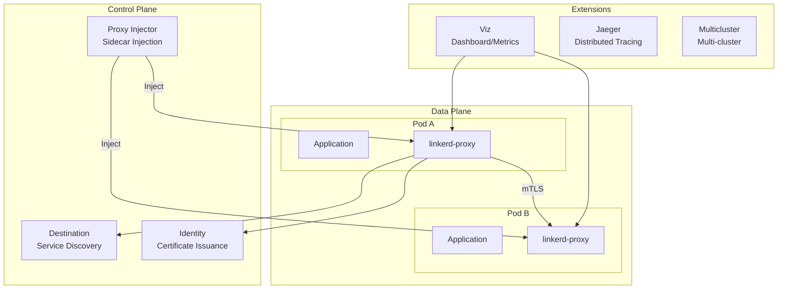

# Linkerd

> **対応バージョン**: Linkerd 2.16+ **最終更新**: February 22, 2026

## 概要

Linkerd は CNCF（Cloud Native Computing Foundation）の Graduated project であり、軽量な service mesh ソリューションです。2016 年に Buoyant によって開発され、「service mesh」という用語を最初に提唱したプロジェクトです。Linkerd の中核となる価値は、シンプルさ、デフォルトでのセキュリティ、最小限のリソースオーバーヘッドであり、Kubernetes 環境におけるサービス間通信を安全かつ信頼性の高いものにします。

### 中核となる価値提案

| 価値                   | 説明                                                              |
| ----------------------- | ------------------------------------------------------------------------ |
| **シンプルさ**          | 複雑な設定なしですぐに利用できる、適切なデフォルト設定 |
| **デフォルトでのセキュリティ** | 設定不要の自動 mTLS 暗号化                      |
| **軽量**         | 最小限のリソース使用量（メモリ約 10MB）で Rust により記述された micro-proxy  |
| **高速なパフォーマンス**    | p99 レイテンシオーバーヘッドは 1ms 未満                                       |
| **運用の容易さ**    | シンプルなアップグレードと直感的なデバッグツール                            |

## Linkerd アーキテクチャ概要



## Service Mesh の比較

Linkerd、Istio、Cilium Service Mesh を比較し、各ソリューションの特性を理解します。

| 機能                | Linkerd               | Istio                  | Cilium Service Mesh     |
| ---------------------- | --------------------- | ---------------------- | ----------------------- |
| **Proxy**              | linkerd2-proxy (Rust) | Envoy (C++)            | eBPF + Envoy (オプション) |
| **リソース使用量**     | 非常に低い（約 10MB）     | 高い（約 50～100MB）      | 低い（eBPF モード）         |
| **レイテンシオーバーヘッド**   | 1ms 未満の p99              | 2～5ms の p99              | 1ms 未満（eBPF モード）        |
| **複雑さ**         | 低い                   | 高い                   | 中程度                  |
| **mTLS**               | 自動（デフォルト）   | 設定が必要 | 設定が必要  |
| **トラフィック管理** | 基本（SMI）           | 非常に豊富              | 基本                   |
| **可観測性**      | 良好（組み込み）       | 優れている              | 良好（Hubble）           |
| **マルチクラスター**      | Service Mirroring     | 複雑なセットアップ          | ClusterMesh             |
| **CNI 統合**    | 個別              | 個別               | ネイティブ                  |
| **CNCF ステータス**        | Graduated             | Graduated              | Graduated               |
| **学習曲線**     | 緩やか                | 急                    | 中程度                  |
| **コミュニティ**          | 活発                | 非常に活発            | 活発                  |

## Linkerd を選択する場合

### 適したユースケース

1. **シンプルさが重要な場合**
   * 複雑なトラフィック管理機能よりも、基本的な service mesh 機能が必要な場合
   * 小規模な運用チーム、または service mesh の経験が限られているチーム
   * 迅速な導入と低い学習コストを優先する場合
2. **リソース効率が重要な場合**
   * ノードあたり多数の Pod を実行する環境
   * sidecar のオーバーヘッドを最小限に抑える必要がある場合
   * レイテンシに敏感なアプリケーション
3. **セキュリティをデフォルトにすべき場合**
   * 設定不要の自動 mTLS が必要な場合
   * ゼロトラストネットワークの実装
   * コンプライアンスのための暗号化要件
4. **運用のシンプルさが必要な場合**
   * シンプルなアップグレードプロセスを優先する場合
   * 最小限の CRD と設定
   * 直感的な CLI ツール

### 適さないユースケース

1. **高度なトラフィック管理が必要な場合**
   * 複雑なルーティングルール、ヘッダー操作
   * 高度なロードバランシングアルゴリズム
   * 広範なプロトコルサポート（gRPC を超えるもの）
2. **VM ワークロードの統合**
   * Kubernetes 外のワークロードとの統合
   * VM とコンテナが混在する環境
3. **大規模なマルチプロトコル環境**
   * 多様なプロトコルサポート（Kafka、MongoDB など）の必要性
   * 複雑な Wasm 拡張要件

## ドキュメント構成

このセクションでは、Linkerd の主要な機能と運用方法を扱います。

| ドキュメント                                       | 説明                                                                         |
| ---------------------------------------------- | ----------------------------------------------------------------------------------- |
| [インストールとセットアップ](01-installation.md)   | CLI のインストール、control plane のインストール、HA 設定、拡張機能          |
| [アーキテクチャ](02-architecture.md)             | control plane、data plane、証明書階層の詳細                            |
| [トラフィック管理](03-traffic-management.md) | ServiceProfile、TrafficSplit、リトライ、タイムアウト、canary Deployment                 |
| [セキュリティ](04-security.md)                     | mTLS、認可ポリシー、証明書管理、外部 CA 統合       |
| [可観測性](05-observability.md)           | メトリクス、dashboard、CLI ツール、Prometheus/Grafana 統合、分散トレーシング |
| [マルチクラスター](06-multi-cluster.md)           | Service mirroring、クラスターリンク、フェイルオーバー                                        |
| [ベストプラクティス](07-best-practices.md)         | 本番環境チェックリスト、パフォーマンスチューニング、トラブルシューティング                           |

## クイックスタート

### 1. Linkerd CLI のインストール

```bash
# Linux/macOS
curl --proto '=https' --tlsv1.2 -sSfL https://run.linkerd.io/install | sh
export PATH=$HOME/.linkerd2/bin:$PATH

# Verify installation
linkerd version
```

### 2. 事前クラスターバリデーション

```bash
# Verify cluster meets Linkerd requirements
linkerd check --pre
```

### 3. Linkerd のインストール

```bash
# Install CRDs
linkerd install --crds | kubectl apply -f -

# Install control plane
linkerd install | kubectl apply -f -

# Verify installation
linkerd check
```

### 4. アプリケーションを Mesh に追加

```bash
# Enable automatic injection for namespace
kubectl annotate namespace my-app linkerd.io/inject=enabled

# Restart existing deployments to inject proxy
kubectl rollout restart deployment -n my-app

# Or manually inject
kubectl get deploy -n my-app -o yaml | linkerd inject - | kubectl apply -f -
```

### 5. Dashboard のインストールとアクセス

```bash
# Install Viz extension
linkerd viz install | kubectl apply -f -

# Open dashboard
linkerd viz dashboard
```

## Linkerd コンポーネントのステータス確認

```bash
# Full status check
linkerd check

# Control plane status
linkerd check --proxy

# Data plane proxy status
linkerd viz stat deploy -n my-app

# Real-time traffic monitoring
linkerd viz tap deploy/my-app -n my-app
```

## コアコンセプト

### Data Plane Proxy

Linkerd は、各 Pod に `linkerd-proxy` という sidecar コンテナを注入します。この proxy には、以下の特長があります。

* メモリ安全性と高いパフォーマンスのために Rust で記述
* 約 10MB のメモリのみを使用
* 1ms 未満のレイテンシを追加
* すべてのインバウンド／アウトバウンドトラフィックを処理
* mTLS 暗号化を自動的に適用

### Service Discovery

Destination コンポーネントは Kubernetes Service を監視し、proxy に endpoint 情報を提供します。

* リアルタイムの endpoint 更新
* ServiceProfile ベースのルーティング情報
* Traffic split ポリシーの配布

### 自動 mTLS

Linkerd は設定なしで、すべての mesh トラフィックを自動的に暗号化します。

1. Identity コンポーネントが各 proxy に証明書を発行
2. proxy 間の Mutual TLS 認証
3. 証明書の自動更新（デフォルトは 24 時間）

## 次のステップ

1. [**インストールとセットアップ**](01-installation.md): クラスターへの Linkerd インストールに関する詳細ガイド
2. [**アーキテクチャ**](02-architecture.md): Linkerd の内部構造を理解する
3. [**クイズ**](https://github.com/Atom-oh/kubernetes-docs/blob/main/en/quizzes/service-mesh/linkerd/README.md): 知識をテストする

## 参考資料

* [Linkerd 公式ドキュメント](https://linkerd.io/2/overview/)
* [Linkerd GitHub](https://github.com/linkerd/linkerd2)
* [CNCF Linkerd プロジェクトページ](https://www.cncf.io/projects/linkerd/)
* [Linkerd Slack コミュニティ](https://slack.linkerd.io/)
* [Buoyant Blog](https://buoyant.io/blog)
