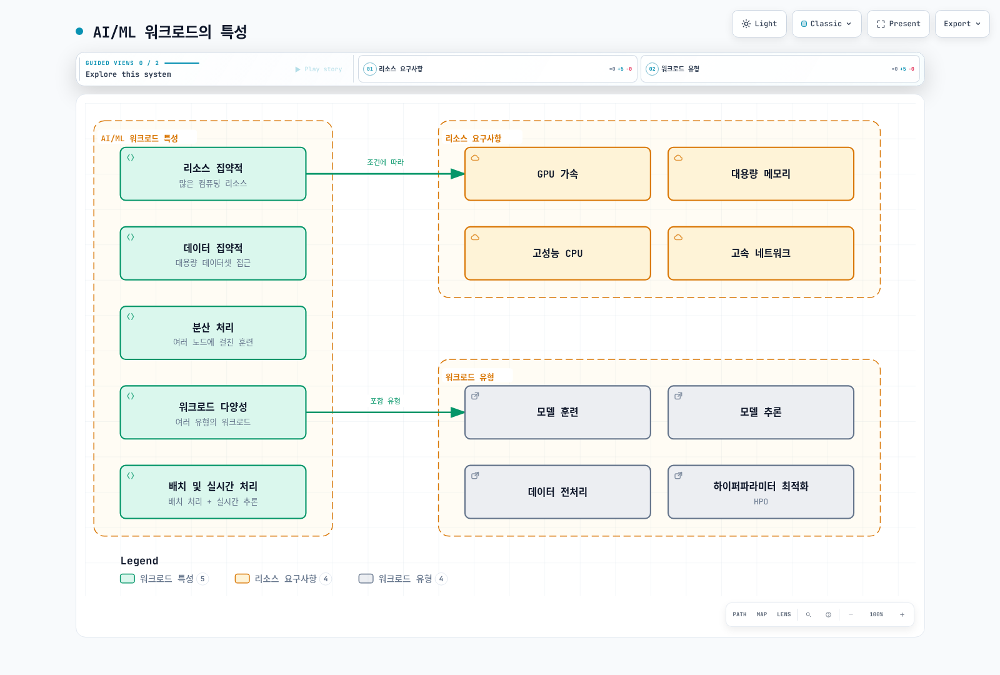
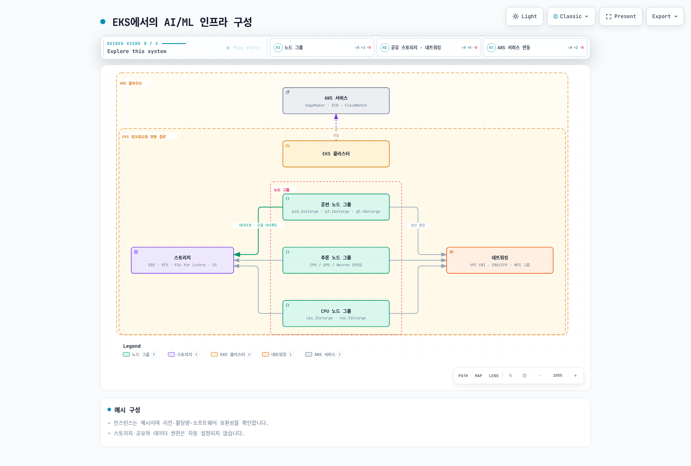
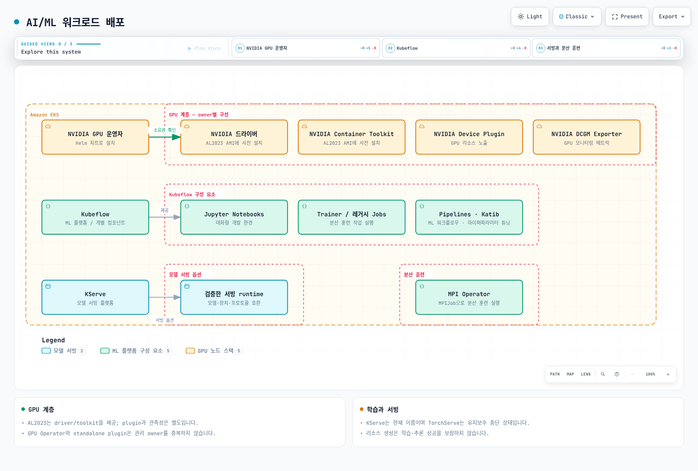
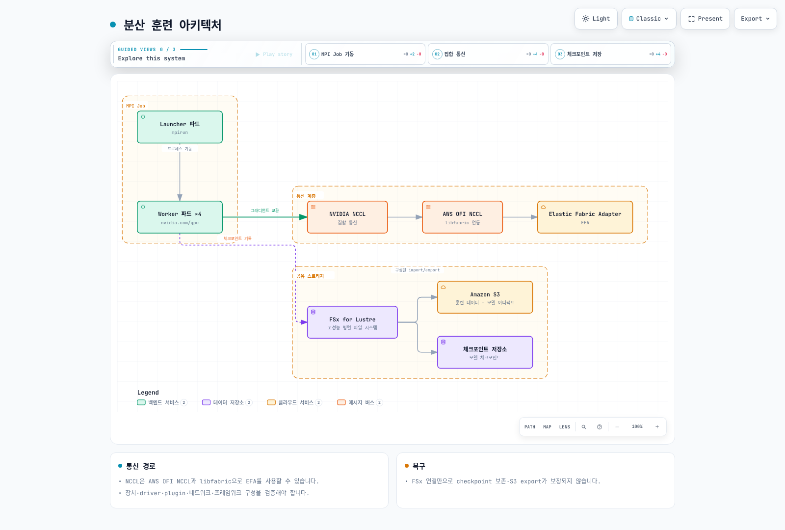
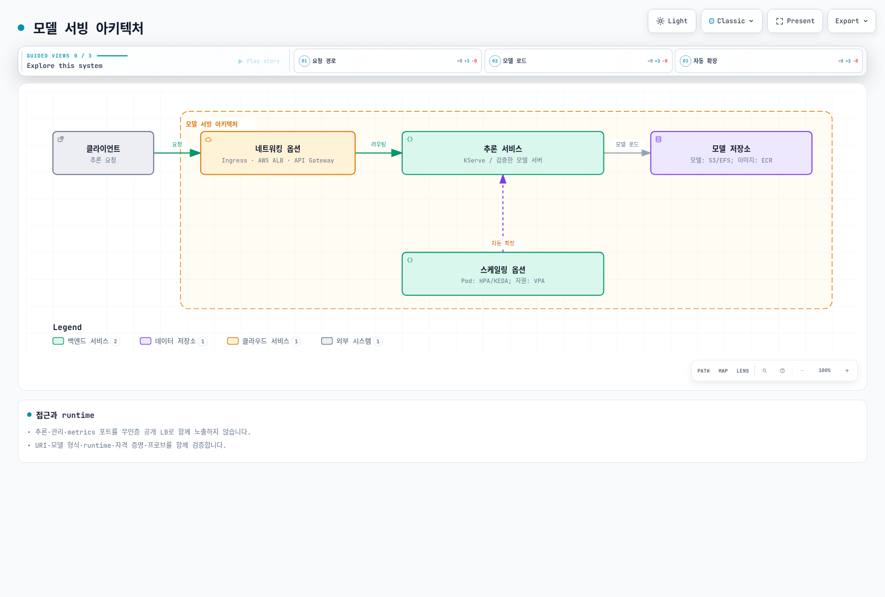
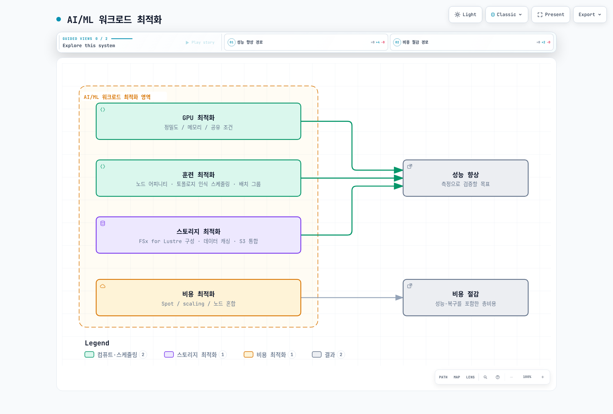
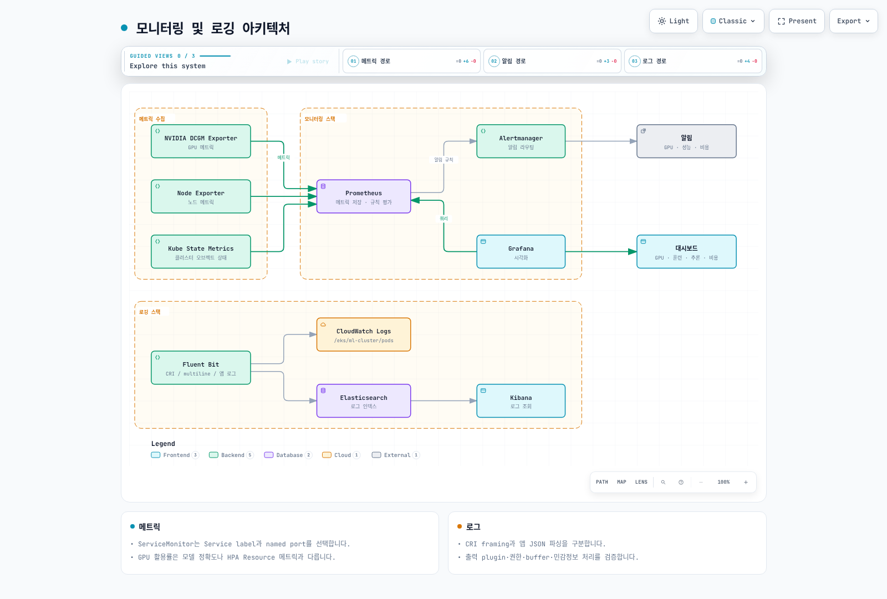

# AI/ML 워크로드

> **검토 기준**: GPU Operator 26.7.0 / NVIDIA device plugin 0.20.0 / FSx CSI 1.10.0
> **마지막 업데이트**: 2026년 9월 12일

Kubernetes는 AI/ML 워크로드를 실행하기 위한 강력한 플랫폼입니다. 이 장에서는 EKS에서 AI/ML 워크로드를 실행하는 방법과 모범 사례를 알아보겠습니다.

## AI/ML 워크로드의 특성

AI/ML 워크로드는 일반적인 애플리케이션 워크로드와 다른 특성을 가지고 있습니다:



[🔍 인터랙티브 다이어그램 보기](https://www.atomai.click/kubernetes-docs/archmaps/ko-ai-ml-01-ai-ml-workloads-0.html)

1. **리소스 집약적**: GPU, 고성능 CPU, 대용량 메모리 등 많은 컴퓨팅 리소스가 필요합니다.
2. **데이터 집약적**: 대용량 데이터셋에 대한 빠른 액세스가 필요합니다.
3. **분산 처리**: 대규모 모델 훈련을 위해 여러 노드에 걸친 분산 처리가 필요합니다.
4. **워크로드 다양성**: 훈련, 추론, 데이터 전처리 등 다양한 유형의 워크로드가 있습니다.

## AI/ML 설계에서 구분할 사항

구체적인 지원 범위는 선택한 프레임워크·이미지·장치·Kubernetes 버전으로 확인해야 합니다:

### 1. 대규모 언어 모델(LLM) 배포

대규모 언어 모델(LLM)은 최근 AI 분야에서 가장 주목받는 기술 중 하나입니다. Kubernetes에서 LLM을 효율적으로 배포하기 위한 주요 고려사항:

- **모델 샤딩**: 대규모 모델을 여러 GPU에 분산하여 로드
- **정밀도 선택**: FP16/BF16 같은 저정밀 연산과 INT8/INT4 양자화를 구분하고 정확도·장치 지원을 검증
- **추론 최적화**: vLLM, TensorRT, ONNX Runtime 등을 사용한 추론 성능 향상
- **스케일링 전략**: 수평적 확장을 통한 처리량 증가

### 2. AI 오케스트레이션 프레임워크

Kubernetes 위에서 AI/ML 워크로드를 관리하기 위한 특화된 오케스트레이션 프레임워크:

- **Kubeflow**: 머신러닝 워크플로우를 위한 종합적인 플랫폼
- **Ray on Kubernetes**: 분산 컴퓨팅 프레임워크
- **KServe**: Knative·Standard 등 모드별 추론 관리
- **Seldon Core**: 모델 서빙 및 모니터링

### 3. GPU 공유 및 최적화

GPU 리소스를 효율적으로 활용하기 위한 기술:

- **MIG (Multi-Instance GPU)**: NVIDIA A100/H100 GPU의 파티셔닝
- **공유 방식**: MPS와 time-slicing은 다른 방식이며 MIG와도 격리·지원 조건이 다름
- **동적 할당**: 필요에 따라 GPU 리소스 동적 할당
- **GPU Operator**: Kubernetes에서 GPU 관리 자동화

### 4. MLOps 및 GitOps 통합

AI/ML 라이프사이클 관리를 위한 DevOps 원칙 적용:

- **모델 버전 관리**: Git과 통합된 모델 버전 관리
- **CI/CD 파이프라인**: 모델 훈련 및 배포 자동화
- **A/B 테스트와 캐너리**: 실험군 비교와 점진적 배포는 목적·지표가 다름
- **모니터링 및 피드백 루프**: 모델 성능 모니터링 및 재훈련

### 5. 벡터 데이터베이스 통합

임베딩 및 시맨틱 검색을 위한 벡터 데이터베이스 통합:

- **Pinecone**: 관리형 벡터 검색
- **Milvus**: 오픈소스 벡터 데이터베이스
- **Faiss**: Facebook AI의 효율적인 유사성 검색 라이브러리
- **OpenSearch**: 벡터 검색 기능이 추가된 검색 엔진

배치 처리와 실시간 추론은 서로 다른 지연·처리량 목표를 가집니다.

## EKS에서의 AI/ML 인프라 구성



[🔍 인터랙티브 다이어그램 보기](https://www.atomai.click/kubernetes-docs/archmaps/ko-ai-ml-01-ai-ml-workloads-1.html)

### 노드 유형 선택

다음은 용량 비교를 위한 예시이며 최신 인스턴스 전체 목록이나 권장 순위가 아닙니다. 리전 가용성, 할당량, CPU 아키텍처, GPU 메모리와 소프트웨어 지원을 함께 확인하세요:

1. **GPU 인스턴스**:
   - p4d.24xlarge: 8x NVIDIA A100 GPU, 320GB GPU 메모리
   - p3.16xlarge: 8x NVIDIA V100 GPU, 128GB GPU 메모리
   - g5.xlarge~g5.48xlarge: NVIDIA A10G GPU, 최대 8개의 GPU
   - g4dn.12xlarge: T4 4개; g4dn.16xlarge: T4 1개 — 인스턴스 크기와 GPU 수가 단조 증가하지 않음

2. **CPU 최적화 인스턴스**:
   - c6i.32xlarge: 128 vCPU, 256GB 메모리
   - c7g.16xlarge: 64 vCPU (AWS Graviton3), 128GB 메모리

3. **메모리 최적화 인스턴스**:
   - r6i.32xlarge: 128 vCPU, 1024GB 메모리
   - x2gd.16xlarge: 64 vCPU, 1024GB 메모리

4. **Inferentia 인스턴스**:
   - inf1.24xlarge: 16 AWS Inferentia 칩, 96 vCPU, 192GB 메모리

5. **Trainium 인스턴스**:
   - trn1.32xlarge: 16 AWS Trainium 칩, 128 vCPU, 512GB 메모리

### 스토리지 구성

AI/ML 워크로드에는 고성능 스토리지가 필요합니다:

1. **Amazon EBS**:
   - gp3: 기본 범용 SSD 스토리지
   - io2: 고성능 SSD 스토리지
   - st1: 처리량 최적화 HDD 스토리지

2. **Amazon EFS**:
   - 여러 노드에서 공유 데이터에 액세스해야 하는 경우 유용
   - 성능 모드: General Purpose 권장; Max I/O는 이전 세대이며 Elastic 처리량과 함께 사용할 수 없음
   - 처리량 모드: Elastic, Provisioned, Bursting — 워크로드와 요금·한도를 비교

3. **Amazon FSx for Lustre**:
   - 고성능 병렬 파일 시스템
   - 대규모 데이터셋에 대한 빠른 액세스 제공
   - S3와의 통합으로 데이터 가져오기 및 내보내기 간소화

4. **Amazon S3**:
   - 대용량 데이터셋 저장
   - 훈련 데이터 및 모델 아티팩트 저장

### 네트워킹 구성

분산 훈련을 위한 네트워킹 구성:

1. **클러스터 배치 그룹**:
   - 노드 간 지연 시간 최소화
   - 동일한 가용 영역 내에 노드 배치

2. **향상된 네트워킹**:
   - Elastic Network Adapter(ENA)
   - ENA Express
   - Elastic Fabric Adapter(EFA)

3. **VPC CNI 구성**:
   - 대규모 포드 배포를 위한 IP 주소 관리
   - 보조 IP 주소 범위 구성

## AI/ML 워크로드 배포



[🔍 인터랙티브 다이어그램 보기](https://www.atomai.click/kubernetes-docs/archmaps/ko-ai-ml-01-ai-ml-workloads-2.html)

### NVIDIA GPU Operator와 장치 할당 {#gpu-allocation}

EKS AL2023 NVIDIA AMI에는 driver와 Container Toolkit이 이미 포함되므로 GPU Operator에서 해당 설치를 꺼야 합니다. 이 AMI에는 device plugin/DRA driver가 포함되지 않으며 별도 구성이 필요합니다. Bottlerocket NVIDIA AMI는 device plugin을 포함합니다. 기존 owner와 중복 설치하지 마세요.

아래는 검토한 Operator 차트를 **로컬 렌더링**하는 명령입니다. 생성한 ClusterPolicy와 RBAC 등을 검토하고 실제 설치 조건을 확인한 뒤 배포하세요.

```bash
# AL2023 NVIDIA AMI profile: host driver/toolkit are already installed.
helm repo add nvidia https://helm.ngc.nvidia.com/nvidia
helm repo update nvidia
helm template gpu-operator nvidia/gpu-operator \
  --version v26.7.0 --namespace gpu-operator \
  --set driver.enabled=false --set toolkit.enabled=false \
  > gpu-operator.rendered.yaml
```

NVIDIA GPU의 확장 리소스 이름은 `nvidia.com/gpu`입니다. 정수 limits를 지정하면 requests가 같은 값으로 설정되며 둘 다 지정할 때는 일치해야 합니다. `0.5`는 유효한 GPU 할당이 아닙니다. 아래 이미지는 CUDA 12.8 계열 예시이고 호스트 driver·아키텍처 호환성과 이미지 digest를 배포 전에 확인해야 합니다. 이번 검토에서 GPU 실행은 하지 않았습니다.

```yaml
apiVersion: v1
kind: Pod
metadata:
  name: gpu-allocation-check
spec:
  restartPolicy: Never
  containers:
    - name: check
      image: nvidia/cuda:12.8.1-base-ubuntu22.04
      command: ["nvidia-smi", "-L"]
      resources:
        requests:
          cpu: "100m"
          memory: 128Mi
        limits:
          memory: 256Mi
          nvidia.com/gpu: 1
```

### Kubeflow와 분산 학습 {#kubeflow-and-distributed-training}

전체 Kubeflow를 master URL 한 줄로 설치하지 말고 [26.03.1 설치 가이드](kubeflow/01-architecture-installation.md)의 리비전·의존성·인증·스토리지 조건을 확인하세요. 현재 서빙 프로젝트 이름은 KServe이며 레거시 KFServing과 혼동하지 마세요.

분산 학습에는 [Trainer](kubeflow/05-training-operator.md), 레거시 TFJob/PyTorchJob, 별도 MPI Operator 등의 경로가 있습니다. MPI Operator의 MPIJob API와 레거시 Training Operator API는 설치한 CRD·버전으로 구분해야 합니다. Job controller가 Pod를 만들고 MPI launcher나 torchrun이 프로세스를 시작합니다.

`torchrun --nnodes=2`에 Pod 하나만 생성하거나 존재하지 않는 Pod DNS를 rendezvous로 지정하면 학습이 시작되지 않습니다. 실제 코드·이미지, worker 수, Service/DNS, rank, backend, 데이터 분할과 checkpoint/timeout/retry를 함께 준비해야 합니다. gang scheduling은 별도 정책·scheduler가 필요합니다.



[🔍 인터랙티브 다이어그램](https://www.atomai.click/kubernetes-docs/archmaps/ko-ai-ml-01-ai-ml-workloads-3.html)

NCCL이 EFA를 사용할 때의 경로는 AWS OFI NCCL plugin → libfabric → EFA입니다. MPI가 프로세스 실행에 쓰일 수 있지만 NCCL이 반드시 MPI 위에서 통신한다는 뜻은 아닙니다. ENA/EFA, GPUDirect, 보안 그룹·AMI·라이브러리 지원을 각각 검증하세요. Multus/SR-IOV 또는 hostPath 장치 마운트만으로 EKS의 EFA·GPUDirect 구성이 완성되지는 않습니다.

### 모델 서빙

[KServe](kubeflow/06-kserve.md)의 Knative/Standard 모드, runtime·모델 형식·URI 접근·프로토콜과 GPU device 설정을 검토하세요. GPU 요청만으로 모델이 GPU 추론을 시작하지는 않습니다. Triton도 모델 repository와 backend 설정, 준비 상태 검증이 필요합니다.

TorchServe는 더 이상 적극적으로 유지보수되지 않고 보안 수정 계획이 없다고 공지되어 있어 신규 기본 경로로 권장하지 않습니다. 추론 포트와 관리·metrics 포트를 같은 공개 LoadBalancer로 내보내는 예제도 사용하지 마세요. 필요한 인증된 ingress 경로와 내부 관리 접근을 구성해야 합니다.



[🔍 인터랙티브 다이어그램](https://www.atomai.click/kubernetes-docs/archmaps/ko-ai-ml-01-ai-ml-workloads-4.html)

## AI/ML 워크로드 최적화



[🔍 인터랙티브 다이어그램 보기](https://www.atomai.click/kubernetes-docs/archmaps/ko-ai-ml-01-ai-ml-workloads-5.html)

### GPU 공유와 메모리

Time-slicing은 여러 워크로드에 같은 GPU 접근을 노출하지만 메모리·장애 격리나 비례 성능을 보장하지 않습니다. MPS는 별도 control daemon을 사용하며 검토한 device plugin 문서는 실험적 지원과 MIG와의 동시 사용 제한을 명시합니다. RuntimeClass와 privileged MPS Pod만으로 전체 노드의 GPU 공유를 구성할 수 없습니다.

아래는 standalone device plugin의 공유 설정 예시입니다. Operator가 plugin을 관리한다면 그 owner의 설정 경로를 사용하세요.

```yaml
# device-plugin-sharing.yaml: NVIDIA device plugin configuration, not a Pod.
version: v1
sharing:
  timeSlicing:
    renameByDefault: true
    failRequestsGreaterThanOne: true
    resources:
      - name: nvidia.com/gpu
        replicas: 2
```

```bash
# Alternative to an operator-owned plugin; do not install a second owner.
helm repo add nvdp https://nvidia.github.io/k8s-device-plugin
helm repo update nvdp
helm template nvdp nvdp/nvidia-device-plugin \
  --version 0.20.0 --namespace nvidia-device-plugin \
  --set config.default=shared \
  --set-file config.map.shared=device-plugin-sharing.yaml \
  > device-plugin.rendered.yaml
```

이 설정은 `nvidia.com/gpu.shared`를 노출하며 Pod는 해당 리소스를 정수 1로 요청합니다. replicas=2는 GPU 메모리 절반을 보장한다는 의미가 아닙니다. 실제 공유 대상 노드·plugin 할당·경합은 GPU 환경에서 따로 검증해야 합니다.

### 배치와 토폴로지 {#placement-and-topology}

zone/region annotation은 Pod 배치를 제어하지 않습니다. 실제 노드 label을 대상으로 nodeSelector/affinity를 설정해야 합니다. Anti-affinity·spread selector와 해당 Pod label도 맞아야 합니다. 아래의 AZ는 실제 환경에 맞춰 바꾸세요. 같은 AZ 배치, 노드 분산, gang admission은 서로 다른 제약입니다.

```yaml
apiVersion: v1
kind: Pod
metadata:
  name: placement-check
  labels:
    app: placement-check
spec:
  restartPolicy: Never
  nodeSelector:
    topology.kubernetes.io/zone: us-west-2a
  affinity:
    podAntiAffinity:
      preferredDuringSchedulingIgnoredDuringExecution:
        - weight: 100
          podAffinityTerm:
            labelSelector:
              matchLabels:
                app: placement-check
            topologyKey: kubernetes.io/hostname
  containers:
    - name: check
      image: python:3.12-slim
      command: ["python", "-c", "print('placement check')"]
      resources:
        requests:
          cpu: "100m"
          memory: 64Mi
        limits:
          cpu: "1"
          memory: 128Mi
```

### 스토리지와 캐싱 {#storage-and-caching}

FSx CSI의 정적 방식은 **이미 존재하는 파일시스템**을 PV/PVC로 연결합니다. 아래의 파일시스템 ID, DNS, mount name, capacity와 namespace를 실제 값으로 바꿔야 합니다. Retain은 파일시스템을 자동 삭제하지 않는다는 뜻이며, 별도 정리 전 비용도 유지됩니다.

```yaml
apiVersion: v1
kind: PersistentVolume
metadata:
  name: ml-fsx-existing
spec:
  capacity:
    storage: 1200Gi
  volumeMode: Filesystem
  accessModes: [ReadWriteMany]
  storageClassName: ""
  persistentVolumeReclaimPolicy: Retain
  mountOptions: [flock]
  csi:
    driver: fsx.csi.aws.com
    volumeHandle: fs-0123456789abcdef0
    volumeAttributes:
      dnsname: fs-0123456789abcdef0.fsx.us-west-2.amazonaws.com
      mountname: replace-with-actual-mount-name
---
apiVersion: v1
kind: PersistentVolumeClaim
metadata:
  name: ml-dataset
  namespace: ml-workloads
spec:
  accessModes: [ReadWriteMany]
  storageClassName: ""
  volumeName: ml-fsx-existing
  resources:
    requests:
      storage: 1200Gi
```

동적 방식은 CSI가 StorageClass와 PVC를 받아 새 파일시스템을 만듭니다. static volumeHandle/dnsname을 StorageClass에 넣거나 존재하지 않는 `fsx.aws.k8s.io/Lustre` 객체를 혼합하지 마세요. [드라이버의 동적 예제](https://github.com/kubernetes-sigs/aws-fsx-csi-driver/tree/v1.10.0/examples/kubernetes/dynamic_provisioning)와 FSx deployment type별 throughput·backup 조건을 확인하세요. SCRATCH_2에 persistent 전용 옵션을 섞어서는 안 됩니다.

Alluxio 같은 캐시는 worker DaemonSet 하나만으로 완성되지 않습니다. master·worker 역할, 저장 경로, 메모리, 네트워크, 일관성·보존 정책을 설계해야 합니다. 벤치마크는 실제 PVC를 마운트한 별도 테스트 경로에서 해야 하며, 마운트 없는 `/data` FIO 예제는 해당 FSx 성능을 측정하지 못합니다.

## 모니터링 및 로깅



[🔍 인터랙티브 다이어그램 보기](https://www.atomai.click/kubernetes-docs/archmaps/ko-ai-ml-01-ai-ml-workloads-6.html)

### Prometheus와 Grafana {#prometheus-and-grafana}

DCGM Exporter는 GPU 메트릭을 제공하며 device plugin의 allocatable 값과는 다릅니다. Operator가 관리하는 exporter와 별도 DaemonSet을 중복 설치하지 마세요. containerd 환경에 Docker socket을 마운트하는 예제는 필요하지 않습니다.

ServiceMonitor는 Pod가 아닌 **Service label과 named port**를 선택합니다. 아래 값은 설치된 exporter Service와 대조해 바꿔야 하며 Prometheus의 ServiceMonitor namespace/label selector도 이 객체를 선택해야 합니다.

```yaml
apiVersion: monitoring.coreos.com/v1
kind: ServiceMonitor
metadata:
  name: gpu-metrics
  namespace: monitoring
spec:
  namespaceSelector:
    matchNames: [gpu-operator]
  selector:
    matchLabels:
      app: nvidia-dcgm-exporter
  endpoints:
    - port: gpu-metrics
      interval: 15s
```

GPU 활용률, memory, 오류와 함께 애플리케이션의 요청 수·실패·latency histogram을 관측하세요. 정확도는 정답 데이터가 있는 평가 경로가 필요하며 replica 수만 늘린다고 개선되지 않습니다. Grafana의 예전 `graph`/flot 패널 JSON 대신 현재 버전의 time series·gauge 형식과 실제 datasource UID를 사용하고 import를 검증하세요.

### 로그 수집

EKS containerd의 CRI 로그와 애플리케이션 JSON은 다른 계층입니다. Fluent Bit의 CRI/multiline parser, 파일 경로·DB 위치·rotation, Kubernetes metadata RBAC를 설정해야 합니다. Elasticsearch/OpenSearch의 제거된 document type이나 존재하지 않는 parser 이름을 그대로 복사하지 마세요. CloudWatch 등 출력은 해당 이미지의 plugin과 workload IAM·네트워크가 필요합니다. 모델 입력·출력의 민감정보와 무제한 재시도 버퍼도 관리하세요. [관측성 가이드](../observability/README.md)에서 선택한 수집 경로를 검토하세요.

## 비용 최적화

### Spot과 노드 공급 {#spot-and-node-provisioning}

Spot에는 interruption과 용량 부족이 있으므로 외부 checkpoint·재시도·중복 실행 방지·복구 시간을 검증해야 합니다. [Karpenter 가이드](../autoscaling/02-karpenter.md)의 현재 NodePool/EC2NodeClass 설정을 사용하고 이미지·AMI 리비전, taint/toleration, NodePool limits와 interruption 처리를 확인하세요. CPU·GPU NodeGroup 혼합은 EKS Hybrid Nodes라는 제품 기능과 다릅니다.

### HPA와 메트릭 {#hpa-and-metrics}

HPA의 Resource 메트릭 경로는 metrics-server가 제공하는 CPU·메모리에 사용합니다. nvidia.com/gpu 할당량을 GPU 사용률 Resource 메트릭으로 간주하지 마세요. GPU나 요청 신호는 DCGM/애플리케이션 exporter와 custom/external metrics adapter가 필요합니다.

아래는 adapter가 **namespace/Pod별로 제공하는** RPS 메트릭을 사용하는 HPA 예시입니다. 대상 Deployment와 adapter는 별도로 설치해야 하며 100 RPS는 측정으로 조정할 예시 목표입니다. 여러 HPA나 KEDA가 같은 대상 replica를 동시에 관리하지 않도록 하나의 owner를 정하세요.

```yaml
apiVersion: autoscaling/v2
kind: HorizontalPodAutoscaler
metadata:
  name: inference-hpa
  namespace: ml-workloads
spec:
  scaleTargetRef:
    apiVersion: apps/v1
    kind: Deployment
    name: inference-service
  minReplicas: 1
  maxReplicas: 10
  metrics:
    - type: Pods
      pods:
        metric:
          name: inference_requests_per_second
        target:
          type: AverageValue
          averageValue: "100"
```

평균·합계의 label grouping이 잘못되면 adapter가 Pod별 값을 반환하지 못합니다. histogram percentile이나 모델 정확도가 항상 HPA의 비례 제어에 적합한 것도 아닙니다. 요청량·큐·latency·사용률과 실제 처리량을 함께 측정하세요. 노드 종료 전에는 Pod가 줄어도 EC2 과금이 남을 수 있고 시간대가 다르다는 이유만으로 On-Demand 단가가 낮아지지는 않습니다.

### 데이터와 모델 접근 {#data-and-model-access}

Kubernetes RBAC는 API 접근이고 S3·KMS 권한은 workload IAM입니다. 모델 파일을 대형 Kubernetes Secret에 저장하거나 복호화 키를 환경 변수로 주입하는 예제 대신 오브젝트 스토리지·암호화·파일 기반 자격 증명을 사용하세요. Secret base64는 암호화가 아닙니다. NetworkPolicy의 namespaceSelector와 podSelector를 같은 peer에 넣으면 AND, 별도 항목이면 OR이며 DNS·저장소·metrics의 실제 통신 방향도 허용해야 합니다.

## 검증과 참고 자료

이 장은 공식 GPU Operator·device plugin Helm 차트 렌더링과 매니페스트·설정 검토를 기준으로 수정했습니다. 실제 GPU, FSx 생성·마운트, 분산 학습, 추론·autoscaling을 실행한 검증은 아닙니다. 개별 컴포넌트의 버전·노드 조건을 맞추고 환경에서 확인해야 합니다.

- [EKS accelerated AMIs](https://docs.aws.amazon.com/eks/latest/userguide/ml-eks-optimized-ami.html)
- [Kubernetes GPU scheduling](https://kubernetes.io/docs/tasks/manage-gpus/scheduling-gpus/)
- [NVIDIA device plugin 0.20.0](https://github.com/NVIDIA/k8s-device-plugin/tree/v0.20.0)
- [FSx CSI 1.10.0](https://github.com/kubernetes-sigs/aws-fsx-csi-driver/tree/v1.10.0)
- [EFS performance modes](https://docs.aws.amazon.com/efs/latest/ug/performance.html)
- [Kubernetes HPA](https://kubernetes.io/docs/tasks/run-application/horizontal-pod-autoscale/)

## 퀴즈

이 장에서 배운 내용을 테스트하려면 [주제 퀴즈](../quizzes/ai-ml/03-ai-ml-workloads-quiz.md)를 풀어보세요.
