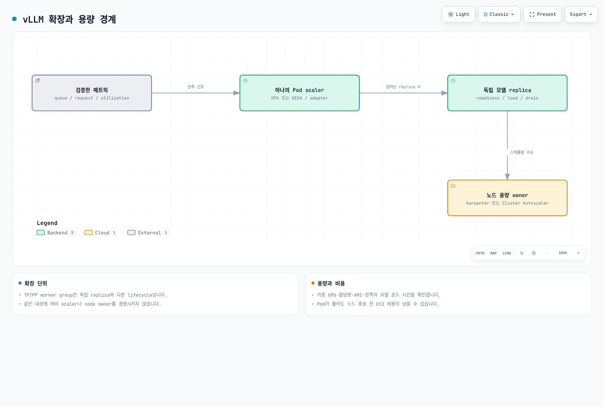

# vLLM 배포 및 최적화

> **검토 기준**: vLLM 0.29.0; CUDA 12.9 이미지 변형; 과거 0.6.4.post1 벤치마크 별도 표기
> **마지막 업데이트**: 2026년 9월 12일

vLLM은 생성형 모델과 지원되는 멀티모달·pooling 모델을 서빙하는 오픈소스 추론 엔진입니다. `Vector Language Model`이라는 풀네임을 사용하지 않습니다. 이 장은 특정 릴리스의 구성과 EKS 운영 경계를 검토하며, 성능 배수나 지원 여부를 모든 모델에 일반화하지 않습니다.

## 실습 환경 설정

2026년 9월 9일 공개된 [v0.29.0 릴리스](https://github.com/vllm-project/vllm/releases/tag/v0.29.0)를 기준으로 합니다. 릴리스의 기본 PyPI/Docker 경로는 CUDA 13.0이고 별도 `v0.29.0-cu129` 이미지가 있습니다. 같은 태그의 일부 설치 문서는 아직 CUDA 12.9를 기본값으로 설명하므로 실제 이미지 변형·digest를 확인해야 합니다.

PyPI 패키지 조건은 Python >=3.10, <3.15이지만 태그의 GPU 설치 가이드는 3.10–3.13을 안내합니다. 이것을 모든 Python·PyTorch·CUDA 조합의 호환성 보장으로 해석하지 마세요. NVIDIA 경로의 최소 compute capability는 7.5이며 V100 (7.0)을 현재 지원 예시로 사용해서는 안 됩니다. 선택한 kernel·dtype·양자화 방식은 더 높은 장치 조건을 요구할 수 있습니다.

GPU node는 [AI/ML 장치 가이드](01-ai-ml-workloads.md)의 AMI·driver·device plugin 조건을 따르세요. 일반 CUDA 이미지를 Trainium/Inferentia에 그대로 실행하는 경로는 아니며 Neuron 등 별도 plugin/runtime의 지원을 검증해야 합니다. GPU·RAM·디스크는 모델과 cache·동시성에 맞게 산정하며 `g5.2xlarge`, 50GB 디스크 같은 단일 최소값으로 보장할 수 없습니다.

## vLLM 소개

vLLM은 다음과 같은 특징을 가진 LLM 추론 엔진입니다:


[🔍 인터랙티브 다이어그램 보기](https://www.atomai.click/kubernetes-docs/archmaps/ko-ai-ml-02-vllm-deployment-0.html)

### 기능과 지원 범위

| 기능 | 의미와 조건 |
| --- | --- |
| PagedAttention / KV cache | token block을 관리해 낭비를 줄임. 실제 커널·cache 형식은 모델/backend에 따라 다름 |
| Continuous batching | scheduler step마다 처리할 요청을 조정. 도착 즉시 처리·대기 없음·고정 성능 배수를 보장하지 않음 |
| TP / PP / DP / EP | tensor·pipeline·data·expert parallelism은 다른 축. 모델·통신·backend 호환성을 확인 |
| 정밀도·양자화 | FP16/BF16 dtype과 FP8/INT8/INT4·AWQ 등 형식을 구분. 가중치와 KV cache 양자화도 별도 |
| Prefix caching / chunked prefill | 지원 모델의 기본값과 CLI override를 확인. 응답 전체 캐시나 모델 정확도 개선 기능이 아님 |
| Structured outputs | `response_format` 또는 `structured_outputs`로 형식을 제한. 사실성·업무 유효성은 별도 검증 |
| Tool calling | 모델·chat template·parser와 client 실행 루프가 필요. 서버가 도구를 자동 실행하지 않음 |
| LoRA | 모델이 지원해야 하며 adapter를 등록해야 함. 요청의 model 이름만 바꿔 자동 로딩되는 것은 아님 |

0.29.0은 Model Runner V2를 기본 runner로 전환했지만 이 명칭은 OpenAI 호환 API 버전이나 별도 “vLLM Engine V2”라는 뜻이 아닙니다. 모델 계열 이름만으로 모든 크기·양자화·비전 변형을 지원한다고 판단하지 말고 해당 model architecture와 artifact·tokenizer·chat template·kernel을 확인하세요.

### 현재 CLI에서의 기능 설정

`python -m vllm.entrypoints.openai.api_server` 대신 `vllm serve`를 사용합니다. speculative decoding의 이전 `--speculative-model`·`--num-speculative-tokens` 조합은 현재 CLI에서 `--speculative-config`로 바뀌었습니다.

```bash
# 별도 target/draft 모델과 메모리·tokenizer 호환성이 준비된 경우의 형식
vllm serve /models/target \
  --speculative-config '{"model":"/models/draft","method":"draft_model","num_speculative_tokens":5}'
```

이는 형식 예제이며 이 경로에 모델을 준비하거나 가속률을 검증한 명령이 아닙니다. Draft의 수락률·추가 메모리·통신 비용 때문에 속도가 개선되지 않을 수도 있습니다.

LoRA를 시작 시 제공하려면 `--enable-lora --lora-modules adapter=/models/adapter`처럼 등록합니다. 동적 load/unload는 `VLLM_ALLOW_RUNTIME_LORA_UPDATING`의 별도 opt-in이며 운영자 제어 경로로 제한해야 합니다. `--enable-auto-tool-choice`에는 모델에 맞는 `--tool-call-parser`가 필요합니다. 멀티모달 URL은 SSRF·다운로드/디코드 크기 제한과 허용 도메인도 검토하세요.

## 시스템 요구 사항

vLLM을 EKS에 배포하기 위한 시스템 요구 사항은 다음과 같습니다:


[🔍 인터랙티브 다이어그램 보기](https://www.atomai.click/kubernetes-docs/archmaps/ko-ai-ml-02-vllm-deployment-1.html)

가중치 메모리의 출발점은 `파라미터 수 × 저장 바이트`입니다. 70B의 FP16/BF16 가중치만 약 140GB이므로 “70B는 GPU80GB면 된다”는 일반 기준은 맞지 않습니다. 여기에 KV cache, activation, CUDA graph·workspace·통신 버퍼를 더해야 하며 양자화 metadata와 일부 복제 텐서도 고려해야 합니다.

일반적인 dense attention의 전체 KV cache 근사는 다음과 같습니다. GQA/MQA의 KV head 수를 써야 하며 hidden size를 그대로 대입하는 MHA 식과 다릅니다.

```text
KV bytes ≈ 2 × layers × KV_heads × head_dim × cached_tokens × bytes_per_element
```

cached_tokens는 동시에 보존하는 요청들의 token 합입니다. TP sharding/복제, sliding window, MLA나 hybrid 모델은 별도로 계산해야 합니다. Qwen2.5-7B의 현재 config는 layers28, KV heads4, head dim128입니다. bf16/FP16 기준 token당 약56KiB이며, 4096token 요청 하나면 약224MiB의 전체 KV cache 근사값입니다. 이것을 GPU별 실측치나 전체 모델 메모리로 해석하면 안 됩니다.

p4d.24xlarge의 A100은40GB이며80GB A100은 p4de 계열과 구분해야 합니다. p5·g6·g6e 등의 선택은 현재 리전 용량·driver·모델 요구와 비교하세요. CPU core/GPU4개 또는 RAM=가중치2배 같은 고정 비율은 실제 측정 대신 사용할 수 없습니다.

## EKS 인프라 구성


[🔍 인터랙티브 다이어그램 보기](https://www.atomai.click/kubernetes-docs/archmaps/ko-ai-ml-02-vllm-deployment-2.html)

## 스토리지와 모델 준비

FSx for Lustre는 선택지이며 모든 vLLM 배포의 최적·필수 저장소는 아닙니다. 로컬 NVMe/EBS, 재사용 cache, 오브젝트 저장소와 공유 파일시스템을 모델 로드 시간·비용·동시 접근으로 비교하세요. emptyDir는 컨테이너 재시작에는 남을 수 있지만 Pod 제거·재생성에는 보존되지 않습니다.

[FSx 정적 PV/PVC와 동적 방식](01-ai-ml-workloads.md#storage-and-caching)을 구분하세요. Hugging Face의 snapshot_download는 Hugging Face에서 받는 동작이며 S3 다운로드가 아닙니다. 저장소 revision과 파일 무결성, 라이선스·접근 권한을 기록해야 합니다. 접근 token이 필요한 경우 파일로 마운트하고 token 파일을 읽는 download 전용 단계를 사용하세요. 실행 가능한 remote code를 신뢰하는 옵션은 기본으로 켜지 마세요.

아래 예제는 token이 필요 없는 공개 Qwen3-0.6B의 확인한 revision을 사용합니다. 캐시는 Pod의 emptyDir이므로 재생성 시 다시 다운로드합니다. 다중 노드는 모든 worker에서 같은 model revision/path를 사용해야 합니다.

## vLLM 배포

### 배포 아키텍처

다음 다이어그램은 EKS에서 vLLM을 배포하는 두 가지 주요 아키텍처를 보여줍니다:


[🔍 인터랙티브 다이어그램 보기](https://www.atomai.click/kubernetes-docs/archmaps/ko-ai-ml-02-vllm-deployment-3.html)

### 단일 GPU 구성 예제

다음은 **GPU 실행 전 검토용 템플릿**입니다. namespace와 GPU driver/plugin은 미리 준비해야 합니다. 이미지 digest는 v0.29.0-cu129의 amd64 artifact, model revision은 확인한 Qwen3-0.6B snapshot입니다. 이미지 pull·non-root 실행·커널 컴파일·모델 추론은 이번 검토에서 실행하지 않았으므로 환경에서 확인해야 합니다.

Recreate 전략은 제한된 GPU에서 중복 replica를 요구하지 않지만 업데이트 중 중단이 있습니다. startupProbe는 최대 약 15분의 시작 시간을 허용하고, readiness는 준비 상태만 확인하며 SLA를 보장하지 않습니다. 서비스는 ClusterIP이며 공개 ingress를 만들지 않습니다.

```yaml
apiVersion: apps/v1
kind: Deployment
metadata:
  name: vllm-demo
  namespace: ml-inference
spec:
  replicas: 1
  strategy:
    type: Recreate
  selector:
    matchLabels:
      app: vllm-demo
  template:
    metadata:
      labels:
        app: vllm-demo
    spec:
      automountServiceAccountToken: false
      nodeSelector:
        kubernetes.io/arch: amd64
      securityContext:
        runAsNonRoot: true
        runAsUser: 1000
        runAsGroup: 1000
        fsGroup: 1000
        seccompProfile:
          type: RuntimeDefault
      containers:
        - name: vllm
          image: vllm/vllm-openai@sha256:3e10e8189823e0f7ae4620c271bcdaaf64127ec7d0edc351591a508498b7684a
          command: ["vllm", "serve"]
          args:
            - Qwen/Qwen3-0.6B
            - --revision=c1899de289a04d12100db370d81485cdf75e47ca
            - --served-model-name=qwen3-demo
            - --dtype=float16
            - --max-model-len=2048
            - --max-num-seqs=8
            - --gpu-memory-utilization=0.80
            - --host=0.0.0.0
            - --port=8000
          env:
            - name: HF_HOME
              value: /cache/huggingface
            - name: XDG_CACHE_HOME
              value: /cache
            - name: XDG_CONFIG_HOME
              value: /cache/config
            - name: VLLM_NO_USAGE_STATS
              value: "1"
            - name: VLLM_CACHE_ROOT
              value: /cache/vllm
            - name: TORCHINDUCTOR_CACHE_DIR
              value: /cache/torchinductor
            - name: TRITON_CACHE_DIR
              value: /cache/triton
          ports:
            - name: http
              containerPort: 8000
          resources:
            requests:
              cpu: "2"
              memory: 4Gi
              ephemeral-storage: 4Gi
            limits:
              cpu: "4"
              memory: 12Gi
              ephemeral-storage: 12Gi
              nvidia.com/gpu: 1
          securityContext:
            allowPrivilegeEscalation: false
            readOnlyRootFilesystem: true
            capabilities:
              drop: [ALL]
          startupProbe:
            httpGet:
              path: /health
              port: http
            periodSeconds: 10
            failureThreshold: 90
          readinessProbe:
            httpGet:
              path: /health
              port: http
            periodSeconds: 10
          volumeMounts:
            - name: cache
              mountPath: /cache
            - name: tmp
              mountPath: /tmp
            - name: shm
              mountPath: /dev/shm
      volumes:
        - name: cache
          emptyDir:
            sizeLimit: 8Gi
        - name: tmp
          emptyDir:
            sizeLimit: 1Gi
        - name: shm
          emptyDir:
            medium: Memory
            sizeLimit: 2Gi
---
apiVersion: v1
kind: Service
metadata:
  name: vllm-demo
  namespace: ml-inference
  labels:
    app: vllm-demo
spec:
  type: ClusterIP
  selector:
    app: vllm-demo
  ports:
    - name: http
      port: 8000
      targetPort: http
```

### 멀티노드와 독립 replica 구분

같은 모델 replica를 노드에 나눌 때는 TP/PP와 Ray 또는 multiprocessing 실행 환경이 필요합니다. 여러 독립 API 서버 replica는 모델을 각각 적재하는 수평 확장이며 같은 의미가 아닙니다.

0.29.0은 multiprocessing의 `--nnodes`, `--node-rank`, `--master-addr`, `--master-port`를 지원합니다. 이전 예제의 `--rank`·`--tensor-parallel-rank`·`--distributed-init-method`는 이 CLI의 해당 옵션이 아닙니다. 준비된 두 노드가 각각 GPU8개를 제공하는 경우의 명령 형태는 다음과 같습니다.

```bash
# node0: 신뢰된 네트워크의 실제 head IP와 준비된 동일 모델 경로 사용
vllm serve /models/model --distributed-executor-backend mp \
  --tensor-parallel-size 8 --pipeline-parallel-size 2 \
  --nnodes 2 --node-rank 0 --master-addr 10.0.0.10 --master-port 29500
# node1: worker에는 API server를 중복 시작하지 않음
vllm serve /models/model --distributed-executor-backend mp \
  --tensor-parallel-size 8 --pipeline-parallel-size 2 \
  --nnodes 2 --node-rank 1 --master-addr 10.0.0.10 --master-port 29500 --headless
```

이 명령은 노드·모델·연결을 생성하지 않습니다. Kubernetes에서는 worker를 동시에 생성할 controller 정책, 준비 전 DNS, Pod별 VLLM_HOST_IP, 필요한 내부 통신·공유 메모리를 구성해야 합니다. Ray 경로는 정상적인 Ray cluster와 호환되는 Ray 의존성을 준비한 뒤 `--distributed-executor-backend ray`로 한 API 진입점을 실행합니다. [Ray 가이드](ray/README.md)를 함께 참고하세요. 내부 통신 포트를 공개하면 안 됩니다.

## 성능 최적화


[🔍 인터랙티브 다이어그램 보기](https://www.atomai.click/kubernetes-docs/archmaps/ko-ai-ml-02-vllm-deployment-4.html)

### 메모리·scheduler·통신 옵션

0.29.0의 CacheConfig 기본 gpu_memory_utilization은0.92이며 일반적인 프로세스 전체 VRAM hard limit이 아닙니다. 예제는0.80을 명시합니다. `--kv-cache-memory-bytes`를 지정하면 KV cache 예산에 대해 해당 추정 방식을 덮어쓰므로 서로 다른 옵션의 우선순위를 확인하세요.

`--swap-space`는 현재 CLI에 없습니다. weight CPU offload와 KV offload는 별도 기능·설정이며 단순히 RAM을 더 주어 GPU 한계를 해결한다고 설명하면 안 됩니다. Prefix caching은 지원 모델에 기본 활성화될 수 있고 chunked prefill도 모델 조건에 따라 달라집니다. Queue, token budget, max-num-seqs, max-model-len은 서로 다른 제한입니다.

EFA는 지원 EC2 장치·AMI·plugin·네트워크와 AWS OFI NCCL/libfabric 구성이 필요합니다. 임의의 `NCCL_IB_ENABLE_RDMA` 같은 옵션이나 mlx5/GID 값을 공통 최적화 기본값으로 복사하지 마세요. 바뀐 NVIDIA/PyTorch 환경 변수 이름과 실제 backend 로그를 확인해야 합니다. 단일 노드의 NCCL 테스트로 멀티노드 EFA 성능을 입증할 수도 없습니다.

## 과거 측정 기록: L4의 Qwen2.5-7B

다음 값은 [2026년 9월 4일 저장소 커밋](https://github.com/Atom-oh/kubernetes-docs/commit/8622d388cb684dc4f68083af7be6d91f80b79106)에 기록된 과거 실측 보고입니다. 이번 검토에서는 원시 요청 결과·서버 로그·완전한 client artifact를 찾지 못했고 재실행하지 않았습니다. 보고된 수치는 보존하되 현재 0.29.0의 검증 결과나 독립적으로 재현한 성능으로 해석하지 마세요.


[🔍 인터랙티브 다이어그램 보기](https://www.atomai.click/kubernetes-docs/archmaps/ko-ai-ml-02-vllm-deployment-6.html)

### 구성

- **클러스터**: 전용 Karpenter NodePool(`bench-gpu`, on-demand `g6.2xlarge` — NVIDIA L4 1장, GPU 메모리 24GB, vCPU 8, RAM 32 GiB)을 만들어 `nvidia.com/gpu=true:NoSchedule` taint와 기존 `nvidia-device-plugin` DaemonSet이 인식하는 라벨을 붙였고, 측정이 끝난 뒤 즉시 삭제했습니다.
- **서버**: `vllm/vllm-openai:v0.6.4.post1` 이미지, 모델 `Qwen/Qwen2.5-7B-Instruct`, `--dtype bfloat16 --max-model-len 4096 --gpu-memory-utilization 0.90`. 정밀도는 1가지(bf16, 모델의 네이티브 dtype)입니다. 양자화·스펙큘레이티브 디코딩·프리픽스 캐싱은 쓰지 않았으며, 이 문서 다른 곳에서 설명한 순수 기본값입니다. 이 이미지는 2024-11-15 릴리스입니다. 이후 vLLM은 프리픽스 캐싱이 기본으로 켜진 V1 엔진을 냈으므로, 이 수치는 그 릴리스 라인의 한 시점 스냅샷으로 봐야 합니다.
- **클라이언트**: **클러스터 내부**(GPU가 없는 별도 노드)에서 Job으로 실행한 Python `ThreadPoolExecutor`가 `vllm-server` ClusterIP Service를 거쳐 `/v1/chat/completions`를 호출합니다. Non-streaming, `temperature=0`, `max_tokens=128`, 짧은 Kubernetes 개념 질문 8개를 순환시켰습니다(1~2문장 답변을 요청하는 질문들). 실제로는 대부분의 응답이 1~2문장에서 멈추지 않고 128 토큰 한도 근처까지 이어졌습니다(세 동시성 배치 모두 평균 약 102 토큰). 동시성 구간 사이의 처리량을 동일 조건으로 비교하기엔 유용하지만, 아래 지연시간을 "짧은 질문에 답하는 시간"으로 읽기 전에 알아둘 만한 사실입니다.
- **콜드 스타트**: vLLM 엔진의 시작 로그부터 `/health` 엔드포인트가 `200`을 반환하기까지 약 4분 30초 — Hugging Face에서 Qwen2.5-7B-Instruct 가중치(약 15GB)를 파드의 임시 캐시로 내려받는 시간이 대부분을 차지합니다. 이미지 pull 시간은 별도로 측정하지 않아 포함되지 않았습니다.

### 재현 방법

```yaml
# NodePool (Karpenter) - 전용, 측정 후 삭제 — nodeClassRef는 클러스터에 이미 있는 GPU용 EC2NodeClass(AMI·서브넷·SG)를 가리키며 여기에는 싣지 않았습니다
apiVersion: karpenter.sh/v1
kind: NodePool
metadata: { name: bench-gpu }
spec:
  limits: { cpu: "16", memory: 128Gi, nvidia.com/gpu: "1" }
  template:
    metadata:
      labels: { node-type: bench-gpu, nvidia.com/device-plugin.config: default }
    spec:
      expireAfter: 6h
      nodeClassRef: { group: karpenter.k8s.aws, kind: EC2NodeClass, name: gpu }
      requirements:
        - { key: node.kubernetes.io/instance-type, operator: In, values: [g6.2xlarge] }
      taints: [{ key: nvidia.com/gpu, value: "true", effect: NoSchedule }]
---
# vLLM 서버 (bench-gpu 네임스페이스) + 클라이언트가 호출하는 ClusterIP Service
apiVersion: apps/v1
kind: Deployment
metadata: { name: vllm-server, namespace: bench-gpu }
spec:
  replicas: 1
  selector: { matchLabels: { app: vllm-server } }
  template:
    metadata: { labels: { app: vllm-server } }
    spec:
      nodeSelector: { node-type: bench-gpu }
      tolerations: [{ key: nvidia.com/gpu, value: "true", effect: NoSchedule }]
      containers:
        - name: vllm
          image: vllm/vllm-openai:v0.6.4.post1
          args: ["--model", "Qwen/Qwen2.5-7B-Instruct", "--max-model-len", "4096",
                 "--gpu-memory-utilization", "0.90", "--dtype", "bfloat16"]
          ports: [{ containerPort: 8000 }]
          resources:
            limits: { nvidia.com/gpu: "1" }
            requests: { nvidia.com/gpu: "1", cpu: "3", memory: 20Gi }
          readinessProbe: { httpGet: { path: /health, port: 8000 }, initialDelaySeconds: 30, periodSeconds: 10, failureThreshold: 60 }
---
apiVersion: v1
kind: Service
metadata: { name: vllm-server, namespace: bench-gpu }
spec:
  selector: { app: vllm-server }
  ports: [{ port: 8000, targetPort: 8000 }]
```

위 매니페스트는 당시 보고된 환경의 일부입니다. namespace와 기존 EC2NodeClass, 완전한 client script가 포함되지 않아 그대로 완전 재현을 보장하지 않습니다. `nvidia.com/device-plugin.config: default`는 당시 공유 DaemonSet 설정의 조건이며 모든 NVIDIA plugin 설치의 필수 scheduling label이 아닙니다. NodePool의 on-demand 설명도 실제 당시 설정으로 확인해야 합니다.

### 결과

| 동시성 | 요청 수 | Wall time | 클라이언트 지연시간 p50 / p90 | 클라이언트 집계 처리량 | 서버 기준 피크 생성 처리량 | GPU KV 캐시 사용률 |
|---|---|---|---|---|---|---|
| 1 (순차) | 10 | 약 53.2 s(요청별 지연시간 합산) | 5.65 s / 7.43 s | 요청당 약 17~18 tokens/s | 약 17 tokens/s | 0.1~0.2% |
| 4 | 16 | 27.78 s | 6.99 s / 7.88 s | 58.67 tokens/s | 65~66 tokens/s | 0.4~0.7% |
| 8 | 32 | 30.02 s | 7.18 s / 8.15 s | 109.04 tokens/s | 123~129 tokens/s | 0.8~1.4% |
| 16 | 64 | 31.35 s | 7.52 s / 8.74 s | 208.08 tokens/s | 최대 243 tokens/s | 1.5~2.6% |

클라이언트 집계 처리량은 완료 token 합을 측정 wall time으로 나눈 값입니다. 서버의 `Avg generation throughput`은 서버 집계 구간의 평균이고, 그 로그에서 관측한 최대값을 순간적인 “진짜 peak”로 볼 수 없습니다. 측정 구간·token 수·HTTP 시간 경계가 다르므로 두 수치를 직접 같은 지표로 비교하지 마세요.

### 해석

보고된 p50은 5.65s에서7.52s로 약 33.1% 증가했고, 동시성4→8→16의 집계 처리량은58.67→109.04→208.08tokens/s였습니다. 이 범위에서 batching이 처리량을 높였다는 관측과, 어떤 병목이 원인이었는지의 인과 추론을 구분해야 합니다.

가중치 약 15.2GB와 메모리 대역폭 약 300GB/s로 계산한 약 20 tokens/s는 이상화된 bandwidth roofline 추정입니다. profiler로 메모리 대역폭·연산량을 직접 측정한 증거는 이번 검토에 없으므로 “확실히 memory-bound” 또는 “추가 요청은 거의 공짜”라고 단정하지 않습니다. KV cache 사용률과 전체 VRAM 사용률도 다른 값입니다.

### 한계

이번 측정은 모델 1개·정밀도 1가지(bf16)·GPU 유형 1가지·컨텍스트 길이 1가지에 대한 단 1회(n=1) 실행입니다 — vLLM/L4 성능에 대한 일반적 주장이 아니라 하나의 보정된 데이터 포인트로 봐야 합니다. 클라이언트는 클러스터 내부(GPU가 없는 별도 노드)에서 실행했으므로, 지연시간은 클러스터 내부 홉을 반영할 뿐 외부 호출자의 것이 아닙니다. 여기서의 지연시간은 전체 HTTP 응답이 끝나기까지의 종단 시간이며, 첫 토큰까지의 시간(TTFT)이 아닙니다 — 스트리밍은 테스트하지 않았습니다. 이 문서 앞부분에서 설명한 프리픽스 캐싱·스펙큘레이티브 디코딩·FP8·멀티 GPU 텐서 병렬화는 사용하지 않았습니다. 완전한 재현에는 누락된 실행 자료와 환경이 필요하며, 이 수치를 다른 모델 크기·GPU·프롬프트 길이로 확대 해석하지 마십시오.

## 모니터링 및 로깅


[🔍 인터랙티브 다이어그램 보기](https://www.atomai.click/kubernetes-docs/archmaps/ko-ai-ml-02-vllm-deployment-5.html)

### 메트릭과 로그

기본 `/metrics`는 API와 같은8000포트입니다. 별도8001포트나 `--enable-metrics=true` 옵션을 만들지 마세요. Service label·named port·namespace selector를 일치시켜 ServiceMonitor를 구성합니다.

```promql
# model별 종단 지연 p95
histogram_quantile(0.95, sum by (le, model_name) (rate(vllm:e2e_request_latency_seconds_bucket[5m])))
# 생성 token 처리량
sum by (model_name) (rate(vllm:generation_tokens_total[5m]))
# 대기 요청 수
sum by (model_name) (vllm:num_requests_waiting)
```

`vllm:kv_cache_usage_perc`는1이100%인 비율이고 GPU 전체 메모리 bytes가 아닙니다. 성공 counter와 gateway 오류·취소도 함께 관측하고, 요청이 없는 정상 유휴 구간을 “낮은 처리량 장애”로 판단하지 마세요. 실제 endpoint에서 metric 이름과 label을 확인해야 합니다. 로그는 CRI·앱 형식을 구분하고 prompt·출력·token을 무조건 남기지 마세요.

## 오토스케일링



[🔍 인터랙티브 다이어그램 보기](https://www.atomai.click/kubernetes-docs/archmaps/ko-ai-ml-02-vllm-deployment-10.html)

### Autoscaling과 가용성

독립 모델 replica의 HPA/KEDA와 하나의 모델을 나눈 worker group의 확장은 다릅니다. StatefulSet replica 수를 늘리기만 해 TP/PP topology가 자동 재구성되지는 않습니다. custom metrics adapter의 요청·queue 신호를 검증하고 CPU request가 없는데 CPU utilization HPA를 사용하지 마세요. Karpenter와 Cluster Autoscaler를 같은 노드 용량의 경쟁 owner로 설정하지 않아야 합니다.

PDB는 모든 장애에서 최소 replica를 보장하지 않으며 voluntary eviction의 일부를 제한합니다. 독립 replica는 AZ에 분산할 수 있지만 통신이 많은 같은 TP/PP group을 AZ에 나누는 비용·지연은 별도 판단입니다. 모델 로드·warmup·drain·진행 중 streaming 처리와 여유 GPU를 검증해야 무중단 업데이트를 평가할 수 있습니다.

## 보안 구성

`--api-key`만으로 서버의 모든 endpoint가 보호되지 않습니다. 이 버전 middleware는 `/v1`, `/v2`, `/inference`, `/cohere` 접두사를 검사하며 `/invocations`, `/metrics`, 일부 운영 endpoint는 별도 보호가 필요합니다. 인증된 gateway에서 필요한 경로·method만 허용하고 내부 분산 통신은 신뢰 네트워크로 제한하세요. CORS는 인증이 아닙니다.

동적 LoRA·remote model code·멀티모달 URL은 각각 신뢰·권한·SSRF 경계가 필요합니다. 정규표현식으로 ignore instructions 등을 차단하는 것만으로 prompt injection을 막거나 PII 제거를 보장할 수 없습니다. 도구 권한과 데이터 경계를 모델 출력과 분리해 검증해야 합니다.

Secret은 파일로 제공하고 Pod/컨테이너 securityContext 필드의 위치를 구분하세요. NetworkPolicy의 namespace/pod selector 조합, DNS, metric scrape 방향과 내부 통신을 실제 구성에 맞춰야 합니다. API server audit policy를 Pod annotation으로 켤 수 없으며 Secret RequestResponse 로그를 남기는 예제를 사용하지 마세요. EKS control-plane audit와 애플리케이션 접근 로그는 별도입니다.

## 클라이언트 통합


[🔍 인터랙티브 다이어그램 보기](https://www.atomai.click/kubernetes-docs/archmaps/ko-ai-ml-02-vllm-deployment-7.html)

### 클라이언트 요청

배포·준비 상태를 환경에서 확인한 뒤, 권한 있는 개발자는 `kubectl port-forward -n ml-inference service/vllm-demo 8000:8000`으로 로컬 경로를 열 수 있습니다. 기본 localhost 바인딩을 유지하세요. 아래는 이 로컬 예제의 요청이며 운영 gateway 인증을 대신하지 않습니다.

```python
import json
import urllib.request

payload = {
    "model": "qwen3-demo",
    "messages": [{"role": "user", "content": "Explain a Kubernetes Pod briefly."}],
    "max_tokens": 64,
    "temperature": 0,
    "chat_template_kwargs": {"enable_thinking": False},
}
request = urllib.request.Request(
    "http://127.0.0.1:8000/v1/chat/completions",
    data=json.dumps(payload).encode(),
    headers={"Content-Type": "application/json"},
    method="POST",
)
with urllib.request.urlopen(request, timeout=60) as response:
    result = json.load(response)
print(result["choices"][0]["message"]["content"])
```

요청의 model은 실제 served-model-name 또는 `/v1/models` 결과와 같아야 합니다. 운영 endpoint에서는 파일 기반 자격 증명을 읽어 gateway 인증을 추가하고 timeout·오류·stream 중단을 처리하세요. JSON body의 model 필드는 HTTP model header와 같지 않으므로 헤더 기반 라우팅만 설정했다고 자동 분기되지는 않습니다.

## 검증 범위

태그에 고정된 source에서 CLI 인자·메트릭·인증 경로와 artifact metadata를 확인했습니다. Kubernetes 스키마와 로컬 HTTP fixture 검증은 실제 vLLM parser·kernel·GPU 추론 검증이 아닙니다. 이번 작업은 모델 가중치를 다운로드하거나 GPU 서버·클라우드 리소스를 만들지 않았습니다.

## 참고 자료

- [vLLM 0.29.0 release](https://github.com/vllm-project/vllm/releases/tag/v0.29.0)
- [Parallelism and scaling](https://github.com/vllm-project/vllm/blob/v0.29.0/docs/serving/parallelism_scaling.md)
- [Security boundaries](https://github.com/vllm-project/vllm/blob/v0.29.0/docs/usage/security.md)
- [Production metrics](https://github.com/vllm-project/vllm/blob/v0.29.0/docs/usage/metrics.md)
- [Structured outputs](https://github.com/vllm-project/vllm/blob/v0.29.0/docs/features/structured_outputs.md)
- [LoRA adapters](https://github.com/vllm-project/vllm/blob/v0.29.0/docs/features/lora.md)

## 퀴즈

이 장에서 배운 내용을 테스트하려면 [주제 퀴즈](../quizzes/ai-ml/04-vllm-deployment-quiz.md)를 풀어보세요.
