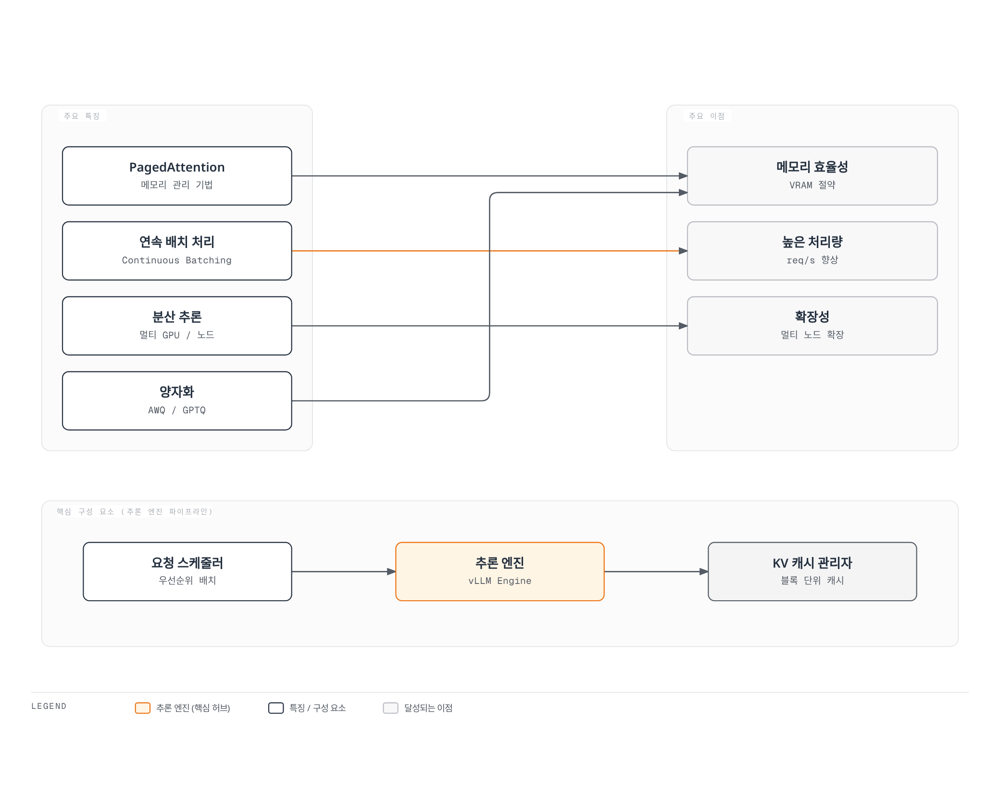
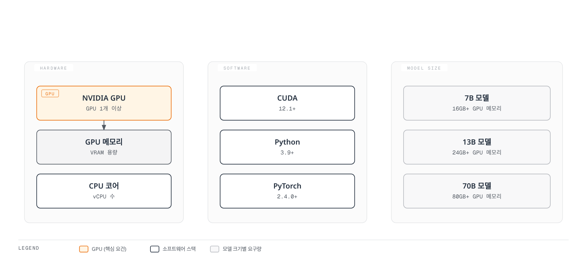
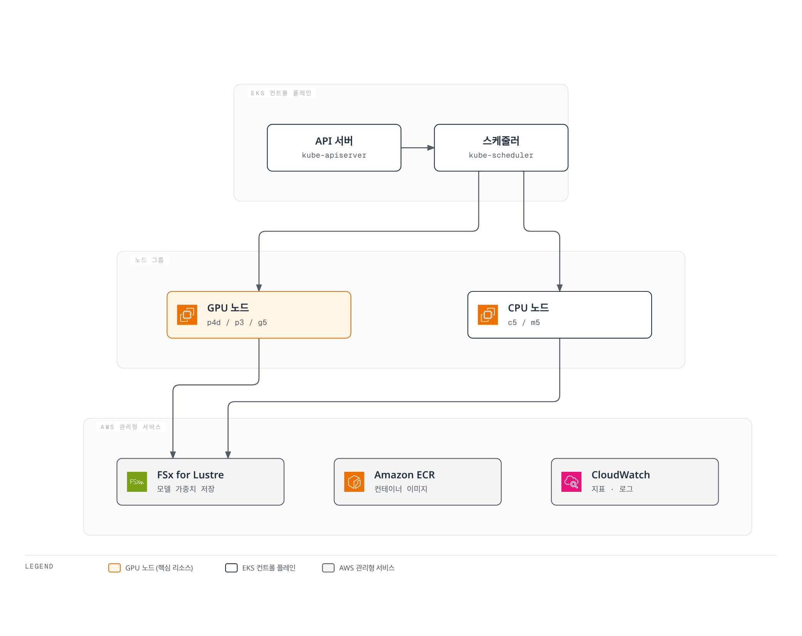
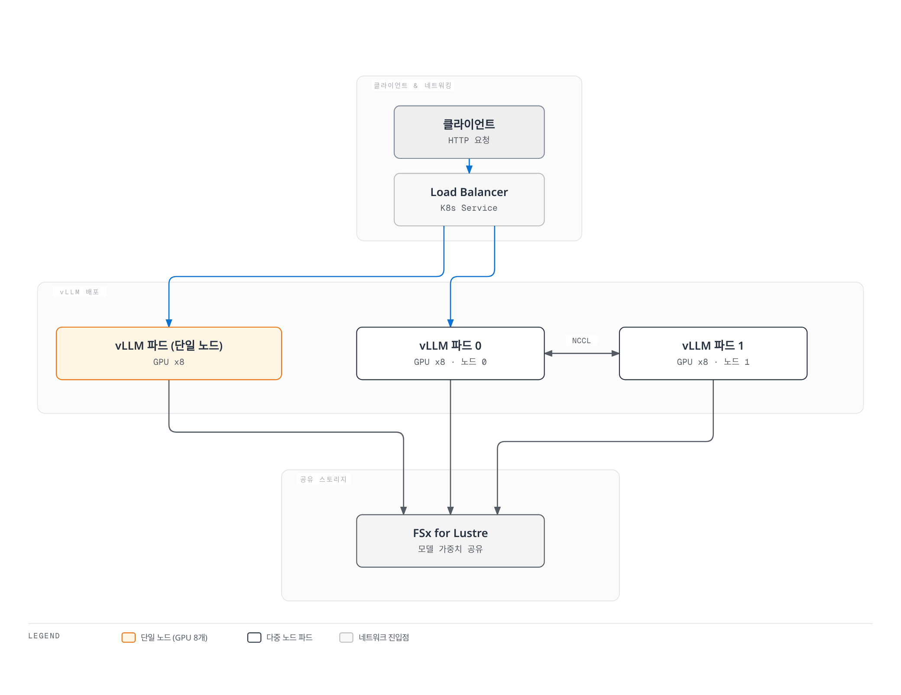
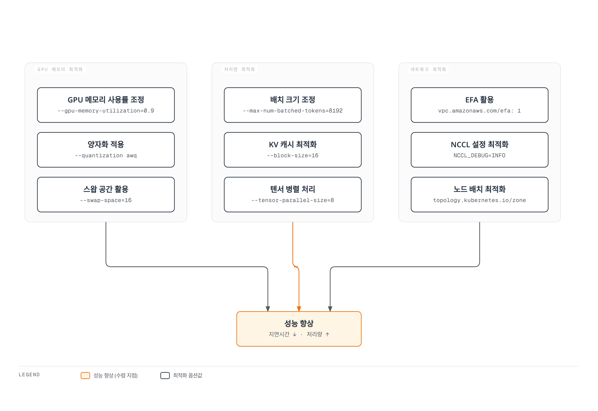
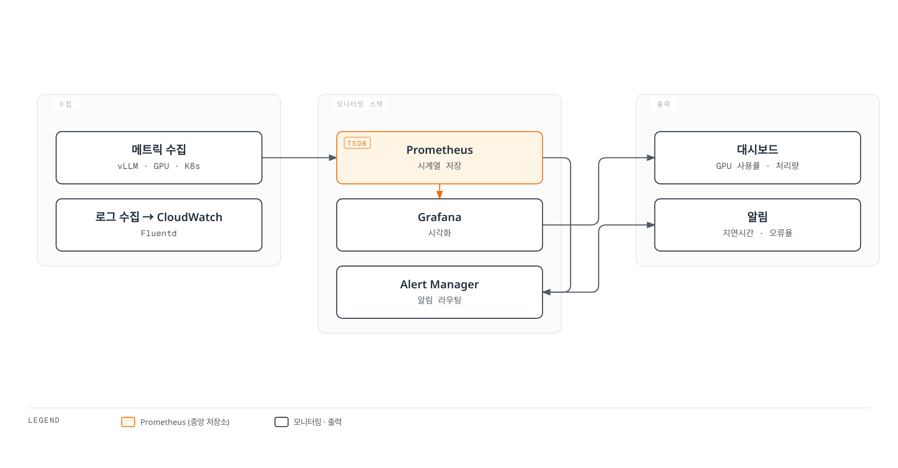
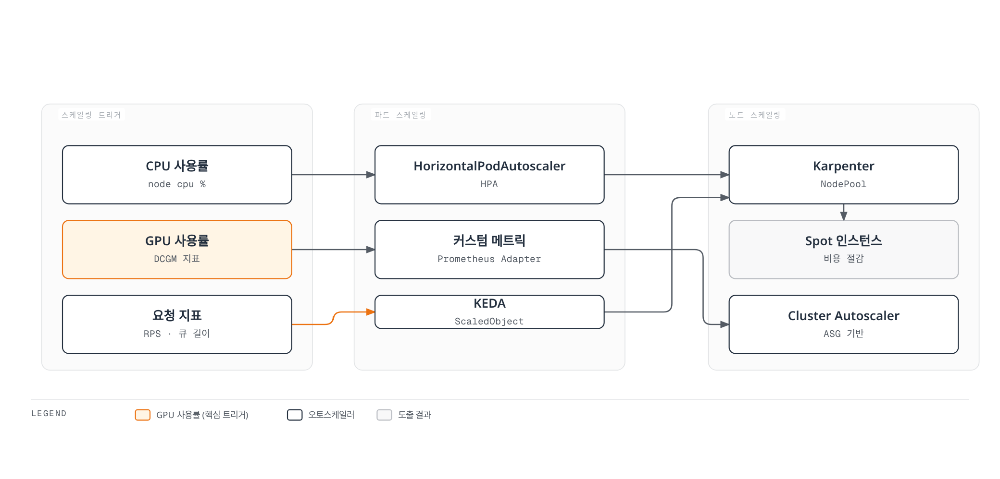
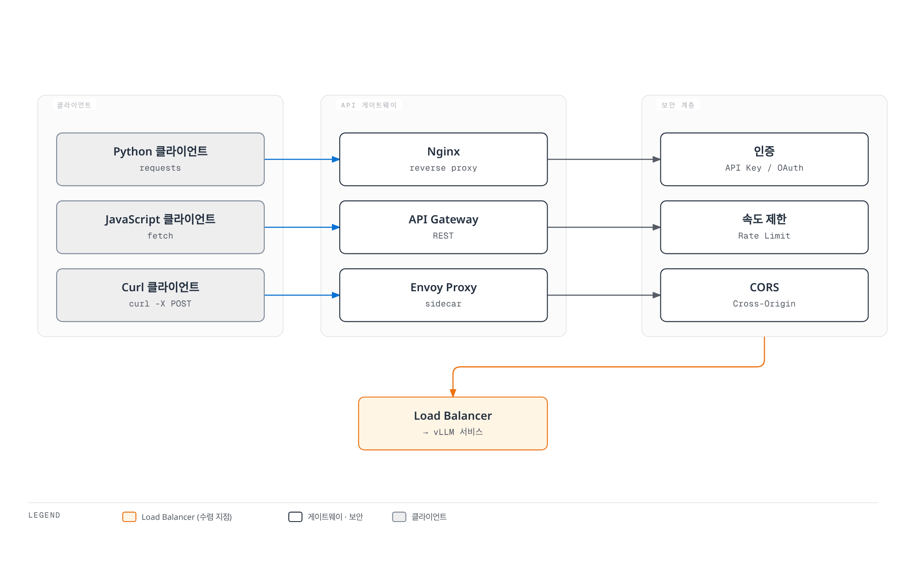

# vLLM 배포 및 최적화

> **지원 버전**: Kubernetes 1.31, 1.32, 1.33  
> **마지막 업데이트**: 2026년 4월 9일

vLLM은 대규모 언어 모델(LLM)을 위한 고성능 오픈소스 추론 엔진으로, 현재 가장 널리 사용되는 LLM 서빙 프레임워크입니다. 이 장에서는 vLLM의 최신 기능과 아키텍처를 이해하고, EKS에서 프로덕션 수준으로 배포 및 최적화하는 방법을 알아보겠습니다.

## 실습 환경 설정

이 문서의 예제를 따라하기 위해서는 다음과 같은 도구와 환경이 필요합니다:

### 필수 도구 및 리소스
- kubectl v1.31 이상
- Helm v3.10 이상
- NVIDIA GPU가 있는 EKS 클러스터 (최소 권장: g5.2xlarge 인스턴스)
- NVIDIA 드라이버 및 NVIDIA Device Plugin 설치
- 최소 50GB 이상의 디스크 공간

### GPU 노드 설정

```bash
# NVIDIA Device Plugin 설치
kubectl apply -f https://raw.githubusercontent.com/NVIDIA/k8s-device-plugin/v0.14.0/nvidia-device-plugin.yml

# GPU 노드 확인
kubectl get nodes "-o=custom-columns=NAME:.metadata.name,GPU:.status.allocatable.nvidia\.com/gpu"
```

## vLLM 소개

vLLM은 다음과 같은 특징을 가진 LLM 추론 엔진입니다:



### vLLM의 주요 기능

1. **PagedAttention**: 
   - KV 캐시를 효율적으로 관리하는 메모리 관리 기술
   - 운영 체제의 가상 메모리 관리에서 영감을 받은 기술
   - 최대 10배 더 많은 동시 요청 처리 가능

2. **연속 배치 처리**:
   - 동적으로 요청을 배치 처리하여 GPU 활용도 최대화
   - 새로운 요청이 도착하면 즉시 처리 시작
   - 처리량 최대 2배 향상

3. **분산 추론**:
   - 텐서 병렬화를 통한 대규모 모델 지원
   - 여러 GPU에 걸쳐 모델 샤딩
   - 175B+ 파라미터 모델 지원

4. **양자화**:
   - INT8, FP16 등 다양한 정밀도 지원
   - 메모리 사용량 감소 및 추론 속도 향상
   - 최소한의 정확도 손실로 최대 2배 메모리 효율성 향상

## 지원 모델

vLLM은 다음과 같은 모델을 지원합니다:

| 모델 계열 | 지원 모델 | 양자화 옵션 |
|----------|----------|------------|
| **LLaMA 3 / 3.1 / 3.2 / 3.3** | 1B, 3B, 8B, 70B, 405B | FP16, BF16, FP8, INT8, INT4, AWQ, GPTQ |
| **DeepSeek V3 / R1** | 7B, 67B, 671B (MoE) | FP16, BF16, FP8, AWQ, GPTQ |
| **Qwen 2 / 2.5 / QwQ** | 0.5B ~ 72B | FP16, BF16, FP8, INT8, AWQ, GPTQ |
| **Mistral / Mixtral** | 7B, 8x7B, 8x22B, Large 2 | FP16, BF16, FP8, AWQ, GPTQ |
| **Gemma 2 / 3** | 2B, 9B, 27B | FP16, BF16, INT8 |
| **Phi-3 / Phi-4** | 3.8B, 7B, 14B | FP16, BF16, INT8, AWQ |
| **Command R / R+** | 35B, 104B | FP16, BF16 |
| **DBRX** | 132B (MoE) | FP16, BF16 |
| **StarCoder 2** | 3B, 7B, 15B | FP16, BF16 |
| **비전 모델 (VLM)** | LLaVA, Pixtral, Qwen2-VL, InternVL | FP16, BF16 |

1. **PagedAttention**: 메모리 효율적인 어텐션 메커니즘으로, 긴 시퀀스를 처리할 때 메모리 사용량을 최적화합니다.
2. **연속 배치 처리**: 요청을 동적으로 배치 처리하여 처리량을 향상시킵니다.
3. **분산 추론**: 여러 GPU와 노드에 걸쳐 모델을 분산하여 대규모 모델을 처리할 수 있습니다.
4. **양자화**: INT8/INT4 양자화를 지원하여 메모리 사용량을 줄이고 처리량을 향상시킵니다.
5. **OpenAI 호환 API**: OpenAI API와 호환되는 인터페이스를 제공합니다.

### vLLM 최신 기능 (v0.6+)

vLLM은 빠르게 발전하고 있으며, 최근 버전에서 다음과 같은 주요 기능이 추가되었습니다:

#### Speculative Decoding (추론 가속)

작은 드래프트 모델을 사용하여 여러 토큰을 미리 생성하고, 큰 모델이 이를 한 번에 검증하는 방식으로 추론 속도를 2~3배 향상시킵니다:

```bash
python -m vllm.entrypoints.openai.api_server \
  --model meta-llama/Llama-3.1-70B-Instruct \
  --speculative-model meta-llama/Llama-3.1-8B-Instruct \
  --num-speculative-tokens 5
```

#### Prefix Caching (자동 프리픽스 캐싱)

동일한 시스템 프롬프트나 컨텍스트를 공유하는 요청 간에 KV 캐시를 자동으로 재사용하여 TTFT(Time to First Token)를 대폭 줄입니다:

```bash
--enable-prefix-caching
```

#### Chunked Prefill

긴 프롬프트의 프리필 단계를 여러 청크로 분할하여 디코딩 요청과 인터리빙 처리합니다. 이를 통해 긴 컨텍스트 요청이 다른 요청의 지연 시간에 미치는 영향을 줄입니다:

```bash
--enable-chunked-prefill --max-num-batched-tokens 2048
```

#### LoRA 어댑터 동적 로딩

런타임에 여러 LoRA 어댑터를 동적으로 로드/언로드하여 단일 베이스 모델로 다수의 맞춤형 모델을 서빙합니다:

```bash
--enable-lora --max-loras 4 --max-lora-rank 64
```

```python
# API 요청 시 LoRA 모델 지정
response = client.chat.completions.create(
    model="my-custom-lora-adapter",
    messages=[{"role": "user", "content": "Hello!"}]
)
```

#### Structured Output (구조화된 출력)

JSON Schema, 정규표현식, CFG(Context-Free Grammar) 기반의 제약된 출력을 지원하여 안정적인 구조화 데이터 생성이 가능합니다:

```python
from openai import OpenAI
client = OpenAI(base_url="http://vllm-service:8000/v1")

response = client.chat.completions.create(
    model="meta-llama/Llama-3.1-8B-Instruct",
    messages=[{"role": "user", "content": "사용자 정보를 JSON으로 반환해주세요"}],
    response_format={
        "type": "json_schema",
        "json_schema": {
            "name": "user_info",
            "schema": {
                "type": "object",
                "properties": {
                    "name": {"type": "string"},
                    "age": {"type": "integer"},
                    "email": {"type": "string"}
                },
                "required": ["name", "age", "email"]
            }
        }
    }
)
```

#### Tool Calling (도구 호출)

OpenAI 호환 Tool/Function Calling을 지원하여 에이전트 워크플로우와 통합이 가능합니다:

```python
response = client.chat.completions.create(
    model="meta-llama/Llama-3.1-8B-Instruct",
    messages=[{"role": "user", "content": "서울 날씨 알려줘"}],
    tools=[{
        "type": "function",
        "function": {
            "name": "get_weather",
            "description": "지정된 위치의 현재 날씨 정보를 가져옵니다",
            "parameters": {
                "type": "object",
                "properties": {
                    "location": {"type": "string", "description": "도시 이름"}
                },
                "required": ["location"]
            }
        }
    }]
)
```

#### FP8 양자화

Hopper (H100) 및 Ada Lovelace (L4, L40S) GPU에서 FP8 양자화를 지원하여 메모리 사용량을 절반으로 줄이면서 거의 동일한 정확도를 유지합니다:

```bash
--quantization fp8 --kv-cache-dtype fp8
```

#### 비전-언어 모델 (VLM) 서빙

이미지와 텍스트를 동시에 처리하는 멀티모달 모델을 지원합니다:

```python
response = client.chat.completions.create(
    model="llava-hf/llava-v1.6-mistral-7b-hf",
    messages=[{
        "role": "user",
        "content": [
            {"type": "text", "text": "이 이미지를 설명해주세요"},
            {"type": "image_url", "image_url": {"url": "data:image/png;base64,..."}}
        ]
    }]
)
```

## 시스템 요구 사항

vLLM을 EKS에 배포하기 위한 시스템 요구 사항은 다음과 같습니다:



1. **하드웨어**:
   - NVIDIA GPU(Volta, Turing, Ampere, Hopper 아키텍처)
   - 최소 GPU 메모리: 모델 크기에 따라 다름
     - 7B 모델: 최소 16GB GPU 메모리
     - 13B 모델: 최소 24GB GPU 메모리
     - 70B 모델: 최소 80GB GPU 메모리(또는 여러 GPU에 분산)

2. **소프트웨어**:
   - CUDA 12.1 이상 (FP8 사용 시 CUDA 12.4 권장)
   - Python 3.9 이상
   - PyTorch 2.4.0 이상

3. **EKS 노드 유형**:
   - p5.48xlarge: 8x NVIDIA H100 GPU, 각 80GB (최고 성능)
   - p4d.24xlarge: 8x NVIDIA A100 GPU, 각 40GB 또는 80GB
   - g6.12xlarge: 4x NVIDIA L4 GPU, 각 24GB (비용 효율적)
   - g5.12xlarge: 4x NVIDIA A10G GPU, 각 24GB
   - g6e.12xlarge: 4x NVIDIA L40S GPU, 각 48GB
   - trn1.32xlarge: 16x AWS Trainium, 각 32GB (AWS 실리콘)

## EKS 인프라 구성



## 스토리지 구성

vLLM은 대규모 모델 가중치를 로드해야 하므로 고성능 스토리지가 필요합니다:

### FSx for Lustre 설정

FSx for Lustre는 고성능 병렬 파일 시스템으로, 대규모 모델 가중치를 빠르게 로드하는 데 적합합니다:

```yaml
apiVersion: fsx.aws.k8s.io/v1beta1
kind: Lustre
metadata:
  name: vllm-models
spec:
  deploymentType: SCRATCH_2
  storageCapacity: 1200
  subnetIds:
    - subnet-0123456789abcdef0
  securityGroupIds:
    - sg-0123456789abcdef0
  perUnitStorageThroughput: 200
---
apiVersion: storage.k8s.io/v1
kind: StorageClass
metadata:
  name: fsx-lustre-sc
provisioner: fsx.csi.aws.com
parameters:
  fileSystemId: fs-0123456789abcdef0
  mountName: vllm-models
---
apiVersion: v1
kind: PersistentVolumeClaim
metadata:
  name: vllm-models-pvc
spec:
  accessModes:
    - ReadWriteMany
  storageClassName: fsx-lustre-sc
  resources:
    requests:
      storage: 1200Gi
```

### S3에서 모델 다운로드

Hugging Face 모델을 S3에 저장하고 FSx for Lustre로 다운로드하는 작업:

```yaml
apiVersion: batch/v1
kind: Job
metadata:
  name: model-download
spec:
  template:
    spec:
      containers:
      - name: model-download
        image: huggingface/transformers:latest
        command:
        - python
        - -c
        - |
          from huggingface_hub import snapshot_download
          import os
          
          model_id = "meta-llama/Llama-3.1-70B-Instruct"
          dest_dir = "/models/llama-3.1-70b"
          
          os.makedirs(dest_dir, exist_ok=True)
          snapshot_download(repo_id=model_id, local_dir=dest_dir, token=os.environ["HF_TOKEN"])
        env:
        - name: HF_TOKEN
          valueFrom:
            secretKeyRef:
              name: huggingface-token
              key: token
        volumeMounts:
        - name: models-volume
          mountPath: /models
      restartPolicy: Never
      volumes:
      - name: models-volume
        persistentVolumeClaim:
          claimName: vllm-models-pvc
```

## vLLM 배포

### 배포 아키텍처

다음 다이어그램은 EKS에서 vLLM을 배포하는 두 가지 주요 아키텍처를 보여줍니다:



### 단일 노드 배포

단일 GPU 또는 단일 노드의 여러 GPU에서 vLLM을 실행하는 배포:

```yaml
apiVersion: apps/v1
kind: Deployment
metadata:
  name: vllm-inference
spec:
  replicas: 1
  selector:
    matchLabels:
      app: vllm-inference
  template:
    metadata:
      labels:
        app: vllm-inference
    spec:
      containers:
      - name: vllm-server
        image: vllm/vllm-openai:latest
        command:
        - python
        - -m
        - vllm.entrypoints.openai.api_server
        - --model=/models/llama-3.1-70b
        - --tensor-parallel-size=8
        - --gpu-memory-utilization=0.95
        - --max-num-batched-tokens=16384
        - --enable-prefix-caching
        - --enable-chunked-prefill
        - --port=8000
        ports:
        - containerPort: 8000
        resources:
          limits:
            nvidia.com/gpu: 8
        volumeMounts:
        - name: models-volume
          mountPath: /models
        env:
        - name: CUDA_VISIBLE_DEVICES
          value: "0,1,2,3,4,5,6,7"
      volumes:
      - name: models-volume
        persistentVolumeClaim:
          claimName: vllm-models-pvc
---
apiVersion: v1
kind: Service
metadata:
  name: vllm-inference
spec:
  selector:
    app: vllm-inference
  ports:
  - port: 8000
    targetPort: 8000
  type: LoadBalancer
```

### 다중 노드 분산 배포

여러 노드에 걸쳐 대규모 모델을 분산 배포하는 방법:

```yaml
apiVersion: v1
kind: ConfigMap
metadata:
  name: vllm-config
data:
  hostfile: |
    vllm-inference-0 slots=8
    vllm-inference-1 slots=8
  run_server.sh: |
    #!/bin/bash
    
    RANK=$HOSTNAME
    if [[ $HOSTNAME == "vllm-inference-0" ]]; then
      RANK=0
    elif [[ $HOSTNAME == "vllm-inference-1" ]]; then
      RANK=1
    fi
    
    python -m vllm.entrypoints.openai.api_server \
      --model=/models/llama-3.1-70b \
      --tensor-parallel-size=16 \
      --pipeline-parallel-size=1 \
      --max-num-batched-tokens=8192 \
      --port=8000 \
      --host=0.0.0.0 \
      --master-addr=vllm-inference-0 \
      --master-port=29500 \
      --rank=$RANK
---
apiVersion: apps/v1
kind: StatefulSet
metadata:
  name: vllm-inference
spec:
  serviceName: "vllm-inference"
  replicas: 2
  selector:
    matchLabels:
      app: vllm-inference
  template:
    metadata:
      labels:
        app: vllm-inference
    spec:
      affinity:
        podAntiAffinity:
          requiredDuringSchedulingIgnoredDuringExecution:
          - labelSelector:
              matchExpressions:
              - key: app
                operator: In
                values:
                - vllm-inference
            topologyKey: kubernetes.io/hostname
      containers:
      - name: vllm-server
        image: vllm/vllm-openai:latest
        command:
        - bash
        - /config/run_server.sh
        ports:
        - containerPort: 8000
        - containerPort: 29500
        resources:
          limits:
            nvidia.com/gpu: 8
        volumeMounts:
        - name: models-volume
          mountPath: /models
        - name: config-volume
          mountPath: /config
        env:
        - name: CUDA_VISIBLE_DEVICES
          value: "0,1,2,3,4,5,6,7"
        - name: NCCL_DEBUG
          value: "INFO"
        - name: NCCL_IB_DISABLE
          value: "0"
        - name: NCCL_IB_GID_INDEX
          value: "3"
        - name: NCCL_NET_GDR_LEVEL
          value: "5"
      volumes:
      - name: models-volume
        persistentVolumeClaim:
          claimName: vllm-models-pvc
      - name: config-volume
        configMap:
          name: vllm-config
          defaultMode: 0755
---
apiVersion: v1
kind: Service
metadata:
  name: vllm-inference
spec:
  selector:
    app: vllm-inference
  ports:
  - port: 8000
    targetPort: 8000
    name: api
  - port: 29500
    targetPort: 29500
    name: nccl
  clusterIP: None
---
apiVersion: v1
kind: Service
metadata:
  name: vllm-inference-lb
spec:
  selector:
    app: vllm-inference
    statefulset.kubernetes.io/pod-name: vllm-inference-0
  ports:
  - port: 8000
    targetPort: 8000
  type: LoadBalancer
```

## 성능 최적화



### GPU 메모리 최적화

vLLM의 GPU 메모리 사용량을 최적화하는 방법:

1. **GPU 메모리 사용률 조정**:

```bash
--gpu-memory-utilization=0.9
```

2. **양자화 적용**:

```bash
--quantization awq
```

3. **스왑 공간 활용**:

```bash
--swap-space=16
```

### 처리량 최적화

vLLM의 처리량을 최적화하는 방법:

1. **배치 크기 조정**:

```bash
--max-num-batched-tokens=8192
```

2. **KV 캐시 최적화**:

```bash
--block-size=16
```

3. **텐서 병렬 처리 조정**:

```bash
--tensor-parallel-size=8
```

### 네트워크 최적화

분산 배포에서 네트워크 성능을 최적화하는 방법:

1. **EFA(Elastic Fabric Adapter) 활용**:

```yaml
resources:
  limits:
    nvidia.com/gpu: 8
    vpc.amazonaws.com/efa: 1
```

2. **NCCL 설정 최적화**:

```yaml
env:
- name: NCCL_DEBUG
  value: "INFO"
- name: NCCL_MIN_NCHANNELS
  value: "4"
- name: NCCL_SOCKET_IFNAME
  value: "^lo,docker"
- name: NCCL_ASYNC_ERROR_HANDLING
  value: "1"
```

3. **노드 배치 최적화**:

```yaml
affinity:
  nodeAffinity:
    requiredDuringSchedulingIgnoredDuringExecution:
      nodeSelectorTerms:
      - matchExpressions:
        - key: topology.kubernetes.io/zone
          operator: In
          values:
          - us-west-2a
```

## 모니터링 및 로깅



### Prometheus 메트릭

vLLM 서버에서 Prometheus 메트릭을 수집하는 방법:

```yaml
apiVersion: v1
kind: Service
metadata:
  name: vllm-metrics
  labels:
    app: vllm-inference
spec:
  selector:
    app: vllm-inference
  ports:
  - port: 8001
    targetPort: 8001
    name: metrics
---
apiVersion: monitoring.coreos.com/v1
kind: ServiceMonitor
metadata:
  name: vllm-metrics
  namespace: monitoring
spec:
  selector:
    matchLabels:
      app: vllm-inference
  endpoints:
  - port: metrics
    interval: 15s
```

### 로그 수집

vLLM 서버의 로그를 CloudWatch로 수집하는 방법:

```yaml
apiVersion: v1
kind: ConfigMap
metadata:
  name: fluentd-config
  namespace: logging
data:
  fluent.conf: |
    <source>
      @type tail
      path /var/log/containers/vllm-*.log
      pos_file /var/log/fluentd-vllm.log.pos
      tag kubernetes.vllm.*
      read_from_head true
      <parse>
        @type json
        time_format %Y-%m-%dT%H:%M:%S.%NZ
      </parse>
    </source>
    
    <filter kubernetes.vllm.**>
      @type kubernetes_metadata
      @id filter_kube_metadata
    </filter>
    
    <match kubernetes.vllm.**>
      @type cloudwatch_logs
      log_group_name /eks/vllm/logs
      log_stream_name_key $.kubernetes.pod_name
      remove_log_stream_name_key true
      auto_create_stream true
      region us-west-2
    </match>
```

## 오토스케일링



### HPA(Horizontal Pod Autoscaler)

요청량에 따라 vLLM 서버를 자동으로 스케일링하는 방법:

```yaml
apiVersion: autoscaling/v2
kind: HorizontalPodAutoscaler
metadata:
  name: vllm-inference-hpa
spec:
  scaleTargetRef:
    apiVersion: apps/v1
    kind: Deployment
    name: vllm-inference
  minReplicas: 1
  maxReplicas: 5
  metrics:
  - type: Resource
    resource:
      name: cpu
      target:
        type: Utilization
        averageUtilization: 70
  - type: Pods
    pods:
      metric:
        name: requests_per_second
      target:
        type: AverageValue
        averageValue: 100
```

### Karpenter를 사용한 노드 오토스케일링

GPU 노드를 자동으로 프로비저닝하는 방법:

```yaml
apiVersion: karpenter.sh/v1
kind: NodePool
metadata:
  name: vllm-gpu
spec:
  template:
    spec:
      requirements:
      - key: node.kubernetes.io/instance-type
        operator: In
        values:
        - p3.16xlarge
        - g5.12xlarge
      - key: karpenter.sh/capacity-type
        operator: In
        values:
        - on-demand
      - key: kubernetes.io/arch
        operator: In
        values:
        - amd64
      - key: vpc.amazonaws.com/efa
        operator: In
        values:
        - "true"
      nodeClassRef:
        name: vllm-gpu-class
  limits:
    nvidia.com/gpu: 32
---
apiVersion: karpenter.k8s.aws/v1
kind: EC2NodeClass
metadata:
  name: vllm-gpu-class
spec:
  subnetSelector:
    karpenter.sh/discovery: vllm-cluster
  securityGroupSelector:
    karpenter.sh/discovery: vllm-cluster
  ttlSecondsAfterEmpty: 30
```

## 보안 구성

### 네트워크 정책

vLLM 서버에 대한 네트워크 액세스를 제한하는 방법:

```yaml
apiVersion: networking.k8s.io/v1
kind: NetworkPolicy
metadata:
  name: vllm-network-policy
spec:
  podSelector:
    matchLabels:
      app: vllm-inference
  policyTypes:
  - Ingress
  - Egress
  ingress:
  - from:
    - podSelector:
        matchLabels:
          app: api-gateway
    ports:
    - protocol: TCP
      port: 8000
  - from:
    - podSelector:
        matchLabels:
          app: vllm-inference
    ports:
    - protocol: TCP
      port: 29500
  egress:
  - to:
    - podSelector:
        matchLabels:
          app: vllm-inference
    ports:
    - protocol: TCP
      port: 29500
  - to:
    ports:
    - protocol: TCP
      port: 443
```

### 보안 컨텍스트

컨테이너의 보안 컨텍스트를 구성하는 방법:

```yaml
securityContext:
  runAsUser: 1000
  runAsGroup: 1000
  fsGroup: 1000
  allowPrivilegeEscalation: false
  capabilities:
    drop:
    - ALL
```

## 클라이언트 통합



### API 게이트웨이

vLLM 서버 앞에 API 게이트웨이를 배포하는 방법:

```yaml
apiVersion: apps/v1
kind: Deployment
metadata:
  name: api-gateway
spec:
  replicas: 3
  selector:
    matchLabels:
      app: api-gateway
  template:
    metadata:
      labels:
        app: api-gateway
    spec:
      containers:
      - name: api-gateway
        image: nginx:latest
        ports:
        - containerPort: 80
        volumeMounts:
        - name: nginx-config
          mountPath: /etc/nginx/conf.d
      volumes:
      - name: nginx-config
        configMap:
          name: nginx-config
---
apiVersion: v1
kind: ConfigMap
metadata:
  name: nginx-config
data:
  default.conf: |
    server {
      listen 80;
      
      location /v1/ {
        proxy_pass http://vllm-inference:8000;
        proxy_set_header Host $host;
        proxy_set_header X-Real-IP $remote_addr;
      }
    }
---
apiVersion: v1
kind: Service
metadata:
  name: api-gateway
spec:
  selector:
    app: api-gateway
  ports:
  - port: 80
    targetPort: 80
  type: LoadBalancer
```

### 클라이언트 예제

Python 클라이언트를 사용하여 vLLM 서버에 요청을 보내는 방법:

```python
import requests
import json

url = "http://api-gateway/v1/completions"

payload = {
    "model": "llama-3.1-70b",
    "prompt": "Once upon a time",
    "max_tokens": 100,
    "temperature": 0.7
}

headers = {
    "Content-Type": "application/json"
}

response = requests.post(url, headers=headers, data=json.dumps(payload))

print(response.json())
```

## 모범 사례

### 리소스 관리

1. **메모리 오버헤드 고려**:
   - GPU 메모리 외에도 CPU 메모리를 충분히 할당합니다.
   - 모델 크기의 약 2배 정도의 CPU 메모리를 할당하는 것이 좋습니다.

2. **CPU 코어 할당**:
   - GPU당 최소 4개의 CPU 코어를 할당합니다.
   - 텐서 병렬 처리를 사용하는 경우 더 많은 CPU 코어가 필요할 수 있습니다.

3. **노드 선택**:
   - 모델 크기에 맞는 적절한 노드 유형을 선택합니다.
   - 메모리 대역폭이 높은 노드를 선택합니다.

### 고가용성

1. **다중 가용 영역 배포**:
   - 여러 가용 영역에 걸쳐 vLLM 서버를 배포합니다.
   - 각 가용 영역에 충분한 용량을 확보합니다.

2. **로드 밸런싱**:
   - 여러 vLLM 서버 인스턴스 간에 요청을 분산합니다.
   - 세션 어피니티를 구성하여 동일한 사용자의 요청이 동일한 서버로 라우팅되도록 합니다.

3. **장애 복구**:
   - 상태 확인을 구성하여 장애가 발생한 서버를 감지합니다.
   - 자동 복구 메커니즘을 구현합니다.

### 비용 최적화

1. **Spot 인스턴스 활용**:
   - 비용을 절감하기 위해 Spot 인스턴스를 사용합니다.
   - 중단 허용 워크로드에 적합합니다.

2. **모델 양자화**:
   - INT8 또는 INT4 양자화를 적용하여 메모리 사용량을 줄입니다.
   - 정확도와 성능 간의 균형을 고려합니다.

3. **오토스케일링**:
   - 요청량에 따라 서버를 자동으로 스케일링합니다.
   - 유휴 시간에는 서버를 축소하여 비용을 절감합니다.

## 결론

vLLM은 가장 활발하게 개발되는 오픈소스 LLM 추론 엔진으로, Speculative Decoding, Prefix Caching, LoRA 동적 로딩, Structured Output, Tool Calling 등 프로덕션에 필수적인 기능을 포괄적으로 지원합니다. EKS에서 적절한 GPU 인스턴스 선택, 고성능 스토리지, 네트워크 최적화, 오토스케일링을 결합하면 비용 효율적이면서도 확장 가능한 LLM 서빙 플랫폼을 구축할 수 있습니다. SGLang, TGI 등 다른 프레임워크와의 비교는 [추론 프레임워크](./04-inference-frameworks.md) 장을 참고하세요.

## 참고 자료

- [vLLM 공식 문서](https://docs.vllm.ai/) - vLLM 공식 문서 및 최신 기능 가이드
- [AI on EKS](https://awslabs.github.io/ai-on-eks/ko/) - AWS에서 제공하는 EKS 기반 AI/ML 워크로드 배포 가이드 및 예제

## 퀴즈

이 장에서 배운 내용을 테스트하려면 [주제 퀴즈](../quizzes/ai-ml/04-vllm-deployment-quiz.md)를 풀어보세요.
