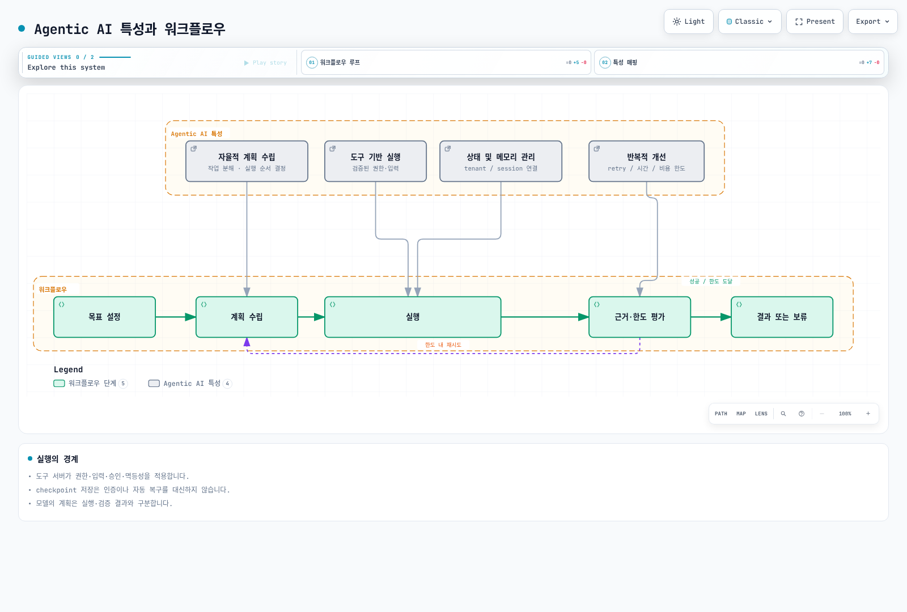
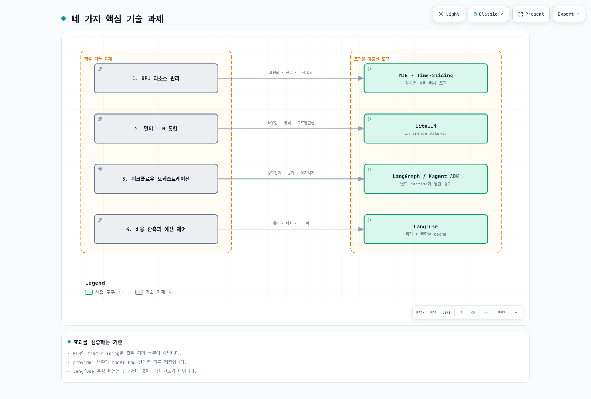
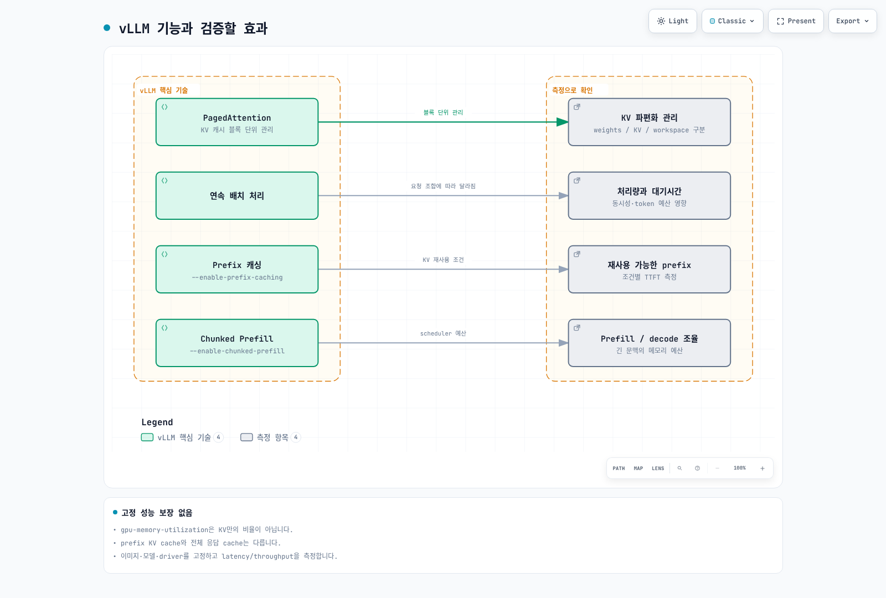
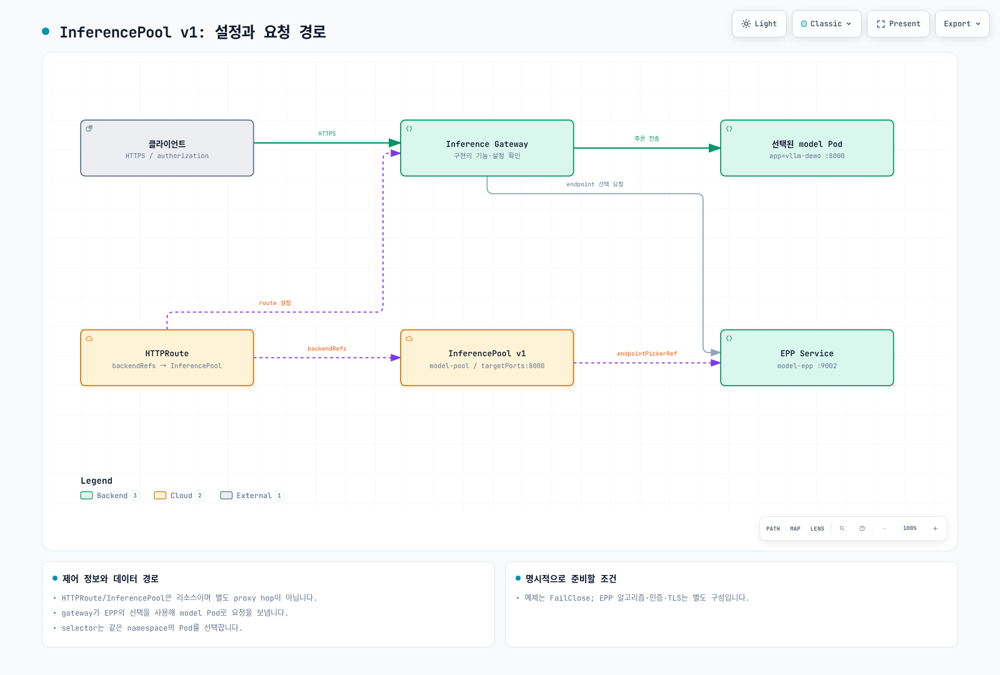
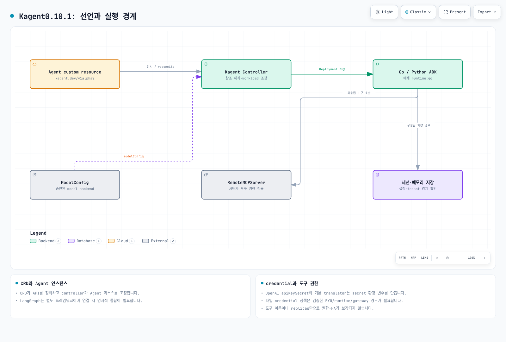

# EKS 기반 Agentic AI 플랫폼 구축

> **검토 기준**: Kagent 0.10.1 / Gateway Inference Extension 1.6.1 / LangGraph 1.2.11 / Langfuse SDK 4.15.2
> **마지막 업데이트**: 2026년 9월 12일

Agentic AI는 단순한 질의응답을 넘어 자율적으로 계획을 세우고, 도구를 사용하며, 반복적으로 목표를 달성하는 AI 시스템입니다. 이 장에서는 EKS에서 Agentic AI 플랫폼의 구성과 운영 경계를 설계하는 방법을 알아보겠습니다.

## 1. Agentic AI 플랫폼 개요

### Agentic AI란?

Agentic AI는 다음과 같은 특성을 가진 자율적 AI 시스템입니다:



[🔍 인터랙티브 다이어그램 보기](https://www.atomai.click/kubernetes-docs/archmaps/ko-ai-ml-03-agentic-ai-platform-0.html)

1. **자율적 계획 수립**: 복잡한 작업을 하위 작업으로 분해하고 실행 순서를 결정합니다.
2. **도구 기반 실행**: 외부 API, 데이터베이스, 코드 실행기 등 다양한 도구를 활용합니다.
3. **반복적 개선**: 실행 결과를 평가하고 필요시 계획을 수정합니다.
4. **상태 관리**: 장기 실행 작업에서 상태와 메모리를 유지합니다.

### Kubernetes를 선택하는 조건

Agentic AI 플랫폼에서 Kubernetes는 다음과 같은 핵심 기능을 제공합니다:

| 요구사항 | Kubernetes 솔루션 |
|---------|------------------|
| GPU 오케스트레이션 | Device Plugin, GPU Operator, MIG |
| 자동 스케일링 | HPA, VPA, Karpenter |
| 멀티 테넌트 격리 | RBAC, Namespace, enforced NetworkPolicy, workload identity |
| 고가용성 | replicas, probes, placement and recovery tests |
| 서비스 메시 | configured gateway/mesh implementation |
| 비용 최적화 | Spot 인스턴스, 노드 통합 |

### 네 가지 핵심 기술 과제

Agentic AI 플랫폼 구축 시 해결해야 할 핵심 과제:



[🔍 인터랙티브 다이어그램 보기](https://www.atomai.click/kubernetes-docs/archmaps/ko-ai-ml-03-agentic-ai-platform-1.html)

---

## 2. GPU와 비용 기준

에이전트가 외부 모델 API만 호출한다면 GPU가 필수는 아닙니다. 자체 추론을 운영할 때 모델 크기·정밀도·KV cache·동시성·CPU 아키텍처와 driver 조건으로 장치를 선택합니다. GPU Operator·device plugin은 [검토한 GPU 가이드](01-ai-ml-workloads.md)를 참고하세요. AL2023 NVIDIA AMI의 driver/toolkit과 중복 설치하지 않아야 합니다.

MIG는 지원 장치에서 GPU instance를 분할하며, 같은 MIG instance를 time-slicing으로 공유하면 그 안의 워크로드 사이에 메모리·장애 격리가 새로 생기지는 않습니다. time-slicing은 “소프트웨어 보안 격리”가 아닙니다. 메모리80GB가70B FP16 모델을 담는다는 식의 단정도 피해야 합니다.

GPU Operator의 Helm values는 ConfigMap/HelmRelease 매니페스트와 다릅니다. Flux HelmRelease를 helm --values에 넣으면 원하는 설정이 적용되지 않습니다. MIG 설정에는 manager의 ConfigMap 참조, MIG profile 선택 node label과 device plugin 전략이 맞아야 합니다. device-plugin.config node label 값은 ConfigMap 이름이 아닌 내부 configuration key입니다. MIG 재구성은 실행 workload를 방해할 수 있어 별도 운영 절차가 필요하며 이번 검토에서는 실행하지 않았습니다.

가격은 리전·OS·구매 방식·시점·할당량 조건을 명시해 확인해야 합니다. 이전 표의 출처 없는 시간당 가격과 고정 절감률은 현재 가격으로 사용하지 않습니다. 자체 추론은 GPU 유휴 시간, 스토리지·전송·운영·실패 복구를 포함한 총비용을 실제 처리량으로 나눠 비교하세요.

## 3. 모델 서빙 (vLLM)

### vLLM 아키텍처

vLLM은 다음과 같은 핵심 기술로 고성능 LLM 추론을 제공합니다:



[🔍 인터랙티브 다이어그램 보기](https://www.atomai.click/kubernetes-docs/archmaps/ko-ai-ml-03-agentic-ai-platform-2.html)

### 검토한 서빙 경로

[현재 vLLM 가이드](02-vllm-deployment.md)의0.29.0 이미지·모델 revision, startupProbe, private Service와 실제 CLI를 사용하세요. 이전 예제의 단일 GPU NodePool에는 GPU4개·메모리200Gi를 요구하는 Pod가 들어갈 수 없습니다. TP/PP group과 독립 replica를 구분하고 메모리 요구를 계산해야 합니다.

Prefix cache는 지원 prefix의 KV 재사용이며 응답 cache와 다릅니다. GPU memory utilization을 “KV cache만의 비율”로 설명하거나 제거된 swap-space 옵션을 복사하지 마세요. llm-d의 분리 서빙은 단순한 prefill/decode 이미지 두 개와 role 인자로 완성되지 않습니다. 실제 릴리스의 모델 서버, KV transfer connector, scheduler, gateway와 장치·네트워크 조합을 검증해야 합니다.

## 4. 추론 게이트웨이 (Inference Gateway)

### Gateway API 기반 AI 워크로드 라우팅

Kubernetes Gateway API를 확장하여 AI 추론 워크로드를 효율적으로 라우팅합니다.

### Kgateway + InferencePool 아키텍처



[🔍 인터랙티브 다이어그램 보기](https://www.atomai.click/kubernetes-docs/archmaps/ko-ai-ml-03-agentic-ai-platform-3.html)

#### InferencePool v1

Gateway API와 Gateway API Inference Extension은 별도 API입니다. 검토한 Extension 1.6.1의 InferencePool은 `inference.networking.k8s.io/v1`, `targetPorts`, `endpointPickerRef`를 사용합니다. 이전 예제의 EndpointPicker CRD와 endpointPickerConfig 형식은 이 스키마가 아닙니다.

다음은 스키마를 확인한 예시이며 EPP Service 9002, model Pods와 이를 지원하는 gateway controller를 별도로 준비해야 합니다. InferencePool만으로 인증·속도 제한·prefix-aware 알고리즘이 자동 구성되지는 않습니다.

```yaml
apiVersion: inference.networking.k8s.io/v1
kind: InferencePool
metadata:
  name: model-pool
  namespace: ai-inference
spec:
  selector:
    matchLabels:
      app: vllm-demo
  targetPorts:
    - number: 8000
  endpointPickerRef:
    name: model-epp
    kind: Service
    group: ""
    port:
      number: 9002
    failureMode: FailClose
```

Selector는 같은 namespace의 Pod만 선택합니다. EndpointPickerRef는 기본 Service 참조이고 FailureMode 기본값은 FailClose입니다. HTTPRoute와 EPP 설정·지원 버전, TLS·gateway status를 함께 검증하세요. API 명세나 Kgateway 설치만으로 모든 plugin 기능이 활성화되지는 않습니다.

### LiteLLM 1.100.1의 provider gateway

LiteLLM의 provider 변환과 InferencePool의 backend 선택은 다른 계층입니다. provider별 API path·인증·요청/응답·streaming 형식이 다르므로 OpenAI JSON을 Anthropic endpoint에 그대로 전달하는 router는 올바른 adapter가 아닙니다.

현재 Router의 fallback 형식은 다음과 같습니다. 실제 proxy가 config 파일을 읽도록 command/args도 연결해야 하며, Redis·DB·credential·callback 의존성을 별도로 준비해야 합니다.

```yaml
model_list:
  - model_name: local-primary
    litellm_params:
      model: openai/qwen3-demo
      api_base: http://vllm-demo.ml-inference:8000/v1
  - model_name: local-fallback
    litellm_params:
      model: openai/qwen3-demo
      api_base: http://vllm-secondary.ml-inference:8000/v1
router_settings:
  fallbacks:
    - local-primary: [local-fallback]
  num_retries: 0
```

이는 config 형식 예시이며 미리 준비한 endpoint와 인증을 요구합니다. 운영 client에 master key를 배포하지 말고 제한된 credential을 사용하세요. 외부 provider fallback은 데이터가 외부로 나가는 경로이므로 tenant별 허용 provider·데이터 정책을 먼저 적용해야 합니다. 모델이 고른 이름이나 client header만으로 이 권한을 우회할 수 없어야 합니다.


## 5. RAG 데이터와 검색 경계

Milvus 최신 확인 릴리스는3.0.1이며, 별도로 검토한 Operator 1.3.9의 기본 Milvus는2.6.11입니다. 같은 버전으로 간주하거나 Operator의 넓은 호환성 표만으로3.x 업그레이드가 검증됐다고 주장하지 마세요. Operator 저장소는 `https://zilliztech.github.io/milvus-operator/`이며 일반 Milvus chart 저장소와 구분됩니다.

벡터 차원은 실제 embedding 출력과 같아야 합니다. 모델 이름뿐 아니라 revision·dimensions 옵션·tokenizer·normalization·metric을 기록하고 ingestion/query가 같은 조건을 쓰도록 하세요. index type에 따라 parameter가 다르므로 HNSW의 M/efConstruction을 GPU_IVF_FLAT에 그대로 적용하지 않습니다. GPU index는 이미지·Milvus 버전·장치와 실제 노드 역할을 확인해야 하며 indexNode에 GPU를 요청한다고 자동 가속되지 않습니다.

tenant_id 필드를 추가하는 것만으로 격리되지 않습니다. 인증된 주체에서 접근 범위를 정하고 retrieval filter를 서버에서 적용한 뒤 결과도 검증해야 합니다. 변경·삭제된 문서와 embedding 버전의 수명 관리도 필요합니다.

### 청킹과 hybrid search

현재 text splitter 모듈은 `langchain_text_splitters`입니다. RecursiveCharacterTextSplitter의 기본 chunk_size는 문자 수이며 토큰 수가 아닙니다. Token splitter는 대상 embedding 모델의 tokenizer와 실제 최대 입력을 맞춰야 합니다. 의미 기반 chunking은 embedding 호출·비용이 추가되며 정답률 향상을 보장하지 않습니다.

Hybrid search는 dense·sparse 결과를 단순히 두 번 검색하는 것에서 끝나지 않고 RRF나 적절한 score fusion과 동일한 접근 필터가 필요합니다. 단어 검색/벡터 검색의 효과는 recall·precision·latency로 평가하세요. 관련 문서가 없으면 재검색을 제한하고 근거 없음으로 종료해야 하며, retry 한도 후 무조건 LLM 답변을 생성하지 않습니다.


## 6. AI 에이전트 배포 (Kagent)

### Kagent 개요

Kagent는 Kubernetes 네이티브 AI 에이전트 라이프사이클 관리 도구입니다.



[🔍 인터랙티브 다이어그램 보기](https://www.atomai.click/kubernetes-docs/archmaps/ko-ai-ml-03-agentic-ai-platform-4.html)

### Kagent 0.10.1 Agent API

Kagent는 K8s 작업 도구에 한정된 자동 kubectl 실행기가 아닙니다. Declarative agent는 Go/Python ADK runtime, BYO는 사용자가 제공하는 A2A agent를 사용합니다. LangGraph는 별도로 연결할 수 있는 워크플로 도구이며 Kagent와 동일 프레임워크가 아닙니다.

다음 Agent는 별도로 승인·구성된 같은 namespace의 ModelConfig와 RemoteMCPServer를 참조합니다. 실제 MCP service와 search_documents 도구, 인증·TLS·데이터 권한을 준비해야 합니다. 이 예제는 도구를 생성하거나 Kubernetes 쓰기 권한을 부여하지 않습니다.

```yaml
apiVersion: kagent.dev/v1alpha2
kind: Agent
metadata:
  name: research-agent
  namespace: ai-agents
spec:
  type: Declarative
  description: Retrieves authorized documents and cites their sources
  declarative:
    runtime: go
    modelConfig: approved-internal-model
    systemMessage: 'Use approved document tools. Cite retrieved sources.

      If evidence is missing, say so. Do not execute arbitrary code.

      '
    tools:
    - type: McpServer
      mcpServer:
        apiGroup: kagent.dev
        kind: RemoteMCPServer
        name: document-tools
        toolNames:
        - search_documents
    deployment:
      replicas: 1
      resources:
        requests:
          cpu: 250m
          memory: 256Mi
        limits:
          cpu: '1'
          memory: 1Gi
```

ModelConfig의 apiKeySecret이 반드시 파일 전달이라는 뜻은 아닙니다. 검토한 OpenAI provider translator는 이를 OPENAI_API_KEY SecretKeyRef 환경 변수로 만듭니다. 비밀을 환경 변수로 전달하지 않는 정책에서는 해당 기본 경로가 맞지 않으므로 파일 credential을 처리하는 BYO/runtime·인증 gateway 등 검증한 경로로 설계해야 합니다. 무조건 apiKeyPassthrough를 켜는 것도 token 위임·audience 검토를 대신하지 않습니다.

임의 eval() 계산기와 도구 정의 안의 가짜 permissions 필드는 보안 경계가 아닙니다. 실제 tool server의 최소 권한·입력 검증·resource limit·승인·멱등성을 구현해야 합니다. agent replicas는 모든 공유 memory·session 저장소의 HA를 보장하지 않습니다.

### 실행 가능한 LangGraph 제어 흐름

아래는 실제 SDK로 검증한 로컬 예제입니다. retrieval/rewrite/generate는 명시적 callback이며 기본 demo는 LLM이나 벡터 DB를 호출하지 않습니다. 원래 질문을 유지하고 재검색은2회로 제한하며 문서가 없으면 응답을 보류합니다. SQLite 파일은 with context 안에서 사용하고 재접속 후 저장 상태를 확인했습니다.

```python
from typing import Callable, TypedDict
from langgraph.graph import StateGraph, START, END
from langgraph.checkpoint.sqlite import SqliteSaver


class QAState(TypedDict):
    question: str
    search_query: str
    documents: list[str]
    answer: str
    retries: int


def build_graph(retrieve: Callable[[str], list[str]],
                rewrite: Callable[[str], str],
                generate: Callable[[str, list[str]], str]):
    def search(state: QAState):
        return {"documents": retrieve(state["search_query"])}

    def route(state: QAState):
        if state["documents"]:
            return "answer"
        return "rewrite" if state["retries"] < 2 else "abstain"

    def rewrite_query(state: QAState):
        return {"search_query": rewrite(state["search_query"]),
                "retries": state["retries"] + 1}

    def answer(state: QAState):
        return {"answer": generate(state["question"], state["documents"])}

    def abstain(state: QAState):
        return {"answer": "No supporting documents were found."}

    graph = StateGraph(QAState)
    graph.add_node("retrieve", search)
    graph.add_node("rewrite", rewrite_query)
    graph.add_node("answer", answer)
    graph.add_node("abstain", abstain)
    graph.add_edge(START, "retrieve")
    graph.add_conditional_edges("retrieve", route,
                               {"answer": "answer", "rewrite": "rewrite", "abstain": "abstain"})
    graph.add_edge("rewrite", "retrieve")
    graph.add_edge("answer", END)
    graph.add_edge("abstain", END)
    return graph


if __name__ == "__main__":
    # Deterministic local fixtures, not a vector database or LLM quality test.
    graph = build_graph(
        retrieve=lambda query: ["A Pod groups containers."] if query == "pod" else [],
        rewrite=lambda query: "pod",
        generate=lambda question, documents: documents[0],
    )
    initial = {"question": "What is a Pod?", "search_query": "unknown",
               "documents": [], "answer": "", "retries": 0}
    # Server-derived authorized tenant/session identity is required in a real app.
    config = {"configurable": {"thread_id": "tenant-a/session-1"}, "recursion_limit": 12}
    with SqliteSaver.from_conn_string("agent-state.sqlite") as saver:
        app = graph.compile(checkpointer=saver)
        print(app.invoke(initial, config)["answer"])
        print(app.get_state(config).values["retries"])
```

프로덕션에서는 thread_id를 인증된 tenant/session에 바인딩하고 DB 권한·암호화·동시성·보존을 구성해야 합니다. :memory:는 프로세스 종료 후 사라집니다. PostgreSQL에 SqliteSaver를 사용할 수 없으며 별도 Postgres saver가 필요합니다. get_state_history()의 항목을 읽는 것만으로 실행이 복원되지는 않습니다. 저장된 checkpoint config와 실제 resume/replay semantics를 사용해야 합니다.

Supervisor의 모델 응답은 허용된 enum으로 검증하고 unknown 값·한도 초과를 처리하세요. “INCOMPLETE”에서 COMPLETE 부분 문자열을 발견해 종료하는 방식은 잘못입니다. 모델에게 도구를 쓰라고 요청하는 것만으로 도구 실행이나 검증이 수행되지는 않습니다.

## 7. Langfuse와 운영 관측성

Langfuse SDK 4.15.2에는 예전 trace()/generation()이 없으며 start_as_current_observation(), create_score() 등을 사용합니다. 검토에서는 메모리 exporter로 검색·생성·상위 span3개가 같은 trace로 묶이는 것을 확인했습니다. 실서비스 수집·저장·사용자 인증을 검증한 것은 아닙니다.

```python
from pathlib import Path
from langfuse import Langfuse

# 기존 Secret 볼륨의 파일을 읽습니다. 실제 값은 코드에 넣지 않습니다.
client = Langfuse(
    public_key=Path("/run/secrets/langfuse/public-key").read_text().strip(),
    secret_key=Path("/run/secrets/langfuse/secret-key").read_text().strip(),
    base_url="https://langfuse.example.internal",
)
with client.start_as_current_observation(name="rag", as_type="span"):
    with client.start_as_current_observation(name="retrieve", as_type="span") as span:
        span.update(metadata={"document_count": 2})
    with client.start_as_current_observation(name="generate", as_type="generation",
                                           model="prepared-model-alias") as generation:
        # 실제 모델 응답의 usage를 넣어야 하며 아래 값은 형식 예시입니다.
        generation.update(usage_details={"input": 10, "output": 5})
client.flush()
client.shutdown()
```

Langfuse chart 2.1.0은 app 4.24.0을 가리키며 확인한 최신 server 4.35.0과 별도입니다. 웹·worker, PostgreSQL, Redis/Valkey, 오브젝트 스토리지와 ClickHouse가 필요합니다. 차트는 ClickHouse Operator와 cert-manager 선행 조건을 검사합니다. 이번 오프라인 렌더링은 CRD 존재를 명시한 모의 API 조건으로 수행했으며 실제 설치가 아닙니다. 기본 chart에는 Secret 환경 변수 전달이 있어 파일 전용 정책의 배포본으로 승인한 것이 아닙니다.

DCGM의 FB_USED는 사용량이지 백분율이 아니며 device·driver별 단위와 전체 메모리를 확인해야 합니다. GPU 사용률80%나 온도85C를 모든 workload의 정상/장애 기준으로 고정하지 마세요. 모델 지연·queue·오류·throttling과 실제 장치 한도를 함께 관측합니다.

### 응답 cache와 비용

응답 cache key에는 tenant/권한 범위, 모델·prompt·검색 데이터 revision, 생성 설정과 tool 상태 등 의미 있는 입력이 포함되어야 합니다. model+prompt만으로 공유하면 다른 사용자의 결과가 재사용될 수 있습니다. 개인 정보나 변하는 외부 상태를 포함한 작업은 cache를 끄거나 수명·무효화를 명시해야 합니다.

Token 가격표 기반 추정 비용은 청구서와 다릅니다. cache hit/write, batch, 재시도, router 분류 호출, 자체 GPU 고정비도 포함하세요. 가장 싼 모델을 고르는 fallback이 예산·품질·provider 정책을 위반하면 거절해야 합니다. KEDA cron trigger는 다른 trigger보다 낮은 replica를 강제로 적용하는 야간 상한이 아닙니다. CronJob에는 시간대·중복 실행·deadline·retry와 결과 저장을 명시하세요.


## 8. 평가와 품질 관리

Ragas 0.4.3은 이번에 함께 설치된 langchain-community 0.4.2에서 제거된 vertexai 모듈을 import하며 실패했습니다. 별도 환경에서 langchain 0.3.27, core 0.3.79, community 0.3.31, openai integration 0.3.35를 고정하면 import와 SingleTurnSample/EvaluationDataset 구성이 통과했습니다. 이를 최신 LangGraph 환경과 무조건 하나로 합치지 마세요.

현재 collection API의 Faithfulness, AnswerRelevancy 등에는 명시적 LLM/embedding adapter가 필요합니다. 이전 ragas.metrics 전역 객체 경로는 deprecated 경고가 있습니다. 평가 실행은 모델 호출·비용과 실패 처리, dataset·judge·prompt revision, missing/NaN 결과 처리가 필요합니다. 이번 검토는 metric import와 schema만 검사했으며0.92 같은 품질 점수를 측정하지 않았습니다.

A/B 실험 설정 ConfigMap만 만들어서는 라우팅이 일어나지 않습니다. 실제 consumer/controller, 안정된 실험군 배정, 동일한 권한·데이터 조건, 충분한 표본과 guardrail 지표를 구현해야 합니다. model별 비용·품질 점수를 임의로 정해 “30–50% 절감”을 결과처럼 제시하지 마세요.

금융 상담 같은 예제도 코드의 compliance_check 함수가 법규 준수를 증명하지 않습니다. 인증된 account 범위, 민감 정보 분기와 승인 조건을 단조롭게 결합하고(기존 true를 뒤에서 false로 덮어쓰지 않음), 외부 작업의 멱등성·감사·사람에게 전달할 기준을 설계해야 합니다.


## 9. 검토 기준과 검증 범위

| 구성 | 확인한 기준 | 실제 검증 |
| --- | --- | --- |
| Kagent |0.10.1 / v1alpha2 | 공식 Helm·CRD와 Agent/ModelConfig/RemoteMCPServer schema |
| Inference Extension |1.6.1 / v1 | InferencePool schema; EPP·gateway 실행은 미검증 |
| LiteLLM |1.100.1 | Router fallback config 생성; provider 호출 없음 |
| Milvus | server/SDK3.0.1; Operator 1.3.9 | Operator Helm, synthetic vector schema; DB 실행 없음 |
| LangGraph |1.2.11 + sqlite saver 3.1.1 | 제한된 재검색·응답 보류·상태 복원 |
| Langfuse | SDK 4.15.2 / chart 2.1.0 | 로컬 trace·span, offline chart 검사 |
| Ragas |0.4.3 | 분리된 호환 환경의 import/schema; 평가 모델 실행 없음 |

Kubernetes schema·Helm·로컬 SDK 검증은 전체 플랫폼 배포·인증·HA·GPU 성능을 증명하지 않습니다. 클라우드 리소스나 유료 모델 호출은 수행하지 않았습니다.

## 10. 다음 단계

### 실습 퀴즈

Agentic AI 플랫폼에 대한 이해도를 확인하려면 다음 퀴즈를 풀어보세요:
- [Agentic AI 플랫폼 퀴즈](../quizzes/ai-ml/08-agentic-ai-platform-quiz.md)

### 관련 문서

- [vLLM 배포 상세 가이드](./02-vllm-deployment.md) - vLLM 설치 및 최적화에 대한 상세 내용
- [AI/ML 워크로드](./01-ai-ml-workloads.md) - Kubernetes에서의 AI/ML 워크로드 관리

### 참고 자료

- [Kagent 0.10.1](https://github.com/kagent-dev/kagent/tree/v0.10.1)
- [InferencePool v1 API](https://github.com/kubernetes-sigs/gateway-api-inference-extension/blob/v1.6.1/api/v1/inferencepool_types.go)
- [Milvus Operator 1.3.9](https://github.com/zilliztech/milvus-operator/tree/milvus-operator-1.3.9)
- [Langfuse SDK 4.15.2](https://github.com/langfuse/langfuse-python/tree/v4.15.2)
- [Langfuse Helm2.1.0](https://github.com/langfuse/langfuse-k8s/releases/tag/langfuse-2.1.0)
- [LangGraph persistence](https://docs.langchain.com/oss/python/langgraph/persistence)
- [LiteLLM Router](https://docs.litellm.ai/docs/routing)
- [Ragas 0.4.3](https://pypi.org/project/ragas/0.4.3/)
