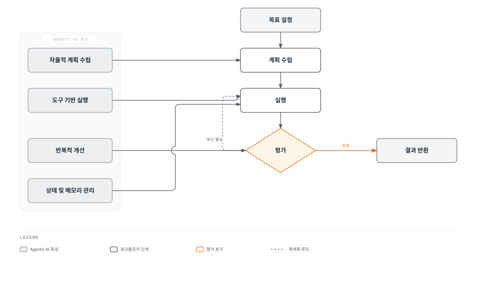
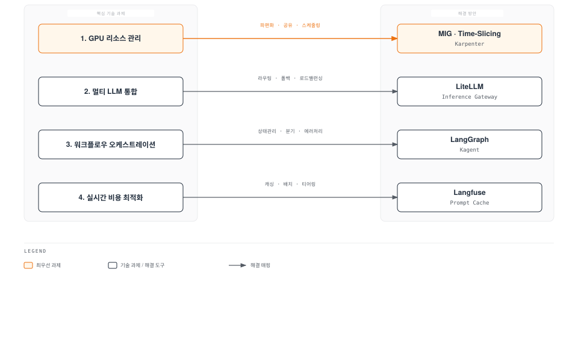
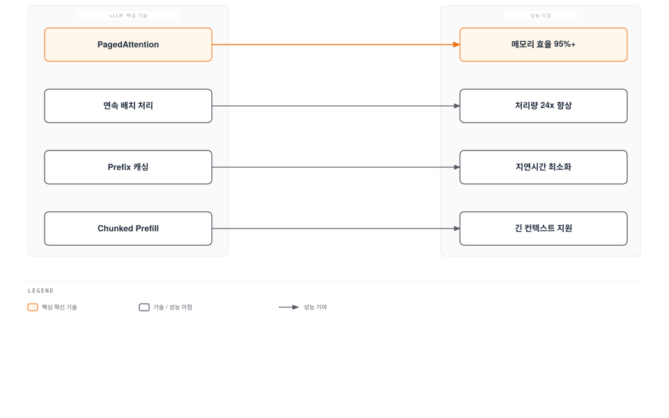
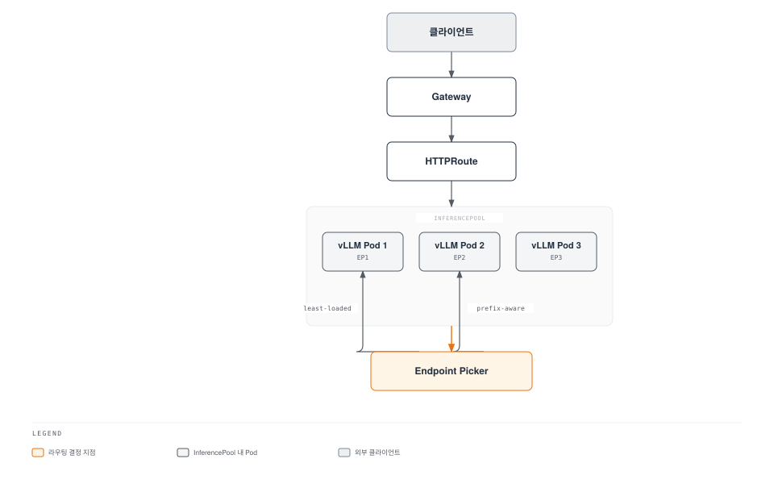
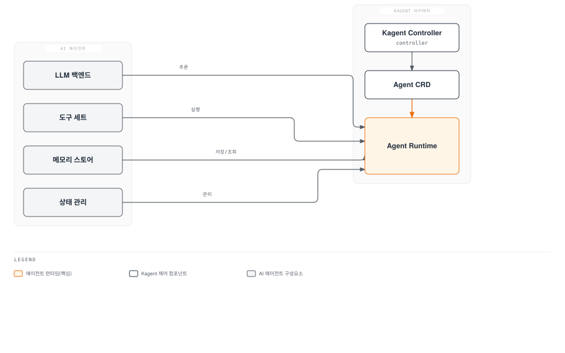

# EKS 기반 Agentic AI 플랫폼 구축

> **지원 버전**: EKS 1.31+, vLLM 0.6+, Karpenter 1.0+
> **마지막 업데이트**: 2026년 2월 23일

Agentic AI는 단순한 질의응답을 넘어 자율적으로 계획을 세우고, 도구를 사용하며, 반복적으로 목표를 달성하는 AI 시스템입니다. 이 장에서는 EKS에서 프로덕션 수준의 Agentic AI 플랫폼을 구축하는 방법을 알아보겠습니다.

## 1. Agentic AI 플랫폼 개요

### Agentic AI란?

Agentic AI는 다음과 같은 특성을 가진 자율적 AI 시스템입니다:



1. **자율적 계획 수립**: 복잡한 작업을 하위 작업으로 분해하고 실행 순서를 결정합니다.
2. **도구 기반 실행**: 외부 API, 데이터베이스, 코드 실행기 등 다양한 도구를 활용합니다.
3. **반복적 개선**: 실행 결과를 평가하고 필요시 계획을 수정합니다.
4. **상태 관리**: 장기 실행 작업에서 상태와 메모리를 유지합니다.

### Kubernetes가 필요한 이유

Agentic AI 플랫폼에서 Kubernetes는 다음과 같은 핵심 기능을 제공합니다:

| 요구사항 | Kubernetes 솔루션 |
|---------|------------------|
| GPU 오케스트레이션 | Device Plugin, GPU Operator, MIG |
| 자동 스케일링 | HPA, VPA, Karpenter |
| 멀티 테넌트 격리 | Namespace, NetworkPolicy, ResourceQuota |
| 고가용성 | ReplicaSet, PodDisruptionBudget |
| 서비스 메시 | Istio, Gateway API |
| 비용 최적화 | Spot 인스턴스, 노드 통합 |

### 네 가지 핵심 기술 과제

Agentic AI 플랫폼 구축 시 해결해야 할 핵심 과제:



---

## 2. GPU 인프라 구성

### GPU 인스턴스 유형 비교

AWS에서 제공하는 주요 GPU 인스턴스 유형:

| 인스턴스 | GPU | GPU 메모리 | 사용 사례 | 시간당 비용 (On-Demand) |
|---------|-----|----------|----------|---------------------|
| **p5.48xlarge** | 8x H100 | 640GB | 대규모 훈련, 초대형 모델 추론 | ~$98.32 |
| **p4d.24xlarge** | 8x A100 | 320GB | 분산 훈련, 70B+ 모델 추론 | ~$32.77 |
| **g5.xlarge** | 1x A10G | 24GB | 중소형 모델 추론 | ~$1.01 |
| **g5.48xlarge** | 8x A10G | 192GB | 다중 모델 서빙 | ~$16.29 |
| **g6.xlarge** | 1x L4 | 24GB | 비용 효율적 추론 | ~$0.80 |
| **g6.48xlarge** | 8x L4 | 192GB | 대규모 추론 클러스터 | ~$13.35 |
| **inf2.xlarge** | 1x Inferentia2 | 32GB | AWS 최적화 추론 | ~$0.76 |

### Multi-Instance GPU (MIG) 구성

NVIDIA A100/H100 GPU는 MIG를 통해 물리적으로 분할하여 여러 워크로드를 격리할 수 있습니다.

#### MIG 프로파일 (A100 80GB 기준)

| 프로파일 | GPU 메모리 | SM 수 | 사용 사례 |
|---------|----------|-------|----------|
| 1g.10gb | 10GB | 14 | 소형 모델 추론, 개발 |
| 2g.20gb | 20GB | 28 | 7B 모델 추론 |
| 3g.40gb | 40GB | 42 | 13B 모델 추론 |
| 4g.40gb | 40GB | 56 | 대용량 배치 추론 |
| 7g.80gb | 80GB | 98 | 70B 모델, 훈련 |

#### NVIDIA GPU Operator 배포

```yaml
# gpu-operator-values.yaml
apiVersion: v1
kind: ConfigMap
metadata:
  name: gpu-operator-config
  namespace: gpu-operator
data:
  mig.strategy: "mixed"  # single 또는 mixed
---
apiVersion: helm.toolkit.fluxcd.io/v2
kind: HelmRelease
metadata:
  name: gpu-operator
  namespace: gpu-operator
spec:
  interval: 10m
  chart:
    spec:
      chart: gpu-operator
      version: "v24.9.0"
      sourceRef:
        kind: HelmRepository
        name: nvidia
        namespace: flux-system
  values:
    operator:
      defaultRuntime: containerd
    mig:
      strategy: mixed
    devicePlugin:
      enabled: true
      config:
        name: time-slicing-config
        default: any
    gfd:
      enabled: true
    dcgmExporter:
      enabled: true
      serviceMonitor:
        enabled: true
```

```bash
# GPU Operator 설치
helm repo add nvidia https://helm.ngc.nvidia.com/nvidia
helm repo update

helm install gpu-operator nvidia/gpu-operator \
  --namespace gpu-operator \
  --create-namespace \
  --values gpu-operator-values.yaml

# MIG 설정 확인
kubectl get nodes -l nvidia.com/mig.capable=true \
  -o jsonpath='{range .items[*]}{.metadata.name}: {.status.allocatable}{"\n"}{end}'
```

#### MIG 파티션 구성

```yaml
# mig-config.yaml
apiVersion: v1
kind: ConfigMap
metadata:
  name: mig-parted-config
  namespace: gpu-operator
data:
  config.yaml: |
    version: v1
    mig-configs:
      # 개발 환경: 작은 파티션으로 많은 사용자 지원
      development:
        - devices: [0]
          mig-enabled: true
          mig-devices:
            "1g.10gb": 7

      # 프로덕션: 중간 크기 파티션
      production-inference:
        - devices: [0]
          mig-enabled: true
          mig-devices:
            "2g.20gb": 3
            "1g.10gb": 1

      # 대규모 모델: 전체 GPU 사용
      large-model:
        - devices: [0]
          mig-enabled: true
          mig-devices:
            "7g.80gb": 1
```

### Time-Slicing 구성

MIG를 지원하지 않는 GPU(A10G, L4 등)에서는 Time-Slicing으로 GPU를 공유할 수 있습니다.

```yaml
# time-slicing-config.yaml
apiVersion: v1
kind: ConfigMap
metadata:
  name: time-slicing-config
  namespace: gpu-operator
data:
  any: |
    version: v1
    flags:
      migStrategy: none
    sharing:
      timeSlicing:
        renameByDefault: false
        failRequestsGreaterThanOne: false
        resources:
          - name: nvidia.com/gpu
            replicas: 4  # 하나의 GPU를 4개로 분할
---
# 노드에 Time-Slicing 적용
apiVersion: v1
kind: Node
metadata:
  name: gpu-node-1
  labels:
    nvidia.com/device-plugin.config: time-slicing-config
```

#### MIG vs Time-Slicing 비교

| 특성 | MIG | Time-Slicing |
|-----|-----|-------------|
| **격리 수준** | 하드웨어 격리 (메모리, SM) | 소프트웨어 격리 (시간 분할) |
| **지원 GPU** | A100, H100 | 모든 NVIDIA GPU |
| **메모리 보장** | 보장됨 | 공유 (경합 가능) |
| **오버헤드** | 낮음 | 컨텍스트 스위칭 오버헤드 |
| **유연성** | 재구성 필요 | 동적 조정 가능 |
| **사용 사례** | 프로덕션, 멀티테넌트 | 개발, 배치 처리 |

### Karpenter NodePool 구성

```yaml
# gpu-nodepool.yaml
apiVersion: karpenter.sh/v1
kind: NodePool
metadata:
  name: gpu-inference
spec:
  template:
    metadata:
      labels:
        workload-type: inference
    spec:
      requirements:
        - key: kubernetes.io/arch
          operator: In
          values: ["amd64"]
        - key: karpenter.sh/capacity-type
          operator: In
          values: ["on-demand", "spot"]
        - key: node.kubernetes.io/instance-type
          operator: In
          values:
            - g5.xlarge
            - g5.2xlarge
            - g5.4xlarge
            - g6.xlarge
            - g6.2xlarge
        - key: "karpenter.k8s.aws/instance-gpu-count"
          operator: Gt
          values: ["0"]
      nodeClassRef:
        group: karpenter.k8s.aws
        kind: EC2NodeClass
        name: gpu-nodes
      taints:
        - key: nvidia.com/gpu
          value: "true"
          effect: NoSchedule
  limits:
    nvidia.com/gpu: 100
  disruption:
    consolidationPolicy: WhenEmptyOrUnderutilized
    consolidateAfter: 5m
    budgets:
      - nodes: "20%"
---
apiVersion: karpenter.k8s.aws/v1
kind: EC2NodeClass
metadata:
  name: gpu-nodes
spec:
  amiFamily: AL2023
  role: KarpenterNodeRole-${CLUSTER_NAME}
  subnetSelectorTerms:
    - tags:
        karpenter.sh/discovery: ${CLUSTER_NAME}
  securityGroupSelectorTerms:
    - tags:
        karpenter.sh/discovery: ${CLUSTER_NAME}
  blockDeviceMappings:
    - deviceName: /dev/xvda
      ebs:
        volumeSize: 200Gi
        volumeType: gp3
        iops: 10000
        throughput: 500
        deleteOnTermination: true
  tags:
    Environment: production
    Workload: ai-inference
```

---

## 3. 모델 서빙 (vLLM)

### vLLM 아키텍처

vLLM은 다음과 같은 핵심 기술로 고성능 LLM 추론을 제공합니다:



### vLLM Deployment 구성

```yaml
# vllm-deployment.yaml
apiVersion: apps/v1
kind: Deployment
metadata:
  name: vllm-llama3-70b
  namespace: ai-inference
  labels:
    app: vllm
    model: llama3-70b
spec:
  replicas: 2
  selector:
    matchLabels:
      app: vllm
      model: llama3-70b
  template:
    metadata:
      labels:
        app: vllm
        model: llama3-70b
    spec:
      nodeSelector:
        workload-type: inference
      tolerations:
        - key: nvidia.com/gpu
          operator: Equal
          value: "true"
          effect: NoSchedule
      containers:
        - name: vllm
          image: vllm/vllm-openai:v0.6.4
          ports:
            - containerPort: 8000
              name: http
          env:
            - name: HUGGING_FACE_HUB_TOKEN
              valueFrom:
                secretKeyRef:
                  name: huggingface-token
                  key: token
            - name: VLLM_ATTENTION_BACKEND
              value: "FLASH_ATTN"
          args:
            - "--model"
            - "meta-llama/Meta-Llama-3-70B-Instruct"
            - "--tensor-parallel-size"
            - "4"
            - "--gpu-memory-utilization"
            - "0.95"
            - "--max-model-len"
            - "8192"
            - "--enable-prefix-caching"
            - "--enable-chunked-prefill"
            - "--max-num-batched-tokens"
            - "32768"
            - "--trust-remote-code"
          resources:
            requests:
              nvidia.com/gpu: 4
              memory: "200Gi"
              cpu: "32"
            limits:
              nvidia.com/gpu: 4
              memory: "250Gi"
              cpu: "48"
          readinessProbe:
            httpGet:
              path: /health
              port: 8000
            initialDelaySeconds: 300
            periodSeconds: 10
            timeoutSeconds: 5
            failureThreshold: 3
          livenessProbe:
            httpGet:
              path: /health
              port: 8000
            initialDelaySeconds: 600
            periodSeconds: 30
            timeoutSeconds: 10
            failureThreshold: 3
          volumeMounts:
            - name: model-cache
              mountPath: /root/.cache/huggingface
            - name: shm
              mountPath: /dev/shm
      volumes:
        - name: model-cache
          persistentVolumeClaim:
            claimName: model-cache-pvc
        - name: shm
          emptyDir:
            medium: Memory
            sizeLimit: 64Gi
---
apiVersion: v1
kind: Service
metadata:
  name: vllm-llama3-70b
  namespace: ai-inference
spec:
  selector:
    app: vllm
    model: llama3-70b
  ports:
    - port: 8000
      targetPort: 8000
      name: http
  type: ClusterIP
```

### 성능 최적화 설정

#### Tensor Parallelism

대규모 모델을 여러 GPU에 분산:

```yaml
# 모델 크기별 권장 설정
# 7B 모델: 1 GPU
# 13B 모델: 1-2 GPU
# 70B 모델: 4 GPU (A100) 또는 8 GPU (A10G)
# 405B 모델: 8 GPU (H100)

args:
  - "--tensor-parallel-size"
  - "4"  # GPU 수에 맞게 조정
```

#### KV Cache 관리

```yaml
args:
  # GPU 메모리의 95%를 KV 캐시에 할당
  - "--gpu-memory-utilization"
  - "0.95"

  # 블록 크기 설정 (기본값: 16)
  - "--block-size"
  - "16"

  # 스왑 공간 설정 (CPU 메모리)
  - "--swap-space"
  - "32"  # GB 단위
```

#### Prefix Caching

반복되는 시스템 프롬프트에 대한 캐싱:

```yaml
args:
  - "--enable-prefix-caching"

# 효과: 동일한 시스템 프롬프트를 사용하는 요청의
# 첫 번째 토큰 생성 시간(TTFT)을 50-80% 단축
```

#### Chunked Prefill

긴 컨텍스트 처리 최적화:

```yaml
args:
  - "--enable-chunked-prefill"
  - "--max-num-batched-tokens"
  - "32768"

# 효과: 긴 프롬프트와 짧은 프롬프트가 혼합된
# 워크로드에서 응답 지연시간 안정화
```

### 모델 서빙 패턴

#### 단일 모델 Pod

```yaml
# 가장 단순한 패턴: 하나의 Pod에서 하나의 모델 서빙
spec:
  containers:
    - name: vllm
      args:
        - "--model"
        - "meta-llama/Meta-Llama-3-8B-Instruct"
```

#### llm-d를 활용한 분리 서빙

Prefill과 Decode를 분리하여 최적화:

```yaml
# llm-d-prefill.yaml
apiVersion: apps/v1
kind: Deployment
metadata:
  name: llm-d-prefill
spec:
  replicas: 2
  template:
    spec:
      containers:
        - name: llm-d
          image: llm-d/prefill:latest
          args:
            - "--role"
            - "prefill"
            - "--model"
            - "meta-llama/Meta-Llama-3-70B-Instruct"
          resources:
            requests:
              nvidia.com/gpu: 4
---
# llm-d-decode.yaml
apiVersion: apps/v1
kind: Deployment
metadata:
  name: llm-d-decode
spec:
  replicas: 4
  template:
    spec:
      containers:
        - name: llm-d
          image: llm-d/decode:latest
          args:
            - "--role"
            - "decode"
            - "--prefill-endpoint"
            - "http://llm-d-prefill:8000"
          resources:
            requests:
              nvidia.com/gpu: 2
```

---

## 4. 추론 게이트웨이 (Inference Gateway)

### Gateway API 기반 AI 워크로드 라우팅

Kubernetes Gateway API를 확장하여 AI 추론 워크로드를 효율적으로 라우팅합니다.

### Kgateway + InferencePool 아키텍처



#### InferencePool CRD

```yaml
# inferencepool.yaml
apiVersion: inference.networking.x-k8s.io/v1alpha1
kind: InferencePool
metadata:
  name: llama3-pool
  namespace: ai-inference
spec:
  targetPortNumber: 8000
  selector:
    matchLabels:
      app: vllm
      model: llama3-70b
  endpointPickerConfig:
    # 로드 밸런싱 전략
    extensionRef:
      name: prefix-aware-picker
      group: inference.networking.x-k8s.io
      kind: EndpointPicker
---
apiVersion: inference.networking.x-k8s.io/v1alpha1
kind: EndpointPicker
metadata:
  name: prefix-aware-picker
  namespace: ai-inference
spec:
  type: PrefixAware
  config:
    # Prefix 캐시 히트율 최적화
    prefixHashBuckets: 1024
    fallbackStrategy: LeastLoaded
    loadMetric: pending_requests
---
apiVersion: gateway.networking.k8s.io/v1
kind: HTTPRoute
metadata:
  name: llama3-route
  namespace: ai-inference
spec:
  parentRefs:
    - name: ai-gateway
      namespace: ai-inference
  rules:
    - matches:
        - path:
            type: PathPrefix
            value: /v1/chat/completions
          headers:
            - name: x-model
              value: llama3-70b
      backendRefs:
        - group: inference.networking.x-k8s.io
          kind: InferencePool
          name: llama3-pool
          port: 8000
```

### LiteLLM 통합 게이트웨이

LiteLLM은 다양한 LLM 프로바이더를 단일 API로 통합합니다.

```yaml
# litellm-deployment.yaml
apiVersion: apps/v1
kind: Deployment
metadata:
  name: litellm-gateway
  namespace: ai-gateway
spec:
  replicas: 3
  selector:
    matchLabels:
      app: litellm
  template:
    metadata:
      labels:
        app: litellm
    spec:
      containers:
        - name: litellm
          image: ghcr.io/berriai/litellm:main-v1.55.0
          ports:
            - containerPort: 4000
          env:
            - name: LITELLM_MASTER_KEY
              valueFrom:
                secretKeyRef:
                  name: litellm-secrets
                  key: master-key
            - name: DATABASE_URL
              valueFrom:
                secretKeyRef:
                  name: litellm-secrets
                  key: database-url
          volumeMounts:
            - name: config
              mountPath: /app/config.yaml
              subPath: config.yaml
          resources:
            requests:
              cpu: "2"
              memory: "4Gi"
            limits:
              cpu: "4"
              memory: "8Gi"
      volumes:
        - name: config
          configMap:
            name: litellm-config
---
apiVersion: v1
kind: ConfigMap
metadata:
  name: litellm-config
  namespace: ai-gateway
data:
  config.yaml: |
    model_list:
      # 내부 vLLM 엔드포인트
      - model_name: llama3-70b
        litellm_params:
          model: openai/meta-llama/Meta-Llama-3-70B-Instruct
          api_base: http://vllm-llama3-70b.ai-inference:8000/v1
          api_key: dummy
        model_info:
          max_tokens: 8192
          input_cost_per_token: 0.0000001
          output_cost_per_token: 0.0000003

      - model_name: llama3-8b
        litellm_params:
          model: openai/meta-llama/Meta-Llama-3-8B-Instruct
          api_base: http://vllm-llama3-8b.ai-inference:8000/v1
          api_key: dummy
        model_info:
          max_tokens: 8192
          input_cost_per_token: 0.00000005
          output_cost_per_token: 0.00000015

      # 외부 프로바이더 (폴백용)
      - model_name: gpt-4o
        litellm_params:
          model: gpt-4o
          api_key: os.environ/OPENAI_API_KEY
        model_info:
          max_tokens: 128000
          input_cost_per_token: 0.000005
          output_cost_per_token: 0.000015

      - model_name: claude-3-5-sonnet
        litellm_params:
          model: anthropic/claude-3-5-sonnet-20241022
          api_key: os.environ/ANTHROPIC_API_KEY
        model_info:
          max_tokens: 200000
          input_cost_per_token: 0.000003
          output_cost_per_token: 0.000015

    # 라우팅 설정
    router_settings:
      routing_strategy: usage-based-routing-v2
      enable_pre_call_checks: true
      redis_host: redis.ai-gateway
      redis_port: 6379

    # 폴백 설정
    litellm_settings:
      fallbacks:
        - model: llama3-70b
          fallback_models:
            - gpt-4o
            - claude-3-5-sonnet

      # 재시도 설정
      num_retries: 3
      request_timeout: 300

      # 비용 추적
      success_callback: ["langfuse"]
      failure_callback: ["langfuse"]
---
apiVersion: v1
kind: Service
metadata:
  name: litellm-gateway
  namespace: ai-gateway
spec:
  selector:
    app: litellm
  ports:
    - port: 4000
      targetPort: 4000
  type: ClusterIP
```

#### LiteLLM 사용 예시

```python
# litellm_client.py
from openai import OpenAI

# LiteLLM 게이트웨이 사용
client = OpenAI(
    api_key="sk-litellm-master-key",
    base_url="http://litellm-gateway.ai-gateway:4000/v1"
)

# 내부 모델 호출 (자동 라우팅)
response = client.chat.completions.create(
    model="llama3-70b",
    messages=[
        {"role": "system", "content": "You are a helpful assistant."},
        {"role": "user", "content": "Explain Kubernetes in simple terms."}
    ],
    max_tokens=500
)

print(response.choices[0].message.content)

# 폴백이 필요한 경우 자동으로 외부 프로바이더 사용
# (llama3-70b 실패 시 gpt-4o -> claude-3-5-sonnet 순서로 시도)
```

---

## 5. RAG 데이터 레이어

### Milvus 벡터 데이터베이스

Milvus는 대규모 벡터 검색을 위한 오픈소스 데이터베이스입니다.

#### Milvus Operator 배포

```bash
# Milvus Operator 설치
helm repo add milvus https://zilliztech.github.io/milvus-helm
helm repo update

helm install milvus-operator milvus/milvus-operator \
  --namespace milvus-system \
  --create-namespace
```

```yaml
# milvus-cluster.yaml
apiVersion: milvus.io/v1beta1
kind: Milvus
metadata:
  name: milvus-cluster
  namespace: ai-data
spec:
  mode: cluster
  dependencies:
    etcd:
      inCluster:
        values:
          replicaCount: 3
          persistence:
            enabled: true
            size: 50Gi
    pulsar:
      inCluster:
        values:
          components:
            autorecovery: false
          proxy:
            replicaCount: 2
          broker:
            replicaCount: 2
    storage:
      inCluster:
        values:
          mode: distributed
          fullnameOverride: milvus-minio
          persistence:
            enabled: true
            size: 500Gi
  components:
    # Query Node - 벡터 검색 처리
    queryNode:
      replicas: 3
      resources:
        requests:
          cpu: "4"
          memory: "16Gi"
        limits:
          cpu: "8"
          memory: "32Gi"

    # Index Node - 인덱스 빌드 (GPU 가속)
    indexNode:
      replicas: 2
      resources:
        requests:
          cpu: "4"
          memory: "16Gi"
          nvidia.com/gpu: 1
        limits:
          cpu: "8"
          memory: "32Gi"
          nvidia.com/gpu: 1

    # Data Node - 데이터 처리
    dataNode:
      replicas: 2
      resources:
        requests:
          cpu: "2"
          memory: "8Gi"
        limits:
          cpu: "4"
          memory: "16Gi"

    # Proxy - API 게이트웨이
    proxy:
      replicas: 2
      serviceType: ClusterIP
      resources:
        requests:
          cpu: "2"
          memory: "4Gi"
        limits:
          cpu: "4"
          memory: "8Gi"
  config:
    common:
      gracefulTime: 30000
    queryNode:
      gracefulTime: 30000
```

#### 컬렉션 스키마 설계

```python
# milvus_schema.py
from pymilvus import (
    connections, Collection, FieldSchema,
    CollectionSchema, DataType, utility
)

# Milvus 연결
connections.connect(
    alias="default",
    host="milvus-cluster-proxy.ai-data",
    port="19530"
)

# 문서 컬렉션 스키마
fields = [
    FieldSchema(name="id", dtype=DataType.VARCHAR, max_length=64, is_primary=True),
    FieldSchema(name="content", dtype=DataType.VARCHAR, max_length=65535),
    FieldSchema(name="embedding", dtype=DataType.FLOAT_VECTOR, dim=1536),
    FieldSchema(name="metadata", dtype=DataType.JSON),
    FieldSchema(name="created_at", dtype=DataType.INT64),
]

schema = CollectionSchema(
    fields=fields,
    description="Document embeddings for RAG"
)

# 컬렉션 생성
collection = Collection(
    name="documents",
    schema=schema,
    using="default"
)

# 인덱스 생성
index_params = {
    "metric_type": "COSINE",
    "index_type": "HNSW",  # 또는 GPU_IVF_FLAT for GPU 가속
    "params": {
        "M": 16,
        "efConstruction": 256
    }
}

collection.create_index(
    field_name="embedding",
    index_params=index_params
)

# 컬렉션 로드
collection.load()
```

#### 인덱스 유형 비교

| 인덱스 유형 | 특성 | 메모리 사용 | 검색 속도 | 사용 사례 |
|-----------|-----|-----------|----------|----------|
| **FLAT** | 정확한 검색 | 높음 | 느림 | 소규모, 정확도 우선 |
| **IVF_FLAT** | 클러스터 기반 | 중간 | 빠름 | 일반적인 사용 |
| **HNSW** | 그래프 기반 | 높음 | 매우 빠름 | 대규모, 속도 우선 |
| **GPU_IVF_FLAT** | GPU 가속 | 중간 | 매우 빠름 | 초대규모, GPU 사용 |
| **SCANN** | 양자화 기반 | 낮음 | 빠름 | 메모리 제한 환경 |

### 문서 수집 파이프라인

```yaml
# document-ingestion-job.yaml
apiVersion: batch/v1
kind: Job
metadata:
  name: document-ingestion
  namespace: ai-data
spec:
  template:
    spec:
      containers:
        - name: ingestion
          image: ai-platform/document-ingestion:latest
          env:
            - name: S3_BUCKET
              value: "my-documents-bucket"
            - name: MILVUS_HOST
              value: "milvus-cluster-proxy.ai-data"
            - name: EMBEDDING_MODEL
              value: "text-embedding-3-large"
            - name: OPENAI_API_KEY
              valueFrom:
                secretKeyRef:
                  name: openai-credentials
                  key: api-key
          resources:
            requests:
              cpu: "4"
              memory: "16Gi"
            limits:
              cpu: "8"
              memory: "32Gi"
          volumeMounts:
            - name: temp-storage
              mountPath: /tmp/documents
      volumes:
        - name: temp-storage
          emptyDir:
            sizeLimit: 100Gi
      restartPolicy: OnFailure
```

#### 청킹 전략 구현

```python
# chunking_strategies.py
from langchain.text_splitter import (
    RecursiveCharacterTextSplitter,
    TokenTextSplitter
)
from langchain_experimental.text_splitter import SemanticChunker
from langchain_openai import OpenAIEmbeddings

# 1. 고정 크기 청킹
def fixed_chunking(text: str, chunk_size: int = 1000, overlap: int = 200):
    splitter = RecursiveCharacterTextSplitter(
        chunk_size=chunk_size,
        chunk_overlap=overlap,
        separators=["\n\n", "\n", ".", "!", "?", ",", " ", ""]
    )
    return splitter.split_text(text)

# 2. 토큰 기반 청킹 (LLM 컨텍스트 윈도우 최적화)
def token_chunking(text: str, chunk_size: int = 512, overlap: int = 50):
    splitter = TokenTextSplitter(
        encoding_name="cl100k_base",  # GPT-4 토크나이저
        chunk_size=chunk_size,
        chunk_overlap=overlap
    )
    return splitter.split_text(text)

# 3. 의미론적 청킹 (문맥 유지 최적화)
def semantic_chunking(text: str):
    embeddings = OpenAIEmbeddings(model="text-embedding-3-small")
    splitter = SemanticChunker(
        embeddings=embeddings,
        breakpoint_threshold_type="percentile",
        breakpoint_threshold_amount=95
    )
    return splitter.split_text(text)

# 권장: 문서 유형별 전략 선택
CHUNKING_STRATEGIES = {
    "code": {"strategy": "fixed", "chunk_size": 2000, "overlap": 400},
    "documentation": {"strategy": "semantic"},
    "chat_logs": {"strategy": "fixed", "chunk_size": 500, "overlap": 100},
    "default": {"strategy": "token", "chunk_size": 512, "overlap": 50}
}
```

### RAG 워크플로우

```python
# rag_workflow.py
from langchain_openai import ChatOpenAI, OpenAIEmbeddings
from langchain_milvus import Milvus
from langchain.chains import RetrievalQA
from langchain.prompts import PromptTemplate

# 벡터 스토어 연결
embeddings = OpenAIEmbeddings(model="text-embedding-3-large")
vectorstore = Milvus(
    embedding_function=embeddings,
    collection_name="documents",
    connection_args={
        "host": "milvus-cluster-proxy.ai-data",
        "port": "19530"
    }
)

# RAG 프롬프트 템플릿
RAG_PROMPT = PromptTemplate(
    template="""다음 컨텍스트를 사용하여 질문에 답하세요.
컨텍스트에서 답을 찾을 수 없으면 "정보가 없습니다"라고 답하세요.

컨텍스트:
{context}

질문: {question}

답변:""",
    input_variables=["context", "question"]
)

# LLM 설정 (LiteLLM 게이트웨이 사용)
llm = ChatOpenAI(
    model="llama3-70b",
    openai_api_base="http://litellm-gateway.ai-gateway:4000/v1",
    openai_api_key="sk-litellm-master-key",
    temperature=0.1
)

# RAG 체인 구성
qa_chain = RetrievalQA.from_chain_type(
    llm=llm,
    chain_type="stuff",
    retriever=vectorstore.as_retriever(
        search_type="mmr",
        search_kwargs={"k": 5, "fetch_k": 20}
    ),
    chain_type_kwargs={"prompt": RAG_PROMPT},
    return_source_documents=True
)

# 질의 실행
result = qa_chain.invoke({"query": "Kubernetes에서 Pod 스케줄링은 어떻게 동작하나요?"})
print(result["result"])
```

---

## 6. AI 에이전트 배포 (Kagent)

### Kagent 개요

Kagent는 Kubernetes 네이티브 AI 에이전트 라이프사이클 관리 도구입니다.



### Agent CRD 정의

```yaml
# agent-crd.yaml
apiVersion: kagent.dev/v1alpha1
kind: Agent
metadata:
  name: research-agent
  namespace: ai-agents
spec:
  # LLM 백엔드 설정
  llm:
    provider: litellm
    model: llama3-70b
    endpoint: http://litellm-gateway.ai-gateway:4000/v1
    temperature: 0.7
    maxTokens: 4096

  # 에이전트 시스템 프롬프트
  systemPrompt: |
    You are a research assistant that helps users find and analyze information.
    You have access to the following tools:
    - web_search: Search the web for information
    - document_search: Search internal documents
    - calculator: Perform calculations

    Always cite your sources and provide accurate information.

  # 도구 정의
  tools:
    - name: web_search
      type: http
      spec:
        url: http://search-api.tools:8080/search
        method: POST
        headers:
          Content-Type: application/json

    - name: document_search
      type: milvus
      spec:
        host: milvus-cluster-proxy.ai-data
        port: 19530
        collection: documents
        topK: 5

    - name: calculator
      type: python
      spec:
        code: |
          def calculate(expression: str) -> str:
              return str(eval(expression))

  # 메모리 설정
  memory:
    type: redis
    config:
      host: redis.ai-agents
      port: 6379
      ttl: 3600

  # 리소스 제한
  resources:
    requests:
      cpu: "500m"
      memory: "512Mi"
    limits:
      cpu: "2"
      memory: "2Gi"

  # 스케일링 설정
  replicas: 2
  autoscaling:
    enabled: true
    minReplicas: 2
    maxReplicas: 10
    targetCPUUtilization: 70
```

### LangGraph 워크플로우 오케스트레이션

LangGraph를 사용하여 복잡한 AI 워크플로우를 구현합니다.

```python
# langgraph_workflow.py
from typing import TypedDict, Annotated, Sequence
from langchain_core.messages import BaseMessage, HumanMessage, AIMessage
from langchain_openai import ChatOpenAI
from langgraph.graph import StateGraph, END
from langgraph.prebuilt import ToolExecutor
import operator

# 상태 정의
class AgentState(TypedDict):
    messages: Annotated[Sequence[BaseMessage], operator.add]
    current_step: str
    iteration: int
    max_iterations: int
    tools_output: dict

# LLM 설정
llm = ChatOpenAI(
    model="llama3-70b",
    openai_api_base="http://litellm-gateway.ai-gateway:4000/v1",
    openai_api_key="sk-litellm-master-key"
)

# 노드 함수들
def planner(state: AgentState) -> AgentState:
    """작업 계획을 수립하는 노드"""
    messages = state["messages"]

    planning_prompt = """Based on the user's request, create a step-by-step plan.
    Format your response as a numbered list of steps."""

    response = llm.invoke(messages + [HumanMessage(content=planning_prompt)])

    return {
        "messages": [response],
        "current_step": "execute",
        "iteration": state["iteration"]
    }

def executor(state: AgentState) -> AgentState:
    """계획을 실행하는 노드"""
    messages = state["messages"]

    execution_prompt = """Execute the current step of the plan.
    If you need to use a tool, specify the tool and parameters."""

    response = llm.invoke(messages + [HumanMessage(content=execution_prompt)])

    return {
        "messages": [response],
        "current_step": "evaluate",
        "iteration": state["iteration"]
    }

def evaluator(state: AgentState) -> AgentState:
    """결과를 평가하는 노드"""
    messages = state["messages"]

    evaluation_prompt = """Evaluate the execution result.
    Respond with either:
    - COMPLETE: if the task is fully done
    - CONTINUE: if more steps are needed
    - RETRY: if the current step needs to be retried"""

    response = llm.invoke(messages + [HumanMessage(content=evaluation_prompt)])

    return {
        "messages": [response],
        "current_step": "route",
        "iteration": state["iteration"] + 1
    }

def router(state: AgentState) -> str:
    """다음 단계를 결정하는 라우터"""
    last_message = state["messages"][-1].content.upper()

    if state["iteration"] >= state["max_iterations"]:
        return "end"

    if "COMPLETE" in last_message:
        return "end"
    elif "RETRY" in last_message:
        return "execute"
    else:
        return "plan"

# 그래프 구성
workflow = StateGraph(AgentState)

# 노드 추가
workflow.add_node("plan", planner)
workflow.add_node("execute", executor)
workflow.add_node("evaluate", evaluator)

# 엣지 추가
workflow.set_entry_point("plan")
workflow.add_edge("plan", "execute")
workflow.add_edge("execute", "evaluate")
workflow.add_conditional_edges(
    "evaluate",
    router,
    {
        "plan": "plan",
        "execute": "execute",
        "end": END
    }
)

# 그래프 컴파일
app = workflow.compile()

# 실행
initial_state = {
    "messages": [HumanMessage(content="Research the latest trends in Kubernetes security")],
    "current_step": "plan",
    "iteration": 0,
    "max_iterations": 5,
    "tools_output": {}
}

result = app.invoke(initial_state)
```

### 멀티 에이전트 협업 패턴

#### Supervisor 패턴

```python
# supervisor_pattern.py
from langgraph.graph import StateGraph, END
from typing import TypedDict, Literal

class SupervisorState(TypedDict):
    messages: list
    next_agent: str
    task_status: dict

def supervisor(state: SupervisorState) -> SupervisorState:
    """작업을 적절한 에이전트에게 위임하는 수퍼바이저"""

    supervisor_prompt = """You are a supervisor managing a team of agents:
    - researcher: Finds and analyzes information
    - coder: Writes and reviews code
    - writer: Creates documentation and reports

    Based on the current task, decide which agent should handle it next.
    Respond with the agent name or 'FINISH' if the task is complete."""

    response = llm.invoke(state["messages"] + [HumanMessage(content=supervisor_prompt)])
    next_agent = response.content.strip().lower()

    return {
        "messages": state["messages"] + [response],
        "next_agent": next_agent
    }

def researcher(state: SupervisorState) -> SupervisorState:
    """정보 수집 에이전트"""
    research_response = llm.invoke(
        state["messages"] +
        [HumanMessage(content="Research the topic and provide findings.")]
    )
    return {"messages": state["messages"] + [research_response]}

def coder(state: SupervisorState) -> SupervisorState:
    """코딩 에이전트"""
    code_response = llm.invoke(
        state["messages"] +
        [HumanMessage(content="Write or review code for the task.")]
    )
    return {"messages": state["messages"] + [code_response]}

def writer(state: SupervisorState) -> SupervisorState:
    """문서 작성 에이전트"""
    write_response = llm.invoke(
        state["messages"] +
        [HumanMessage(content="Create documentation or a report.")]
    )
    return {"messages": state["messages"] + [write_response]}

def route_to_agent(state: SupervisorState) -> Literal["researcher", "coder", "writer", "end"]:
    next_agent = state["next_agent"]
    if next_agent == "finish":
        return "end"
    return next_agent

# 그래프 구성
supervisor_graph = StateGraph(SupervisorState)

supervisor_graph.add_node("supervisor", supervisor)
supervisor_graph.add_node("researcher", researcher)
supervisor_graph.add_node("coder", coder)
supervisor_graph.add_node("writer", writer)

supervisor_graph.set_entry_point("supervisor")

supervisor_graph.add_conditional_edges(
    "supervisor",
    route_to_agent,
    {
        "researcher": "researcher",
        "coder": "coder",
        "writer": "writer",
        "end": END
    }
)

# 각 에이전트 작업 후 수퍼바이저로 복귀
for agent in ["researcher", "coder", "writer"]:
    supervisor_graph.add_edge(agent, "supervisor")

multi_agent_app = supervisor_graph.compile()
```

---

## 7. 모니터링과 운영

### Langfuse GenAI 관측성

Langfuse는 LLM 애플리케이션을 위한 관측성 플랫폼입니다.

```yaml
# langfuse-deployment.yaml
apiVersion: apps/v1
kind: Deployment
metadata:
  name: langfuse
  namespace: ai-monitoring
spec:
  replicas: 2
  selector:
    matchLabels:
      app: langfuse
  template:
    metadata:
      labels:
        app: langfuse
    spec:
      containers:
        - name: langfuse
          image: langfuse/langfuse:latest
          ports:
            - containerPort: 3000
          env:
            - name: DATABASE_URL
              valueFrom:
                secretKeyRef:
                  name: langfuse-secrets
                  key: database-url
            - name: NEXTAUTH_SECRET
              valueFrom:
                secretKeyRef:
                  name: langfuse-secrets
                  key: nextauth-secret
            - name: NEXTAUTH_URL
              value: "https://langfuse.example.com"
            - name: SALT
              valueFrom:
                secretKeyRef:
                  name: langfuse-secrets
                  key: salt
          resources:
            requests:
              cpu: "1"
              memory: "2Gi"
            limits:
              cpu: "2"
              memory: "4Gi"
---
apiVersion: v1
kind: Service
metadata:
  name: langfuse
  namespace: ai-monitoring
spec:
  selector:
    app: langfuse
  ports:
    - port: 3000
      targetPort: 3000
  type: ClusterIP
```

#### Langfuse 통합 코드

```python
# langfuse_integration.py
from langfuse import Langfuse
from langfuse.decorators import observe, langfuse_context
from openai import OpenAI

# Langfuse 클라이언트 초기화
langfuse = Langfuse(
    public_key="pk-lf-xxx",
    secret_key="sk-lf-xxx",
    host="http://langfuse.ai-monitoring:3000"
)

client = OpenAI(
    api_key="sk-litellm-master-key",
    base_url="http://litellm-gateway.ai-gateway:4000/v1"
)

@observe()
def rag_query(user_query: str, user_id: str = None) -> str:
    """RAG 쿼리를 Langfuse로 추적"""

    # 사용자 ID 설정
    langfuse_context.update_current_trace(
        user_id=user_id,
        tags=["rag", "production"]
    )

    # 문서 검색 (별도 스팬으로 추적)
    with langfuse_context.observe(name="document_retrieval") as span:
        documents = search_documents(user_query)
        span.update(
            input={"query": user_query},
            output={"doc_count": len(documents)},
            metadata={"retrieval_method": "mmr"}
        )

    # LLM 호출
    with langfuse_context.observe(name="llm_generation") as span:
        response = client.chat.completions.create(
            model="llama3-70b",
            messages=[
                {"role": "system", "content": "Answer based on the context."},
                {"role": "user", "content": f"Context: {documents}\n\nQuestion: {user_query}"}
            ],
            max_tokens=1000
        )

        answer = response.choices[0].message.content

        # 토큰 사용량 및 비용 추적
        span.update(
            input={"messages": messages},
            output={"response": answer},
            usage={
                "input": response.usage.prompt_tokens,
                "output": response.usage.completion_tokens,
                "total": response.usage.total_tokens
            },
            metadata={
                "model": "llama3-70b",
                "temperature": 0.7
            }
        )

    return answer

# 피드백 수집
def collect_feedback(trace_id: str, score: float, comment: str = None):
    """사용자 피드백을 Langfuse에 기록"""
    langfuse.score(
        trace_id=trace_id,
        name="user_feedback",
        value=score,
        comment=comment
    )
```

### GPU 모니터링 (DCGM)

```yaml
# dcgm-exporter.yaml
apiVersion: apps/v1
kind: DaemonSet
metadata:
  name: dcgm-exporter
  namespace: gpu-monitoring
spec:
  selector:
    matchLabels:
      app: dcgm-exporter
  template:
    metadata:
      labels:
        app: dcgm-exporter
    spec:
      nodeSelector:
        nvidia.com/gpu.present: "true"
      tolerations:
        - key: nvidia.com/gpu
          operator: Exists
          effect: NoSchedule
      containers:
        - name: dcgm-exporter
          image: nvcr.io/nvidia/k8s/dcgm-exporter:3.3.5-3.4.0-ubuntu22.04
          ports:
            - containerPort: 9400
              name: metrics
          env:
            - name: DCGM_EXPORTER_LISTEN
              value: ":9400"
            - name: DCGM_EXPORTER_KUBERNETES
              value: "true"
          securityContext:
            privileged: true
          volumeMounts:
            - name: pod-resources
              mountPath: /var/lib/kubelet/pod-resources
      volumes:
        - name: pod-resources
          hostPath:
            path: /var/lib/kubelet/pod-resources
---
apiVersion: v1
kind: Service
metadata:
  name: dcgm-exporter
  namespace: gpu-monitoring
  labels:
    app: dcgm-exporter
spec:
  selector:
    app: dcgm-exporter
  ports:
    - port: 9400
      targetPort: 9400
      name: metrics
  clusterIP: None
---
apiVersion: monitoring.coreos.com/v1
kind: ServiceMonitor
metadata:
  name: dcgm-exporter
  namespace: gpu-monitoring
spec:
  selector:
    matchLabels:
      app: dcgm-exporter
  endpoints:
    - port: metrics
      interval: 15s
```

#### 주요 GPU 메트릭

| 메트릭 | 설명 | 임계값 |
|-------|-----|-------|
| `DCGM_FI_DEV_GPU_UTIL` | GPU 사용률 | > 80% 정상 |
| `DCGM_FI_DEV_MEM_COPY_UTIL` | 메모리 대역폭 사용률 | > 70% 주의 |
| `DCGM_FI_DEV_FB_USED` | 프레임버퍼 사용량 | < 95% 권장 |
| `DCGM_FI_DEV_GPU_TEMP` | GPU 온도 | < 85C 권장 |
| `DCGM_FI_DEV_POWER_USAGE` | 전력 사용량 | TDP의 90% 이하 |
| `DCGM_FI_DEV_SM_CLOCK` | SM 클럭 속도 | 기본값 유지 |

### 비용 최적화 전략

#### 1. 프롬프트 캐싱

```python
# prompt_caching.py
import hashlib
import redis

redis_client = redis.Redis(host="redis.ai-cache", port=6379)

def get_cached_response(prompt: str, model: str) -> str | None:
    """캐시된 응답 조회"""
    cache_key = hashlib.sha256(f"{model}:{prompt}".encode()).hexdigest()
    cached = redis_client.get(cache_key)
    return cached.decode() if cached else None

def cache_response(prompt: str, model: str, response: str, ttl: int = 3600):
    """응답 캐싱"""
    cache_key = hashlib.sha256(f"{model}:{prompt}".encode()).hexdigest()
    redis_client.setex(cache_key, ttl, response)

def query_with_cache(prompt: str, model: str = "llama3-70b") -> str:
    """캐시를 활용한 쿼리"""
    # 캐시 확인
    cached = get_cached_response(prompt, model)
    if cached:
        return cached

    # LLM 호출
    response = client.chat.completions.create(
        model=model,
        messages=[{"role": "user", "content": prompt}]
    )
    result = response.choices[0].message.content

    # 결과 캐싱
    cache_response(prompt, model, result)
    return result
```

#### 2. 계층형 모델 선택

```python
# tiered_model_selection.py
from enum import Enum

class TaskComplexity(Enum):
    SIMPLE = "simple"      # 분류, 추출, 간단한 QA
    MODERATE = "moderate"  # 요약, 번역, 일반 대화
    COMPLEX = "complex"    # 분석, 추론, 코드 생성

MODEL_TIERS = {
    TaskComplexity.SIMPLE: {
        "model": "llama3-8b",
        "cost_per_1k_tokens": 0.0001
    },
    TaskComplexity.MODERATE: {
        "model": "llama3-70b",
        "cost_per_1k_tokens": 0.0005
    },
    TaskComplexity.COMPLEX: {
        "model": "gpt-4o",
        "cost_per_1k_tokens": 0.01
    }
}

def classify_task_complexity(task: str) -> TaskComplexity:
    """작업 복잡도 분류 (경량 모델 사용)"""
    classification_prompt = f"""Classify the complexity of this task as SIMPLE, MODERATE, or COMPLEX:
    Task: {task}

    SIMPLE: Classification, extraction, simple QA
    MODERATE: Summarization, translation, general conversation
    COMPLEX: Analysis, reasoning, code generation

    Respond with only the classification."""

    response = client.chat.completions.create(
        model="llama3-8b",  # 분류에는 작은 모델 사용
        messages=[{"role": "user", "content": classification_prompt}],
        max_tokens=10
    )

    classification = response.choices[0].message.content.strip().upper()
    return TaskComplexity[classification]

def execute_with_optimal_model(task: str) -> str:
    """최적의 모델로 작업 실행"""
    complexity = classify_task_complexity(task)
    model_config = MODEL_TIERS[complexity]

    response = client.chat.completions.create(
        model=model_config["model"],
        messages=[{"role": "user", "content": task}]
    )

    return response.choices[0].message.content
```

#### 3. 배치 처리

```yaml
# batch-processing-job.yaml
apiVersion: batch/v1
kind: CronJob
metadata:
  name: batch-inference
  namespace: ai-batch
spec:
  schedule: "0 2 * * *"  # 매일 새벽 2시
  jobTemplate:
    spec:
      template:
        spec:
          containers:
            - name: batch-processor
              image: ai-platform/batch-processor:latest
              env:
                - name: BATCH_SIZE
                  value: "100"
                - name: MODEL
                  value: "llama3-70b"
                - name: QUEUE_URL
                  value: "redis://redis.ai-batch:6379/0"
              resources:
                requests:
                  cpu: "4"
                  memory: "8Gi"
          restartPolicy: OnFailure
```

#### 4. Spot 인스턴스 활용

```yaml
# spot-nodepool.yaml
apiVersion: karpenter.sh/v1
kind: NodePool
metadata:
  name: gpu-spot
spec:
  template:
    spec:
      requirements:
        - key: karpenter.sh/capacity-type
          operator: In
          values: ["spot"]
        - key: node.kubernetes.io/instance-type
          operator: In
          values:
            - g5.xlarge
            - g5.2xlarge
            - g6.xlarge
      taints:
        - key: spot-instance
          value: "true"
          effect: NoSchedule
  limits:
    nvidia.com/gpu: 50
  disruption:
    consolidationPolicy: WhenEmpty
    consolidateAfter: 1m
```

---

## 8. 평가와 품질 관리

### Ragas 프레임워크

Ragas는 RAG 시스템의 품질을 평가하는 프레임워크입니다.

```python
# ragas_evaluation.py
from ragas import evaluate
from ragas.metrics import (
    faithfulness,
    answer_relevancy,
    context_precision,
    context_recall,
    answer_correctness
)
from datasets import Dataset

# 평가 데이터셋 구성
eval_data = {
    "question": [
        "Kubernetes Pod란 무엇인가요?",
        "HPA는 어떻게 동작하나요?"
    ],
    "answer": [
        "Pod는 Kubernetes에서 배포 가능한 가장 작은 컴퓨팅 단위입니다.",
        "HPA는 CPU 사용률을 기반으로 Pod 수를 자동으로 조정합니다."
    ],
    "contexts": [
        ["Pod는 하나 이상의 컨테이너 그룹입니다.", "Pod는 공유 스토리지와 네트워크를 가집니다."],
        ["HPA는 메트릭을 모니터링합니다.", "설정된 임계값에 따라 스케일링합니다."]
    ],
    "ground_truth": [
        "Pod는 Kubernetes에서 생성하고 관리할 수 있는 배포 가능한 가장 작은 컴퓨팅 단위입니다.",
        "HPA는 관측된 메트릭(CPU, 메모리 등)을 기반으로 워크로드의 레플리카 수를 자동으로 조정합니다."
    ]
}

dataset = Dataset.from_dict(eval_data)

# 평가 실행
results = evaluate(
    dataset,
    metrics=[
        faithfulness,        # 응답이 컨텍스트에 충실한가
        answer_relevancy,    # 응답이 질문에 관련있는가
        context_precision,   # 검색된 컨텍스트가 정확한가
        context_recall,      # 필요한 컨텍스트를 모두 검색했는가
        answer_correctness   # 응답이 정답과 일치하는가
    ]
)

print(results)
# {'faithfulness': 0.92, 'answer_relevancy': 0.88, 'context_precision': 0.85, ...}
```

#### 자동화된 평가 파이프라인

```yaml
# ragas-evaluation-cronjob.yaml
apiVersion: batch/v1
kind: CronJob
metadata:
  name: ragas-evaluation
  namespace: ai-qa
spec:
  schedule: "0 6 * * *"  # 매일 오전 6시
  jobTemplate:
    spec:
      template:
        spec:
          containers:
            - name: evaluator
              image: ai-platform/ragas-evaluator:latest
              env:
                - name: EVAL_DATASET_PATH
                  value: "s3://ai-datasets/eval/golden-set.json"
                - name: RAG_ENDPOINT
                  value: "http://rag-api.ai-inference:8000"
                - name: LANGFUSE_HOST
                  value: "http://langfuse.ai-monitoring:3000"
                - name: MIN_FAITHFULNESS
                  value: "0.85"
                - name: MIN_RELEVANCY
                  value: "0.80"
              resources:
                requests:
                  cpu: "2"
                  memory: "4Gi"
          restartPolicy: OnFailure
```

### A/B 테스팅

```yaml
# ab-testing-config.yaml
apiVersion: v1
kind: ConfigMap
metadata:
  name: ab-testing-config
  namespace: ai-inference
data:
  config.yaml: |
    experiments:
      - name: llama3-70b-vs-gpt4o
        traffic_split:
          variant_a:
            model: llama3-70b
            weight: 80
          variant_b:
            model: gpt-4o
            weight: 20
        metrics:
          - latency_p99
          - user_satisfaction
          - cost_per_query
        duration_days: 14

      - name: chunk-size-experiment
        traffic_split:
          variant_a:
            chunk_size: 512
            weight: 50
          variant_b:
            chunk_size: 1024
            weight: 50
        metrics:
          - context_precision
          - answer_relevancy
        duration_days: 7
```

---

## 9. 핵심 기술 스택 요약

| 기술 | 목적 | 핵심 기능 |
|-----|-----|----------|
| **Kagent** | AI 에이전트 라이프사이클 | CRD 기반 에이전트 관리, 자동 스케일링 |
| **Kgateway** | 추론 게이트웨이 | InferencePool, Prefix-aware 라우팅 |
| **Milvus** | 벡터 데이터베이스 | 대규모 벡터 검색, GPU 가속 인덱싱 |
| **Ragas** | RAG 평가 | 충실성, 관련성, 정확도 메트릭 |
| **LiteLLM** | LLM 통합 게이트웨이 | 프로바이더 추상화, 폴백, 비용 추적 |
| **LangGraph** | 워크플로우 오케스트레이션 | 상태 관리, 조건 분기, 에러 처리 |
| **Langfuse** | GenAI 관측성 | 요청 추적, 비용 분석, 피드백 수집 |
| **vLLM** | 고성능 추론 | PagedAttention, 연속 배치, Prefix 캐싱 |
| **Karpenter** | 노드 프로비저닝 | GPU 노드 자동 스케일링, Spot 관리 |
| **DCGM** | GPU 모니터링 | 사용률, 온도, 전력 메트릭 |

---

## 10. 다음 단계

### 실습 퀴즈

Agentic AI 플랫폼에 대한 이해도를 확인하려면 다음 퀴즈를 풀어보세요:
- [Agentic AI 플랫폼 퀴즈](../quizzes/ai-ml/08-agentic-ai-platform-quiz.md)

### 관련 문서

- [vLLM 배포 상세 가이드](./02-vllm-deployment.md) - vLLM 설치 및 최적화에 대한 상세 내용
- [AI/ML 워크로드](./01-ai-ml-workloads.md) - Kubernetes에서의 AI/ML 워크로드 관리

### 참고 자료

- [AI on EKS](https://awslabs.github.io/ai-on-eks/ko/) - AWS에서 제공하는 EKS 기반 AI/ML 워크로드 배포 가이드 및 예제
- [vLLM 공식 문서](https://docs.vllm.ai/)
- [LangGraph 문서](https://langchain-ai.github.io/langgraph/)
- [Milvus 문서](https://milvus.io/docs)
- [Langfuse 문서](https://langfuse.com/docs)
- [NVIDIA GPU Operator](https://docs.nvidia.com/datacenter/cloud-native/gpu-operator/)
- [Gateway API for AI](https://gateway-api.sigs.k8s.io/)
