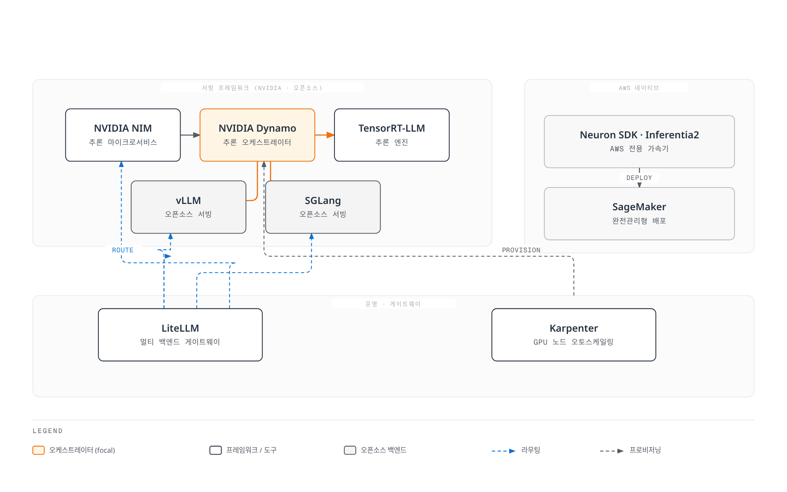
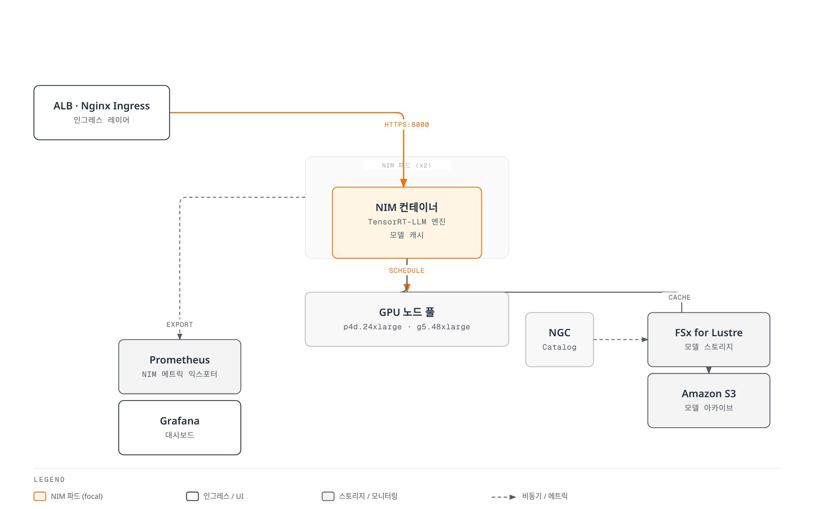
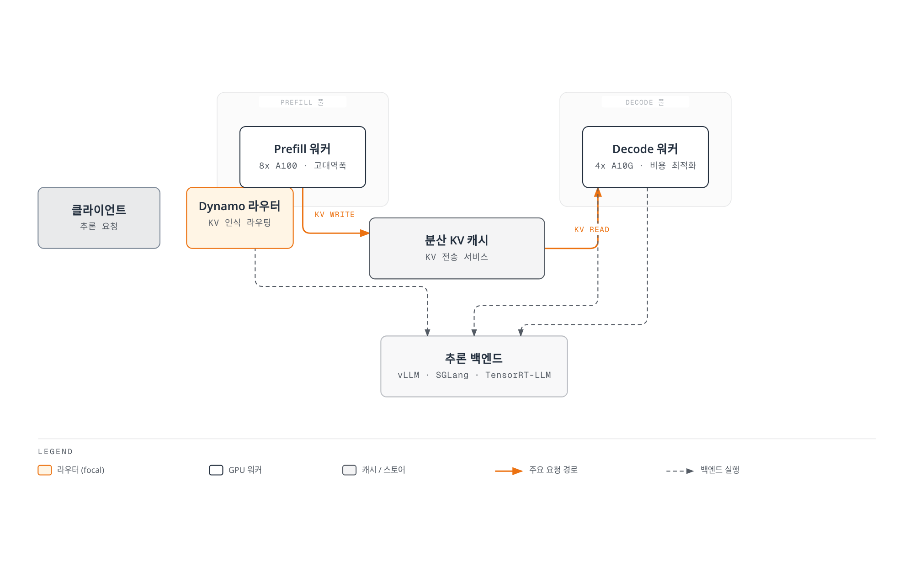
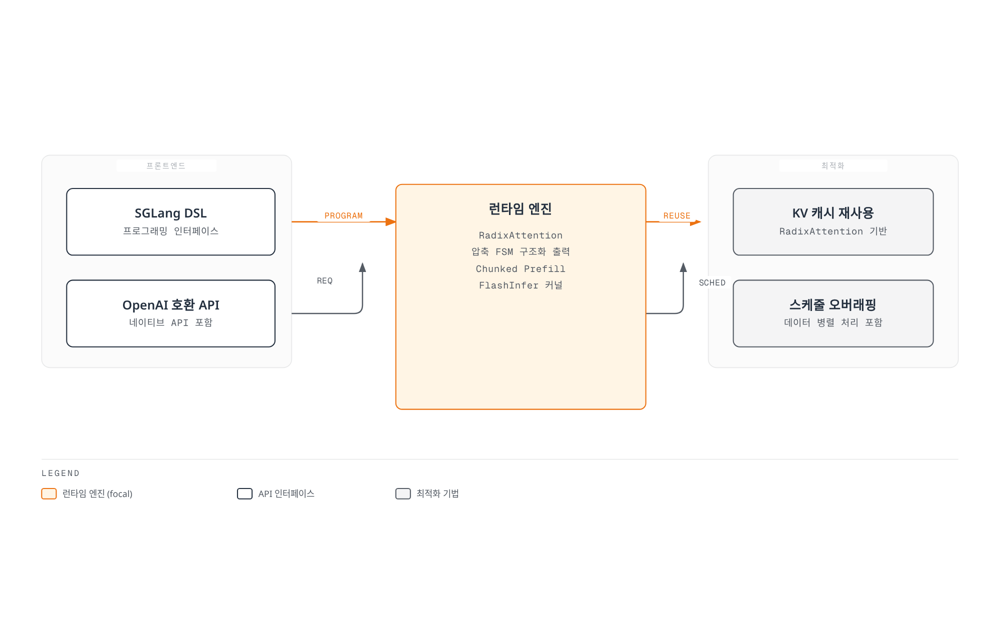

# LLM 서빙을 위한 추론 프레임워크

> **지원 버전**: Kubernetes 1.31, 1.32, 1.33
> **마지막 업데이트**: 2026년 4월 9일

이 장에서는 Amazon EKS에서 대규모 언어 모델(LLM)을 배포하기 위한 다양한 추론 프레임워크를 다룹니다. NVIDIA NIM, NVIDIA Dynamo, AIBrix, Ray Serve 통합, AWS Neuron뿐만 아니라 SGLang, HuggingFace TGI, Ollama, LiteLLM 등 최근 빠르게 성장하고 있는 오픈소스 프레임워크를 포괄적으로 살펴봅니다.

## 추론 프레임워크 생태계

LLM 추론 생태계는 빠르게 발전하고 있으며, 여러 프레임워크가 프로덕션 배포의 다양한 측면을 다루고 있습니다. 다음 다이어그램은 이러한 프레임워크 간의 관계를 보여줍니다:



### 프레임워크 선택 가이드

| 사용 사례 | 권장 프레임워크 | 이유 |
|----------|---------------|------|
| NVIDIA GPU를 사용한 엔터프라이즈 프로덕션 | NVIDIA NIM | 최적화된 컨테이너, 지원, 모니터링 |
| KV 캐시 최적화가 필요한 고처리량 | NVIDIA Dynamo | 분리형 서빙, 지능형 라우팅 |
| 구조화된 출력, 복잡한 프롬프팅 파이프라인 | SGLang | RadixAttention, 구조화된 출력 최적화 |
| LoRA 어댑터를 사용한 멀티테넌트 | AIBrix | 네이티브 LoRA 관리, 이기종 GPU |
| HuggingFace 모델 빠른 프로덕션 배포 | HuggingFace TGI | HF 생태계 통합, 간편한 설정 |
| 대규모 분산 추론 | Ray Serve + vLLM | 성숙한 오케스트레이션, 자동 스케일링 |
| 다중 LLM 공급자 통합 (게이트웨이) | LiteLLM | 100+ 모델 공급자 통합, 비용 추적 |
| 로컬 개발 및 엣지 배포 | Ollama | 원클릭 설정, GGUF 지원, 경량화 |
| AWS 실리콘을 통한 비용 최적화 | AWS Neuron + Inferentia2 | GPU 대비 40-70% 비용 절감 |
| 연구 및 실험 | vLLM 단독 | 간단한 설정, 활발한 커뮤니티 |

## NVIDIA NIM

NVIDIA NIM(NVIDIA Inference Microservices)은 최적화된 추론 엔진, 내장 모니터링, OpenAI 호환 API를 갖춘 프로덕션 준비 컨테이너화된 LLM 배포를 제공합니다.

### NIM 아키텍처



### 사전 요구 사항

NIM을 배포하기 전에 다음을 확인하세요:

```bash
# GPU 노드 가용성 확인
kubectl get nodes -l nvidia.com/gpu.present=true \
  -o custom-columns=NAME:.metadata.name,GPU:.status.allocatable.nvidia\\.com/gpu

# NVIDIA GPU Operator 설치 (아직 설치되지 않은 경우)
helm repo add nvidia https://helm.ngc.nvidia.com/nvidia
helm repo update

helm install gpu-operator nvidia/gpu-operator \
  --namespace gpu-operator \
  --create-namespace \
  --set driver.enabled=true \
  --set toolkit.enabled=true \
  --set devicePlugin.enabled=true

# NGC API 키 시크릿 생성
kubectl create secret generic ngc-api-key \
  --from-literal=NGC_API_KEY='your-ngc-api-key'
```

### Karpenter를 사용한 NIM 배포

먼저 GPU 워크로드를 위한 Karpenter NodePool을 구성합니다:

```yaml
apiVersion: karpenter.sh/v1
kind: NodePool
metadata:
  name: nim-gpu-pool
spec:
  template:
    spec:
      requirements:
      - key: node.kubernetes.io/instance-type
        operator: In
        values:
        - p4d.24xlarge
        - p4de.24xlarge
        - p5.48xlarge
        - g5.48xlarge
        - g5.24xlarge
        - g5.12xlarge
      - key: karpenter.sh/capacity-type
        operator: In
        values:
        - on-demand
      - key: kubernetes.io/arch
        operator: In
        values:
        - amd64
      nodeClassRef:
        group: karpenter.k8s.aws
        kind: EC2NodeClass
        name: nim-gpu-class
      taints:
      - key: nvidia.com/gpu
        value: "true"
        effect: NoSchedule
  limits:
    nvidia.com/gpu: 64
  disruption:
    consolidationPolicy: WhenEmpty
    consolidateAfter: 5m
---
apiVersion: karpenter.k8s.aws/v1
kind: EC2NodeClass
metadata:
  name: nim-gpu-class
spec:
  amiFamily: AL2
  subnetSelectorTerms:
  - tags:
      karpenter.sh/discovery: my-cluster
  securityGroupSelectorTerms:
  - tags:
      karpenter.sh/discovery: my-cluster
  instanceStorePolicy: RAID0
  blockDeviceMappings:
  - deviceName: /dev/xvda
    ebs:
      volumeSize: 500Gi
      volumeType: gp3
      iops: 10000
      throughput: 500
      deleteOnTermination: true
```

### NIM 배포 매니페스트

Llama 3.1 70B로 NVIDIA NIM 배포:

```yaml
apiVersion: v1
kind: Namespace
metadata:
  name: nim-inference
---
apiVersion: v1
kind: Secret
metadata:
  name: ngc-credentials
  namespace: nim-inference
type: kubernetes.io/dockerconfigjson
data:
  .dockerconfigjson: <base64-encoded-docker-config>
---
apiVersion: v1
kind: ConfigMap
metadata:
  name: nim-config
  namespace: nim-inference
data:
  NIM_MANIFEST_PROFILE: "vllm-bf16-tp8"
  NIM_MAX_MODEL_LEN: "32768"
  NIM_GPU_MEMORY_UTILIZATION: "0.90"
  NIM_ENABLE_CHUNKED_PREFILL: "true"
---
apiVersion: apps/v1
kind: Deployment
metadata:
  name: nim-llama-70b
  namespace: nim-inference
  labels:
    app: nim-inference
    model: llama-3-1-70b
spec:
  replicas: 2
  selector:
    matchLabels:
      app: nim-inference
      model: llama-3-1-70b
  template:
    metadata:
      labels:
        app: nim-inference
        model: llama-3-1-70b
      annotations:
        prometheus.io/scrape: "true"
        prometheus.io/port: "8000"
        prometheus.io/path: "/metrics"
    spec:
      imagePullSecrets:
      - name: ngc-credentials
      tolerations:
      - key: nvidia.com/gpu
        operator: Exists
        effect: NoSchedule
      containers:
      - name: nim
        image: nvcr.io/nim/meta/llama-3.1-70b-instruct:1.2.0
        ports:
        - containerPort: 8000
          name: http
          protocol: TCP
        envFrom:
        - configMapRef:
            name: nim-config
        env:
        - name: NGC_API_KEY
          valueFrom:
            secretKeyRef:
              name: ngc-api-key
              key: NGC_API_KEY
        - name: NIM_CACHE_PATH
          value: "/opt/nim/.cache"
        resources:
          limits:
            nvidia.com/gpu: 8
            memory: 700Gi
          requests:
            nvidia.com/gpu: 8
            memory: 600Gi
            cpu: "32"
        volumeMounts:
        - name: nim-cache
          mountPath: /opt/nim/.cache
        - name: shm
          mountPath: /dev/shm
        readinessProbe:
          httpGet:
            path: /v1/health/ready
            port: 8000
          initialDelaySeconds: 300
          periodSeconds: 10
          timeoutSeconds: 5
        livenessProbe:
          httpGet:
            path: /v1/health/live
            port: 8000
          initialDelaySeconds: 300
          periodSeconds: 30
          timeoutSeconds: 10
        startupProbe:
          httpGet:
            path: /v1/health/ready
            port: 8000
          initialDelaySeconds: 60
          periodSeconds: 30
          failureThreshold: 20
      volumes:
      - name: nim-cache
        persistentVolumeClaim:
          claimName: nim-model-cache
      - name: shm
        emptyDir:
          medium: Memory
          sizeLimit: 64Gi
      affinity:
        podAntiAffinity:
          preferredDuringSchedulingIgnoredDuringExecution:
          - weight: 100
            podAffinityTerm:
              labelSelector:
                matchLabels:
                  app: nim-inference
              topologyKey: kubernetes.io/hostname
---
apiVersion: v1
kind: Service
metadata:
  name: nim-inference
  namespace: nim-inference
  labels:
    app: nim-inference
spec:
  selector:
    app: nim-inference
  ports:
  - port: 8000
    targetPort: 8000
    name: http
  type: ClusterIP
---
apiVersion: v1
kind: PersistentVolumeClaim
metadata:
  name: nim-model-cache
  namespace: nim-inference
spec:
  accessModes:
  - ReadWriteOnce
  storageClassName: gp3
  resources:
    requests:
      storage: 500Gi
```

### OpenAI 호환 API 사용

NIM은 OpenAI 호환 API를 제공합니다:

```bash
# 로컬 테스트를 위한 포트 포워딩
kubectl port-forward -n nim-inference svc/nim-inference 8000:8000

# 채팅 완성 요청
curl -X POST http://localhost:8000/v1/chat/completions \
  -H "Content-Type: application/json" \
  -d '{
    "model": "meta/llama-3.1-70b-instruct",
    "messages": [
      {"role": "system", "content": "당신은 도움이 되는 어시스턴트입니다."},
      {"role": "user", "content": "Kubernetes란 무엇인가요?"}
    ],
    "temperature": 0.7,
    "max_tokens": 500,
    "stream": false
  }'

# 스트리밍 응답
curl -X POST http://localhost:8000/v1/chat/completions \
  -H "Content-Type: application/json" \
  -d '{
    "model": "meta/llama-3.1-70b-instruct",
    "messages": [
      {"role": "user", "content": "컨테이너화를 3문장으로 설명해주세요."}
    ],
    "stream": true
  }'
```

Python 클라이언트 예제:

```python
from openai import OpenAI

client = OpenAI(
    base_url="http://nim-inference.nim-inference.svc.cluster.local:8000/v1",
    api_key="not-needed"  # NIM은 내부 호출에 API 키가 필요하지 않음
)

response = client.chat.completions.create(
    model="meta/llama-3.1-70b-instruct",
    messages=[
        {"role": "system", "content": "당신은 Kubernetes 전문가입니다."},
        {"role": "user", "content": "HPA는 어떻게 작동하나요?"}
    ],
    temperature=0.7,
    max_tokens=1000
)

print(response.choices[0].message.content)
```

### NIM 성능 메트릭

NIM 배포에서 모니터링해야 할 주요 메트릭:

| 메트릭 | 설명 | 목표값 |
|--------|------|--------|
| TTFT (Time to First Token) | 첫 번째 토큰이 생성될 때까지의 지연 시간 | < 500ms |
| ITL (Inter-Token Latency) | 연속 토큰 간의 시간 | < 50ms |
| Throughput | 초당 생성되는 토큰 수 | 모델에 따라 다름 |
| GPU Utilization | GPU 컴퓨트 활용률 | 80-95% |
| KV Cache Utilization | KV 캐시 메모리 사용량 | < 90% |
| Queue Depth | 대기열의 대기 중인 요청 | < 100 |

### GenAI-Perf 벤치마킹

NVIDIA GenAI-Perf를 사용한 벤치마킹:

```bash
# GenAI-Perf 설치
pip install genai-perf

# NIM 엔드포인트에 대한 벤치마크 실행
genai-perf \
  --endpoint-type chat \
  --service-kind openai \
  --url http://nim-inference.nim-inference.svc.cluster.local:8000/v1 \
  --model meta/llama-3.1-70b-instruct \
  --concurrency 16 \
  --input-sequence-length 512 \
  --output-sequence-length 256 \
  --num-prompts 100 \
  --profile-export-file nim-benchmark.json

# 결과 확인
genai-perf analyze nim-benchmark.json
```

## NVIDIA Dynamo

NVIDIA Dynamo는 Prefill(프롬프트 처리) 단계와 Decode(토큰 생성) 단계를 분리하여 최적의 리소스 활용을 가능하게 하는 추론 그래프 오케스트레이션 프레임워크입니다.

### Dynamo 아키텍처



### 핵심 개념

1. **분리형 서빙 (Disaggregated Serving)**: Prefill(컴퓨트 집약적) 단계와 Decode(메모리 대역폭 집약적) 단계 분리
2. **KV 캐시 라우팅**: KV 캐시 지역성을 기반으로 지능적인 요청 라우팅
3. **멀티 런타임 지원**: vLLM, SGLang, TensorRT-LLM 백엔드와 함께 작동
4. **이기종 GPU 지원**: Prefill과 Decode 워크로드에 서로 다른 GPU 유형 사용

### Dynamo 배포

```yaml
apiVersion: v1
kind: Namespace
metadata:
  name: dynamo
---
apiVersion: v1
kind: ConfigMap
metadata:
  name: dynamo-config
  namespace: dynamo
data:
  config.yaml: |
    router:
      port: 8080
      kv_routing:
        enabled: true
        locality_weight: 0.7
        load_weight: 0.3
      load_balancing:
        algorithm: least_pending

    prefill:
      replicas: 2
      backend: vllm
      model: meta-llama/Llama-3.1-70B-Instruct
      tensor_parallel_size: 8
      max_num_seqs: 256
      max_model_len: 32768
      gpu_memory_utilization: 0.92

    decode:
      replicas: 4
      backend: vllm
      model: meta-llama/Llama-3.1-70B-Instruct
      tensor_parallel_size: 4
      max_num_seqs: 512
      gpu_memory_utilization: 0.88

    kv_cache:
      transfer_protocol: rdma  # 또는 tcp
      compression: lz4
      max_cache_size_gb: 128
---
apiVersion: apps/v1
kind: Deployment
metadata:
  name: dynamo-router
  namespace: dynamo
spec:
  replicas: 3
  selector:
    matchLabels:
      app: dynamo-router
  template:
    metadata:
      labels:
        app: dynamo-router
    spec:
      containers:
      - name: router
        image: nvcr.io/nvidia/dynamo-router:0.4.0
        ports:
        - containerPort: 8080
          name: http
        - containerPort: 9090
          name: metrics
        env:
        - name: DYNAMO_CONFIG_PATH
          value: /config/config.yaml
        - name: PREFILL_SERVICE
          value: "dynamo-prefill.dynamo.svc.cluster.local:8000"
        - name: DECODE_SERVICE
          value: "dynamo-decode.dynamo.svc.cluster.local:8000"
        - name: KV_CACHE_SERVICE
          value: "dynamo-kv-cache.dynamo.svc.cluster.local:6379"
        volumeMounts:
        - name: config
          mountPath: /config
        resources:
          requests:
            cpu: "4"
            memory: 8Gi
          limits:
            cpu: "8"
            memory: 16Gi
      volumes:
      - name: config
        configMap:
          name: dynamo-config
---
apiVersion: apps/v1
kind: Deployment
metadata:
  name: dynamo-prefill
  namespace: dynamo
spec:
  replicas: 2
  selector:
    matchLabels:
      app: dynamo-prefill
  template:
    metadata:
      labels:
        app: dynamo-prefill
        dynamo-role: prefill
    spec:
      tolerations:
      - key: nvidia.com/gpu
        operator: Exists
        effect: NoSchedule
      containers:
      - name: prefill
        image: nvcr.io/nvidia/dynamo-worker:0.4.0
        args:
        - --role=prefill
        - --backend=vllm
        - --model=meta-llama/Llama-3.1-70B-Instruct
        - --tensor-parallel-size=8
        - --max-num-seqs=256
        - --gpu-memory-utilization=0.92
        - --enable-kv-export
        ports:
        - containerPort: 8000
          name: inference
        - containerPort: 8001
          name: kv-transfer
        env:
        - name: HF_TOKEN
          valueFrom:
            secretKeyRef:
              name: hf-token
              key: token
        - name: KV_CACHE_HOST
          value: "dynamo-kv-cache.dynamo.svc.cluster.local"
        - name: CUDA_VISIBLE_DEVICES
          value: "0,1,2,3,4,5,6,7"
        resources:
          limits:
            nvidia.com/gpu: 8
            memory: 600Gi
          requests:
            nvidia.com/gpu: 8
            memory: 500Gi
            cpu: "32"
        volumeMounts:
        - name: shm
          mountPath: /dev/shm
        - name: model-cache
          mountPath: /models
      volumes:
      - name: shm
        emptyDir:
          medium: Memory
          sizeLimit: 64Gi
      - name: model-cache
        persistentVolumeClaim:
          claimName: dynamo-model-cache
      nodeSelector:
        node.kubernetes.io/instance-type: p4d.24xlarge
---
apiVersion: apps/v1
kind: Deployment
metadata:
  name: dynamo-decode
  namespace: dynamo
spec:
  replicas: 4
  selector:
    matchLabels:
      app: dynamo-decode
  template:
    metadata:
      labels:
        app: dynamo-decode
        dynamo-role: decode
    spec:
      tolerations:
      - key: nvidia.com/gpu
        operator: Exists
        effect: NoSchedule
      containers:
      - name: decode
        image: nvcr.io/nvidia/dynamo-worker:0.4.0
        args:
        - --role=decode
        - --backend=vllm
        - --model=meta-llama/Llama-3.1-70B-Instruct
        - --tensor-parallel-size=4
        - --max-num-seqs=512
        - --gpu-memory-utilization=0.88
        - --enable-kv-import
        ports:
        - containerPort: 8000
          name: inference
        - containerPort: 8001
          name: kv-transfer
        env:
        - name: HF_TOKEN
          valueFrom:
            secretKeyRef:
              name: hf-token
              key: token
        - name: KV_CACHE_HOST
          value: "dynamo-kv-cache.dynamo.svc.cluster.local"
        resources:
          limits:
            nvidia.com/gpu: 4
            memory: 200Gi
          requests:
            nvidia.com/gpu: 4
            memory: 150Gi
            cpu: "16"
        volumeMounts:
        - name: shm
          mountPath: /dev/shm
        - name: model-cache
          mountPath: /models
      volumes:
      - name: shm
        emptyDir:
          medium: Memory
          sizeLimit: 32Gi
      - name: model-cache
        persistentVolumeClaim:
          claimName: dynamo-model-cache
      nodeSelector:
        node.kubernetes.io/instance-type: g5.12xlarge
---
apiVersion: v1
kind: Service
metadata:
  name: dynamo-router
  namespace: dynamo
spec:
  selector:
    app: dynamo-router
  ports:
  - port: 8080
    targetPort: 8080
    name: http
  type: ClusterIP
```

## AIBrix

AIBrix는 LLM 게이트웨이/라우팅, LoRA 어댑터 관리, 애플리케이션 맞춤형 오토스케일링, 이기종 GPU 지원을 제공하는 오픈소스 GenAI 추론 인프라입니다.

### AIBrix 구성 요소

AIBrix는 여러 핵심 구성 요소로 이루어져 있습니다:

1. **Gateway**: 지능형 요청 라우팅 및 로드 밸런싱
2. **LoRA Manager**: 동적 LoRA 어댑터 로딩 및 관리
3. **Autoscaler**: 추론 파드를 위한 워크로드 인식 오토스케일링
4. **Model Registry**: 중앙 집중식 모델 및 어댑터 관리

### AIBrix 배포

```yaml
apiVersion: v1
kind: Namespace
metadata:
  name: aibrix
---
# AIBrix Gateway
apiVersion: apps/v1
kind: Deployment
metadata:
  name: aibrix-gateway
  namespace: aibrix
spec:
  replicas: 3
  selector:
    matchLabels:
      app: aibrix-gateway
  template:
    metadata:
      labels:
        app: aibrix-gateway
    spec:
      containers:
      - name: gateway
        image: ghcr.io/aibrix/aibrix-gateway:0.3.0
        ports:
        - containerPort: 8080
          name: http
        - containerPort: 9090
          name: metrics
        env:
        - name: AIBRIX_MODEL_REGISTRY
          value: "aibrix-registry.aibrix.svc.cluster.local:8081"
        - name: AIBRIX_ROUTING_STRATEGY
          value: "least_load"  # 옵션: round_robin, least_load, hash
        - name: AIBRIX_ENABLE_LORA_ROUTING
          value: "true"
        - name: AIBRIX_MAX_QUEUE_SIZE
          value: "1000"
        resources:
          requests:
            cpu: "2"
            memory: 4Gi
          limits:
            cpu: "4"
            memory: 8Gi
        readinessProbe:
          httpGet:
            path: /health
            port: 8080
          initialDelaySeconds: 5
          periodSeconds: 10
---
apiVersion: v1
kind: Service
metadata:
  name: aibrix-gateway
  namespace: aibrix
spec:
  selector:
    app: aibrix-gateway
  ports:
  - port: 8080
    targetPort: 8080
    name: http
  type: ClusterIP
---
# LoRA 지원이 있는 AIBrix vLLM 백엔드
apiVersion: apps/v1
kind: Deployment
metadata:
  name: aibrix-vllm
  namespace: aibrix
spec:
  replicas: 2
  selector:
    matchLabels:
      app: aibrix-vllm
  template:
    metadata:
      labels:
        app: aibrix-vllm
      annotations:
        aibrix.io/gpu-type: "nvidia-a10g"
        aibrix.io/model: "meta-llama/Llama-3.1-8B-Instruct"
    spec:
      tolerations:
      - key: nvidia.com/gpu
        operator: Exists
        effect: NoSchedule
      containers:
      - name: vllm
        image: vllm/vllm-openai:v0.6.0
        command:
        - python
        - -m
        - vllm.entrypoints.openai.api_server
        args:
        - --model=meta-llama/Llama-3.1-8B-Instruct
        - --enable-lora
        - --max-loras=8
        - --max-lora-rank=32
        - --lora-modules
        - customer-support=/lora/customer-support
        - code-review=/lora/code-review
        - translation=/lora/translation
        - --tensor-parallel-size=1
        - --gpu-memory-utilization=0.85
        - --max-model-len=8192
        - --port=8000
        ports:
        - containerPort: 8000
          name: http
        env:
        - name: HF_TOKEN
          valueFrom:
            secretKeyRef:
              name: hf-token
              key: token
        - name: AIBRIX_REGISTRY_URL
          value: "http://aibrix-registry.aibrix.svc.cluster.local:8081"
        resources:
          limits:
            nvidia.com/gpu: 1
            memory: 48Gi
          requests:
            nvidia.com/gpu: 1
            memory: 40Gi
            cpu: "8"
        volumeMounts:
        - name: shm
          mountPath: /dev/shm
        - name: lora-adapters
          mountPath: /lora
        - name: model-cache
          mountPath: /root/.cache/huggingface
        readinessProbe:
          httpGet:
            path: /health
            port: 8000
          initialDelaySeconds: 120
          periodSeconds: 10
      volumes:
      - name: shm
        emptyDir:
          medium: Memory
          sizeLimit: 16Gi
      - name: lora-adapters
        persistentVolumeClaim:
          claimName: aibrix-lora-pvc
      - name: model-cache
        persistentVolumeClaim:
          claimName: aibrix-model-cache
```

### AIBrix LoRA 관리

LoRA 어댑터 등록 및 관리:

```bash
# 새로운 LoRA 어댑터 등록
curl -X POST http://aibrix-registry.aibrix.svc.cluster.local:8081/v1/lora/register \
  -H "Content-Type: application/json" \
  -d '{
    "name": "customer-support",
    "base_model": "meta-llama/Llama-3.1-8B-Instruct",
    "lora_path": "s3://aibrix-models/lora/customer-support",
    "rank": 16,
    "alpha": 32,
    "target_modules": ["q_proj", "v_proj", "k_proj", "o_proj"]
  }'

# 등록된 LoRA 어댑터 목록 조회
curl http://aibrix-registry.aibrix.svc.cluster.local:8081/v1/lora/list

# 추론 요청에서 LoRA 어댑터 사용
curl -X POST http://aibrix-gateway.aibrix.svc.cluster.local:8080/v1/chat/completions \
  -H "Content-Type: application/json" \
  -d '{
    "model": "meta-llama/Llama-3.1-8B-Instruct",
    "lora_adapter": "customer-support",
    "messages": [
      {"role": "user", "content": "비밀번호를 어떻게 재설정하나요?"}
    ],
    "max_tokens": 200
  }'
```

## Ray Serve 통합

Ray Serve는 Kubernetes 네이티브 배포를 위한 KubeRay 오퍼레이터와 함께 분산 서빙 기능을 제공합니다.

### KubeRay Operator 설치

```bash
# KubeRay Helm 저장소 추가
helm repo add kuberay https://ray-project.github.io/kuberay-helm/
helm repo update

# KubeRay operator 설치
helm install kuberay-operator kuberay/kuberay-operator \
  --namespace kuberay-system \
  --create-namespace \
  --set image.tag=v1.1.0
```

### vLLM과 Ray Serve 배포

```yaml
apiVersion: v1
kind: Namespace
metadata:
  name: ray-serve
---
apiVersion: ray.io/v1
kind: RayService
metadata:
  name: vllm-serve
  namespace: ray-serve
spec:
  serviceUnhealthySecondThreshold: 900
  deploymentUnhealthySecondThreshold: 300
  serveConfigV2: |
    applications:
    - name: vllm-app
      route_prefix: /
      import_path: serve_vllm:deployment
      deployments:
      - name: VLLMDeployment
        num_replicas: 2
        ray_actor_options:
          num_cpus: 8
          num_gpus: 1
        user_config:
          model: meta-llama/Llama-3.1-8B-Instruct
          tensor_parallel_size: 1
          max_model_len: 8192
          gpu_memory_utilization: 0.85
  rayClusterConfig:
    rayVersion: '2.9.0'
    headGroupSpec:
      rayStartParams:
        dashboard-host: '0.0.0.0'
        block: 'true'
      template:
        spec:
          containers:
          - name: ray-head
            image: rayproject/ray-ml:2.9.0-py310-gpu
            ports:
            - containerPort: 6379
              name: gcs
            - containerPort: 8265
              name: dashboard
            - containerPort: 10001
              name: client
            - containerPort: 8000
              name: serve
            env:
            - name: HF_TOKEN
              valueFrom:
                secretKeyRef:
                  name: hf-token
                  key: token
            resources:
              limits:
                cpu: "4"
                memory: 16Gi
              requests:
                cpu: "2"
                memory: 8Gi
    workerGroupSpecs:
    - groupName: gpu-workers
      replicas: 2
      minReplicas: 1
      maxReplicas: 8
      rayStartParams:
        block: 'true'
      template:
        spec:
          tolerations:
          - key: nvidia.com/gpu
            operator: Exists
            effect: NoSchedule
          containers:
          - name: ray-worker
            image: rayproject/ray-ml:2.9.0-py310-gpu
            env:
            - name: HF_TOKEN
              valueFrom:
                secretKeyRef:
                  name: hf-token
                  key: token
            resources:
              limits:
                nvidia.com/gpu: 1
                cpu: "16"
                memory: 64Gi
              requests:
                nvidia.com/gpu: 1
                cpu: "8"
                memory: 48Gi
            volumeMounts:
            - name: shm
              mountPath: /dev/shm
            - name: model-cache
              mountPath: /home/ray/.cache/huggingface
          volumes:
          - name: shm
            emptyDir:
              medium: Memory
              sizeLimit: 16Gi
          - name: model-cache
            persistentVolumeClaim:
              claimName: ray-model-cache
```

## SGLang

SGLang(Structured Generation Language)은 UC Berkeley에서 개발한 고성능 LLM 서빙 프레임워크로, 구조화된 출력 생성과 복잡한 프롬프팅 파이프라인에 최적화되어 있습니다. vLLM과 함께 가장 빠르게 성장하는 오픈소스 추론 엔진 중 하나입니다.

### SGLang의 핵심 기술



1. **RadixAttention**: Radix 트리 기반의 KV 캐시 재사용으로, 프리픽스 캐싱을 넘어 부분적으로 겹치는 프롬프트 간에도 캐시를 효율적으로 공유합니다.
2. **압축 FSM 기반 구조화 출력**: JSON Schema, 정규표현식 등 구조화된 출력 생성 시 유한 상태 기계를 압축하여 vLLM 대비 최대 10배 빠른 구조화 디코딩을 제공합니다.
3. **FlashInfer 커널**: 최적화된 어텐션 커널로 다양한 GPU 아키텍처에서 최적의 성능을 제공합니다.

### EKS에서 SGLang 배포

```yaml
apiVersion: apps/v1
kind: Deployment
metadata:
  name: sglang-server
  namespace: ai-inference
spec:
  replicas: 1
  selector:
    matchLabels:
      app: sglang-server
  template:
    metadata:
      labels:
        app: sglang-server
    spec:
      containers:
      - name: sglang
        image: lmsysorg/sglang:latest
        command:
        - python3
        - -m
        - sglang.launch_server
        - --model-path=meta-llama/Llama-3.1-8B-Instruct
        - --host=0.0.0.0
        - --port=30000
        - --tp=1
        - --mem-fraction-static=0.85
        ports:
        - containerPort: 30000
        resources:
          limits:
            nvidia.com/gpu: 1
            memory: 48Gi
          requests:
            nvidia.com/gpu: 1
            memory: 32Gi
        env:
        - name: HF_TOKEN
          valueFrom:
            secretKeyRef:
              name: hf-token
              key: token
        volumeMounts:
        - name: model-cache
          mountPath: /root/.cache/huggingface
      volumes:
      - name: model-cache
        persistentVolumeClaim:
          claimName: model-cache-pvc
---
apiVersion: v1
kind: Service
metadata:
  name: sglang-server
  namespace: ai-inference
spec:
  selector:
    app: sglang-server
  ports:
  - port: 30000
    targetPort: 30000
  type: ClusterIP
```

### SGLang DSL 프로그래밍

SGLang의 가장 큰 차별점은 복잡한 LLM 파이프라인을 프로그래밍적으로 구성할 수 있는 DSL입니다:

```python
import sglang as sgl

@sgl.function
def multi_turn_qa(s, question_1, question_2):
    s += sgl.system("당신은 도움이 되는 AI 어시스턴트입니다.")
    s += sgl.user(question_1)
    s += sgl.assistant(sgl.gen("answer_1", max_tokens=256))
    s += sgl.user(question_2)
    s += sgl.assistant(sgl.gen("answer_2", max_tokens=256))

@sgl.function
def json_extraction(s, text):
    s += sgl.user(f"다음 텍스트에서 정보를 추출하세요: {text}")
    s += sgl.assistant(
        sgl.gen("result", max_tokens=512,
                regex=r'\{"name": "[^"]+", "age": \d+, "city": "[^"]+"\}')
    )
```

### vLLM vs SGLang 선택 기준

| 기준 | vLLM | SGLang |
|------|------|--------|
| **구조화 출력 속도** | 좋음 | 매우 우수 (최대 10배) |
| **커뮤니티/생태계** | 매우 큼 | 빠르게 성장 중 |
| **다중 턴 파이프라인** | API 레벨 | DSL 레벨 최적화 |
| **프리픽스 캐싱** | 지원 | RadixAttention (더 효율적) |
| **프로덕션 안정성** | 매우 높음 | 높음 |
| **VLM 지원** | 폭넓음 | 폭넓음 |
| **Kubernetes 통합** | Helm 차트 | Docker 이미지 |

## HuggingFace TGI (Text Generation Inference)

HuggingFace TGI는 HuggingFace가 개발한 프로덕션 준비 LLM 서빙 프레임워크로, HuggingFace 모델 허브와의 네이티브 통합이 강점입니다.

### TGI의 주요 특징

- **Flash Attention 2 통합**: 최적화된 어텐션 연산으로 높은 처리량 제공
- **연속 배치 처리**: 동적 요청 배치로 GPU 사용률 극대화
- **양자화 지원**: GPTQ, AWQ, bitsandbytes, EETQ, Marlin 등 다양한 양자화 형식
- **Guidance 통합**: JSON 스키마 기반 구조화 출력 지원
- **HuggingFace Hub 통합**: 모델 ID만으로 직접 다운로드 및 서빙
- **Rust 기반 고성능 서버**: 낮은 메모리 오버헤드와 높은 동시 처리

### EKS에서 TGI 배포

```yaml
apiVersion: apps/v1
kind: Deployment
metadata:
  name: tgi-server
  namespace: ai-inference
spec:
  replicas: 1
  selector:
    matchLabels:
      app: tgi-server
  template:
    metadata:
      labels:
        app: tgi-server
    spec:
      containers:
      - name: tgi
        image: ghcr.io/huggingface/text-generation-inference:latest
        args:
        - --model-id=meta-llama/Llama-3.1-8B-Instruct
        - --max-input-tokens=4096
        - --max-total-tokens=8192
        - --max-batch-prefill-tokens=16384
        - --quantize=awq
        - --port=8080
        ports:
        - containerPort: 8080
        resources:
          limits:
            nvidia.com/gpu: 1
            memory: 48Gi
          requests:
            nvidia.com/gpu: 1
            memory: 32Gi
        env:
        - name: HUGGING_FACE_HUB_TOKEN
          valueFrom:
            secretKeyRef:
              name: hf-token
              key: token
        readinessProbe:
          httpGet:
            path: /health
            port: 8080
          initialDelaySeconds: 120
          periodSeconds: 10
        livenessProbe:
          httpGet:
            path: /health
            port: 8080
          initialDelaySeconds: 180
          periodSeconds: 30
---
apiVersion: v1
kind: Service
metadata:
  name: tgi-server
  namespace: ai-inference
spec:
  selector:
    app: tgi-server
  ports:
  - port: 8080
    targetPort: 8080
  type: ClusterIP
```

### TGI API 사용 예제

```bash
# 텍스트 생성
curl http://tgi-server:8080/generate \
  -H 'Content-Type: application/json' \
  -d '{
    "inputs": "Kubernetes에서 AI 워크로드를 실행하는 장점은",
    "parameters": {
      "max_new_tokens": 200,
      "temperature": 0.7,
      "do_sample": true
    }
  }'

# OpenAI 호환 API (TGI v2+)
curl http://tgi-server:8080/v1/chat/completions \
  -H 'Content-Type: application/json' \
  -d '{
    "model": "tgi",
    "messages": [{"role": "user", "content": "Hello!"}],
    "max_tokens": 100
  }'
```

## Ollama

Ollama는 LLM을 로컬에서 간편하게 실행할 수 있는 도구로, 개발/테스트 환경이나 엣지 배포에 적합합니다. GGUF 형식의 양자화된 모델을 사용하여 소비자급 하드웨어에서도 LLM을 실행할 수 있습니다.

### Ollama의 특징

- **원클릭 모델 실행**: `ollama run llama3.1` 한 줄로 모델 다운로드부터 실행까지
- **GGUF 양자화 모델**: CPU 및 소비자급 GPU에서도 효율적으로 실행
- **Modelfile**: Dockerfile과 유사한 문법으로 커스텀 모델 정의
- **OpenAI 호환 API**: 기존 코드를 최소한의 변경으로 통합
- **경량 컨테이너**: Docker/Kubernetes에서 간편하게 배포

### EKS에서 Ollama 배포

개발/스테이징 환경이나 경량 추론 용도로 Ollama를 EKS에 배포할 수 있습니다:

```yaml
apiVersion: apps/v1
kind: Deployment
metadata:
  name: ollama
  namespace: ai-dev
spec:
  replicas: 1
  selector:
    matchLabels:
      app: ollama
  template:
    metadata:
      labels:
        app: ollama
    spec:
      containers:
      - name: ollama
        image: ollama/ollama:latest
        ports:
        - containerPort: 11434
        resources:
          limits:
            nvidia.com/gpu: 1
            memory: 32Gi
          requests:
            nvidia.com/gpu: 1
            memory: 16Gi
        volumeMounts:
        - name: ollama-data
          mountPath: /root/.ollama
        lifecycle:
          postStart:
            exec:
              command:
              - /bin/sh
              - -c
              - |
                sleep 10 && ollama pull llama3.1:8b
      volumes:
      - name: ollama-data
        persistentVolumeClaim:
          claimName: ollama-data-pvc
---
apiVersion: v1
kind: Service
metadata:
  name: ollama
  namespace: ai-dev
spec:
  selector:
    app: ollama
  ports:
  - port: 11434
    targetPort: 11434
  type: ClusterIP
```

### Ollama 사용 예제

```bash
# 모델 다운로드 및 실행
ollama pull llama3.1:8b
ollama pull deepseek-r1:8b
ollama pull qwen2.5:7b

# Chat API (OpenAI 호환)
curl http://ollama:11434/v1/chat/completions \
  -H "Content-Type: application/json" \
  -d '{
    "model": "llama3.1:8b",
    "messages": [{"role": "user", "content": "Hello!"}]
  }'

# Modelfile로 커스텀 모델 생성
cat <<EOF > Modelfile
FROM llama3.1:8b
SYSTEM "당신은 한국어로 답변하는 Kubernetes 전문가입니다."
PARAMETER temperature 0.3
PARAMETER num_ctx 4096
EOF
ollama create k8s-expert -f Modelfile
```

## LiteLLM

LiteLLM은 100개 이상의 LLM 공급자를 단일 OpenAI 호환 인터페이스로 통합하는 프록시/게이트웨이입니다. EKS에서 여러 모델 백엔드(vLLM, SGLang, NIM, 클라우드 API 등)를 통합 관리할 때 유용합니다.

### LiteLLM의 주요 기능

- **통합 API**: OpenAI, Anthropic, Google, vLLM, Ollama 등 100+ 공급자를 단일 인터페이스로
- **로드 밸런싱**: 여러 모델 인스턴스 간 지능형 라우팅
- **비용 추적**: 모델별, 팀별, 프로젝트별 사용량 및 비용 추적
- **속도 제한**: API 키별, 사용자별 속도 제한 관리
- **폴백 전략**: 모델 장애 시 자동 폴백

### EKS에서 LiteLLM 프록시 배포

```yaml
apiVersion: v1
kind: ConfigMap
metadata:
  name: litellm-config
  namespace: ai-gateway
data:
  config.yaml: |
    model_list:
      - model_name: gpt-4-equivalent
        litellm_params:
          model: openai/meta-llama/Llama-3.1-70B-Instruct
          api_base: http://vllm-inference.ai-inference:8000/v1
          api_key: dummy
      - model_name: gpt-4-equivalent
        litellm_params:
          model: openai/meta-llama/Llama-3.1-70B-Instruct
          api_base: http://sglang-server.ai-inference:30000/v1
          api_key: dummy
      - model_name: fast-model
        litellm_params:
          model: openai/meta-llama/Llama-3.1-8B-Instruct
          api_base: http://vllm-small.ai-inference:8000/v1
          api_key: dummy
      - model_name: dev-model
        litellm_params:
          model: ollama/llama3.1:8b
          api_base: http://ollama.ai-dev:11434
    
    litellm_settings:
      drop_params: true
      set_verbose: false
    
    router_settings:
      routing_strategy: least-busy
      num_retries: 3
      retry_after: 5
      allowed_fails: 2
---
apiVersion: apps/v1
kind: Deployment
metadata:
  name: litellm-proxy
  namespace: ai-gateway
spec:
  replicas: 2
  selector:
    matchLabels:
      app: litellm-proxy
  template:
    metadata:
      labels:
        app: litellm-proxy
    spec:
      containers:
      - name: litellm
        image: ghcr.io/berriai/litellm:main-latest
        args:
        - --config=/app/config.yaml
        - --port=4000
        ports:
        - containerPort: 4000
        resources:
          requests:
            cpu: "500m"
            memory: 512Mi
          limits:
            cpu: "2"
            memory: 2Gi
        volumeMounts:
        - name: config
          mountPath: /app/config.yaml
          subPath: config.yaml
        readinessProbe:
          httpGet:
            path: /health
            port: 4000
          initialDelaySeconds: 10
          periodSeconds: 10
      volumes:
      - name: config
        configMap:
          name: litellm-config
---
apiVersion: v1
kind: Service
metadata:
  name: litellm-proxy
  namespace: ai-gateway
spec:
  selector:
    app: litellm-proxy
  ports:
  - port: 4000
    targetPort: 4000
  type: ClusterIP
```

### LiteLLM 사용 예제

```python
from openai import OpenAI

# LiteLLM 프록시를 통해 다양한 백엔드에 접근
client = OpenAI(
    base_url="http://litellm-proxy.ai-gateway:4000/v1",
    api_key="sk-your-litellm-key"
)

# 자동 로드밸런싱 - vLLM과 SGLang 간 분배
response = client.chat.completions.create(
    model="gpt-4-equivalent",
    messages=[{"role": "user", "content": "Hello!"}]
)

# 경량 모델로 라우팅
response = client.chat.completions.create(
    model="fast-model",
    messages=[{"role": "user", "content": "간단한 질문입니다"}]
)
```

## AWS Neuron과 Inferentia2

AWS Neuron SDK를 사용하면 GPU 인스턴스에 비해 상당한 비용 절감을 제공하는 비용 효율적인 Inferentia2(inf2) 인스턴스에서 LLM을 실행할 수 있습니다.

### Neuron SDK 개요

AWS Inferentia2 제공 기능:
- GPU 인스턴스 대비 최대 70% 낮은 비용
- 추론 워크로드를 위한 높은 처리량
- 인기 있는 모델 지원: Llama 2/3, Mistral, Stable Diffusion

### 지원 인스턴스 유형

| 인스턴스 유형 | Neuron 코어 | 메모리 | 사용 사례 |
|--------------|-------------|--------|----------|
| inf2.xlarge | 2 | 32 GB | 소형 모델 (7B) |
| inf2.8xlarge | 2 | 32 GB | 중형 모델 (배칭과 함께 7B) |
| inf2.24xlarge | 6 | 96 GB | 대형 모델 (13B-70B) |
| inf2.48xlarge | 12 | 192 GB | 초대형 모델 (70B+) |

### Neuron Device Plugin 설치

```bash
# Neuron device plugin 설치
kubectl apply -f https://raw.githubusercontent.com/aws-neuron/aws-neuron-sdk/master/src/k8/k8s-neuron-device-plugin.yml

# Neuron device plugin 확인
kubectl get ds neuron-device-plugin-daemonset -n kube-system

# 노드의 Neuron 디바이스 확인
kubectl get nodes -l 'node.kubernetes.io/instance-type in (inf2.xlarge,inf2.8xlarge,inf2.24xlarge,inf2.48xlarge)' \
  -o custom-columns=NAME:.metadata.name,NEURON:.status.allocatable.aws\\.amazon\\.com/neuron
```

### Inferentia2를 위한 Karpenter NodePool

```yaml
apiVersion: karpenter.sh/v1
kind: NodePool
metadata:
  name: neuron-pool
spec:
  template:
    spec:
      requirements:
      - key: node.kubernetes.io/instance-type
        operator: In
        values:
        - inf2.xlarge
        - inf2.8xlarge
        - inf2.24xlarge
        - inf2.48xlarge
      - key: karpenter.sh/capacity-type
        operator: In
        values:
        - on-demand
        - spot
      - key: kubernetes.io/arch
        operator: In
        values:
        - amd64
      nodeClassRef:
        group: karpenter.k8s.aws
        kind: EC2NodeClass
        name: neuron-class
      taints:
      - key: aws.amazon.com/neuron
        value: "true"
        effect: NoSchedule
  limits:
    aws.amazon.com/neuron: 24
  disruption:
    consolidationPolicy: WhenEmpty
    consolidateAfter: 10m
---
apiVersion: karpenter.k8s.aws/v1
kind: EC2NodeClass
metadata:
  name: neuron-class
spec:
  amiFamily: AL2
  amiSelectorTerms:
  - id: ami-xxxxxxxxxxxxxxxxx  # Neuron DLAMI
  subnetSelectorTerms:
  - tags:
      karpenter.sh/discovery: my-cluster
  securityGroupSelectorTerms:
  - tags:
      karpenter.sh/discovery: my-cluster
  blockDeviceMappings:
  - deviceName: /dev/xvda
    ebs:
      volumeSize: 500Gi
      volumeType: gp3
      deleteOnTermination: true
```

### Neuron에서의 vLLM 배포

```yaml
apiVersion: v1
kind: Namespace
metadata:
  name: neuron-inference
---
apiVersion: apps/v1
kind: Deployment
metadata:
  name: vllm-neuron
  namespace: neuron-inference
spec:
  replicas: 2
  selector:
    matchLabels:
      app: vllm-neuron
  template:
    metadata:
      labels:
        app: vllm-neuron
    spec:
      tolerations:
      - key: aws.amazon.com/neuron
        operator: Exists
        effect: NoSchedule
      containers:
      - name: vllm-neuron
        image: public.ecr.aws/neuron/pytorch-inference-neuronx:2.1.2-neuronx-py310-sdk2.18.0
        command:
        - /bin/bash
        - -c
        - |
          source /opt/aws_neuron_venv_pytorch/bin/activate
          pip install vllm-neuron
          python -m vllm.entrypoints.openai.api_server \
            --model /models/llama-3-8b-neuron \
            --device neuron \
            --tensor-parallel-size 2 \
            --max-num-seqs 8 \
            --max-model-len 4096 \
            --port 8000
        ports:
        - containerPort: 8000
          name: http
        env:
        - name: NEURON_RT_NUM_CORES
          value: "2"
        - name: NEURON_RT_VISIBLE_CORES
          value: "0,1"
        - name: NEURON_CC_FLAGS
          value: "--model-type transformer"
        - name: HF_TOKEN
          valueFrom:
            secretKeyRef:
              name: hf-token
              key: token
        resources:
          limits:
            aws.amazon.com/neuron: 2
            memory: 32Gi
          requests:
            aws.amazon.com/neuron: 2
            memory: 24Gi
            cpu: "8"
        volumeMounts:
        - name: model-cache
          mountPath: /models
        - name: shm
          mountPath: /dev/shm
        readinessProbe:
          httpGet:
            path: /health
            port: 8000
          initialDelaySeconds: 600
          periodSeconds: 30
      volumes:
      - name: model-cache
        persistentVolumeClaim:
          claimName: neuron-model-cache
      - name: shm
        emptyDir:
          medium: Memory
          sizeLimit: 8Gi
      nodeSelector:
        node.kubernetes.io/instance-type: inf2.xlarge
---
apiVersion: v1
kind: Service
metadata:
  name: vllm-neuron
  namespace: neuron-inference
spec:
  selector:
    app: vllm-neuron
  ports:
  - port: 8000
    targetPort: 8000
    name: http
  type: ClusterIP
```

## 프레임워크 비교

### 기능 비교 매트릭스

| 기능 | NIM | Dynamo | SGLang | vLLM | TGI | AIBrix | Ollama |
|------|-----|--------|--------|------|-----|--------|--------|
| **OpenAI API** | 지원 | 지원 | 지원 | 지원 | 지원 (v2+) | 지원 | 지원 |
| **텐서 병렬화** | 지원 | 지원 | 지원 | 지원 | 지원 | 지원 | 미지원 |
| **분리형 서빙** | 미지원 | 지원 | 미지원 | 미지원 | 미지원 | 미지원 | 미지원 |
| **구조화 출력** | 제한적 | 지원 | 매우 빠름 | 지원 | 지원 | 지원 | 지원 |
| **LoRA 지원** | 제한적 | 지원 | 지원 | 지원 | 지원 | 네이티브 | 지원 |
| **VLM (비전)** | 지원 | 지원 | 지원 | 지원 | 지원 | 지원 | 지원 |
| **Speculative Decoding** | 지원 | 지원 | 지원 | 지원 | 지원 | 미지원 | 미지원 |
| **FP8 양자화** | 지원 | 지원 | 지원 | 지원 | 미지원 | 지원 | 미지원 |
| **GGUF 모델** | 미지원 | 미지원 | 미지원 | 미지원 | 미지원 | 미지원 | 지원 |
| **CPU 추론** | 미지원 | 미지원 | 미지원 | 제한적 | 미지원 | 미지원 | 지원 |
| **자동 스케일링** | 수동 | 수동 | 수동 | 수동 | 수동 | 내장 | 수동 |
| **엔터프라이즈 지원** | 지원 | 지원 | 커뮤니티 | 커뮤니티 | HuggingFace | 커뮤니티 | 커뮤니티 |

### 성능 비교 (Llama 3.1 70B, 8x A100)

| 프레임워크 | TTFT (P99) | ITL (P99) | 처리량 (tok/s) | 최대 동시성 |
|-----------|------------|-----------|----------------|-------------|
| NIM | 450ms | 35ms | 2,800 | 128 |
| Dynamo | 380ms | 30ms | 3,200 | 256 |
| SGLang | 480ms | 36ms | 2,700 | 128 |
| vLLM | 520ms | 40ms | 2,400 | 96 |
| TGI | 540ms | 38ms | 2,200 | 96 |
| Ray+vLLM | 550ms | 42ms | 2,300 | 128 |
| Triton+TRT-LLM | 400ms | 32ms | 3,000 | 128 |

> **참고**: SGLang은 구조화 출력 시나리오에서 vLLM 대비 최대 5-10배 빠른 성능을 보입니다. 위 수치는 일반 텍스트 생성 기준입니다.

### 비용 비교 (월간, 일 100만 요청)

| 프레임워크 | 인스턴스 유형 | 수량 | 월간 비용 | 1K 요청당 비용 |
|-----------|--------------|------|----------|---------------|
| NIM | p4d.24xlarge | 2 | $48,000 | $0.80 |
| vLLM | p4d.24xlarge | 3 | $72,000 | $1.20 |
| Dynamo | p4d + g5 혼합 | 2+4 | $52,000 | $0.87 |
| Neuron | inf2.48xlarge | 4 | $28,000 | $0.47 |
| Ray+vLLM | g5.48xlarge | 4 | $38,000 | $0.63 |

## 모범 사례

### 프레임워크 선택 가이드라인

1. **NIM을 선택해야 하는 경우**:
   - 엔터프라이즈 지원 및 SLA가 필요한 경우
   - NVIDIA GPU만 독점적으로 사용하는 경우
   - 최소한의 튜닝으로 사전 최적화된 컨테이너가 필요한 경우
   - Grafana 기반 모니터링을 선호하는 경우

2. **Dynamo를 선택해야 하는 경우**:
   - 높은 처리량이 중요한 경우
   - 분리형 서빙의 이점을 활용할 수 있는 경우
   - 이기종 GPU 유형을 사용하는 경우
   - KV 캐시 지역성이 워크로드에 중요한 경우

3. **AIBrix를 선택해야 하는 경우**:
   - LoRA 어댑터를 사용한 멀티테넌트 배포
   - 내장 오토스케일링이 필요한 경우
   - 같은 클러스터에서 혼합 GPU 유형을 사용하는 경우
   - 유연한 라우팅 전략이 필요한 경우

4. **Ray Serve를 선택해야 하는 경우**:
   - 이미 Ray 생태계를 사용 중인 경우
   - 복잡한 서빙 파이프라인이 필요한 경우
   - Python 네이티브 배포가 필요한 경우
   - 멀티 모델 서빙이 필요한 경우

5. **SGLang을 선택해야 하는 경우**:
   - 구조화된 출력(JSON, 정규표현식)이 핵심 요구사항인 경우
   - 복잡한 멀티턴 프롬프팅 파이프라인이 필요한 경우
   - 프리픽스 캐싱 효율이 중요한 경우
   - vLLM과 유사한 기능이 필요하지만 구조화 출력에서 더 나은 성능을 원하는 경우

6. **TGI를 선택해야 하는 경우**:
   - HuggingFace 모델을 빠르게 프로덕션에 배포해야 하는 경우
   - Rust 기반의 안정적인 서버가 필요한 경우
   - HuggingFace Enterprise Hub를 사용하는 경우

7. **Ollama를 선택해야 하는 경우**:
   - 개발/테스트 환경에서 빠르게 LLM을 실행해야 하는 경우
   - GPU 없이 CPU에서도 LLM을 실행해야 하는 경우
   - 엣지 디바이스나 경량 환경에 배포해야 하는 경우

8. **LiteLLM을 선택해야 하는 경우**:
   - 여러 LLM 백엔드를 통합 관리해야 하는 경우
   - 팀/프로젝트별 비용 추적이 필요한 경우
   - 폴백 전략과 로드 밸런싱이 필요한 경우

9. **Neuron을 선택해야 하는 경우**:
   - 비용 최적화가 주요 목표인 경우
   - 워크로드가 inf2 제약에 맞는 경우
   - 컴파일 오버헤드를 수용할 수 있는 경우
   - 지원되는 모델(Llama, Mistral)을 실행하는 경우

### 프로덕션 배포 체크리스트

- [ ] 적절한 리소스 요청 및 제한 구성
- [ ] 헬스 체크 설정 (readiness, liveness, startup 프로브)
- [ ] 자동 스케일링 구현 (HPA, Karpenter, 또는 프레임워크 네이티브)
- [ ] 모니터링 및 알림 구성
- [ ] 로그 집계 설정
- [ ] 요청 속도 제한 구현
- [ ] 네트워크 정책 구성
- [ ] 모델 캐싱 설정 (FSx, EBS, 또는 S3)
- [ ] 장애 조치 및 복구 테스트
- [ ] 일반적인 문제에 대한 런북 문서화

## 참고 자료

- [AI on EKS](https://awslabs.github.io/ai-on-eks/) - EKS에서 AI/ML 워크로드 배포를 위한 AWS 가이드 및 예제
- [NVIDIA NIM 문서](https://docs.nvidia.com/nim/)
- [NVIDIA Dynamo GitHub](https://github.com/ai-dynamo/dynamo)
- [SGLang 공식 문서](https://sgl-project.github.io/) - SGLang 프로젝트 문서 및 벤치마크
- [HuggingFace TGI GitHub](https://github.com/huggingface/text-generation-inference)
- [Ollama 공식 사이트](https://ollama.com/) - Ollama 다운로드 및 모델 라이브러리
- [LiteLLM 문서](https://docs.litellm.ai/) - LiteLLM 프록시 설정 및 통합 가이드
- [AIBrix GitHub](https://github.com/aibrix/aibrix)
- [KubeRay 문서](https://docs.ray.io/en/latest/cluster/kubernetes/)
- [AWS Neuron 문서](https://awsdocs-neuron.readthedocs-hosted.com/)

## 퀴즈

이 장에서 배운 내용을 테스트하려면 [추론 프레임워크 퀴즈](../quizzes/ai-ml/04-inference-frameworks-quiz.md)를 풀어보세요.
