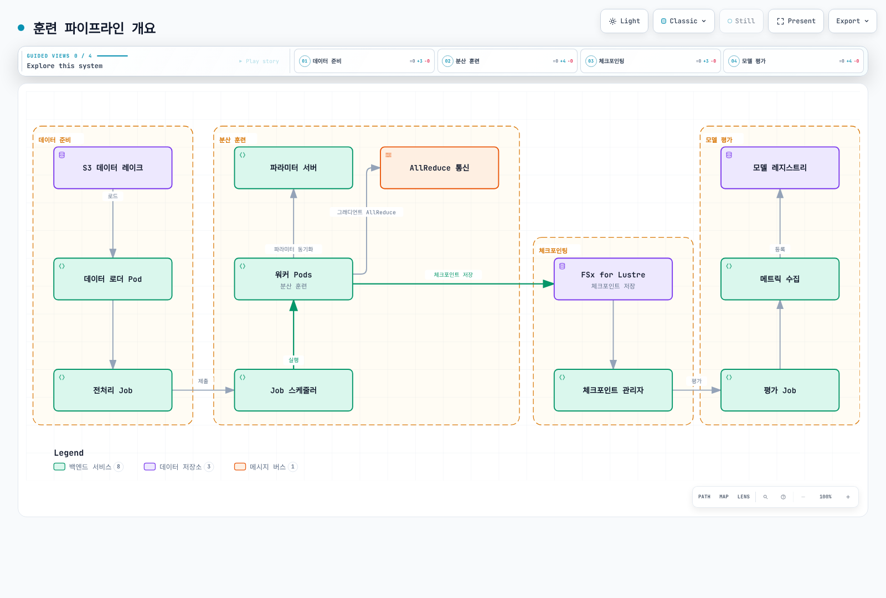
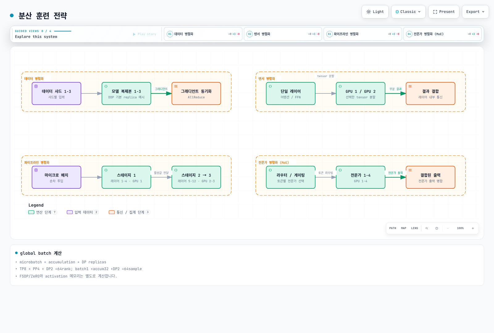
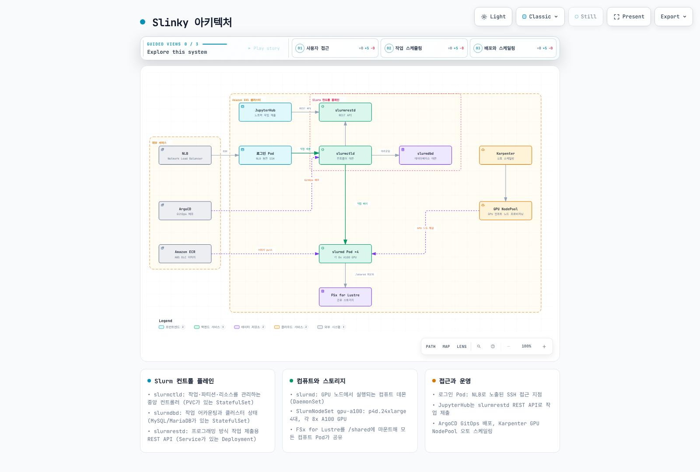

# EKS에서의 모델 훈련

> **지원 버전**: Kubernetes 1.31, 1.32, 1.33
> **마지막 업데이트**: 2026년 9월 2일

모델 훈련은 AI/ML 라이프사이클에서 가장 리소스 집약적인 워크로드입니다. 이 장에서는 분산 훈련 전략, Slinky를 통한 Slurm 통합, GPU 및 Trainium 기반 훈련, 그리고 Amazon EKS에서 대규모 훈련 작업을 실행하기 위한 모범 사례를 다룹니다.

단일 GPU QLoRA와 관리형 SageMaker AI/EKS 비교가 필요하면 [Qwen3-30B-A3B PII 파인튜닝 가이드](sagemaker-ai/README.md)를 함께 보세요. 이 예제는 동일 데이터·소스·MLflow 계약을 두 경로에 적용하고, 학습 미실행 상태도 결과와 분리해 기록합니다.

## 훈련 파이프라인 개요

Kubernetes에서의 일반적인 모델 훈련 파이프라인은 데이터 준비부터 모델 평가까지 여러 단계를 포함합니다:



[🔍 인터랙티브 다이어그램 보기](https://www.atomai.click/kubernetes-docs/archmaps/ko-ai-ml-05-model-training-0.html)

## 분산 훈련 전략

대규모 모델을 훈련하려면 여러 GPU와 노드에 걸쳐 연산을 분산해야 합니다. 다양한 병렬화 전략을 이해하는 것이 효율적인 훈련에 필수적입니다.



[🔍 인터랙티브 다이어그램 보기](https://www.atomai.click/kubernetes-docs/archmaps/ko-ai-ml-05-model-training-1.html)

### 병렬화 전략 비교

| 전략 | 적합한 경우 | 메모리 효율성 | 통신 오버헤드 | 구현 복잡도 |
|------|------------|--------------|--------------|------------|
| **데이터 병렬화** | 단일 GPU 메모리에 맞는 모델 | 낮음 (GPU당 전체 모델) | 중간 (그래디언트 동기화) | 낮음 |
| **텐서 병렬화** | 대규모 레이어 (어텐션, FFN) | 높음 (레이어 분할) | 높음 (레이어 내부) | 중간 |
| **파이프라인 병렬화** | 매우 깊은 모델 | 높음 (스테이지 분산) | 낮음 (스테이지 경계) | 중간 |
| **전문가 병렬화** | MoE 모델 (Mixtral, Switch) | 중간 | 중간 (라우팅) | 높음 |
| **3D 병렬화** | 1000억+ 파라미터 모델 | 최고 | 복합 | 매우 높음 |

### 적절한 전략 선택

```yaml
# 병렬화 선택을 위한 의사결정 매트릭스
# 모델 크기 < 100억 파라미터, 단일 GPU에 적합
strategy: data_parallelism
reason: 간단하고 효율적인 그래디언트 동기화

# 모델 크기 100억-1000억 파라미터
strategy: data_parallelism + tensor_parallelism
reason: 노드 내 GPU 간 어텐션 레이어 분할

# 모델 크기 > 1000억 파라미터
strategy: 3d_parallelism  # DP + TP + PP
reason: 최대 효율성을 위해 모든 전략 결합
```

## Slinky를 통한 EKS에서의 Slurm

Slinky는 친숙한 Slurm 워크로드 관리자를 Kubernetes에 도입하여 AI/ML 훈련 워크로드를 위한 HPC 스타일의 작업 스케줄링을 가능하게 합니다.

### Slinky 아키텍처



[🔍 인터랙티브 다이어그램 보기](https://www.atomai.click/kubernetes-docs/archmaps/ko-ai-ml-05-model-training-2.html)

### Slinky 컴포넌트

| 컴포넌트 | 설명 | Kubernetes 리소스 |
|---------|------|------------------|
| **slurmctld** | 작업, 파티션 및 리소스를 관리하는 중앙 컨트롤러 | PVC가 있는 StatefulSet |
| **slurmdbd** | 작업 어카운팅 및 클러스터 상태를 위한 데이터베이스 데몬 | MySQL/MariaDB가 있는 StatefulSet |
| **slurmd** | 각 워커 노드에서 실행되는 컴퓨트 데몬 | GPU 노드의 DaemonSet |
| **slurmrestd** | 프로그래밍 방식 작업 제출을 위한 REST API | Service가 있는 Deployment |
| **로그인 Pod** | 사용자가 작업을 제출하기 위한 SSH 접근 지점 | NLB 노출이 있는 Pod |

### Slinky CRD

Slinky는 Slurm 클러스터 관리를 위한 Custom Resource Definition을 도입합니다:

```yaml
# SlurmCluster CRD - 전체 Slurm 클러스터 구성 정의
apiVersion: slinky.slurm.net/v1alpha1
kind: SlurmCluster
metadata:
  name: ml-training-cluster
  namespace: slurm
spec:
  clusterName: ml-cluster

  # 컨트롤러 구성
  controller:
    replicas: 1
    image: schedmd/slurmctld:24.05
    resources:
      requests:
        cpu: "2"
        memory: "4Gi"
      limits:
        cpu: "4"
        memory: "8Gi"
    persistence:
      storageClass: gp3
      size: 50Gi

  # 데이터베이스 구성
  database:
    type: mariadb
    persistence:
      storageClass: gp3
      size: 100Gi

  # REST API 구성
  restApi:
    enabled: true
    replicas: 2

  # 공유 스토리지 구성
  sharedStorage:
    type: fsx-lustre
    fileSystemId: fs-0123456789abcdef0
    mountPath: /shared
---
# SlurmNodeSet CRD - 컴퓨트 노드 그룹(파티션) 정의
apiVersion: slinky.slurm.net/v1alpha1
kind: SlurmNodeSet
metadata:
  name: gpu-a100-nodes
  namespace: slurm
spec:
  clusterRef:
    name: ml-training-cluster

  partition: gpu-a100
  nodeCount: 4

  nodeTemplate:
    instanceType: p4d.24xlarge
    image: schedmd/slurmd:24.05

    # GPU 구성
    gpus:
      type: nvidia-a100
      count: 8
      mig: false

    # 리소스 할당
    resources:
      cpus: 96
      memory: 1152Gi
      gpuMemory: 320Gi  # 8x 40GB A100

    # Slurm GRES를 위한 노드 기능
    features:
      - a100
      - nvlink
      - efa

    # 저지연 통신을 위한 배치
    placement:
      groupName: ml-cluster-pg
      strategy: cluster

  # 오토 스케일링을 위한 Karpenter 통합
  autoscaling:
    enabled: true
    minNodes: 0
    maxNodes: 16
    scaleDownDelay: 300s
    nodePoolRef:
      name: gpu-a100-nodepool
```

### ArgoCD를 사용한 Slinky 배포

```yaml
# Slinky 배포를 위한 ArgoCD Application
apiVersion: argoproj.io/v1alpha1
kind: Application
metadata:
  name: slinky-slurm
  namespace: argocd
spec:
  project: ml-infrastructure

  source:
    repoURL: https://github.com/your-org/ml-platform
    targetRevision: main
    path: clusters/production/slurm

    helm:
      values: |
        cluster:
          name: ml-training

        controller:
          nodeSelector:
            node.kubernetes.io/instance-type: m6i.2xlarge

        compute:
          partitions:
            - name: gpu-a100
              nodeType: p4d.24xlarge
              maxNodes: 16
            - name: gpu-h100
              nodeType: p5.48xlarge
              maxNodes: 8
            - name: trainium
              nodeType: trn1.32xlarge
              maxNodes: 32

        storage:
          fsxLustre:
            fileSystemId: fs-0123456789abcdef0
            capacity: 4800Gi

        networking:
          efa:
            enabled: true

  destination:
    server: https://kubernetes.default.svc
    namespace: slurm

  syncPolicy:
    automated:
      prune: true
      selfHeal: true
    syncOptions:
      - CreateNamespace=true
```

### GPU 오토 스케일링을 위한 Karpenter NodePool

```yaml
# Slurm GPU 노드를 위한 Karpenter NodePool
apiVersion: karpenter.sh/v1
kind: NodePool
metadata:
  name: gpu-a100-nodepool
spec:
  template:
    metadata:
      labels:
        slurm.schedmd.com/partition: gpu-a100
        node-type: gpu-training
    spec:
      requirements:
        - key: node.kubernetes.io/instance-type
          operator: In
          values:
            - p4d.24xlarge
            - p4de.24xlarge
        - key: karpenter.sh/capacity-type
          operator: In
          values:
            - on-demand  # 훈련 안정성을 위해 온디맨드 사용
        - key: topology.kubernetes.io/zone
          operator: In
          values:
            - us-west-2a  # EFA를 위해 단일 AZ

      nodeClassRef:
        group: karpenter.k8s.aws
        kind: EC2NodeClass
        name: gpu-a100-class

      # Slurm 워크로드만 여기서 실행되도록 taint 설정
      taints:
        - key: nvidia.com/gpu
          value: "true"
          effect: NoSchedule
        - key: slurm.schedmd.com/partition
          value: gpu-a100
          effect: NoSchedule

  limits:
    nvidia.com/gpu: 128  # 최대 16노드 * 8 GPU

  disruption:
    consolidationPolicy: WhenEmpty
    consolidateAfter: 10m
    budgets:
      - nodes: "0"  # 실행 중인 훈련 작업 중단 금지
---
apiVersion: karpenter.k8s.aws/v1
kind: EC2NodeClass
metadata:
  name: gpu-a100-class
spec:
  amiFamily: AL2

  subnetSelectorTerms:
    - tags:
        karpenter.sh/discovery: ml-cluster
        network-type: efa-enabled

  securityGroupSelectorTerms:
    - tags:
        karpenter.sh/discovery: ml-cluster

  # 고속 네트워킹을 위한 EFA 구성
  instanceStorePolicy: RAID0

  # 블록 디바이스 구성
  blockDeviceMappings:
    - deviceName: /dev/xvda
      ebs:
        volumeSize: 500Gi
        volumeType: gp3
        iops: 10000
        throughput: 500
        encrypted: true

  # GPU 및 EFA 설정을 위한 사용자 데이터
  userData: |
    #!/bin/bash
    set -ex

    # EFA 드라이버 설치
    curl -O https://efa-installer.amazonaws.com/aws-efa-installer-latest.tar.gz
    tar -xf aws-efa-installer-latest.tar.gz
    cd aws-efa-installer && ./efa_installer.sh -y

    # NVIDIA 지속 모드 구성
    nvidia-smi -pm 1

    # 일관된 성능을 위한 GPU 클럭 속도 설정
    nvidia-smi -ac 1215,1410

  tags:
    Environment: production
    Workload: ml-training
```

### Slurm에 작업 제출하기

```bash
#!/bin/bash
# 분산 PyTorch 훈련을 위한 Slurm 작업 스크립트 예제

#SBATCH --job-name=llama3-finetune
#SBATCH --partition=gpu-a100
#SBATCH --nodes=4
#SBATCH --ntasks-per-node=8
#SBATCH --gpus-per-node=8
#SBATCH --cpus-per-task=12
#SBATCH --mem=1100G
#SBATCH --time=48:00:00
#SBATCH --output=/shared/logs/%x-%j.out
#SBATCH --error=/shared/logs/%x-%j.err

# 필요한 모듈 로드
module load cuda/12.1
module load nccl/2.18

# 환경 변수 설정
export MASTER_ADDR=$(scontrol show hostname $SLURM_NODELIST | head -n 1)
export MASTER_PORT=29500
export WORLD_SIZE=$((SLURM_NNODES * SLURM_NTASKS_PER_NODE))
export NCCL_DEBUG=INFO
export NCCL_IB_DISABLE=1
export NCCL_SOCKET_IFNAME=eth0

# 분산 훈련 실행
srun --ntasks=$WORLD_SIZE \
     --ntasks-per-node=$SLURM_NTASKS_PER_NODE \
     torchrun \
     --nnodes=$SLURM_NNODES \
     --nproc_per_node=$SLURM_NTASKS_PER_NODE \
     --rdzv_id=$SLURM_JOB_ID \
     --rdzv_backend=c10d \
     --rdzv_endpoint=$MASTER_ADDR:$MASTER_PORT \
     train_llama.py \
     --model_name_or_path meta-llama/Llama-3-70B \
     --dataset_path /shared/data/finetune-dataset \
     --output_dir /shared/checkpoints/llama3-finetuned \
     --per_device_train_batch_size 1 \
     --gradient_accumulation_steps 8 \
     --learning_rate 2e-5 \
     --num_train_epochs 3 \
     --bf16 \
     --deepspeed configs/ds_config_zero3.json
```

## NVIDIA GPU에서의 훈련

NVIDIA GPU는 AI/ML 훈련의 주요 선택지로 남아 있습니다. NCCL, EFA 및 멀티노드 통신의 적절한 구성이 성능에 필수적입니다.

### 멀티노드 훈련을 위한 NCCL 구성

```yaml
apiVersion: kubeflow.org/v1
kind: MPIJob
metadata:
  name: bert-large-training
  namespace: training
spec:
  slotsPerWorker: 8
  runPolicy:
    cleanPodPolicy: Running
    ttlSecondsAfterFinished: 86400

  mpiReplicaSpecs:
    Launcher:
      replicas: 1
      template:
        spec:
          containers:
            - name: mpi-launcher
              image: 763104351884.dkr.ecr.us-west-2.amazonaws.com/pytorch-training:2.1.0-gpu-py310-cu121-ubuntu20.04-ec2
              command:
                - mpirun
                - --allow-run-as-root
                - -np
                - "32"
                - -bind-to
                - none
                - -map-by
                - slot
                - -x
                - NCCL_DEBUG=INFO
                - -x
                - NCCL_ALGO=Ring
                - -x
                - NCCL_PROTO=Simple
                - -x
                - FI_PROVIDER=efa
                - -x
                - FI_EFA_USE_DEVICE_RDMA=1
                - -x
                - RDMAV_FORK_SAFE=1
                - python
                - /workspace/train_bert.py
                - --model_name=bert-large-uncased
                - --batch_size=32
                - --learning_rate=3e-5
              resources:
                limits:
                  cpu: "4"
                  memory: "16Gi"

    Worker:
      replicas: 4
      template:
        spec:
          containers:
            - name: mpi-worker
              image: 763104351884.dkr.ecr.us-west-2.amazonaws.com/pytorch-training:2.1.0-gpu-py310-cu121-ubuntu20.04-ec2
              resources:
                limits:
                  nvidia.com/gpu: 8
                  vpc.amazonaws.com/efa: 4
                  memory: "1100Gi"
                  cpu: "96"
              volumeMounts:
                - name: shared-storage
                  mountPath: /shared
                - name: shm
                  mountPath: /dev/shm
          volumes:
            - name: shared-storage
              persistentVolumeClaim:
                claimName: fsx-lustre-pvc
            - name: shm
              emptyDir:
                medium: Memory
                sizeLimit: 64Gi

          # EFA를 위한 노드 배치
          affinity:
            nodeAffinity:
              requiredDuringSchedulingIgnoredDuringExecution:
                nodeSelectorTerms:
                  - matchExpressions:
                      - key: node.kubernetes.io/instance-type
                        operator: In
                        values:
                          - p4d.24xlarge
                          - p4de.24xlarge
```

### EFA 네트워킹 구성

```yaml
# EFA Device Plugin DaemonSet
apiVersion: apps/v1
kind: DaemonSet
metadata:
  name: aws-efa-k8s-device-plugin
  namespace: kube-system
spec:
  selector:
    matchLabels:
      name: aws-efa-k8s-device-plugin
  template:
    metadata:
      labels:
        name: aws-efa-k8s-device-plugin
    spec:
      tolerations:
        - key: nvidia.com/gpu
          operator: Exists
          effect: NoSchedule
      priorityClassName: system-node-critical
      containers:
        - name: aws-efa-k8s-device-plugin
          image: 602401143452.dkr.ecr.us-west-2.amazonaws.com/eks/aws-efa-k8s-device-plugin:v0.4.4
          securityContext:
            allowPrivilegeEscalation: false
            capabilities:
              drop:
                - ALL
          volumeMounts:
            - name: device-plugin
              mountPath: /var/lib/kubelet/device-plugins
      volumes:
        - name: device-plugin
          hostPath:
            path: /var/lib/kubelet/device-plugins
      nodeSelector:
        node.kubernetes.io/instance-type: p4d.24xlarge
```

### EKS에서의 NVIDIA BioNeMo

BioNeMo는 신약 개발 및 분자 모델링을 위한 NVIDIA의 프레임워크입니다:

```yaml
apiVersion: batch/v1
kind: Job
metadata:
  name: bionemo-molecule-generation
  namespace: ai-research
spec:
  backoffLimit: 2
  template:
    spec:
      restartPolicy: OnFailure
      containers:
        - name: bionemo
          image: nvcr.io/nvidia/clara/bionemo-framework:1.5
          command:
            - python
            - -m
            - bionemo.model.molecule.megamolbart.infer
            - --config-path=/configs
            - --config-name=megamolbart_inference
          env:
            - name: CUDA_VISIBLE_DEVICES
              value: "0,1,2,3,4,5,6,7"
            - name: NVIDIA_VISIBLE_DEVICES
              value: "all"
          resources:
            limits:
              nvidia.com/gpu: 8
              memory: "500Gi"
              cpu: "48"
          volumeMounts:
            - name: model-cache
              mountPath: /models
            - name: data
              mountPath: /data
            - name: configs
              mountPath: /configs
            - name: shm
              mountPath: /dev/shm
      volumes:
        - name: model-cache
          persistentVolumeClaim:
            claimName: bionemo-models-pvc
        - name: data
          persistentVolumeClaim:
            claimName: molecule-data-pvc
        - name: configs
          configMap:
            name: bionemo-inference-config
        - name: shm
          emptyDir:
            medium: Memory
            sizeLimit: 32Gi
      nodeSelector:
        node.kubernetes.io/instance-type: p4d.24xlarge
      tolerations:
        - key: nvidia.com/gpu
          operator: Exists
          effect: NoSchedule
```

## AWS Trainium/Neuron에서의 훈련

AWS Trainium 칩은 대규모 모델 훈련을 위한 비용 효율적인 솔루션을 제공합니다. Neuron SDK는 PyTorch 및 TensorFlow 통합을 제공합니다.

### Neuron SDK 컴포넌트

| 컴포넌트 | 설명 | 목적 |
|---------|------|------|
| **Neuron Compiler** | XLA 기반 컴파일러 | Neuron 하드웨어를 위한 모델 최적화 |
| **Neuron Runtime** | 실행 런타임 | Neuron 디바이스 및 실행 관리 |
| **Neuron Tools** | 프로파일링 및 디버깅 | neuron-top, neuron-monitor, neuron-profile |
| **torch-neuronx** | PyTorch 통합 | Trainium을 위한 네이티브 PyTorch API |
| **transformers-neuronx** | HuggingFace 통합 | Neuron용 최적화된 트랜스포머 |
| **optimum-neuron** | HuggingFace Optimum | 고수준 훈련 및 추론 API |

### 지원되는 프레임워크 및 모델

```yaml
# Neuron 지원 프레임워크 및 버전
frameworks:
  pytorch:
    versions: ["2.1", "2.0", "1.13"]
    package: torch-neuronx
    models:
      - BERT, RoBERTa, DistilBERT
      - GPT-2, GPT-NeoX, GPT-J
      - Llama 2, Llama 3
      - T5, FLAN-T5
      - Stable Diffusion, SDXL

  tensorflow:
    versions: ["2.10"]
    package: tensorflow-neuronx
    models:
      - BERT, DistilBERT
      - ResNet, EfficientNet
      - SavedModel을 통한 커스텀 모델

  jax:
    versions: ["0.4"]
    package: jax-neuronx
    models:
      - 커스텀 JAX 모델
      - Flax 기반 모델
```

### Trainium에서의 Llama 3 LoRA 파인튜닝

```yaml
apiVersion: batch/v1
kind: Job
metadata:
  name: llama3-lora-finetune
  namespace: training
spec:
  parallelism: 4
  completions: 4
  template:
    metadata:
      labels:
        app: llama3-training
        training-type: lora
    spec:
      restartPolicy: OnFailure

      initContainers:
        # 모델 및 데이터셋 다운로드
        - name: setup
          image: amazon/aws-cli:latest
          command:
            - /bin/bash
            - -c
            - |
              aws s3 sync s3://my-bucket/llama3-70b /shared/models/llama3-70b
              aws s3 sync s3://my-bucket/training-data /shared/data
          volumeMounts:
            - name: shared-storage
              mountPath: /shared

      containers:
        - name: trainer
          image: 763104351884.dkr.ecr.us-west-2.amazonaws.com/pytorch-training-neuronx:2.1.0-neuronx-py310-sdk2.18.0-ubuntu20.04
          command:
            - neuron_parallel_compile
            - torchrun
            - --nproc_per_node=32
            - --nnodes=4
            - --node_rank=$(JOB_COMPLETION_INDEX)
            - --master_addr=$(MASTER_ADDR)
            - --master_port=29500
            - train_lora.py
          args:
            - --model_id=/shared/models/llama3-70b
            - --dataset_path=/shared/data/instruct-dataset
            - --output_dir=/shared/checkpoints/llama3-lora
            - --lora_rank=16
            - --lora_alpha=32
            - --lora_dropout=0.1
            - --target_modules=q_proj,k_proj,v_proj,o_proj
            - --per_device_train_batch_size=1
            - --gradient_accumulation_steps=16
            - --learning_rate=2e-4
            - --num_train_epochs=3
            - --warmup_ratio=0.03
            - --bf16
            - --gradient_checkpointing
            - --save_strategy=steps
            - --save_steps=500
          env:
            - name: NEURON_RT_NUM_CORES
              value: "32"
            - name: NEURON_CC_FLAGS
              value: "--model-type transformer --distribution-strategy llm-training"
            - name: XLA_USE_BF16
              value: "1"
            - name: MASTER_ADDR
              valueFrom:
                fieldRef:
                  fieldPath: status.podIP
            - name: JOB_COMPLETION_INDEX
              valueFrom:
                fieldRef:
                  fieldPath: metadata.annotations['batch.kubernetes.io/job-completion-index']
          resources:
            limits:
              aws.amazon.com/neuron: 16  # 16 Trainium 칩 = trn1.32xlarge
              memory: "500Gi"
              cpu: "128"
            requests:
              aws.amazon.com/neuron: 16
              memory: "450Gi"
              cpu: "120"
          volumeMounts:
            - name: shared-storage
              mountPath: /shared
            - name: neuron-cache
              mountPath: /var/tmp/neuron-compile-cache

      volumes:
        - name: shared-storage
          persistentVolumeClaim:
            claimName: fsx-lustre-pvc
        - name: neuron-cache
          emptyDir:
            sizeLimit: 100Gi

      nodeSelector:
        node.kubernetes.io/instance-type: trn1.32xlarge

      tolerations:
        - key: aws.amazon.com/neuron
          operator: Exists
          effect: NoSchedule
```

### NeuronX Distributed를 사용한 Trainium에서의 BERT-Large 훈련

```python
# train_bert_neuronx.py - 훈련 스크립트 예제
import os
import torch
import torch_neuronx
from torch.utils.data import DataLoader
from transformers import BertForPreTraining, BertTokenizer
from optimum.neuron import NeuronTrainer, NeuronTrainingArguments
from optimum.neuron.distributed import lazy_load_for_parallelism

# 분산 훈련 초기화
torch.distributed.init_process_group(backend='xla')
world_size = torch.distributed.get_world_size()
rank = torch.distributed.get_rank()

# 텐서 병렬화로 모델 로드
with lazy_load_for_parallelism(tensor_parallel_size=8):
    model = BertForPreTraining.from_pretrained(
        "bert-large-uncased",
        torch_dtype=torch.bfloat16
    )

# 훈련 인자 구성
training_args = NeuronTrainingArguments(
    output_dir="/shared/checkpoints/bert-large",
    per_device_train_batch_size=16,
    gradient_accumulation_steps=4,
    learning_rate=1e-4,
    num_train_epochs=3,
    warmup_steps=1000,
    weight_decay=0.01,
    logging_steps=100,
    save_steps=1000,
    bf16=True,
    tensor_parallel_size=8,
    pipeline_parallel_size=1,
    zero_1=True,
)

# 트레이너 생성
trainer = NeuronTrainer(
    model=model,
    args=training_args,
    train_dataset=train_dataset,
    tokenizer=tokenizer,
)

# 훈련 시작
trainer.train()
```

### Trainium 노드 구성

```yaml
# Trainium 인스턴스를 위한 Karpenter NodePool
apiVersion: karpenter.sh/v1
kind: NodePool
metadata:
  name: trainium-nodepool
spec:
  template:
    metadata:
      labels:
        accelerator-type: trainium
        node-type: ml-training
    spec:
      requirements:
        - key: node.kubernetes.io/instance-type
          operator: In
          values:
            - trn1.32xlarge
            - trn1n.32xlarge  # 향상된 네트워킹
        - key: karpenter.sh/capacity-type
          operator: In
          values:
            - on-demand
        - key: topology.kubernetes.io/zone
          operator: In
          values:
            - us-east-1a

      nodeClassRef:
        group: karpenter.k8s.aws
        kind: EC2NodeClass
        name: trainium-class

      taints:
        - key: aws.amazon.com/neuron
          value: "true"
          effect: NoSchedule

  limits:
    aws.amazon.com/neuron: 256  # 최대 16노드 * 16칩

  disruption:
    consolidationPolicy: WhenEmpty
    consolidateAfter: 15m
---
apiVersion: karpenter.k8s.aws/v1
kind: EC2NodeClass
metadata:
  name: trainium-class
spec:
  amiFamily: AL2
  amiSelectorTerms:
    - id: ami-0123456789abcdef0  # Neuron 최적화 AMI

  subnetSelectorTerms:
    - tags:
        karpenter.sh/discovery: ml-cluster

  securityGroupSelectorTerms:
    - tags:
        karpenter.sh/discovery: ml-cluster

  blockDeviceMappings:
    - deviceName: /dev/xvda
      ebs:
        volumeSize: 500Gi
        volumeType: gp3
        iops: 10000
        encrypted: true

  userData: |
    #!/bin/bash
    # Neuron 드라이버 및 도구 설치
    . /etc/os-release
    sudo tee /etc/yum.repos.d/neuron.repo > /dev/null <<EOF
    [neuron]
    name=Neuron YUM Repository
    baseurl=https://yum.repos.neuron.amazonaws.com
    enabled=1
    metadata_expire=0
    EOF
    sudo rpm --import https://yum.repos.neuron.amazonaws.com/GPG-PUB-KEY-AMAZON-AWS-NEURON.PUB
    sudo yum install -y aws-neuronx-runtime-lib aws-neuronx-collectives

    # Neuron용 ulimit 증가
    echo "* soft nofile 65535" | sudo tee -a /etc/security/limits.conf
    echo "* hard nofile 65535" | sudo tee -a /etc/security/limits.conf
```

## 훈련 인프라 컴포넌트

### 분산 훈련을 위한 KubeRay와 RayTrain

```yaml
apiVersion: ray.io/v1
kind: RayCluster
metadata:
  name: raytrain-cluster
  namespace: training
spec:
  rayVersion: '2.9.0'

  headGroupSpec:
    rayStartParams:
      dashboard-host: '0.0.0.0'
      num-cpus: '0'
    template:
      spec:
        containers:
          - name: ray-head
            image: rayproject/ray-ml:2.9.0-py310-gpu
            ports:
              - containerPort: 6379
                name: gcs
              - containerPort: 8265
                name: dashboard
              - containerPort: 10001
                name: client
            resources:
              limits:
                cpu: "8"
                memory: "32Gi"
              requests:
                cpu: "4"
                memory: "16Gi"

  workerGroupSpecs:
    - groupName: gpu-workers
      replicas: 4
      minReplicas: 1
      maxReplicas: 16
      rayStartParams:
        num-gpus: '8'
      template:
        spec:
          containers:
            - name: ray-worker
              image: rayproject/ray-ml:2.9.0-py310-gpu
              resources:
                limits:
                  nvidia.com/gpu: 8
                  memory: "500Gi"
                  cpu: "96"
              volumeMounts:
                - name: shared-storage
                  mountPath: /shared
          volumes:
            - name: shared-storage
              persistentVolumeClaim:
                claimName: fsx-lustre-pvc
          nodeSelector:
            node.kubernetes.io/instance-type: p4d.24xlarge
          tolerations:
            - key: nvidia.com/gpu
              operator: Exists
              effect: NoSchedule
```

```python
# ray_train_example.py - RayTrain 분산 훈련
import ray
from ray import train
from ray.train.torch import TorchTrainer
from ray.train import ScalingConfig, RunConfig, CheckpointConfig

def train_loop_per_worker(config):
    import torch
    from transformers import AutoModelForCausalLM, AutoTokenizer, Trainer, TrainingArguments

    # 분산 컨텍스트 가져오기
    world_size = train.get_context().get_world_size()
    rank = train.get_context().get_world_rank()

    # 모델 로드
    model = AutoModelForCausalLM.from_pretrained(
        config["model_name"],
        torch_dtype=torch.bfloat16
    )

    # 훈련 루프
    for epoch in range(config["epochs"]):
        # ... 훈련 로직 ...

        # Ray에 메트릭 보고
        train.report({"loss": loss, "epoch": epoch})

        # 체크포인트 저장
        if rank == 0:
            with train.get_checkpoint() as checkpoint:
                torch.save(model.state_dict(), checkpoint.path / "model.pt")

# 트레이너 구성
trainer = TorchTrainer(
    train_loop_per_worker,
    train_loop_config={
        "model_name": "meta-llama/Llama-3-8B",
        "epochs": 3,
        "learning_rate": 2e-5,
    },
    scaling_config=ScalingConfig(
        num_workers=4,
        use_gpu=True,
        resources_per_worker={"GPU": 8, "CPU": 24},
    ),
    run_config=RunConfig(
        name="llama3-training",
        storage_path="/shared/ray-results",
        checkpoint_config=CheckpointConfig(
            num_to_keep=3,
            checkpoint_frequency=100,
        ),
    ),
)

result = trainer.fit()
```

### 전통적인 HPC 워크로드를 위한 MPI Operator

```yaml
# MPI Operator 설치
apiVersion: v1
kind: Namespace
metadata:
  name: mpi-operator
---
apiVersion: apps/v1
kind: Deployment
metadata:
  name: mpi-operator
  namespace: mpi-operator
spec:
  replicas: 1
  selector:
    matchLabels:
      app: mpi-operator
  template:
    metadata:
      labels:
        app: mpi-operator
    spec:
      serviceAccountName: mpi-operator
      containers:
        - name: mpi-operator
          image: mpioperator/mpi-operator:v0.4.0
          args:
            - --gpus-per-node=8
            - --kubectl-delivery-image=mpioperator/kubectl-delivery:v0.4.0
          imagePullPolicy: Always
```

### Gang 스케줄링을 위한 Volcano 스케줄러

```yaml
# ML 훈련을 위한 Volcano 구성
apiVersion: scheduling.volcano.sh/v1beta1
kind: Queue
metadata:
  name: ml-training-queue
spec:
  weight: 100
  capability:
    nvidia.com/gpu: 128
    cpu: "1000"
    memory: "8000Gi"
---
apiVersion: batch.volcano.sh/v1alpha1
kind: Job
metadata:
  name: distributed-training
  namespace: training
spec:
  minAvailable: 4  # Gang 스케줄링: 4개 파드 모두 함께 스케줄링되어야 함
  schedulerName: volcano
  queue: ml-training-queue

  policies:
    - event: PodEvicted
      action: RestartJob
    - event: PodFailed
      action: RestartJob

  tasks:
    - name: worker
      replicas: 4
      template:
        spec:
          containers:
            - name: pytorch
              image: pytorch/pytorch:2.1.0-cuda12.1-cudnn8-runtime
              command:
                - torchrun
                - --nproc_per_node=8
                - --nnodes=4
                - train.py
              resources:
                limits:
                  nvidia.com/gpu: 8
```

### 대화형 훈련 개발을 위한 JupyterHub

```yaml
# GPU 지원이 있는 JupyterHub
apiVersion: v1
kind: ConfigMap
metadata:
  name: jupyterhub-config
  namespace: jupyter
data:
  jupyterhub_config.py: |
    c.JupyterHub.spawner_class = 'kubespawner.KubeSpawner'

    # GPU 프로필
    c.KubeSpawner.profile_list = [
        {
            'display_name': 'GPU 개발 (1x A100)',
            'kubespawner_override': {
                'image': 'jupyter/tensorflow-notebook:latest',
                'extra_resource_limits': {'nvidia.com/gpu': '1'},
                'node_selector': {'node.kubernetes.io/instance-type': 'g5.xlarge'},
            }
        },
        {
            'display_name': '멀티 GPU 개발 (8x A100)',
            'kubespawner_override': {
                'image': 'jupyter/tensorflow-notebook:latest',
                'extra_resource_limits': {'nvidia.com/gpu': '8'},
                'node_selector': {'node.kubernetes.io/instance-type': 'p4d.24xlarge'},
                'volumes': [
                    {
                        'name': 'shared-storage',
                        'persistentVolumeClaim': {'claimName': 'fsx-lustre-pvc'}
                    }
                ],
                'volume_mounts': [
                    {'name': 'shared-storage', 'mountPath': '/shared'}
                ]
            }
        },
        {
            'display_name': 'Trainium 개발 (16x Trainium)',
            'kubespawner_override': {
                'image': '763104351884.dkr.ecr.us-west-2.amazonaws.com/pytorch-training-neuronx:2.1.0',
                'extra_resource_limits': {'aws.amazon.com/neuron': '16'},
                'node_selector': {'node.kubernetes.io/instance-type': 'trn1.32xlarge'},
            }
        },
    ]
```

## 훈련을 위한 스토리지

### FSx for Lustre 구성

```yaml
# S3 데이터 리포지토리가 있는 FSx for Lustre 파일 시스템
apiVersion: fsx.services.k8s.aws/v1alpha1
kind: FileSystem
metadata:
  name: ml-training-lustre
  namespace: storage
spec:
  fileSystemType: LUSTRE
  storageCapacity: 4800
  subnetIDs:
    - subnet-0123456789abcdef0
  securityGroupIDs:
    - sg-0123456789abcdef0

  lustreConfiguration:
    deploymentType: PERSISTENT_2
    perUnitStorageThroughput: 250  # TiB당 MB/s

    # S3 데이터 리포지토리 연관
    dataRepositoryAssociations:
      - fileSystemPath: /data
        dataRepositoryPath: s3://my-ml-data-bucket/training-data
        batchImportMetaDataOnCreate: true
        s3:
          autoImportPolicy:
            events:
              - NEW
              - CHANGED
          autoExportPolicy:
            events:
              - NEW
              - CHANGED
              - DELETED

      - fileSystemPath: /checkpoints
        dataRepositoryPath: s3://my-ml-data-bucket/checkpoints
        s3:
          autoExportPolicy:
            events:
              - NEW
              - CHANGED

  tags:
    - key: Environment
      value: production
    - key: Workload
      value: ml-training
---
# 동적 FSx 프로비저닝을 위한 StorageClass
apiVersion: storage.k8s.io/v1
kind: StorageClass
metadata:
  name: fsx-lustre-sc
provisioner: fsx.csi.aws.com
parameters:
  subnetId: subnet-0123456789abcdef0
  securityGroupIds: sg-0123456789abcdef0
  deploymentType: SCRATCH_2
  perUnitStorageThroughput: "200"
volumeBindingMode: WaitForFirstConsumer
---
# FSx Lustre용 PVC
apiVersion: v1
kind: PersistentVolumeClaim
metadata:
  name: fsx-lustre-pvc
  namespace: training
spec:
  accessModes:
    - ReadWriteMany
  storageClassName: fsx-lustre-sc
  resources:
    requests:
      storage: 4800Gi
```

### 공유 모델 스토리지를 위한 Amazon EFS

```yaml
apiVersion: storage.k8s.io/v1
kind: StorageClass
metadata:
  name: efs-sc
provisioner: efs.csi.aws.com
parameters:
  provisioningMode: efs-ap
  fileSystemId: fs-0123456789abcdef0
  directoryPerms: "755"
  gidRangeStart: "1000"
  gidRangeEnd: "2000"
  basePath: "/ml-models"
---
apiVersion: v1
kind: PersistentVolumeClaim
metadata:
  name: model-storage-pvc
  namespace: training
spec:
  accessModes:
    - ReadWriteMany
  storageClassName: efs-sc
  resources:
    requests:
      storage: 1Ti
```

### 체크포인트 관리

```yaml
# 체크포인트 관리자 사이드카
apiVersion: v1
kind: ConfigMap
metadata:
  name: checkpoint-manager-config
  namespace: training
data:
  config.yaml: |
    checkpoint:
      # 훈련이 체크포인트를 쓰는 로컬 경로
      local_path: /checkpoints

      # 내구성 있는 스토리지를 위한 원격 경로
      remote_path: s3://my-bucket/checkpoints

      # 동기화 설정
      sync_interval: 300  # 초
      max_checkpoints: 5  # 마지막 N개 체크포인트 유지

      # 압축
      compression: true
      compression_level: 6

      # 재개
      auto_resume: true
      resume_from_latest: true
---
apiVersion: apps/v1
kind: Deployment
metadata:
  name: training-with-checkpoint-manager
spec:
  template:
    spec:
      containers:
        - name: trainer
          # ... 훈련 컨테이너 ...
          volumeMounts:
            - name: checkpoints
              mountPath: /checkpoints

        - name: checkpoint-manager
          image: my-registry/checkpoint-manager:v1
          args:
            - --config=/config/config.yaml
            - --watch
          volumeMounts:
            - name: checkpoints
              mountPath: /checkpoints
            - name: config
              mountPath: /config

      volumes:
        - name: checkpoints
          emptyDir:
            sizeLimit: 500Gi
        - name: config
          configMap:
            name: checkpoint-manager-config
```

## 훈련 최적화 팁

### 혼합 정밀도 훈련

```python
# torch.cuda.amp를 사용한 PyTorch 혼합 정밀도
import torch
from torch.cuda.amp import autocast, GradScaler

model = MyModel().cuda()
optimizer = torch.optim.AdamW(model.parameters(), lr=1e-4)
scaler = GradScaler()

for epoch in range(num_epochs):
    for batch in dataloader:
        optimizer.zero_grad()

        # 자동 혼합 정밀도로 순방향 패스
        with autocast(dtype=torch.bfloat16):
            outputs = model(batch['input_ids'])
            loss = loss_fn(outputs, batch['labels'])

        # 그래디언트 스케일링으로 역방향 패스
        scaler.scale(loss).backward()

        # 그래디언트 클리핑
        scaler.unscale_(optimizer)
        torch.nn.utils.clip_grad_norm_(model.parameters(), max_norm=1.0)

        # 옵티마이저 스텝
        scaler.step(optimizer)
        scaler.update()
```

### 그래디언트 누적

```yaml
# 그래디언트 누적이 있는 훈련 구성
apiVersion: v1
kind: ConfigMap
metadata:
  name: training-config
data:
  config.yaml: |
    training:
      # 유효 배치 크기 = micro_batch * gradient_accumulation * num_gpus
      # 1 * 32 * 64 = 2048 유효 배치 크기
      micro_batch_size: 1
      gradient_accumulation_steps: 32

      # 메모리 최적화
      gradient_checkpointing: true
      activation_checkpointing_granularity: selective

      # 정밀도
      precision: bf16

      # 학습률
      learning_rate: 2e-5
      lr_scheduler: cosine
      warmup_ratio: 0.03

      # 옵티마이저
      optimizer: adamw_torch_fused
      weight_decay: 0.01
```

### Flash Attention 구성

```python
# transformers에서 Flash Attention 2 활성화
from transformers import AutoModelForCausalLM

model = AutoModelForCausalLM.from_pretrained(
    "meta-llama/Llama-3-70B",
    torch_dtype=torch.bfloat16,
    attn_implementation="flash_attention_2",  # Flash Attention 활성화
    use_cache=False,  # 훈련 중 KV 캐시 비활성화
)

# 커스텀 모델의 경우 torch.nn.functional.scaled_dot_product_attention 사용
import torch.nn.functional as F

def attention_forward(q, k, v, mask=None):
    # 사용 가능할 때 자동으로 Flash Attention 사용
    return F.scaled_dot_product_attention(
        q, k, v,
        attn_mask=mask,
        dropout_p=0.0 if not training else 0.1,
        is_causal=True,  # 인과 마스킹 최적화 활성화
    )
```

### 학습률 스케줄링 모범 사례

```python
# 웜업이 있는 코사인 어닐링
from torch.optim.lr_scheduler import CosineAnnealingWarmRestarts, LambdaLR

def get_cosine_schedule_with_warmup(optimizer, num_warmup_steps, num_training_steps, min_lr_ratio=0.1):
    def lr_lambda(current_step):
        if current_step < num_warmup_steps:
            # 선형 웜업
            return float(current_step) / float(max(1, num_warmup_steps))

        # 코사인 어닐링
        progress = float(current_step - num_warmup_steps) / float(max(1, num_training_steps - num_warmup_steps))
        return max(min_lr_ratio, 0.5 * (1.0 + math.cos(math.pi * progress)))

    return LambdaLR(optimizer, lr_lambda)

# 사용
scheduler = get_cosine_schedule_with_warmup(
    optimizer,
    num_warmup_steps=1000,
    num_training_steps=100000,
    min_lr_ratio=0.1
)
```

### DeepSpeed ZeRO 구성

```json
{
  "bf16": {
    "enabled": true
  },
  "zero_optimization": {
    "stage": 3,
    "offload_optimizer": {
      "device": "cpu",
      "pin_memory": true
    },
    "offload_param": {
      "device": "cpu",
      "pin_memory": true
    },
    "overlap_comm": true,
    "contiguous_gradients": true,
    "sub_group_size": 1e9,
    "reduce_bucket_size": "auto",
    "stage3_prefetch_bucket_size": "auto",
    "stage3_param_persistence_threshold": "auto",
    "stage3_max_live_parameters": 1e9,
    "stage3_max_reuse_distance": 1e9,
    "stage3_gather_16bit_weights_on_model_save": true
  },
  "gradient_accumulation_steps": 32,
  "gradient_clipping": 1.0,
  "train_micro_batch_size_per_gpu": 1,
  "wall_clock_breakdown": false,
  "communication_data_type": "bf16"
}
```

## 모범 사례 요약

| 카테고리 | 모범 사례 | 이점 |
|---------|----------|------|
| **병렬화** | 1000억+ 모델에 3D 병렬화 사용 | 최대 메모리 효율성 |
| **통신** | 멀티노드 훈련에 EFA 활성화 | 400 Gbps 네트워킹 |
| **스토리지** | S3 데이터 리포지토리와 함께 FSx Lustre 사용 | 높은 처리량 + 내구성 |
| **체크포인팅** | N 스텝마다 저장, 마지막 3-5개 유지 | 스토리지와 복구 균형 |
| **정밀도** | 안정성을 위해 FP16 대신 BF16 사용 | 손실 스케일링 불필요 |
| **메모리** | 그래디언트 체크포인팅 활성화 | 3-4배 메모리 절약 |
| **스케줄링** | Gang 스케줄링에 Volcano 사용 | 전부 아니면 전무 파드 배치 |
| **스케일링** | GPU NodePool과 함께 Karpenter 사용 | 자동 GPU 프로비저닝 |

## 참고 자료

- [AI on EKS](https://awslabs.github.io/ai-on-eks/) - EKS에서 AI/ML 워크로드 배포를 위한 AWS 가이드 및 예제
- [Slinky - Slurm on Kubernetes](https://github.com/SchedMD/slurm-operator) - SchedMD의 Kubernetes용 Slurm 오퍼레이터
- [AWS Neuron 문서](https://awsdocs.github.io/aws-neuron-documentation/) - Trainium 및 Inferentia용 Neuron SDK
- [NVIDIA NCCL 문서](https://docs.nvidia.com/deeplearning/nccl/) - 집합 통신 라이브러리
- [DeepSpeed 문서](https://www.deepspeed.ai/) - Microsoft의 분산 훈련 라이브러리
- [KubeRay 문서](https://ray-project.github.io/kuberay/) - Kubernetes의 Ray

## 퀴즈

이 장에서 배운 내용을 테스트하려면 [모델 훈련 퀴즈](../quizzes/ai-ml/05-model-training-quiz.md)를 풀어보세요.
